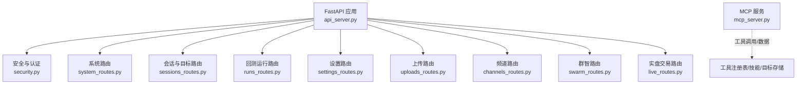
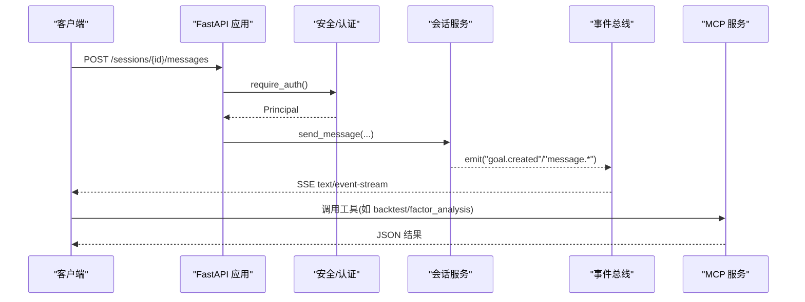
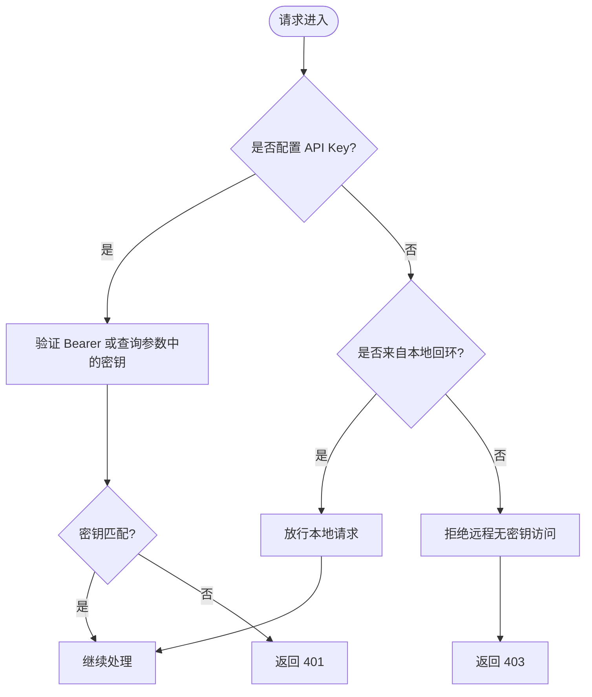
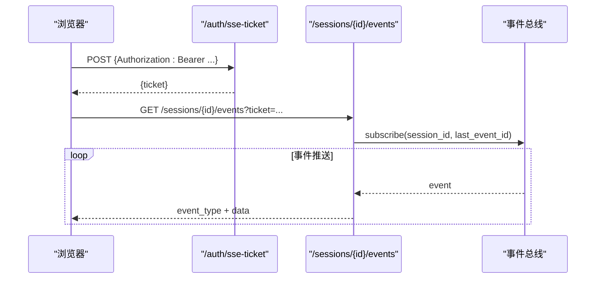
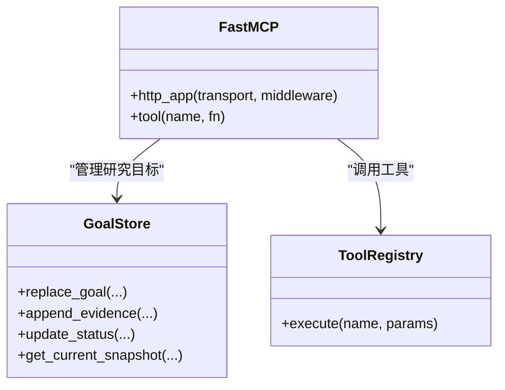
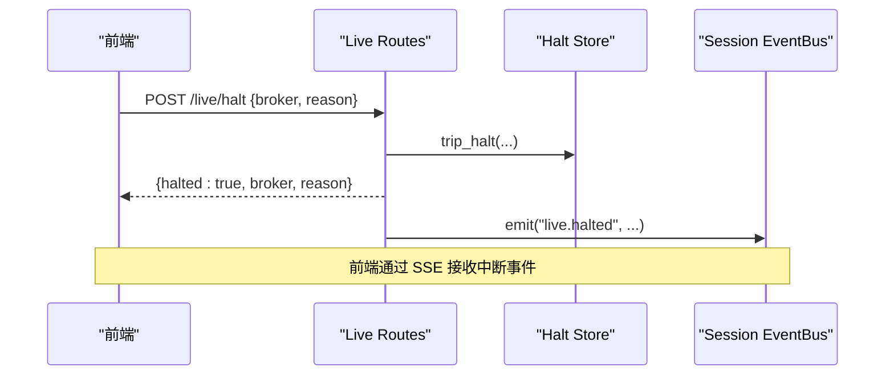
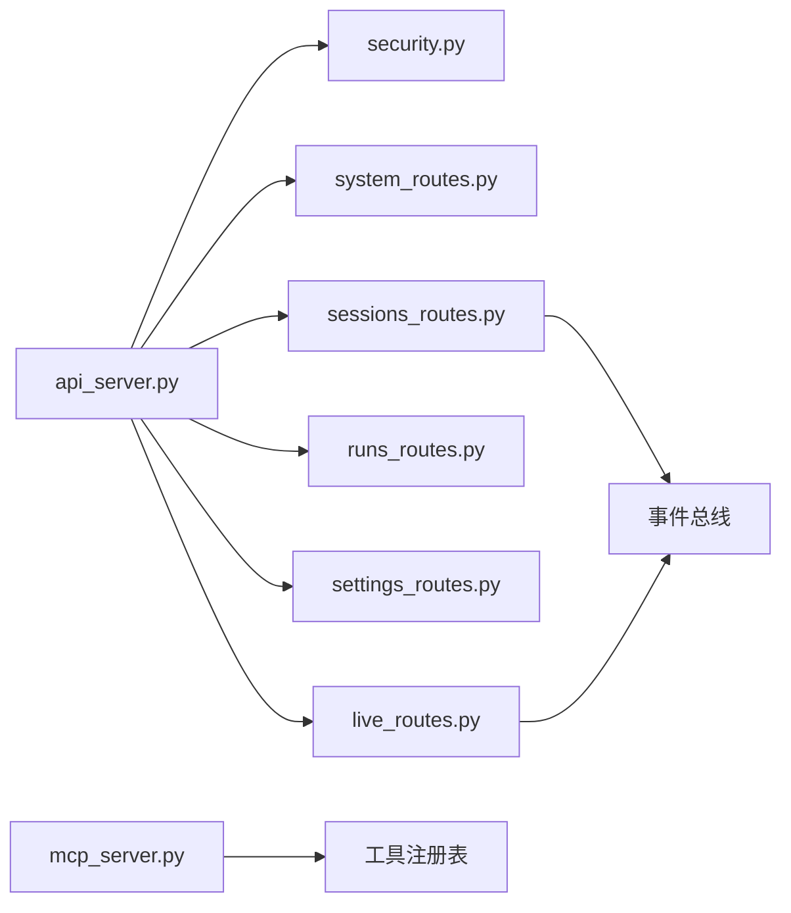

# API 服务器文档

<cite>
**本文引用的文件**
- [api_server.py](file://agent/api_server.py)
- [mcp_server.py](file://agent/mcp_server.py)
- [security.py](file://agent/src/api/security.py)
- [auth_routes.py](file://agent/src/api/auth_routes.py)
- [system_routes.py](file://agent/src/api/system_routes.py)
- [sessions_routes.py](file://agent/src/api/sessions_routes.py)
- [runs_routes.py](file://agent/src/api/runs_routes.py)
- [live_routes.py](file://agent/src/api/live_routes.py)
- [settings_routes.py](file://agent/src/api/settings_routes.py)
</cite>

## 目录
1. [简介](#简介)
2. [项目结构](#项目结构)
3. [核心组件](#核心组件)
4. [架构总览](#架构总览)
5. [详细组件分析](#详细组件分析)
6. [依赖关系分析](#依赖关系分析)
7. [性能与扩展性](#性能与扩展性)
8. [故障排查指南](#故障排查指南)
9. [结论](#结论)
10. [附录：API 参考](#附录api-参考)

## 简介
本文件为 Vibe-Trading API 服务器的完整技术文档，面向 API 消费者与集成开发者。内容覆盖：
- REST API 端点设计、HTTP 方法、URL 模式、请求/响应格式与认证机制
- WebSocket/SSE 实时通信协议（连接处理、消息格式、事件类型、交互模式）
- Model Context Protocol (MCP) 服务实现细节（工具调用、数据传输、状态管理）
- 安全策略（认证授权、速率限制、输入校验、CORS/CSP、DNS 重绑定防护）
- 调试与监控（健康检查、可读性探针、日志脱敏、OpenAPI/文档访问控制）
- 客户端集成示例与最佳实践

## 项目结构
Vibe-Trading API 基于 FastAPI 构建，采用“模块化路由 + 共享安全/模型/助手”的分层组织方式：
- 应用入口与生命周期：统一创建 FastAPI 实例、挂载中间件、注册各业务路由模块
- 安全与认证：统一的鉴权依赖、SSE 票据、CORS/Host/Origin 校验、安全响应头
- 业务路由：会话/目标、回测运行、系统信息、设置、上传、频道、群智、实盘交易等
- MCP 服务：独立进程/ASGI，暴露研究工具集，支持 stdio、SSE、Streamable HTTP 传输

**图示来源**
- [api_server.py:163-303](file://agent/api_server.py#L163-L303)
- [security.py:166-253](file://agent/src/api/security.py#L166-L253)
- [system_routes.py:197-469](file://agent/src/api/system_routes.py#L197-L469)
- [sessions_routes.py:289-800](file://agent/src/api/sessions_routes.py#L289-L800)
- [runs_routes.py:237-456](file://agent/src/api/runs_routes.py#L237-L456)
- [settings_routes.py:492-690](file://agent/src/api/settings_routes.py#L492-L690)
- [live_routes.py:632-800](file://agent/src/api/live_routes.py#L632-L800)
- [mcp_server.py:306-316](file://agent/mcp_server.py#L306-L316)

**章节来源**
- [api_server.py:163-303](file://agent/api_server.py#L163-L303)

## 核心组件
- 应用装配器：创建 FastAPI 实例、安装 CORS、安全头、SPA 静态资源、启动/关闭钩子
- 安全中心：API Key/Bearer 认证、SSE 票据、跨站请求拒绝、本地回环信任、CORS/Host/Origin 校验、日志脱敏
- 路由模块：按功能域划分，通过 register_*_routes(app) 挂载到主应用
- MCP 服务：提供金融研究工具集，支持多种传输；默认禁用 shell 工具，需显式启用

**章节来源**
- [api_server.py:127-183](file://agent/api_server.py#L127-L183)
- [security.py:343-623](file://agent/src/api/security.py#L343-L623)
- [mcp_server.py:94-131](file://agent/mcp_server.py#L94-L131)

## 架构总览
整体由“REST API + SSE 事件流 + MCP 工具服务”构成。REST 负责配置、会话、回测、设置、实盘控制；SSE 用于会话事件推送；MCP 暴露研究工具供外部智能体或桌面客户端使用。

**图示来源**
- [sessions_routes.py:697-800](file://agent/src/api/sessions_routes.py#L697-L800)
- [security.py:571-623](file://agent/src/api/security.py#L571-L623)
- [mcp_server.py:497-800](file://agent/mcp_server.py#L497-L800)

## 详细组件分析

### 认证与安全
- 认证方式
  - Bearer Token：通过 HTTP Authorization 头传递 API Key
  - SSE 票据：浏览器 EventSource 无法携带 Authorization 头，先通过 POST /auth/sse-ticket 换取一次性 ticket，再在 ?ticket= 中使用
  - 本地回环信任：未配置 API Key 时仅允许本机访问
- 安全中间件
  - CORS：默认允许本地开发端口，支持额外白名单
  - Host/Origin 校验：防止 DNS 重绑定与跨站请求
  - 安全响应头：CSP、X-Content-Type-Options、X-Frame-Options、Permissions-Policy、Referrer-Policy
  - 访问日志脱敏：对 api_key=/ticket= 值进行脱敏
- 关键依赖
  - require_auth：通用鉴权依赖
  - require_event_stream_auth：SSE 专用鉴权（支持 Bearer 或 ticket）
  - require_local_or_auth：设置读取的宽松鉴权
  - require_settings_write_auth：设置写入的严格鉴权

**图示来源**
- [security.py:463-504](file://agent/src/api/security.py#L463-L504)
- [security.py:591-623](file://agent/src/api/security.py#L591-L623)
- [auth_routes.py:46-56](file://agent/src/api/auth_routes.py#L46-L56)

**章节来源**
- [security.py:166-253](file://agent/src/api/security.py#L166-L253)
- [security.py:343-623](file://agent/src/api/security.py#L343-L623)
- [auth_routes.py:21-56](file://agent/src/api/auth_routes.py#L21-L56)

### REST API 端点概览
- 系统与健康
  - GET /live, /health：进程存活检查
  - GET /ready：就绪检查（LLM 提供者可用性）
  - GET /correlation, /correlation/regime：相关性矩阵与时序（受速率限制）
  - POST /system/shutdown：本地受控关机
  - GET /skills：列出可用技能（需认证）
  - GET /api：服务元信息
  - GET /openapi.json：OpenAPI 模式（需认证）
  - GET /docs, /redoc：文档界面（仅在无密钥本地模式下可用）
- 会话与目标
  - /sessions：创建、列举、获取、更新、删除会话
  - /sessions/{id}/goal：创建/获取/更新/状态变更、追加证据
  - /sessions/{id}/messages：发送消息触发 Agent 循环
  - /sessions/{id}/events：SSE 事件流（支持 Last-Event-ID 与回放）
- 回测运行
  - /runs：列举最近运行
  - /runs/{id}：获取运行详情（含图表优化参数）
  - /runs/{id}/code, /runs/{id}/pine：获取策略源码与 Pine 脚本
- 设置
  - /settings/llm：读取/更新 LLM 设置
  - /settings/llm/models：发现模型列表
  - /settings/data-sources：读取/更新数据源凭据
- 上传、频道、群智、实盘交易
  - 上传：分块上传与大小/扩展名限制
  - 频道：多渠道消息通道管理
  - 群智：Swarm 编排相关接口
  - 实盘：委托提交、中止/恢复、状态查询、Runner 启停

**章节来源**
- [system_routes.py:235-469](file://agent/src/api/system_routes.py#L235-L469)
- [sessions_routes.py:335-800](file://agent/src/api/sessions_routes.py#L335-L800)
- [runs_routes.py:273-456](file://agent/src/api/runs_routes.py#L273-L456)
- [settings_routes.py:513-690](file://agent/src/api/settings_routes.py#L513-L690)
- [live_routes.py:650-800](file://agent/src/api/live_routes.py#L650-L800)

### SSE 实时通信协议
- 连接建立
  - 浏览器侧先 POST /auth/sse-ticket 获取一次性 ticket（需 Header 认证）
  - 使用 EventSource 连接 /sessions/{id}/events?ticket=...
- 消息格式
  - 标准 SSE：text/event-stream，包含 event_type、data、session_id
  - 特殊帧：mandate.proposal、live.action 由工具结果派生并转发
- 事件类型
  - goal.created、goal.updated、goal.evidence
  - live.halted、live.resumed、live.action
  - mandate.committed
- 断线续传
  - 支持 Last-Event-ID 与 replay=active 以重放当前运行事件

**图示来源**
- [auth_routes.py:46-56](file://agent/src/api/auth_routes.py#L46-L56)
- [sessions_routes.py:752-800](file://agent/src/api/sessions_routes.py#L752-L800)
- [security.py:591-623](file://agent/src/api/security.py#L591-L623)

**章节来源**
- [sessions_routes.py:752-800](file://agent/src/api/sessions_routes.py#L752-L800)
- [auth_routes.py:21-56](file://agent/src/api/auth_routes.py#L21-L56)

### MCP 服务（Model Context Protocol）
- 传输方式
  - stdio（默认）、SSE（遗留）、Streamable HTTP（推荐）
  - 网络传输通过 Host/Origin 白名单防护 DNS 重绑定
- 工具能力
  - 技能加载、研究目标、回测、因子分析、期权、市场数据、基本面、资金流、新闻、发现、量化计算、交易连接器只读、交易日志与影子账户分析等
  - 所有工具均为只读或研究用途，不暴露下单/撤单
- 会话与状态
  - 每个进程维护一个稳定 session_id，可被客户端显式传入
  - 目标（Goal）生命周期：创建、追加证据、审计、状态更新
- 安全开关
  - Shell 工具默认关闭，需显式环境变量或命令行启用

**图示来源**
- [mcp_server.py:306-316](file://agent/mcp_server.py#L306-L316)
- [mcp_server.py:532-738](file://agent/mcp_server.py#L532-L738)
- [mcp_server.py:792-847](file://agent/mcp_server.py#L792-L847)

**章节来源**
- [mcp_server.py:1-52](file://agent/mcp_server.py#L1-L52)
- [mcp_server.py:94-131](file://agent/mcp_server.py#L94-L131)
- [mcp_server.py:306-316](file://agent/mcp_server.py#L306-L316)
- [mcp_server.py:497-800](file://agent/mcp_server.py#L497-L800)

### 实盘交易控制面
- 委托提交：POST /mandate/commit（唯一写路径，需用户明确同意）
- 中止/恢复：POST /live/halt、/live/resume（全局或按券商）
- 状态查询：GET /live/status（认证、活跃委托、Runner 心跳、中止标志）
- Runner 控制：POST /live/runner/start、/stop（需已存在有效委托）
- 事件广播：通过现有 Session EventBus 推送 mandate.committed、live.halted、live.action

**图示来源**
- [live_routes.py:841-877](file://agent/src/api/live_routes.py#L841-L877)
- [live_routes.py:340-355](file://agent/src/api/live_routes.py#L340-L355)

**章节来源**
- [live_routes.py:650-800](file://agent/src/api/live_routes.py#L650-L800)

## 依赖关系分析
- 应用装配依赖
  - 安全中间件与依赖注入：require_auth、require_event_stream_auth 等
  - 各路由模块通过 register_*_routes(app) 动态挂载，避免循环导入
- 运行时依赖
  - 会话服务、事件总线、目标存储、工具注册表、渠道运行时、定时研究执行器
- 外部集成
  - LLM 提供商（OpenAI/Ollama 等）、数据源（yfinance/AKShare/CCXT 等）、券商连接器（OAuth/SDK/MCP）

**图示来源**
- [api_server.py:189-303](file://agent/api_server.py#L189-L303)
- [sessions_routes.py:320-350](file://agent/src/api/sessions_routes.py#L320-L350)
- [live_routes.py:742-758](file://agent/src/api/live_routes.py#L742-L758)
- [mcp_server.py:319-334](file://agent/mcp_server.py#L319-L334)

**章节来源**
- [api_server.py:189-303](file://agent/api_server.py#L189-L303)

## 性能与扩展性
- 速率限制
  - 相关性计算接口内置滑动窗口限流（每客户端 IP 每分钟 30 次），保护后端计算资源
- 缓存
  - 连接器状态校验结果缓存（TTL 15 秒），减少重复探测
- 资源释放
  - 启动预检与计划任务启动；关闭时有序停止频道运行时与计划任务
- 可扩展点
  - 新增路由：遵循 register_*_routes(app) 模式
  - 新增工具：在 MCP 中通过 @mcp.tool 注册，保持只读/研究导向
  - 新增数据源/LLM：通过 settings 路由动态切换

**章节来源**
- [system_routes.py:62-130](file://agent/src/api/system_routes.py#L62-L130)
- [live_routes.py:180-220](file://agent/src/api/live_routes.py#L180-L220)
- [api_server.py:127-161](file://agent/api_server.py#L127-L161)

## 故障排查指南
- 健康与就绪
  - GET /live：确认进程存活
  - GET /ready：确认 LLM 提供者配置与凭据可用
- 认证问题
  - 401：缺少或无效 API Key；SSE 票据过期或被复用
  - 403：跨站请求、非本地且未配置 Key、Host/Origin 不在白名单
- 速率限制
  - 429：相关性接口超限，稍后重试
- 会话与目标
  - 404：会话不存在；目标快照无法重新加载
  - 409：会话忙或目标版本冲突（StaleGoalError）
- 实盘控制
  - 400：委托提交参数错误（consent_ack 必须为 true）
  - 503：Runner 不可用（券商未配置或未授权）

**章节来源**
- [system_routes.py:242-310](file://agent/src/api/system_routes.py#L242-L310)
- [security.py:463-504](file://agent/src/api/security.py#L463-L504)
- [sessions_routes.py:443-630](file://agent/src/api/sessions_routes.py#L443-L630)
- [live_routes.py:650-721](file://agent/src/api/live_routes.py#L650-L721)

## 结论
Vibe-Trading API 提供了完整的金融研究与交易工作流支撑：REST 接口用于配置与会话管理，SSE 提供低延迟事件推送，MCP 暴露丰富的研究工具。系统内置完善的安全与防护机制，适合本地开发与生产部署。建议在生产环境启用 API Key、合理配置 CORS/Host/Origin 白名单，并结合上游反向代理实施 TLS 终止与更严格的 CSP。

## 附录：API 参考

### 认证与票据
- POST /auth/sse-ticket
  - 方法：POST
  - 描述：获取一次性 SSE 票据（需 Bearer 认证）
  - 响应：{ ticket: string }
- 事件流鉴权
  - GET /sessions/{id}/events?ticket=...
  - 描述：SSE 事件流，支持 Last-Event-ID 与 replay=active

**章节来源**
- [auth_routes.py:46-56](file://agent/src/api/auth_routes.py#L46-L56)
- [sessions_routes.py:752-800](file://agent/src/api/sessions_routes.py#L752-L800)
- [security.py:591-623](file://agent/src/api/security.py#L591-L623)

### 系统与诊断
- GET /live, /health
  - 描述：进程存活检查
- GET /ready
  - 描述：就绪检查（LLM 提供者可用性）
- GET /correlation
  - 描述：相关性矩阵（需认证，速率限制）
- GET /correlation/regime
  - 描述：相关性时序（需认证，速率限制）
- POST /system/shutdown
  - 描述：本地受控关机（需认证）
- GET /skills
  - 描述：列出技能（需认证）
- GET /api
  - 描述：服务元信息
- GET /openapi.json
  - 描述：OpenAPI 模式（需认证）
- GET /docs, /redoc
  - 描述：文档界面（仅本地无密钥模式）

**章节来源**
- [system_routes.py:235-469](file://agent/src/api/system_routes.py#L235-L469)

### 会话与目标
- POST /sessions
  - 描述：创建会话
- GET /sessions
  - 描述：列举会话
- GET /sessions/{id}
  - 描述：获取会话
- PATCH /sessions/{id}
  - 描述：更新会话字段
- DELETE /sessions/{id}
  - 描述：删除会话
- POST /sessions/{id}/goal
  - 描述：创建/替换研究目标
- GET /sessions/{id}/goal
  - 描述：获取当前目标快照
- PATCH /sessions/{id}/goal
  - 描述：编辑目标
- POST /sessions/{id}/goal/evidence
  - 描述：追加证据
- PATCH /sessions/{id}/goal/status
  - 描述：更新目标状态
- POST /sessions/{id}/messages
  - 描述：发送消息触发 Agent 循环
- POST /sessions/{id}/cancel
  - 描述：取消当前循环
- GET /sessions/{id}/messages
  - 描述：获取消息列表
- GET /sessions/{id}/events
  - 描述：SSE 事件流

**章节来源**
- [sessions_routes.py:335-800](file://agent/src/api/sessions_routes.py#L335-L800)

### 回测运行
- GET /runs
  - 描述：列举最近运行
- GET /runs/{id}
  - 描述：获取运行详情（可选 chart_symbol/chart_payload）
- GET /runs/{id}/code
  - 描述：获取策略源码
- GET /runs/{id}/pine
  - 描述：获取 Pine 脚本

**章节来源**
- [runs_routes.py:273-456](file://agent/src/api/runs_routes.py#L273-L456)

### 设置
- GET /settings/llm
  - 描述：读取 LLM 设置
- PUT /settings/llm
  - 描述：更新 LLM 设置（需写权限）
- POST /settings/llm/models
  - 描述：发现模型列表（需写权限）
- GET /settings/data-sources
  - 描述：读取数据源设置
- PUT /settings/data-sources
  - 描述：更新数据源设置（需写权限）

**章节来源**
- [settings_routes.py:513-690](file://agent/src/api/settings_routes.py#L513-L690)

### 实盘交易
- POST /mandate/commit
  - 描述：提交委托（需用户明确同意 consent_ack=true）
- POST /live/halt
  - 描述：触发中止（全局或按券商）
- POST /live/resume
  - 描述：清除中止
- GET /live/status
  - 描述：查询实盘状态（认证）
- POST /live/runner/start
  - 描述：启动 Runner（需已存在有效委托）
- POST /live/runner/stop
  - 描述：停止 Runner

**章节来源**
- [live_routes.py:650-800](file://agent/src/api/live_routes.py#L650-L800)

### MCP 工具（部分）
- list_skills / load_skill
  - 描述：列出/加载技能文档
- start_research_goal / get_research_goal
  - 描述：创建/获取研究目标
- add_goal_evidence / update_research_goal_status
  - 描述：追加证据/更新目标状态
- backtest
  - 描述：运行向量回测
- factor_analysis
  - 描述：因子 IC/IR 分析与分层回测

**章节来源**
- [mcp_server.py:497-800](file://agent/mcp_server.py#L497-L800)

### 客户端集成示例与最佳实践
- 认证
  - 服务端配置 API Key；客户端在 Authorization: Bearer <key> 中携带
  - 浏览器 EventSource 先 POST /auth/sse-ticket 获取 ticket，再用 ?ticket= 连接 SSE
- 会话与事件
  - 创建会话后，订阅 /sessions/{id}/events，使用 Last-Event-ID 实现断线续传
  - 监听 goal.created、goal.updated、goal.evidence、live.halted、live.action 等事件
- 回测与运行
  - 通过 /runs 列举与 /runs/{id} 获取详情；必要时使用 chart_symbol/chart_payload 优化负载
- 设置
  - 通过 /settings/llm 与 /settings/data-sources 动态调整 LLM 与数据源配置
- 安全
  - 生产环境务必启用 API Key；配置 CORS/Host/Origin 白名单；结合反向代理启用 TLS 与 CSP

[无需来源：此小节为通用实践总结]