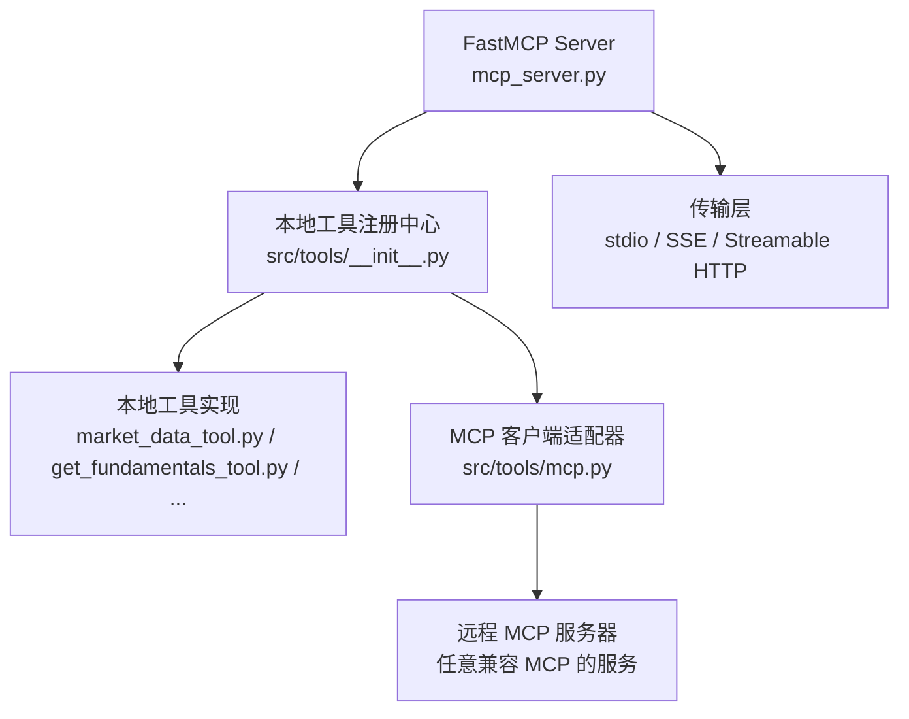
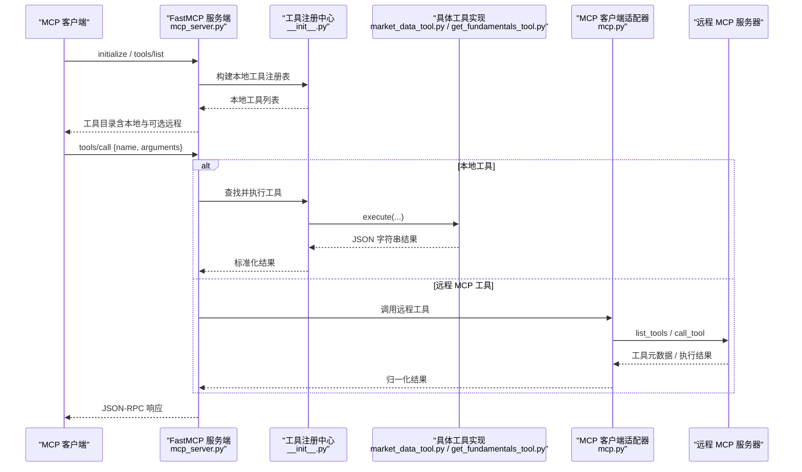
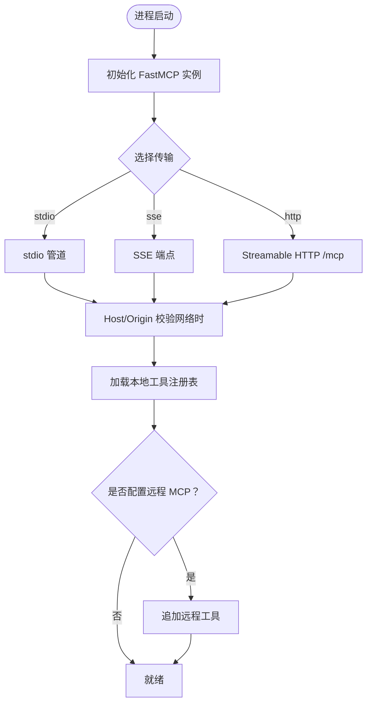
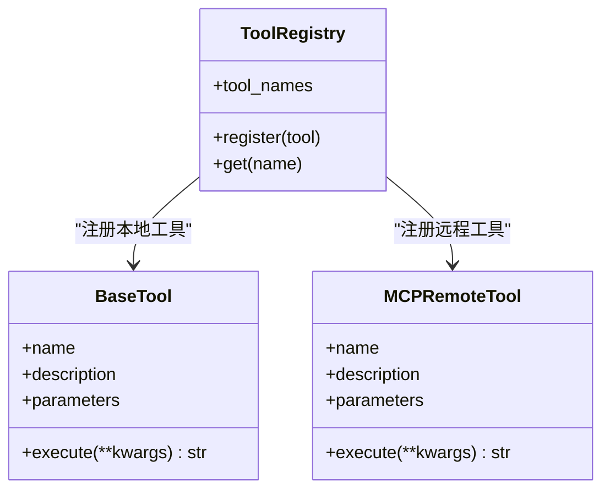
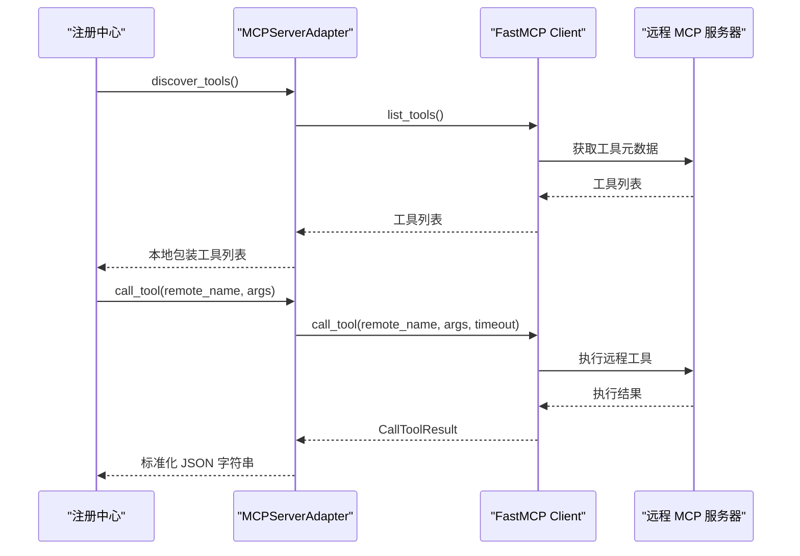
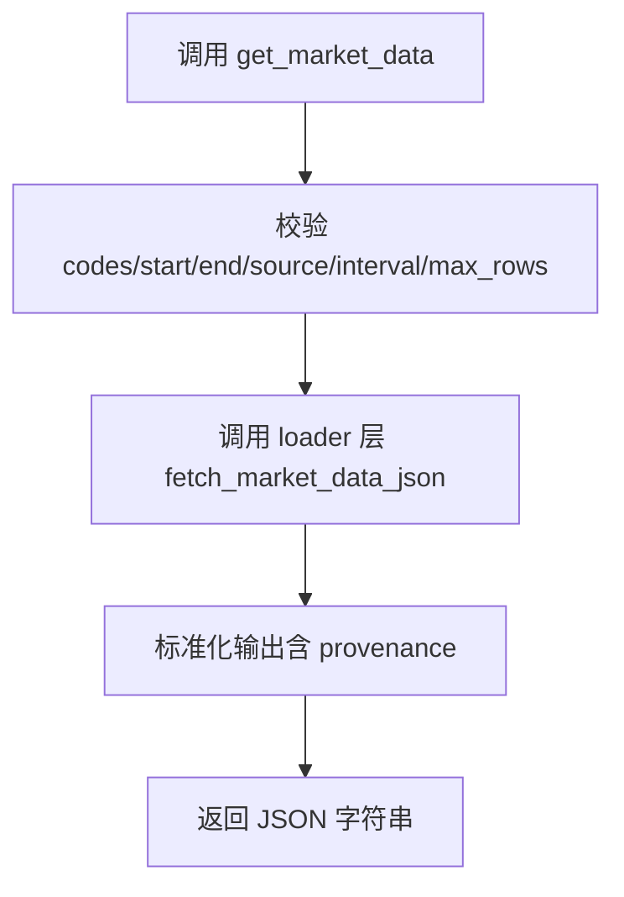
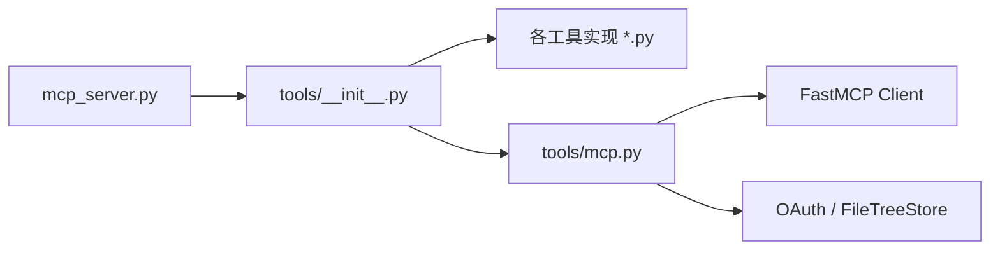
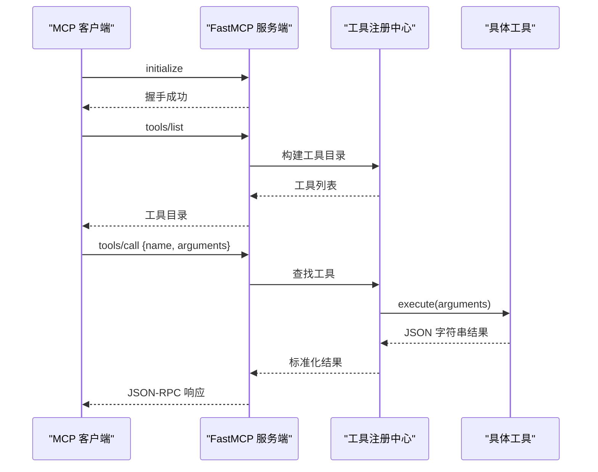

# Model Context Protocol (MCP)

<cite>
**本文引用的文件**
- [agent/mcp_server.py](file://agent/mcp_server.py)
- [agent/src/tools/mcp.py](file://agent/src/tools/mcp.py)
- [agent/src/tools/__init__.py](file://agent/src/tools/__init__.py)
- [agent/src/tools/market_data_tool.py](file://agent/src/tools/market_data_tool.py)
- [agent/src/tools/get_fundamentals_tool.py](file://agent/src/tools/get_fundamentals_tool.py)
- [agent/tests/test_mcp_server_smoke.py](file://agent/tests/test_mcp_server_smoke.py)
</cite>

## 目录
1. [简介](#简介)
2. [项目结构](#项目结构)
3. [核心组件](#核心组件)
4. [架构总览](#架构总览)
5. [详细组件分析](#详细组件分析)
6. [依赖关系分析](#依赖关系分析)
7. [性能考虑](#性能考虑)
8. [故障排查指南](#故障排查指南)
9. [结论](#结论)
10. [附录：工具清单与调用示例](#附录工具清单与调用示例)

## 简介
本技术文档面向第三方开发者，系统化说明 Vibe-Trading 中的 Model Context Protocol（MCP）服务。内容涵盖协议设计原理、架构模式、工具发现与调用机制、数据交换格式；完整文档化已暴露的 MCP 工具（名称、描述、参数、返回值）；提供客户端集成指南（连接配置、工具注册、调用示例）；阐述安全策略（输入校验、权限控制、资源限制）；给出性能优化建议（缓存、并发、错误恢复）；并包含调试与监控方法，帮助开发者正确集成和使用 MCP 服务。

## 项目结构
Vibe-Trading 将 MCP 能力以“本地工具 + 远程 MCP 工具”的统一方式暴露给上层 Agent/CLI/HTTP 服务：
- MCP 服务端入口：基于 FastMCP 实现，支持 stdio、SSE、Streamable HTTP 三种传输。
- 工具注册中心：自动发现本地 BaseTool 子类，并在可选情况下合并远程 MCP 工具。
- 客户端适配器：通过 FastMCP Client 对接外部 MCP 服务器，将远端工具包装成本地可执行对象。

图表来源
- [agent/mcp_server.py:71-83](file://agent/mcp_server.py#L71-L83)
- [agent/src/tools/__init__.py:76-125](file://agent/src/tools/__init__.py#L76-L125)
- [agent/src/tools/mcp.py:312-375](file://agent/src/tools/mcp.py#L312-L375)

章节来源
- [agent/mcp_server.py:1-52](file://agent/mcp_server.py#L1-L52)
- [agent/src/tools/__init__.py:1-10](file://agent/src/tools/__init__.py#L1-L10)

## 核心组件
- MCP 服务端（FastMCP）：负责工具声明、JSON-RPC 请求处理、传输适配与安全中间件。
- 工具注册中心：自动扫描 src/tools 下的 BaseTool 子类，构建统一 ToolRegistry；可按配置注入远程 MCP 工具。
- MCP 客户端适配器：封装 FastMCP Client，实现工具发现、参数规范化、结果归一化、重试与缓存。
- 典型工具实现：市场数据、基本面、回测、因子分析等只读或研究型工具，遵循统一的参数与返回约定。

章节来源
- [agent/mcp_server.py:71-83](file://agent/mcp_server.py#L71-L83)
- [agent/src/tools/__init__.py:76-125](file://agent/src/tools/__init__.py#L76-L125)
- [agent/src/tools/mcp.py:312-375](file://agent/src/tools/mcp.py#L312-L375)

## 架构总览
下图展示了从客户端到服务端再到工具执行的端到端流程，包括工具发现、调用与结果返回。

图表来源
- [agent/mcp_server.py:71-83](file://agent/mcp_server.py#L71-L83)
- [agent/src/tools/__init__.py:76-125](file://agent/src/tools/__init__.py#L76-L125)
- [agent/src/tools/mcp.py:625-659](file://agent/src/tools/mcp.py#L625-L659)

## 详细组件分析

### 1) MCP 服务端（FastMCP）
- 启动与传输：支持 stdio（默认）、SSE（遗留）、Streamable HTTP（当前规范默认）。
- 安全中间件：对网络传输启用 Host/Origin 白名单校验，防止 DNS 重绑定攻击；默认仅允许回环地址。
- 工具注册：优先注册本地工具；若配置了 MCP 服务器，则追加远程工具；所有通过 MCP 暴露的工具必须为只读或研究用途。
- 会话与审计：内置研究目标（Goal）生命周期管理，支持证据追加、状态更新与审计行。

图表来源
- [agent/mcp_server.py:31-39](file://agent/mcp_server.py#L31-L39)
- [agent/mcp_server.py:132-318](file://agent/mcp_server.py#L132-L318)
- [agent/mcp_server.py:319-344](file://agent/mcp_server.py#L319-L344)

章节来源
- [agent/mcp_server.py:1-52](file://agent/mcp_server.py#L1-L52)
- [agent/mcp_server.py:132-318](file://agent/mcp_server.py#L132-L318)
- [agent/mcp_server.py:497-524](file://agent/mcp_server.py#L497-L524)
- [agent/mcp_server.py:532-737](file://agent/mcp_server.py#L532-L737)

### 2) 工具注册中心（本地 + 远程）
- 本地工具：通过导入 src/tools 包下所有模块，收集 BaseTool 子类并注册；支持按需排除 shell 工具。
- 远程工具：当 agent_config 中配置 mcp_servers 时，使用 MCP 客户端适配器发现并包装远端工具，按顺序追加到注册表末尾。
- 隔离与容错：单个远程服务器失败不影响其他服务器与本地工具；对冲突的服务器名进行去重并告警。

图表来源
- [agent/src/tools/__init__.py:33-63](file://agent/src/tools/__init__.py#L33-L63)
- [agent/src/tools/__init__.py:76-125](file://agent/src/tools/__init__.py#L76-L125)
- [agent/src/tools/mcp.py:672-708](file://agent/src/tools/mcp.py#L672-L708)

章节来源
- [agent/src/tools/__init__.py:1-10](file://agent/src/tools/__init__.py#L1-L10)
- [agent/src/tools/__init__.py:66-245](file://agent/src/tools/__init__.py#L66-L245)

### 3) MCP 客户端适配器（远程工具桥接）
- 工具发现：调用远程服务器的 list_tools，过滤 enabled_tools，生成稳定的本地工具名（mcp_<server>_<tool>），并对 schema 做 OpenAI 兼容归一化。
- 调用执行：封装 call_tool，支持超时、错误归一化、重试（仅限瞬态错误）；结果转换为标准 JSON 字符串。
- 缓存与键：对工具发现结果进行进程内缓存，键由服务器名、类型、命令、参数、环境变量、enabled_tools、URL、Headers、OAuth 指纹组成，避免明文敏感信息泄露。
- 传输与认证：支持 stdio、SSE、Streamable HTTP；对 HTTP 传输支持 OAuth 持久化存储（FileTreeStore，权限 0700）。

图表来源
- [agent/src/tools/mcp.py:312-375](file://agent/src/tools/mcp.py#L312-L375)
- [agent/src/tools/mcp.py:444-480](file://agent/src/tools/mcp.py#L444-L480)
- [agent/src/tools/mcp.py:625-659](file://agent/src/tools/mcp.py#L625-L659)
- [agent/src/tools/mcp.py:518-578](file://agent/src/tools/mcp.py#L518-L578)

章节来源
- [agent/src/tools/mcp.py:1-800](file://agent/src/tools/mcp.py#L1-L800)

### 4) 典型工具实现（示例）
- 市场数据工具（get_market_data）：通过统一 loader 层拉取 OHLCV 数据，支持多源（yfinance、OKX、AKShare、CCXT、tushare 等），返回标准化 JSON 并附带数据来源与单位说明。
- 基本面工具（get_fundamentals）：读取 SEC XBRL 等基本面字段，按 PIT 对齐，返回宽面板记录；严格校验输入并返回结构化错误。

图表来源
- [agent/src/tools/market_data_tool.py:11-107](file://agent/src/tools/market_data_tool.py#L11-L107)

章节来源
- [agent/src/tools/market_data_tool.py:1-107](file://agent/src/tools/market_data_tool.py#L1-L107)
- [agent/src/tools/get_fundamentals_tool.py:64-200](file://agent/src/tools/get_fundamentals_tool.py#L64-L200)

## 依赖关系分析
- 服务端依赖 FastMCP 提供的工具装饰器与 HTTP/SSE/stdio 传输能力。
- 注册中心依赖 BaseTool 子类自动发现机制，以及可选的 MCP 客户端适配器。
- 客户端适配器依赖 FastMCP Client、OAuth、文件树存储（token 持久化）与异常重试逻辑。
- 工具实现依赖统一的 market_data/fundamentals/loader 层，保证数据一致性与可追溯性。

图表来源
- [agent/mcp_server.py:71-83](file://agent/mcp_server.py#L71-L83)
- [agent/src/tools/__init__.py:76-125](file://agent/src/tools/__init__.py#L76-L125)
- [agent/src/tools/mcp.py:518-578](file://agent/src/tools/mcp.py#L518-L578)

章节来源
- [agent/mcp_server.py:71-83](file://agent/mcp_server.py#L71-L83)
- [agent/src/tools/__init__.py:66-245](file://agent/src/tools/__init__.py#L66-L245)
- [agent/src/tools/mcp.py:518-578](file://agent/src/tools/mcp.py#L518-L578)

## 性能考虑
- 冷启动与预加热：测试用例强调 registry 预加热以避免首次调用阻塞；建议在进程启动阶段预热工具注册表。
- 工具发现缓存：对远程工具发现结果进行进程内缓存，减少重复网络开销；缓存键对敏感信息进行指纹化处理。
- 超时与重试：远程调用设置 tool_timeout；list_tools 支持瞬态错误重试（默认 2 次），但工具调用不自动重试以避免幂等问题。
- 并发与线程：异步操作在同步上下文中通过线程运行，避免阻塞主事件循环；注意线程安全与锁的使用。
- I/O 与序列化：工具返回 JSON 字符串，便于跨进程/网络传输；必要时对大数据集进行分页或限流（如 max_rows）。

章节来源
- [agent/tests/test_mcp_server_smoke.py:1-46](file://agent/tests/test_mcp_server_smoke.py#L1-L46)
- [agent/src/tools/mcp.py:222-253](file://agent/src/tools/mcp.py#L222-L253)
- [agent/src/tools/mcp.py:799-834](file://agent/src/tools/mcp.py#L799-L834)
- [agent/src/tools/mcp.py:905-937](file://agent/src/tools/mcp.py#L905-L937)

## 故障排查指南
- 工具不可用或注册失败：检查依赖是否满足、工具 check_available 是否返回 False；查看日志中的跳过原因。
- 远程服务器连接失败：确认 transport、url、headers、auth 配置；观察重试日志与错误类型；必要时降低 init_timeout 或调整 tool_timeout。
- 工具返回空或错误：检查参数是否符合 schema；关注 _error 包裹的结构化错误；核对数据源可用性。
- 安全拦截：网络传输被拒绝时检查 Host/Origin 白名单；确保仅允许受信任域名/IP。
- 死锁与卡顿：确保 registry 在进程启动时预热；避免在首次调用时才构建注册表。

章节来源
- [agent/src/tools/__init__.py:136-154](file://agent/src/tools/__init__.py#L136-L154)
- [agent/src/tools/mcp.py:625-659](file://agent/src/tools/mcp.py#L625-L659)
- [agent/mcp_server.py:231-305](file://agent/mcp_server.py#L231-L305)
- [agent/tests/test_mcp_server_smoke.py:134-200](file://agent/tests/test_mcp_server_smoke.py#L134-L200)

## 结论
Vibe-Trading 的 MCP 服务以 FastMCP 为核心，结合本地工具自动发现与远程工具桥接，提供了统一、安全、可扩展的研究与分析能力。通过严格的输入校验、传输安全、权限控制与性能优化，确保了在生产环境中的稳定性与安全性。第三方开发者可依据本文档快速集成、扩展与运维 MCP 服务。

## 附录：工具清单与调用示例

### 已暴露的 MCP 工具（部分示例）
- 技能与知识
  - list_skills：列出可用金融技能名称与描述。
  - load_skill：加载指定技能的完整文档。
- 研究目标（Goal）
  - start_research_goal：创建或替换当前研究目标（研究/分析专用，非交易执行）。
  - get_research_goal：获取当前研究目标快照。
  - add_goal_evidence：追加可追踪的证据到研究目标。
  - update_research_goal_status：更新研究目标状态（完成/取消/阻塞等）。
- 市场与基本面
  - get_market_data：获取标准化 OHLCV 数据，支持多数据源与区间查询。
  - get_fundamentals：获取 PIT 对齐的基本面字段面板（SEC 等）。
- 回测与因子
  - backtest：基于 config.json 与信号引擎执行向量化回测。
  - factor_analysis：基于 CSV 计算因子 IC/IR 与分层回测。
- 其他研究与分析工具
  - options_chain、options_payoff、quantlib_call、cashflow_performance、orderbook_depth、sentiment、technical_indicators 等（均为只读或研究用途）。

章节来源
- [agent/mcp_server.py:497-524](file://agent/mcp_server.py#L497-L524)
- [agent/mcp_server.py:532-737](file://agent/mcp_server.py#L532-L737)
- [agent/mcp_server.py:792-847](file://agent/mcp_server.py#L792-L847)
- [agent/src/tools/market_data_tool.py:11-107](file://agent/src/tools/market_data_tool.py#L11-L107)
- [agent/src/tools/get_fundamentals_tool.py:64-200](file://agent/src/tools/get_fundamentals_tool.py#L64-L200)

### 工具调用流程（端到端）

图表来源
- [agent/tests/test_mcp_server_smoke.py:134-200](file://agent/tests/test_mcp_server_smoke.py#L134-L200)
- [agent/src/tools/__init__.py:76-125](file://agent/src/tools/__init__.py#L76-L125)

### 客户端集成指南
- 连接配置
  - stdio：通过命令行启动 mcp_server.py，父进程通过 stdin/stdout 通信。
  - SSE：GET /sse + POST /messages/（遗留传输）。
  - Streamable HTTP：POST/GET /mcp（当前规范默认）。
- 工具注册
  - 本地工具：无需额外配置，启动后自动发现。
  - 远程工具：在 agent_config 中配置 mcp_servers（command/url/headers/auth/enabled_tools），注册中心会自动发现并包装为本地工具。
- 调用示例
  - 先调用 tools/list 获取工具目录。
  - 再调用 tools/call 传入工具名与参数，解析返回的 JSON 字符串。

章节来源
- [agent/mcp_server.py:31-39](file://agent/mcp_server.py#L31-L39)
- [agent/src/tools/__init__.py:185-275](file://agent/src/tools/__init__.py#L185-L275)
- [agent/tests/test_mcp_server_smoke.py:134-200](file://agent/tests/test_mcp_server_smoke.py#L134-L200)

### 安全考虑
- 输入验证：工具参数通过 Pydantic/JSON Schema 校验；对非法输入返回结构化错误。
- 权限控制：仅暴露只读或研究工具；shell 工具默认关闭，需显式启用；对 live broker 工具进行网关与授权检查。
- 资源限制：max_rows 限制数据量；tool_timeout 限制调用时长；init_timeout 控制初始化超时。
- 网络安全：Host/Origin 白名单防护 DNS 重绑定；OAuth token 持久化目录权限 0700。

章节来源
- [agent/mcp_server.py:132-318](file://agent/mcp_server.py#L132-L318)
- [agent/src/tools/mcp.py:510-537](file://agent/src/tools/mcp.py#L510-L537)
- [agent/src/tools/__init__.py:136-154](file://agent/src/tools/__init__.py#L136-L154)

### 性能优化建议
- 预加热：进程启动时预热工具注册表，避免首次调用阻塞。
- 缓存：对远程工具发现结果进行进程内缓存；对高频数据可引入应用层缓存（如内存/磁盘）。
- 并发：合理使用异步与线程；避免在关键路径上进行阻塞 I/O。
- 错误恢复：对瞬态错误进行有限重试；对幂等操作谨慎重试，避免副作用重复。

章节来源
- [agent/tests/test_mcp_server_smoke.py:1-46](file://agent/tests/test_mcp_server_smoke.py#L1-L46)
- [agent/src/tools/mcp.py:222-253](file://agent/src/tools/mcp.py#L222-L253)
- [agent/src/tools/mcp.py:799-834](file://agent/src/tools/mcp.py#L799-L834)

### 调试与监控
- 日志：关注工具注册、远程服务器连接、错误与警告日志。
- 测试：使用 smoke 测试验证 initialize/tools/list/tools/call 全链路。
- 指标：可在工具层埋点统计调用次数、耗时、错误率；对远程调用增加超时与重试计数。

章节来源
- [agent/tests/test_mcp_server_smoke.py:134-200](file://agent/tests/test_mcp_server_smoke.py#L134-L200)
- [agent/src/tools/__init__.py:136-154](file://agent/src/tools/__init__.py#L136-L154)