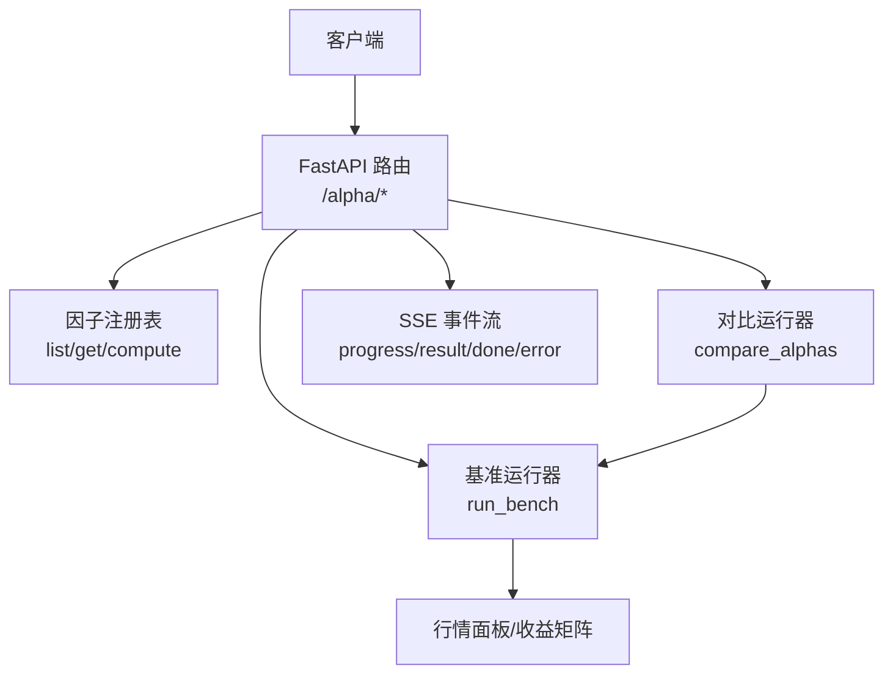
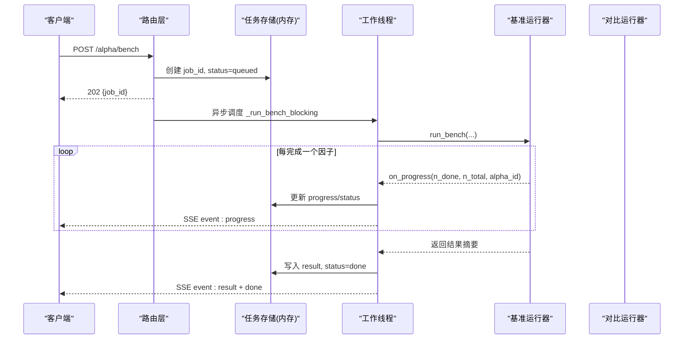
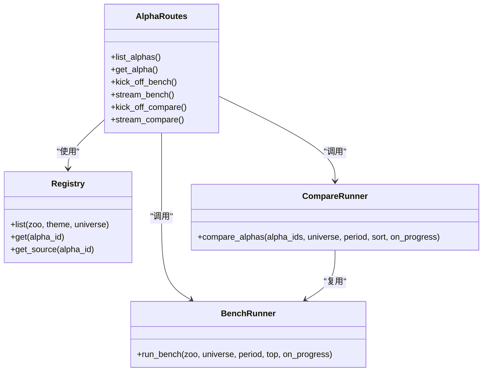
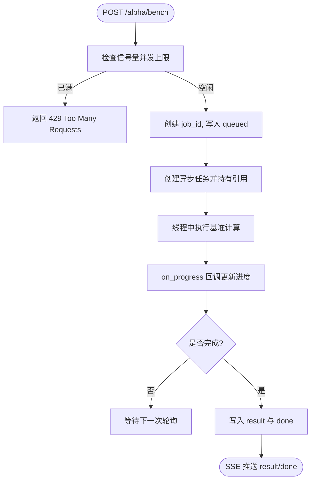

# Alpha 因子 API

<cite>
**本文引用的文件**
- [agent/src/api/alpha_routes.py](file://agent/src/api/alpha_routes.py)
- [agent/src/factors/bench_runner.py](file://agent/src/factors/bench_runner.py)
- [agent/src/factors/compare_runner.py](file://agent/src/factors/compare_runner.py)
- [agent/src/factors/registry.py](file://agent/src/factors/registry.py)
- [agent/src/api/security.py](file://agent/src/api/security.py)
</cite>

## 目录
1. [简介](#简介)
2. [项目结构](#项目结构)
3. [核心组件](#核心组件)
4. [架构总览](#架构总览)
5. [端点参考](#端点参考)
6. [依赖关系分析](#依赖关系分析)
7. [性能与并发控制](#性能与并发控制)
8. [故障排查指南](#故障排查指南)
9. [结论](#结论)

## 简介
本文件提供 Alpha 因子相关 REST API 的完整端点参考，覆盖以下能力：
- 列出可用因子（支持按 zoo、主题、市场范围过滤）
- 获取单个因子的元数据与源码
- 启动后台回测基准任务并流式获取进度与结果
- 启动因子对比任务并流式获取排名结果
- 解释并发控制、任务状态管理与 SSE 事件流处理机制

## 项目结构
Alpha 因子 API 由 FastAPI 路由模块挂载到主应用，后端通过“注册表”发现因子，并通过“基准运行器”和“对比运行器”执行计算。SSE 流用于实时推送任务进度与结果。

图表来源
- [agent/src/api/alpha_routes.py:349-664](file://agent/src/api/alpha_routes.py#L349-L664)
- [agent/src/factors/bench_runner.py:137-409](file://agent/src/factors/bench_runner.py#L137-L409)
- [agent/src/factors/compare_runner.py:88-210](file://agent/src/factors/compare_runner.py#L88-L210)

章节来源
- [agent/src/api/alpha_routes.py:1-792](file://agent/src/api/alpha_routes.py#L1-L792)
- [agent/src/factors/bench_runner.py:1-409](file://agent/src/factors/bench_runner.py#L1-L409)
- [agent/src/factors/compare_runner.py:1-210](file://agent/src/factors/compare_runner.py#L1-L210)

## 核心组件
- 路由层：定义 /alpha 系列端点，负责参数校验、并发控制、任务入队与 SSE 推送。
- 注册表：维护因子清单、元数据与源码读取；提供 list/get/compute 能力。
- 基准运行器：对指定 zoo 下的因子逐一计算 IC 统计，输出 alive/reversed/dead 分类与 Top-N 指标。
- 对比运行器：对指定 alpha_ids 进行分组 bench，合并结果并按指标排序生成排名。
- 安全与鉴权：HTTP 头鉴权与事件流鉴权依赖注入，防止未授权访问。

章节来源
- [agent/src/api/alpha_routes.py:349-664](file://agent/src/api/alpha_routes.py#L349-L664)
- [agent/src/factors/registry.py:1-200](file://agent/src/factors/registry.py#L1-L200)
- [agent/src/factors/bench_runner.py:137-409](file://agent/src/factors/bench_runner.py#L137-L409)
- [agent/src/factors/compare_runner.py:88-210](file://agent/src/factors/compare_runner.py#L88-L210)
- [agent/src/api/security.py:1-200](file://agent/src/api/security.py#L1-L200)

## 架构总览

图表来源
- [agent/src/api/alpha_routes.py:493-562](file://agent/src/api/alpha_routes.py#L493-L562)
- [agent/src/api/alpha_routes.py:671-736](file://agent/src/api/alpha_routes.py#L671-L736)
- [agent/src/factors/bench_runner.py:137-409](file://agent/src/factors/bench_runner.py#L137-L409)

## 端点参考

### GET /alpha/list
- 功能：列出因子，支持按 zoo、theme、universe 过滤，限制返回数量。
- 认证：需要 HTTP 头鉴权（由宿主应用注入）。
- 查询参数
  - zoo: 枚举值之一，如 alpha101、gtja191、qlib158、academic、fundamental
  - theme: 枚举值之一，如 momentum、reversal、volume、volatility、quality、value、liquidity、microstructure、sentiment、growth、leverage
  - universe: 内部市场范围，支持 csi300/sp500/btc-usdt 的别名映射到 equity_cn/equity_us/crypto
  - limit: 1..1000，默认 100
- 成功响应 (200)
  - status: ok
  - alphas: 数组，每项包含 id、zoo、theme、universe、nickname、decay_horizon、min_warmup_bars、requires_sector
  - total: 总数
  - returned: 实际返回条数
  - truncated: 是否被截断
- 错误
  - 400: 非法 zoo/theme/universe
  - 500: 注册表异常（内部错误提示见日志）

示例请求
- GET /alpha/list?zoo=gtja191&theme=momentum&universe=csi300&limit=50

示例响应
- { "status": "ok", "alphas": [...], "total": 120, "returned": 50, "truncated": true }

章节来源
- [agent/src/api/alpha_routes.py:383-446](file://agent/src/api/alpha_routes.py#L383-L446)
- [agent/src/factors/registry.py:1-200](file://agent/src/factors/registry.py#L1-L200)

### GET /alpha/{alpha_id}
- 功能：获取单个因子的元数据与源码。
- 路径参数
  - alpha_id: 格式要求为 <zoo>_<short>，长度与字符集受限
- 成功响应 (200)
  - status: ok
  - alpha: { id, zoo, module_path, meta }
  - source_code: 字符串（若读取失败则返回占位说明）
- 错误
  - 400: alpha_id 格式不合法
  - 404: alpha_id 不存在
  - 其他：读取源码失败时记录警告并返回占位源码

示例请求
- GET /alpha/gtja191_ma_cross

示例响应
- { "status": "ok", "alpha": {...}, "source_code": "# ..." }

章节来源
- [agent/src/api/alpha_routes.py:452-487](file://agent/src/api/alpha_routes.py#L452-L487)
- [agent/src/factors/registry.py:1-200](file://agent/src/factors/registry.py#L1-L200)

### POST /alpha/bench
- 功能：启动后台基准测试任务，返回 job_id。
- 认证：需要 HTTP 头鉴权。
- 请求体
  - zoo: 必填，枚举值同上
  - universe: 必填，枚举值 csi300/sp500/btc-usdt
  - period: 必填，时间窗口，格式 YYYY-YYYY 或 YYYY-MM-DD/YYYY-MM-DD
  - top: 可选，1..500，默认 20，控制 top5_by_ir 等展示条目上限
- 成功响应 (202)
  - status: ok
  - job_id: 字符串
- 错误
  - 400: period 解析失败
  - 429: 并发上限已满（当前进程最多同时运行 2 个 bench）
  - 5xx: 内部错误（服务端日志查看）

示例请求
- POST /alpha/bench
- Body: { "zoo": "gtja191", "universe": "sp500", "period": "2020-2023", "top": 20 }

示例响应
- { "status": "ok", "job_id": "a1b2c3d4e5f6" }

章节来源
- [agent/src/api/alpha_routes.py:493-562](file://agent/src/api/alpha_routes.py#L493-L562)
- [agent/src/factors/bench_runner.py:137-409](file://agent/src/factors/bench_runner.py#L137-L409)

### GET /alpha/bench/{job_id}/stream
- 功能：SSE 流式获取基准任务进度与结果。
- 认证：需要事件流鉴权（查询参数鉴权，由宿主应用注入）。
- 路径参数
  - job_id: 格式受限的字符串
- SSE 事件类型
  - progress: { n_done, n_total, current_alpha_id }
  - result: 基准结果摘要（保留 alive/reversed/dead/top5_by_ir/dead_examples/by_theme/n_alphas_tested/meta 等字段；skipped 计数以 skipped 与 n_skipped 双键暴露）
  - done: { job_id, wall_seconds }
  - error: { message }
- 连接保持
  - 心跳：约每 15 秒发送一次注释帧，避免代理断开
  - 轮询间隔：约 0.5 秒
- 错误
  - 400: job_id 格式不合法
  - 404: job_id 不存在
  - 连接断开：自动结束

示例请求
- GET /alpha/bench/a1b2c3d4e5f6/stream

示例事件流
- event: progress
- data: { "n_done": 1, "n_total": 191, "current_alpha_id": "gtja191_xxx" }
- ...
- event: result
- data: { "alive": 12, "reversed": 3, "dead": 176, "top5_by_ir": [...], "meta": {...} }
- event: done
- data: { "job_id": "a1b2c3d4e5f6", "wall_seconds": 345.67 }

章节来源
- [agent/src/api/alpha_routes.py:568-579](file://agent/src/api/alpha_routes.py#L568-L579)
- [agent/src/api/alpha_routes.py:671-736](file://agent/src/api/alpha_routes.py#L671-L736)
- [agent/src/api/alpha_routes.py:760-791](file://agent/src/api/alpha_routes.py#L760-L791)

### POST /alpha/compare
- 功能：启动因子对比任务，返回 job_id。
- 认证：需要 HTTP 头鉴权。
- 请求体
  - alpha_ids: 至少 2 个，去重后有效，格式同 alpha_id
  - universe: 必填，枚举值 csi300/sp500/btc-usdt
  - period: 必填，时间窗口格式同上
  - sort: 可选，排序指标 ir/ic_mean/ic_positive_ratio/ic_count，默认 ir
- 成功响应 (202)
  - status: ok
  - job_id: 字符串
- 错误
  - 400: period 解析失败或 alpha_ids 不合法
  - 429: 并发上限已满（当前进程最多同时运行 2 个 compare）
  - 5xx: 内部错误（服务端日志查看）

示例请求
- POST /alpha/compare
- Body: { "alpha_ids": ["gtja191_a", "gtja191_b"], "universe": "csi300", "period": "2021-2023", "sort": "ir" }

示例响应
- { "status": "ok", "job_id": "x9y8z7w6v5u4" }

章节来源
- [agent/src/api/alpha_routes.py:585-646](file://agent/src/api/alpha_routes.py#L585-L646)
- [agent/src/factors/compare_runner.py:88-210](file://agent/src/factors/compare_runner.py#L88-L210)

### GET /alpha/compare/{job_id}/stream
- 功能：SSE 流式获取对比任务进度与结果。
- 认证：需要事件流鉴权。
- 路径参数
  - job_id: 格式受限的字符串
- SSE 事件类型
  - progress: { n_done, n_total, current_alpha_id }
  - result: 对比结果（ranking、winner、n_compared、n_skipped、skipped 等）
  - done: { job_id }
  - error: { message }
- 错误
  - 400: job_id 格式不合法
  - 404: job_id 不存在

示例请求
- GET /alpha/compare/x9y8z7w6v5u4/stream

示例事件流
- event: progress
- data: { "n_done": 1, "n_total": 2, "current_alpha_id": "gtja191_a" }
- event: result
- data: { "ranking": [{ "rank": 1, "id": "gtja191_a", "ir": 0.123 }, ...], "winner": "gtja191_a" }
- event: done
- data: { "job_id": "x9y8z7w6v5u4" }

章节来源
- [agent/src/api/alpha_routes.py:652-663](file://agent/src/api/alpha_routes.py#L652-L663)

## 依赖关系分析
- 路由层依赖
  - 注册表：list/get/get_source 用于列举与详情
  - 基准运行器：run_bench 执行因子评估
  - 对比运行器：compare_alphas 执行多因子对比
  - 安全依赖：require_auth 与 require_event_stream_auth
- 运行期依赖
  - 进程内任务存储：ALPHA_BENCH_JOBS、ALPHA_COMPARE_JOBS
  - 并发控制：Semaphore 限制并行任务数
  - 线程池：ProcessPoolExecutor 在基准运行器中并行计算

图表来源
- [agent/src/api/alpha_routes.py:349-664](file://agent/src/api/alpha_routes.py#L349-L664)
- [agent/src/factors/registry.py:1-200](file://agent/src/factors/registry.py#L1-L200)
- [agent/src/factors/bench_runner.py:137-409](file://agent/src/factors/bench_runner.py#L137-L409)
- [agent/src/factors/compare_runner.py:88-210](file://agent/src/factors/compare_runner.py#L88-L210)

章节来源
- [agent/src/api/alpha_routes.py:349-664](file://agent/src/api/alpha_routes.py#L349-L664)
- [agent/src/factors/registry.py:1-200](file://agent/src/factors/registry.py#L1-L200)
- [agent/src/factors/bench_runner.py:137-409](file://agent/src/factors/bench_runner.py#L137-L409)
- [agent/src/factors/compare_runner.py:88-210](file://agent/src/factors/compare_runner.py#L88-L210)

## 性能与并发控制
- 并发上限
  - 基准任务：同一进程最多同时运行 2 个 bench（MAX_CONCURRENT_BENCHES）
  - 对比任务：同一进程最多同时运行 2 个 compare（MAX_CONCURRENT_COMPARES）
  - 超过上限将返回 429，客户端应重试或等待
- 任务生命周期
  - 状态机：queued -> running -> done/error
  - 任务清理：完成后超过 1 小时的任务会被自动清理
  - 任务存储：进程内存字典，重启后丢失
- 并行计算
  - 基准运行器使用进程池并行计算因子 IC，worker 数可配置或回退到单核
  - 大数据面板与收益矩阵在每个 worker 初始化一次，减少重复加载
- SSE 优化
  - 心跳帧：约 15 秒发送一次注释帧，避免中间代理断开
  - 轮询间隔：约 0.5 秒，平衡实时性与负载
  - 结果裁剪：bench 结果移除大字段 rows/skipped 列表，仅保留摘要

图表来源
- [agent/src/api/alpha_routes.py:493-562](file://agent/src/api/alpha_routes.py#L493-L562)
- [agent/src/api/alpha_routes.py:671-736](file://agent/src/api/alpha_routes.py#L671-L736)
- [agent/src/factors/bench_runner.py:223-312](file://agent/src/factors/bench_runner.py#L223-L312)

章节来源
- [agent/src/api/alpha_routes.py:61-77](file://agent/src/api/alpha_routes.py#L61-L77)
- [agent/src/api/alpha_routes.py:133-145](file://agent/src/api/alpha_routes.py#L133-L145)
- [agent/src/factors/bench_runner.py:223-312](file://agent/src/factors/bench_runner.py#L223-L312)

## 故障排查指南
- 常见错误码
  - 400: 参数不合法（zoo/theme/universe/period/alpha_id/job_id）
  - 404: 资源不存在（alpha_id/job_id）
  - 429: 并发超限（bench/compare 达到上限）
  - 5xx: 内部错误（查看服务端日志）
- 任务状态
  - queued：已入队但未开始
  - running：正在执行
  - done：成功完成
  - error：执行失败（error 字段包含简要原因）
- SSE 事件
  - progress：进度推进
  - result：最终结果（bench/compare 不同结构）
  - done：任务结束
  - error：错误信息
- 调试建议
  - 确认认证依赖是否正确注入（HTTP 头与 SSE 查询参数）
  - 检查 zoo/theme/universe 是否在允许集合内
  - 观察 SSE 心跳是否正常，避免代理断开
  - 查看服务端日志定位具体异常堆栈

章节来源
- [agent/src/api/alpha_routes.py:123-131](file://agent/src/api/alpha_routes.py#L123-L131)
- [agent/src/api/alpha_routes.py:383-446](file://agent/src/api/alpha_routes.py#L383-L446)
- [agent/src/api/alpha_routes.py:493-562](file://agent/src/api/alpha_routes.py#L493-L562)
- [agent/src/api/alpha_routes.py:568-579](file://agent/src/api/alpha_routes.py#L568-L579)
- [agent/src/api/alpha_routes.py:585-646](file://agent/src/api/alpha_routes.py#L585-L646)
- [agent/src/api/alpha_routes.py:652-663](file://agent/src/api/alpha_routes.py#L652-L663)

## 结论
Alpha 因子 API 提供了完整的因子浏览、详情获取与后台任务管理能力，结合 SSE 实现实时反馈。通过严格的参数校验、并发控制与任务状态管理，确保在高负载场景下的稳定性与可观测性。建议客户端遵循 429 重试策略，合理设置 SSE 心跳与轮询间隔，并在出现错误时结合服务端日志进行定位。