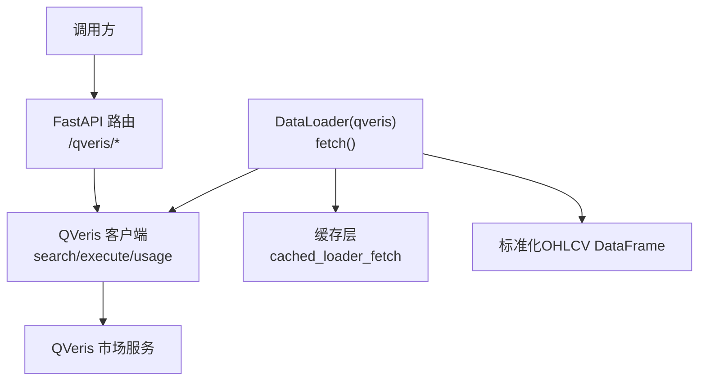
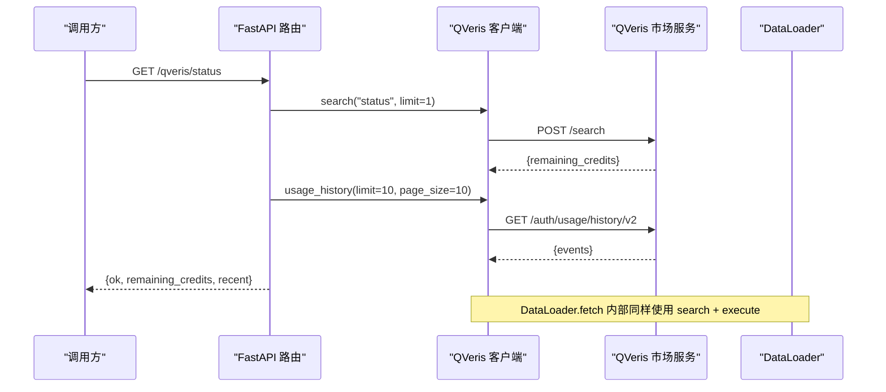

# QVeris 数据 API

<cite>
**本文引用的文件**
- [qveris_routes.py](file://agent/src/api/qveris_routes.py)
- [qveris_tool.py](file://agent/src/tools/qveris_tool.py)
- [qveris_loader.py](file://agent/backtest/loaders/qveris_loader.py)
- [api_server.py](file://agent/api_server.py)
- [test_qveris_routes.py](file://agent/tests/test_qveris_routes.py)
- [test_qveris_loader.py](file://agent/tests/test_qveris_loader.py)
</cite>

## 目录
1. [简介](#简介)
2. [项目结构](#项目结构)
3. [核心组件](#核心组件)
4. [架构总览](#架构总览)
5. [详细端点参考](#详细端点参考)
6. [依赖与调用关系分析](#依赖与调用关系分析)
7. [性能与可靠性](#性能与可靠性)
8. [故障排查指南](#故障排查指南)
9. [结论](#结论)
10. [附录：数据格式与示例](#附录数据格式与示例)

## 简介
本文件为 QVeris 数据服务在本系统中的 REST API 端点参考，覆盖配置管理、状态查询等接口；并说明如何通过系统内置的数据加载器访问实时行情、历史数据与基本面数据。文档同时规范了数据格式、时间序列处理、缓存机制、错误重试、预算控制与可用性策略，并提供端到端的调用示例路径与最佳实践。

## 项目结构
QVeris 相关能力由三层组成：
- HTTP 路由层：提供本地 FastAPI 路由用于配置管理与健康检查。
- 工具/客户端层：封装对 QVeris 市场服务的搜索、执行、用量查询等 REST 调用。
- 数据加载器层：面向回测与批量拉取，自动选择合适的能力（provider），统一输出标准 OHLCV DataFrame。



图表来源
- [qveris_routes.py:139-232](file://agent/src/api/qveris_routes.py#L139-L232)
- [qveris_tool.py:200-350](file://agent/src/tools/qveris_tool.py#L200-L350)
- [qveris_loader.py:260-381](file://agent/backtest/loaders/qveris_loader.py#L260-L381)

章节来源
- [api_server.py:247-248](file://agent/api_server.py#L247-L248)
- [qveris_routes.py:1-232](file://agent/src/api/qveris_routes.py#L1-L232)

## 核心组件
- QVeris 配置与鉴权
  - 配置文件位于用户目录下的 JSON，支持环境变量覆盖。
  - 支持 free/paid 模式切换；paid 模式需设置 API Key。
  - 配置读取、保存、掩码显示、模式归一化等工具函数。
- QVeris 客户端
  - 封装 /search、/tools/execute、/auth/usage/history/v2、/auth/credits/ledger 等调用。
  - 内置请求间隔控制、429 重试与 Retry-After 解析、截断结果下载。
- 数据加载器 DataLoader
  - 仅当显式启用且满足 paid 模式时可用。
  - 通过 search 发现能力，按成功率与成本排序，依次 execute 获取数据。
  - 将多源异构结果统一为标准 OHLCV DataFrame，并进行日期过滤与校验。
- 路由 qveris_router
  - GET /qveris/config：返回脱敏后的配置。
  - PUT /qveris/config：更新并持久化配置（需写权限）。
  - GET /qveris/status：健康检查，包含剩余额度与最近使用事件。

章节来源
- [qveris_tool.py:38-147](file://agent/src/tools/qveris_tool.py#L38-L147)
- [qveris_tool.py:200-350](file://agent/src/tools/qveris_tool.py#L200-L350)
- [qveris_loader.py:102-157](file://agent/backtest/loaders/qveris_loader.py#L102-L157)
- [qveris_loader.py:260-381](file://agent/backtest/loaders/qveris_loader.py#L260-L381)
- [qveris_routes.py:139-232](file://agent/src/api/qveris_routes.py#L139-L232)

## 架构总览
QVeris 在本系统中作为“付费能力路由”接入，仅在显式启用且具备 API Key 时生效，不参与自动回退链。HTTP 路由负责配置与状态；工具客户端负责与市场交互；数据加载器负责批量拉取与标准化。



图表来源
- [qveris_routes.py:180-232](file://agent/src/api/qveris_routes.py#L180-L232)
- [qveris_tool.py:291-350](file://agent/src/tools/qveris_tool.py#L291-L350)
- [qveris_loader.py:335-381](file://agent/backtest/loaders/qveris_loader.py#L335-L381)

## 详细端点参考
以下端点均挂载于 FastAPI 应用，并通过统一的鉴权中间件进行访问控制。

### 配置管理
- GET /qveris/config
  - 功能：返回当前 QVeris 配置的脱敏视图。
  - 鉴权：需要读权限。
  - 响应字段：enabled、base_url、api_key_masked、mode、budget_credits_per_session、configured、signup_url、invite_code。
  - 注意：不会返回明文 API Key。

- PUT /qveris/config
  - 功能：更新并持久化 QVeris 配置。
  - 鉴权：需要写权限。
  - 请求体字段：enabled、base_url、api_key、mode、budget_credits_per_session。
  - 校验：base_url 必须为 http(s)；mode 仅允许 free/paid；budget 非负。
  - 行为：若 mode=paid 则 enabled 置为 true；否则根据 enabled 推导 mode。

章节来源
- [qveris_routes.py:139-177](file://agent/src/api/qveris_routes.py#L139-L177)
- [test_qveris_routes.py:23-76](file://agent/tests/test_qveris_routes.py#L23-L76)

### 状态与健康检查
- GET /qveris/status
  - 功能：检查 QVeris 是否可用、剩余额度与最近使用事件。
  - 鉴权：需要读权限。
  - 行为：
    - 未配置或 paid 关闭：返回 ok=false，不发起网络请求。
    - paid 开启：调用 search("status") 与 usage_history，聚合剩余额度与最近事件。
  - 响应字段：enabled、ok、error、remaining_credits、recent、signup_url、invite_code。

章节来源
- [qveris_routes.py:180-232](file://agent/src/api/qveris_routes.py#L180-L232)
- [test_qveris_routes.py:79-152](file://agent/tests/test_qveris_routes.py#L79-L152)

### 数据获取（通过 DataLoader）
- DataLoader.fetch(codes, start_date, end_date, interval="1D", fields=None)
  - 功能：批量拉取指定代码的历史 OHLCV 数据。
  - 可用性：仅当 enabled=true、存在 API Key、mode=paid 时可用。
  - 流程：
    - 参数校验（日期范围）。
    - 构造自然语言查询，调用 search 获取候选能力。
    - 基于成功率与预期成本排序，最多尝试前 3 个能力。
    - 调用 execute 获取结果，必要时下载完整内容文件。
    - 标准化为 OHLCV DataFrame，按日期区间裁剪与校验。
  - 预算控制：会话内共享预算，超出即跳过后续付费调用。
  - 缓存：使用 cached_loader_fetch 避免重复拉取。

章节来源
- [qveris_loader.py:260-381](file://agent/backtest/loaders/qveris_loader.py#L260-L381)
- [test_qveris_loader.py:146-358](file://agent/tests/test_qveris_loader.py#L146-L358)

## 依赖与调用关系分析
- 路由依赖
  - 路由模块通过导入工具模块的 QVerisConfig、load/save/mask 等函数实现配置读写与状态检查。
  - 鉴权委托给 api_server 的 require_auth / require_settings_write_auth。

- 客户端依赖
  - QVerisClient 使用 httpx 发送 JSON 请求，带 Bearer Token。
  - 内置最小请求间隔、429 重试与 Retry-After 解析。
  - 支持截断结果下载（full_content_file_url）。

- 加载器依赖
  - DataLoader 注册到 loader registry，requires_auth=true，不参与自动回退链。
  - 通过 search/select/execute 流水线选择最优 provider，并将结果标准化为 OHLCV。

```mermaid
classDiagram
class QVerisConfig {
+bool enabled
+string base_url
+string api_key
+string mode
+float budget_credits_per_session
}
class QVerisClient {
+search(query, limit) dict
+inspect(tool_ids, search_id, session_id) dict
+execute(tool_id, parameters, ...) dict
+usage_history(**params) dict
+credits_ledger(**params) dict
}
class DataLoader {
+name = "qveris"
+markets = {...}
+is_available() bool
+fetch(codes, start, end, interval, fields) dict
}
QVerisClient --> QVerisConfig : "使用"
DataLoader --> QVerisClient : "调用"
```

图表来源
- [qveris_tool.py:38-47](file://agent/src/tools/qveris_tool.py#L38-L47)
- [qveris_tool.py:200-350](file://agent/src/tools/qveris_tool.py#L200-L350)
- [qveris_loader.py:260-381](file://agent/backtest/loaders/qveris_loader.py#L260-L381)

章节来源
- [qveris_routes.py:12-27](file://agent/src/api/qveris_routes.py#L12-L27)
- [qveris_tool.py:200-350](file://agent/src/tools/qveris_tool.py#L200-L350)
- [qveris_loader.py:260-381](file://agent/backtest/loaders/qveris_loader.py#L260-L381)

## 性能与可靠性
- 请求限流与重试
  - 客户端强制最小请求间隔（默认 0.5s），可通过环境变量调整。
  - 遇到 429 会依据 Retry-After 头重试，最多 3 次。
  - 加载器侧也实现了相同的最小间隔与 429 处理。

- 预算控制
  - 会话级预算上限，防止超额消费。
  - 执行前估算成本，预留额度；实际成本可能高于预估，追加扣减。
  - 失败或异常时释放预留额度。

- 缓存机制
  - DataLoader 使用 cached_loader_fetch 对同一 symbol/timeframe/date-range 的结果进行缓存，减少重复网络请求。

- 数据质量与时间序列处理
  - 标准化列：open、high、low、close、volume，索引为 trade_date（datetime64[ns]）。
  - 日期过滤：仅保留起止区间内的记录。
  - OHLC 校验：确保 open<=high、open<=low、close 合理等约束。

- 可用性策略
  - QVeris 仅在显式 source="qveris" 时启用，不参与自动回退链。
  - free 模式下不会发起付费调用，保持公共数据路由。

章节来源
- [qveris_tool.py:226-275](file://agent/src/tools/qveris_tool.py#L226-L275)
- [qveris_loader.py:160-183](file://agent/backtest/loaders/qveris_loader.py#L160-L183)
- [qveris_loader.py:256-296](file://agent/backtest/loaders/qveris_loader.py#L256-L296)
- [qveris_loader.py:556-580](file://agent/backtest/loaders/qveris_loader.py#L556-L580)
- [test_qveris_loader.py:396-412](file://agent/tests/test_qveris_loader.py#L396-L412)

## 故障排查指南
- 无法启用 QVeris
  - 现象：is_available() 返回 false。
  - 排查：确认 enabled=true、存在 API Key、mode=paid。
  - 参考：配置读取与环境变量覆盖逻辑。

- 配置写入失败
  - 现象：PUT /qveris/config 返回 422。
  - 排查：检查 base_url 是否为 http(s)、mode 是否为 free/paid、budget 是否非负。

- 状态检查不可用
  - 现象：GET /qveris/status 返回 ok=false。
  - 排查：未配置或 paid 关闭；free 模式不会调用 QVeris 服务。

- 数据为空或解析失败
  - 现象：fetch 返回空字典或 DataFrame 为空。
  - 排查：检查 search 结果是否包含 OHLCV 能力；execute 返回是否可解析；日期区间是否有效。

- 429 限流
  - 现象：多次请求被限流。
  - 排查：客户端已自动重试并遵循 Retry-After；可适当增大最小请求间隔。

章节来源
- [qveris_routes.py:102-106](file://agent/src/api/qveris_routes.py#L102-L106)
- [qveris_routes.py:180-232](file://agent/src/api/qveris_routes.py#L180-L232)
- [qveris_loader.py:335-381](file://agent/backtest/loaders/qveris_loader.py#L335-L381)
- [test_qveris_routes.py:61-76](file://agent/tests/test_qveris_routes.py#L61-L76)

## 结论
本系统通过 FastAPI 路由暴露 QVeris 的配置与管理接口，并通过工具客户端与数据加载器实现对市场数据的统一访问。其设计强调安全（鉴权与脱敏）、可控（预算与限流）、可靠（重试与降级）与标准化（统一 OHLCV 输出）。在付费模式下，系统能智能选择最优 provider，保障数据质量与成本效率。

## 附录：数据格式与示例
- 标准 OHLCV 字段
  - open、high、low、close、volume
  - 索引：trade_date（datetime64[ns]）
  - 类型：数值型（float），缺失值会被清理

- 时间序列处理
  - 日期解析：支持多种日期键名（如 date、trade_date、timestamp 等）。
  - 区间裁剪：仅保留起止日期内的记录。
  - 校验：执行 OHLC 一致性校验，剔除无效行。

- 缓存机制
  - 使用 cached_loader_fetch 对相同 symbol/timeframe/date-range 的请求进行缓存。
  - 可通过环境变量控制缓存开关与粒度。

- 示例路径
  - 实时行情订阅：通过 QVeris 市场能力动态发现与执行（search + execute），具体 provider 由 QVeris 路由决定。
  - 历史数据回调：DataLoader.fetch 返回 DataFrame，可在业务中回调处理。
  - 基本面信息查询：通过 QVeris 搜索能力（query 描述基本面指标）后执行对应 tool_id。

- 数据质量保证
  - 字段别名映射与标准化。
  - 日期与数值类型转换与清洗。
  - OHLC 合理性校验。

- 延迟控制
  - 最小请求间隔（默认 0.5s），可通过环境变量调整。
  - 429 重试与 Retry-After 解析。

- 错误重试机制
  - 客户端内置 429 重试，最多 3 次。
  - 加载器逐符号容错，单个失败不影响其他符号。

- 使用限制与计费
  - 会话预算上限：超出后拒绝新的付费调用。
  - 预计成本与结算：执行前后分别估算与实际扣减，异常时释放预留。
  - 免费模式：仅路由公共数据，不调用付费能力。

- SLA 保障
  - 健康检查：/qveris/status 提供可用性、额度与近期使用。
  - 降级策略：free 模式保持可用；付费能力不可用时返回明确错误。

章节来源
- [qveris_loader.py:556-580](file://agent/backtest/loaders/qveris_loader.py#L556-L580)
- [qveris_tool.py:291-350](file://agent/src/tools/qveris_tool.py#L291-L350)
- [qveris_routes.py:180-232](file://agent/src/api/qveris_routes.py#L180-L232)
- [test_qveris_loader.py:146-358](file://agent/tests/test_qveris_loader.py#L146-L358)