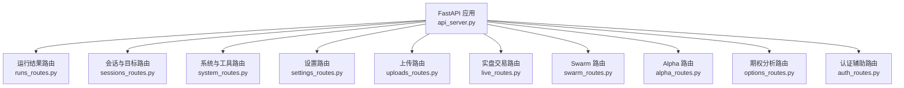
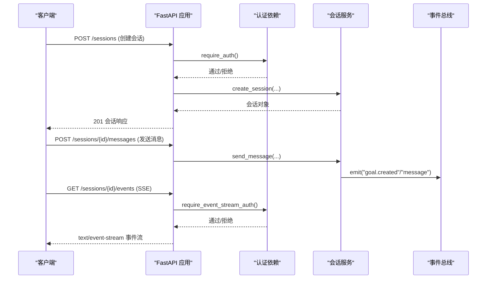
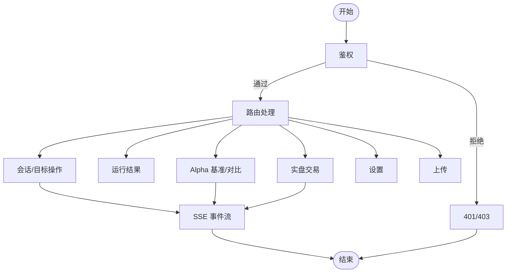

# REST API 端点参考

<cite>
**本文引用的文件**
- [agent/api_server.py](file://agent/api_server.py)
- [agent/src/api/runs_routes.py](file://agent/src/api/runs_routes.py)
- [agent/src/api/sessions_routes.py](file://agent/src/api/sessions_routes.py)
- [agent/src/api/system_routes.py](file://agent/src/api/system_routes.py)
- [agent/src/api/settings_routes.py](file://agent/src/api/settings_routes.py)
- [agent/src/api/uploads_routes.py](file://agent/src/api/uploads_routes.py)
- [agent/src/api/live_routes.py](file://agent/src/api/live_routes.py)
- [agent/src/api/swarm_routes.py](file://agent/src/api/swarm_routes.py)
- [agent/src/api/auth_routes.py](file://agent/src/api/auth_routes.py)
- [agent/src/api/alpha_routes.py](file://agent/src/api/alpha_routes.py)
- [agent/src/api/options_routes.py](file://agent/src/api/options_routes.py)
</cite>

## 目录
1. [简介](#简介)
2. [项目结构](#项目结构)
3. [核心组件](#核心组件)
4. [架构总览](#架构总览)
5. [详细端点参考](#详细端点参考)
6. [依赖关系与调用顺序](#依赖关系与调用顺序)
7. [性能与速率限制](#性能与速率限制)
8. [错误处理与状态码](#错误处理与状态码)
9. [客户端集成示例](#客户端集成示例)
10. [版本控制与向后兼容](#版本控制与向后兼容)
11. [故障排查指南](#故障排查指南)
12. [结论](#结论)

## 简介
本参考文档面向 Vibe-Trading 的 REST API，覆盖所有 HTTP 端点的 URL 模式、支持的 HTTP 方法、请求参数、响应格式、状态码、错误处理机制以及常见使用场景。文档还包含 SSE（Server-Sent Events）事件流说明、速率限制、版本控制与兼容性信息，并提供多语言客户端集成示例，帮助开发者快速集成和使用。

## 项目结构
Vibe-Trading 后端基于 FastAPI，采用模块化路由注册方式：
- 应用入口与生命周期管理在 api_server 中完成，统一挂载各功能模块的路由。
- 每个业务域（运行结果、会话、系统、设置、上传、实盘交易、Swarm、Alpha、期权等）独立路由文件，便于维护与扩展。
- 安全、模型、辅助函数集中在 src/api/security、src/api/models、src/api/helpers 等共享模块中。

**图表来源**
- [agent/api_server.py:163-303](file://agent/api_server.py#L163-L303)

**章节来源**
- [agent/api_server.py:163-303](file://agent/api_server.py#L163-L303)

## 核心组件
- 认证与安全：通过 require_auth、require_event_stream_auth 等依赖对 JSON 和 SSE 进行鉴权；支持 API Key、本地回环白名单、CORS 配置与安全头。
- 会话服务：提供会话创建、消息发送、SSE 事件流、目标（Goal）管理等能力。
- 运行结果：列出历史运行、获取运行详情、代码与 Pine Script 导出。
- Alpha 基准测试：异步任务队列 + SSE 进度/结果推送，内置并发限制。
- 期权分析：Payoff 分析与希腊字母计算、期权链查询。
- 实盘交易：授权、指令提交、熔断开关、运行器启停、状态查询。
- 设置：LLM 提供商、数据源凭据读取与更新。
- 上传：受控的文件上传与影子账户报告下载。

**章节来源**
- [agent/src/api/sessions_routes.py:28-163](file://agent/src/api/sessions_routes.py#L28-L163)
- [agent/src/api/runs_routes.py:237-356](file://agent/src/api/runs_routes.py#L237-L356)
- [agent/src/api/alpha_routes.py:349-664](file://agent/src/api/alpha_routes.py#L349-L664)
- [agent/src/api/options_routes.py:163-236](file://agent/src/api/options_routes.py#L163-L236)
- [agent/src/api/live_routes.py:632-800](file://agent/src/api/live_routes.py#L632-L800)
- [agent/src/api/settings_routes.py:492-690](file://agent/src/api/settings_routes.py#L492-L690)
- [agent/src/api/uploads_routes.py:51-179](file://agent/src/api/uploads_routes.py#L51-L179)
- [agent/src/api/auth_routes.py:21-56](file://agent/src/api/auth_routes.py#L21-L56)

## 架构总览
整体架构围绕 FastAPI 应用展开，路由按功能域拆分并通过 register_*_routes(app) 挂载。安全中间件统一处理 CORS、安全头、回环主机校验与 SPA 深度链接回退。SSE 事件流通过独立的鉴权依赖保护。

**图表来源**
- [agent/src/api/sessions_routes.py:366-431](file://agent/src/api/sessions_routes.py#L366-L431)
- [agent/src/api/sessions_routes.py:697-800](file://agent/src/api/sessions_routes.py#L697-L800)
- [agent/api_server.py:176-185](file://agent/api_server.py#L176-L185)

## 详细端点参考

### 系统与健康检查
- GET /live
  - 描述：进程存活探针，无条件返回健康状态。
  - 响应：{ status, service, timestamp }
- GET /health
  - 描述：兼容旧监控的健康检查别名。
  - 响应：同 /live
- GET /ready
  - 描述：就绪探针，检查 LLM 提供商配置是否可用。
  - 响应：{ status, service, timestamp } 或 503 并附带原因
- GET /correlation
  - 描述：计算多资产相关性矩阵（需认证）。
  - 参数：codes（逗号分隔）、days（7-365）、method（pearson/spearman）
  - 响应：相关性矩阵结果
  - 限流：每客户端 IP 每分钟 30 次
- GET /correlation/regime
  - 描述：相关性 regime 时间线（需认证）。
  - 参数：codes、days（30-365）、corr_window（5-250）、edge_threshold（0-1）、smooth_window（1-60）、enter_threshold（0-1）、exit_threshold（0-1，且小于 enter_threshold）
  - 响应：regime 时间线
  - 限流：与 /correlation 共享预算
- POST /system/shutdown
  - 描述：仅本地访问可触发关闭（需授权）。
  - 响应：{ status, service, timestamp }
- GET /skills
  - 描述：列出已注册技能（需认证）。
  - 响应：[{ name, description }]
- GET /api
  - 描述：服务元信息。
  - 响应：{ service, version, docs, health }
- GET /openapi.json
  - 描述：OpenAPI 模式（需认证）。
- GET /docs、GET /redoc
  - 描述：交互式文档（仅在无 API Key 的回环开发模式下可用，需认证）。

**章节来源**
- [agent/src/api/system_routes.py:242-469](file://agent/src/api/system_routes.py#L242-L469)

### 运行结果（Runs）
- GET /runs
  - 描述：列出最近运行摘要（需认证）。
  - 参数：limit（1-100，默认 20）
  - 响应：[RunInfo]
- GET /runs/{run_id}
  - 描述：获取运行详情（需认证）。
  - 参数：chart_symbol（可选）、chart_payload（full/summary）
  - 响应：RunResponse（含指标、图表、日志等）
- GET /runs/{run_id}/code
  - 描述：获取策略源码（需认证）。
  - 响应：{ filename -> source }
- GET /runs/{run_id}/pine
  - 描述：获取 Pine Script（需认证）。
  - 响应：{ exists, content }

**章节来源**
- [agent/src/api/runs_routes.py:273-356](file://agent/src/api/runs_routes.py#L273-L356)
- [agent/src/api/runs_routes.py:1022-1120](file://agent/src/api/runs_routes.py#L1022-L1120)

### 会话与目标（Sessions & Goals）
- POST /sessions
  - 描述：创建会话（需认证）。
  - 请求体：{ title, config? }
  - 响应：SessionResponse
- GET /sessions
  - 描述：列出会话（需认证）。
  - 参数：limit（1-200，默认 50）
  - 响应：[SessionResponse]
- GET /sessions/{session_id}
  - 描述：获取会话（需认证）。
  - 响应：SessionResponse
- DELETE /sessions/{session_id}
  - 描述：删除会话（需认证）。
  - 响应：{ status, session_id }
- PATCH /sessions/{session_id}
  - 描述：更新会话字段（如标题）（需认证）。
  - 请求体：{ title? }
  - 响应：{ status, session_id }
- POST /sessions/{session_id}/title/auto
  - 描述：自动生成会话标题（需认证）。
  - 响应：{ status, session_id, title }
- POST /sessions/{session_id}/messages
  - 描述：发送用户消息并启动智能体循环（需认证）。
  - 请求体：{ content }（必填，长度 1-5000）
  - 响应：消息处理结果
- POST /sessions/{session_id}/cancel
  - 描述：取消当前运行的智能体循环（需认证）。
  - 响应：{ status }
- GET /sessions/{session_id}/messages
  - 描述：列出会话消息（需认证）。
  - 参数：limit（1-1000，默认 100）
  - 响应：[MessageResponse]
- GET /sessions/{session_id}/events
  - 描述：SSE 事件流（需事件流认证）。
  - 参数：Last-Event-ID、replay（active）
  - 响应：text/event-stream 事件流

目标（Goal）子路由：
- POST /sessions/{session_id}/goal
  - 描述：创建或替换研究目标（需认证）。
  - 请求体：CreateGoalRequest（objective、criteria、protocol、risk_tier、token/turn/time_budget 等）
  - 响应：GoalSnapshotResponse
- GET /sessions/{session_id}/goal
  - 描述：获取当前目标快照（需认证）。
  - 响应：GoalSnapshotResponse
- PATCH /sessions/{session_id}/goal
  - 描述：编辑目标（需认证）。
  - 请求体：UpdateGoalRequest（goal_id、expected_goal_id、objective/ui_summary）
  - 响应：UpdateGoalResponse
- POST /sessions/{session_id}/goal/evidence
  - 描述：追加证据（需认证）。
  - 请求体：AddGoalEvidenceRequest
  - 响应：AddGoalEvidenceResponse
- PATCH /sessions/{session_id}/goal/status
  - 描述：更新目标状态（需认证）。
  - 请求体：UpdateGoalStatusRequest
  - 响应：UpdateGoalStatusResponse

**章节来源**
- [agent/src/api/sessions_routes.py:335-800](file://agent/src/api/sessions_routes.py#L335-L800)

### 设置（Settings）
- GET /settings/llm
  - 描述：读取 LLM 设置（本地或认证）。
  - 响应：LLMSettingsResponse
- PUT /settings/llm
  - 描述：更新 LLM 设置（需写权限认证）。
  - 请求体：UpdateLLMSettingsRequest（provider、model_name、base_url、api_key、temperature、timeout_seconds、max_retries、reasoning_effort）
  - 响应：LLMSettingsResponse
- POST /settings/llm/models
  - 描述：动态发现模型列表（需写权限认证）。
  - 请求体：ListLLMModelsRequest（provider、base_url、api_key）
  - 响应：LLMModelsResponse
- GET /settings/data-sources
  - 描述：读取数据源凭据设置（本地或认证）。
  - 响应：DataSourceSettingsResponse
- PUT /settings/data-sources
  - 描述：更新数据源凭据（需写权限认证）。
  - 请求体：UpdateDataSourceSettingsRequest（tushare_token、clear_tushare_token）
  - 响应：DataSourceSettingsResponse

**章节来源**
- [agent/src/api/settings_routes.py:513-690](file://agent/src/api/settings_routes.py#L513-L690)

### 上传（Uploads）
- POST /upload
  - 描述：上传文件（需认证），最大 50MB，禁止执行类、脚本、配置文件、压缩包等。
  - 响应：{ status, file_path, filename }
- GET /shadow-reports/{shadow_id}
  - 描述：下载影子账户报告（需认证）。
  - 参数：format（html/pdf）
  - 响应：HTML/PDF 文件

**章节来源**
- [agent/src/api/uploads_routes.py:96-179](file://agent/src/api/uploads_routes.py#L96-L179)

### 实盘交易（Live Trading）
- POST /mandate/commit
  - 描述：提交用户确认的交易指令（需认证）。
  - 请求体：CommitMandateRequest（broker、proposal_id、selected_ordinal、adjustments、consent_ack=true、session_id、account_ref、lifetime_days）
  - 响应：提交结果
- POST /live/halt
  - 描述：触发熔断（需认证）。
  - 请求体：LiveHaltRequest（broker?、reason、session_id）
  - 响应：{ halted, broker, reason, sentinel }
- POST /live/resume
  - 描述：清除熔断（需认证）。
  - 请求体：LiveHaltRequest
  - 响应：{ halted, broker, cleared }
- GET /live/status
  - 描述：查询实盘通道状态（需认证）。
  - 参数：broker（可选）
  - 响应：LiveStatusResponse（全局熔断、各券商状态）
- POST /live/authorize
  - 描述：OAuth 引导（需认证）。
  - 请求体：LiveAuthorizeRequest（broker）
  - 响应：引导信息
- POST /live/runner/start
  - 描述：启动持久化运行器（需认证）。
  - 请求体：LiveRunnerControlRequest（broker、session_id）
  - 响应：启动结果
- POST /live/runner/stop
  - 描述：停止运行器（需认证）。
  - 请求体：LiveRunnerControlRequest
  - 响应：停止结果

**章节来源**
- [agent/src/api/live_routes.py:650-800](file://agent/src/api/live_routes.py#L650-L800)

### Swarm
- GET /swarm/presets
  - 描述：列出预设（需认证）。
  - 响应：预设列表
- POST /swarm/runs
  - 描述：启动 Swarm 运行（需认证）。
  - 请求体：{ preset_name, user_vars }
  - 响应：{ id, status, preset_name }
- GET /swarm/runs
  - 描述：列出运行（需认证）。
  - 参数：limit（1-100，默认 20）
  - 响应：运行列表
- GET /swarm/runs/{run_id}
  - 描述：运行详情（需认证）。
  - 响应：运行详情（含任务状态）
- GET /swarm/runs/{run_id}/events
  - 描述：SSE 事件流（需事件流认证）。
  - 参数：last_index、Last-Event-ID
  - 响应：text/event-stream
- POST /swarm/runs/{run_id}/cancel
  - 描述：取消运行（需认证）。
  - 响应：{ status }
- POST /swarm/runs/{run_id}/retry
  - 描述：重试失败/陈旧/取消的运行（需认证）。
  - 响应：新运行信息

**章节来源**
- [agent/src/api/swarm_routes.py:79-260](file://agent/src/api/swarm_routes.py#L79-L260)

### Alpha 基准测试
- GET /alpha/list
  - 描述：列出因子（需认证）。
  - 参数：zoo、theme、universe、limit
  - 响应：{ status, alphas, total, returned, truncated }
- GET /alpha/{alpha_id}
  - 描述：获取因子元信息与源码（需认证）。
  - 响应：{ status, alpha, source_code }
- POST /alpha/bench
  - 描述：启动基准测试任务（需认证）。
  - 请求体：BenchRequest（zoo、universe、period、top）
  - 响应：202 { status, job_id }
- GET /alpha/bench/{job_id}/stream
  - 描述：SSE 进度/结果/完成/错误（需事件流认证）。
  - 响应：text/event-stream
- POST /alpha/compare
  - 描述：启动对比任务（需认证）。
  - 请求体：CompareRequest（alpha_ids、universe、period、sort）
  - 响应：202 { status, job_id }
- GET /alpha/compare/{job_id}/stream
  - 描述：SSE 进度/结果/完成/错误（需事件流认证）。
  - 响应：text/event-stream

**章节来源**
- [agent/src/api/alpha_routes.py:383-664](file://agent/src/api/alpha_routes.py#L383-L664)

### 期权分析
- POST /options/payoff
  - 描述：多腿到期收益分析（需认证）。
  - 请求体：PayoffRequest（legs、entry_spot、expiry_days、risk_free_rate、volatility、multiplier、commission_rate、spot_min/max、spot_points、scenario_iv_values）
  - 响应：工具结果 + greeks（组合希腊字母）
- GET /options/chain
  - 描述：美国上市期权链（需认证）。
  - 参数：ticker、expiration
  - 响应：工具结果（ok 为 true/false）

**章节来源**
- [agent/src/api/options_routes.py:192-236](file://agent/src/api/options_routes.py#L192-L236)

### 认证辅助
- POST /auth/sse-ticket
  - 描述：为浏览器 EventSource 签发一次性票据（需认证）。
  - 响应：{ ticket }

**章节来源**
- [agent/src/api/auth_routes.py:46-56](file://agent/src/api/auth_routes.py#L46-L56)

## 依赖关系与调用顺序
- 大多数 JSON 端点需要 require_auth 鉴权；SSE 端点使用 require_event_stream_auth。
- 会话消息发送会触发事件总线，前端通过 /sessions/{id}/events 订阅。
- Alpha 基准测试与对比任务以异步方式运行，通过 SSE 推送进度与结果。
- 实盘交易相关端点依赖券商配置与运行器状态，提交前需确保授权与指令有效。

**图表来源**
- [agent/src/api/sessions_routes.py:697-800](file://agent/src/api/sessions_routes.py#L697-L800)
- [agent/src/api/alpha_routes.py:493-664](file://agent/src/api/alpha_routes.py#L493-L664)
- [agent/src/api/live_routes.py:650-800](file://agent/src/api/live_routes.py#L650-L800)

## 性能与速率限制
- /correlation 与 /correlation/regime 使用滑动窗口限流：每客户端 IP 每分钟最多 30 次请求。
- Alpha 基准测试与对比任务有并发上限（默认各 2），超过时返回 429。
- 大文件上传限制为 50MB，分块写入，超限立即拒绝。
- SSE 连接保持长连接，服务端定期心跳避免代理断开。

**章节来源**
- [agent/src/api/system_routes.py:62-130](file://agent/src/api/system_routes.py#L62-L130)
- [agent/src/api/alpha_routes.py:65-77](file://agent/src/api/alpha_routes.py#L65-L77)
- [agent/src/api/alpha_routes.py:514-520](file://agent/src/api/alpha_routes.py#L514-L520)
- [agent/src/api/uploads_routes.py:22-25](file://agent/src/api/uploads_routes.py#L22-L25)

## 错误处理与状态码
- 400：参数无效（如 chart_payload、alpha_id、zoo/universe/theme 不在允许集合）。
- 401/403：未认证或禁止访问（本地关闭端点非本地访问）。
- 404：资源不存在（运行、会话、因子、作业等）。
- 409：冲突（会话忙、目标版本冲突、运行不可重试）。
- 413：文件过大。
- 429：速率限制或并发上限达到。
- 500/502/503：内部错误或外部依赖不可用（LLM 提供商未就绪、工具调用失败、保存设置失败）。

**章节来源**
- [agent/src/api/system_routes.py:257-272](file://agent/src/api/system_routes.py#L257-L272)
- [agent/src/api/alpha_routes.py:391-418](file://agent/src/api/alpha_routes.py#L391-L418)
- [agent/src/api/sessions_routes.py:746-751](file://agent/src/api/sessions_routes.py#L746-L751)
- [agent/src/api/uploads_routes.py:127-170](file://agent/src/api/uploads_routes.py#L127-L170)
- [agent/src/api/settings_routes.py:621-697](file://agent/src/api/settings_routes.py#L621-L697)

## 客户端集成示例
以下为常见语言的调用要点（不展示具体代码内容，仅提供路径与步骤）：
- Python（requests/httpx）
  - 使用 Authorization: Bearer <API_KEY> 调用 JSON 端点。
  - 对于 SSE，先 POST /auth/sse-ticket 获取 ticket，再 GET /sessions/{id}/events?ticket=... 建立流。
  - 参考路径：
    - [agent/src/api/auth_routes.py:46-56](file://agent/src/api/auth_routes.py#L46-L56)
    - [agent/src/api/sessions_routes.py:752-800](file://agent/src/api/sessions_routes.py#L752-L800)
- JavaScript（fetch/EventSource）
  - 浏览器无法直接发送 Authorization 头到 EventSource，因此使用 /auth/sse-ticket 换取票据后连接。
  - 参考路径：
    - [agent/src/api/auth_routes.py:46-56](file://agent/src/api/auth_routes.py#L46-L56)
    - [agent/src/api/sessions_routes.py:752-800](file://agent/src/api/sessions_routes.py#L752-L800)
- cURL
  - 使用 -H "Authorization: Bearer <API_KEY>" 调用 JSON 端点。
  - 使用 -N --no-buffer 配合 curl 接收 SSE。
  - 参考路径：
    - [agent/src/api/system_routes.py:242-272](file://agent/src/api/system_routes.py#L242-L272)
    - [agent/src/api/sessions_routes.py:752-800](file://agent/src/api/sessions_routes.py#L752-L800)

## 版本控制与向后兼容
- 应用版本通过 APP_VERSION 暴露于 /api 元信息中。
- 部分端点提供兼容字段（如 Alpha 基准结果同时保留 n_skipped 与 skipped）。
- 文档与 OpenAPI 模式受认证保护，生产环境默认隐藏交互文档。
- 建议客户端关注状态码与错误消息，避免强依赖内部字段。

**章节来源**
- [agent/api_server.py:166-174](file://agent/api_server.py#L166-L174)
- [agent/src/api/system_routes.py:399-428](file://agent/src/api/system_routes.py#L399-L428)
- [agent/src/api/alpha_routes.py:760-792](file://agent/src/api/alpha_routes.py#L760-L792)

## 故障排查指南
- 健康检查：
  - /live 与 /health 用于容器存活检测。
  - /ready 用于就绪检测，若 LLM 提供商未配置将返回 503。
- 常见问题：
  - 400：检查参数范围与枚举值（如 zoo/universe/theme、period、risk_tier）。
  - 404：确认 run_id、session_id、alpha_id、job_id 是否存在。
  - 409：会话忙或目标版本冲突，等待或重试。
  - 429：降低请求频率或等待后台任务完成。
  - 502/503：外部依赖不可用（LLM、券商、Yahoo 等），稍后重试。
- 日志与调试：
  - 查看服务器日志定位异常堆栈。
  - 使用 /openapi.json 获取最新接口定义。

**章节来源**
- [agent/src/api/system_routes.py:242-272](file://agent/src/api/system_routes.py#L242-L272)
- [agent/src/api/alpha_routes.py:391-418](file://agent/src/api/alpha_routes.py#L391-L418)
- [agent/src/api/sessions_routes.py:746-751](file://agent/src/api/sessions_routes.py#L746-L751)
- [agent/src/api/alpha_routes.py:514-520](file://agent/src/api/alpha_routes.py#L514-L520)

## 结论
本参考文档系统化梳理了 Vibe-Trading REST API 的所有端点、参数、响应、状态码与错误处理机制，并结合架构图与流程图展示了关键调用流程。开发者可依据本文档快速集成会话、运行结果、Alpha 基准、期权分析、实盘交易等功能，并利用 SSE 实现实时事件驱动的前端体验。在生产环境中，请合理配置认证、速率限制与并发控制，确保稳定与安全的 API 服务。