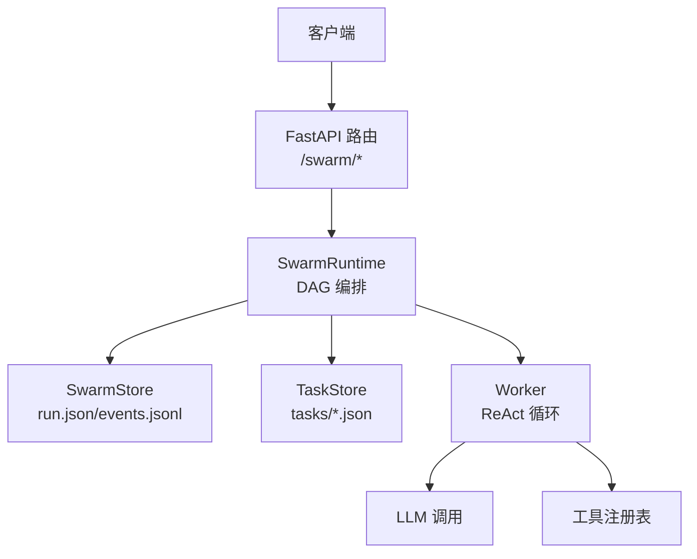
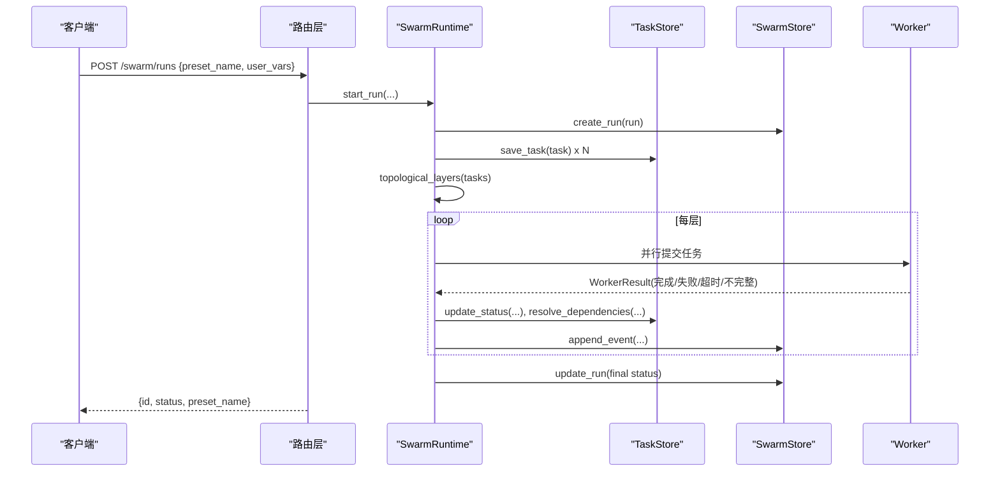
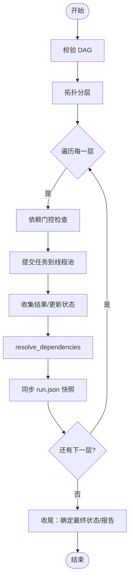
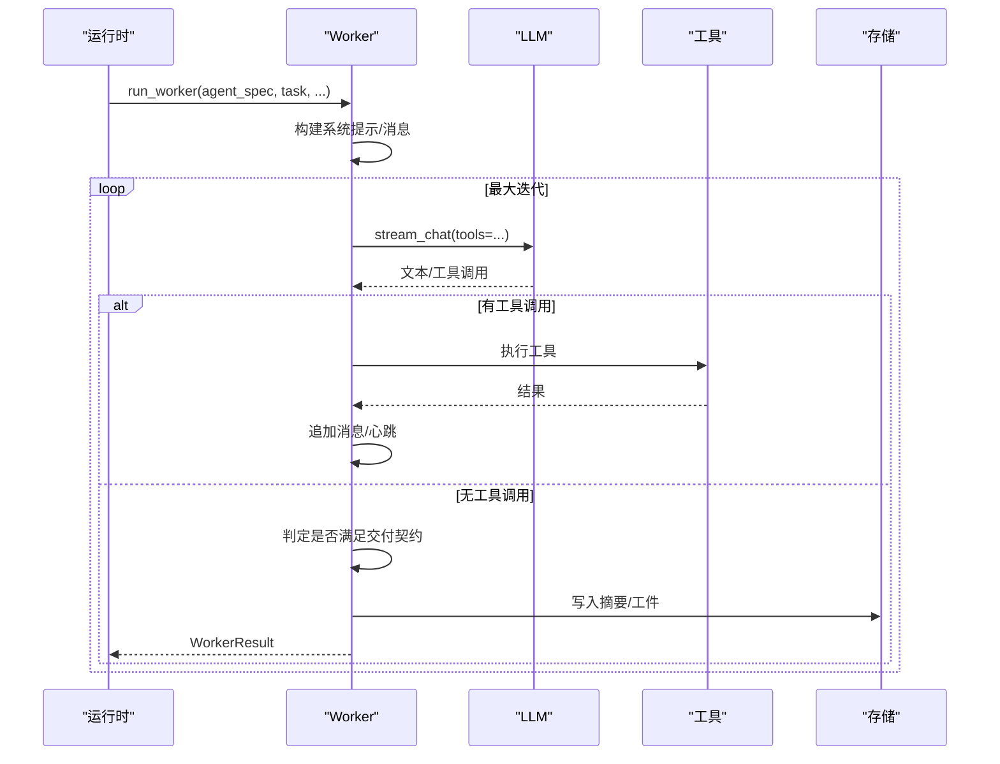
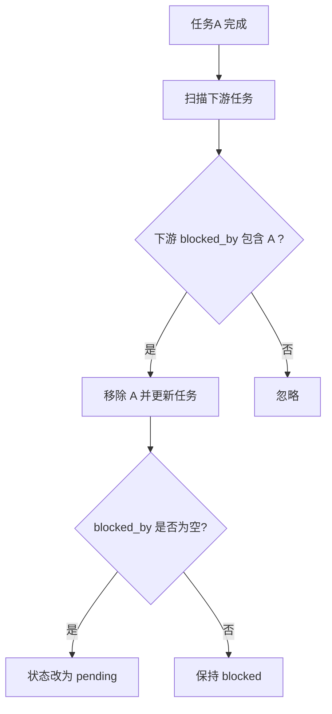

# Swarm 协作 API

<cite>
**本文引用的文件**
- [agent/src/api/swarm_routes.py](file://agent/src/api/swarm_routes.py)
- [agent/src/swarm/__init__.py](file://agent/src/swarm/__init__.py)
- [agent/src/swarm/models.py](file://agent/src/swarm/models.py)
- [agent/src/swarm/runtime.py](file://agent/src/swarm/runtime.py)
- [agent/src/swarm/store.py](file://agent/src/swarm/store.py)
- [agent/src/swarm/task_store.py](file://agent/src/swarm/task_store.py)
- [agent/src/swarm/worker.py](file://agent/src/swarm/worker.py)
- [agent/src/swarm/presets.py](file://agent/src/swarm/presets.py)
</cite>

## 目录
1. [简介](#简介)
2. [项目结构](#项目结构)
3. [核心组件](#核心组件)
4. [架构总览](#架构总览)
5. [端点参考](#端点参考)
6. [详细组件分析](#详细组件分析)
7. [依赖与 DAG 管理](#依赖与-dag-管理)
8. [性能与并发](#性能与并发)
9. [故障排查](#故障排查)
10. [结论](#结论)
11. [附录：协作工作流示例](#附录协作工作流示例)

## 简介
本文件为 Swarm 多代理协作系统的 REST API 完整端点参考，覆盖任务编排、工作流管理、结果聚合、SSE 事件流、重试与取消等能力。文档同时说明 DAG 任务图、依赖管理与容错机制，并提供端到端的复杂研究任务分解、并行执行与结果整合的协作流程示例。

## 项目结构
Swarm 协作能力由 FastAPI 路由层暴露 HTTP/SSE 接口，后端通过运行时引擎按拓扑层调度 Worker 执行任务，持久化使用文件系统（run.json、events.jsonl、tasks/*.json），并通过预设（YAML）定义多代理角色与任务图。

图表来源
- [agent/src/api/swarm_routes.py:45-260](file://agent/src/api/swarm_routes.py#L45-L260)
- [agent/src/swarm/runtime.py:53-159](file://agent/src/swarm/runtime.py#L53-L159)
- [agent/src/swarm/store.py:116-285](file://agent/src/swarm/store.py#L116-L285)
- [agent/src/swarm/task_store.py:16-147](file://agent/src/swarm/task_store.py#L16-L147)
- [agent/src/swarm/worker.py:375-730](file://agent/src/swarm/worker.py#L375-L730)

章节来源
- [agent/src/api/swarm_routes.py:45-260](file://agent/src/api/swarm_routes.py#L45-L260)
- [agent/src/swarm/runtime.py:53-159](file://agent/src/swarm/runtime.py#L53-L159)
- [agent/src/swarm/store.py:116-285](file://agent/src/swarm/store.py#L116-L285)
- [agent/src/swarm/task_store.py:16-147](file://agent/src/swarm/task_store.py#L16-L147)
- [agent/src/swarm/worker.py:375-730](file://agent/src/swarm/worker.py#L375-L730)

## 核心组件
- 路由层：提供 /swarm/* REST 与 SSE 端点，负责鉴权、参数校验、调用运行时。
- 运行时：解析预设、构建 DAG、按层并行调度 Worker、汇总结果、处理取消与超时。
- 存储层：原子写入 run.json、追加 events.jsonl、独立任务文件 tasks/*.json。
- 任务图：DAG 验证、拓扑分层、依赖解除、阻塞传播。
- Worker：轻量 ReAct 循环，支持心跳、流式输出、内容过滤熔断、重试清理。
- 预设：YAML 定义 agents 与 tasks，支持用户覆盖与变量模板渲染。

章节来源
- [agent/src/swarm/__init__.py:1-35](file://agent/src/swarm/__init__.py#L1-L35)
- [agent/src/swarm/models.py:123-328](file://agent/src/swarm/models.py#L123-L328)
- [agent/src/swarm/presets.py:286-354](file://agent/src/swarm/presets.py#L286-L354)

## 架构总览
Swarm 以“预设驱动”的多代理 DAG 执行为核心：
- 启动时加载预设，生成 SwarmRun（包含 agents 与 tasks）。
- 运行前进行 DAG 校验与拓扑分层。
- 逐层提交任务到线程池并行执行；每层内可并行，层间串行。
- 每个任务由 Worker 执行 ReAct 循环，产出摘要与工件。
- 事件通过 events.jsonl 记录并对外提供 SSE 增量推送。
- 失败/超时/取消/被上游阻塞的任务会被正确标记，最终汇聚为 run 级状态。

图表来源
- [agent/src/api/swarm_routes.py:91-107](file://agent/src/api/swarm_routes.py#L91-L107)
- [agent/src/swarm/runtime.py:222-402](file://agent/src/swarm/runtime.py#L222-L402)
- [agent/src/swarm/store.py:160-285](file://agent/src/swarm/store.py#L160-L285)
- [agent/src/swarm/task_store.py:47-147](file://agent/src/swarm/task_store.py#L47-L147)
- [agent/src/swarm/worker.py:375-730](file://agent/src/swarm/worker.py#L375-L730)

## 端点参考
以下端点均挂载于 /swarm 路径下，需通过宿主服务的认证中间件。

- GET /swarm/presets
  - 功能：列出可用的 Swarm 预设（含内置与用户自定义）。
  - 鉴权：需要。
  - 返回：预设清单（名称、标题、描述、变量、来源等）。
  - 异常：无业务异常。

- POST /swarm/runs
  - 功能：创建并启动一次 Swarm 运行。
  - 请求体：
    - preset_name: string，必填。
    - user_vars: object<string,string>，可选，用于模板渲染。
  - 返回：{ id, status, preset_name }。
  - 异常：
    - 404：预设不存在。
    - 400：DAG 或参数校验失败。

- GET /swarm/runs
  - 功能：列出最近的运行（已做 reconcile，避免僵尸 running）。
  - 查询参数：limit: int，默认 20，范围 1..100。
  - 返回：运行列表（含 is_stale、task_count、completed_count 等）。

- GET /swarm/runs/{run_id}
  - 功能：获取运行详情（含任务状态、最终报告等，已 reconcile）。
  - 路径参数：run_id: string。
  - 返回：运行对象（agents、tasks、final_report、时间戳等）。
  - 异常：404 若不存在。

- GET /swarm/runs/{run_id}/events
  - 功能：SSE 事件流，增量推送运行事件。
  - 查询参数：last_index: int，默认 0。
  - 请求头：Last-Event-ID: int，可选，用于断线续传。
  - 事件类型：run_started、layer_started、task_started、task_completed、task_failed、task_blocked、task_retry、run_completed、done 等。
  - 异常：404 若运行不存在。

- POST /swarm/runs/{run_id}/cancel
  - 功能：取消正在运行的运行。
  - 返回：{ status: "cancelled" }。
  - 异常：404 若无活动运行。

- POST /swarm/runs/{run_id}/retry
  - 功能：对失败/陈旧/已取消的运行重试，复用原 preset 与 user_vars。
  - 返回：新运行的 { id, status, preset_name }。
  - 异常：
    - 404：运行不存在。
    - 409：当前运行仍为 running，需先取消。
    - 400/404：预设或参数问题。

章节来源
- [agent/src/api/swarm_routes.py:79-260](file://agent/src/api/swarm_routes.py#L79-L260)

## 详细组件分析

### 路由层（FastAPI）
- 懒初始化 SwarmRuntime，注入 store 与 agent_config。
- 统一路径参数校验与 shell tools 开关透传。
- 将 SSE 流与事件索引对接到 store 的事件日志。

章节来源
- [agent/src/api/swarm_routes.py:21-76](file://agent/src/api/swarm_routes.py#L21-L76)
- [agent/src/api/swarm_routes.py:91-260](file://agent/src/api/swarm_routes.py#L91-L260)

### 运行时（SwarmRuntime）
- start_run：重建 MCP 工具缓存、预取 grounding 数据、创建 run、后台线程执行。
- _execute_run：更新状态、保存任务、计算拓扑层、逐层并行执行、汇总 token 计数、同步快照、收尾。
- _execute_layer：依赖门控（blocked_by）、提交任务、层级截止时间保护、收集结果、resolve_dependencies。
- _run_worker_with_retries：清理工件后重试，累计 token，发射 task_retry 事件。
- cancel_run：设置取消事件。

图表来源
- [agent/src/swarm/runtime.py:222-402](file://agent/src/swarm/runtime.py#L222-L402)
- [agent/src/swarm/runtime.py:476-645](file://agent/src/swarm/runtime.py#L476-L645)
- [agent/src/swarm/runtime.py:647-748](file://agent/src/swarm/runtime.py#L647-L748)

章节来源
- [agent/src/swarm/runtime.py:90-159](file://agent/src/swarm/runtime.py#L90-L159)
- [agent/src/swarm/runtime.py:222-402](file://agent/src/swarm/runtime.py#L222-L402)
- [agent/src/swarm/runtime.py:476-645](file://agent/src/swarm/runtime.py#L476-L645)
- [agent/src/swarm/runtime.py:647-748](file://agent/src/swarm/runtime.py#L647-L748)

### 存储层（SwarmStore 与 TaskStore）
- SwarmStore：
  - 原子写入 run.json（临时文件 + rename，Windows 兼容重试）。
  - 追加 events.jsonl，支持 after_index 读取。
  - hydrate_run：合并 live tasks 到 run.tasks。
  - reconcile_run：终端恢复、陈旧运行回收、写回与事件记录。
  - reap_stale_running_runs：扫描所有运行并 reconcile。
- TaskStore：
  - 任务文件 CRUD。
  - resolve_dependencies：下游 blocked_by 移除与新未阻塞任务发现。
  - validate_dag：DFS 环检测。
  - topological_layers：Kahn 算法分层。

章节来源
- [agent/src/swarm/store.py:115-566](file://agent/src/swarm/store.py#L115-L566)
- [agent/src/swarm/task_store.py:16-249](file://agent/src/swarm/task_store.py#L16-L249)

### Worker（ReAct 循环）
- 构建系统提示（角色、技能白名单、数据引用纪律、执行规则、当前时间）。
- 流式 LLM 调用，带心跳计时器，防止假死误判。
- 工具调用执行，注入 run_dir，限制最近工具消息数量控制上下文膨胀。
- 内容过滤熔断：连续被拦截达到阈值则中断。
- 超时与 token 上限保护。
- 产物写入 artifacts/{agent_id}，支持重试前清理。

图表来源
- [agent/src/swarm/worker.py:183-304](file://agent/src/swarm/worker.py#L183-L304)
- [agent/src/swarm/worker.py:375-730](file://agent/src/swarm/worker.py#L375-L730)

章节来源
- [agent/src/swarm/worker.py:375-730](file://agent/src/swarm/worker.py#L375-L730)

### 预设与模型
- 预设 YAML：定义 agents（角色、工具、技能、超时、重试等）与 tasks（依赖、输入映射、提示模板）。
- 变量：user_vars 用于模板渲染；inspect_preset 可提前发现缺失/未使用变量。
- 模型枚举：TaskStatus、RunStatus、WorkerStatus 等，保证 JSON 序列化一致。

章节来源
- [agent/src/swarm/presets.py:71-143](file://agent/src/swarm/presets.py#L71-L143)
- [agent/src/swarm/presets.py:171-283](file://agent/src/swarm/presets.py#L171-L283)
- [agent/src/swarm/presets.py:286-354](file://agent/src/swarm/presets.py#L286-L354)
- [agent/src/swarm/models.py:123-328](file://agent/src/swarm/models.py#L123-L328)

## 依赖与 DAG 管理
- 依赖声明：SwarmTask.depends_on 表示上游任务 ID 集合。
- 运行时阻塞：若任一上游未完成，任务标记为 blocked，不派发执行。
- 依赖解除：任务完成后，调用 resolve_dependencies 从下游 blocked_by 中移除该 ID，若为空且状态为 blocked，则转为 pending。
- 拓扑分层：topological_layers 计算可并行层，确保同层任务无依赖关系。
- 环检测：validate_dag 在启动时进行 DFS 环检测，防止死锁。

图表来源
- [agent/src/swarm/task_store.py:113-147](file://agent/src/swarm/task_store.py#L113-L147)
- [agent/src/swarm/runtime.py:520-561](file://agent/src/swarm/runtime.py#L520-L561)

章节来源
- [agent/src/swarm/task_store.py:113-249](file://agent/src/swarm/task_store.py#L113-L249)
- [agent/src/swarm/runtime.py:520-561](file://agent/src/swarm/runtime.py#L520-L561)

## 性能与并发
- 并行度：每层任务通过 ThreadPoolExecutor 并行执行，max_workers 可配置。
- 层级截止时间：基于 agent.timeout_seconds × (max_retries+1) 计算，防止个别任务卡死拖垮整层。
- 心跳机制：Worker 与 LLM 调用均包裹 HeartbeatTimer，持续向 events.jsonl 写入心跳，避免陈旧运行误判。
- 上下文压缩：仅保留最近若干工具消息，降低 token 占用。
- 流式重试：ProviderStreamError 允许一次重试，提高稳定性。
- 原子写入：run.json 采用临时文件 + rename，Windows 上具备重试策略。

章节来源
- [agent/src/swarm/runtime.py:476-645](file://agent/src/swarm/runtime.py#L476-L645)
- [agent/src/swarm/worker.py:485-636](file://agent/src/swarm/worker.py#L485-L636)
- [agent/src/swarm/store.py:94-113](file://agent/src/swarm/store.py#L94-L113)

## 故障排查
- 常见错误码：
  - 404：预设不存在、运行不存在、无活动运行。
  - 400：DAG 或参数校验失败。
  - 409：尝试重试一个仍在 running 的运行。
- 事件流调试：
  - 使用 /swarm/runs/{run_id}/events 订阅事件，关注 task_started、task_completed、task_failed、task_blocked、task_retry、run_completed、done。
  - 使用 Last-Event-ID 实现断线续传。
- 陈旧运行回收：
  - reconcile_run 会检测长时间无心跳的运行，将其非终态任务标记为 failed，并将运行状态置为 failed/cancelled/completed。
- Worker 失败原因：
  - timeout：超过任务超时。
  - token_limit：上下文过大。
  - incomplete：未满足交付契约（如未写入 report.md）。
  - content_filter_circuit_breaker：内容过滤连续触发过多。
- 工件与摘要：
  - 查看 artifacts/{agent_id} 下的 report.md 与中间文件。
  - 通过 get_swarm_run 获取 final_report（最后一个完成层的摘要）。

章节来源
- [agent/src/api/swarm_routes.py:135-260](file://agent/src/api/swarm_routes.py#L135-L260)
- [agent/src/swarm/store.py:316-424](file://agent/src/swarm/store.py#L316-L424)
- [agent/src/swarm/worker.py:494-730](file://agent/src/swarm/worker.py#L494-L730)

## 结论
Swarm 协作 API 提供了完整的“预设驱动”的多代理 DAG 执行能力，涵盖任务创建、依赖管理、并行执行、事件流监控、重试与取消、以及结果聚合。其设计强调健壮性（心跳、陈旧回收、原子写入）、可观测性（事件流、工件与摘要）与可扩展性（预设与工具白名单）。

## 附录：协作工作流示例
以下示例展示如何用一个预设完成复杂研究任务的分解、并行执行与结果整合。

- 目标：跨市场宏观与行业研究，生成投资决策建议。
- 预设要点：
  - agents：
    - macro_analyst：宏观分析师，工具包括 get_market_data 等。
    - sector_analyst：行业研究员，工具同上。
    - portfolio_manager：投资组合经理，依赖风险与收益分析。
  - tasks：
    - analyze_macro：无依赖，产出宏观摘要。
    - analyze_sector：无依赖，产出行业摘要。
    - risk_assessment：depends_on=[analyze_macro, analyze_sector]，评估风险。
    - return_projection：depends_on=[analyze_macro, analyze_sector]，预测收益。
    - investment_decision：depends_on=[risk_assessment, return_projection]，综合决策。
- 执行流程：
  - 第 1 层：analyze_macro、analyze_sector 并行执行。
  - 第 2 层：risk_assessment、return_projection 并行执行。
  - 第 3 层：investment_decision 聚合前两层结果，输出最终报告。
- 监控与调优：
  - 通过 /swarm/runs/{run_id}/events 实时观察任务状态与心跳。
  - 调整 max_iterations、timeout_seconds、max_retries 以平衡质量与耗时。
  - 利用 grounding_data 锚定真实价格，避免幻觉。

章节来源
- [agent/src/swarm/presets.py:286-354](file://agent/src/swarm/presets.py#L286-L354)
- [agent/src/swarm/runtime.py:222-402](file://agent/src/swarm/runtime.py#L222-L402)
- [agent/src/swarm/worker.py:183-304](file://agent/src/swarm/worker.py#L183-L304)