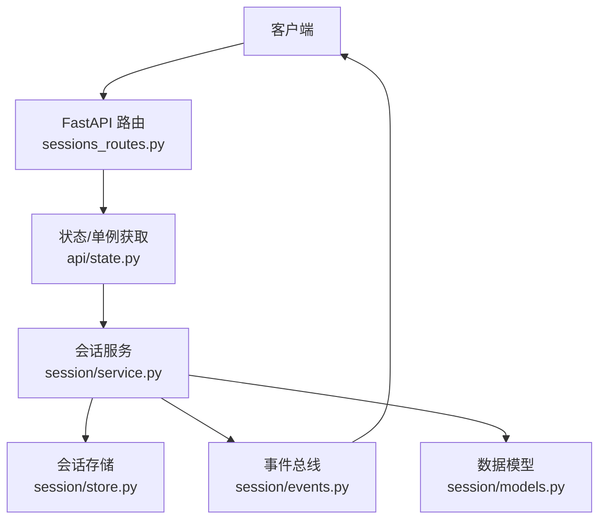
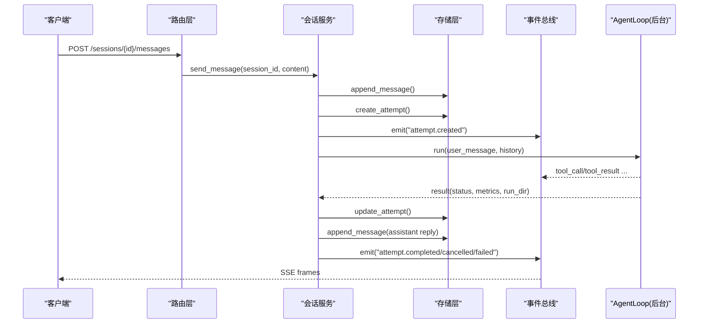
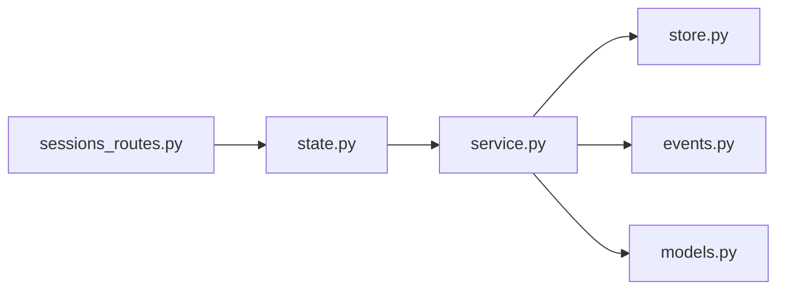

# 会话管理 API

<cite>
**本文引用的文件**
- [agent/api_server.py](file://agent/api_server.py)
- [agent/src/api/sessions_routes.py](file://agent/src/api/sessions_routes.py)
- [agent/src/session/service.py](file://agent/src/session/service.py)
- [agent/src/session/models.py](file://agent/src/session/models.py)
- [agent/src/session/store.py](file://agent/src/session/store.py)
- [agent/src/session/events.py](file://agent/src/session/events.py)
- [agent/src/api/state.py](file://agent/src/api/state.py)
</cite>

## 目录
1. [简介](#简介)
2. [项目结构](#项目结构)
3. [核心组件](#核心组件)
4. [架构总览](#架构总览)
5. [详细端点参考](#详细端点参考)
6. [依赖关系分析](#依赖关系分析)
7. [性能与并发](#性能与并发)
8. [故障恢复与排错](#故障恢复与排错)
9. [结论](#结论)
10. [附录：交互示例](#附录：交互示例)

## 简介
本文件为“会话管理”相关 REST API 的完整端点参考，覆盖 AI 对话会话的创建、消息发送、历史查询、状态管理、SSE 事件流等核心能力。文档同时说明会话持久化、内存管理与并发控制机制，并提供多轮对话、工具调用与结果处理的端到端交互示例，以及生命周期、资源清理和性能优化策略。

## 项目结构
会话管理由 FastAPI 路由层、会话服务层、存储层、事件总线与数据模型组成。路由负责鉴权、参数校验与响应封装；服务层编排消息到执行尝试（Attempt）的生命周期；存储层基于文件系统持久化会话、消息与尝试；事件总线提供 SSE 实时事件推送与重放；数据模型定义会话、消息、尝试及状态枚举。

图表来源
- [agent/src/api/sessions_routes.py:289-800](file://agent/src/api/sessions_routes.py#L289-L800)
- [agent/src/api/state.py:29-70](file://agent/src/api/state.py#L29-L70)
- [agent/src/session/service.py:53-92](file://agent/src/session/service.py#L53-L92)
- [agent/src/session/store.py:16-56](file://agent/src/session/store.py#L16-L56)
- [agent/src/session/events.py:57-113](file://agent/src/session/events.py#L57-L113)
- [agent/src/session/models.py:121-166](file://agent/src/session/models.py#L121-L166)

章节来源
- [agent/api_server.py:185-201](file://agent/api_server.py#L185-L201)
- [agent/src/api/sessions_routes.py:320-362](file://agent/src/api/sessions_routes.py#L320-L362)

## 核心组件
- 路由层：定义会话 CRUD、消息发送、取消、历史查询、SSE 事件流等端点，统一鉴权与错误码映射。
- 会话服务：维护会话并发控制（每个会话一次运行）、消息追加、尝试创建与执行调度、结果格式化与指标加载。
- 存储层：以文件系统组织 sessions/{id}/session.json、messages.jsonl、attempts/{attempt_id}/attempt.json，支持追加日志与原子更新。
- 事件总线：线程安全的 SSE 事件发布/订阅，支持 last_event_id 重放与心跳保活。
- 数据模型：Session、Message、Attempt 及其状态枚举，提供序列化/反序列化方法。

章节来源
- [agent/src/session/service.py:53-92](file://agent/src/session/service.py#L53-L92)
- [agent/src/session/store.py:16-56](file://agent/src/session/store.py#L16-L56)
- [agent/src/session/events.py:57-113](file://agent/src/session/events.py#L57-L113)
- [agent/src/session/models.py:121-166](file://agent/src/session/models.py#L121-L166)

## 架构总览
会话请求从 FastAPI 进入，经鉴权后委派给 SessionService。服务层在写入消息与创建 Attempt 后，异步执行 AgentLoop，期间通过 EventBus 推送 tool_call/tool_result 等事件。SSE 客户端可订阅 /sessions/{id}/events 并基于 Last-Event-ID 断线重连。

图表来源
- [agent/src/api/sessions_routes.py:732-751](file://agent/src/api/sessions_routes.py#L732-L751)
- [agent/src/session/service.py:244-307](file://agent/src/session/service.py#L244-L307)
- [agent/src/session/service.py:248-344](file://agent/src/session/service.py#L248-L344)
- [agent/src/session/events.py:171-193](file://agent/src/session/events.py#L171-L193)

## 详细端点参考

### 会话管理
- POST /sessions
  - 功能：创建会话，记录所有者与会话配置。
  - 请求体：title, config（可选）。
  - 响应：session_id, title, status, created_at, updated_at, last_attempt_id。
  - 鉴权：需要认证。
  - 错误：未启用会话运行时返回 501。
  - 行为：创建后索引搜索、发出 session.created 事件。

- GET /sessions?limit=...
  - 功能：列出会话（按更新时间倒序），默认 limit=50，范围 1..200。
  - 鉴权：需要认证。

- GET /sessions/{session_id}
  - 功能：获取单个会话详情。
  - 路径参数：session_id（需校验）。
  - 鉴权：需要认证。
  - 错误：不存在返回 404。

- PATCH /sessions/{session_id}
  - 功能：更新会话字段（如标题）。
  - 鉴权：需要认证。
  - 错误：不存在返回 404。

- DELETE /sessions/{session_id}
  - 功能：删除会话及其所有数据。
  - 鉴权：需要认证。
  - 错误：不存在返回 404。

- POST /sessions/{session_id}/title/auto
  - 功能：基于首轮用户与助手内容自动生成简短标题（不覆盖手动标题）。
  - 鉴权：需要认证。
  - 错误：无用户消息返回 409；生成失败返回 502。

章节来源
- [agent/src/api/sessions_routes.py:366-431](file://agent/src/api/sessions_routes.py#L366-L431)
- [agent/src/api/sessions_routes.py:605-695](file://agent/src/api/sessions_routes.py#L605-L695)

### 消息与执行
- POST /sessions/{session_id}/messages
  - 功能：发送用户消息并触发执行（自然语言策略描述）。
  - 请求体：content（1..5000 字符）。
  - 鉴权：需要认证。
  - 并发：若会话已有运行中任务，返回 409（SessionBusyError）。
  - 返回：message_id, attempt_id。
  - 错误：会话不存在返回 404。

- POST /sessions/{session_id}/cancel
  - 功能：取消当前运行中的 AgentLoop。
  - 鉴权：需要认证。
  - 返回：{"status": "cancelled"} 或 {"status": "no_active_loop"}。

- GET /sessions/{session_id}/messages?limit=...
  - 功能：获取会话消息历史（最近 limit 条，默认 100，最大 1000）。
  - 鉴权：需要认证。
  - 返回：message_id, session_id, role, content, created_at, linked_attempt_id, metadata, tool_trail。

章节来源
- [agent/src/api/sessions_routes.py:732-763](file://agent/src/api/sessions_routes.py#L732-L763)
- [agent/src/api/sessions_routes.py:765-785](file://agent/src/api/sessions_routes.py#L765-L785)

### 事件流（SSE）
- GET /sessions/{session_id}/events
  - 功能：订阅会话事件流，支持 Last-Event-ID 重放与 active 模式回放。
  - 查询参数：Last-Event-ID（或 Last-Event-Id），replay=active。
  - 鉴权：需要事件流专用鉴权。
  - 特性：
    - 自动转发 mandate.proposal 与 live.action 等工具结果帧。
    - 断开检测与心跳保活。
    - 支持 replay_all 用于活跃运行的全量回放。
  - 错误：会话不存在返回 404；未启用运行时返回 501。

章节来源
- [agent/src/api/sessions_routes.py:752-800](file://agent/src/api/sessions_routes.py#L752-L800)
- [agent/src/session/events.py:185-235](file://agent/src/session/events.py#L185-L235)

### 目标（Goal）子组（与研究目标相关）
- POST /sessions/{session_id}/goal
  - 功能：创建或替换当前研究目标（包含 objective、criteria、protocol、risk_tier、预算等）。
  - 鉴权：需要认证。
  - 错误：无效 risk_tier 返回 400；不支持实盘交易目标返回 400。

- GET /sessions/{session_id}/goal
  - 功能：获取当前目标快照。
  - 鉴权：需要认证。
  - 错误：无当前目标返回 404。

- PATCH /sessions/{session_id}/goal
  - 功能：编辑当前目标（objective/ui_summary），带乐观锁 expected_goal_id。
  - 鉴权：需要认证。
  - 错误：冲突返回 409；参数错误返回 400。

- POST /sessions/{session_id}/goal/evidence
  - 功能：追加可追溯证据（含来源、时间框架、假设、置信度等）。
  - 鉴权：需要认证。
  - 错误：冲突返回 409；参数错误返回 400。

- PATCH /sessions/{session_id}/goal/status
  - 功能：更新目标状态（含审计行与摘要）。
  - 鉴权：需要认证。
  - 错误：无效状态返回 400；冲突返回 409。

章节来源
- [agent/src/api/sessions_routes.py:437-630](file://agent/src/api/sessions_routes.py#L437-L630)

## 依赖关系分析
- 路由依赖：
  - 鉴权：require_auth、require_event_stream_auth。
  - 会话服务：通过 _get_session_service() 懒加载，受环境变量 enable_session_runtime 控制。
  - 路径参数校验：_validate_path_param。
  - Shell 工具开关：_shell_tools_enabled_for_request。

- 服务依赖：
  - 存储：SessionStore（文件系统）。
  - 事件：EventBus（线程安全队列 + 缓冲）。
  - 搜索索引：get_shared_index()（会话与消息索引）。
  - 执行：AgentLoop（通过工具注册表构建，使用线程池隔离）。

- 模型依赖：
  - Session/Message/Attempt 与状态枚举，提供 to_dict/from_dict。

图表来源
- [agent/src/api/sessions_routes.py:320-362](file://agent/src/api/sessions_routes.py#L320-L362)
- [agent/src/api/state.py:29-70](file://agent/src/api/state.py#L29-L70)
- [agent/src/session/service.py:53-92](file://agent/src/session/service.py#L53-L92)

章节来源
- [agent/src/api/state.py:29-70](file://agent/src/api/state.py#L29-L70)
- [agent/src/api/sessions_routes.py:320-362](file://agent/src/api/sessions_routes.py#L320-L362)

## 性能与并发
- 并发控制：
  - 每个会话仅允许一个运行中的 AgentLoop。send_message 在写入前抢占“进行中”标记，避免重复创建尝试导致消息交错。
  - 使用线程池限制最多 4 个并行 Agent 实例，防止耗尽默认执行器。
  - 取消流程支持两种阶段：已构建 AgentLoop 时调用 loop.cancel()；尚未构建时直接取消 asyncio.Task，释放占用。

- 持久化与 I/O：
  - 消息采用 JSONL 追加写，fsync 保证落盘。
  - 会话与尝试使用 JSON 文件，更新时整写。
  - 列表操作跳过损坏条目，避免中断。

- 事件流：
  - 每会话缓冲上限 500 条，超过丢弃最旧事件。
  - 订阅者队列容量 200，满时丢弃并告警。
  - 支持 Last-Event-ID 重放与心跳保活，提升弱网稳定性。

- 上下文裁剪：
  - 将历史消息转换为 LLM 格式并按字符预算裁剪（约 12000 字符），保留关键信息并截断过长消息，降低 token 消耗。

章节来源
- [agent/src/session/service.py:32-33](file://agent/src/session/service.py#L32-L33)
- [agent/src/session/service.py:179-202](file://agent/src/session/service.py#L179-L202)
- [agent/src/session/service.py:227-246](file://agent/src/session/service.py#L227-L246)
- [agent/src/session/store.py:155-166](file://agent/src/session/store.py#L155-L166)
- [agent/src/session/events.py:67-77](file://agent/src/session/events.py#L67-L77)
- [agent/src/session/events.py:185-235](file://agent/src/session/events.py#L185-L235)
- [agent/src/session/service.py:649-699](file://agent/src/session/service.py#L649-L699)

## 故障恢复与排错
- 常见错误码：
  - 400：参数非法（如 risk_tier、goal status）。
  - 404：会话或目标不存在。
  - 409：会话忙（已有运行中任务）或目标版本冲突。
  - 501：会话运行时未启用。
  - 502：外部服务失败（如标题生成）。
  - 500：内部错误（如无法重新加载快照）。

- 断线重连：
  - SSE 客户端携带 Last-Event-ID，服务端从缓冲中重放缺失事件；对活跃运行可使用 replay=active 进行全量回放。

- 资源清理：
  - 删除会话会清空事件缓冲并通知订阅者（session_cleared），随后移除订阅者列表，避免向死队列投递。
  - 服务层 finally 块确保释放“进行中”标记与任务句柄。

- 诊断建议：
  - 检查会话是否存在且未被占用。
  - 确认事件流鉴权与 Last-Event-ID 是否正确。
  - 查看存储目录是否可写，JSONL 是否损坏。
  - 关注事件总线队列是否频繁溢出。

章节来源
- [agent/src/api/sessions_routes.py:366-431](file://agent/src/api/sessions_routes.py#L366-L431)
- [agent/src/api/sessions_routes.py:732-763](file://agent/src/api/sessions_routes.py#L732-L763)
- [agent/src/api/sessions_routes.py:752-800](file://agent/src/api/sessions_routes.py#L752-L800)
- [agent/src/session/events.py:280-308](file://agent/src/session/events.py#L280-L308)
- [agent/src/session/service.py:325-344](file://agent/src/session/service.py#L325-L344)

## 结论
该会话管理 API 提供了完整的会话生命周期管理能力，结合文件系统持久化与线程安全的事件总线，实现了高可靠的多轮对话与工具调用流程。通过严格的并发控制、断线重连与资源清理机制，保障了用户体验与系统稳定性。建议在集成时遵循鉴权、限流与监控最佳实践，并结合业务场景调整事件缓冲与历史裁剪策略。

## 附录：交互示例

### 多轮对话与工具调用
- 步骤概览：
  1) 创建会话：POST /sessions
  2) 发送消息：POST /sessions/{id}/messages
  3) 订阅事件：GET /sessions/{id}/events（携带 Last-Event-ID）
  4) 查询历史：GET /sessions/{id}/messages
  5) 取消运行（可选）：POST /sessions/{id}/cancel

- 典型事件序列：
  - message.received → attempt.created → attempt.started → tool_call/tool_result（多次）→ attempt.completed/cancelled/failed

- 工具调用结果处理：
  - 事件流中包含 tool_call 与 tool_result，服务端会将成功完成的工具调用轨迹合并至 assistant 消息的 tool_trail，便于前端展示。

章节来源
- [agent/src/api/sessions_routes.py:732-763](file://agent/src/api/sessions_routes.py#L732-L763)
- [agent/src/api/sessions_routes.py:752-800](file://agent/src/api/sessions_routes.py#L752-L800)
- [agent/src/session/service.py:385-440](file://agent/src/session/service.py#L385-L440)
- [agent/src/session/service.py:576-647](file://agent/src/session/service.py#L576-L647)