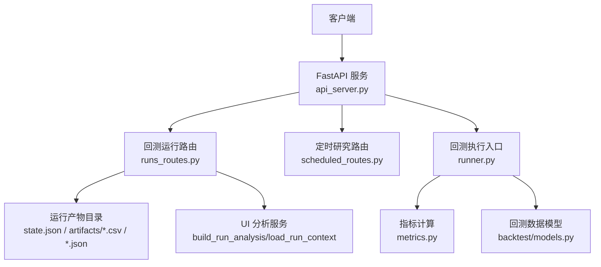
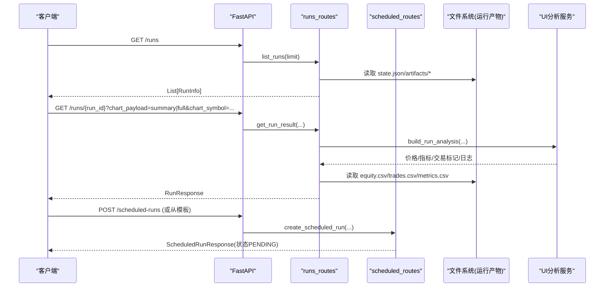
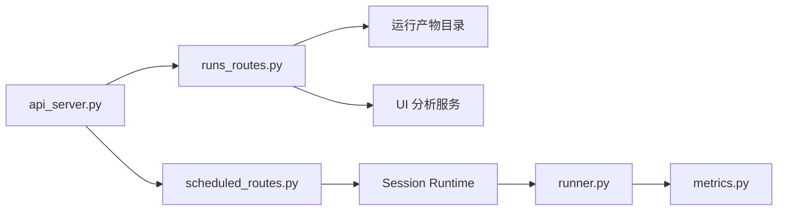

# 回测运行 API

<cite>
**本文引用的文件**
- [runs_routes.py](file://agent/src/api/runs_routes.py)
- [models.py](file://agent/src/api/models.py)
- [api_server.py](file://agent/api_server.py)
- [runner.py](file://agent/backtest/runner.py)
- [metrics.py](file://agent/backtest/metrics.py)
- [models.py（回测模型）](file://agent/backtest/models.py)
- [base.py（优化器基类）](file://agent/backtest/optimizers/base.py)
- [scheduled_routes.py](file://agent/src/api/scheduled_routes.py)
</cite>

## 目录
1. [简介](#简介)
2. [项目结构](#项目结构)
3. [核心组件](#核心组件)
4. [架构总览](#架构总览)
5. [详细端点参考](#详细端点参考)
6. [依赖关系分析](#依赖关系分析)
7. [性能与并发](#性能与并发)
8. [故障排查指南](#故障排查指南)
9. [结论](#结论)
10. [附录：工作流示例](#附录工作流示例)

## 简介
本文件为“回测运行管理”相关 REST API 的完整端点参考，覆盖回测任务的创建、查询、结果获取、删除等能力；并说明回测配置参数、结果数据结构、性能指标、任务调度、资源管理与并发控制机制，以及结果可视化、报告生成与导出。

## 项目结构
- API 路由层
  - 回测运行列表与详情：[runs_routes.py](file://agent/src/api/runs_routes.py)
  - 定时研究（可承载回测任务）：[scheduled_routes.py](file://agent/src/api/scheduled_routes.py)
  - 共享响应模型：[models.py](file://agent/src/api/models.py)
  - FastAPI 应用挂载：[api_server.py](file://agent/api_server.py)
- 回测执行与数据
  - 回测入口与配置校验：[runner.py](file://agent/backtest/runner.py)
  - 回测指标计算：[metrics.py](file://agent/backtest/metrics.py)
  - 回测数据模型（持仓、成交、权益快照等）：[models.py（回测模型）](file://agent/backtest/models.py)
  - 组合优化器基类：[base.py（优化器基类）](file://agent/backtest/optimizers/base.py)

**图示来源**
- [api_server.py:193-199](file://agent/api_server.py#L193-L199)
- [runs_routes.py:237-356](file://agent/src/api/runs_routes.py#L237-L356)
- [scheduled_routes.py:259-365](file://agent/src/api/scheduled_routes.py#L259-L365)
- [runner.py:1-800](file://agent/backtest/runner.py#L1-L800)
- [metrics.py:461-626](file://agent/backtest/metrics.py#L461-L626)

**章节来源**
- [api_server.py:193-199](file://agent/api_server.py#L193-L199)
- [runs_routes.py:237-356](file://agent/src/api/runs_routes.py#L237-L356)
- [scheduled_routes.py:259-365](file://agent/src/api/scheduled_routes.py#L259-L365)

## 核心组件
- 运行产物与响应模型
  - RunInfo：用于列表视图的轻量运行信息
  - RunResponse：单个运行的完整响应，包含状态、指标、产物清单、图表数据、日志等
  - Artifact：产物元数据（名称、路径、类型、大小、存在性）
  - BacktestMetrics：回测摘要指标（最终净值、总收益、年化收益、最大回撤、夏普、胜率、交易次数等）
  - RAGSelection：RAG 路由选择元数据
- 回测执行与指标
  - BacktestConfigSchema：回测配置校验（代码列表、起止日期、数据源、周期、引擎、初始资金、基本面字段、事件流等）
  - metrics.calc_metrics：统一指标计算（含基准对比、跟踪误差、信息比率、换手率等）
  - backtest.models：Position/FillRecord/TradeRecord/EquitySnapshot 等不可变数据模型
- 优化器
  - BaseOptimizer：提供滚动窗口、协方差构建、权重归一化、符号保持等通用逻辑

**章节来源**
- [models.py:10-104](file://agent/src/api/models.py#L10-L104)
- [runner.py:68-163](file://agent/backtest/runner.py#L68-L163)
- [metrics.py:461-626](file://agent/backtest/metrics.py#L461-L626)
- [models.py（回测模型）:13-118](file://agent/backtest/models.py#L13-L118)
- [base.py（优化器基类）:14-85](file://agent/backtest/optimizers/base.py#L14-L85)

## 架构总览
- 请求进入 FastAPI 后，由 runs_routes 或 scheduled_routes 处理
- runs_routes 读取持久化的运行目录（state.json、artifacts/*、run_card.json 等），组装 RunResponse
- scheduled_routes 通过 Session Runtime 将研究/回测任务入队，支持 cron/interval 调度
- runner.py 负责加载策略代码、安全扫描、数据加载、引擎执行、指标计算与产物落盘
- metrics.py 提供统一的年化、收益、风险、换手、基准对比等指标计算

**图示来源**
- [runs_routes.py:313-356](file://agent/src/api/runs_routes.py#L313-L356)
- [runs_routes.py:1021-1120](file://agent/src/api/runs_routes.py#L1021-L1120)
- [scheduled_routes.py:259-335](file://agent/src/api/scheduled_routes.py#L259-L335)
- [scheduled_routes.py:417-482](file://agent/src/api/scheduled_routes.py#L417-L482)

## 详细端点参考

### 列出最近回测运行
- 方法：GET
- 路径：/runs
- 认证：需要（由宿主模块注入 require_auth）
- 查询参数：
  - limit：返回数量上限，默认 20，范围 1..100
- 响应体：List[RunInfo]
  - run_id：运行标识
  - status：success/failed/cancelled/unknown
  - created_at：创建时间
  - prompt：原始自然语言需求（优先 req.json，其次 planner_output.json，最后 user_prompt.txt）
  - total_return/sharpe：来自 artifacts/metrics.csv 首行
  - codes/start_date/end_date：来自运行上下文
- 行为要点：
  - 按运行目录名排序取最近 N 个
  - 若 state.json 不存在但存在 equity.csv 或 review_report.json，则视为 success

**章节来源**
- [runs_routes.py:1021-1120](file://agent/src/api/runs_routes.py#L1021-L1120)

### 获取单个回测运行详情
- 方法：GET
- 路径：/runs/{run_id}
- 认证：需要
- 查询参数：
  - chart_payload：可选，取值 summary 或 full；省略时等价 full
  - chart_symbol：可选，指定单一标的以启用该标的的图表载荷
- 响应体：RunResponse
  - 基础字段：status、run_id、elapsed_seconds、reason、prompt
  - 规划与策略：planner_output、strategy_spec、rag_selection
  - 指标：metrics（BacktestMetrics）
  - 产物清单：artifacts（Artifact[]）
  - 图表预览：equity_curve、trade_log
  - 全量 CSV：artifacts_equity_csv、artifacts_metrics_csv、artifacts_trades_csv、artifacts_positions_csv、artifacts_target_positions_csv
  - 其他：run_card、llm_usage、validation、risk_xray、rebalance_notes
  - 运行时上下文：run_stage、run_context、price_series、indicator_series、trade_markers、run_logs
- 行为要点：
  - 当 chart_payload=summary 且未指定 chart_symbol 时，会省略图表行与交易标记以降低体积
  - 当 chart_payload=full 或指定 chart_symbol 时，调用 UI 分析服务补充图表所需数据

**章节来源**
- [runs_routes.py:313-356](file://agent/src/api/runs_routes.py#L313-L356)
- [models.py:56-104](file://agent/src/api/models.py#L56-L104)

### 获取运行源码与 Pine 脚本
- 获取策略源码
  - 方法：GET
  - 路径：/runs/{run_id}/code
  - 响应：filename -> source 文本映射（当前仅 signal_engine.py）
- 获取 Pine 脚本
  - 方法：GET
  - 路径：/runs/{run_id}/pine
  - 响应：{exists, content}

**章节来源**
- [runs_routes.py:874-912](file://agent/src/api/runs_routes.py#L874-L912)

### 删除运行历史
- 说明：当前 runs_routes 未暴露删除端点。如需删除，请通过文件系统直接清理对应运行目录（谨慎操作）。

### 定时研究（可承载回测任务）
- 创建定时任务
  - 方法：POST
  - 路径：/scheduled-runs
  - 请求体：CreateScheduledRunRequest
    - id：可选，符合安全规则的正则
    - prompt：必填，研究提示或回测描述
    - schedule：必填，间隔毫秒或 5 字段 cron
    - next_run_at：可选，首次触发时间（毫秒）
    - config：可选，回测参数（将被转发给会话运行）
    - timezone：可选，IANA 时区键（cron 有效）
  - 响应：ScheduledRunResponse（id、prompt、schedule、next_run_at、status、created_at、last_run_at、consecutive_failures、last_error、failure_kind、config、timezone）
- 列出定时任务
  - 方法：GET
  - 路径：/scheduled-runs
  - 查询参数：status（可选）、limit（1..200）
  - 响应：List[ScheduledRunResponse]
- 删除定时任务
  - 方法：DELETE
  - 路径：/scheduled-runs/{job_id}
  - 响应：204 No Content
- 从模板创建任务
  - 方法：POST
  - 路径：/scheduled-runs/playbooks/{slug}
  - 请求体：CreateRunFromPlaybookRequest（id、schedule、timezone、variables、config、next_run_at）
  - 响应：ScheduledRunResponse

**章节来源**
- [scheduled_routes.py:117-224](file://agent/src/api/scheduled_routes.py#L117-L224)
- [scheduled_routes.py:259-365](file://agent/src/api/scheduled_routes.py#L259-L365)
- [scheduled_routes.py:375-482](file://agent/src/api/scheduled_routes.py#L375-L482)

## 依赖关系分析
- 路由注册
  - api_server 在启动时注册 runs_routes 与 scheduled_routes，并注入认证依赖
- 运行详情构建
  - runs_routes 通过 _build_response_from_run_dir 读取 state.json、artifacts/*、run_card.json、llm_usage.json、validation.json 等
  - 当启用图表载荷时，调用 UI 分析服务 build_run_analysis 获取 price_series、indicator_series、trade_markers、run_logs 等
- 回测执行
  - runner.py 解析 config.json，校验 BacktestConfigSchema，加载信号引擎并进行安全扫描，选择数据源与引擎，执行回测并产出 artifacts
- 指标计算
  - metrics.py 提供年化因子、收益序列、交易统计、换手率、基准对比等计算

**图示来源**
- [api_server.py:193-199](file://agent/api_server.py#L193-L199)
- [runs_routes.py:237-356](file://agent/src/api/runs_routes.py#L237-L356)
- [scheduled_routes.py:259-335](file://agent/src/api/scheduled_routes.py#L259-L335)
- [runner.py:1-800](file://agent/backtest/runner.py#L1-L800)
- [metrics.py:461-626](file://agent/backtest/metrics.py#L461-L626)

**章节来源**
- [api_server.py:193-199](file://agent/api_server.py#L193-L199)
- [runs_routes.py:237-356](file://agent/src/api/runs_routes.py#L237-L356)
- [scheduled_routes.py:259-335](file://agent/src/api/scheduled_routes.py#L259-L335)

## 性能与并发
- 列表接口
  - /runs 限制 limit<=100，避免大目录遍历导致延迟
- 详情接口
  - chart_payload=summary 可减少图表数据体积
  - 仅在必要时启用 chart_symbol 以缩小分析范围
- 指标计算
  - calc_metrics 对单观测样本进行保护，避免除零与 NaN 传播
  - 年化因子根据数据源与周期自动匹配，减少误算
- 调度器
  - 定时任务支持 interval 与 cron，支持时区；executor 在启用时才运行
- 并发与资源
  - 路由层无显式锁；实际并发受限于后端会话运行时与外部数据源限流
  - 建议在高并发场景下结合反向代理限流与队列化提交

[本节为通用指导，不直接分析具体文件]

## 故障排查指南
- 404 未找到
  - /runs/{run_id}：运行目录不存在
  - /runs/{run_id}/code：策略源码目录不存在
- 400 参数错误
  - /runs/{run_id}：chart_payload 非空且不为 summary
- 422 校验失败
  - /scheduled-runs：schedule/timezone/id 不符合规则
  - runner.BacktestConfigSchema：日期格式、区间、引擎、数据源非法；initial_cash<=0；start_date>end_date
- 运行状态 unknown
  - state.json 缺失或状态未知；检查 artifacts/equity.csv 是否存在
- 指标为空或异常
  - 检查 artifacts/metrics.csv 是否写入成功；确认数据源与周期匹配年化表
- 策略代码安全问题
  - runner 会在导入前进行 AST 安全扫描，禁止网络、进程、动态执行、写文件等危险操作

**章节来源**
- [runs_routes.py:273-356](file://agent/src/api/runs_routes.py#L273-L356)
- [scheduled_routes.py:259-335](file://agent/src/api/scheduled_routes.py#L259-L335)
- [runner.py:68-163](file://agent/backtest/runner.py#L68-L163)
- [runner.py:786-817](file://agent/backtest/runner.py#L786-L817)

## 结论
本 API 提供了完整的回测运行生命周期管理能力：通过 /runs 查看与检索历史运行，通过 /runs/{run_id} 获取结构化结果与可视化数据；通过 /scheduled-runs 实现定时研究与回测任务的编排。配合 runner 的安全沙箱与 metrics 的统一指标体系，可满足策略回测、参数优化与结果分析的一体化需求。

[本节为总结，不直接分析具体文件]

## 附录：工作流示例

### 工作流一：策略回测
- 步骤
  1) 准备策略代码与配置（codes、start_date、end_date、source、interval、engine、initial_cash 等）
  2) 通过会话或 CLI 触发运行，产物写入运行目录
  3) GET /runs 获取最近运行列表
  4) GET /runs/{run_id} 获取详情与指标
  5) 可选：GET /runs/{run_id}?chart_payload=summary&chart_symbol=XXX 获取精简图表数据
- 关键文件
  - 配置校验：[runner.py:68-163](file://agent/backtest/runner.py#L68-L163)
  - 指标计算：[metrics.py:461-626](file://agent/backtest/metrics.py#L461-L626)
  - 结果读取：[runs_routes.py:313-356](file://agent/src/api/runs_routes.py#L313-L356)

### 工作流二：参数优化（基于优化器）
- 思路
  - 使用 BaseOptimizer 或其子类对信号位置矩阵进行权重调整（如等波动、均值方差、风险平价等）
  - 在回测中传入优化器参数（lookback、params），得到目标权重并执行
- 关键文件
  - 优化器基类：[base.py（优化器基类）:14-85](file://agent/backtest/optimizers/base.py#L14-L85)
  - 回测执行入口：[runner.py:1-800](file://agent/backtest/runner.py#L1-L800)

### 工作流三：结果分析与导出
- 分析
  - 通过 RunResponse 中的 equity_curve、indicator_series、trade_markers、run_logs 进行可视化
  - 通过 artifacts_*_csv 导出全量 CSV 供离线分析
- 导出
  - 下载 artifacts 清单中的文件（equity.csv、trades.csv、positions.csv、target_positions.csv、metrics.csv 等）
- 关键文件
  - 响应模型与字段：[models.py:10-104](file://agent/src/api/models.py#L10-L104)
  - 详情构建：[runs_routes.py:52-227](file://agent/src/api/runs_routes.py#L52-L227)

### 工作流四：定时回测
- 步骤
  1) POST /scheduled-runs 创建定时任务（cron 或 interval）
  2) GET /scheduled-runs 查看任务列表与状态
  3) 任务执行后，通过 /runs 与 /runs/{run_id} 查看结果
- 关键文件
  - 定时任务创建与列表：[scheduled_routes.py:259-365](file://agent/src/api/scheduled_routes.py#L259-L365)
  - 从模板创建：[scheduled_routes.py:417-482](file://agent/src/api/scheduled_routes.py#L417-L482)