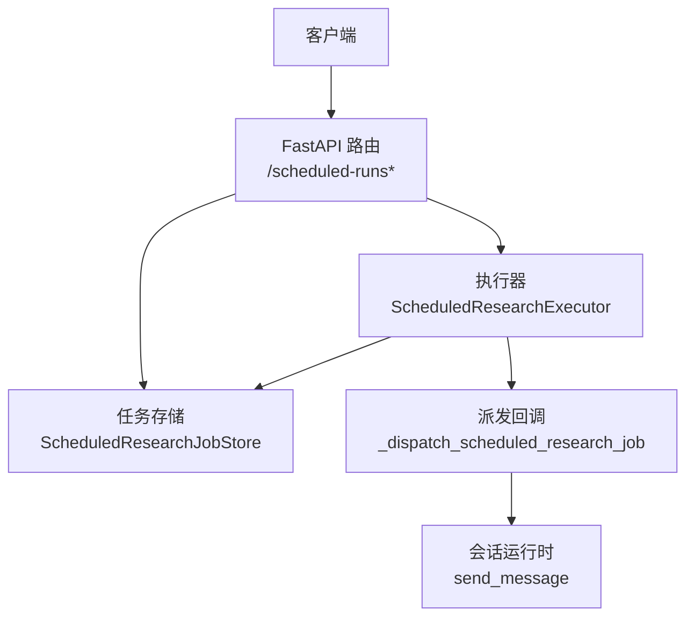
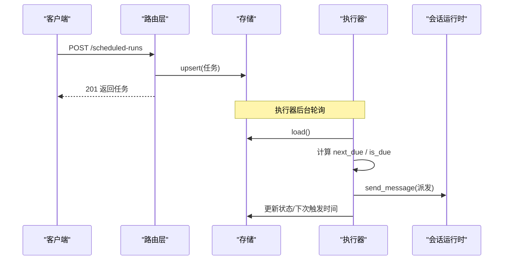
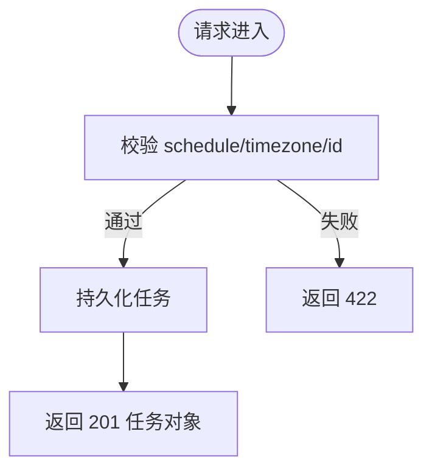
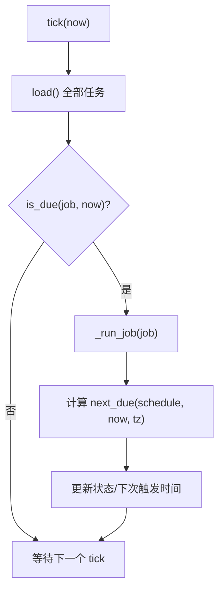
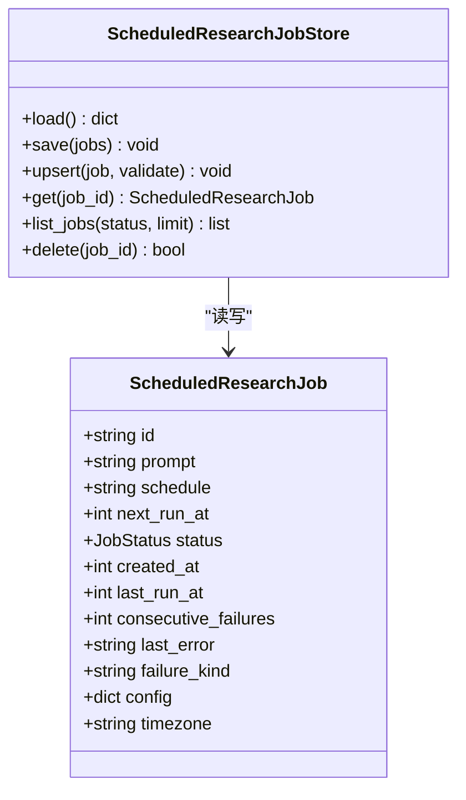
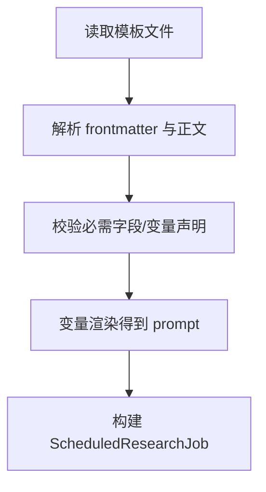
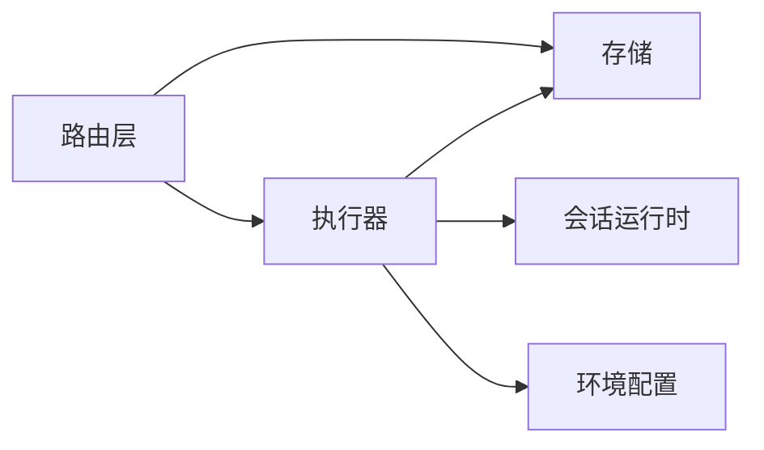

# 定时研究 API

<cite>
**本文引用的文件**
- [scheduled_routes.py](file://agent/src/api/scheduled_routes.py)
- [executor.py](file://agent/src/scheduled_research/executor.py)
- [models.py](file://agent/src/scheduled_research/models.py)
- [store.py](file://agent/src/scheduled_research/store.py)
- [playbooks.py](file://agent/src/scheduled_research/playbooks.py)
- [premarket-brief.md](file://agent/src/scheduled_research/playbooks/premarket-brief.md)
- [test_scheduled_routes.py](file://agent/tests/test_scheduled_routes.py)
- [env_schema.py](file://agent/src/config/env_schema.py)
</cite>

## 目录
1. [简介](#简介)
2. [项目结构](#项目结构)
3. [核心组件](#核心组件)
4. [架构总览](#架构总览)
5. [详细组件分析](#详细组件分析)
6. [依赖关系分析](#依赖关系分析)
7. [性能与可靠性](#性能与可靠性)
8. [故障排查指南](#故障排查指南)
9. [结论](#结论)
10. [附录：端点参考与示例](#附录端点参考与示例)

## 简介
本文件为“定时研究任务”的 REST API 完整端点参考，覆盖任务的创建、调度、执行与监控。内容包含：
- 任务配置、cron 表达式与时区设置
- 执行日志与失败重试、超时处理、资源清理机制
- 任务调度引擎、执行环境与依赖管理
- 完整的定时研究示例（如日报生成、市场监控、自动报告）
- 任务性能监控、告警通知与运维管理建议

该功能通过 FastAPI 路由暴露，使用持久化存储保存任务状态，后台执行器按周期轮询并派发任务到会话运行时执行。

## 项目结构
围绕“定时研究”的关键代码组织如下：
- API 层：FastAPI 路由注册与请求校验
- 调度与执行：后台执行器、时间计算、重试策略
- 数据模型与存储：任务模型、原子持久化、损坏隔离
- 模板（Playbook）：可复用的研究模板，支持变量替换与默认调度
- 测试：端到端验证路由契约、状态码与持久化行为

图表来源
- [scheduled_routes.py:259-482](file://agent/src/api/scheduled_routes.py#L259-L482)
- [executor.py:160-452](file://agent/src/scheduled_research/executor.py#L160-L452)
- [store.py:59-216](file://agent/src/scheduled_research/store.py#L59-L216)

章节来源
- [scheduled_routes.py:1-482](file://agent/src/api/scheduled_routes.py#L1-L482)
- [executor.py:1-452](file://agent/src/scheduled_research/executor.py#L1-L452)
- [store.py:1-273](file://agent/src/scheduled_research/store.py#L1-L273)

## 核心组件
- 路由层（REST）：提供任务的增删查与模板相关接口，负责参数校验、状态码与错误响应。
- 执行器：后台轮询因到期的任务，派发执行，更新生命周期状态与下次触发时间。
- 模型与存储：定义任务数据结构、调度语法校验、时区校验；提供原子写入与损坏隔离的 JSON 存储。
- Playbook：可复用的研究模板，支持变量渲染、默认调度与时区建议。

章节来源
- [models.py:1-328](file://agent/src/scheduled_research/models.py#L1-L328)
- [store.py:1-273](file://agent/src/scheduled_research/store.py#L1-L273)
- [playbooks.py:1-419](file://agent/src/scheduled_research/playbooks.py#L1-L419)
- [executor.py:1-452](file://agent/src/scheduled_research/executor.py#L1-L452)
- [scheduled_routes.py:1-482](file://agent/src/api/scheduled_routes.py#L1-L482)

## 架构总览
系统由“API 路由 + 执行器 + 存储 + 会话运行时”构成。API 负责接收请求、持久化任务；执行器在后台按 tick 轮询，将到期任务派发到会话运行时；存储保证崩溃安全与损坏隔离。

图表来源
- [scheduled_routes.py:259-335](file://agent/src/api/scheduled_routes.py#L259-L335)
- [executor.py:266-415](file://agent/src/scheduled_research/executor.py#L266-L415)
- [store.py:85-166](file://agent/src/scheduled_research/store.py#L85-L166)

## 详细组件分析

### 路由层：定时研究 REST 端点
- 创建任务
  - 方法/路径：POST /scheduled-runs
  - 请求体字段：id（可选）、prompt（必填）、schedule（必填，毫秒间隔或 5 字段 cron）、next_run_at（可选）、config（可选）、timezone（可选）
  - 成功响应：201，返回任务对象
  - 校验规则：schedule 必须合法；cron 需解析时区；interval 忽略时区；job id 安全字符集限制
- 列出任务
  - 方法/路径：GET /scheduled-runs
  - 查询参数：status（可选过滤）、limit（1-200）
  - 返回：任务列表（按 created_at 倒序）
- 删除任务
  - 方法/路径：DELETE /scheduled-runs/{job_id}
  - 成功响应：204 无内容
  - 未找到：404；非法 job_id：400
- 模板（Playbook）
  - GET /scheduled-runs/playbooks：列出可用模板（不含正文）
  - GET /scheduled-runs/playbooks/{slug}：获取单个模板（含正文）
  - POST /scheduled-runs/playbooks/{slug}：基于模板创建任务（支持变量覆盖、调度与时区覆盖）

图表来源
- [scheduled_routes.py:259-335](file://agent/src/api/scheduled_routes.py#L259-L335)
- [scheduled_routes.py:337-482](file://agent/src/api/scheduled_routes.py#L337-L482)

章节来源
- [scheduled_routes.py:117-482](file://agent/src/api/scheduled_routes.py#L117-L482)
- [test_scheduled_routes.py:58-200](file://agent/tests/test_scheduled_routes.py#L58-L200)

### 执行器：调度与派发
- 轮询与派发
  - 周期性 tick，加载所有任务，筛选 due 的任务并按 next_run_at 排序逐个派发
  - 派发成功后重置连续失败计数；失败则递增并应用指数退避重试
- 生命周期与恢复
  - 启动时恢复历史残留 RUNNING 状态为 PENDING
  - 记录 last_run_at、next_run_at、failure_kind、last_error 等诊断信息
- 时间计算
  - 支持 interval-ms 与 5 字段 cron；cron 按 IANA 时区评估；DST 间隙跳过、折叠取首次
- 重试策略
  - 最大连续失败次数、基础退避延迟、最大退避延迟均可配置

图表来源
- [executor.py:266-415](file://agent/src/scheduled_research/executor.py#L266-L415)
- [executor.py:123-193](file://agent/src/scheduled_research/executor.py#L123-L193)

章节来源
- [executor.py:1-452](file://agent/src/scheduled_research/executor.py#L1-L452)

### 数据模型与存储
- 模型
  - 任务状态枚举：pending、running、completed、failed、cancelled
  - 任务字段：id、prompt、schedule、next_run_at、status、created_at、last_run_at、consecutive_failures、last_error、failure_kind、config、timezone
  - 调度校验：interval-ms 或 5 字段 cron；时区形状与可解析性校验
- 存储
  - 原子写入：临时文件 -> fsync -> replace -> 父目录 fsync
  - 损坏隔离：解析失败时重命名为 quarantine 文件并抛出异常
  - 常用操作：load/save/upsert/get/list_jobs/delete

图表来源
- [models.py:182-328](file://agent/src/scheduled_research/models.py#L182-L328)
- [store.py:59-216](file://agent/src/scheduled_research/store.py#L59-L216)

章节来源
- [models.py:1-328](file://agent/src/scheduled_research/models.py#L1-L328)
- [store.py:1-273](file://agent/src/scheduled_research/store.py#L1-L273)

### Playbook 模板
- 模板文件位于 playbooks 目录，采用 Markdown + YAML frontmatter
- 支持变量占位符 {{var}}，可在创建任务时覆盖
- 提供 suggested_schedule 与 suggested_timezone，便于快速创建任务
- 内置示例：premarket-brief.md（盘前简报），展示市场监控类模板

图表来源
- [playbooks.py:250-330](file://agent/src/scheduled_research/playbooks.py#L250-L330)
- [playbooks.py:142-211](file://agent/src/scheduled_research/playbooks.py#L142-L211)
- [premarket-brief.md:1-100](file://agent/src/scheduled_research/playbooks/premarket-brief.md#L1-L100)

章节来源
- [playbooks.py:1-419](file://agent/src/scheduled_research/playbooks.py#L1-L419)
- [premarket-brief.md:1-100](file://agent/src/scheduled_research/playbooks/premarket-brief.md#L1-L100)

## 依赖关系分析
- 路由依赖
  - 认证依赖：require_auth（由宿主 api_server 注入）
  - 存储单例：模块级 _scheduled_research_store
  - 执行器单例：模块级 _scheduled_research_executor
- 执行器依赖
  - 环境配置：是否启用调度器、重试策略参数
  - 存储：读取/写入任务状态
  - 派发回调：调用会话运行时发送消息
- 存储依赖
  - 路径：运行时根目录下的 scheduled_research_jobs.json
  - 模型：任务序列化/反序列化与校验

图表来源
- [scheduled_routes.py:41-103](file://agent/src/api/scheduled_routes.py#L41-L103)
- [executor.py:160-224](file://agent/src/scheduled_research/executor.py#L160-L224)
- [store.py:30-79](file://agent/src/scheduled_research/store.py#L30-L79)

章节来源
- [scheduled_routes.py:1-103](file://agent/src/api/scheduled_routes.py#L1-L103)
- [executor.py:1-224](file://agent/src/scheduled_research/executor.py#L1-L224)
- [store.py:1-79](file://agent/src/scheduled_research/store.py#L1-L79)

## 性能与可靠性
- 调度性能
  - 轮询间隔默认 60s，可通过配置调整
  - cron 搜索窗口限制（约 4 年）避免长时间扫描
- 可靠性
  - 原子写入与父目录 fsync，确保崩溃后一致性
  - 损坏文件隔离，避免污染主存储
  - 启动恢复残留 RUNNING 任务，防止僵尸任务
- 重试与退避
  - 指数退避：基础延迟与最大延迟可配置
  - 最大连续失败次数达到阈值后标记 FAILED
- 时区与 DST
  - 不存在的时间（夏令时前进间隙）跳过
  - 模糊时间（后退折叠）取首次出现

章节来源
- [executor.py:32-46](file://agent/src/scheduled_research/executor.py#L32-L46)
- [executor.py:142-193](file://agent/src/scheduled_research/executor.py#L142-L193)
- [executor.py:191-224](file://agent/src/scheduled_research/executor.py#L191-L224)
- [store.py:110-137](file://agent/src/scheduled_research/store.py#L110-L137)
- [env_schema.py:486-490](file://agent/src/config/env_schema.py#L486-L490)

## 故障排查指南
- 常见错误
  - 422：schedule 或 timezone 不合法；limit 越界；模板变量未声明或超长
  - 404：删除未知 job_id；模板 slug 不存在
  - 400：job_id 不安全字符
- 诊断字段
  - last_error：最近一次失败的错误摘要（已脱敏）
  - failure_kind：失败类型（dispatch 或 schedule）
  - consecutive_failures：连续失败次数
- 存储损坏
  - 若 store 文件无法解析，会被重命名为 quarantined 文件并抛出异常
  - 检查 quarantine 文件定位问题
- 执行器状态
  - 查看任务 next_run_at 与 last_run_at 判断调度是否正确推进
  - 确认环境变量是否启用了调度器

章节来源
- [scheduled_routes.py:286-335](file://agent/src/api/scheduled_routes.py#L286-L335)
- [scheduled_routes.py:546-609](file://agent/src/api/scheduled_routes.py#L546-L609)
- [executor.py:340-415](file://agent/src/scheduled_research/executor.py#L340-L415)
- [store.py:41-57](file://agent/src/scheduled_research/store.py#L41-L57)
- [store.py:222-241](file://agent/src/scheduled_research/store.py#L222-L241)

## 结论
定时研究 API 提供了从任务创建、模板复用、调度执行到状态监控的完整能力。其设计强调：
- 明确的调度语法与时区语义
- 崩溃安全的持久化与损坏隔离
- 健壮的重试与退避策略
- 清晰的错误诊断字段与运维可观测性

结合 Playbook 模板，可快速实现日报生成、市场监控、自动报告等场景。

## 附录：端点参考与示例

### 端点清单
- POST /scheduled-runs
  - 作用：创建或替换一个定时研究任务
  - 请求体关键字段：id、prompt、schedule、next_run_at、config、timezone
  - 成功：201；参数错误：422
- GET /scheduled-runs
  - 作用：列出任务，支持 status 过滤与 limit 分页
  - 成功：200
- DELETE /scheduled-runs/{job_id}
  - 作用：取消（删除）任务
  - 成功：204；未找到：404；非法 id：400
- GET /scheduled-runs/playbooks
  - 作用：列出可用模板（不含正文）
  - 成功：200
- GET /scheduled-runs/playbooks/{slug}
  - 作用：获取单个模板（含正文）
  - 成功：200；未找到：404；解析错误：422
- POST /scheduled-runs/playbooks/{slug}
  - 作用：基于模板创建任务（支持变量覆盖、调度与时区覆盖）
  - 成功：201；参数错误：422

章节来源
- [scheduled_routes.py:259-482](file://agent/src/api/scheduled_routes.py#L259-L482)
- [test_scheduled_routes.py:58-200](file://agent/tests/test_scheduled_routes.py#L58-L200)

### 调度语法与时区
- schedule 支持两种形式：
  - 毫秒间隔：正整数字符串，例如 "60000"
  - 5 字段 cron：minute hour day-of-month month day-of-week
- timezone：IANA 时区键（如 "Asia/Shanghai"），cron 评估时使用；interval 忽略时区
- 时区为空表示 UTC（兼容旧语义）

章节来源
- [models.py:27-42](file://agent/src/scheduled_research/models.py#L27-L42)
- [models.py:115-176](file://agent/src/scheduled_research/models.py#L115-L176)
- [executor.py:123-193](file://agent/src/scheduled_research/executor.py#L123-L193)

### 执行环境与依赖管理
- 执行器开关：通过环境变量控制是否启用调度器
- 重试策略：最大连续失败次数、基础退避延迟、最大退避延迟
- 存储位置：运行时根目录下 scheduled_research_jobs.json
- 模板目录：支持用户覆盖目录优先于内置目录

章节来源
- [executor.py:75-83](file://agent/src/scheduled_research/executor.py#L75-L83)
- [executor.py:191-224](file://agent/src/scheduled_research/executor.py#L191-L224)
- [store.py:30-39](file://agent/src/scheduled_research/store.py#L30-L39)
- [playbooks.py:20-28](file://agent/src/scheduled_research/playbooks.py#L20-L28)
- [playbooks.py:333-349](file://agent/src/scheduled_research/playbooks.py#L333-L349)
- [env_schema.py:486-490](file://agent/src/config/env_schema.py#L486-L490)

### 典型用例
- 日报生成
  - 使用模板 premarket-brief.md，设置 suggested_schedule 与 timezone，传入 home_market 与 watchlist 变量
- 市场监控
  - 自定义 prompt 描述监控指标，schedule 使用分钟级 interval 或 cron 指定频率
- 自动报告
  - 基于模板创建任务，config 中携带报告参数（如范围、指标集合），由 agent 在运行时动态组装

章节来源
- [premarket-brief.md:1-100](file://agent/src/scheduled_research/playbooks/premarket-brief.md#L1-L100)
- [playbooks.py:142-211](file://agent/src/scheduled_research/playbooks.py#L142-L211)
- [scheduled_routes.py:417-482](file://agent/src/api/scheduled_routes.py#L417-L482)

### 失败重试、超时处理与资源清理
- 失败重试
  - 连续失败计数递增，按指数退避重新调度；达到最大连续失败次数后标记 FAILED
- 超时处理
  - 派发阶段捕获异常并记录 last_error；调度推进失败会标记 schedule 类型失败
- 资源清理
  - 删除任务即停止后续调度；执行器启动恢复残留 RUNNING 任务，避免僵尸占用

章节来源
- [executor.py:340-415](file://agent/src/scheduled_research/executor.py#L340-L415)
- [executor.py:367-389](file://agent/src/scheduled_research/executor.py#L367-L389)
- [scheduled_routes.py:546-559](file://agent/src/api/scheduled_routes.py#L546-L559)

### 性能监控、告警通知与运维管理
- 监控要点
  - 观察 next_run_at、last_run_at、consecutive_failures、last_error、failure_kind
  - 定期拉取任务列表，统计各状态占比与失败率
- 告警建议
  - 当 consecutive_failures 超过阈值或 failure_kind 为 schedule 时触发告警
  - 对长时间未推进的任务进行巡检
- 运维管理
  - 通过环境变量调整调度器开关与重试策略
  - 关注存储文件完整性，必要时迁移 quarantined 文件进行分析

章节来源
- [executor.py:191-224](file://agent/src/scheduled_research/executor.py#L191-L224)
- [store.py:41-57](file://agent/src/scheduled_research/store.py#L41-L57)
- [env_schema.py:486-490](file://agent/src/config/env_schema.py#L486-L490)