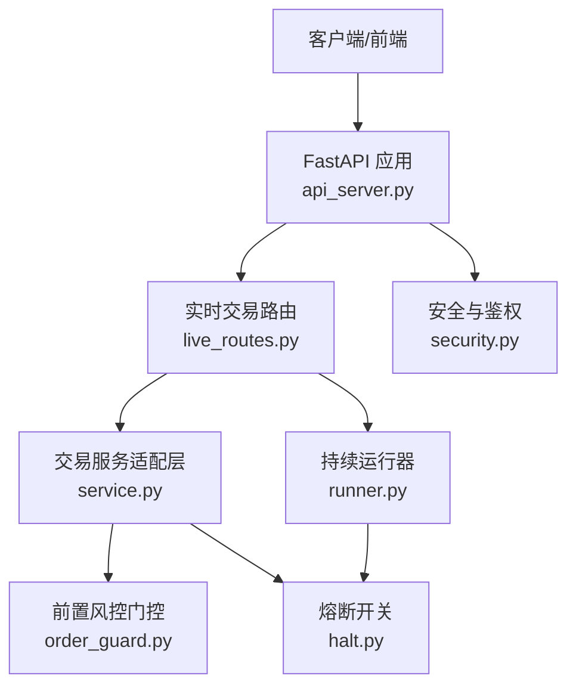
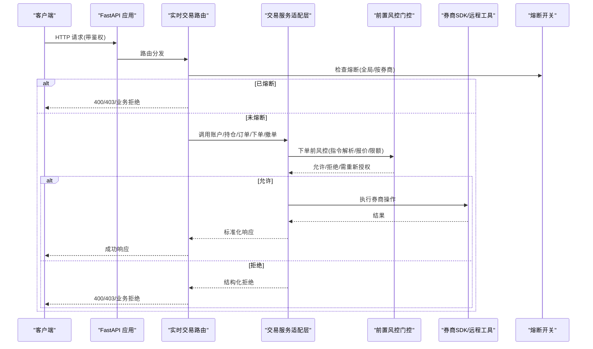
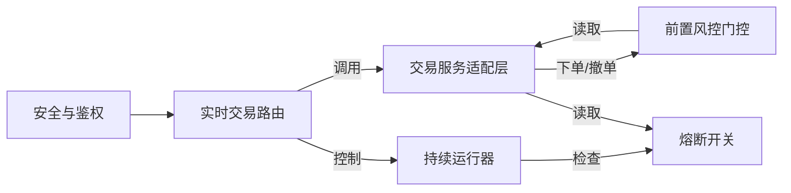

# 实盘交易 API

<cite>
**本文引用的文件**
- [api_server.py](file://agent/api_server.py)
- [live_routes.py](file://agent/src/api/live_routes.py)
- [security.py](file://agent/src/api/security.py)
- [service.py](file://agent/src/trading/service.py)
- [runner.py](file://agent/src/live/runtime/runner.py)
- [order_guard.py](file://agent/src/live/order_guard.py)
- [halt.py](file://agent/src/live/halt.py)
</cite>

## 目录
1. [简介](#简介)
2. [项目结构](#项目结构)
3. [核心组件](#核心组件)
4. [架构总览](#架构总览)
5. [详细端点参考](#详细端点参考)
6. [依赖关系分析](#依赖关系分析)
7. [性能与一致性](#性能与一致性)
8. [故障恢复与监控审计](#故障恢复与监控审计)
9. [安全与合规](#安全与合规)
10. [排错指南](#排错指南)
11. [结论](#结论)

## 简介
本文件为实盘交易的 REST API 端点参考，覆盖订单管理、持仓查询、账户信息、风险控制等核心交易能力。文档基于 FastAPI 路由与交易运行时实现，说明下单、撤单、订单状态查询、持仓与账户读取、授权与指令委托（mandate）提交、熔断（kill switch）控制、持续运行器（runner）启停等接口的请求/响应语义与约束。同时给出不同券商适配层、订单类型支持、风控规则、完整交易流程示例、安全性与数据一致性策略，以及监控、审计与故障恢复机制。

## 项目结构
- API 服务入口：FastAPI 应用装配、中间件、路由注册、生命周期管理。
- 实时交易路由：授权、指令委托、熔断、运行器控制、状态查询。
- 认证与安全：API Key、SSE 票据、CSP、DNS 重绑定防护、跨站请求限制。
- 交易服务适配层：统一封装各券商 SDK/远程工具，提供账户、持仓、订单、行情、历史等读操作与下单/撤单写操作。
- 运行器与风控：持久化 runner 循环、对撞校验、主动过期处理、预占式平仓；前置风控门控（指令提取、报价归一、限额检查）。
- 熔断开关：文件系统级全局/按券商的 HALT 哨兵，独立于 LLM 与进程状态。

**图表来源**
- [api_server.py:166-185](file://agent/api_server.py#L166-L185)
- [live_routes.py:632-800](file://agent/src/api/live_routes.py#L632-L800)
- [security.py:166-253](file://agent/src/api/security.py#L166-L253)
- [service.py:42-117](file://agent/src/trading/service.py#L42-L117)
- [runner.py:296-399](file://agent/src/live/runtime/runner.py#L296-L399)
- [order_guard.py:97-215](file://agent/src/live/order_guard.py#L97-L215)
- [halt.py:72-163](file://agent/src/live/halt.py#L72-L163)

**章节来源**
- [api_server.py:127-182](file://agent/api_server.py#L127-L182)
- [live_routes.py:1-19](file://agent/src/api/live_routes.py#L1-L19)

## 核心组件
- 实时交易路由：提供指令委托提交、熔断控制、运行器控制、状态查询等受保护端点。
- 交易服务适配层：统一调用各券商 SDK/远程工具，屏蔽差异，提供账户、持仓、订单、行情、历史等接口。
- 前置风控门控：在每次下单前执行指令解析、报价归一、限额与组合风险检查，失败即拒绝。
- 持续运行器：按调度或市场事件触发自主交易循环，包含对撞校验、主动过期、预占式平仓与心跳。
- 熔断开关：文件系统级全局/按券商 HALT 哨兵，任何写入路径均先检查。
- 安全与鉴权：API Key、SSE 票据、CORS/CSP、DNS 重绑定防护、跨站请求拒绝。

**章节来源**
- [live_routes.py:632-800](file://agent/src/api/live_routes.py#L632-L800)
- [service.py:42-117](file://agent/src/trading/service.py#L42-L117)
- [order_guard.py:97-215](file://agent/src/live/order_guard.py#L97-L215)
- [runner.py:296-399](file://agent/src/live/runtime/runner.py#L296-L399)
- [halt.py:72-163](file://agent/src/live/halt.py#L72-L163)
- [security.py:343-504](file://agent/src/api/security.py#L343-L504)

## 架构总览

**图表来源**
- [live_routes.py:632-800](file://agent/src/api/live_routes.py#L632-L800)
- [service.py:283-374](file://agent/src/trading/service.py#L283-L374)
- [order_guard.py:130-215](file://agent/src/live/order_guard.py#L130-L215)
- [halt.py:135-163](file://agent/src/live/halt.py#L135-L163)

## 详细端点参考
以下端点均由 FastAPI 挂载，默认需要鉴权（Bearer Token 或本地回环信任）。所有写操作均为受保护动作，非 Agent 工具直接调用。

### 授权与指令委托
- POST /mandate/commit
  - 作用：提交用户确认的指令委托（唯一可激活实盘的写入路径），携带 broker、proposal_id、selected_ordinal、adjustments、consent_ack、account_ref、lifetime_days、session_id。
  - 行为：校验 consent_ack 必须为 true；可选拉取券商侧资金上限进行再检查；成功后通过事件总线广播 mandate.committed 与 live.action。
  - 返回：委托提交结果（含 broker、mandate_id 等）。
  - 错误：参数校验失败返回 400。
  - 鉴权：必需。

- GET /live/status?broker=...
  - 作用：返回实时通道状态，包括每券商授权快照、活跃委托、运行器存活、熔断状态。
  - 行为：聚合 OAuth/mandate 型券商与 broker_sdk 连接器；缓存连接验证结果（去敏感字段、TTL）；计算委托剩余时间与是否过期。
  - 返回：global_halted 与 brokers 列表（auth、mandate、runner、halted）。
  - 鉴权：必需。

- POST /live/authorize
  - 作用：启动或描述某券商的 OAuth 引导流程（由客户端设备完成授权，服务端仅指引）。
  - 返回：授权引导信息。
  - 鉴权：必需。

### 熔断控制
- POST /live/halt
  - 作用：触发熔断（可按券商或全局），记录原因并广播 live.halted 与 live.action。
  - 返回：{halted, broker, reason, sentinel}。
  - 鉴权：必需。

- POST /live/resume
  - 作用：清除熔断（可按券商或全局），广播 live.resumed 与 live.action。
  - 返回：{halted, broker, cleared}。
  - 鉴权：必需。

### 运行器控制
- POST /live/runner/start
  - 作用：为指定券商启动持久化运行器（需在已提交且未过期的委托下）。
  - 行为：构建 LiveRunner，注入 agent 调用、reconcile、read/submit、scheduler、triggers、audit；启动后按调度/市场事件驱动 run_once。
  - 返回：启动结果。
  - 鉴权：必需。

- POST /live/runner/stop
  - 作用：停止指定券商的运行器。
  - 返回：停止结果。
  - 鉴权：必需。

### 账户与持仓（通过适配层）
- 账户余额/概况
  - 调用方式：经由适配层 get_account(profile_id, **overrides)。
  - 行为：根据 transport（local_tws/broker_sdk/remote）选择实现；返回账户摘要。
  - 用途：用于风控与 UI 展示。

- 持仓查询
  - 调用方式：get_positions(profile_id, **overrides)。
  - 行为：按 transport 路由到具体实现；返回当前持仓。

- 挂单查询
  - 调用方式：get_open_orders(profile_id, include_executions=False, **overrides)。
  - 行为：按 transport 路由；可选择包含成交明细。

- 下单
  - 调用方式：place_order(symbol, profile_id, side, quantity/notional, order_type, limit_price, time_in_force, session_id, **overrides)。
  - 行为：仅支持 broker_sdk 直连；纸面环境直接下单；实盘环境进入前置风控门控（指令提取、报价归一、限额检查）、审计与执行。
  - 订单类型：order_type 默认 market；limit_price 支持限价；time_in_force 默认 day。
  - 返回：券商原始响应包装（含 profile 信息）。

- 撤单
  - 调用方式：cancel_order(order_id, profile_id, symbol, session_id, **overrides)。
  - 行为：仅支持 broker_sdk；实盘环境下仍会写入审计（撤销是降险操作，不阻断）。
  - 返回：券商原始响应包装。

- 其他（eToro 专用）
  - close_position、edit_position_stops、copy_start_or_adjust、cancel_close_order 等，均走 _route_sdk_write，并在实盘时经 execute_live_action 风控与审计。

**章节来源**
- [live_routes.py:41-162](file://agent/src/api/live_routes.py#L41-L162)
- [live_routes.py:650-723](file://agent/src/api/live_routes.py#L650-L723)
- [live_routes.py:879-956](file://agent/src/api/live_routes.py#L879-L956)
- [service.py:68-117](file://agent/src/trading/service.py#L68-L117)
- [service.py:283-374](file://agent/src/trading/service.py#L283-L374)
- [service.py:349-374](file://agent/src/trading/service.py#L349-L374)
- [service.py:946-1018](file://agent/src/trading/service.py#L946-L1018)

## 依赖关系分析

**图表来源**
- [live_routes.py:632-800](file://agent/src/api/live_routes.py#L632-L800)
- [service.py:283-374](file://agent/src/trading/service.py#L283-L374)
- [order_guard.py:97-215](file://agent/src/live/order_guard.py#L97-L215)
- [runner.py:296-399](file://agent/src/live/runtime/runner.py#L296-L399)
- [halt.py:135-163](file://agent/src/live/halt.py#L135-L163)
- [security.py:571-622](file://agent/src/api/security.py#L571-L622)

**章节来源**
- [api_server.py:185-255](file://agent/api_server.py#L185-L255)
- [live_routes.py:632-800](file://agent/src/api/live_routes.py#L632-L800)

## 性能与一致性
- 连接验证缓存：对 connector verify 结果做 15s TTL 缓存，剔除敏感字段，降低频繁探测开销。
- 运行器心跳：每 tick 写入心跳，便于外部健康检查；心跳失败不影响交易主路径。
- 无重试原则：对变更类操作（下单、平仓、撤销）遵循 no-retry，避免重复执行导致的不一致。
- 对撞校验：tick 前拉取券商真实状态（持仓、余额、挂单），若报告不安全/歧义则中止 tick，不自动重发。
- 主动过期：每个 tick 检查委托过期时间，过期即触发熔断并撤销权限，防止过期委托继续交易。
- 预占式平仓：熔断触发后一次性取消挂单并按委托配置平掉仓位，避免残留风险敞口。

**章节来源**
- [live_routes.py:180-220](file://agent/src/api/live_routes.py#L180-L220)
- [runner.py:550-564](file://agent/src/live/runtime/runner.py#L550-L564)
- [runner.py:407-441](file://agent/src/live/runtime/runner.py#L407-L441)
- [runner.py:544-594](file://agent/src/live/runtime/runner.py#L544-L594)
- [runner.py:804-830](file://agent/src/live/runtime/runner.py#L804-L830)

## 故障恢复与监控审计
- 审计事件：所有关键动作（下单、撤销、熔断、tick 结果）均写入审计账本，并通过 SSE 广播 live.action，供前端订阅。
- 事件总线：通过现有 SessionService 的事件总线将状态变更推送到 /sessions/{id}/events，无需新建消息总线。
- 运行器重启恢复：run_loop 启动时从持久化 JobStore 恢复任务或从 Trigger 重建任务，确保“重启即重算”而非恢复中间态。
- 熔断文件级生效：HALT 哨兵为文件系统存在性判断，独立于进程状态与 LLM，保证极端情况下仍可立即停止交易。
- 日志脱敏：访问日志中对 api_key/ticket 等敏感查询参数值进行脱敏，避免泄露。

**章节来源**
- [live_routes.py:340-355](file://agent/src/api/live_routes.py#L340-L355)
- [runner.py:869-909](file://agent/src/live/runtime/runner.py#L869-L909)
- [halt.py:72-163](file://agent/src/live/halt.py#L72-L163)
- [security.py:256-297](file://agent/src/api/security.py#L256-L297)

## 安全与合规
- 鉴权：
  - 支持 Bearer Token 与本地回环信任（未配置 API_KEY 时）。
  - SSE 流使用一次性 ticket，避免长密钥出现在 URL/日志中。
- CORS/ CSP：
  - 严格默认源与 CSP，禁止危险浏览器特性；文档页放宽至 CDN。
- DNS 重绑定防护：
  - 拦截不可信本地 Host 头，防止绕过本地鉴权。
- 跨站请求限制：
  - 非安全方法拒绝跨站浏览器请求，减少 CSRF/XSS 风险。
- 最小权限：
  - 写操作仅限受保护端点；Agent 模型不能直接调用这些写操作。

**章节来源**
- [security.py:166-253](file://agent/src/api/security.py#L166-L253)
- [security.py:343-504](file://agent/src/api/security.py#L343-L504)
- [security.py:571-622](file://agent/src/api/security.py#L571-L622)

## 排错指南
- 无法启动运行器：
  - 检查是否存在已提交且未过期的委托；确认券商通道已配置并可连接。
  - 查看 /live/status 中对应券商的连接状态与 capabilities。
- 下单被拒：
  - 检查前置风控门控返回的结构化拒绝（可能因指令解析失败、报价不可用、超出限额或委托过期）。
  - 关注审计事件中的 gate_decision 与 breach 详情。
- 熔断触发：
  - 检查全局或按券商的 HALT 哨兵文件；必要时通过 /live/resume 清除。
- 状态不一致：
  - 观察 tick 的对撞校验结果；若报告 unsafe/ambiguous，系统会中止 tick，需人工介入后再恢复。

**章节来源**
- [order_guard.py:130-215](file://agent/src/live/order_guard.py#L130-L215)
- [order_guard.py:364-432](file://agent/src/live/order_guard.py#L364-L432)
- [halt.py:72-163](file://agent/src/live/halt.py#L72-L163)
- [runner.py:465-508](file://agent/src/live/runtime/runner.py#L465-L508)

## 结论
本 API 以 FastAPI 为入口，结合券商适配层、前置风控门控、持续运行器与文件系统级熔断，构建了面向多券商的实盘交易能力。其设计强调安全（鉴权、CSP、跨站防护）、一致（对撞校验、no-retry、主动过期）与可观测（审计、SSE 事件、心跳）。通过标准化的端点与清晰的职责边界，既满足策略信号到订单执行的闭环，也提供了完善的监控、审计与故障恢复机制。