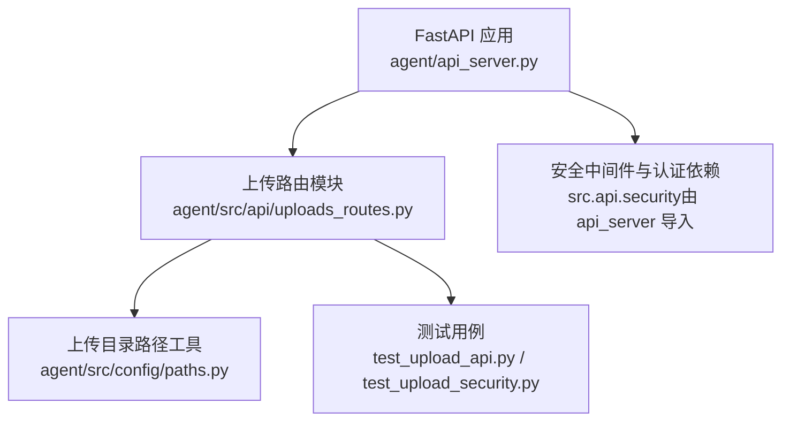
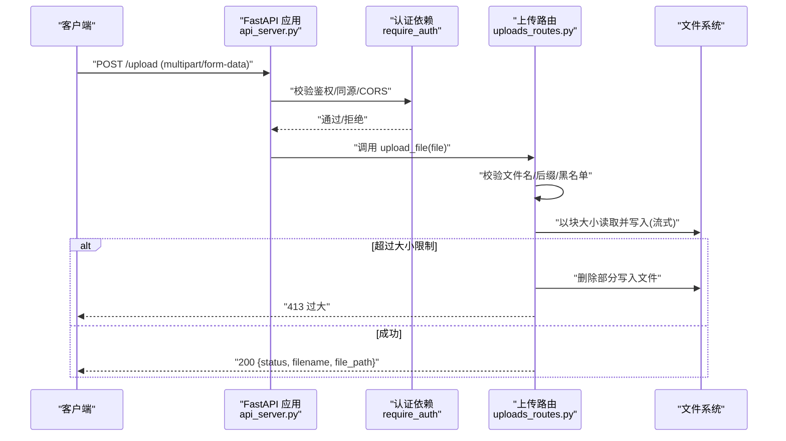
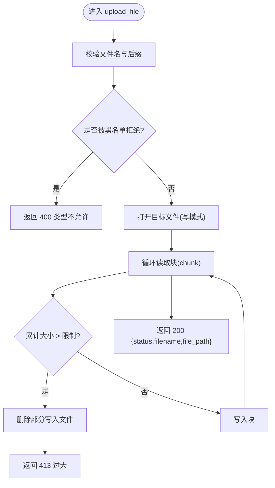
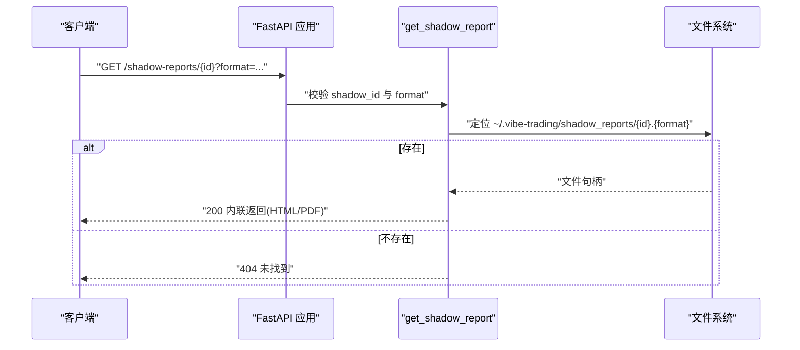
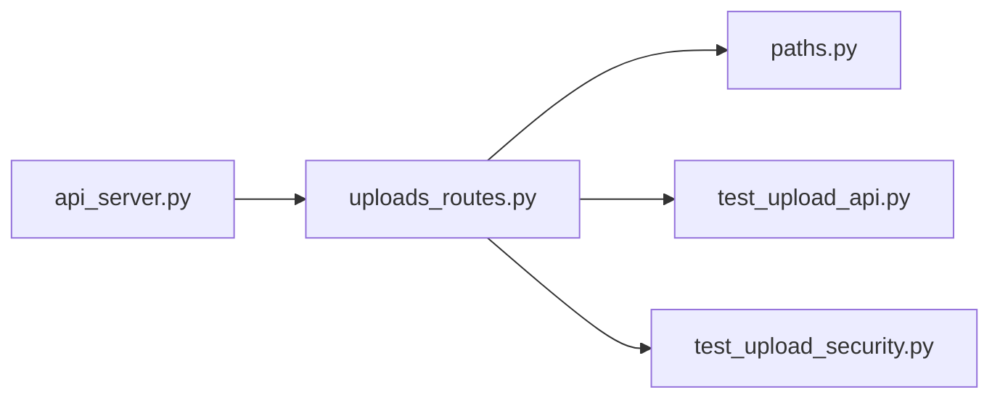

# 文件上传 API

<cite>
**本文引用的文件**
- [agent/api_server.py](file://agent/api_server.py)
- [agent/src/api/uploads_routes.py](file://agent/src/api/uploads_routes.py)
- [agent/src/config/paths.py](file://agent/src/config/paths.py)
- [agent/tests/test_upload_api.py](file://agent/tests/test_upload_api.py)
- [agent/tests/test_upload_security.py](file://agent/tests/test_upload_security.py)
</cite>

## 目录
1. [简介](#简介)
2. [项目结构](#项目结构)
3. [核心组件](#核心组件)
4. [架构总览](#架构总览)
5. [详细组件分析](#详细组件分析)
6. [依赖关系分析](#依赖关系分析)
7. [性能考虑](#性能考虑)
8. [故障排查指南](#故障排查指南)
9. [结论](#结论)
10. [附录](#附录)

## 简介
本文件为“Vibe-Trading”后端中文件上传与管理相关 REST API 的完整端点参考文档。基于代码实现，当前已暴露的文件操作接口包括：
- 文件上传：POST /upload（流式写入、大小限制、类型白名单）
- 影子账户报告预览：GET /shadow-reports/{shadow_id}?format=html|pdf（内联预览）

尚未实现的常见能力（如分片上传、断点续传、病毒扫描、下载、删除等）在现有代码中未提供对应端点或逻辑；如需扩展，可参考本文“扩展建议”与“依赖关系分析”章节进行设计。

## 项目结构
与文件上传相关的核心位置如下：
- API 服务器入口与路由挂载：agent/api_server.py
- 上传与影子报告路由：agent/src/api/uploads_routes.py
- 上传目录路径解析：agent/src/config/paths.py
- 上传行为与安全回归测试：agent/tests/test_upload_api.py、agent/tests/test_upload_security.py

**图表来源**
- [agent/api_server.py:163-235](file://agent/api_server.py#L163-L235)
- [agent/src/api/uploads_routes.py:51-179](file://agent/src/api/uploads_routes.py#L51-L179)
- [agent/src/config/paths.py:52-54](file://agent/src/config/paths.py#L52-L54)

**章节来源**
- [agent/api_server.py:163-235](file://agent/api_server.py#L163-L235)
- [agent/src/api/uploads_routes.py:51-179](file://agent/src/api/uploads_routes.py#L51-L179)
- [agent/src/config/paths.py:52-54](file://agent/src/config/paths.py#L52-L54)

## 核心组件
- 上传路由注册与端点：
  - POST /upload：流式接收文件，校验文件名与后缀，按块写入磁盘，超过大小限制时清理并返回错误。
  - GET /shadow-reports/{shadow_id}：读取用户家目录下影子账户报告并以内联方式返回 HTML 或 PDF。
- 存储策略：
  - 上传目录通过运行时根目录派生，默认位于用户级运行根下的 uploads 子目录。
  - 文件名使用 UUID 重命名，避免冲突与路径泄露。
- 安全与访问控制：
  - 所有端点受 require_auth 保护（来自宿主 api_server）。
  - 浏览器跨站请求会被拒绝；本地回环需携带 Bearer Token（当配置了 API 密钥时）。
  - 严格黑名单禁止执行类、脚本、模板、压缩包等高风险类型。
- 大小限制与流式处理：
  - 默认最大文件大小 50 MB，可按块读取（默认 1 MB），超出即终止并清理部分写入文件。
- 响应格式：
  - 上传成功返回 status、filename、file_path（相对路径）。
  - 报告预览以 FileResponse 返回，附带合适的媒体类型与 Content-Disposition。

**章节来源**
- [agent/src/api/uploads_routes.py:22-43](file://agent/src/api/uploads_routes.py#L22-L43)
- [agent/src/api/uploads_routes.py:96-117](file://agent/src/api/uploads_routes.py#L96-L117)
- [agent/src/api/uploads_routes.py:119-179](file://agent/src/api/uploads_routes.py#L119-L179)
- [agent/src/config/paths.py:52-54](file://agent/src/config/paths.py#L52-L54)
- [agent/api_server.py:230-240](file://agent/api_server.py#L230-L240)

## 架构总览
下图展示了从客户端到服务端的路由挂载、认证依赖、流式写入与响应流程。

**图表来源**
- [agent/api_server.py:163-235](file://agent/api_server.py#L163-L235)
- [agent/src/api/uploads_routes.py:119-179](file://agent/src/api/uploads_routes.py#L119-L179)
- [agent/tests/test_upload_api.py:31-140](file://agent/tests/test_upload_api.py#L31-L140)

## 详细组件分析

### 端点：POST /upload（文件上传）
- 功能：接受任意文档或数据文件（默认上限 50 MB），流式写入到 uploads 目录，返回相对路径。
- 请求：
  - 方法：POST
  - 路径：/upload
  - 内容类型：multipart/form-data
  - 表单字段：file（二进制文件）
  - 认证：需要 Bearer Token（当配置了 API 密钥时）；浏览器跨站请求将被拒绝。
- 响应：
  - 200：{ "status": "ok", "filename": "...", "file_path": "uploads/<uuid>.ext" }
  - 400：文件名缺失或类型被阻止
  - 401：未认证（当启用 API 密钥）
  - 403：跨站浏览器请求被拒绝
  - 413：文件过大
  - 500：存储失败（内部错误）
- 安全与验证：
  - 黑名单后缀：可执行、脚本、模板、配置文件、压缩包等。
  - 黑名单文件名：Dockerfile、Containerfile。
  - 同源检查：浏览器跨站请求直接拒绝。
  - 大小限制：按块累计，超过立即终止并清理部分文件。
- 存储策略：
  - 目标目录：~/.vibe-trading/uploads（可通过环境变量 VIBE_TRADING_HOME 覆盖）。
  - 文件名：UUID + 原始后缀，避免冲突与路径泄露。
- 示例（概念性）：
  - curl -F "file=@report.pdf" http://localhost:8000/upload -H "Authorization: Bearer <token>"

**图表来源**
- [agent/src/api/uploads_routes.py:119-179](file://agent/src/api/uploads_routes.py#L119-L179)

**章节来源**
- [agent/src/api/uploads_routes.py:119-179](file://agent/src/api/uploads_routes.py#L119-L179)
- [agent/tests/test_upload_api.py:31-140](file://agent/tests/test_upload_api.py#L31-L140)
- [agent/tests/test_upload_security.py:21-44](file://agent/tests/test_upload_security.py#L21-L44)

### 端点：GET /shadow-reports/{shadow_id}（影子报告预览）
- 功能：获取指定 shadow_id 的报告，支持 html 或 pdf 两种格式，以内联方式返回。
- 请求：
  - 方法：GET
  - 路径：/shadow-reports/{shadow_id}
  - 查询参数：format=html|pdf（默认 html）
  - 认证：需要 Bearer Token。
- 响应：
  - 200：HTML 或 PDF 文件流
  - 400：shadow_id 不合法或 format 非法
  - 404：报告不存在
- 存储位置：~/.vibe-trading/shadow_reports/{shadow_id}.{html,pdf}
- 示例（概念性）：
  - curl "http://localhost:8000/shadow-reports/abc123?format=pdf" -H "Authorization: Bearer <token>"

**图表来源**
- [agent/src/api/uploads_routes.py:96-117](file://agent/src/api/uploads_routes.py#L96-L117)

**章节来源**
- [agent/src/api/uploads_routes.py:96-117](file://agent/src/api/uploads_routes.py#L96-L117)

### 安全与访问控制
- 认证：所有端点通过 require_auth 依赖保护；当配置 API 密钥时，本地回环也必须携带 Authorization: Bearer。
- 同源与跨站：浏览器跨站请求一律拒绝，防止 CSRF/XSS 风险。
- 类型白名单：仅允许常见文档与数据格式；执行类、脚本、模板、压缩包等被明确拒绝。
- 路径安全：文件名使用 UUID 重命名，避免路径遍历与敏感信息泄露。

**章节来源**
- [agent/api_server.py:35-71](file://agent/api_server.py#L35-L71)
- [agent/src/api/uploads_routes.py:22-43](file://agent/src/api/uploads_routes.py#L22-L43)
- [agent/tests/test_upload_api.py:31-140](file://agent/tests/test_upload_api.py#L31-L140)

### 文件格式支持与大小限制
- 支持格式：PDF、Word、Excel、PowerPoint、图片、CSV/TSV、纯文本、JSON、TOML 等常见文档与数据格式。
- 禁止格式：可执行文件、脚本、模板、配置文件、压缩包等。
- 大小限制：默认 50 MB，按块读取并累计，超过即终止并清理部分写入文件。
- 块大小：默认 1 MB，可通过宿主变量覆盖。

**章节来源**
- [agent/src/api/uploads_routes.py:22-35](file://agent/src/api/uploads_routes.py#L22-L35)
- [agent/src/api/uploads_routes.py:119-179](file://agent/src/api/uploads_routes.py#L119-L179)

### 存储策略与路径
- 上传目录：~/.vibe-trading/uploads（可通过环境变量 VIBE_TRADING_HOME 覆盖运行时根）。
- 报告目录：~/.vibe-trading/shadow_reports。
- 文件名：上传文件统一使用 UUID + 原始后缀，避免冲突与路径泄露。

**章节来源**
- [agent/src/config/paths.py:13-34](file://agent/src/config/paths.py#L13-L34)
- [agent/src/config/paths.py:52-54](file://agent/src/config/paths.py#L52-L54)
- [agent/src/api/uploads_routes.py:141-142](file://agent/src/api/uploads_routes.py#L141-L142)

## 依赖关系分析
- 路由挂载：api_server 在启动时注册各路由模块，包含 uploads_routes。
- 认证依赖：uploads_routes 通过 require_auth 注入宿主认证逻辑，确保端点受控。
- 路径工具：uploads_routes 通过 get_uploads_dir 获取上传目录，保证一致性与可配置性。
- 测试覆盖：test_upload_api 与 test_upload_security 覆盖了跨站拒绝、认证要求、大小限制、类型黑名单等关键路径。

**图表来源**
- [agent/api_server.py:230-240](file://agent/api_server.py#L230-L240)
- [agent/src/api/uploads_routes.py:51-179](file://agent/src/api/uploads_routes.py#L51-L179)
- [agent/src/config/paths.py:52-54](file://agent/src/config/paths.py#L52-L54)
- [agent/tests/test_upload_api.py:1-216](file://agent/tests/test_upload_api.py#L1-L216)
- [agent/tests/test_upload_security.py:1-44](file://agent/tests/test_upload_security.py#L1-L44)

**章节来源**
- [agent/api_server.py:230-240](file://agent/api_server.py#L230-L240)
- [agent/src/api/uploads_routes.py:51-179](file://agent/src/api/uploads_routes.py#L51-L179)
- [agent/src/config/paths.py:52-54](file://agent/src/config/paths.py#L52-L54)
- [agent/tests/test_upload_api.py:1-216](file://agent/tests/test_upload_api.py#L1-L216)
- [agent/tests/test_upload_security.py:1-44](file://agent/tests/test_upload_security.py#L1-L44)

## 性能考虑
- 流式写入：按固定块大小读取并写入，避免一次性加载大文件导致内存峰值。
- 大小限制：在写入过程中累计大小，超过限制立即终止并清理部分文件，减少资源浪费。
- 并发与 I/O：建议使用异步 I/O 与合理的连接池/线程池配置以提升吞吐。
- 缓存与预览：报告预览直接返回文件流，适合小体积文件；对大体积报告可考虑 CDN 或对象存储。

[本节为通用性能建议，不直接分析具体文件]

## 故障排查指南
- 400 类型不允许：检查文件后缀是否在黑名单；确认文件名未被显式拒绝。
- 401 未认证：当配置 API 密钥时，必须携带 Authorization: Bearer；本地回环同样需要。
- 403 跨站拒绝：浏览器跨站请求将被拒绝；确保同源或使用非浏览器客户端。
- 413 文件过大：调整 MAX_UPLOAD_SIZE 或优化客户端分片上传（见扩展建议）。
- 500 存储失败：检查上传目录权限与可用空间；确认路径不是普通文件而非目录。

**章节来源**
- [agent/src/api/uploads_routes.py:127-170](file://agent/src/api/uploads_routes.py#L127-L170)
- [agent/tests/test_upload_api.py:143-216](file://agent/tests/test_upload_api.py#L143-L216)
- [agent/tests/test_upload_security.py:21-44](file://agent/tests/test_upload_security.py#L21-L44)

## 结论
当前仓库实现了安全的文件上传与影子报告预览两个核心端点，具备流式写入、大小限制、类型黑名单、同源校验与认证保护等机制。对于更完整的文件管理（下载、删除、分片上传、断点续传、病毒扫描、版本管理等），可在现有架构基础上扩展路由与业务逻辑，同时复用统一的认证、路径与存储策略。

[本节为总结性内容，不直接分析具体文件]

## 附录

### 端点清单与规范
- POST /upload
  - 认证：需要（当配置 API 密钥）
  - 内容类型：multipart/form-data
  - 表单字段：file
  - 成功响应：200 { status, filename, file_path }
  - 错误码：400/401/403/413/500
- GET /shadow-reports/{shadow_id}?format=html|pdf
  - 认证：需要
  - 成功响应：200 HTML/PDF 流
  - 错误码：400/404

**章节来源**
- [agent/src/api/uploads_routes.py:96-179](file://agent/src/api/uploads_routes.py#L96-L179)

### 扩展建议（不在当前实现中）
- 分片上传与断点续传：
  - 新增端点：POST /upload/chunk、POST /upload/complete、GET /upload/status
  - 设计要点：分片标识、序号、总片数、MD5/SHA 校验、临时目录组织、合并原子性。
- 病毒扫描：
  - 集成外部扫描服务（如 ClamAV），在合并后或每片完成后触发扫描，失败则隔离或删除。
- 下载与删除：
  - 新增端点：GET /files/{file_id}、DELETE /files/{file_id}
  - 设计要点：文件 ID 映射、权限校验、软删除与回收站、审计日志。
- 版本管理：
  - 引入版本号或时间戳，保留历史版本，支持回滚与差异对比。
- 清理策略：
  - 定时任务清理过期/无用文件，结合配额与告警机制。

[本节为概念性扩展建议，不直接分析具体文件]