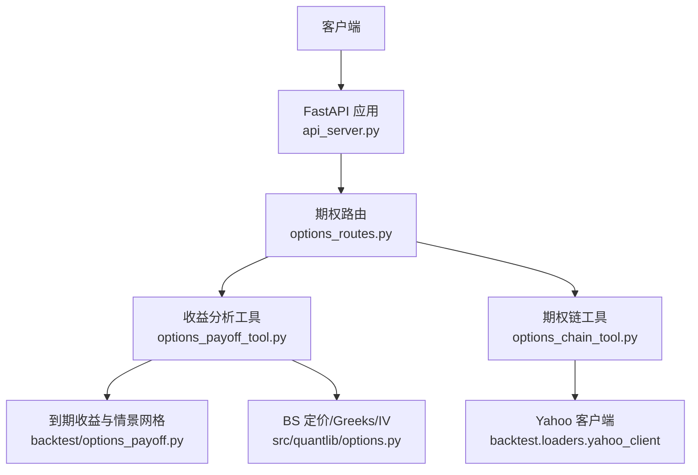
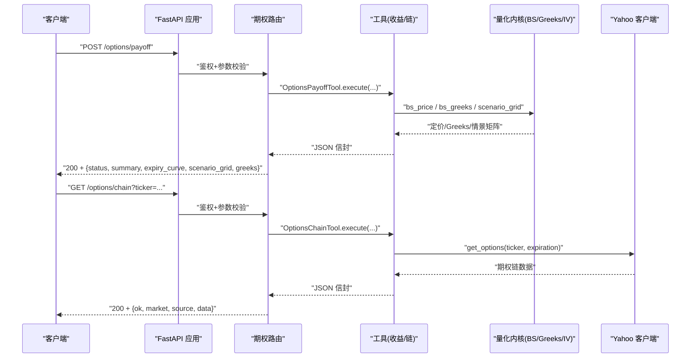
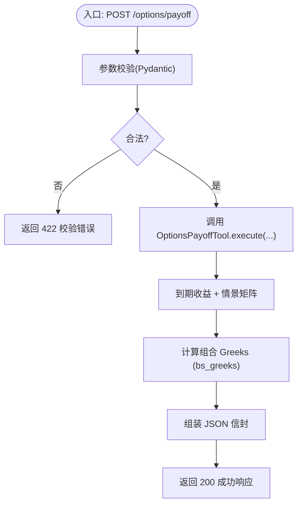
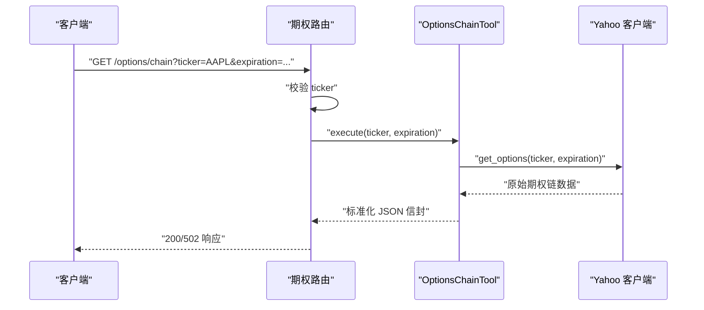
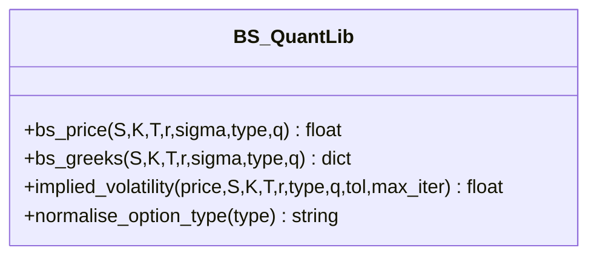
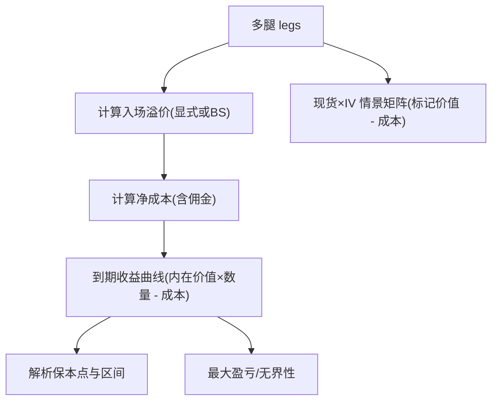
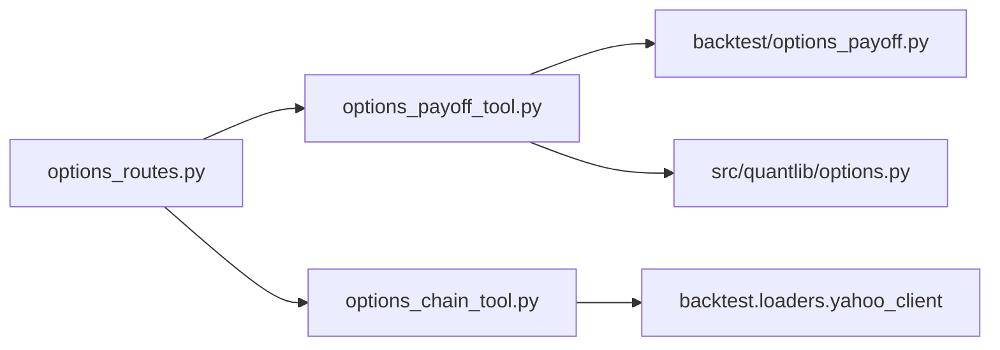

# 期权交易 API

<cite>
**本文引用的文件**
- [agent/src/api/options_routes.py](file://agent/src/api/options_routes.py)
- [agent/src/tools/options_chain_tool.py](file://agent/src/tools/options_chain_tool.py)
- [agent/src/tools/options_payoff_tool.py](file://agent/src/tools/options_payoff_tool.py)
- [agent/src/quantlib/options.py](file://agent/src/quantlib/options.py)
- [agent/backtest/options_payoff.py](file://agent/backtest/options_payoff.py)
- [agent/src/tools/options_pricing_tool.py](file://agent/src/tools/options_pricing_tool.py)
- [agent/tests/test_options_routes.py](file://agent/tests/test_options_routes.py)
- [agent/src/api/channels_routes.py](file://agent/src/api/channels_routes.py)
- [agent/api_server.py](file://agent/api_server.py)
</cite>

## 目录
1. [简介](#简介)
2. [项目结构](#项目结构)
3. [核心组件](#核心组件)
4. [架构总览](#架构总览)
5. [详细组件分析](#详细组件分析)
6. [依赖关系分析](#依赖关系分析)
7. [性能考虑](#性能考虑)
8. [故障排查指南](#故障排查指南)
9. [结论](#结论)
10. [附录：端点参考与示例](#附录：端点参考与示例)

## 简介
本文件为“期权交易相关 REST API”的完整端点参考文档，覆盖以下能力：
- 期权链查询（美国上市标的、单到期日）
- 多腿策略收益曲线与情景分析（到期收益、现货/隐含波动率情景矩阵）
- Black-Scholes 定价与希腊字母计算
- 隐含波动率反解（Newton-Raphson + 二分法回退）
- 本地市场数据源（Yahoo Finance）与工具封装
- 策略构建、风险评估与收益模拟示例
- 数据同步、模型选择与性能优化建议
- 风险提示与合规要求

## 项目结构
期权功能由“HTTP 路由层 → 工具层 → 量化内核层”分层组织：
- HTTP 路由层：FastAPI 路由，负责鉴权、参数校验、错误映射与线程隔离。
- 工具层：将业务逻辑封装为可复用的工具（期权链、收益分析、定价）。
- 量化内核层：Black-Scholes 定价、Greeks、IV 反解等数学实现。

**图表来源**
- [agent/api_server.py:166-185](file://agent/api_server.py#L166-L185)
- [agent/src/api/options_routes.py:163-236](file://agent/src/api/options_routes.py#L163-L236)
- [agent/src/tools/options_payoff_tool.py:21-170](file://agent/src/tools/options_payoff_tool.py#L21-L170)
- [agent/src/tools/options_chain_tool.py:37-100](file://agent/src/tools/options_chain_tool.py#L37-L100)
- [agent/backtest/options_payoff.py:274-457](file://agent/backtest/options_payoff.py#L274-L457)
- [agent/src/quantlib/options.py:223-503](file://agent/src/quantlib/options.py#L223-L503)

**章节来源**
- [agent/api_server.py:166-185](file://agent/api_server.py#L166-L185)
- [agent/src/api/options_routes.py:1-34](file://agent/src/api/options_routes.py#L1-L34)

## 核心组件
- 期权收益分析工具：支持多腿策略的到期收益曲线与现货/IV 情景矩阵，输出盈亏、保本点、最大盈亏及无界性判断。
- 期权链工具：拉取美国上市期权的 Call/Put 合约信息（行权价、买卖价、成交量、持仓量、隐含波动率、是否实值等），限制每侧合约数量以避免响应过大。
- Black-Scholes 内核：统一实现定价、Greeks、IV 反解；处理退化输入（到期、零波动率、非正价格）并给出稳定结果。
- 定价工具：提供单腿期权的价格与 Greeks 计算，便于快速验证与展示。

**章节来源**
- [agent/src/tools/options_payoff_tool.py:21-170](file://agent/src/tools/options_payoff_tool.py#L21-L170)
- [agent/src/tools/options_chain_tool.py:37-100](file://agent/src/tools/options_chain_tool.py#L37-L100)
- [agent/src/quantlib/options.py:223-503](file://agent/src/quantlib/options.py#L223-L503)
- [agent/src/tools/options_pricing_tool.py:77-172](file://agent/src/tools/options_pricing_tool.py#L77-L172)

## 架构总览
HTTP 请求进入 FastAPI 应用后，由期权路由模块挂载两个端点：
- POST /options/payoff：接收多腿策略参数，调用收益分析工具，并在返回体中附加组合 Greeks（按乘数放大）。
- GET /options/chain：接收标的与可选到期日，调用期权链工具获取 Yahoo 数据。

所有耗时或阻塞操作均通过线程执行，避免阻塞事件循环。

**图表来源**
- [agent/src/api/options_routes.py:192-236](file://agent/src/api/options_routes.py#L192-L236)
- [agent/src/tools/options_payoff_tool.py:122-225](file://agent/src/tools/options_payoff_tool.py#L122-L225)
- [agent/src/tools/options_chain_tool.py:70-100](file://agent/src/tools/options_chain_tool.py#L70-L100)
- [agent/src/quantlib/options.py:223-503](file://agent/src/quantlib/options.py#L223-L503)

## 详细组件分析

### 组件一：POST /options/payoff（多腿策略收益与情景分析）
- 功能
  - 输入：多腿 legs（看涨/看跌、行权价、数量、可选入场溢价）、入场现货价、剩余天数、无风险利率、波动率、乘数、佣金率、现货范围与点数、IV 情景列表。
  - 输出：状态、输入摘要、到期收益曲线、现货/IV 情景矩阵、保本点、最大盈亏、无界性标志、组合 Greeks（delta/gamma/theta/vega/rho，按乘数缩放）。
- 关键流程
  - Pydantic 强校验（legs 数量、spot_points 范围、IV 场景数量等）。
  - 调用 OptionsPayoffTool.execute，内部使用 backtest.options_payoff 计算到期收益与情景矩阵。
  - 在路由层追加组合 Greeks（基于 bs_greeks 逐腿求和并按乘数放大）。
- 错误处理
  - 参数非法：422（Pydantic）。
  - 工具级错误：400（携带工具错误信封）。
  - 网络/异常：保持事件循环不阻塞（异步线程执行）。

**图表来源**
- [agent/src/api/options_routes.py:87-154](file://agent/src/api/options_routes.py#L87-L154)
- [agent/src/tools/options_payoff_tool.py:122-225](file://agent/src/tools/options_payoff_tool.py#L122-L225)
- [agent/backtest/options_payoff.py:274-457](file://agent/backtest/options_payoff.py#L274-L457)

**章节来源**
- [agent/src/api/options_routes.py:87-154](file://agent/src/api/options_routes.py#L87-L154)
- [agent/src/tools/options_payoff_tool.py:122-225](file://agent/src/tools/options_payoff_tool.py#L122-L225)
- [agent/backtest/options_payoff.py:274-457](file://agent/backtest/options_payoff.py#L274-L457)

### 组件二：GET /options/chain（期权链查询）
- 功能
  - 输入：ticker（必需）、expiration（可选，Unix 秒）。
  - 输出：市场标识、数据源、到期日列表、Call/Put 合约明细（行权价、买卖价、最后价、成交量、持仓量、隐含波动率、是否实值）。
- 关键流程
  - 校验 ticker 非空。
  - 调用 OptionsChainTool.execute，内部通过 Yahoo 客户端获取数据，并对每侧合约数量进行上限控制。
  - 异常捕获：网络错误或工具失败返回 502 并附带工具错误信封。
- 数据源
  - Yahoo Finance（通过 backtest.loaders.yahoo_client 访问，具备限流与会话复用）。

**图表来源**
- [agent/src/api/options_routes.py:218-243](file://agent/src/api/options_routes.py#L218-L243)
- [agent/src/tools/options_chain_tool.py:70-156](file://agent/src/tools/options_chain_tool.py#L70-L156)

**章节来源**
- [agent/src/api/options_routes.py:218-243](file://agent/src/api/options_routes.py#L218-L243)
- [agent/src/tools/options_chain_tool.py:70-156](file://agent/src/tools/options_chain_tool.py#L70-L156)

### 组件三：Black-Scholes 定价与 Greeks
- 定价函数
  - 支持欧式期权定价，处理到期、零波动率、非正价格等退化情况，返回内在价值或折现前向内在价值。
- Greeks
  - 输出 delta、gamma、theta（按日历日）、vega、rho（按 1% 变动），对退化输入给出合理极限值。
- IV 反解
  - Newton-Raphson 迭代，Vega 接近 0 时回退到二分法；对不可识别报价返回 NaN，避免误导。

**图表来源**
- [agent/src/quantlib/options.py:223-503](file://agent/src/quantlib/options.py#L223-L503)

**章节来源**
- [agent/src/quantlib/options.py:223-503](file://agent/src/quantlib/options.py#L223-L503)

### 组件四：到期收益与情景网格（多腿策略）
- 到期收益
  - 解析各腿内在价值，扣除净成本（含佣金），计算保本点、最大盈亏与无界性。
- 情景网格
  - 对现货网格与 IV 网格组合，计算当前标记价值与入场成本的差额（不含退出佣金）。
- 策略构造器
  - 提供牛市价差、跨式、铁鹰等常用策略构造方法，便于快速构建 legs。

**图表来源**
- [agent/backtest/options_payoff.py:144-196](file://agent/backtest/options_payoff.py#L144-L196)
- [agent/backtest/options_payoff.py:274-457](file://agent/backtest/options_payoff.py#L274-L457)

**章节来源**
- [agent/backtest/options_payoff.py:274-457](file://agent/backtest/options_payoff.py#L274-L457)

### 组件五：定价工具（单腿 BS 价格与 Greeks）
- 功能
  - 输入：现货、行权价、到期天数、波动率、无风险利率、期权类型。
  - 输出：价格与 Greeks（delta/gamma/theta/vega/rho），对退化情形标注警告。
- 用途
  - 快速验证与展示，作为后端量化内核的统一封装。

**章节来源**
- [agent/src/tools/options_pricing_tool.py:77-172](file://agent/src/tools/options_pricing_tool.py#L77-L172)

## 依赖关系分析
- 路由层依赖工具层，工具层依赖量化内核与外部数据源。
- 路由层通过 FastAPI 依赖注入实现鉴权；测试环境可通过环境变量关闭鉴权。
- 期权链工具依赖 Yahoo 客户端，具备限流与会话复用。

**图表来源**
- [agent/src/api/options_routes.py:163-236](file://agent/src/api/options_routes.py#L163-L236)
- [agent/src/tools/options_payoff_tool.py:122-225](file://agent/src/tools/options_payoff_tool.py#L122-L225)
- [agent/src/tools/options_chain_tool.py:70-100](file://agent/src/tools/options_chain_tool.py#L70-L100)
- [agent/backtest/options_payoff.py:274-457](file://agent/backtest/options_payoff.py#L274-L457)
- [agent/src/quantlib/options.py:223-503](file://agent/src/quantlib/options.py#L223-L503)

**章节来源**
- [agent/src/api/options_routes.py:163-236](file://agent/src/api/options_routes.py#L163-L236)
- [agent/src/tools/options_chain_tool.py:70-100](file://agent/src/tools/options_chain_tool.py#L70-L100)

## 性能考虑
- 线程隔离：路由层将工具调用放入线程执行，避免阻塞事件循环。
- 数据规模控制：期权链每侧合约数量上限，防止响应过大。
- 数值稳定性：BS 内核对退化输入做特殊处理，避免除零与奇异。
- 默认网格：现货网格点数默认适中，可按需调整以平衡精度与性能。
- 缓存与复用：Yahoo 客户端会话复用与限流，减少网络抖动。

[本节为通用指导，无需特定文件引用]

## 故障排查指南
- 422 参数校验失败
  - 检查 legs 是否为非空数组、qty 是否为非零整数、strike 是否为正数、spot_points 是否在允许范围。
- 400 工具级错误
  - 常见于无效边界（如 spot_max < spot_min）或非法 IV 场景。
- 502 外部服务失败
  - 期权链请求失败（Yahoo 网络问题或数据异常），查看错误信封中的 error 字段。
- 定价/ Greeks 异常
  - 检查输入是否有限且为正（spot/strike/volatility），到期天数为非负；到期时 Greeks 可能奇异，注意状态标记。

**章节来源**
- [agent/src/api/options_routes.py:22-33](file://agent/src/api/options_routes.py#L22-L33)
- [agent/src/tools/options_payoff_tool.py:228-358](file://agent/src/tools/options_payoff_tool.py#L228-L358)
- [agent/src/tools/options_chain_tool.py:103-156](file://agent/src/tools/options_chain_tool.py#L103-L156)

## 结论
本 API 提供了从数据获取（期权链）到策略分析（收益曲线与情景矩阵）再到风险度量（Greeks）的一体化能力，底层采用统一的 Black-Scholes 内核，确保一致性与可维护性。通过严格的参数校验、错误映射与线程隔离，兼顾了易用性与鲁棒性。结合策略构造器与情景分析，可支撑常见的期权策略研究与风险评估。

[本节为总结，无需特定文件引用]

## 附录：端点参考与示例

### 端点清单
- POST /options/payoff
  - 鉴权：需要（通过 require_auth 依赖）。
  - 请求体：legs、entry_spot、expiry_days、risk_free_rate、volatility、multiplier、commission_rate、spot_min、spot_max、spot_points、scenario_iv_values。
  - 响应：status、inputs、summary、expiry_curve、scenario_grid、greeks、limitations。
  - 状态码：200 成功；422 参数校验失败；400 工具级错误。
- GET /options/chain
  - 鉴权：需要（通过 require_auth 依赖）。
  - 查询参数：ticker（必需）、expiration（可选，Unix 秒）。
  - 响应：ok、market、source、data（包含 expirations、calls、puts 等）。
  - 状态码：200 成功；400 ticker 缺失；502 工具/网络失败。

**章节来源**
- [agent/src/api/options_routes.py:192-236](file://agent/src/api/options_routes.py#L192-L236)
- [agent/src/tools/options_chain_tool.py:48-68](file://agent/src/tools/options_chain_tool.py#L48-L68)

### 请求/响应要点
- POST /options/payoff
  - legs：每项包含 option_type、strike、qty、premium（可选）。
  - entry_spot：入场现货价（必须 > 0）。
  - expiry_days：剩余天数（≥ 0）。
  - volatility：年化波动率（> 0）。
  - multiplier：货币乘数（> 0）。
  - commission_rate：佣金比例（[0, 1)）。
  - spot_points：现货网格点数（默认 121，范围 21-501）。
  - scenario_iv_values：IV 情景列表（最多 9 个正值）。
  - 响应 greeks：delta/gamma/theta/vega/rho，已按乘数放大。
- GET /options/chain
  - 返回 calls/puts 合约字段：contract_symbol、strike、last_price、bid、ask、volume、open_interest、implied_volatility、in_the_money、expiration。
  - 每侧合约数量上限，避免响应过大。

**章节来源**
- [agent/src/api/options_routes.py:71-102](file://agent/src/api/options_routes.py#L71-L102)
- [agent/src/tools/options_chain_tool.py:22-34](file://agent/src/tools/options_chain_tool.py#L22-L34)

### 示例：策略构建、风险评估与收益模拟
- 示例一：买入看涨期权
  - 输入：legs=[{option_type:"call", strike:100, qty:1}]，entry_spot=100，expiry_days=30，volatility=0.3，risk_free_rate=0.05，multiplier=1.0。
  - 预期：单一保本点 > 行权价；到期收益曲线呈线性增长；组合 Greeks 符合单腿看涨特征。
- 示例二：铁鹰策略（有界盈亏）
  - 输入：put_wing < put_body < call_body < call_wing，对应四腿组合。
  - 预期：profit_unbounded=false，loss_unbounded=false；两个保本点；最大盈亏有限。
- 示例三：情景矩阵
  - 设置 spot_points=121，scenario_iv_values 为 5 个不同波动率情景。
  - 预期：scenario_grid 为 5×121 矩阵，展示不同现货与波动率下的标记 PnL。

**章节来源**
- [agent/tests/test_options_routes.py:54-128](file://agent/tests/test_options_routes.py#L54-L128)
- [agent/backtest/options_payoff.py:460-497](file://agent/backtest/options_payoff.py#L460-L497)

### 数据同步与本地数据源
- 数据源：Yahoo Finance（通过 backtest.loaders.yahoo_client）。
- 同步方式：工具层直接调用，具备限流与会话复用；路由层通过线程执行避免阻塞。
- 建议：在高并发场景下，结合缓存与批量请求以减少网络压力。

**章节来源**
- [agent/src/tools/options_chain_tool.py:1-8](file://agent/src/tools/options_chain_tool.py#L1-L8)
- [agent/src/api/options_routes.py:32-34](file://agent/src/api/options_routes.py#L32-L34)

### 模型选择与性能优化
- 模型：Black-Scholes-Merton（欧式、连续复利、常数波动率与利率）。
- 退化处理：到期或零波动率时返回内在价值或折现前向内在价值；Greeks 在退化处给出合理极限。
- 性能：默认现货网格点数适中；IV 场景数量受限；向量化工具（NumPy）提升计算效率。

**章节来源**
- [agent/src/quantlib/options.py:10-23](file://agent/src/quantlib/options.py#L10-L23)
- [agent/backtest/options_payoff.py:144-196](file://agent/backtest/options_payoff.py#L144-L196)

### 风险提示与合规要求
- 模型局限：不考虑股息、提前行权、滑点、保证金模型与退出佣金；情景 PnL 为标记价值，不代表实际结算。
- 风险警示：极端输入可能导致 Greeks 奇异或不可靠；深度实值/虚值报价可能无法唯一确定隐含波动率。
- 合规建议：仅用于研究与分析，不构成投资建议；对外部数据（Yahoo）的使用需遵守其条款与频率限制。

**章节来源**
- [agent/src/tools/options_payoff_tool.py:219-224](file://agent/src/tools/options_payoff_tool.py#L219-L224)
- [agent/src/quantlib/options.py:396-503](file://agent/src/quantlib/options.py#L396-L503)