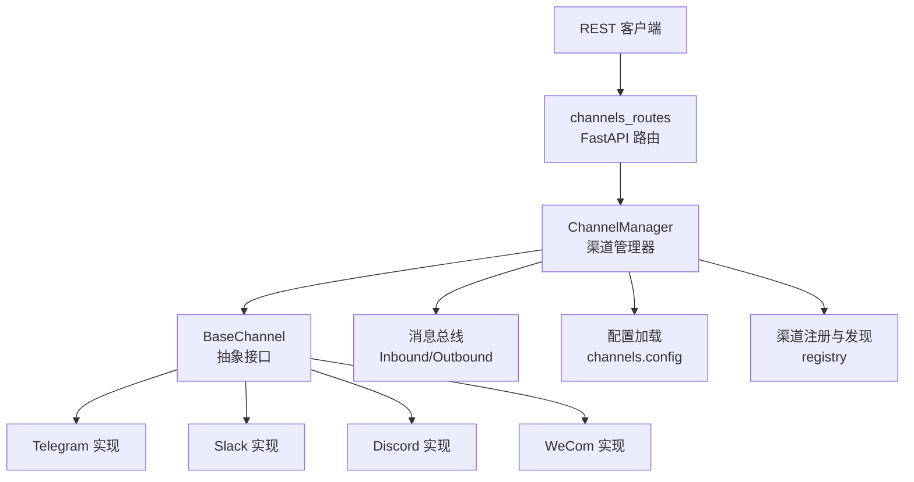
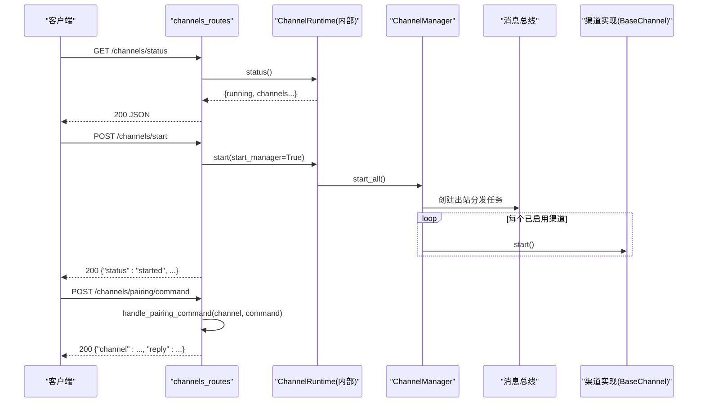
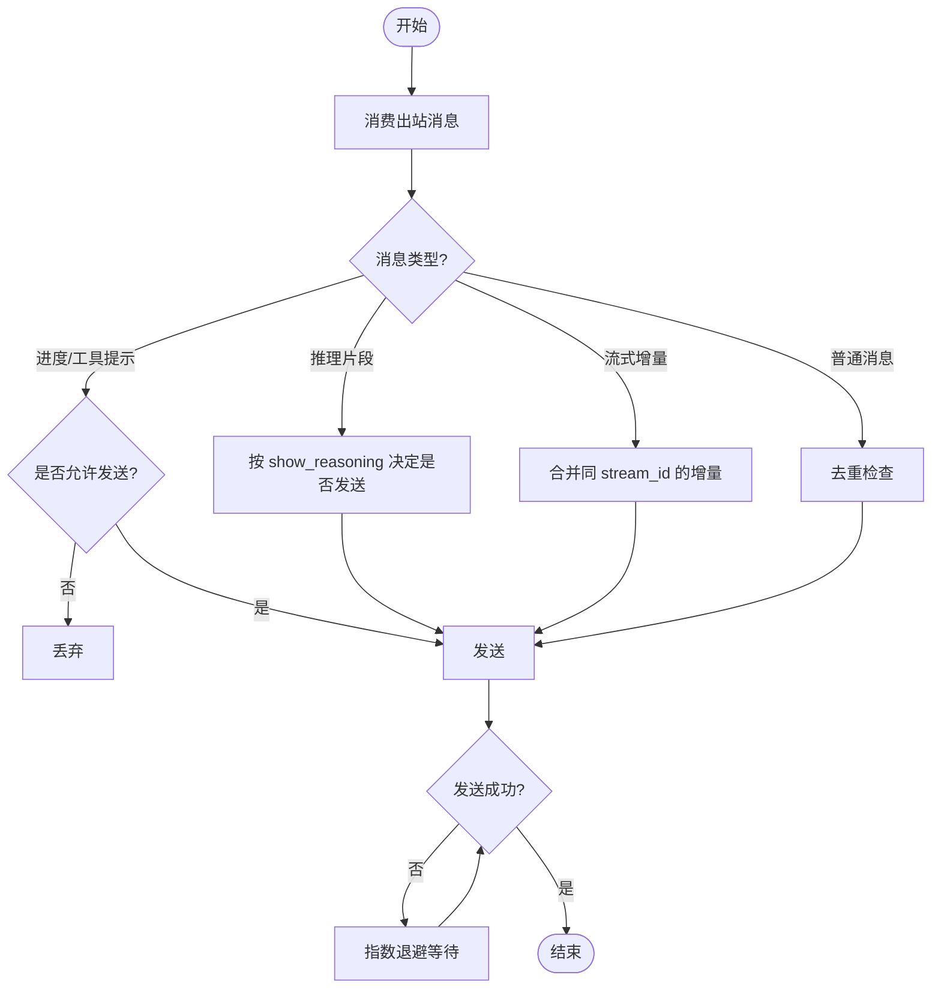
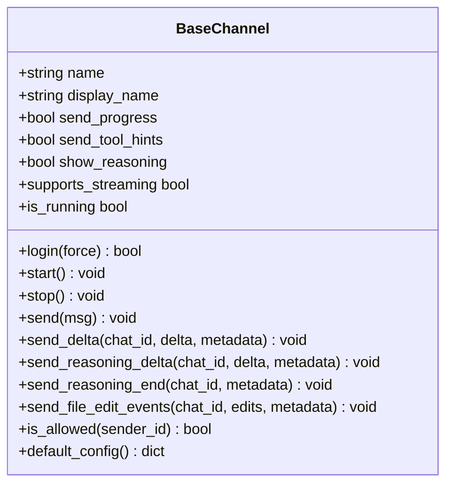
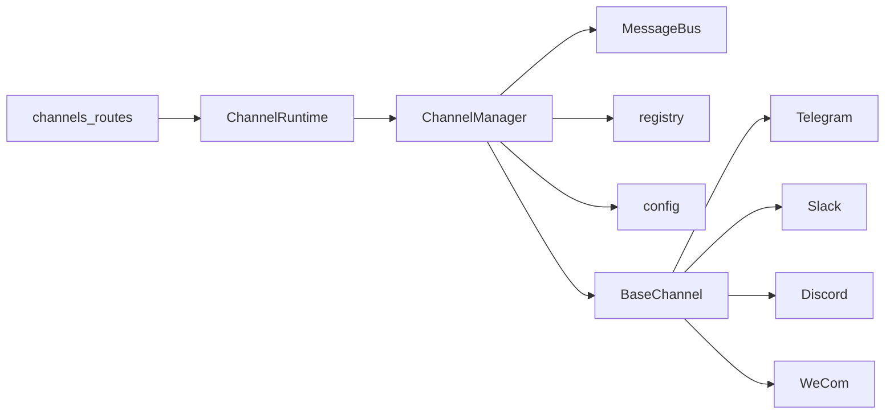

# 消息渠道 API

<cite>
**本文引用的文件**
- [agent/src/api/channels_routes.py](file://agent/src/api/channels_routes.py)
- [agent/src/channels/manager.py](file://agent/src/channels/manager.py)
- [agent/src/channels/base.py](file://agent/src/channels/base.py)
- [agent/src/channels/config.py](file://agent/src/channels/config.py)
- [agent/src/channels/registry.py](file://agent/src/channels/registry.py)
- [agent/src/channels/bus/events.py](file://agent/src/channels/bus/events.py)
- [agent/src/channels/telegram.py](file://agent/src/channels/telegram.py)
- [agent/src/channels/slack.py](file://agent/src/channels/slack.py)
- [agent/src/channels/discord.py](file://agent/src/channels/discord.py)
- [agent/src/channels/wecom.py](file://agent/src/channels/wecom.py)
- [agent/tests/test_channels_api.py](file://agent/tests/test_channels_api.py)
</cite>

## 目录
1. [简介](#简介)
2. [项目结构](#项目结构)
3. [核心组件](#核心组件)
4. [架构总览](#架构总览)
5. [详细组件分析](#详细组件分析)
6. [依赖关系分析](#依赖关系分析)
7. [性能与可靠性](#性能与可靠性)
8. [故障诊断与运维](#故障诊断与运维)
9. [结论](#结论)
10. [附录：端点参考与配置清单](#附录：端点参考与配置清单)

## 简介
本文件为“消息渠道”相关 REST API 的完整端点参考文档，覆盖渠道注册、配置加载、启动/停止、状态监控、配对命令执行等能力；并对 Telegram、Slack、Discord、企业微信（WeCom）等渠道的认证方式、消息格式、流式输出、回调机制进行说明。同时提供新渠道接入、消息路由、错误处理、连接管理、重连策略与负载均衡的实践建议，以及性能监控与运维排障指南。

## 项目结构
- API 层：FastAPI 路由负责暴露渠道运行时控制接口（状态查询、启动/停止、配对命令）。
- 运行时层：ChannelManager 负责发现、初始化、启停各渠道适配器，并统一调度出站消息。
- 通道抽象：BaseChannel 定义所有渠道必须实现的接口（登录、启动、停止、发送、流式扩展、权限校验等）。
- 配置与注册：ChannelsConfig 描述全局渠道配置；registry 负责内置渠道扫描与插件发现；config 负责从结构化 agent.json 中加载 channels 配置。
- 事件总线：InboundMessage/OutboundMessage 在渠道与系统之间传递消息。
- 具体渠道实现：Telegram、Slack、Discord、WeCom 等各自实现 BaseChannel，适配平台 SDK。

图表来源
- [agent/src/api/channels_routes.py:57-115](file://agent/src/api/channels_routes.py#L57-L115)
- [agent/src/channels/manager.py:36-137](file://agent/src/channels/manager.py#L36-L137)
- [agent/src/channels/base.py:22-81](file://agent/src/channels/base.py#L22-L81)
- [agent/src/channels/config.py:11-21](file://agent/src/channels/config.py#L11-L21)
- [agent/src/channels/registry.py:87-220](file://agent/src/channels/registry.py#L87-L220)

章节来源
- [agent/src/api/channels_routes.py:57-115](file://agent/src/api/channels_routes.py#L57-L115)
- [agent/src/channels/manager.py:36-137](file://agent/src/channels/manager.py#L36-L137)
- [agent/src/channels/base.py:22-81](file://agent/src/channels/base.py#L22-L81)
- [agent/src/channels/config.py:11-21](file://agent/src/channels/config.py#L11-L21)
- [agent/src/channels/registry.py:87-220](file://agent/src/channels/registry.py#L87-L220)

## 核心组件
- ChannelManager：集中管理已启用渠道的生命周期、出站消息分发、重试与去重、流式合并、进度/工具提示过滤、推理内容路由等。
- BaseChannel：定义统一的渠道抽象，包括 start/stop/send、流式 send_delta、推理片段 send_reasoning_delta/end、文件编辑事件、权限校验 is_allowed、默认配置 default_config 等。
- registry：自动发现内置渠道模块与外部插件，检测可选依赖是否满足，生成可用性与安装提示。
- config：从结构化 agent.json 中读取 channels 配置，供 ChannelManager 使用。
- events：定义 InboundMessage/OutboundMessage 的数据模型，作为渠道与系统之间的消息契约。

章节来源
- [agent/src/channels/manager.py:36-479](file://agent/src/channels/manager.py#L36-L479)
- [agent/src/channels/base.py:22-238](file://agent/src/channels/base.py#L22-L238)
- [agent/src/channels/registry.py:87-284](file://agent/src/channels/registry.py#L87-L284)
- [agent/src/channels/config.py:11-21](file://agent/src/channels/config.py#L11-L21)
- [agent/src/channels/bus/events.py:20-55](file://agent/src/channels/bus/events.py#L20-L55)

## 架构总览
下图展示了从 REST 请求到渠道发送的端到端流程，包括鉴权、运行时启停、消息分发与重试。

图表来源
- [agent/src/api/channels_routes.py:88-115](file://agent/src/api/channels_routes.py#L88-L115)
- [agent/src/channels/manager.py:213-253](file://agent/src/channels/manager.py#L213-L253)

## 详细组件分析

### REST 端点参考
- GET /channels/status
  - 功能：返回渠道运行时与各适配器的状态（是否运行、是否可用、是否已加载、显示名、错误信息等）。
  - 鉴权：需要 require_auth。
  - 响应：包含 running 标志与 channels 映射，键为渠道名，值为可用性/配置/运行态信息。
- POST /channels/start
  - 功能：启动已配置的渠道适配器，并启动出站消息分发器。
  - 鉴权：需要 require_auth。
  - 响应：{"status": "started", ...}，附带当前状态。
- POST /channels/stop
  - 功能：停止所有渠道适配器，取消分发任务。
  - 鉴权：需要 require_auth。
  - 响应：{"status": "stopped", ...}，附带当前状态。
- POST /channels/pairing/command
  - 功能：对共享配对存储执行配对命令（如列出待批准用户），用于跨渠道授权管理。
  - 鉴权：需要 require_auth。
  - 请求体：{ channel: string, command: string }
  - 响应：{ channel: string, reply: string }

章节来源
- [agent/src/api/channels_routes.py:88-115](file://agent/src/api/channels_routes.py#L88-L115)
- [agent/tests/test_channels_api.py:49-101](file://agent/tests/test_channels_api.py#L49-L101)

### ChannelManager 出站分发与重试
- 出站分发：从消息总线消费 OutboundMessage，根据元数据区分推理片段、进度/工具提示、流式增量、普通消息等，路由至对应渠道。
- 流式合并：对同一目标与 stream_id 的连续 _stream_delta 进行合并，减少 API 调用次数。
- 去重抑制：基于内容指纹与 origin_message_id/message_id 抑制重复出站。
- 重试策略：失败时按指数退避重试，最大尝试次数由全局 send_max_retries 控制。

图表来源
- [agent/src/channels/manager.py:394-563](file://agent/src/channels/manager.py#L394-L563)

章节来源
- [agent/src/channels/manager.py:254-453](file://agent/src/channels/manager.py#L254-L453)

### BaseChannel 抽象与权限
- 生命周期：start/stop 必须由子类实现；send 负责将消息发送到具体平台。
- 流式扩展：send_delta、send_reasoning_delta、send_reasoning_end、send_file_edit_events 可被重写以支持平台原生能力。
- 权限：is_allowed 支持通配符、白名单、配对存储批准；未授权 DM 会下发配对码。
- 默认配置：default_config 用于引导配置填充。

图表来源
- [agent/src/channels/base.py:22-238](file://agent/src/channels/base.py#L22-L238)

章节来源
- [agent/src/channels/base.py:22-238](file://agent/src/channels/base.py#L22-L238)

### 渠道实现要点

#### Telegram
- 认证与连接：通过 python-telegram-bot Application 建立长连接，监听消息与回调。
- 消息格式：支持 Markdown/HTML 解析，超长消息会被拆分；表格与代码块有专门处理逻辑。
- 流式输出：若开启 streaming，可通过 send_delta 逐步更新消息。
- 媒体上传：支持图片、视频、音频、文件等。
- 安全限制：消息长度上限、HTML 渲染边界、代码块完整性保护。

章节来源
- [agent/src/channels/telegram.py:1-200](file://agent/src/channels/telegram.py#L1-L200)

#### Slack
- 认证与连接：使用 Socket Mode（WebSocket）接收事件；通过 AsyncWebClient 发送消息。
- 消息格式：Markdown 转 mrkdwn；支持按钮块；支持线程回复。
- 流式输出：可按需实现 send_delta 以渐进更新。
- 媒体上传：files_upload_v2 上传附件。
- 超时与代理：Socket Mode 握手超时时间固定；HTTP(S)_PROXY 不应用于 WebSocket 连接。

章节来源
- [agent/src/channels/slack.py:1-200](file://agent/src/channels/slack.py#L1-L200)

#### Discord
- 认证与连接：使用 discord.py Client，注册应用命令与消息事件。
- 消息格式：支持富文本与附件；支持线程上下文。
- 流式输出：维护每聊天会话的缓冲区，逐步编辑消息。
- 权限控制：支持 allow_from 与 allow_channels；群组策略 mention/open。
- 代理支持：可配置 HTTP 代理与认证。

章节来源
- [agent/src/channels/discord.py:1-200](file://agent/src/channels/discord.py#L1-L200)

#### WeCom（企业微信）
- 认证与连接：使用 wecom_aibot_sdk 的 WSClient 建立 WebSocket 长连接；无需公网 IP。
- 消息格式：支持文本、图片、语音、文件、混合内容；自动分类媒体类型。
- 重连机制：无限次重连、心跳保活、断线事件处理。
- 会话上下文：维护 chat frames 以便回复。

章节来源
- [agent/src/channels/wecom.py:1-200](file://agent/src/channels/wecom.py#L1-L200)

### 配置加载与全局设置
- ChannelsConfig：定义全局字段，如 send_progress、send_tool_hints、send_max_retries、reply_timeout_s、operators 等。
- 渠道配置：每个渠道拥有独立 section，包含 enabled、allow_from、streaming 等开关与参数。
- 加载方式：通过 load_channels_config 从 agent.json 中读取 channels 部分，并以字典形式提供给 ChannelManager。

章节来源
- [agent/src/channels/config.py:11-21](file://agent/src/channels/config.py#L11-L21)

### 渠道注册与插件发现
- 内置渠道：通过 pkgutil 扫描 src.channels 下的模块，排除内部模块后得到内置渠道列表。
- 插件渠道：通过 entry_points 组 vibe_trading.channels 发现外部插件。
- 可用性检测：检测可选依赖是否满足，并提供安装提示。
- 启用筛选：仅导入与 enabled_names 匹配的渠道类，避免不必要的第三方 SDK 导入。

章节来源
- [agent/src/channels/registry.py:87-284](file://agent/src/channels/registry.py#L87-L284)

## 依赖关系分析
- API 路由依赖 ChannelRuntime（通过 sys.modules 延迟访问），进而依赖 ChannelManager。
- ChannelManager 依赖 MessageBus、BaseChannel 抽象、registry 与 config。
- 各渠道实现依赖各自平台的 SDK，并通过 BaseChannel 统一接入。
- 测试用例验证了 /channels/status、/channels/start、/channels/stop、/channels/pairing/command 的行为。

图表来源
- [agent/src/api/channels_routes.py:57-115](file://agent/src/api/channels_routes.py#L57-L115)
- [agent/src/channels/manager.py:36-137](file://agent/src/channels/manager.py#L36-L137)
- [agent/src/channels/registry.py:87-220](file://agent/src/channels/registry.py#L87-L220)
- [agent/src/channels/config.py:11-21](file://agent/src/channels/config.py#L11-L21)

章节来源
- [agent/src/api/channels_routes.py:57-115](file://agent/src/api/channels_routes.py#L57-L115)
- [agent/src/channels/manager.py:36-137](file://agent/src/channels/manager.py#L36-L137)
- [agent/src/channels/registry.py:87-220](file://agent/src/channels/registry.py#L87-L220)
- [agent/src/channels/config.py:11-21](file://agent/src/channels/config.py#L11-L21)

## 性能与可靠性
- 出站消息合并：对同一 stream_id 的连续增量进行合并，降低平台 API 调用频率。
- 重试与退避：发送失败时按指数退避重试，最大尝试次数受 send_max_retries 控制。
- 去重抑制：基于内容指纹与消息 ID 抑制重复出站，避免刷屏。
- 流式优化：推理片段与流式增量仅在渠道支持且配置开启时发送。
- 资源清理：stop_all 会取消分发任务并逐个关闭渠道，确保资源释放。

章节来源
- [agent/src/channels/manager.py:394-563](file://agent/src/channels/manager.py#L394-L563)

## 故障诊断与运维
- 渠道不可用：registry 会报告 available=false 并提供 install_hint；ChannelManager 会在状态中记录 error 信息。
- 启动失败：ChannelManager 捕获异常并记录日志，不影响其他渠道启动。
- 发送失败：_send_with_retry 记录失败原因并重试；超过最大尝试次数后记录异常。
- 网络问题：Slack Socket Mode 握手超时会有明确提示；WeCom 支持无限重连与心跳。
- 权限问题：未授权用户在 DM 中会收到配对码；群组/频道级限制由各渠道实现控制。
- 配置问题：ChannelsConfig 严格校验全局字段；渠道 section 缺失或 enabled=false 将被跳过。

章节来源
- [agent/src/channels/registry.py:130-160](file://agent/src/channels/registry.py#L130-L160)
- [agent/src/channels/manager.py:64-137](file://agent/src/channels/manager.py#L64-L137)
- [agent/src/channels/manager.py:532-563](file://agent/src/channels/manager.py#L532-L563)
- [agent/src/channels/slack.py:92-136](file://agent/src/channels/slack.py#L92-L136)
- [agent/src/channels/wecom.py:102-147](file://agent/src/channels/wecom.py#L102-L147)

## 结论
本系统通过统一的 BaseChannel 抽象与 ChannelManager 编排，实现了多消息渠道的统一接入与管理。REST API 提供了简洁的控制面，便于运维与集成。各渠道实现遵循一致的协议，支持流式输出、权限控制与媒体处理。结合重试、合并与去重策略，系统在可靠性与性能方面具备良好表现。新增渠道只需实现 BaseChannel 并在 registry 中可被发现即可无缝接入。

## 附录：端点参考与配置清单

### REST 端点规范
- GET /channels/status
  - 鉴权：需要
  - 响应示例字段：running、channels（含 configured/enabled/available/display_name/error/loaded/running）
- POST /channels/start
  - 鉴权：需要
  - 响应示例字段：status="started"、running、channels
- POST /channels/stop
  - 鉴权：需要
  - 响应示例字段：status="stopped"、running、channels
- POST /channels/pairing/command
  - 鉴权：需要
  - 请求体：{ channel: string, command: string }
  - 响应示例字段：channel、reply

章节来源
- [agent/src/api/channels_routes.py:88-115](file://agent/src/api/channels_routes.py#L88-L115)
- [agent/tests/test_channels_api.py:49-101](file://agent/tests/test_channels_api.py#L49-L101)

### 渠道配置要点（节选）
- 全局 ChannelsConfig
  - send_progress：是否发送进度消息
  - send_tool_hints：是否发送工具提示
  - send_max_retries：发送最大重试次数
  - reply_timeout_s：回复超时秒数
  - operators：跨渠道操作员白名单
- 渠道通用字段
  - enabled：是否启用
  - allow_from：发送者白名单（支持 "*"）
  - streaming：是否启用流式输出（由渠道实现决定）
- 渠道特定字段
  - Telegram：token、proxy、media_root 等（由实现解析）
  - Slack：bot_token、app_token、mode、webhook_path、reply_in_thread、react_emoji、done_emoji、include_thread_context、thread_context_limit、group_policy、dm.policy 等
  - Discord：token、intents、group_policy、read_receipt_emoji、working_emoji、streaming、proxy 等
  - WeCom：bot_id、secret、welcome_message 等

章节来源
- [agent/src/channels/slack.py:30-62](file://agent/src/channels/slack.py#L30-L62)
- [agent/src/channels/discord.py:50-66](file://agent/src/channels/discord.py#L50-L66)
- [agent/src/channels/wecom.py:54-62](file://agent/src/channels/wecom.py#L54-L62)
- [agent/src/channels/base.py:181-190](file://agent/src/channels/base.py#L181-L190)

### 新渠道接入步骤
- 实现 BaseChannel：至少实现 start、stop、send；可选实现 send_delta、send_reasoning_delta、send_reasoning_end、send_file_edit_events。
- 提供 default_config：返回渠道默认配置字典。
- 放置模块：将渠道模块放入 src.channels 下，或通过 entry_points 注册为插件。
- 配置启用：在 agent.json 的 channels 中添加该渠道 section，设置 enabled=true 及必要凭据。
- 验证：调用 /channels/status 查看 available/loaded/running；调用 /channels/start 启动并观察日志。

章节来源
- [agent/src/channels/base.py:22-81](file://agent/src/channels/base.py#L22-L81)
- [agent/src/channels/registry.py:87-127](file://agent/src/channels/registry.py#L87-L127)
- [agent/src/channels/config.py:11-21](file://agent/src/channels/config.py#L11-L21)

### 消息路由与回调机制
- 入站消息：渠道实现将平台消息封装为 InboundMessage 并发布到消息总线。
- 出站消息：系统生成 OutboundMessage，经 ChannelManager 分发到目标渠道。
- 流式回调：渠道可实现 send_delta 以渐进更新；推理片段通过 send_reasoning_delta/end 呈现。
- 文件编辑事件：渠道可重写 send_file_edit_events 以展示结构化活动。

章节来源
- [agent/src/channels/bus/events.py:20-55](file://agent/src/channels/bus/events.py#L20-L55)
- [agent/src/channels/base.py:110-177](file://agent/src/channels/base.py#L110-L177)
- [agent/src/channels/manager.py:394-480](file://agent/src/channels/manager.py#L394-L480)

### 连接管理与重连策略
- WeCom：WSClient 支持无限重连与心跳；断线事件记录日志。
- Slack：Socket Mode 握手超时处理；HTTP(S)_PROXY 不适用于 WebSocket。
- Discord：Client 事件驱动，断线由框架处理；可配置代理。
- Telegram：Application 管理连接；网络错误由 SDK 处理。

章节来源
- [agent/src/channels/wecom.py:102-147](file://agent/src/channels/wecom.py#L102-L147)
- [agent/src/channels/slack.py:92-136](file://agent/src/channels/slack.py#L92-L136)
- [agent/src/channels/discord.py:70-106](file://agent/src/channels/discord.py#L70-L106)
- [agent/src/channels/telegram.py:1-200](file://agent/src/channels/telegram.py#L1-L200)

### 负载均衡策略
- 单实例多渠道路由：ChannelManager 在同一进程内并行启动多个渠道，无显式负载均衡。
- 水平扩展：如需横向扩展，可在不同实例部署相同服务，通过上游网关按 chat_id 或 channel 分片路由。
- 队列缓冲：消息总线作为缓冲层，缓解瞬时峰值；ChannelManager 消费队列并合并流式增量。

[本节为概念性说明，不直接分析具体文件]