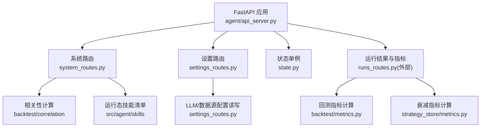
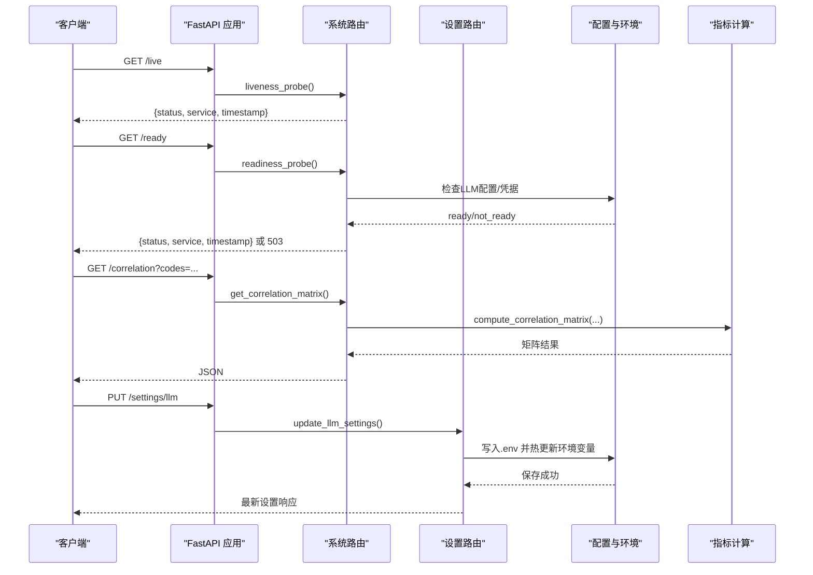
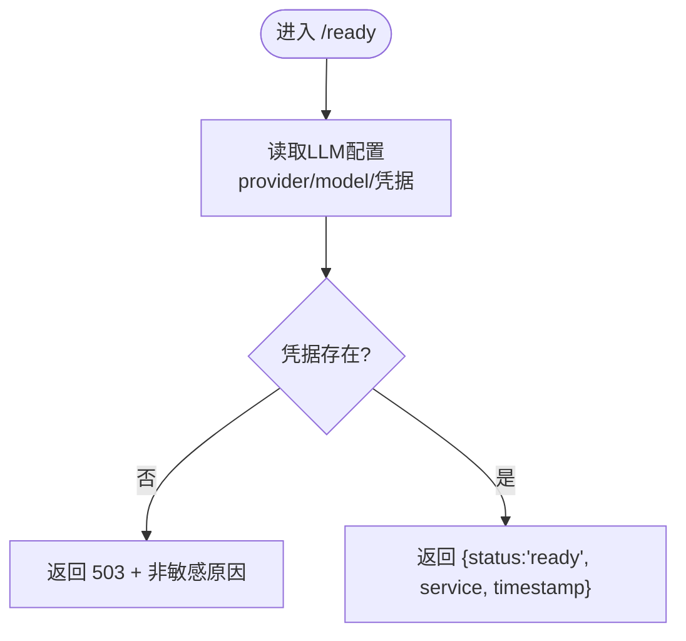
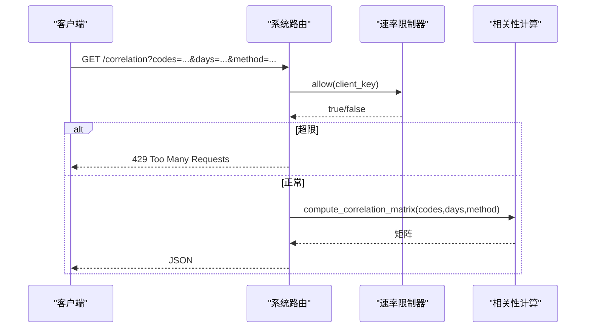
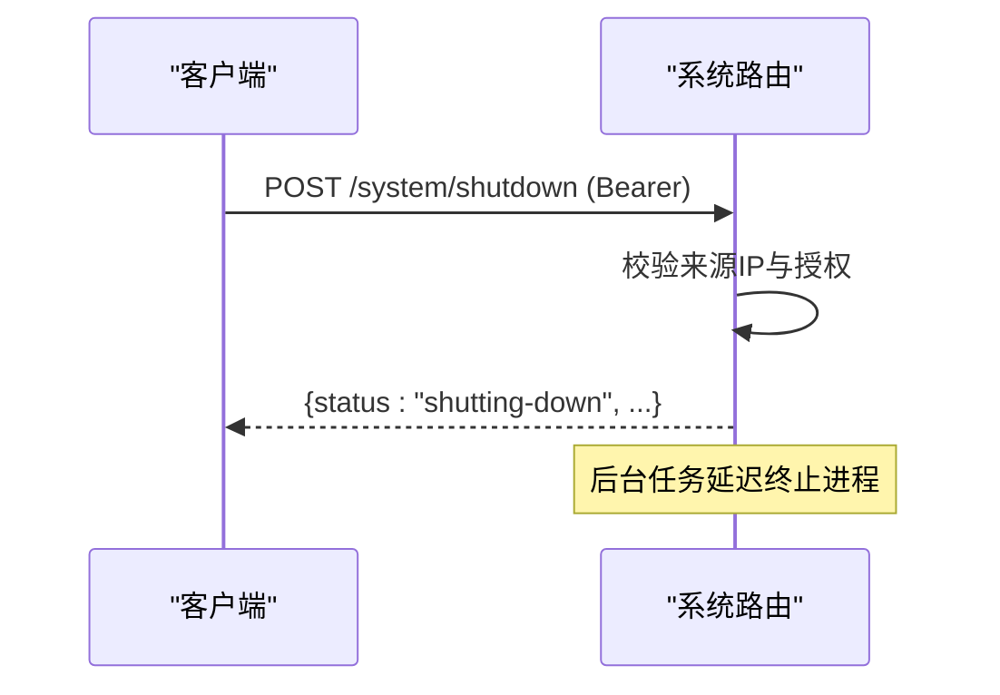
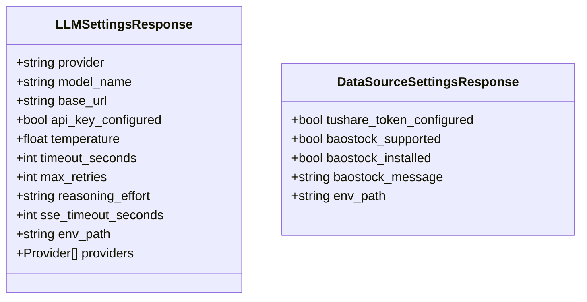
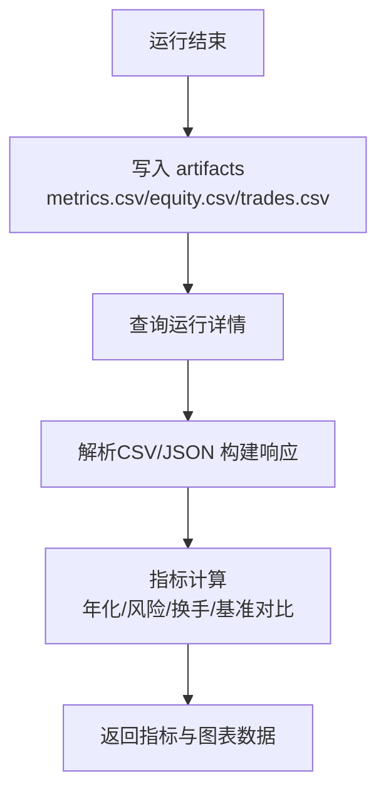
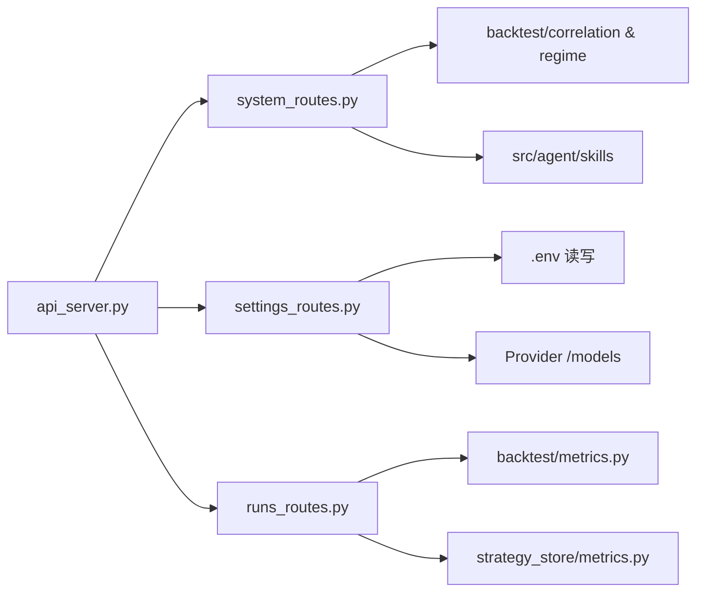

# 系统信息 API

<cite>
**本文引用的文件**
- [agent/api_server.py](file://agent/api_server.py)
- [agent/src/api/system_routes.py](file://agent/src/api/system_routes.py)
- [agent/src/api/settings_routes.py](file://agent/src/api/settings_routes.py)
- [agent/src/api/state.py](file://agent/src/api/state.py)
- [agent/backtest/metrics.py](file://agent/backtest/metrics.py)
- [agent/src/strategy_store/metrics.py](file://agent/src/strategy_store/metrics.py)
</cite>

## 目录
1. [简介](#简介)
2. [项目结构](#项目结构)
3. [核心组件](#核心组件)
4. [架构总览](#架构总览)
5. [详细组件分析](#详细组件分析)
6. [依赖关系分析](#依赖关系分析)
7. [性能考虑](#性能考虑)
8. [故障排查指南](#故障排查指南)
9. [结论](#结论)
10. [附录：端点参考与示例](#附录：端点参考与示例)

## 简介
本文件为 Vibe-Trading 的系统信息与监控相关 REST API 的完整端点参考文档，覆盖系统健康检查、就绪性探测、服务元数据、相关性计算、运行期设置查询与更新、以及回测指标与衰减指标等能力。文档同时说明指标收集、存储与查询机制，并提供性能分析、故障诊断、容量规划、数据存储、历史查询、告警与系统维护（含本地安全关闭）的实践指引。

## 项目结构
系统信息 API 由 FastAPI 应用统一装配，路由模块按职责拆分：
- 系统与健康：/live、/health、/ready、/correlation、/correlation/regime、/system/shutdown、/skills、/api、OpenAPI/Swagger/ReDoc
- 设置与配置：/settings/llm、/settings/data-sources、/settings/llm/models
- 运行时状态：会话与通道运行时懒加载（供其他路由复用）
- 指标与度量：回测指标计算、因子/策略衰减指标

**图示来源**
- [agent/api_server.py:166-174](file://agent/api_server.py#L166-L174)
- [agent/src/api/system_routes.py:197-469](file://agent/src/api/system_routes.py#L197-L469)
- [agent/src/api/settings_routes.py:492-690](file://agent/src/api/settings_routes.py#L492-L690)
- [agent/src/api/state.py:29-111](file://agent/src/api/state.py#L29-L111)
- [agent/backtest/metrics.py:461-641](file://agent/backtest/metrics.py#L461-L641)
- [agent/src/strategy_store/metrics.py:24-90](file://agent/src/strategy_store/metrics.py#L24-L90)

**章节来源**
- [agent/api_server.py:166-174](file://agent/api_server.py#L166-L174)
- [agent/src/api/system_routes.py:197-469](file://agent/src/api/system_routes.py#L197-L469)
- [agent/src/api/settings_routes.py:492-690](file://agent/src/api/settings_routes.py#L492-L690)
- [agent/src/api/state.py:29-111](file://agent/src/api/state.py#L29-L111)

## 核心组件
- 健康与就绪探针：/live、/health、/ready
- 相关性分析与市场状态：/correlation、/correlation/regime
- 系统管理：/system/shutdown、/skills、/api、/openapi.json、/docs、/redoc
- 设置与配置：/settings/llm、/settings/data-sources、/settings/llm/models
- 指标与度量：回测指标计算、衰减指标计算（通过运行结果与工具调用间接暴露）

**章节来源**
- [agent/src/api/system_routes.py:235-469](file://agent/src/api/system_routes.py#L235-L469)
- [agent/src/api/settings_routes.py:513-690](file://agent/src/api/settings_routes.py#L513-L690)
- [agent/backtest/metrics.py:461-641](file://agent/backtest/metrics.py#L461-L641)
- [agent/src/strategy_store/metrics.py:24-90](file://agent/src/strategy_store/metrics.py#L24-L90)

## 架构总览
系统以 FastAPI 为中心，启动时执行预检并挂载各路由模块；系统路由提供健康、就绪、相关性、技能列表、服务元数据与安全关闭；设置路由负责 LLM 与数据源配置的读取、校验、持久化与热更新；指标计算在回测与策略存储层完成，并通过运行结果与工具接口对外呈现。

**图示来源**
- [agent/src/api/system_routes.py:242-272](file://agent/src/api/system_routes.py#L242-L272)
- [agent/src/api/system_routes.py:274-310](file://agent/src/api/system_routes.py#L274-L310)
- [agent/src/api/settings_routes.py:616-697](file://agent/src/api/settings_routes.py#L616-L697)
- [agent/backtest/metrics.py:461-641](file://agent/backtest/metrics.py#L461-L641)

## 详细组件分析

### 健康与就绪探针
- GET /live：进程级存活检查，返回服务名与时间戳。
- GET /health：兼容旧监控的别名，行为同 /live。
- GET /ready：就绪性检查，验证 LLM provider/model/凭据是否可用；不可用时返回 503 与非敏感原因。

**图示来源**
- [agent/src/api/system_routes.py:142-190](file://agent/src/api/system_routes.py#L142-L190)
- [agent/src/api/system_routes.py:257-272](file://agent/src/api/system_routes.py#L257-L272)

**章节来源**
- [agent/src/api/system_routes.py:235-272](file://agent/src/api/system_routes.py#L235-L272)

### 相关性分析与市场状态
- GET /correlation：基于日线收益计算多资产相关性矩阵，支持 pearson/spearman，限制请求频率与参数范围。
- GET /correlation/regime：滚动相关性边缘密度+平滑+迟滞状态机，输出“融合/分离”等市场状态时间线。

**图示来源**
- [agent/src/api/system_routes.py:62-129](file://agent/src/api/system_routes.py#L62-L129)
- [agent/src/api/system_routes.py:274-310](file://agent/src/api/system_routes.py#L274-L310)

**章节来源**
- [agent/src/api/system_routes.py:274-360](file://agent/src/api/system_routes.py#L274-L360)

### 系统管理与文档
- POST /system/shutdown：仅本地访问且需授权后触发优雅关闭。
- GET /skills：列出已注册技能（名称与描述）。
- GET /api：服务元数据（版本、文档入口、健康入口）。
- GET /openapi.json：受鉴权保护的 OpenAPI Schema。
- GET /docs、GET /redoc：仅在无 API Key 的本地开发模式可用，需鉴权。

**图示来源**
- [agent/src/api/system_routes.py:362-379](file://agent/src/api/system_routes.py#L362-L379)

**章节来源**
- [agent/src/api/system_routes.py:362-469](file://agent/src/api/system_routes.py#L362-L469)

### 设置与配置（LLM 与数据源）
- GET /settings/llm：获取当前 LLM 设置（provider、model、base_url、凭据状态、温度、超时、重试、推理强度、SSE 超时、环境路径、可用 providers）。
- PUT /settings/llm：持久化 LLM 设置并热更新运行进程环境变量。
- POST /settings/llm/models：动态发现模型列表（支持默认/可信来源回退）。
- GET /settings/data-sources：获取数据源凭据状态（如 Tushare Token、BaoStock 支持情况）。
- PUT /settings/data-sources：持久化数据源凭据并热更新。

**图示来源**
- [agent/src/api/settings_routes.py:31-63](file://agent/src/api/settings_routes.py#L31-L63)
- [agent/src/api/settings_routes.py:103-119](file://agent/src/api/settings_routes.py#L103-L119)

**章节来源**
- [agent/src/api/settings_routes.py:513-690](file://agent/src/api/settings_routes.py#L513-L690)

### 指标收集、存储与查询
- 回测指标：通过运行结果目录中的 artifacts（metrics.csv、equity.csv、trades.csv、positions.csv 等）读取并组装响应；指标计算逻辑包含年化、夏普、索提诺、最大回撤、换手率、基准对比等。
- 衰减指标：对因子/策略的历史评估记录计算基线与滚动 IC、IR、Sharpe 等，用于质量监控与告警。

**图示来源**
- [agent/src/api/runs_routes.py:52-200](file://agent/src/api/runs_routes.py#L52-L200)
- [agent/backtest/metrics.py:461-641](file://agent/backtest/metrics.py#L461-L641)
- [agent/src/strategy_store/metrics.py:24-90](file://agent/src/strategy_store/metrics.py#L24-L90)

**章节来源**
- [agent/src/api/runs_routes.py:52-200](file://agent/src/api/runs_routes.py#L52-L200)
- [agent/backtest/metrics.py:461-641](file://agent/backtest/metrics.py#L461-L641)
- [agent/src/strategy_store/metrics.py:24-90](file://agent/src/strategy_store/metrics.py#L24-L90)

## 依赖关系分析
- 应用装配：api_server.py 创建 FastAPI 实例、添加中间件、注册各路由模块，并在生命周期中执行预检与调度。
- 系统路由依赖：
  - 安全与鉴权：从 host 模块注入 require_auth、_security、_require_shutdown_authorization。
  - 相关性计算：调用 backtest.correlation 与 backtest.regime。
  - 技能清单：调用 src.agent.skills.SkillsLoader。
- 设置路由依赖：
  - 配置读取/写入：通过 _read_settings_env_values/_persist_settings_updates 操作 .env。
  - 模型发现：HTTP 调用 provider 的 /models 端点（OpenAI 兼容）。
- 指标依赖：
  - 运行结果：runs_routes 读取 artifacts 并组装响应。
  - 指标计算：backtest.metrics 与 strategy_store.metrics。

**图示来源**
- [agent/api_server.py:189-314](file://agent/api_server.py#L189-L314)
- [agent/src/api/system_routes.py:197-469](file://agent/src/api/system_routes.py#L197-L469)
- [agent/src/api/settings_routes.py:492-690](file://agent/src/api/settings_routes.py#L492-L690)
- [agent/src/api/runs_routes.py:52-200](file://agent/src/api/runs_routes.py#L52-L200)

**章节来源**
- [agent/api_server.py:189-314](file://agent/api_server.py#L189-L314)
- [agent/src/api/system_routes.py:197-469](file://agent/src/api/system_routes.py#L197-L469)
- [agent/src/api/settings_routes.py:492-690](file://agent/src/api/settings_routes.py#L492-L690)
- [agent/src/api/runs_routes.py:52-200](file://agent/src/api/runs_routes.py#L52-L200)

## 性能考虑
- 相关性接口限流：基于滑动窗口的每客户端 IP 限流（默认 30 次/分钟），避免重计算导致资源耗尽。
- 指标计算复杂度：相关性矩阵 O(n^2)，回测指标涉及时序聚合与年化，建议控制 days 与资产数量。
- 文档与 Schema：生产环境隐藏 Swagger/ReDoc，减少攻击面；OpenAPI Schema 受鉴权保护。
- 日志脱敏：访问日志中对敏感字段进行脱敏，降低泄露风险。

[本节为通用指导，不直接分析具体文件]

## 故障排查指南
- 就绪失败（/ready 返回 503）：检查 LLM provider/model 是否配置、OAuth/Copilot 登录状态、凭据是否有效。
- 相关性报错：确认 codes 数量在 2–20 之间、method 合法、数据可拉取；关注限流 429。
- 设置写入失败：检查 .env 文件权限与路径；桌面模式下密钥可能由宿主安全存储注入。
- 模型列表不可用：provider 不支持 OAuth/GH CLI 动态发现或网络不可达时，将回退到默认模型。
- 本地关闭受限：/system/shutdown 仅允许 127.0.0.1/::1/localhost 来源，且需授权。

**章节来源**
- [agent/src/api/system_routes.py:142-190](file://agent/src/api/system_routes.py#L142-L190)
- [agent/src/api/system_routes.py:274-310](file://agent/src/api/system_routes.py#L274-L310)
- [agent/src/api/settings_routes.py:616-697](file://agent/src/api/settings_routes.py#L616-L697)
- [agent/src/api/settings_routes.py:699-743](file://agent/src/api/settings_routes.py#L699-L743)
- [agent/src/api/system_routes.py:362-379](file://agent/src/api/system_routes.py#L362-L379)

## 结论
本系统提供了完善的健康与就绪探针、相关性分析与市场状态、安全的系统管理、灵活的设置与配置管理，以及完整的回测与衰减指标能力。结合限流、鉴权与日志脱敏，可在生产环境中稳定运行并满足监控、诊断与容量规划需求。

[本节为总结，不直接分析具体文件]

## 附录：端点参考与示例

### 健康与就绪
- GET /live
  - 描述：进程存活检查
  - 响应：{ status, service, timestamp }
- GET /health
  - 描述：兼容旧监控的别名
  - 响应：同 /live
- GET /ready
  - 描述：就绪性检查（LLM provider/model/凭据）
  - 响应：200 { status, service, timestamp } 或 503 { detail }

**章节来源**
- [agent/src/api/system_routes.py:235-272](file://agent/src/api/system_routes.py#L235-L272)

### 相关性分析
- GET /correlation
  - 查询参数：codes（逗号分隔）、days（7–365）、method（pearson/spearman）
  - 鉴权：需要
  - 限流：每客户端 IP 30 次/分钟
  - 响应：相关性矩阵
- GET /correlation/regime
  - 查询参数：codes、days（30–365）、corr_window（5–250）、edge_threshold（0–1）、smooth_window（1–60）、enter_threshold（0–1）、exit_threshold（0–1，必须小于 enter_threshold）
  - 鉴权：需要
  - 限流：同上
  - 响应：边缘密度与状态时间线

**章节来源**
- [agent/src/api/system_routes.py:274-360](file://agent/src/api/system_routes.py#L274-L360)

### 系统管理
- POST /system/shutdown
  - 鉴权：需要（本地来源 + 授权）
  - 响应：{ status:"shutting-down", service, timestamp }
- GET /skills
  - 鉴权：需要
  - 响应：技能列表 [{ name, description }]
- GET /api
  - 响应：{ service, version, docs, health }
- GET /openapi.json
  - 鉴权：需要
  - 响应：OpenAPI Schema
- GET /docs、GET /redoc
  - 条件：仅在无 API Key 的本地开发模式可用，需鉴权
  - 响应：Swagger/ReDoc 页面

**章节来源**
- [agent/src/api/system_routes.py:362-469](file://agent/src/api/system_routes.py#L362-L469)

### 设置与配置
- GET /settings/llm
  - 鉴权：本地或鉴权
  - 响应：LLMSettingsResponse
- PUT /settings/llm
  - 鉴权：写权限
  - 请求体：UpdateLLMSettingsRequest
  - 响应：LLMSettingsResponse
- POST /settings/llm/models
  - 鉴权：写权限
  - 请求体：ListLLMModelsRequest
  - 响应：LLMModelsResponse
- GET /settings/data-sources
  - 鉴权：本地或鉴权
  - 响应：DataSourceSettingsResponse
- PUT /settings/data-sources
  - 鉴权：写权限
  - 请求体：UpdateDataSourceSettingsRequest
  - 响应：DataSourceSettingsResponse

**章节来源**
- [agent/src/api/settings_routes.py:513-690](file://agent/src/api/settings_routes.py#L513-L690)

### 指标与度量（通过运行结果与工具）
- 回测指标：通过运行结果 artifacts 读取 metrics.csv/equity.csv/trades.csv/positions.csv，并计算年化、夏普、索提诺、最大回撤、换手率、基准对比等。
- 衰减指标：对因子/策略历史评估记录计算基线与滚动 IC、IR、Sharpe，用于质量监控与告警。

**章节来源**
- [agent/src/api/runs_routes.py:52-200](file://agent/src/api/runs_routes.py#L52-L200)
- [agent/backtest/metrics.py:461-641](file://agent/backtest/metrics.py#L461-L641)
- [agent/src/strategy_store/metrics.py:24-90](file://agent/src/strategy_store/metrics.py#L24-L90)

### 监控示例与实践
- 性能分析
  - 使用 /correlation 观察资产间相关性变化，识别高相关阶段以降低分散效果。
  - 通过运行结果 equity.csv 与 metrics.csv 分析收益曲线与关键指标。
- 故障诊断
  - 若 /ready 返回 503，检查 LLM provider/model/凭据与网络连通性。
  - 相关性接口频繁 429，调整调用频率或批量合并请求。
- 容量规划
  - 根据相关性窗口 days 与资产数量控制计算负载；必要时分时段批处理。
- 数据存储与历史查询
  - 运行结果 artifacts 持久化于磁盘，可通过运行详情接口读取 CSV/JSON。
- 告警机制
  - 基于衰减指标（IC/IR/Sharpe）设定阈值，触发告警；结合 /correlation/regime 的市场状态切换进行风控。
- 系统维护与升级
  - 使用 /system/shutdown 进行安全关闭；升级前备份 .env 与 artifacts。
- 灾难恢复
  - 保留 .env 与 artifacts 副本；恢复后重启服务，重新加载配置与运行结果。

[本节为实践指导，不直接分析具体文件]