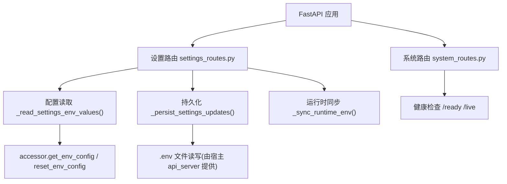
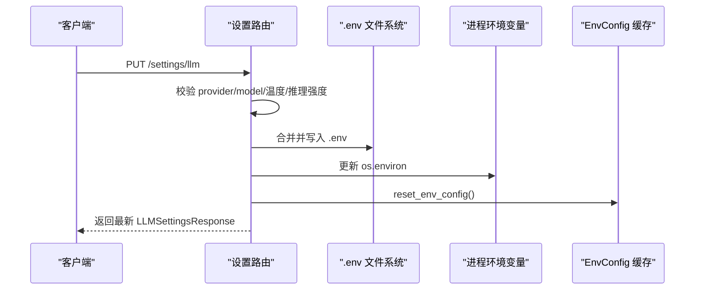
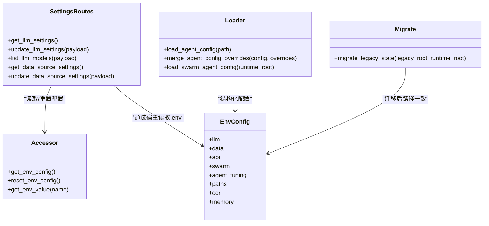

# 系统设置 API

<cite>
**本文引用的文件**
- [settings_routes.py](file://agent/src/api/settings_routes.py)
- [system_routes.py](file://agent/src/api/system_routes.py)
- [env_schema.py](file://agent/src/config/env_schema.py)
- [accessor.py](file://agent/src/config/accessor.py)
- [loader.py](file://agent/src/config/loader.py)
- [schema.py](file://agent/src/config/schema.py)
- [migrate.py](file://agent/src/config/migrate.py)
- [test_settings_api.py](file://agent/tests/test_settings_api.py)
</cite>

## 目录
1. [简介](#简介)
2. [项目结构](#项目结构)
3. [核心组件](#核心组件)
4. [架构总览](#架构总览)
5. [详细端点参考](#详细端点参考)
6. [依赖关系分析](#依赖关系分析)
7. [性能与可用性](#性能与可用性)
8. [故障排查指南](#故障排查指南)
9. [结论](#结论)
10. [附录：配置项分类、默认值与安全](#附录：配置项分类默认值与安全)

## 简介
本文件为“系统设置管理”相关 REST API 的完整端点参考，覆盖应用配置读取与更新、用户偏好（LLM/数据源）、环境变量热更新、配置验证、安全校验、版本兼容与迁移、以及审计与变更追踪等能力。文档面向开发者与运维人员，既提供接口规范，也给出使用示例与排错建议。

## 项目结构
系统设置相关的功能主要分布在以下模块：
- FastAPI 路由层：暴露 HTTP 端点，负责鉴权、参数校验、持久化与运行时同步
- 配置模型与加载：集中定义环境变量的类型、默认值、别名与校验
- 访问器与缓存：提供线程安全的配置单例与重置机制，支持运行时热更新
- 迁移工具：将历史状态从代码相对路径迁移到运行时根目录，保证升级不丢数据

图表来源
- [settings_routes.py:513-689](file://agent/src/api/settings_routes.py#L513-L689)
- [system_routes.py:242-272](file://agent/src/api/system_routes.py#L242-L272)
- [accessor.py:52-92](file://agent/src/config/accessor.py#L52-L92)

章节来源
- [settings_routes.py:1-690](file://agent/src/api/settings_routes.py#L1-L690)
- [system_routes.py:1-469](file://agent/src/api/system_routes.py#L1-L469)
- [accessor.py:1-149](file://agent/src/config/accessor.py#L1-L149)

## 核心组件
- 设置路由模块：提供 LLM 和数据源两类设置的读/写/枚举接口，并实现热更新与持久化
- 配置模型与环境变量：集中定义所有环境变量及其默认值、类型、别名与校验规则
- 配置访问器：提供线程安全的 EnvConfig 单例与重置方法，确保运行时生效
- 迁移模块：一次性将旧版状态目录迁移至运行时根目录，保证幂等与原子性

章节来源
- [env_schema.py:1-593](file://agent/src/config/env_schema.py#L1-L593)
- [accessor.py:1-149](file://agent/src/config/accessor.py#L1-L149)
- [migrate.py:1-153](file://agent/src/config/migrate.py#L1-L153)

## 架构总览
设置 API 的工作流如下：
- 读取：从 .env/.env.example 或运行时环境变量中聚合当前设置，构建响应
- 更新：校验输入 -> 合并写入 .env -> 同步 os.environ -> 重置配置缓存 -> 返回最新配置
- 枚举：按 provider 动态拉取可用模型列表，失败时回退到默认模型
- 安全：敏感字段在桌面安全模式下被隐藏；URL 必须合法且不含凭据；OAuth/CLI 认证场景特殊处理

图表来源
- [settings_routes.py:616-697](file://agent/src/api/settings_routes.py#L616-L697)
- [accessor.py:79-92](file://agent/src/config/accessor.py#L79-L92)

## 详细端点参考

### 通用说明
- 基础路径：/settings
- 鉴权：
  - 读取类接口：需要本地或已认证（require_local_or_auth）
  - 写入类接口：需要设置写入权限（require_settings_write_auth）
- 错误码：常见 400（参数非法）、403（非本地关闭）、503（保存失败）

### LLM 设置
- GET /settings/llm
  - 作用：获取当前 LLM 提供商、模型、基地址、密钥状态、超时、重试、推理强度、SSE 超时、providers 元数据等
  - 响应体关键字段：provider, model_name, base_url, api_key_env, api_key_configured, api_key_hint, api_key_required, temperature, timeout_seconds, max_retries, reasoning_effort, sse_timeout_seconds, env_path, providers
  - 行为：仅读取，不创建 .env；若启用桌面安全模式，会优先显示解密后的运行时密钥值
  - 典型用途：前端初始化下拉框、提示是否已配置密钥

- PUT /settings/llm
  - 作用：持久化 LLM 设置并立即生效
  - 请求体关键字段：provider, model_name, base_url, api_key, clear_api_key, temperature, timeout_seconds, max_retries, reasoning_effort
  - 校验要点：
    - provider 必须在内置提供者列表中
    - model_name 必填
    - temperature 范围 0~2
    - reasoning_effort 必须为空或 none/low/medium/high/max
    - base_url 需为 http(s) 且不含用户名/密码
  - 副作用：
    - 写入 .env（必要时合并旧 .env）
    - 更新 os.environ 对应键
    - 重置 EnvConfig 缓存使全局生效
    - 对 OAuth/gh_cli 等特殊认证方式做额外清理
  - 返回：最新的 LLMSettingsResponse

- POST /settings/llm/models
  - 作用：在不持久化凭据的前提下，列出某 provider 可用的模型 ID
  - 请求体关键字段：provider, base_url, api_key
  - 行为：
    - 对 oauth/gh_cli 直接返回默认模型并带 warning_code
    - 未提供 api_key 且 provider 要求密钥时，返回默认模型并带 warning_code
    - 尝试调用 provider 的 OpenAI 兼容 /models 接口，失败则回退默认
    - 对 trusted base_url（来自已保存配置或 provider 白名单）可复用已保存密钥
  - 返回：provider, models, source("default"/"provider"), warning_code

- GET /settings/data-sources
  - 作用：获取数据源凭据状态（如 Tushare Token）及 BaoStock 支持情况
  - 返回关键字段：tushare_token_configured, tushare_token_hint, baostock_supported, baostock_installed, baostock_message, env_path

- PUT /settings/data-sources
  - 作用：持久化数据源凭据并立即生效
  - 请求体关键字段：tushare_token, clear_tushare_token
  - 行为：
    - 写入 .env（合并旧 .env）
    - 更新 os.environ[TUSHARE_TOKEN]（仅在有效密钥时）
    - 重置 EnvConfig 缓存
  - 返回：最新的 DataSourceSettingsResponse

章节来源
- [settings_routes.py:31-152](file://agent/src/api/settings_routes.py#L31-L152)
- [settings_routes.py:227-254](file://agent/src/api/settings_routes.py#L227-L254)
- [settings_routes.py:304-353](file://agent/src/api/settings_routes.py#L304-L353)
- [settings_routes.py:336-409](file://agent/src/api/settings_routes.py#L336-L409)
- [settings_routes.py:506-576](file://agent/src/api/settings_routes.py#L506-L576)
- [settings_routes.py:513-689](file://agent/src/api/settings_routes.py#L513-L689)

### 系统与辅助端点
- GET /live
  - 作用：进程存活探针（无外部依赖）
  - 返回：status="healthy", service, timestamp

- GET /health
  - 作用：兼容旧监控的 /health 别名

- GET /ready
  - 作用：就绪探针，检查 LLM 提供商/模型/凭据是否可用（不发起网络请求）
  - 返回：200 表示 ready；否则 503 并附带非敏感原因

- GET /correlation
  - 作用：计算多资产相关性矩阵（受速率限制与认证保护）
  - 参数：codes, days, method
  - 限流：每客户端 IP 每分钟最多 30 次

- GET /correlation/regime
  - 作用：基于相关性时间序列的状态机（边缘密度+迟滞），用于风险上下文描述
  - 参数：codes, days, corr_window, edge_threshold, smooth_window, enter_threshold, exit_threshold
  - 限流：与 /correlation 共享速率限制

- POST /system/shutdown
  - 作用：本地授权后优雅关闭 API 进程
  - 限制：仅允许 127.0.0.1/::1/localhost 来源

- GET /skills
  - 作用：列出已注册技能（名称与描述）

- GET /api
  - 作用：服务元信息（名称、版本、文档入口、健康检查）

- GET /openapi.json
  - 作用：受认证的 OpenAPI Schema

- GET /docs, /redoc
  - 作用：开发模式下提供 Swagger/ReDoc 文档界面（受认证与 keyless 模式限制）

章节来源
- [system_routes.py:39-44](file://agent/src/api/system_routes.py#L39-L44)
- [system_routes.py:242-272](file://agent/src/api/system_routes.py#L242-L272)
- [system_routes.py:274-360](file://agent/src/api/system_routes.py#L274-L360)
- [system_routes.py:362-469](file://agent/src/api/system_routes.py#L362-L469)

## 依赖关系分析
- 路由层依赖：
  - Pydantic 模型进行请求/响应校验
  - FastAPI 依赖注入实现鉴权
  - httpx 异步客户端拉取 provider 模型列表
- 配置层依赖：
  - env_schema 集中定义环境变量、默认值、别名与校验
  - accessor 提供线程安全的 EnvConfig 单例与重置
  - loader/schema 提供结构化 agent.json/yaml 加载与合并
  - migrate 提供历史状态迁移，保证升级不丢数据

图表来源
- [settings_routes.py:513-689](file://agent/src/api/settings_routes.py#L513-L689)
- [env_schema.py:685-716](file://agent/src/config/env_schema.py#L685-L716)
- [accessor.py:52-92](file://agent/src/config/accessor.py#L52-L92)
- [loader.py:28-151](file://agent/src/config/loader.py#L28-L151)
- [migrate.py:114-153](file://agent/src/config/migrate.py#L114-L153)

章节来源
- [settings_routes.py:1-690](file://agent/src/api/settings_routes.py#L1-L690)
- [env_schema.py:1-593](file://agent/src/config/env_schema.py#L1-L593)
- [accessor.py:1-149](file://agent/src/config/accessor.py#L1-L149)
- [loader.py:1-346](file://agent/src/config/loader.py#L1-L346)
- [migrate.py:1-153](file://agent/src/config/migrate.py#L1-L153)

## 性能与可用性
- 热更新：写入设置后立即更新 os.environ 并重置 EnvConfig 缓存，无需重启进程
- 模型枚举：对 provider 的 /models 请求设置超时与重定向限制，失败自动回退默认模型
- 速率限制：/correlation 系列接口采用滑动窗口限流，防止滥用
- 就绪探测：/ready 仅检查配置完整性，避免网络开销
- 幂等迁移：迁移过程使用临时前缀与原子重命名，中断后可恢复

章节来源
- [settings_routes.py:304-353](file://agent/src/api/settings_routes.py#L304-L353)
- [system_routes.py:62-129](file://agent/src/api/system_routes.py#L62-L129)
- [migrate.py:57-103](file://agent/src/config/migrate.py#L57-L103)

## 故障排查指南
- 无法保存设置（503）
  - 现象：PUT /settings/* 返回 503，提示无法写入 ~/.vibe-trading/.env
  - 排查：检查文件权限与所有者；确认磁盘空间；确认路径存在
  - 依据：写入失败抛出 503 并提示检查权限

- 模型枚举失败
  - 现象：POST /settings/llm/models 返回 warning_code=model_list_unavailable
  - 排查：检查 base_url 是否为合法 http(s)；检查网络连通；确认 provider 是否支持 /models
  - 依据：异常捕获后返回默认模型并标记警告

- 密钥未生效
  - 现象：修改设置后仍使用旧密钥
  - 排查：确认已调用 reset_env_config；确认 provider 的特殊认证流程（OAuth/gh_cli）已正确清理环境变量
  - 依据：写入后执行 _sync_runtime_env 与 reset_env_config

- 就绪探针失败
  - 现象：GET /ready 返回 503
  - 排查：检查 LLM provider 与 model 是否配置；检查凭据是否存在（或 OAuth 登录状态）
  - 依据：/ready 仅检查配置完整性，不发起网络请求

章节来源
- [settings_routes.py:544-576](file://agent/src/api/settings_routes.py#L544-L576)
- [settings_routes.py:304-353](file://agent/src/api/settings_routes.py#L304-L353)
- [system_routes.py:142-190](file://agent/src/api/system_routes.py#L142-L190)

## 结论
本系统提供了完善的设置管理 API，涵盖 LLM 与数据源两类配置的读取、更新、枚举与热生效，具备严格的参数校验与安全控制，并通过 EnvConfig 缓存与迁移机制保障运行时的稳定性与兼容性。配合 /ready 与健康检查，便于编排与监控。

## 附录：配置项分类、默认值与安全
- 配置分类与默认值（节选）
  - LLM：LANGCHAIN_PROVIDER（默认 openai）、LANGCHAIN_MODEL_NAME、TIMEOUT_SECONDS（默认 120）、MAX_RETRIES（默认 2）、LANGCHAIN_TEMPERATURE（默认 0.0）、LANGCHAIN_REASONING_EFFORT（默认空）、OPENAI_CODEX_BASE_URL（默认 chatgpt codex responses）
  - 数据源：TUSHARE_TOKEN、CCXT_EXCHANGE（默认 binance）、FINNHUB_API_KEY、ALPHAVANTAGE_API_KEY、TIINGO_API_KEY、FMP_API_KEY、FRED_API_KEY、QVERIS_API_KEY、LONGBRIDGE_* 等
  - API 安全：API_AUTH_KEY、VIBE_TRADING_API_KEY（兼容映射）、CORS_ORIGINS、VIBE_TRADING_MCP_ALLOWED_HOSTS、ENABLE_SESSION_RUNTIME、VIBE_TRADING_ENABLE_SHELL_TOOLS
  - 记忆系统：VT_MEMORY（off/on/full 预设）、VT_MEMORY_QUALITY/GC/DECAY/HIERARCHY/LINKS/COMPRESSION/FTS_INDEX
- 安全机制
  - URL 校验：base_url 必须为 http(s)，禁止内嵌用户名/密码
  - 密钥占位符识别：默认占位符视为未配置，避免误报
  - 桌面安全模式：当启用 VIBE_TRADING_DESKTOP_SECURE_CREDENTIALS=1 时，敏感密钥从运行时注入，不在 .env 中落盘
  - 会话级 MCP 注入防护：默认剥离 mcpServers/mcp_servers，除非显式开启 ALLOW_SESSION_MCP_SERVERS=1
- 版本兼容与迁移
  - 环境变量别名：部分旧名在新版本中保留兼容读取
  - 历史状态迁移：将 sessions/runs/uploads 等从代码相对路径迁移到运行时根目录，保证升级不丢数据

章节来源
- [env_schema.py:132-593](file://agent/src/config/env_schema.py#L132-L593)
- [accessor.py:116-148](file://agent/src/config/accessor.py#L116-L148)
- [loader.py:107-134](file://agent/src/config/loader.py#L107-L134)
- [migrate.py:114-153](file://agent/src/config/migrate.py#L114-L153)