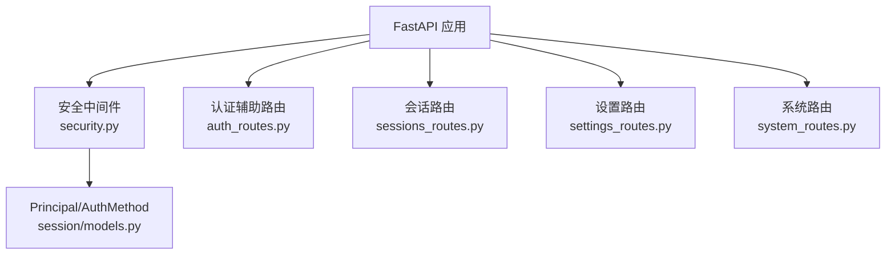
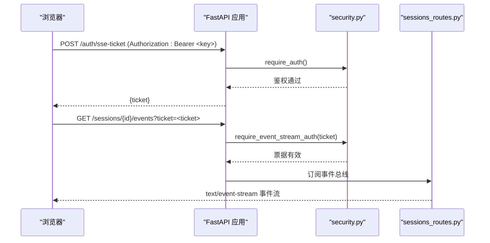

# 认证授权 API

<cite>
**本文引用的文件**
- [auth_routes.py](file://agent/src/api/auth_routes.py)
- [security.py](file://agent/src/api/security.py)
- [sessions_routes.py](file://agent/src/api/sessions_routes.py)
- [settings_routes.py](file://agent/src/api/settings_routes.py)
- [system_routes.py](file://agent/src/api/system_routes.py)
- [models.py](file://agent/src/session/models.py)
- [test_security_auth_api.py](file://agent/tests/test_security_auth_api.py)
</cite>

## 目录
1. [简介](#简介)
2. [项目结构](#项目结构)
3. [核心组件](#核心组件)
4. [架构总览](#架构总览)
5. [详细端点参考](#详细端点参考)
6. [依赖关系分析](#依赖关系分析)
7. [性能与可用性](#性能与可用性)
8. [故障排除指南](#故障排除指南)
9. [结论](#结论)
10. [附录：安全最佳实践](#附录：安全最佳实践)

## 简介
本文件面向需要对接或集成该项目的 REST API 的开发者，聚焦认证、授权与会话相关的 HTTP 端点。内容涵盖：
- 认证方式：基于 Bearer Token（API_AUTH_KEY）的单进程共享密钥认证；开发模式下对回环地址的信任访问；浏览器 EventSource 的一次性票据机制。
- 会话管理：创建/查询/更新/删除会话，发送消息、取消执行、SSE 事件流等。
- 权限控制：敏感接口强制鉴权；写操作需更强校验；跨站请求防护；DNS 重绑定防护。
- 令牌与票据：无传统 JWT；使用一次性 SSE 票据替代长生命周期密钥在 URL 中传播。
- 配置与设置：读取/更新 LLM 和数据源凭据的设置接口，受严格鉴权保护。
- 系统健康：存活与健康检查端点。

注意：本项目未实现“用户登录/登出”“JWT 刷新”等传统身份体系；当前以“共享密钥 + 回环信任 + 一次性票据”为核心。

## 项目结构
与安全相关的主要代码位于 agent/src/api 下：
- auth_routes.py：注册用于浏览器 EventSource 的一次性票据接口。
- security.py：统一的鉴权依赖、CORS/安全头、DNS 重绑定防护、SSE 票据、API Key 校验、本地/远程访问策略。
- sessions_routes.py：会话 CRUD、消息、目标（Goal）、SSE 事件流。
- settings_routes.py：LLM 与数据源设置读写。
- system_routes.py：系统健康、就绪探针。
- session/models.py：Principal、AuthMethod 等模型，描述“谁以何种方式被授权”。



图表来源
- [security.py:16-24](file://agent/src/api/security.py#L16-L24)
- [auth_routes.py:21-55](file://agent/src/api/auth_routes.py#L21-L55)
- [sessions_routes.py:320-370](file://agent/src/api/sessions_routes.py#L320-L370)
- [settings_routes.py:586-614](file://agent/src/api/settings_routes.py#L586-L614)
- [system_routes.py:235-266](file://agent/src/api/system_routes.py#L235-L266)
- [models.py:17-79](file://agent/src/session/models.py#L17-L79)

章节来源
- [security.py:1-670](file://agent/src/api/security.py#L1-L670)
- [auth_routes.py:1-56](file://agent/src/api/auth_routes.py#L1-L56)
- [sessions_routes.py:1-800](file://agent/src/api/sessions_routes.py#L1-L800)
- [settings_routes.py:1-690](file://agent/src/api/settings_routes.py#L1-L690)
- [system_routes.py:1-266](file://agent/src/api/system_routes.py#L1-L266)
- [models.py:1-342](file://agent/src/session/models.py#L1-L342)

## 核心组件
- 认证依赖
  - require_auth：通用鉴权，支持 Bearer Token 或回环信任（当未配置 API_AUTH_KEY）。
  - require_event_stream_auth：SSE 专用鉴权，支持 Bearer Token 或一次性 ticket。
  - require_local_or_auth：读设置时允许本地回环或鉴权通过。
  - require_settings_write_auth：写设置时要求更强的鉴权。
- Principal 与 AuthMethod
  - Principal(subject, auth_method, ...) 表示“谁被授权”，当前两种模式均不可归因到具体自然人（attributable=False）。
  - AuthMethod.SHARED_KEY / LOOPBACK_TRUST / FEDERATED_IDENTITY（预留）。
- CORS 与安全头
  - 默认仅允许本地回环来源；禁止带凭据的通配符；注入 CSP、X-Frame-Options、Permissions-Policy 等。
- DNS 重绑定防护
  - 拒绝来自本地客户端但 Host 不信任的请求，防止绕过鉴权。
- 访问日志脱敏
  - 自动脱敏 api_key= 与 ticket= 的值，避免泄露到日志。

章节来源
- [security.py:463-504](file://agent/src/api/security.py#L463-L504)
- [security.py:571-622](file://agent/src/api/security.py#L571-L622)
- [security.py:166-173](file://agent/src/api/security.py#L166-L173)
- [security.py:235-253](file://agent/src/api/security.py#L235-L253)
- [security.py:267-296](file://agent/src/api/security.py#L267-L296)
- [models.py:17-79](file://agent/src/session/models.py#L17-L79)

## 架构总览
下图展示一次典型的安全调用链：浏览器先通过带 Authorization 的请求获取一次性票据，再用票据连接 SSE；其他 API 直接携带 Bearer Token。



图表来源
- [auth_routes.py:46-55](file://agent/src/api/auth_routes.py#L46-L55)
- [security.py:591-622](file://agent/src/api/security.py#L591-L622)
- [sessions_routes.py:752-800](file://agent/src/api/sessions_routes.py#L752-L800)

## 详细端点参考

### 认证与票据
- POST /auth/sse-ticket
  - 方法：POST
  - 鉴权：require_auth（Bearer Token 或回环信任）
  - 用途：为浏览器 EventSource 生成一次性票据，有效期约 60 秒，首次使用后失效。
  - 请求体：无
  - 响应：包含 ticket 字段
  - 说明：票据通过 ?ticket= 传入 SSE 连接，避免将长生命周期密钥放入 URL。

- GET /sessions/{session_id}/events
  - 方法：GET
  - 鉴权：require_event_stream_auth（支持 Bearer Token 或 ticket）
  - 用途：SSE 事件流，用于实时接收会话事件。
  - 查询参数：Last-Event-ID（可选），replay（可选）
  - 响应：text/event-stream 事件流

- 其他所有会话与管理接口
  - 鉴权：require_auth（Bearer Token 或回环信任）
  - 说明：当配置了 API_AUTH_KEY 时，任何来源（包括回环）都必须提供正确 Bearer Token。

章节来源
- [auth_routes.py:21-55](file://agent/src/api/auth_routes.py#L21-L55)
- [security.py:571-622](file://agent/src/api/security.py#L571-L622)
- [sessions_routes.py:752-800](file://agent/src/api/sessions_routes.py#L752-L800)

### 会话管理
- POST /sessions
  - 方法：POST
  - 鉴权：require_auth
  - 请求体：title（可选）、config（可选）
  - 响应：SessionResponse（session_id、title、status、created_at、updated_at、last_attempt_id）
  - 说明：创建新会话并记录所有者 Principal。

- GET /sessions
  - 方法：GET
  - 鉴权：require_auth
  - 查询参数：limit（1..200，默认 50）
  - 响应：SessionResponse[]

- GET /sessions/{session_id}
  - 方法：GET
  - 鉴权：require_auth
  - 路径参数：session_id（经路径参数校验）
  - 响应：SessionResponse

- PATCH /sessions/{session_id}
  - 方法：PATCH
  - 鉴权：require_auth
  - 请求体：title（可选）
  - 响应：{status, session_id}

- DELETE /sessions/{session_id}
  - 方法：DELETE
  - 鉴权：require_auth
  - 响应：{status, session_id}

- POST /sessions/{session_id}/messages
  - 方法：POST
  - 鉴权：require_auth
  - 请求体：content（1..5000）
  - 响应：消息与尝试结果（由服务返回）

- POST /sessions/{session_id}/cancel
  - 方法：POST
  - 鉴权：require_auth
  - 响应：{status}（no_active_loop 或 cancelled）

- GET /sessions/{session_id}/messages
  - 方法：GET
  - 鉴权：require_auth
  - 查询参数：limit（1..1000，默认 100）
  - 响应：MessageResponse[]

- POST /sessions/{session_id}/goal
  - 方法：POST
  - 鉴权：require_auth
  - 请求体：objective、criteria、ui_summary、protocol、risk_tier、token_budget、turn_budget、time_budget_seconds
  - 响应：GoalSnapshotResponse

- GET /sessions/{session_id}/goal
  - 方法：GET
  - 鉴权：require_auth
  - 响应：GoalSnapshotResponse

- PATCH /sessions/{session_id}/goal
  - 方法：PATCH
  - 鉴权：require_auth
  - 请求体：goal_id、expected_goal_id、objective（可选）、ui_summary（可选）
  - 响应：UpdateGoalResponse

- POST /sessions/{session_id}/goal/evidence
  - 方法：POST
  - 鉴权：require_auth
  - 请求体：goal_id、expected_goal_id、text、criterion_id、claim_id、evidence_type、tool_call_id、run_id、source_provider、source_type、source_uri、symbol_universe、benchmark、timeframe、method、assumptions、artifact_path、artifact_hash、data_as_of、confidence、caveat、contradicts_claim_ids
  - 响应：AddGoalEvidenceResponse

- PATCH /sessions/{session_id}/goal/status
  - 方法：PATCH
  - 鉴权：require_auth
  - 请求体：goal_id、expected_goal_id、status、audit[]、recap（可选）
  - 响应：UpdateGoalStatusResponse

- POST /sessions/{session_id}/title/auto
  - 方法：POST
  - 鉴权：require_auth
  - 响应：{status, session_id, title}

章节来源
- [sessions_routes.py:28-164](file://agent/src/api/sessions_routes.py#L28-L164)
- [sessions_routes.py:335-800](file://agent/src/api/sessions_routes.py#L335-L800)

### 设置与配置
- GET /settings/llm
  - 方法：GET
  - 鉴权：require_local_or_auth（本地回环或鉴权通过）
  - 响应：LLMSettingsResponse（provider、model_name、base_url、api_key_configured、providers 等）

- PUT /settings/llm
  - 方法：PUT
  - 鉴权：require_settings_write_auth（强鉴权）
  - 请求体：provider、model_name、base_url（可选）、api_key（可选）、clear_api_key（可选）、temperature、timeout_seconds、max_retries、reasoning_effort
  - 响应：LLMSettingsResponse

- POST /settings/llm/models
  - 方法：POST
  - 鉴权：require_settings_write_auth
  - 请求体：provider、base_url（可选）、api_key（可选）
  - 响应：LLMModelsResponse（models、source、warning_code）

- GET /settings/data-sources
  - 方法：GET
  - 鉴权：require_local_or_auth
  - 响应：DataSourceSettingsResponse

- PUT /settings/data-sources
  - 方法：PUT
  - 鉴权：require_settings_write_auth
  - 请求体：tushare_token（可选）、clear_tushare_token（可选）
  - 响应：DataSourceSettingsResponse

章节来源
- [settings_routes.py:31-120](file://agent/src/api/settings_routes.py#L31-L120)
- [settings_routes.py:513-690](file://agent/src/api/settings_routes.py#L513-L690)

### 系统健康
- GET /live
  - 方法：GET
  - 鉴权：无
  - 响应：HealthResponse（status、service、timestamp）

- GET /health
  - 方法：GET
  - 鉴权：无
  - 响应：同 /live

- GET /ready
  - 方法：GET
  - 鉴权：无
  - 响应：200 或 503（取决于 LLM 提供者是否可用）

章节来源
- [system_routes.py:39-44](file://agent/src/api/system_routes.py#L39-L44)
- [system_routes.py:242-266](file://agent/src/api/system_routes.py#L242-L266)

## 依赖关系分析
- 认证依赖统一在 security.py 中定义并通过 FastAPI Depends 挂载到各路由。
- 会话路由通过 host.require_auth 与 host.require_event_stream_auth 动态解析，保证测试可 monkeypatch。
- 设置路由区分读/写鉴权：读允许本地回环或鉴权通过；写必须强鉴权。
- Principal 与 AuthMethod 贯穿鉴权流程，用于审计与未来扩展（如联邦身份）。

```mermaid
graph LR
A["sessions_routes.py"] --> |Depends(require_auth)| B["security.py"]
C["settings_routes.py"] --> |Depends(require_local_or_auth / require_settings_write_auth)| B
D["auth_routes.py"] --> |Depends(require_auth)| B
B --> E["session/models.py<br/>Principal/AuthMethod"]
```

图表来源
- [sessions_routes.py:335-350](file://agent/src/api/sessions_routes.py#L335-L350)
- [settings_routes.py:586-614](file://agent/src/api/settings_routes.py#L586-L614)
- [auth_routes.py:21-55](file://agent/src/api/auth_routes.py#L21-L55)
- [security.py:571-622](file://agent/src/api/security.py#L571-L622)
- [models.py:17-79](file://agent/src/session/models.py#L17-L79)

章节来源
- [sessions_routes.py:320-370](file://agent/src/api/sessions_routes.py#L320-L370)
- [settings_routes.py:586-614](file://agent/src/api/settings_routes.py#L586-L614)
- [security.py:571-622](file://agent/src/api/security.py#L571-L622)
- [models.py:17-79](file://agent/src/session/models.py#L17-L79)

## 性能与可用性
- SSE 票据 TTL 约 60 秒，且一次性使用，降低票据泄露风险。
- 访问日志自动脱敏 api_key 与 ticket 值，避免敏感信息落盘。
- 健康/就绪探针可用于编排器探测服务状态与 LLM 可用性。
- 建议在生产环境启用 API_AUTH_KEY，关闭回环信任绕过。

[本节为通用指导，无需特定文件引用]

## 故障排除指南
常见错误与处理：
- 401 未认证
  - 原因：缺少或错误的 Bearer Token；SSE 票据无效或已过期。
  - 排查：确认 Authorization 头是否正确；确认票据是否来自 /auth/sse-ticket；确认未将长生命周期密钥放入 URL。
- 403 禁止
  - 原因：跨站请求被拒；Host 头不信任（DNS 重绑定防护）；非本地且未配置 API_AUTH_KEY。
  - 排查：检查 Origin/Sec-Fetch-Site；确保 Host 为可信回环主机；生产部署务必配置 API_AUTH_KEY。
- 400 参数错误
  - 原因：路径参数非法（如包含 .. 或换行）；设置项校验失败（如 temperature 范围）。
  - 排查：遵循路径参数白名单；按 Pydantic 模型约束提交。
- 501 功能未启用
  - 原因：会话运行时未启用。
  - 排查：确认后端会话服务已启动。

章节来源
- [security.py:463-504](file://agent/src/api/security.py#L463-L504)
- [security.py:591-622](file://agent/src/api/security.py#L591-L622)
- [sessions_routes.py:414-431](file://agent/src/api/sessions_routes.py#L414-L431)
- [settings_routes.py:637-651](file://agent/src/api/settings_routes.py#L637-L651)
- [test_security_auth_api.py:43-48](file://agent/tests/test_security_auth_api.py#L43-L48)
- [test_security_auth_api.py:138-195](file://agent/tests/test_security_auth_api.py#L138-L195)
- [test_security_auth_api.py:529-564](file://agent/tests/test_security_auth_api.py#L529-L564)

## 结论
本项目采用“共享密钥 + 回环信任 + 一次性票据”的轻量认证方案，适合本地开发与受限网络场景。生产部署应始终配置 API_AUTH_KEY，并配合 CORS、CSP、DNS 重绑定防护与日志脱敏，确保安全边界清晰。会话与设置接口均通过统一的鉴权依赖进行保护，便于集中管理与演进。

[本节为总结，无需特定文件引用]

## 附录：安全最佳实践
- 密码与密钥
  - 使用环境变量或安全存储保存 API_AUTH_KEY 与提供商密钥；不要硬编码到代码或 URL。
- CSRF 与跨站
  - 默认仅允许本地回环来源；禁止带凭据的通配符；服务端拒绝不安全跨站请求。
- 速率限制
  - 当前代码库未内置全局速率限制；建议在网关层或反向代理层实施。
- 审计日志
  - 访问日志已自动脱敏敏感查询参数；结合外部日志系统记录鉴权结果与关键操作。
- 最小权限
  - 写设置接口需强鉴权；SSE 票据一次性使用；路径参数严格校验，防止路径穿越。

[本节为通用指导，无需特定文件引用]