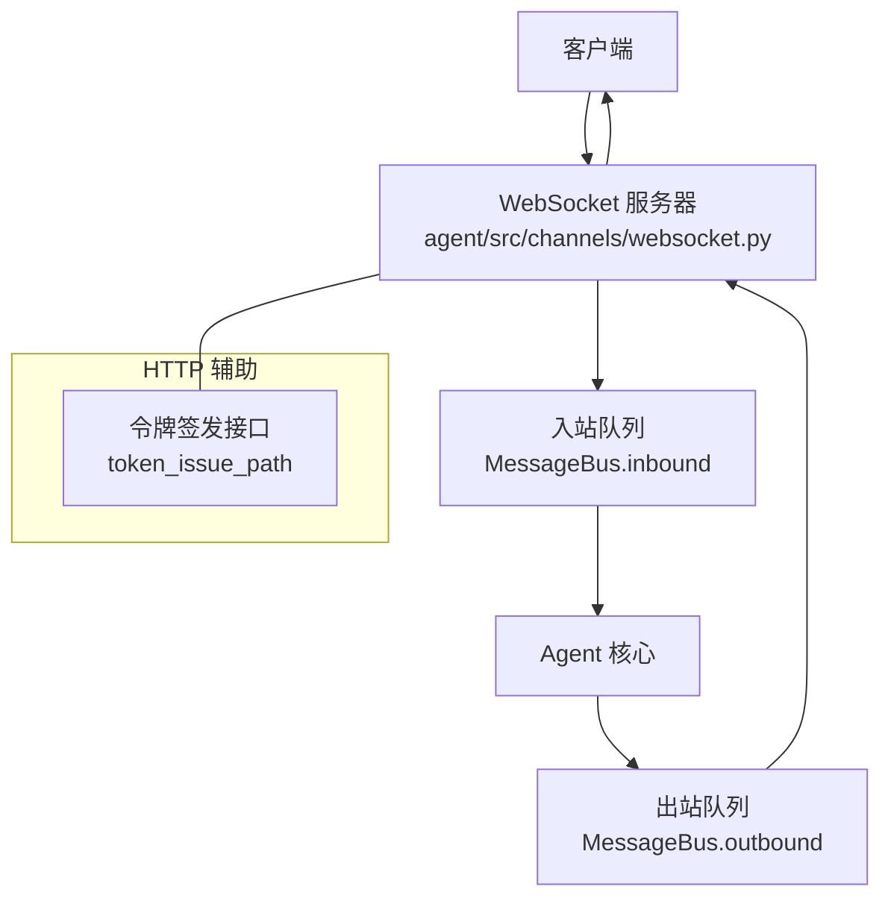
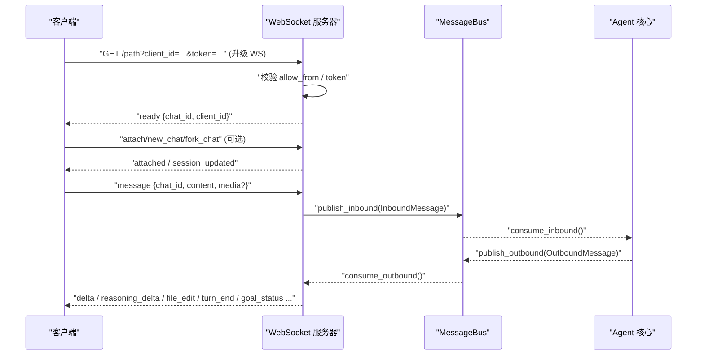
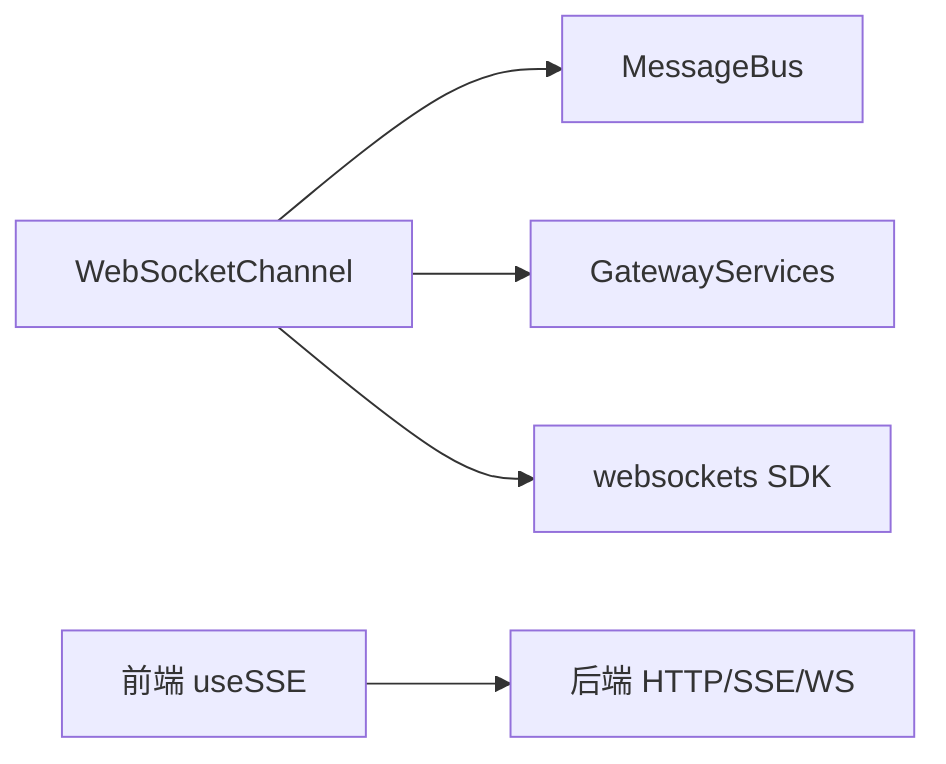

# WebSocket 实时通信

<cite>
**本文引用的文件**
- [agent/src/channels/websocket.py](file://agent/src/channels/websocket.py)
- [agent/src/channels/bus/queue.py](file://agent/src/channels/bus/queue.py)
- [agent/src/channels/bus/events.py](file://agent/src/channels/bus/events.py)
- [agent/src/channelsui/gateway_services.py](file://agent/src/channelsui/gateway_services.py)
- [frontend/src/hooks/useSSE.ts](file://frontend/src/hooks/useSSE.ts)
- [frontend/src/components/layout/ConnectionBanner.tsx](file://frontend/src/components/layout/ConnectionBanner.tsx)
</cite>

## 目录
1. [简介](#简介)
2. [项目结构](#项目结构)
3. [核心组件](#核心组件)
4. [架构总览](#架构总览)
5. [详细组件分析](#详细组件分析)
6. [依赖关系分析](#依赖关系分析)
7. [性能考虑](#性能考虑)
8. [故障排除指南](#故障排除指南)
9. [结论](#结论)
10. [附录：消息协议规范](#附录消息协议规范)

## 简介
本文件面向 Vibe-Trading 的 WebSocket 实时通信协议，覆盖连接建立、认证方式、连接生命周期管理、事件类型与消息格式、订阅/取消订阅机制、错误重连策略、JSON 协议版本与扩展、客户端实现示例、性能优化技巧以及调试与排障方法。目标是帮助开发者稳定、可靠地集成并维护基于 WebSocket 的实时数据流。

## 项目结构
WebSocket 服务端由 channels 模块中的 websocket 通道实现，负责监听 WS 端口、处理握手鉴权、路由入站消息、维护会话与订阅、广播出站事件。消息通过 MessageBus 在通道与 Agent 核心之间解耦传递。前端使用 SSE（Server-Sent Events）进行实时事件消费，并在 UI 中提供重连提示。

图表来源
- [agent/src/channels/websocket.py:447-527](file://agent/src/channels/websocket.py#L447-L527)
- [agent/src/channels/bus/queue.py:8-43](file://agent/src/channels/bus/queue.py#L8-L43)

章节来源
- [agent/src/channels/websocket.py:53-94](file://agent/src/channels/websocket.py#L53-L94)
- [agent/src/channels/bus/queue.py:8-43](file://agent/src/channels/bus/queue.py#L8-L43)

## 核心组件
- WebSocketChannel：WS 服务主体，负责启动、鉴权、连接循环、入站信封解析、出站事件广播、媒体处理、工作区范围控制等。
- WebSocketConfig：配置模型，包含主机、端口、路径、令牌、SSL、消息大小限制、心跳间隔等。
- MessageBus：异步消息总线，承载入站/出站消息队列，解耦通道与 Agent。
- GatewayServices：为 WebSocketChannel 提供 HTTP 路由、令牌签发、媒体签名、转录、工作区等能力。

章节来源
- [agent/src/channels/websocket.py:264-365](file://agent/src/channels/websocket.py#L264-L365)
- [agent/src/channels/websocket.py:53-94](file://agent/src/channels/websocket.py#L53-L94)
- [agent/src/channels/bus/queue.py:8-43](file://agent/src/channels/bus/queue.py#L8-L43)
- [agent/src/channelsui/gateway_services.py:17-255](file://agent/src/channelsui/gateway_services.py#L17-L255)

## 架构总览
下图展示从客户端到服务端再到 Agent 核心与返回流的完整时序，包括握手鉴权、订阅与会话初始化、消息收发与事件推送。

图表来源
- [agent/src/channels/websocket.py:396-453](file://agent/src/channels/websocket.py#L396-L453)
- [agent/src/channels/websocket.py:530-589](file://agent/src/channels/websocket.py#L530-L589)
- [agent/src/channels/websocket.py:671-828](file://agent/src/channels/websocket.py#L671-L828)
- [agent/src/channels/websocket.py:873-1204](file://agent/src/channels/websocket.py#L873-L1204)
- [agent/src/channels/bus/queue.py:8-43](file://agent/src/channels/bus/queue.py#L8-L43)

## 详细组件分析

### 连接建立与认证
- 连接参数
  - URL 形如 ws://{host}:{port}{path}?client_id=...&token=...
  - 支持 Unix Socket 或 TCP；可启用 WSS（需同时配置证书与私钥）。
  - 最大消息体大小、ping 间隔与超时均可配置。
- 认证方式
  - 静态 token：若配置了 token，则必须携带匹配的 token 才能握手成功。
  - 短效 token：通过配置的 token_issue_path 以 HTTP GET 获取 {"token","expires_in"}，再用于 WS 握手。
  - 可选强制要求 token：websocket_requires_token=True 时，即使未配置静态 token，也必须提供有效短效 token。
  - 来源白名单：allow_from 控制允许的来源标识（client_id）。
- 握手流程
  - process_request 识别 WS 升级请求，校验 allow_from 后进入授权逻辑。
  - 授权通过后发送 ready 帧，包含默认 chat_id 与 client_id。
  - 随后建立连接循环，接收并分发消息。

章节来源
- [agent/src/channels/websocket.py:53-94](file://agent/src/channels/websocket.py#L53-L94)
- [agent/src/channels/websocket.py:396-453](file://agent/src/channels/websocket.py#L396-L453)
- [agent/src/channels/websocket.py:447-527](file://agent/src/channels/websocket.py#L447-L527)
- [agent/src/channels/websocket.py:530-558](file://agent/src/channels/websocket.py#L530-L558)

### 连接生命周期管理
- 启动：start() 根据配置选择 serve/unix_serve，设置 max_size、ping_interval、ping_timeout，创建停止事件与 server task。
- 连接接入：_connection_loop 发送 ready，注册默认 chat_id 并自动订阅，随后进入消息循环。
- 断开清理：异常或关闭时执行 _cleanup_connection，移除所有订阅映射，释放资源。
- 停止：stop() 触发停止事件，等待 server task 结束，清空内部状态。

章节来源
- [agent/src/channels/websocket.py:447-527](file://agent/src/channels/websocket.py#L447-L527)
- [agent/src/channels/websocket.py:530-589](file://agent/src/channels/websocket.py#L530-L589)
- [agent/src/channels/websocket.py:841-860](file://agent/src/channels/websocket.py#L841-L860)

### 事件订阅与多会话
- 会话绑定
  - new_chat：创建新 chat_id，持久化工作区范围，发送 attached 与 session_updated，并回放活跃目标状态。
  - attach：将当前连接附加到指定 chat_id，发送 attached 并回放状态。
  - fork_chat：分叉会话（交由专用处理器）。
- 订阅与广播
  - 内部维护 chat_id -> connections 与 connection -> chat_ids 的双向映射，确保断连时 O(1) 清理。
  - 出站消息按 chat_id fan-out 给所有订阅连接。

章节来源
- [agent/src/channels/websocket.py:303-351](file://agent/src/channels/websocket.py#L303-L351)
- [agent/src/channels/websocket.py:671-743](file://agent/src/channels/websocket.py#L671-L743)
- [agent/src/channels/websocket.py:873-987](file://agent/src/channels/websocket.py#L873-L987)

### 入站消息与媒体处理
- 信封解析
  - 新式信封：{"type":"..."} 优先匹配，否则回退为纯文本或兼容字段 content/text/message。
  - 支持的 type：new_chat、fork_chat、attach、set_workspace_scope、transcribe_audio、message。
- 媒体上传
  - 仅接受 data_url 形式的图片/视频，严格 MIME 白名单与数量/大小上限。
  - 失败时清理已写入的临时文件，避免半残留。
- 工作区范围
  - 对敏感操作（new_chat、message 等）调用工作区范围解析器，拒绝越权访问并返回 error。

章节来源
- [agent/src/channels/websocket.py:164-212](file://agent/src/channels/websocket.py#L164-L212)
- [agent/src/channels/websocket.py:593-659](file://agent/src/channels/websocket.py#L593-L659)
- [agent/src/channels/websocket.py:671-828](file://agent/src/channels/websocket.py#L671-L828)

### 出站事件与流式更新
- 消息与增量
  - message：完整回复，可能附带 media/media_urls、reply_to、latency_ms、tool_events、agent_ui、kind（progress/tool_hint）。
  - delta：增量片段，配合 stream_id 与 stream_end 完成流式拼接。
  - reasoning_delta/reasoning_end：推理过程增量与结束标记。
  - file_edit：文件编辑事件列表。
  - turn_end：一轮对话结束，含 latency_ms 与 goal_state。
  - goal_status/goal_state：目标状态与运行中提示。
  - session_updated：会话刷新通知。
  - runtime_model_updated：运行时模型变更广播。
- 传输安全
  - 所有发送均通过 _safe_send_to，捕获 ConnectionClosed 并清理连接。

章节来源
- [agent/src/channels/websocket.py:873-1204](file://agent/src/channels/websocket.py#L873-L1204)

### 错误与重连策略
- 服务端错误
  - 握手失败：401 Unauthorized（token 无效或缺失）。
  - 来源禁止：403 Forbidden（不在 allow_from）。
  - 业务错误：error 事件，detail 包含具体原因（如 invalid chat_id、missing content、image_rejected 等）。
- 客户端重连
  - 前端通过 SSE 状态机与重试逻辑，显示“重连中”横幅，达到阈值后建议刷新页面。
  - 建议在客户端实现指数退避与最大重试次数，避免雪崩。

章节来源
- [agent/src/channels/websocket.py:396-453](file://agent/src/channels/websocket.py#L396-L453)
- [agent/src/channels/websocket.py:671-828](file://agent/src/channels/websocket.py#L671-L828)
- [frontend/src/hooks/useSSE.ts:85-120](file://frontend/src/hooks/useSSE.ts#L85-L120)
- [frontend/src/components/layout/ConnectionBanner.tsx:1-43](file://frontend/src/components/layout/ConnectionBanner.tsx#L1-L43)

## 依赖关系分析
- WebSocketChannel 依赖：
  - MessageBus：入站/出站消息队列，解耦通道与 Agent。
  - GatewayServices：HTTP 路由、令牌签发、媒体签名、转录、工作区等。
  - websockets SDK：serve/unix_serve、ServerConnection、WsRequest。
- 前端依赖：
  - useSSE：订阅已知事件类型，处理 lastEventId 与错误。
  - ConnectionBanner：展示重连状态与手动刷新入口。

图表来源
- [agent/src/channels/websocket.py:264-365](file://agent/src/channels/websocket.py#L264-L365)
- [agent/src/channels/bus/queue.py:8-43](file://agent/src/channels/bus/queue.py#L8-L43)
- [agent/src/channelsui/gateway_services.py:17-255](file://agent/src/channelsui/gateway_services.py#L17-L255)
- [frontend/src/hooks/useSSE.ts:85-120](file://frontend/src/hooks/useSSE.ts#L85-L120)

章节来源
- [agent/src/channels/websocket.py:264-365](file://agent/src/channels/websocket.py#L264-L365)
- [agent/src/channels/bus/queue.py:8-43](file://agent/src/channels/bus/queue.py#L8-L43)
- [agent/src/channelsui/gateway_services.py:17-255](file://agent/src/channelsui/gateway_services.py#L17-L255)
- [frontend/src/hooks/useSSE.ts:85-120](file://frontend/src/hooks/useSSE.ts#L85-L120)

## 性能考虑
- 批量与去重
  - 流式增量：使用 stream_id 聚合 delta，直到 stream_end 合并输出，减少渲染抖动。
  - 订阅集快照：发送前复制订阅集合，避免并发断连导致的迭代异常。
- 内存管理
  - 媒体限制：单条消息最多 4 张图片、1 个视频，单图/视频上限分别约 8MB/20MB，整体受 max_message_bytes 约束。
  - 缓冲区：stream_text_buffers 按 (chat_id, stream_id) 键存储增量，结束时清理。
- 网络与 I/O
  - ping_interval/ping_timeout 保持连接活性，防止中间设备超时断开。
  - 大消息限制：max_message_bytes 默认约 36MB，防止 DoS。
- 日志与观测
  - 关键路径记录 warning/debug，便于定位慢路径与异常。

章节来源
- [agent/src/channels/websocket.py:214-239](file://agent/src/channels/websocket.py#L214-L239)
- [agent/src/channels/websocket.py:53-94](file://agent/src/channels/websocket.py#L53-L94)
- [agent/src/channels/websocket.py:1085-1122](file://agent/src/channels/websocket.py#L1085-L1122)
- [agent/src/channels/websocket.py:873-987](file://agent/src/channels/websocket.py#L873-L987)

## 故障排除指南
- 握手失败
  - 检查是否配置了静态 token 或启用了 token_issue_path，并确保请求携带有效 token。
  - 确认 allow_from 包含 client_id。
- 消息被拒
  - 检查 chat_id 是否符合正则（UUID 或短键），content 是否为字符串且非空。
  - 媒体上传失败会返回 image_rejected，reason 包含 decode/mime/size/malformed/too_many_images/too_many_videos。
- 无订阅者
  - 若无连接订阅该 chat_id，服务端会记录 debug/warning 并丢弃消息；请确认 attach/new_chat 已正确执行。
- 前端重连
  - 观察 ConnectionBanner 的重连计数，超过阈值建议刷新页面。
  - 使用浏览器开发者工具查看网络面板，确认 WS/SSE 连接与事件流。

章节来源
- [agent/src/channels/websocket.py:396-453](file://agent/src/channels/websocket.py#L396-L453)
- [agent/src/channels/websocket.py:671-828](file://agent/src/channels/websocket.py#L671-L828)
- [agent/src/channels/websocket.py:873-987](file://agent/src/channels/websocket.py#L873-L987)
- [frontend/src/components/layout/ConnectionBanner.tsx:1-43](file://frontend/src/components/layout/ConnectionBanner.tsx#L1-L43)

## 结论
Vibe-Trading 的 WebSocket 通道提供了安全的握手鉴权、灵活的会话与订阅模型、丰富的出站事件与流式更新能力，并通过 MessageBus 与 Agent 核心解耦。结合严格的媒体限制、心跳保活与完善的错误处理，能够满足高可靠实时通信需求。前端通过 SSE 与 UI 组件提供友好的重连体验。建议在生产环境启用 WSS 与短效令牌，合理配置 allow_from 与消息大小限制，以实现安全与性能的平衡。

## 附录：消息协议规范

### 连接参数
- 地址：ws://{host}:{port}{path} 或 wss://{host}:{port}{path}（启用 SSL）
- 查询参数：
  - client_id：来源标识，用于 allow_from 校验。
  - token：静态 token 或短效 token（来自 token_issue_path）。
- 可选：
  - unix_socket_path：本地进程内通信。
  - path/token_issue_path：WS 升级路径与令牌签发路径（二者不可相同）。

章节来源
- [agent/src/channels/websocket.py:53-94](file://agent/src/channels/websocket.py#L53-L94)
- [agent/src/channels/websocket.py:396-453](file://agent/src/channels/websocket.py#L396-L453)

### 握手与就绪
- 服务端响应：
  - event: "ready"
  - chat_id：默认会话 ID
  - client_id：来源标识

章节来源
- [agent/src/channels/websocket.py:530-558](file://agent/src/channels/websocket.py#L530-L558)

### 入站信封（客户端 -> 服务端）
- 通用结构：
  - type：必需，字符串，表示操作类型。
  - 其他字段随 type 变化。
- 类型定义：
  - new_chat：创建新会话，可选 workspace scope。
  - fork_chat：分叉会话。
  - attach：附加到已有 chat_id。
  - set_workspace_scope：设置工作区范围。
  - transcribe_audio：音频转录。
  - message：发送消息，支持 content 与 media。
- 兼容模式：
  - 非信封帧会被解析为纯文本或兼容字段 content/text/message。

章节来源
- [agent/src/channels/websocket.py:164-212](file://agent/src/channels/websocket.py#L164-L212)
- [agent/src/channels/websocket.py:671-828](file://agent/src/channels/websocket.py#L671-L828)

### 出站事件（服务端 -> 客户端）
- 控制事件：
  - attached：会话已附加。
  - session_updated：会话刷新，scope 可为 thread/metadata 等。
  - goal_status：目标状态（running/idle），running 时可带 started_at。
  - goal_state：目标状态快照。
  - runtime_model_updated：运行时模型变更，含 model_name/model_preset。
  - error：错误事件，detail 与 reason 描述问题。
- 消息与流：
  - message：完整回复，可含 media/media_urls、reply_to、latency_ms、tool_events、agent_ui、kind。
  - delta：增量片段，配合 stream_id 与 stream_end。
  - reasoning_delta/reasoning_end：推理增量与结束。
  - file_edit：文件编辑事件列表。
  - turn_end：一轮结束，含 latency_ms 与 goal_state。

章节来源
- [agent/src/channels/websocket.py:873-1204](file://agent/src/channels/websocket.py#L873-L1204)

### 版本号与扩展
- 当前协议以信封 type 区分操作，向后兼容旧式文本帧。
- 扩展点：
  - metadata 字段可用于通道无关的结构化 UI 负载（OUTBOUND_META_AGENT_UI）。
  - stream_id 用于关联增量流。
  - kind 用于区分 activity/answer/tool_hint/progress 等渲染语义。

章节来源
- [agent/src/channels/bus/events.py:8-18](file://agent/src/channels/bus/events.py#L8-L18)
- [agent/src/channels/websocket.py:951-997](file://agent/src/channels/websocket.py#L951-L997)

### 客户端实现示例（步骤）
- 建立连接
  - 构造 ws:// 或 wss:// 地址，附带 client_id 与 token。
  - 监听 ready 事件，获取默认 chat_id。
- 会话管理
  - 如需多会话，发送 attach/new_chat 并处理 attached/session_updated。
- 发送消息
  - 使用信封 {"type":"message","chat_id":...,"content":...}，可选 media。
- 处理事件
  - 订阅 delta/reasoning_delta/file_edit/turn_end/goal_status 等事件。
  - 使用 stream_id 聚合增量，遇到 stream_end 合并输出。
- 错误与重连
  - 捕获 error 事件，根据 detail/reason 提示用户。
  - 实现指数退避重连，达到最大重试后建议刷新页面。

章节来源
- [agent/src/channels/websocket.py:396-453](file://agent/src/channels/websocket.py#L396-L453)
- [agent/src/channels/websocket.py:530-589](file://agent/src/channels/websocket.py#L530-L589)
- [agent/src/channels/websocket.py:671-828](file://agent/src/channels/websocket.py#L671-L828)
- [agent/src/channels/websocket.py:873-1204](file://agent/src/channels/websocket.py#L873-L1204)
- [frontend/src/hooks/useSSE.ts:85-120](file://frontend/src/hooks/useSSE.ts#L85-L120)
- [frontend/src/components/layout/ConnectionBanner.tsx:1-43](file://frontend/src/components/layout/ConnectionBanner.tsx#L1-L43)