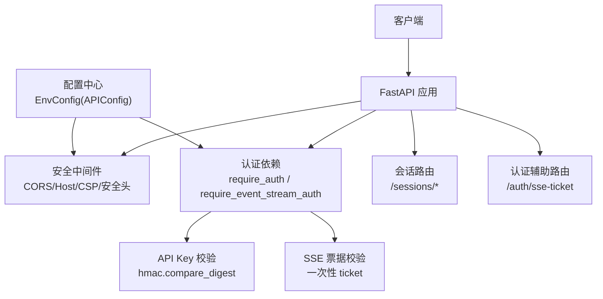
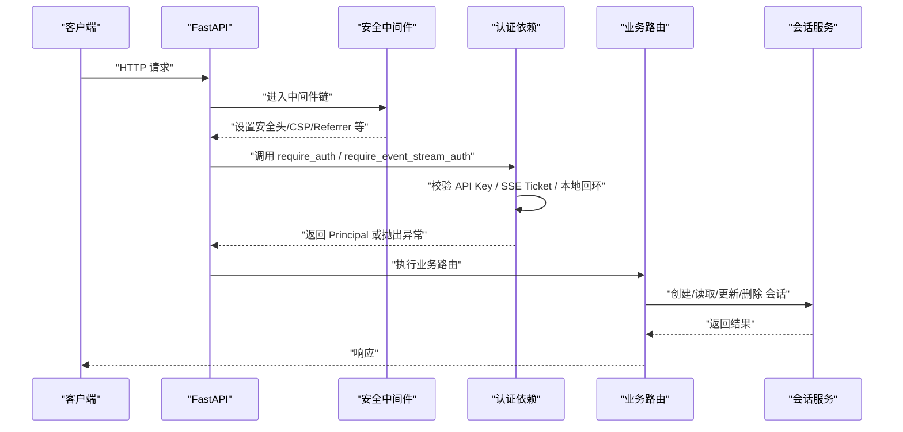
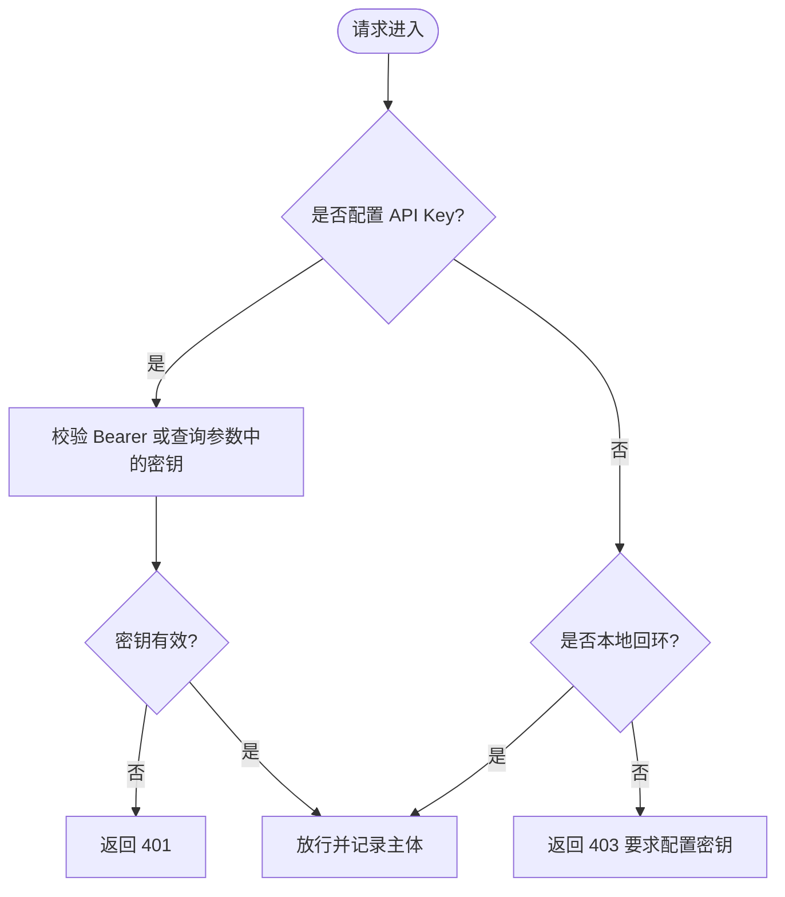
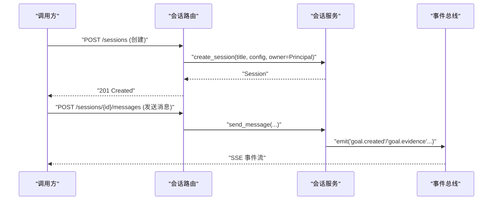
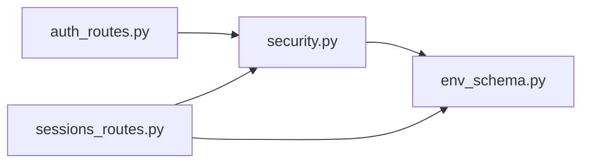

# 认证与安全机制

<cite>
**本文引用的文件**
- [security.py](file://agent/src/api/security.py)
- [auth_routes.py](file://agent/src/api/auth_routes.py)
- [sessions_routes.py](file://agent/src/api/sessions_routes.py)
- [env_schema.py](file://agent/src/config/env_schema.py)
- [models.py](file://agent/src/session/models.py)
- [SECURITY.md](file://SECURITY.md)
</cite>

## 目录
1. [简介](#简介)
2. [项目结构](#项目结构)
3. [核心组件](#核心组件)
4. [架构总览](#架构总览)
5. [详细组件分析](#详细组件分析)
6. [依赖关系分析](#依赖关系分析)
7. [性能与可用性考虑](#性能与可用性考虑)
8. [故障排查指南](#故障排查指南)
9. [结论](#结论)
10. [附录：环境变量与安全配置清单](#附录环境变量与安全配置清单)

## 简介
本文件系统化说明 Vibe-Trading API 的认证与安全机制，覆盖支持的认证方式、安全配置项、请求校验与防护、会话管理、最佳实践、常见威胁防护以及审计日志实现。目标是帮助开发者正确配置和使用安全功能，保护应用免受安全威胁。

## 项目结构
Vibe-Trading 的安全能力集中在 API 层与配置层：
- 认证与访问控制：位于 API 安全模块，提供 Bearer Token（API Key）验证、SSE 票据、跨站请求防护、CORS/Host 白名单、安全响应头等。
- 路由挂载：认证辅助路由用于为浏览器 EventSource 签发一次性票据；会话路由通过依赖注入复用统一鉴权。
- 配置中心：集中定义所有环境变量及其默认值，包括 API 密钥、CORS、主机白名单、CSP 模式、Shell 工具开关等。
- 会话模型：定义主体 Principal、认证方法枚举及会话/消息/尝试的数据模型，用于记录“谁以何种方式被授权”。

图表来源
- [security.py:147-253](file://agent/src/api/security.py#L147-L253)
- [security.py:343-622](file://agent/src/api/security.py#L343-L622)
- [auth_routes.py:21-56](file://agent/src/api/auth_routes.py#L21-L56)
- [sessions_routes.py:320-370](file://agent/src/api/sessions_routes.py#L320-L370)
- [env_schema.py:326-375](file://agent/src/config/env_schema.py#L326-L375)

章节来源
- [security.py:1-670](file://agent/src/api/security.py#L1-L670)
- [auth_routes.py:1-56](file://agent/src/api/auth_routes.py#L1-L56)
- [sessions_routes.py:289-802](file://agent/src/api/sessions_routes.py#L289-L802)
- [env_schema.py:326-375](file://agent/src/config/env_schema.py#L326-L375)

## 核心组件
- 认证依赖与策略
  - 基于 HTTP Bearer 的 API Key 认证：使用常量时间比较防止时序攻击。
  - SSE 票据认证：浏览器无法发送 Authorization 头时，先换取一次性 ticket，再用于事件流连接。
  - 本地回环信任：未配置 API Key 时允许本地回环来源，非本地必须提供密钥。
  - 跨站请求拒绝：对非安全方法与可疑 Origin/sec-fetch-site 进行拦截。
- 安全头与内容安全策略
  - 强制 CSP（或 Report-Only），限制脚本/样式/连接来源，禁止嵌套框架。
  - 附加 X-Content-Type-Options、X-Frame-Options、Permissions-Policy、Referrer-Policy。
- CORS 与 Host 白名单
  - 支持基础回环源与可叠加的额外来源；禁止在启用凭据时使用通配符。
  - 本地 Host 白名单与 DNS 重绑定防护。
- 访问日志脱敏
  - 自动对查询参数中的敏感字段（如 api_key、ticket）进行脱敏，避免泄露到日志。
- 会话与主体
  - Principal 记录认证方式与是否可归因；当前共享密钥与回环信任均不可归因到具体自然人。

章节来源
- [security.py:166-253](file://agent/src/api/security.py#L166-L253)
- [security.py:300-341](file://agent/src/api/security.py#L300-L341)
- [security.py:343-622](file://agent/src/api/security.py#L343-L622)
- [models.py:17-119](file://agent/src/session/models.py#L17-L119)

## 架构总览
下图展示从请求进入 FastAPI 到认证、鉴权、再到会话处理的完整流程，并体现安全中间件的作用点。

图表来源
- [security.py:571-622](file://agent/src/api/security.py#L571-L622)
- [sessions_routes.py:366-393](file://agent/src/api/sessions_routes.py#L366-L393)
- [sessions_routes.py:752-800](file://agent/src/api/sessions_routes.py#L752-L800)

## 详细组件分析

### 认证方式与流程
- API Key（Bearer Token）
  - 通过 Authorization: Bearer <key> 传入。
  - 服务端使用 hmac.compare_digest 进行常量时间比较，避免时序侧信道。
  - 当未配置 API Key 时，仅允许本地回环来源；非本地来源将被拒绝。
- SSE 票据（EventSource 专用）
  - 浏览器先通过 POST /auth/sse-ticket 获取一次性 ticket（需已认证）。
  - 打开事件流时携带 ?ticket=，服务端消费后失效，防止重放。
  - 非浏览器仍可使用 Bearer Token。
- 本地回环信任
  - 未配置 API Key 时，来自 127.0.0.1/localhost 的请求可被信任。
  - 可选信任 Docker 网关地址，需显式开启。
- 跨站请求防护
  - 对非安全方法（GET/HEAD/OPTIONS 除外）检查 sec-fetch-site 与 Origin，拒绝跨站请求。
  - 严格匹配请求 Host 与 Origin 端口/协议。

图表来源
- [security.py:463-504](file://agent/src/api/security.py#L463-L504)
- [security.py:507-553](file://agent/src/api/security.py#L507-L553)
- [security.py:571-622](file://agent/src/api/security.py#L571-L622)

章节来源
- [security.py:343-622](file://agent/src/api/security.py#L343-L622)
- [auth_routes.py:21-56](file://agent/src/api/auth_routes.py#L21-L56)

### 安全配置与环境变量
- API 认证与别名
  - API_AUTH_KEY：主密钥字段。
  - VIBE_TRADING_API_KEY：兼容别名，若仅设置该别名会自动映射到 API_AUTH_KEY。
- CORS 与 Host
  - CORS_ORIGINS：替换默认回环源列表；不允许通配符（启用凭据时）。
  - VIBE_TRADING_EXTRA_CORS_ORIGINS：追加额外可信来源。
  - API_ALLOWED_HOSTS：扩展本地 Host 白名单。
  - VIBE_TRADING_MCP_ALLOWED_HOSTS：网络 MCP 传输的主机白名单。
- 其他安全开关
  - VIBE_TRADING_CSP_REPORT_ONLY：将 CSP 以 Report-Only 模式下发，便于灰度。
  - VIBE_TRADING_TRUST_DOCKER_LOOPBACK：信任 Docker 网关地址作为本地回环。
  - VIBE_TRADING_ENABLE_SHELL_TOOLS：显式启用 Shell 工具（默认关闭）。
  - ENABLE_SESSION_RUNTIME：控制会话运行时开关。

章节来源
- [env_schema.py:326-375](file://agent/src/config/env_schema.py#L326-L375)
- [env_schema.py:705-716](file://agent/src/config/env_schema.py#L705-L716)

### 输入校验与防护
- 路径参数校验
  - 会话路由对 session_id 等路径参数执行统一校验，防止非法字符与越界访问。
- 跨站请求伪造（CSRF）与同源策略
  - 通过拒绝跨站请求与严格 Origin/Host 匹配降低 CSRF/XSS 风险面。
  - CSP 限制脚本/样式/连接来源，禁止 frame-ancestors，减少点击劫持与注入。
- 日志脱敏
  - 访问日志中对 api_key、ticket 等查询参数值进行脱敏，避免敏感信息落盘。

章节来源
- [sessions_routes.py:344-360](file://agent/src/api/sessions_routes.py#L344-L360)
- [security.py:166-173](file://agent/src/api/security.py#L166-L173)
- [security.py:228-253](file://agent/src/api/security.py#L228-L253)
- [security.py:260-297](file://agent/src/api/security.py#L260-L297)

### 会话管理机制
- 会话创建与归属
  - 创建会话时记录 Principal（包含认证方式），用于后续审计与权限边界。
- 会话生命周期
  - 提供创建、列出、读取、更新、删除会话的 REST 接口。
  - 支持取消正在运行的代理循环。
- 事件流（SSE）
  - 通过 /sessions/{session_id}/events 推送事件，支持 Last-Event-ID 断线续传与回放。
  - 事件流认证支持 Bearer 或一次性 ticket。

图表来源
- [sessions_routes.py:366-393](file://agent/src/api/sessions_routes.py#L366-L393)
- [sessions_routes.py:732-763](file://agent/src/api/sessions_routes.py#L732-L763)
- [sessions_routes.py:752-800](file://agent/src/api/sessions_routes.py#L752-L800)

章节来源
- [sessions_routes.py:289-802](file://agent/src/api/sessions_routes.py#L289-L802)
- [models.py:142-198](file://agent/src/session/models.py#L142-L198)

### 权限控制与最小权限原则
- 写操作与敏感操作需要显式认证（例如设置写入、会话删除、消息发送）。
- 未配置 API Key 时，仅允许本地回环来源；生产环境务必配置密钥。
- 对浏览器事件流采用一次性 ticket，避免长寿命密钥出现在 URL 中。

章节来源
- [security.py:571-657](file://agent/src/api/security.py#L571-L657)
- [sessions_routes.py:335-800](file://agent/src/api/sessions_routes.py#L335-L800)

### 安全最佳实践
- 密码与密钥
  - 使用强随机 API Key，并通过环境变量注入；不要硬编码到代码或仓库。
  - 利用 VIBE_TRADING_API_KEY 别名保持 CLI 与服务端一致。
- 传输加密
  - 建议在反向代理/入口层启用 TLS 终止并设置 HSTS（应用内不直接设置 HSTS）。
- 存储安全
  - 避免在日志中输出密钥；系统已对部分查询参数进行脱敏。
  - 谨慎处理生成的策略代码执行环境，遵循最小权限与隔离原则。
- 前端安全
  - 使用 CSP 限制资源加载；仅在必要时放宽策略，优先使用 Report-Only 灰度。
- 权限最小化
  - 仅暴露必要接口；对写操作强制认证；对浏览器事件流使用一次性票据。

章节来源
- [SECURITY.md:23-28](file://SECURITY.md#L23-L28)
- [security.py:228-253](file://agent/src/api/security.py#L228-L253)
- [security.py:260-297](file://agent/src/api/security.py#L260-L297)

### 常见威胁与防护措施
- DNS 重绑定
  - 通过本地 Host 白名单与请求 Host 规范化，阻止恶意 Host 绕过本地信任。
- 跨站请求与 XSS
  - 拒绝跨站请求；CSP 限制脚本/样式/连接来源；禁止 frame-ancestors。
- 密钥泄露
  - 事件流使用一次性 ticket；访问日志对敏感查询参数脱敏。
- 生成代码执行风险
  - 回测子进程保留最小必要环境与只读数据凭证，不转发敏感密钥与开关。

章节来源
- [security.py:166-173](file://agent/src/api/security.py#L166-L173)
- [security.py:228-253](file://agent/src/api/security.py#L228-L253)
- [security.py:260-297](file://agent/src/api/security.py#L260-L297)
- [SECURITY.md:23-28](file://SECURITY.md#L23-L28)

### 安全审计与日志记录
- 访问日志脱敏
  - 对 uvicorn.access/error 日志添加过滤器，自动隐藏 api_key、ticket 等值。
- 会话审计
  - 会话创建时记录 Principal（含认证方式），便于追踪“如何被授权”。
- 目标证据与状态变更
  - 研究目标的证据追加与状态更新会触发事件，可用于审计与回溯。

章节来源
- [security.py:260-297](file://agent/src/api/security.py#L260-L297)
- [sessions_routes.py:366-393](file://agent/src/api/sessions_routes.py#L366-L393)
- [sessions_routes.py:437-630](file://agent/src/api/sessions_routes.py#L437-L630)

## 依赖关系分析
- 模块耦合
  - 安全模块为各路由提供统一的认证依赖；会话路由通过依赖注入复用 require_auth/require_event_stream_auth。
  - 配置模块集中管理环境变量，供安全模块与路由按需读取。
- 外部依赖
  - FastAPI/HTTPBearer 用于解析 Bearer Token。
  - Pydantic 用于配置校验与类型约束。
- 潜在循环依赖
  - 路由注册通过延迟导入 host 模块以避免启动期循环依赖。

图表来源
- [security.py:571-622](file://agent/src/api/security.py#L571-L622)
- [auth_routes.py:21-56](file://agent/src/api/auth_routes.py#L21-L56)
- [sessions_routes.py:320-370](file://agent/src/api/sessions_routes.py#L320-L370)
- [env_schema.py:326-375](file://agent/src/config/env_schema.py#L326-L375)

章节来源
- [security.py:571-622](file://agent/src/api/security.py#L571-L622)
- [auth_routes.py:21-56](file://agent/src/api/auth_routes.py#L21-L56)
- [sessions_routes.py:320-370](file://agent/src/api/sessions_routes.py#L320-L370)
- [env_schema.py:326-375](file://agent/src/config/env_schema.py#L326-L375)

## 性能与可用性考虑
- 票据有效期与清理
  - SSE 票据 TTL 较短且定期清理过期票据，降低内存占用与重放窗口。
- 常量时间比较
  - 使用 hmac.compare_digest 避免时序攻击带来的性能权衡。
- 事件流优化
  - 支持 Last-Event-ID 与回放，提升断线恢复效率。
- CSP 与中间件开销
  - 安全头与 CSP 计算轻量；Report-Only 模式便于灰度发布。

[本节为通用指导，无需特定文件引用]

## 故障排查指南
- 401 未认证
  - 检查 Authorization 头是否正确传递；确认 API Key 已配置且一致。
  - 浏览器事件流请确保先获取 ticket 并在 URL 中携带。
- 403 禁止访问
  - 检查 Origin/sec-fetch-site 是否被判定为跨站；确认 CORS 与 Host 白名单配置。
  - 未配置 API Key 时，仅允许本地回环来源。
- 404 会话不存在
  - 确认 session_id 有效；检查会话是否已被删除。
- 日志泄露风险
  - 确认已安装访问日志脱敏过滤器；避免自行打印敏感参数。

章节来源
- [security.py:463-504](file://agent/src/api/security.py#L463-L504)
- [security.py:571-622](file://agent/src/api/security.py#L571-L622)
- [sessions_routes.py:414-431](file://agent/src/api/sessions_routes.py#L414-L431)
- [security.py:260-297](file://agent/src/api/security.py#L260-L297)

## 结论
Vibe-Trading 的认证与安全机制围绕“密钥优先、本地回环兜底、浏览器事件流票据化”展开，配合严格的 CORS/Host 白名单、CSP 与安全响应头、访问日志脱敏与会话审计，形成端到端的安全闭环。生产部署应始终配置 API Key，启用最小权限与必要的白名单，结合反向代理的 TLS/HSTS，保障传输与运行安全。

[本节为总结性内容，无需特定文件引用]

## 附录：环境变量与安全配置清单
- API 认证
  - API_AUTH_KEY：API 密钥（必填于生产环境）。
  - VIBE_TRADING_API_KEY：兼容别名，自动映射到 API_AUTH_KEY。
- CORS 与 Host
  - CORS_ORIGINS：允许的浏览器来源（逗号分隔），禁用通配符。
  - VIBE_TRADING_EXTRA_CORS_ORIGINS：追加额外来源。
  - API_ALLOWED_HOSTS：扩展本地 Host 白名单。
  - VIBE_TRADING_MCP_ALLOWED_HOSTS：网络 MCP 传输主机白名单。
- 其他安全开关
  - VIBE_TRADING_CSP_REPORT_ONLY：CSP Report-Only 模式。
  - VIBE_TRADING_TRUST_DOCKER_LOOPBACK：信任 Docker 网关地址。
  - VIBE_TRADING_ENABLE_SHELL_TOOLS：启用 Shell 工具（默认关闭）。
  - ENABLE_SESSION_RUNTIME：启用会话运行时。

章节来源
- [env_schema.py:326-375](file://agent/src/config/env_schema.py#L326-L375)
- [env_schema.py:705-716](file://agent/src/config/env_schema.py#L705-L716)