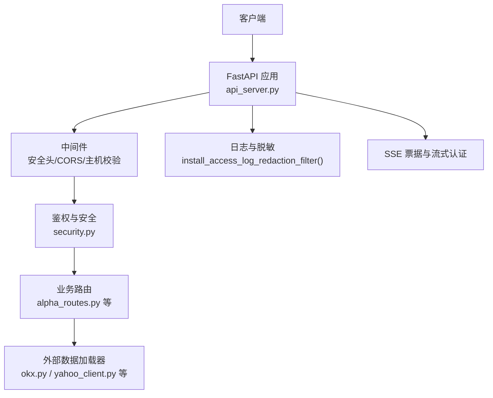
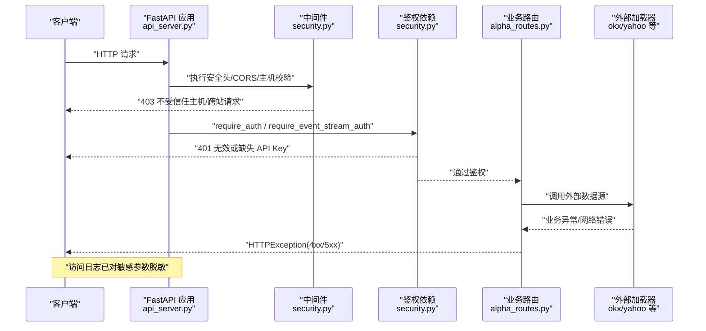
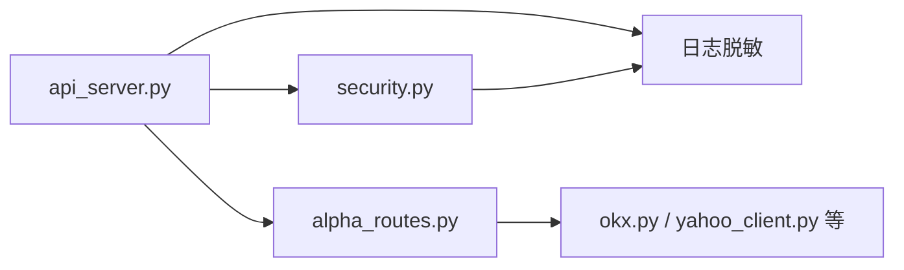

# 错误处理与调试

<cite>
**本文引用的文件**
- [api_server.py](file://agent/api_server.py)
- [security.py](file://agent/src/api/security.py)
- [models.py](file://agent/src/api/models.py)
- [alpha_routes.py](file://agent/src/api/alpha_routes.py)
- [websocket_logging.py](file://agent/src/channelsui/websocket_logging.py)
- [base.py](file://agent/backtest/loaders/base.py)
- [okx.py](file://agent/backtest/loaders/okx.py)
- [qveris_loader.py](file://agent/backtest/loaders/qveris_loader.py)
- [rsshub_events.py](file://agent/backtest/loaders/rsshub_events.py)
- [tickerall_loader.py](file://agent/backtest/loaders/tickerall_loader.py)
- [tushare_fundamentals.py](file://agent/backtest/loaders/tushare_fundamentals.py)
- [yahoo_client.py](file://agent/backtest/loaders/yahoo_client.py)
- [mcp_server.py](file://agent/mcp_server.py)
</cite>

## 目录
1. [简介](#简介)
2. [项目结构](#项目结构)
3. [核心组件](#核心组件)
4. [架构总览](#架构总览)
5. [详细组件分析](#详细组件分析)
6. [依赖关系分析](#依赖关系分析)
7. [性能考虑](#性能考虑)
8. [故障排除指南](#故障排除指南)
9. [结论](#结论)
10. [附录](#附录)

## 简介
本文件系统化说明 Vibe-Trading API 的错误处理与调试机制，覆盖统一错误响应格式、错误类型与状态码、异常捕获与传播、日志与追踪、监控告警建议、常见错误场景与解决方案，以及客户端最佳实践。目标是帮助开发者快速定位问题、稳定处理异常并提升整体健壮性。

## 项目结构
Vibe-Trading 的 API 基于 FastAPI 构建，错误处理贯穿以下层次：
- 应用层：FastAPI 应用启动、中间件注册、路由挂载
- 安全与认证：请求来源校验、CORS、安全头、SSE 票据、鉴权依赖
- 业务路由：各功能模块路由中抛出 HTTPException 或返回结构化响应
- 外部数据加载器：网络调用与第三方服务错误处理（重试、降级、错误分类）
- 日志与脱敏：访问日志敏感信息脱敏、WebSocket 日志桥接

图表来源
- [api_server.py:166-185](file://agent/api_server.py#L166-L185)
- [security.py:166-173](file://agent/src/api/security.py#L166-L173)
- [security.py:235-253](file://agent/src/api/security.py#L235-L253)
- [security.py:286-296](file://agent/src/api/security.py#L286-L296)

章节来源
- [api_server.py:166-185](file://agent/api_server.py#L166-L185)
- [security.py:166-173](file://agent/src/api/security.py#L166-L173)
- [security.py:235-253](file://agent/src/api/security.py#L235-L253)
- [security.py:286-296](file://agent/src/api/security.py#L286-L296)

## 核心组件
- 统一错误响应格式
  - 使用 FastAPI 的 HTTPException 抛出标准 JSON 错误体，包含 status_code 与 detail。对于文档化端点，可通过 models 中的 Pydantic 模型描述成功响应；错误响应遵循 FastAPI 默认结构。
  - 参考路径：[HTTPException 使用示例:392-406](file://agent/src/api/alpha_routes.py#L392-L406)
- 安全与鉴权错误
  - 未授权/禁止访问：401 无效或缺失 API Key；403 跨站请求被拒、不受信任的主机、非本地且未配置密钥
  - 参考路径：[require_auth / require_event_stream_auth:571-622](file://agent/src/api/security.py#L571-L622)
- 中间件错误
  - 不受信任的本地主机头：403
  - 参考路径：[_reject_untrusted_loopback_host:166-173](file://agent/src/api/security.py#L166-L173)
- 外部数据加载器错误
  - 自定义业务异常：NoAvailableSourceError、EventProviderError、DataProviderError
  - 网络错误分类：401 认证失败、429 限流、5xx 服务端错误、非 JSON 响应
  - 参考路径：[base.py NoAvailableSourceError:164-164](file://agent/backtest/loaders/base.py#L164-L164)、[okx.py 错误分支:298-308](file://agent/backtest/loaders/okx.py#L298-L308)、[qveris_loader.py 限流处理:270-270](file://agent/backtest/loaders/qveris_loader.py#L270-L270)、[yahoo_client.py 401 处理:340-340](file://agent/backtest/loaders/yahoo_client.py#L340-L340)
- 日志与脱敏
  - 访问日志中 api_key 与 ticket 参数值会被替换为占位符，避免泄露
  - WebSocket 日志桥接用于通道适配器
  - 参考路径：[install_access_log_redaction_filter:286-296](file://agent/src/api/security.py#L286-L296)、[websocket_logging.py:1-8](file://agent/src/channelsui/websocket_logging.py#L1-L8)

章节来源
- [alpha_routes.py:392-406](file://agent/src/api/alpha_routes.py#L392-L406)
- [security.py:166-173](file://agent/src/api/security.py#L166-L173)
- [security.py:286-296](file://agent/src/api/security.py#L286-L296)
- [base.py:164-164](file://agent/backtest/loaders/base.py#L164-L164)
- [okx.py:298-308](file://agent/backtest/loaders/okx.py#L298-L308)
- [qveris_loader.py:270-270](file://agent/backtest/loaders/qveris_loader.py#L270-L270)
- [yahoo_client.py:340-340](file://agent/backtest/loaders/yahoo_client.py#L340-L340)
- [websocket_logging.py:1-8](file://agent/src/channelsui/websocket_logging.py#L1-L8)

## 架构总览
下图展示请求从进入 FastAPI 到返回响应的错误处理流程，包括中间件、鉴权、路由与外部加载器的错误传播。

图表来源
- [api_server.py:166-185](file://agent/api_server.py#L166-L185)
- [security.py:166-173](file://agent/src/api/security.py#L166-L173)
- [security.py:571-622](file://agent/src/api/security.py#L571-L622)
- [alpha_routes.py:392-406](file://agent/src/api/alpha_routes.py#L392-L406)
- [okx.py:298-308](file://agent/backtest/loaders/okx.py#L298-L308)

## 详细组件分析

### 统一错误响应格式
- 错误体结构
  - 由 FastAPI 自动封装，包含 HTTP 状态码与 detail 字段。业务路由通过 raise HTTPException(status_code=..., detail="...") 返回。
  - 成功响应使用 Pydantic 模型（如 RunResponse），便于前端解析与校验。
- 关键实现位置
  - 路由中抛出 HTTPException：[alpha_routes.py:392-406](file://agent/src/api/alpha_routes.py#L392-L406)
  - 成功响应模型定义：[models.py:56-104](file://agent/src/api/models.py#L56-L104)

章节来源
- [alpha_routes.py:392-406](file://agent/src/api/alpha_routes.py#L392-L406)
- [models.py:56-104](file://agent/src/api/models.py#L56-L104)

### 鉴权与访问控制错误
- 401 无效或缺失 API Key
  - 当配置了 API_KEY 时，所有请求必须携带有效凭据；否则返回 401。
  - 事件流（SSE）支持一次性票据，防止密钥泄露。
  - 参考路径：[require_auth:571-588](file://agent/src/api/security.py#L571-L588)、[require_event_stream_auth:591-622](file://agent/src/api/security.py#L591-L622)
- 403 跨站请求/不受信任主机/非本地无密钥
  - 中间件拒绝不受信任的 Host 头与跨站浏览器请求。
  - 参考路径：[_reject_untrusted_loopback_host:166-173](file://agent/src/api/security.py#L166-L173)、[_validate_api_auth:463-504](file://agent/src/api/security.py#L463-L504)

章节来源
- [security.py:571-622](file://agent/src/api/security.py#L571-L622)
- [security.py:166-173](file://agent/src/api/security.py#L166-L173)
- [security.py:463-504](file://agent/src/api/security.py#L463-L504)

### 中间件与全局安全头
- 安全头策略
  - 设置 CSP、X-Content-Type-Options、X-Frame-Options、Permissions-Policy、Referrer-Policy。
  - 文档页面使用更宽松的策略以兼容 Swagger/ReDoc。
  - 参考路径：[_apply_security_headers:235-253](file://agent/src/api/security.py#L235-L253)
- 访问日志脱敏
  - 对 api_key 与 ticket 参数值进行脱敏，避免泄露。
  - 参考路径：[install_access_log_redaction_filter:286-296](file://agent/src/api/security.py#L286-L296)

章节来源
- [security.py:235-253](file://agent/src/api/security.py#L235-L253)
- [security.py:286-296](file://agent/src/api/security.py#L286-L296)

### 外部数据加载器错误处理
- 自定义业务异常
  - NoAvailableSourceError：无可用数据源
  - EventProviderError：事件提供者错误
  - DataProviderError：数据提供者错误
  - 参考路径：[base.py:164-164](file://agent/backtest/loaders/base.py#L164-L164)、[rsshub_events.py:65-65](file://agent/backtest/loaders/rsshub_events.py#L65-L65)、[tushare_fundamentals.py:13-13](file://agent/backtest/loaders/tushare_fundamentals.py#L13-L13)
- 网络错误分类与重试
  - OKX：对 429/5xx 进行警告与重试逻辑；非 JSON 响应记录警告
  - Yahoo：401 触发刷新或回退
  - TickerAll：特定状态码判断
  - QVERIS：429 限流特殊处理
  - 参考路径：[okx.py:298-308](file://agent/backtest/loaders/okx.py#L298-L308)、[yahoo_client.py:340-340](file://agent/backtest/loaders/yahoo_client.py#L340-L340)、[tickerall_loader.py:353-353](file://agent/backtest/loaders/tickerall_loader.py#L353-L353)、[qveris_loader.py:270-270](file://agent/backtest/loaders/qveris_loader.py#L270-L270)

章节来源
- [base.py:164-164](file://agent/backtest/loaders/base.py#L164-L164)
- [rsshub_events.py:65-65](file://agent/backtest/loaders/rsshub_events.py#L65-L65)
- [tushare_fundamentals.py:13-13](file://agent/backtest/loaders/tushare_fundamentals.py#L13-L13)
- [okx.py:298-308](file://agent/backtest/loaders/okx.py#L298-L308)
- [yahoo_client.py:340-340](file://agent/backtest/loaders/yahoo_client.py#L340-L340)
- [tickerall_loader.py:353-353](file://agent/backtest/loaders/tickerall_loader.py#L353-L353)
- [qveris_loader.py:270-270](file://agent/backtest/loaders/qveris_loader.py#L270-L270)

### 日志与调试工具
- 访问日志脱敏
  - 在 Uvicorn 启动前安装过滤器，确保敏感参数不落地日志。
  - 参考路径：[install_access_log_redaction_filter:286-296](file://agent/src/api/security.py#L286-L296)
- WebSocket 日志桥接
  - 为通道适配器提供专用日志器，便于隔离与检索。
  - 参考路径：[websocket_logging.py:1-8](file://agent/src/channelsui/websocket_logging.py#L1-L8)
- MCP 服务器错误响应
  - 针对无效主机头与不允许的来源返回明确文本错误。
  - 参考路径：[mcp_server.py:255-284](file://agent/mcp_server.py#L255-L284)

章节来源
- [security.py:286-296](file://agent/src/api/security.py#L286-L296)
- [websocket_logging.py:1-8](file://agent/src/channelsui/websocket_logging.py#L1-L8)
- [mcp_server.py:255-284](file://agent/mcp_server.py#L255-L284)

## 依赖关系分析
- 组件耦合
  - api_server.py 负责组装 FastAPI 应用、中间件与路由，低耦合地引入 security、models、helpers、state 等模块
  - security.py 提供通用鉴权与安全头，被多个路由复用
  - 各路由模块（如 alpha_routes.py）通过 HTTPException 向上抛出错误，由 FastAPI 统一处理
  - 外部加载器独立处理网络错误，并通过自定义异常或日志上报
- 潜在循环依赖
  - 当前结构清晰，未见明显循环导入；路由模块按需导入以避免启动时阻塞
- 外部依赖
  - FastAPI/Starlette：HTTPException、JSONResponse、静态文件服务
  - Uvicorn：WSGI 服务器与访问日志
  - 第三方数据源：OKX、Yahoo、TickerAll、QVERIS 等

图表来源
- [api_server.py:166-185](file://agent/api_server.py#L166-L185)
- [security.py:286-296](file://agent/src/api/security.py#L286-L296)
- [alpha_routes.py:392-406](file://agent/src/api/alpha_routes.py#L392-L406)
- [okx.py:298-308](file://agent/backtest/loaders/okx.py#L298-L308)

章节来源
- [api_server.py:166-185](file://agent/api_server.py#L166-L185)
- [security.py:286-296](file://agent/src/api/security.py#L286-L296)
- [alpha_routes.py:392-406](file://agent/src/api/alpha_routes.py#L392-L406)
- [okx.py:298-308](file://agent/backtest/loaders/okx.py#L298-L308)

## 性能考虑
- 错误处理开销
  - 中间件与鉴权在请求链路早期执行，尽早失败可减少后续计算成本
  - 外部加载器的重试与降级应避免无限重试，结合超时与指数退避
- 日志性能
  - 访问日志脱敏在过滤器中完成，注意在高吞吐场景下评估正则匹配开销
- 资源清理
  - SSE 票据定期清理过期项，避免内存增长

[本节为通用指导，无需具体文件引用]

## 故障排除指南
- 常见问题与解决
  - 401 无效或缺失 API Key
    - 检查是否配置 API_AUTH_KEY 并在请求中携带正确凭据
    - 事件流使用一次性票据，确保先获取 ticket 再连接
    - 参考路径：[security.py 鉴权:571-622](file://agent/src/api/security.py#L571-L622)
  - 403 跨站请求/不受信任主机
    - 确认 Origin/Host 头符合预期，避免 DNS 重绑定攻击
    - 参考路径：[security.py 中间件:166-173](file://agent/src/api/security.py#L166-L173)
  - 429 限流
    - 降低请求频率，实施指数退避重试
    - 参考路径：[qveris_loader.py:270-270](file://agent/backtest/loaders/qveris_loader.py#L270-L270)
  - 5xx 服务端错误
    - 检查外部服务健康状态，启用重试与熔断
    - 参考路径：[okx.py:298-308](file://agent/backtest/loaders/okx.py#L298-L308)
  - 401 认证失败（外部数据源）
    - 刷新令牌或重新登录
    - 参考路径：[yahoo_client.py:340-340](file://agent/backtest/loaders/yahoo_client.py#L340-L340)
- 调试方法
  - 查看脱敏后的访问日志，定位请求与错误上下文
  - 使用 WebSocket 日志桥接排查通道适配器问题
  - 参考路径：[security.py 日志脱敏:286-296](file://agent/src/api/security.py#L286-L296)、[websocket_logging.py:1-8](file://agent/src/channelsui/websocket_logging.py#L1-L8)

章节来源
- [security.py:571-622](file://agent/src/api/security.py#L571-L622)
- [security.py:166-173](file://agent/src/api/security.py#L166-L173)
- [qveris_loader.py:270-270](file://agent/backtest/loaders/qveris_loader.py#L270-L270)
- [okx.py:298-308](file://agent/backtest/loaders/okx.py#L298-L308)
- [yahoo_client.py:340-340](file://agent/backtest/loaders/yahoo_client.py#L340-L340)
- [security.py:286-296](file://agent/src/api/security.py#L286-L296)
- [websocket_logging.py:1-8](file://agent/src/channelsui/websocket_logging.py#L1-L8)

## 结论
Vibe-Trading API 采用 FastAPI 的标准错误模型，结合安全中间件与鉴权依赖，形成统一的错误处理体系。外部数据加载器通过自定义异常与网络错误分类，保障稳定性与可观测性。日志脱敏与 WebSocket 日志桥接提升了调试效率。建议在生产环境中完善监控与告警，结合重试与熔断策略，进一步提升系统韧性。

[本节为总结，无需具体文件引用]

## 附录
- 客户端错误处理最佳实践
  - 区分 4xx 与 5xx：4xx 提示用户修正输入或权限；5xx 触发重试与降级
  - 对 429 实施指数退避与最大重试次数限制
  - 对 401 引导重新认证或刷新令牌
  - 对 403 检查来源与主机头配置
  - 记录错误上下文（请求 ID、时间戳、端点、参数摘要）以便排查
- 监控与告警建议
  - 统计各状态码分布，设置阈值告警（如 5xx 突增、429 频繁）
  - 跟踪外部数据源可用性指标（延迟、错误率）
  - 审计鉴权失败与跨站请求拦截事件

[本节为通用指导，无需具体文件引用]