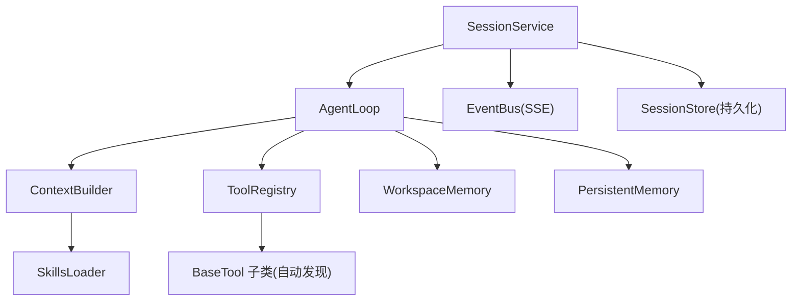
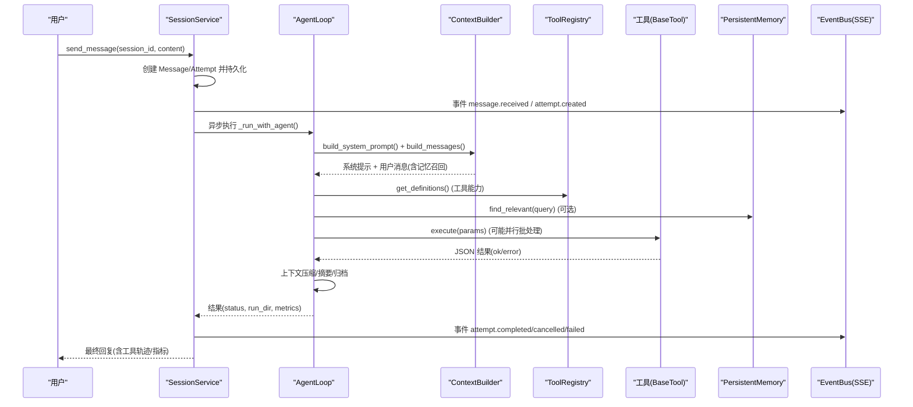
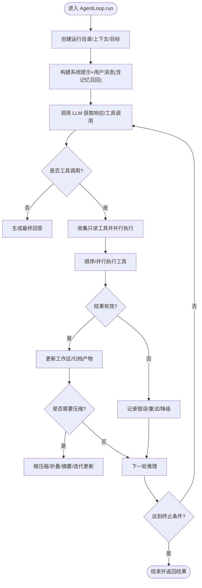
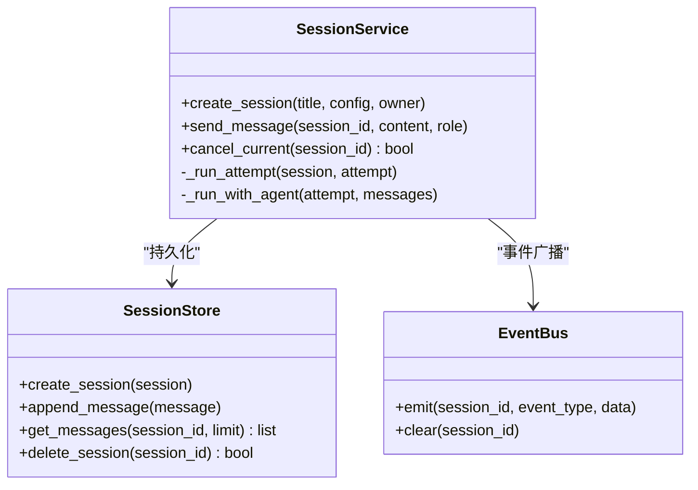
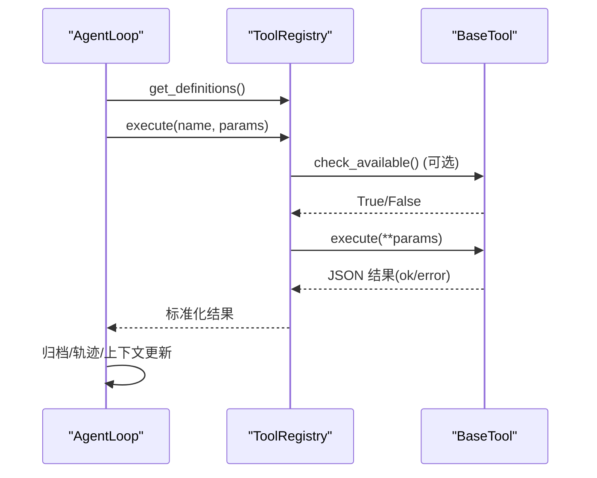
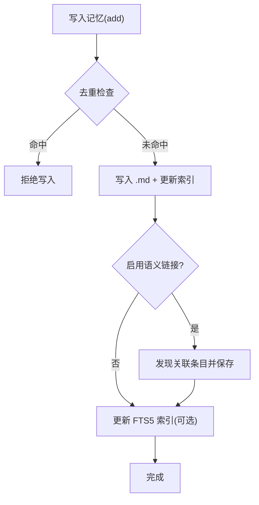
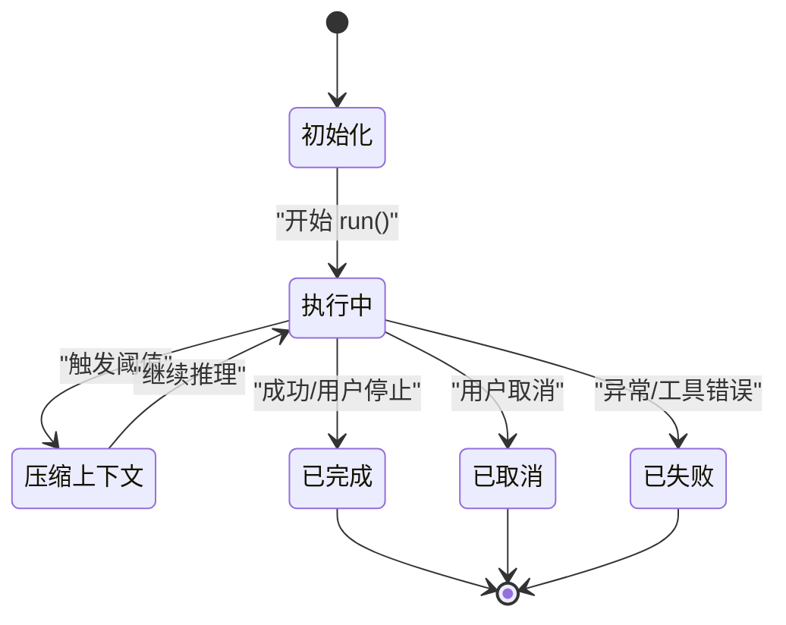
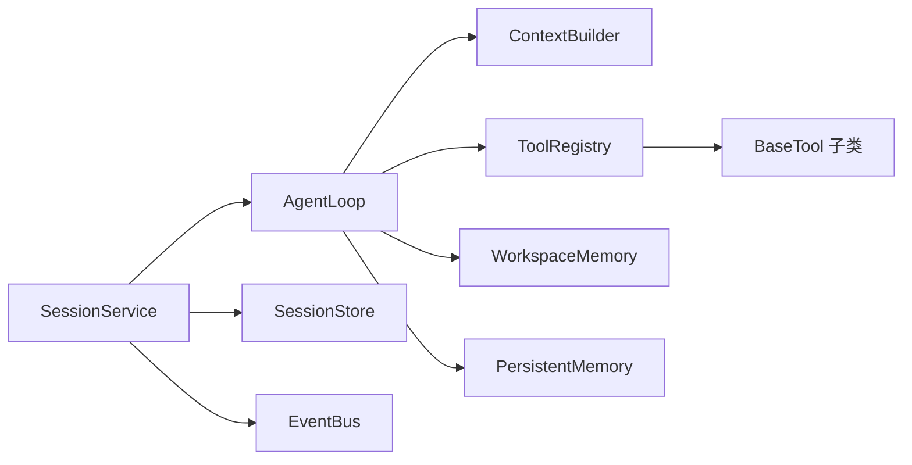

# Agent 核心系统

<cite>
**本文引用的文件**
- [loop.py](file://agent/src/agent/loop.py)
- [memory.py](file://agent/src/agent/memory.py)
- [tools.py](file://agent/src/agent/tools.py)
- [context.py](file://agent/src/agent/context.py)
- [persistent.py](file://agent/src/memory/persistent.py)
- [service.py](file://agent/src/session/service.py)
- [skills.py](file://agent/src/agent/skills.py)
- [__init__.py（工具注册）](file://agent/src/tools/__init__.py)
</cite>

## 目录
1. [简介](#简介)
2. [项目结构](#项目结构)
3. [核心组件](#核心组件)
4. [架构总览](#架构总览)
5. [详细组件分析](#详细组件分析)
6. [依赖关系分析](#依赖关系分析)
7. [性能考虑](#性能考虑)
8. [故障诊断指南](#故障诊断指南)
9. [结论](#结论)
10. [附录：扩展开发指南](#附录：扩展开发指南)

## 简介
本技术文档面向框架开发者与技术专家，系统性阐述 Agent 核心系统的实现与运行机制。重点覆盖：
- ReAct 模式（推理-行动-观察）的执行流程与上下文管理
- 会话管理与状态持久化、消息历史、事件总线
- 工具调用流程（注册、参数校验、执行调度、结果处理）
- 内存与上下文管理（短期工作区记忆、长期持久记忆、语义链接）
- Agent 循环生命周期（初始化、执行、终止、资源清理）
- 扩展开发指南（自定义工具、技能系统集成）
- 性能优化建议与故障诊断方法

## 项目结构
Agent 核心由以下关键模块组成：
- AgentLoop：ReAct 主循环，负责推理、工具调用、上下文压缩与结果归档
- ContextBuilder：构建系统提示词与消息历史，注入技能与工具描述
- ToolRegistry + BaseTool：工具基础设施与自动发现机制
- WorkspaceMemory：单次运行内的共享工作区状态
- PersistentMemory：跨会话的持久化记忆，支持关键词检索、重要性衰减、语义链接
- SessionService：会话生命周期编排，消息持久化、SSE 事件广播、尝试（Attempt）状态机
- SkillsLoader：技能加载与按需展开，提供 SKILL.md 的结构化导航

图表来源
- [service.py:158-440](file://agent/src/session/service.py#L158-L440)
- [loop.py:638-800](file://agent/src/agent/loop.py#L638-L800)
- [context.py:221-333](file://agent/src/agent/context.py#L221-L333)
- [tools.py:54-95](file://agent/src/agent/tools.py#L54-L95)
- [memory.py:13-54](file://agent/src/agent/memory.py#L13-L54)
- [persistent.py:200-654](file://agent/src/memory/persistent.py#L200-L654)
- [skills.py:100-189](file://agent/src/agent/skills.py#L100-L189)
- [__init__.py（工具注册）:66-245](file://agent/src/tools/__init__.py#L66-L245)

章节来源
- [service.py:158-440](file://agent/src/session/service.py#L158-L440)
- [loop.py:638-800](file://agent/src/agent/loop.py#L638-L800)
- [context.py:221-333](file://agent/src/agent/context.py#L221-L333)
- [tools.py:54-95](file://agent/src/agent/tools.py#L54-L95)
- [memory.py:13-54](file://agent/src/agent/memory.py#L13-L54)
- [persistent.py:200-654](file://agent/src/memory/persistent.py#L200-L654)
- [skills.py:100-189](file://agent/src/agent/skills.py#L100-L189)
- [__init__.py（工具注册）:66-245](file://agent/src/tools/__init__.py#L66-L245)

## 核心组件
- AgentLoop：实现 ReAct 主循环，维护五层上下文压缩策略（微压缩、折叠、LLM 摘要、显式压缩、迭代更新），并负责工具批处理执行、结果归档、使用量统计与可追溯性记录。
- ContextBuilder：组装系统提示词与用户消息，注入工具/技能描述、工作区状态摘要、持久化记忆快照，以及自动召回相关记忆。
- ToolRegistry + BaseTool：统一工具抽象与注册表，支持 OpenAI function calling 格式导出、异常安全执行与错误 JSON 返回。
- WorkspaceMemory：单 run 内共享状态（run_dir、计数器），用于跨工具调用的上下文保持。
- PersistentMemory：基于文件的跨会话记忆，支持去重、重要性衰减、FTS5 索引、语义链接、层级目录组织。
- SessionService：会话编排器，负责消息持久化、尝试（Attempt）状态机、SSE 事件广播、并发控制与取消。
- SkillsLoader：按类别分组展示技能摘要，按需加载完整文档，并提供结构化章节导航。

章节来源
- [loop.py:1-124](file://agent/src/agent/loop.py#L1-L124)
- [context.py:221-333](file://agent/src/agent/context.py#L221-L333)
- [tools.py:13-95](file://agent/src/agent/tools.py#L13-L95)
- [memory.py:13-54](file://agent/src/agent/memory.py#L13-L54)
- [persistent.py:200-654](file://agent/src/memory/persistent.py#L200-L654)
- [service.py:53-246](file://agent/src/session/service.py#L53-L246)
- [skills.py:100-189](file://agent/src/agent/skills.py#L100-L189)

## 架构总览
下图展示了从用户消息到 Agent 执行、工具调用、记忆存取、事件广播的端到端流程。

图表来源
- [service.py:158-440](file://agent/src/session/service.py#L158-L440)
- [loop.py:638-800](file://agent/src/agent/loop.py#L638-L800)
- [context.py:246-333](file://agent/src/agent/context.py#L246-L333)
- [tools.py:68-84](file://agent/src/agent/tools.py#L68-L84)
- [persistent.py:362-455](file://agent/src/memory/persistent.py#L362-L455)

## 详细组件分析

### ReAct 循环（推理-行动-观察）
- 初始化：创建运行目录、GroundingLedger、ContextBuilder、目标上下文；准备事件回调与追踪。
- 消息构建：系统提示包含输出原则、工具/技能描述、当前日期、工作区状态摘要；用户消息可注入相关记忆。
- 推理-行动-观察：
  - 推理：根据系统提示与历史生成下一步动作（文本或工具调用）。
  - 行动：通过 ToolRegistry.execute 调用具体工具，支持只读工具并行批处理。
  - 观察：解析工具结果，判断成功/失败，必要时归档回测产物、更新工作区状态。
- 上下文压缩：
  - 微压缩：清理旧工具结果，保留最近 N 条
  - 折叠：对长文本块进行首尾保留、中间折叠
  - LLM 摘要：分块序列化消息，调用模型生成结构化摘要
  - 显式压缩：模型主动调用 compact 工具触发摘要
  - 迭代更新：第 N 次压缩时增量更新前序摘要而非重建
- 终止条件：达到最大迭代次数、内容过滤跳过上限、用户取消、工具链错误或业务终止信号。

图表来源
- [loop.py:638-800](file://agent/src/agent/loop.py#L638-L800)
- [loop.py:307-400](file://agent/src/agent/loop.py#L307-L400)
- [loop.py:812-881](file://agent/src/agent/loop.py#L812-L881)

章节来源
- [loop.py:638-800](file://agent/src/agent/loop.py#L638-L800)
- [loop.py:307-400](file://agent/src/agent/loop.py#L307-L400)
- [loop.py:812-881](file://agent/src/agent/loop.py#L812-L881)

### 会话管理机制
- 会话创建/查询/删除：SessionService 负责持久化与会话搜索索引。
- 消息历史：每次发送消息都会追加到 Store，并按字符预算裁剪历史以控制输入成本。
- 尝试（Attempt）状态机：running → completed/cancelled/failed，状态变更通过事件总线广播。
- 并发控制：每个会话仅允许一个 in-flight 运行，防止消息交错；任务级取消支持早期释放占用。
- 事件总线：message.received、attempt.created/started/completed/cancelled/failed 等事件供 UI/客户端订阅。

图表来源
- [service.py:53-246](file://agent/src/session/service.py#L53-L246)
- [service.py:248-440](file://agent/src/session/service.py#L248-L440)

章节来源
- [service.py:53-246](file://agent/src/session/service.py#L53-L246)
- [service.py:248-440](file://agent/src/session/service.py#L248-L440)

### 工具调用流程
- 工具注册：
  - 自动发现：扫描 src/tools 包下所有 BaseTool 子类，缓存子类列表
  - 白名单/过滤：支持构建指定工具子集或 Swarm 隔离环境
  - MCP 集成：在本地工具之后追加远程工具，独立服务器容错
- 参数验证与执行：
  - ToolRegistry.execute 保证返回合法 JSON，捕获异常并转为错误对象
  - 支持只读工具并行批处理以提升吞吐
- 结果处理：
  - 成功判定：解析 JSON status/ok/success 字段
  - 归档：将成功的回测产物复制到活跃运行目录，确保可追溯
  - 轨迹：记录 tool_call/tool_result 事件，形成工具轨迹

图表来源
- [__init__.py（工具注册）:66-245](file://agent/src/tools/__init__.py#L66-L245)
- [tools.py:54-95](file://agent/src/agent/tools.py#L54-L95)
- [loop.py:542-636](file://agent/src/agent/loop.py#L542-L636)

章节来源
- [__init__.py（工具注册）:66-245](file://agent/src/tools/__init__.py#L66-L245)
- [tools.py:54-95](file://agent/src/agent/tools.py#L54-L95)
- [loop.py:542-636](file://agent/src/agent/loop.py#L542-L636)

### 内存与上下文管理
- 短期记忆（WorkspaceMemory）：
  - 单 run 内共享状态，包含 run_dir 与工具调用计数
  - 生成状态摘要注入系统提示，帮助 LLM 记住当前工作
- 长期记忆（PersistentMemory）：
  - 文件存储，支持 frontmatter 元数据、质量评分、访问计数、重要性衰减
  - 关键词检索（FTS5 优先，回退到 token 扫描）、语义链接扩展
  - 去重窗口防止重复写入，层级目录组织便于分类
- 语义链接：
  - 新增条目时自动发现关联条目并保存关系
  - 检索时可扩展相关条目提升召回质量
- 上下文注入：
  - 系统提示中注入持久化记忆快照
  - 用户消息前自动插入相关记忆片段

图表来源
- [persistent.py:457-595](file://agent/src/memory/persistent.py#L457-L595)
- [persistent.py:362-455](file://agent/src/memory/persistent.py#L362-L455)
- [context.py:246-333](file://agent/src/agent/context.py#L246-L333)

章节来源
- [memory.py:13-54](file://agent/src/agent/memory.py#L13-L54)
- [persistent.py:200-654](file://agent/src/memory/persistent.py#L200-L654)
- [context.py:246-333](file://agent/src/agent/context.py#L246-L333)

### Agent 循环生命周期
- 初始化：
  - 创建运行目录、GroundingLedger、ContextBuilder、目标上下文
  - 配置事件回调、追踪、使用量统计
- 执行：
  - 构建消息、调用 LLM、执行工具、压缩上下文、归档产物
- 终止：
  - 达到最大迭代次数、内容过滤跳过上限、用户取消、工具链错误
- 资源清理：
  - 释放会话占用、关闭事件通道、清理临时文件、记录运行清单

图表来源
- [loop.py:638-800](file://agent/src/agent/loop.py#L638-L800)
- [service.py:248-440](file://agent/src/session/service.py#L248-L440)

章节来源
- [loop.py:638-800](file://agent/src/agent/loop.py#L638-L800)
- [service.py:248-440](file://agent/src/session/service.py#L248-L440)

## 依赖关系分析
- AgentLoop 依赖：
  - ContextBuilder（系统提示与消息构建）
  - ToolRegistry（工具能力与执行）
  - WorkspaceMemory（工作区状态）
  - PersistentMemory（跨会话记忆）
  - GroundingLedger（可追溯性记录）
  - RunStateStore（运行目录与请求记录）
- SessionService 依赖：
  - SessionStore（会话/消息持久化）
  - EventBus（SSE 事件）
  - AgentLoop（执行引擎）
  - ChatLLM（模型调用）
- 工具注册依赖：
  - BaseTool 子类自动发现
  - MCP 服务器配置（可选）
  - 安全策略（shell 工具开关、活券商具门控）

图表来源
- [loop.py:638-800](file://agent/src/agent/loop.py#L638-L800)
- [service.py:158-440](file://agent/src/session/service.py#L158-L440)
- [__init__.py（工具注册）:66-245](file://agent/src/tools/__init__.py#L66-L245)

章节来源
- [loop.py:638-800](file://agent/src/agent/loop.py#L638-L800)
- [service.py:158-440](file://agent/src/session/service.py#L158-L440)
- [__init__.py（工具注册）:66-245](file://agent/src/tools/__init__.py#L66-L245)

## 性能考虑
- 上下文压缩：
  - 微压缩与折叠零 API 成本，减少输入长度
  - LLM 摘要分块序列化，避免截断消息，尾部预算保护
- 工具执行：
  - 只读工具并行批处理，提升吞吐
  - 超时与重试策略，避免长时间阻塞
- 记忆检索：
  - FTS5 索引优先，回退 token 扫描，确保可用性
  - 重要性衰减与访问奖励，提高相关性排序
- 历史裁剪：
  - 按字符预算裁剪历史，保留关键路径信息
- 资源限制：
  - 会话并发限制（每会话一个运行）
  - 线程池限制（最多 4 个 Agent 实例）

章节来源
- [loop.py:307-400](file://agent/src/agent/loop.py#L307-L400)
- [loop.py:812-881](file://agent/src/agent/loop.py#L812-L881)
- [persistent.py:362-455](file://agent/src/memory/persistent.py#L362-L455)
- [service.py:32-33](file://agent/src/session/service.py#L32-L33)
- [service.py:650-699](file://agent/src/session/service.py#L650-L699)

## 故障诊断指南
- 常见问题定位：
  - 工具不可用：检查 check_available 返回值与依赖安装
  - MCP 连接失败：查看警告日志与事件通道中的 mcp.warning
  - 记忆写入失败：确认文件锁与权限，检查去重窗口
  - 会话忙冲突：等待当前尝试完成或调用 cancel_current
- 调试手段：
  - 启用追踪：查看 run_manifest.json 与 trace.jsonl
  - 事件订阅：监听 SSE 事件了解执行阶段
  - 日志级别：调整 logger 输出以获取更多细节
- 恢复策略：
  - 上下文压缩后修复工具调用/结果配对
  - 失败尝试标记为 failed/cancelled，允许重试
  - 归档产物复制确保可追溯性

章节来源
- [loop.py:345-400](file://agent/src/agent/loop.py#L345-L400)
- [loop.py:1006-1061](file://agent/src/agent/loop.py#L1006-L1061)
- [service.py:227-246](file://agent/src/session/service.py#L227-L246)
- [persistent.py:41-73](file://agent/src/memory/persistent.py#L41-L73)

## 结论
本系统通过清晰的模块化设计与严格的上下文管理，实现了稳定高效的 ReAct Agent 执行流程。工具注册与执行机制具备高可扩展性，记忆系统兼顾短期与长期需求，会话服务提供可靠的并发控制与事件驱动架构。结合性能优化与故障诊断能力，适合在生产环境中部署与扩展。

## 附录：扩展开发指南
- 自定义工具开发：
  - 继承 BaseTool，实现 execute 方法，定义 name/description/parameters
  - 可选实现 check_available 以声明依赖
  - 通过自动发现机制注册，无需手动修改注册表
- 技能系统集成：
  - 在 skills/ 目录下创建 SKILL.md，编写结构化文档
  - 使用 load_skill 按需加载完整文档，支持章节导航
  - 通过 ContextBuilder 注入技能描述，引导模型正确调用
- 最佳实践：
  - 工具结果应返回标准 JSON，包含 status/ok/success 字段
  - 避免在工具中直接输出敏感信息，使用 redaction 工具脱敏
  - 合理使用工作区状态与持久化记忆，避免上下文污染
  - 遵循系统提示中的输出原则，确保数据溯源与时效标注

章节来源
- [tools.py:13-52](file://agent/src/agent/tools.py#L13-L52)
- [skills.py:100-189](file://agent/src/agent/skills.py#L100-L189)
- [context.py:246-333](file://agent/src/agent/context.py#L246-L333)