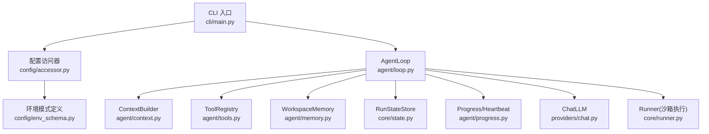
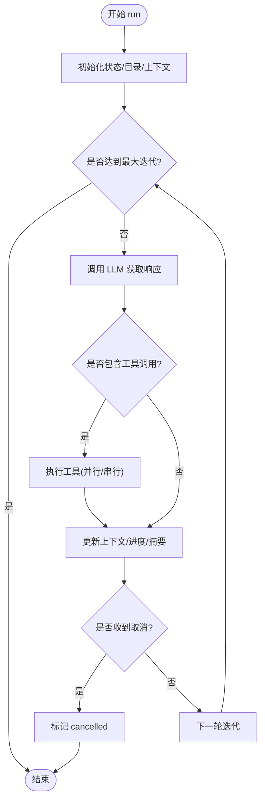
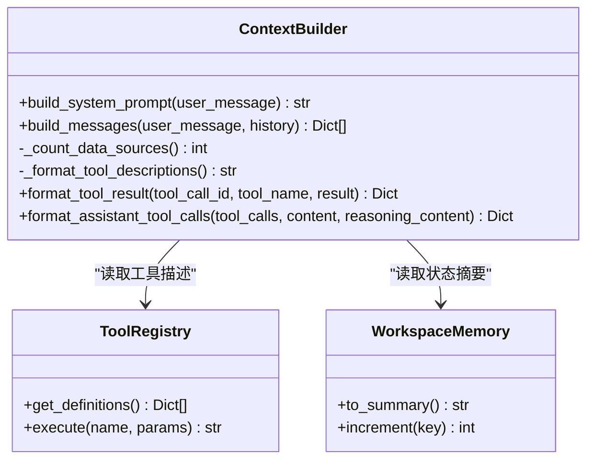
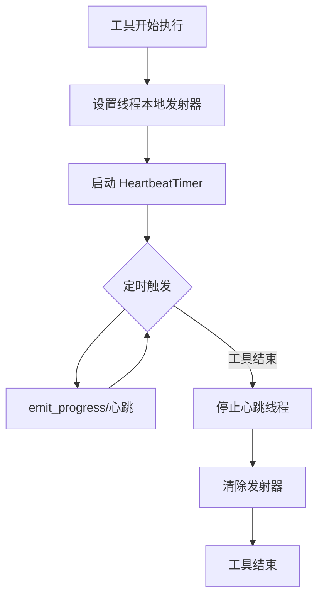
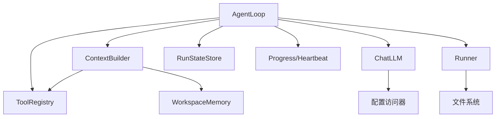

# Agent 生命周期管理

<cite>
**本文引用的文件**
- [loop.py](file://agent/src/agent/loop.py)
- [context.py](file://agent/src/agent/context.py)
- [progress.py](file://agent/src/agent/progress.py)
- [tools.py](file://agent/src/agent/tools.py)
- [memory.py](file://agent/src/agent/memory.py)
- [state.py](file://agent/src/core/state.py)
- [runner.py](file://agent/src/core/runner.py)
- [chat.py](file://agent/src/providers/chat.py)
- [accessor.py](file://agent/src/config/accessor.py)
- [env_schema.py](file://agent/src/config/env_schema.py)
- [main.py](file://agent/cli/main.py)
</cite>

## 目录
1. [简介](#简介)
2. [项目结构](#项目结构)
3. [核心组件](#核心组件)
4. [架构总览](#架构总览)
5. [详细组件分析](#详细组件分析)
6. [依赖关系分析](#依赖关系分析)
7. [性能考量](#性能考量)
8. [故障排查指南](#故障排查指南)
9. [结论](#结论)
10. [附录](#附录)

## 简介
本技术文档聚焦于 Agent 的生命周期管理，覆盖从初始化、依赖注入、配置加载、资源准备到执行流程控制（迭代管理、状态转换、异常处理）、资源管理机制（文件、网络、数据库连接等）、进度与心跳、生命周期事件、以及资源泄漏防护、优雅关闭与故障恢复等高级特性。目标是为运维工程师提供可操作、可排障、可优化的实践指南。

## 项目结构
Agent 生命周期由多个模块协作完成：
- 入口与装配：CLI 负责启动、环境探测与注册；配置层集中读取环境变量并缓存单例。
- 运行循环：AgentLoop 实现 ReAct 主循环，管理上下文压缩、工具调用批处理、状态持久化、取消与超时。
- 上下文构建：ContextBuilder 组装系统提示、工具/技能描述、记忆摘要与用户消息。
- 工具与执行：ToolRegistry 统一注册与执行工具；Runner 在沙箱中执行生成的回测脚本。
- 进度与心跳：ProgressEvent 与 HeartbeatTimer 提供结构化进度与保活心跳。
- 状态与资源：RunStateStore 管理运行目录与状态标记；WorkspaceMemory 维护单次运行的工作区状态。
- LLM 交互：ChatLLM 封装模型调用、流式响应、错误分类与重试策略。



**图表来源**
- [main.py:1-200](file://agent/cli/main.py#L1-L200)
- [accessor.py:52-76](file://agent/src/config/accessor.py#L52-L76)
- [env_schema.py:132-200](file://agent/src/config/env_schema.py#L132-L200)
- [loop.py:638-800](file://agent/src/agent/loop.py#L638-L800)
- [context.py:221-333](file://agent/src/agent/context.py#L221-L333)
- [tools.py:54-95](file://agent/src/agent/tools.py#L54-L95)
- [memory.py:13-54](file://agent/src/agent/memory.py#L13-L54)
- [state.py:13-87](file://agent/src/core/state.py#L13-L87)
- [progress.py:30-185](file://agent/src/agent/progress.py#L30-L185)
- [chat.py:52-163](file://agent/src/providers/chat.py#L52-L163)
- [runner.py:379-627](file://agent/src/core/runner.py#L379-L627)

**章节来源**
- [main.py:1-200](file://agent/cli/main.py#L1-L200)
- [accessor.py:52-76](file://agent/src/config/accessor.py#L52-L76)
- [env_schema.py:132-200](file://agent/src/config/env_schema.py#L132-L200)

## 核心组件
- AgentLoop：ReAct 主循环，负责迭代控制、上下文压缩、工具批处理、状态持久化、取消与超时、使用量统计与归档。
- ContextBuilder：构建系统提示与消息列表，注入工具/技能描述、记忆摘要、当前时间，支持跨会话记忆召回。
- ToolRegistry：工具注册与执行，统一返回 JSON 格式结果，捕获异常并标准化错误。
- WorkspaceMemory：单次运行内的共享状态（run_dir、计数器），用于上下文压缩时保留关键信息。
- RunStateStore：创建 run 目录、保存请求、标记成功/失败/取消，保证 state.json 原子写入。
- Runner：在沙箱环境中执行生成的回测脚本，限制环境变量、地址空间与文件描述符，收集日志与产物。
- Progress/Heartbeat：结构化进度事件与保活心跳，避免 UI 假死，支持工具内上报进度。
- ChatLLM：模型调用抽象，封装流式响应、内容过滤、错误分类与重试判断。

**章节来源**
- [loop.py:638-800](file://agent/src/agent/loop.py#L638-L800)
- [context.py:221-333](file://agent/src/agent/context.py#L221-L333)
- [tools.py:54-95](file://agent/src/agent/tools.py#L54-L95)
- [memory.py:13-54](file://agent/src/agent/memory.py#L13-L54)
- [state.py:13-87](file://agent/src/core/state.py#L13-L87)
- [runner.py:379-627](file://agent/src/core/runner.py#L379-L627)
- [progress.py:30-185](file://agent/src/agent/progress.py#L30-L185)
- [chat.py:52-163](file://agent/src/providers/chat.py#L52-L163)

## 架构总览
下图展示 Agent 生命周期中的关键交互：CLI 启动后加载配置，构造 AgentLoop；AgentLoop 初始化上下文、创建运行目录、设置 GroundingLedger、记录请求；进入 ReAct 循环，逐轮调用 LLM，解析工具调用，执行工具，更新上下文与进度，必要时压缩上下文；最终归档产物并标记状态。

```mermaid
sequenceDiagram
participant CLI as "CLI"
participant CFG as "配置访问器"
participant LOOP as "AgentLoop"
participant CTX as "ContextBuilder"
participant LLM as "ChatLLM"
participant REG as "ToolRegistry"
participant RST as "RunStateStore"
participant PRG as "Progress/Heartbeat"
participant RUN as "Runner"
CLI->>CFG : 获取配置单例
CLI->>LOOP : 构造并调用 run()
LOOP->>RST : 创建 run 目录/保存请求
LOOP->>CTX : 构建系统提示与消息
LOOP->>PRG : 设置线程本地发射器
loop 每次迭代
LOOP->>LLM : 发送消息(含工具定义)
LLM-->>LOOP : 文本或工具调用
alt 工具调用
LOOP->>REG : 执行工具(可能并行读)
REG-->>LOOP : JSON 结果/错误
LOOP->>PRG : 结构化进度/心跳
LOOP->>RUN : 必要时执行回测脚本(沙箱)
end
LOOP->>CTX : 压缩/折叠上下文
LOOP->>RST : 更新状态(成功/失败/取消)
end
LOOP-->>CLI : 返回执行结果
```

**图表来源**
- [main.py:1-200](file://agent/cli/main.py#L1-L200)
- [accessor.py:52-76](file://agent/src/config/accessor.py#L52-L76)
- [loop.py:638-800](file://agent/src/agent/loop.py#L638-L800)
- [context.py:221-333](file://agent/src/agent/context.py#L221-L333)
- [tools.py:54-95](file://agent/src/agent/tools.py#L54-L95)
- [state.py:13-87](file://agent/src/core/state.py#L13-L87)
- [progress.py:30-185](file://agent/src/agent/progress.py#L30-L185)
- [runner.py:379-627](file://agent/src/core/runner.py#L379-L627)
- [chat.py:52-163](file://agent/src/providers/chat.py#L52-L163)

## 详细组件分析

### AgentLoop 执行流程与状态机
- 初始化：接收 ToolRegistry、ChatLLM、可选 WorkspaceMemory、事件回调、最大迭代次数、持久化记忆。
- 运行入口 run：清理取消标志、创建/复用 run 目录、保存请求、初始化 GroundingLedger、构建 ContextBuilder、获取目标上下文。
- 迭代控制：五层上下文管理（微压缩、文本折叠、LLM 摘要、显式压缩工具、迭代更新）；工具调用批处理（只读并行）。
- 状态转换：通过 RunStateStore 标记 success/failed/cancelled；内部维护 _has_run、_called_ok、_previous_summary 等状态。
- 异常处理：工具执行异常被捕获并标准化为 JSON 错误；LLM 流式错误分类与重试；内容过滤跳过计数。
- 取消与超时：线程安全取消事件；工具超时、心跳间隔、推理增量间隔、流重试延迟均从配置读取。
- 产物归档：成功后复制回测产物到活跃 run；记录 LLM 用量至 llm_usage.json。



**图表来源**
- [loop.py:638-800](file://agent/src/agent/loop.py#L638-L800)
- [state.py:49-77](file://agent/src/core/state.py#L49-L77)
- [progress.py:123-185](file://agent/src/agent/progress.py#L123-L185)

**章节来源**
- [loop.py:638-800](file://agent/src/agent/loop.py#L638-L800)
- [state.py:13-87](file://agent/src/core/state.py#L13-L87)
- [progress.py:30-185](file://agent/src/agent/progress.py#L30-L185)

### 上下文构建与记忆注入
- 系统提示：固定输出原则、工具/技能描述、状态摘要、任务路由规则、当前时间。
- 记忆注入：若存在 PersistentMemory，按查询召回相关记忆并注入用户消息；快照在会话开始时冻结以稳定提示缓存。
- 工具描述：仅发送简短提示，完整参数 schema 通过 API tools 数组传递，降低 token 成本。
- 历史合并：将 history 追加到消息列表，形成 OpenAI 格式的消息序列。



**图表来源**
- [context.py:221-420](file://agent/src/agent/context.py#L221-L420)
- [tools.py:54-95](file://agent/src/agent/tools.py#L54-L95)
- [memory.py:13-54](file://agent/src/agent/memory.py#L13-L54)

**章节来源**
- [context.py:221-420](file://agent/src/agent/context.py#L221-L420)
- [memory.py:13-54](file://agent/src/agent/memory.py#L13-L54)

### 工具执行与沙箱隔离
- 工具注册与执行：BaseTool 定义接口，ToolRegistry 统一管理；执行异常被捕获并返回标准 JSON 错误。
- 沙箱执行：Runner 在子进程中执行生成脚本，限制环境变量白名单、地址空间 RLIMIT_AS、文件描述符 NOFILE；在非 Linux 平台降级但保持 AST 静态防御。
- 产物收集：根据 artifacts_spec 扫描 equity/metrics/trades 等产物，记录 stdout/stderr，计算耗时。

```mermaid
sequenceDiagram
participant LOOP as "AgentLoop"
participant REG as "ToolRegistry"
participant RUN as "Runner"
participant FS as "文件系统"
LOOP->>REG : execute(name, params)
alt 需要执行回测脚本
REG-->>LOOP : JSON 结果(触发 runner)
LOOP->>RUN : execute(entry_script, run_dir)
RUN->>FS : 写入 logs/runner_stdout.txt / stderr
RUN->>FS : 扫描 artifacts/*
RUN-->>LOOP : RunResult(success, artifacts)
else 普通工具
REG-->>LOOP : JSON 结果/错误
end
```

**图表来源**
- [tools.py:54-95](file://agent/src/agent/tools.py#L54-L95)
- [runner.py:379-627](file://agent/src/core/runner.py#L379-L627)

**章节来源**
- [tools.py:54-95](file://agent/src/agent/tools.py#L54-L95)
- [runner.py:379-627](file://agent/src/core/runner.py#L379-L627)

### 进度跟踪与心跳机制
- 结构化进度：ProgressEvent 携带 stage/current/total/message/elapsed_s/ts；工具可通过 emit_progress 上报。
- 心跳保活：HeartbeatTimer 后台线程周期性调用 emit，防止 UI 假死；最小间隔 0.5s，退出时 join 超时保障不阻塞。
- 线程模型：threading.local 存储每线程发射器，确保并发工具调用正确路由到对应 AgentLoop。



**图表来源**
- [progress.py:30-185](file://agent/src/agent/progress.py#L30-L185)

**章节来源**
- [progress.py:30-185](file://agent/src/agent/progress.py#L30-L185)

### 配置加载与环境变量
- 配置单例：get_env_config 懒加载 EnvConfig，线程安全双检锁；reset_env_config 支持运行时刷新。
- 环境模式：EnvConfig 集中定义所有环境变量默认值与类型，支持布尔/数值/字符串等多种类型与别名。
- 运行时影响：AgentLoop 的 token 阈值、心跳间隔、推理增量间隔、流重试延迟、工具超时、目标最大续写次数等均从配置读取。


**图表来源**
- [accessor.py:52-76](file://agent/src/config/accessor.py#L52-L76)
- [env_schema.py:132-200](file://agent/src/config/env_schema.py#L132-L200)
- [loop.py:77-123](file://agent/src/agent/loop.py#L77-L123)

**章节来源**
- [accessor.py:52-76](file://agent/src/config/accessor.py#L52-L76)
- [env_schema.py:132-200](file://agent/src/config/env_schema.py#L132-L200)
- [loop.py:77-123](file://agent/src/agent/loop.py#L77-L123)

### 资源管理与持久化
- 运行目录：RunStateStore.create_run_dir 创建唯一 run 目录，包含 code/logs/artifacts。
- 状态标记：save_request/mark_success/mark_failure/mark_cancelled 保证 state.json 原子写入（fsync）。
- 产物归档：成功后复制 artifacts/code/logs 及元数据到活跃 run，确保报告视图一致性。
- 沙箱 HOME：临时 HOME 仅暴露必要路径，避免生成代码访问敏感数据；非 POSIX 平台降级但安全不变。

**章节来源**
- [state.py:13-87](file://agent/src/core/state.py#L13-L87)
- [runner.py:113-172](file://agent/src/core/runner.py#L113-L172)
- [runner.py:522-569](file://agent/src/core/runner.py#L522-L569)
- [runner.py:510-627](file://agent/src/core/runner.py#L510-L627)

### 生命周期事件与异常处理
- 启动事件：CLI 启动时探测模型/技能/工具数量，渲染横幅；首次无 .env 时引导 onboarding。
- 终止事件：run 结束时根据结果标记 success/failed/cancelled；清理临时资源（如沙箱 HOME）。
- 错误事件：ProviderStreamError 携带 provider/model/status_code，区分可重试与不可重试；内容过滤触发时跳过计数。
- 取消机制：cancel() 设置线程安全事件，在迭代边界、流分片、工具批次间检查，实现快速停止。

**章节来源**
- [main.py:1-200](file://agent/cli/main.py#L1-L200)
- [chat.py:117-163](file://agent/src/providers/chat.py#L117-L163)
- [loop.py:997-1004](file://agent/src/agent/loop.py#L997-L1004)

## 依赖关系分析
- 低耦合高内聚：AgentLoop 通过接口与组件交互，不直接依赖具体工具实现；ToolRegistry 屏蔽工具差异。
- 配置解耦：所有运行时参数通过 EnvConfig 集中管理，便于测试与热更新。
- 外部依赖：LLM 提供商、数据源、渠道等通过 Provider/Loader/Channel 抽象接入，便于替换与扩展。
- 潜在循环依赖：通过延迟导入（如 ContextBuilder 中 backtest.loaders.registry）避免启动时强耦合。



**图表来源**
- [loop.py:638-800](file://agent/src/agent/loop.py#L638-L800)
- [context.py:221-333](file://agent/src/agent/context.py#L221-L333)
- [tools.py:54-95](file://agent/src/agent/tools.py#L54-L95)
- [chat.py:52-163](file://agent/src/providers/chat.py#L52-L163)
- [state.py:13-87](file://agent/src/core/state.py#L13-L87)
- [progress.py:30-185](file://agent/src/agent/progress.py#L30-L185)
- [runner.py:379-627](file://agent/src/core/runner.py#L379-L627)

**章节来源**
- [loop.py:638-800](file://agent/src/agent/loop.py#L638-L800)
- [context.py:221-333](file://agent/src/agent/context.py#L221-L333)
- [tools.py:54-95](file://agent/src/agent/tools.py#L54-L95)
- [chat.py:52-163](file://agent/src/providers/chat.py#L52-L163)
- [state.py:13-87](file://agent/src/core/state.py#L13-L87)
- [progress.py:30-185](file://agent/src/agent/progress.py#L30-L185)
- [runner.py:379-627](file://agent/src/core/runner.py#L379-L627)

## 性能考量
- 上下文压缩：五层压缩策略减少 token 消耗，避免 LLM 调用成本过高；文本折叠零 API 成本。
- 工具并行：只读工具批量并行执行，提升吞吐；写操作串行保证一致性。
- 心跳节流：最小心跳间隔 0.5s，避免过多事件影响 UI 与网络。
- 沙箱限制：RLIMIT_AS 与 NOFILE 限制防止资源滥用；环境变量白名单减少污染。
- 配置缓存：EnvConfig 单例避免重复解析；延迟导入减少启动开销。

[本节为通用性能指导，无需特定文件引用]

## 故障排查指南
- 启动失败：检查 .env 是否存在，CLI 会引导 onboarding；确认模型名称与提供商配置。
- LLM 流式错误：查看 ProviderStreamError 的 status_code 与 message，区分可重试（408/429/5xx）与不可重试（4xx）。
- 工具执行失败：ToolRegistry.execute 返回 JSON 错误，检查工具参数与依赖；Runner 子进程日志位于 logs/runner_stdout.txt / stderr。
- 进度无上报：确认 HeartbeatTimer 已启动且 emit 回调有效；检查线程本地发射器是否正确设置。
- 状态不一致：核对 state.json 与 session 转录；取消应标记 cancelled 而非 failed。

**章节来源**
- [main.py:1-200](file://agent/cli/main.py#L1-L200)
- [chat.py:117-163](file://agent/src/providers/chat.py#L117-L163)
- [tools.py:72-84](file://agent/src/agent/tools.py#L72-L84)
- [runner.py:510-627](file://agent/src/core/runner.py#L510-L627)
- [progress.py:123-185](file://agent/src/agent/progress.py#L123-L185)
- [state.py:49-77](file://agent/src/core/state.py#L49-L77)

## 结论
本项目的 Agent 生命周期管理通过清晰的模块化设计与严格的资源隔离，实现了高可靠、可观测、可恢复的运行体验。运维工程师可基于配置中心化管理、进度心跳、状态标记与沙箱执行进行监控与排障；同时利用上下文压缩与工具并行优化性能。建议在部署中启用沙箱 UID 降权与 RLIMIT 限制，结合内容过滤与重试策略提升稳定性。

[本节为总结性内容，无需特定文件引用]

## 附录
- 关键配置项示例（来自 EnvConfig）：
  - LLM 超时、重试次数、推理努力、代理禁用等。
  - 数据源密钥与速率限制（TUSHARE_TOKEN、FINNHUB_API_KEY 等）。
  - Agent 调优参数（token_threshold、heartbeat_interval、tool_timeout 等）。
- 建议运维实践：
  - 定期备份 runs/ 与 sessions.db。
  - 监控 LLM 用量与工具调用失败率。
  - 调整心跳间隔与压缩阈值以适应不同负载。
  - 在容器化部署中启用沙箱 UID 降权与资源限制。

[本节为补充信息，无需特定文件引用]