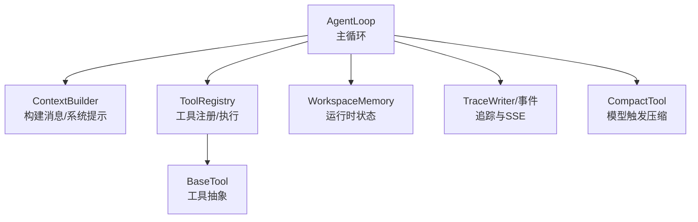
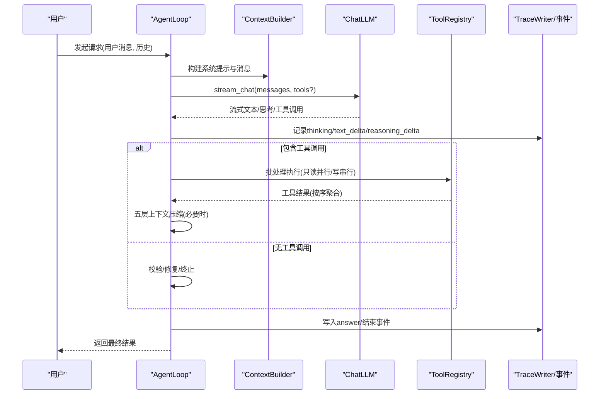
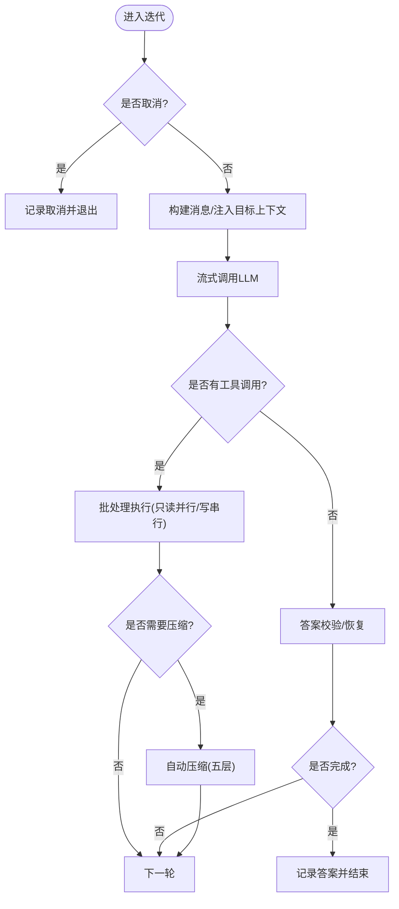
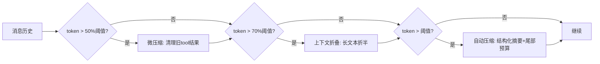
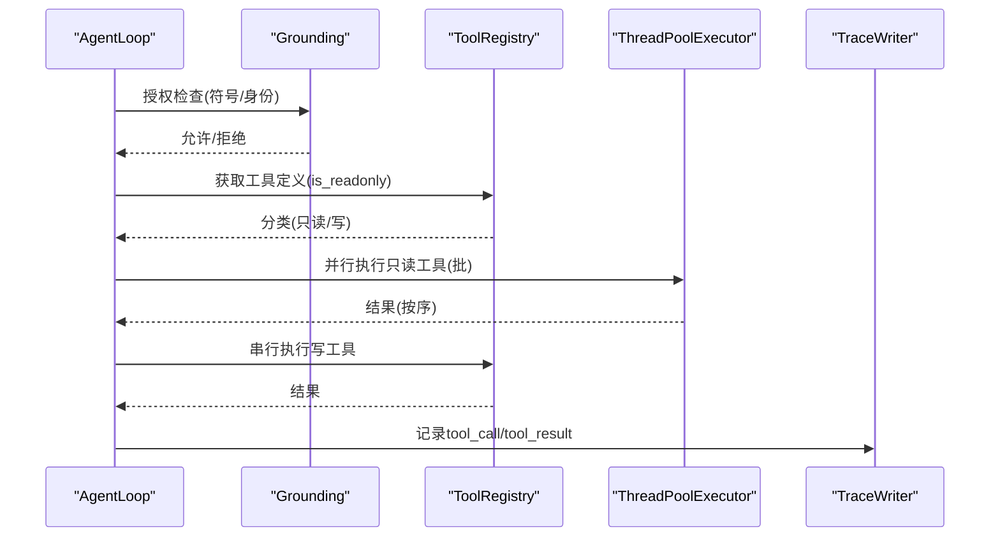
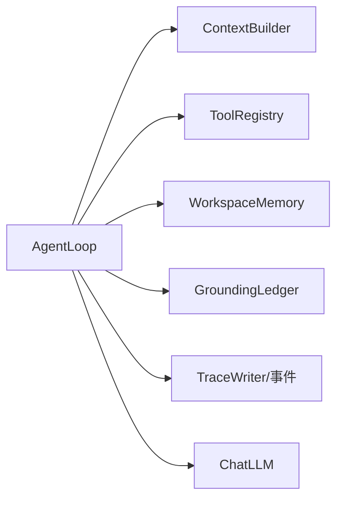

# ReAct 模式实现

<cite>
**本文引用的文件**
- [loop.py](file://agent/src/agent/loop.py)
- [context.py](file://agent/src/agent/context.py)
- [tools.py](file://agent/src/agent/tools.py)
- [memory.py](file://agent/src/agent/memory.py)
- [compact_tool.py](file://agent/src/tools/compact_tool.py)
</cite>

## 目录
1. [简介](#简介)
2. [项目结构](#项目结构)
3. [核心组件](#核心组件)
4. [架构总览](#架构总览)
5. [详细组件分析](#详细组件分析)
6. [依赖关系分析](#依赖关系分析)
7. [性能考量](#性能考量)
8. [故障诊断指南](#故障诊断指南)
9. [结论](#结论)
10. [附录：配置与使用示例](#附录配置与使用示例)

## 简介
本技术文档聚焦于 ReAct（推理-行动-观察）循环在工程中的实现，围绕 AgentLoop 的迭代控制、状态管理、消息处理、五层上下文压缩机制、工具调用批处理（并行执行、结果聚合、错误处理）展开。面向框架开发者，提供可落地的架构图、流程图与关键路径说明，并给出性能优化建议与故障诊断方法。

## 项目结构
ReAct 的核心位于 agent/src/agent 模块：
- AgentLoop：ReAct 主循环，负责迭代控制、上下文压缩、工具调度、事件与追踪输出。
- ContextBuilder：构建系统提示与消息列表，注入技能/工具摘要与持久化记忆快照。
- ToolRegistry/BaseTool：工具注册与执行入口，统一 OpenAI function-calling 描述。
- WorkspaceMemory：单轮运行内的轻量共享状态（如 run_dir、计数器）。
- CompactTool：模型主动触发的“压缩”工具，用于触发自动压缩流程。

**图表来源**
- [loop.py:638-800](file://agent/src/agent/loop.py#L638-L800)
- [context.py:221-333](file://agent/src/agent/context.py#L221-L333)
- [tools.py:13-95](file://agent/src/agent/tools.py#L13-L95)
- [memory.py:13-54](file://agent/src/agent/memory.py#L13-L54)
- [compact_tool.py:11-26](file://agent/src/tools/compact_tool.py#L11-L26)

**章节来源**
- [loop.py:638-800](file://agent/src/agent/loop.py#L638-L800)
- [context.py:221-333](file://agent/src/agent/context.py#L221-L333)
- [tools.py:13-95](file://agent/src/agent/tools.py#L13-L95)
- [memory.py:13-54](file://agent/src/agent/memory.py#L13-L54)
- [compact_tool.py:11-26](file://agent/src/tools/compact_tool.py#L11-L26)

## 核心组件
- AgentLoop
  - 职责：驱动 ReAct 循环；维护消息历史；执行工具批处理；触发五层上下文压缩；记录追踪与事件；最终收敛或失败。
  - 关键能力：流式 LLM 调用、内容过滤熔断、目标进度续推、最后迭代强制文本输出、取消信号传播。
- ContextBuilder
  - 职责：生成系统提示（含工具/技能摘要、持久化记忆快照）、组装用户消息与历史、格式化助手工具调用与工具结果。
- ToolRegistry / BaseTool
  - 职责：工具注册、OpenAI schema 导出、统一执行与异常包装；支持只读标记 repeatable/is_readonly。
- WorkspaceMemory
  - 职责：单轮内共享状态（run_dir、计数器），为系统提示提供状态摘要。
- CompactTool
  - 职责：暴露给模型的“压缩”工具，触发自动压缩流程并可指定关注主题。

**章节来源**
- [loop.py:638-800](file://agent/src/agent/loop.py#L638-L800)
- [context.py:221-333](file://agent/src/agent/context.py#L221-L333)
- [tools.py:13-95](file://agent/src/agent/tools.py#L13-L95)
- [memory.py:13-54](file://agent/src/agent/memory.py#L13-L54)
- [compact_tool.py:11-26](file://agent/src/tools/compact_tool.py#L11-L26)

## 架构总览
下图展示一次 ReAct 迭代的端到端流程：消息构建 → LLM 流式响应 → 工具批处理 → 上下文压缩 → 结果归档与追踪。

**图表来源**
- [loop.py:800-1362](file://agent/src/agent/loop.py#L800-L1362)
- [context.py:246-333](file://agent/src/agent/context.py#L246-L333)
- [tools.py:54-95](file://agent/src/agent/tools.py#L54-L95)

## 详细组件分析

### AgentLoop：ReAct 主循环
- 迭代控制
  - 最大迭代次数限制；接近上限时注入“收尾”提示；最后一次迭代移除工具定义以强制纯文本输出。
  - 支持取消信号，在每次迭代边界、流式 chunk 间、工具批次间检查。
- 消息处理
  - 构建消息：系统提示 + 历史 + 用户消息（可能注入目标上下文）。
  - 流式回调：收集 thinking、reasoning delta，节流输出，避免 SSE 缓冲压力。
  - 内容过滤：连续被阻断时触发熔断器，终止本轮。
  - 答案校验：Grounding 校验失败时尝试恢复或修正，直至满足约束或达到上限。
- 工具批处理
  - 去重：非 repeatable 工具成功调用后再次调用会被跳过。
  - 授权与安全：基于 grounding 的身份白名单与批量身份状态进行授权。
  - 批处理策略：相邻只读工具并行执行（线程池），写操作串行执行，保证顺序与一致性。
  - 超时与心跳：只读工具支持超时中断；写工具不中断但会告警；每调用内置心跳与进度事件。
- 上下文压缩（五层）
  - Layer 1 微压缩：内存压力下清理旧工具结果，保留最近 N 条。
  - Layer 2 上下文折叠：对长文本块做零成本折叠（保留头尾）。
  - Layer 3 自动压缩：超过 token 阈值时，结构化摘要 + 尾部预算保护。
  - Layer 4 工具压缩：模型显式调用 compact 工具触发压缩，可指定 focus_topic。
  - Layer 5 迭代更新：第 N 次压缩增量更新已有摘要，避免信息衰减。
- 结果归档与追踪
  - 将 backtest 产物复制到当前 run 目录，便于 UI/API 识别。
  - 记录 LLM 用量、工具调用/结果、压缩事件、目标进度等。

**图表来源**
- [loop.py:833-1362](file://agent/src/agent/loop.py#L833-L1362)
- [loop.py:1366-1600](file://agent/src/agent/loop.py#L1366-L1600)
- [loop.py:1960-2078](file://agent/src/agent/loop.py#L1960-L2078)

**章节来源**
- [loop.py:800-1362](file://agent/src/agent/loop.py#L800-L1362)
- [loop.py:1366-1600](file://agent/src/agent/loop.py#L1366-L1600)
- [loop.py:1960-2078](file://agent/src/agent/loop.py#L1960-L2078)

### 五层上下文管理系统
- 微压缩（Layer 1）
  - 仅在 token 数超过阈值一半时触发，清理较旧的 tool 结果，仅保留最近若干条，降低开销。
- 上下文折叠（Layer 2）
  - 对较长文本块做零 API 成本的折叠，保留头部与尾部，中间用占位符替代。
- 自动压缩（Layer 3）
  - 超过阈值时，将历史切分为多个 chunk，逐段生成结构化摘要；保留尾部 token 预算，确保近期上下文不被截断。
- 工具压缩（Layer 4）
  - 模型通过 compact 工具主动触发压缩，可指定 focus_topic 以优先保留特定主题细节。
- 迭代更新（Layer 5）
  - 后续压缩以“增量更新”方式合并到已有摘要，避免重复丢失信息。

**图表来源**
- [loop.py:863-884](file://agent/src/agent/loop.py#L863-L884)
- [loop.py:307-343](file://agent/src/agent/loop.py#L307-L343)
- [loop.py:1960-2078](file://agent/src/agent/loop.py#L1960-L2078)

**章节来源**
- [loop.py:307-343](file://agent/src/agent/loop.py#L307-L343)
- [loop.py:863-884](file://agent/src/agent/loop.py#L863-L884)
- [loop.py:1960-2078](file://agent/src/agent/loop.py#L1960-L2078)

### 工具调用的批处理机制
- 预处理与授权
  - 解析工具调用，处理 compact 特殊逻辑；对非 repeatable 的成功调用进行去重；基于 grounding 进行身份与参数授权。
- 批处理策略
  - 将连续只读工具聚合成并行批次（线程池，最多并发 8），写工具串行执行，保证顺序与一致性。
- 执行与聚合
  - 每个工具调用记录事件与追踪；结果按原顺序聚合；异常被捕获并转为结构化错误结果。
- 超时与心跳
  - 只读工具支持超时中断；写工具不中断但会在超时后发出警告；每调用周期发送心跳与进度事件。

**图表来源**
- [loop.py:1366-1600](file://agent/src/agent/loop.py#L1366-L1600)
- [loop.py:2637-2897](file://agent/src/agent/loop.py#L2637-L2897)

**章节来源**
- [loop.py:1366-1600](file://agent/src/agent/loop.py#L1366-L1600)
- [loop.py:2637-2897](file://agent/src/agent/loop.py#L2637-L2897)

### 上下文构建与消息格式
- 系统提示
  - 注入工具/技能摘要、数据源数量、持久化记忆快照、当前时间等；输出原则固定，不可被会话输入覆盖。
- 消息组装
  - 将历史与用户消息组合；可选注入相关持久化记忆片段；格式化助手工具调用与工具结果。
- 工具描述精简
  - 系统提示中仅保留工具一行摘要，完整 schema 通过 API tools 数组下发，减少 token 消耗。

**章节来源**
- [context.py:23-218](file://agent/src/agent/context.py#L23-L218)
- [context.py:246-333](file://agent/src/agent/context.py#L246-L333)
- [context.py:345-420](file://agent/src/agent/context.py#L345-L420)

### 工具基础设施
- BaseTool
  - 定义 name/description/parameters/repeatable/is_readonly；to_openai_schema 用于函数调用描述。
- ToolRegistry
  - 注册/查询工具；get_definitions 返回所有工具的 OpenAI schema；execute 统一执行并封装异常为 JSON 错误。

**章节来源**
- [tools.py:13-95](file://agent/src/agent/tools.py#L13-L95)

### 工作区内存
- WorkspaceMemory
  - 单轮内共享状态：run_dir、计数器；to_summary 生成简短状态供系统提示引用，帮助模型保持上下文连贯。

**章节来源**
- [memory.py:13-54](file://agent/src/agent/memory.py#L13-L54)

### 模型触发的压缩工具
- CompactTool
  - 暴露给模型的 compact 工具；执行后由 AgentLoop 的 _process_tool_calls 拦截并触发自动压缩流程，可携带 focus_topic。

**章节来源**
- [compact_tool.py:11-26](file://agent/src/tools/compact_tool.py#L11-L26)
- [loop.py:1366-1494](file://agent/src/agent/loop.py#L1366-L1494)

## 依赖关系分析
- AgentLoop 依赖
  - ContextBuilder：构建消息与系统提示。
  - ToolRegistry/BaseTool：工具注册与执行。
  - WorkspaceMemory：运行时状态。
  - TraceWriter/事件：追踪与 SSE 输出。
  - GroundingLedger：工具授权与身份状态。
- 外部依赖
  - ChatLLM：流式聊天接口，支持 reasoning_content、content_filter_triggered、usage_metadata。
  - 配置访问：token 阈值、心跳间隔、重试延迟、工具超时、目标续推上限等。

**图表来源**
- [loop.py:638-800](file://agent/src/agent/loop.py#L638-L800)
- [context.py:221-333](file://agent/src/agent/context.py#L221-L333)
- [tools.py:54-95](file://agent/src/agent/tools.py#L54-L95)

**章节来源**
- [loop.py:638-800](file://agent/src/agent/loop.py#L638-L800)
- [context.py:221-333](file://agent/src/agent/context.py#L221-L333)
- [tools.py:54-95](file://agent/src/agent/tools.py#L54-L95)

## 性能考量
- 流式输出节流
  - reasoning_delta 最小间隔与滚动尾部窗口，避免 SSE 缓冲溢出。
- 工具批处理
  - 只读工具并行执行（线程池上限 8），写工具串行，兼顾吞吐与一致性。
- 上下文压缩
  - 分层阈值触发，避免不必要的 LLM 调用；尾部 token 预算保护近期上下文；结构化摘要提升可理解性。
- 超时与心跳
  - 只读工具超时中断，写工具超时告警但不中断；心跳事件保障长时间任务可观测。
- 资源与追踪
  - 将大文本转储至 transcript 文件，减少内存占用；记录 LLM 用量与工具耗时，便于定位瓶颈。

[本节为通用性能指导，无需具体文件来源]

## 故障诊断指南
- 常见错误与现象
  - 内容过滤熔断：连续多次被内容过滤器阻断，触发熔断器并终止。
  - 空模型响应：某次迭代未返回任何内容且无工具调用，记录 provider/model 信息。
  - 工具超时：只读工具超过配置超时，返回结构化错误；写工具超时仅告警。
  - 工具被拒绝：身份/符号授权失败，记录 blocked 事件与原因。
  - 重复调用：非 repeatable 工具已成功调用后被再次调用，直接跳过。
- 诊断步骤
  - 查看 trace.jsonl 中的 compact/tool_call/tool_result/answer 等事件，定位问题阶段。
  - 检查 LLM usage 与 model_source，确认实际使用的模型与提供商。
  - 核对 grounding 的 identity_state 与授权日志，确认符号/身份是否正确锁定。
  - 若出现空响应或内容过滤，调整 prompt 或 provider 配置，必要时增加重试延迟。

**章节来源**
- [loop.py:1056-1080](file://agent/src/agent/loop.py#L1056-L1080)
- [loop.py:1287-1362](file://agent/src/agent/loop.py#L1287-L1362)
- [loop.py:2733-2897](file://agent/src/agent/loop.py#L2733-L2897)
- [loop.py:1874-1957](file://agent/src/agent/loop.py#L1874-L1957)

## 结论
该实现以 AgentLoop 为核心，结合分层上下文压缩与工具批处理，提供了高吞吐、强一致、可观测的 ReAct 执行环境。通过结构化摘要与增量更新，有效缓解长对话的上下文衰减；通过只读并行与写串行策略，在保证正确性的同时最大化吞吐。配合完善的追踪与事件机制，便于开发与运维阶段的快速定位与优化。

[本节为总结性内容，无需具体文件来源]

## 附录：配置与使用示例
- 初始化 AgentLoop
  - 传入 ToolRegistry、ChatLLM、可选 WorkspaceMemory、事件回调与最大迭代次数。
  - 参考路径：[loop.py:638-693](file://agent/src/agent/loop.py#L638-L693)
- 运行一次 ReAct 循环
  - 调用 run(user_message, history, session_id)，内部自动创建 run_dir、构建消息、流式调用 LLM、批处理工具、压缩与归档。
  - 参考路径：[loop.py:760-800](file://agent/src/agent/loop.py#L760-L800)
- 配置项（通过环境变量/配置访问）
  - token_threshold、vt_heartbeat_interval_s、vt_reasoning_delta_min_interval_s、vt_stream_retry_delay_s、vibe_trading_tool_timeout_seconds、vibe_trading_goal_max_continuations。
  - 参考路径：[loop.py:77-123](file://agent/src/agent/loop.py#L77-L123)
- 使用工具
  - 注册工具到 ToolRegistry；工具需实现 execute 并声明 is_readonly/repeatable。
  - 参考路径：[tools.py:13-95](file://agent/src/agent/tools.py#L13-L95)
- 触发压缩
  - 模型可通过 compact 工具触发压缩，可指定 focus_topic 以保留重点。
  - 参考路径：[compact_tool.py:11-26](file://agent/src/tools/compact_tool.py#L11-L26)、[loop.py:1366-1494](file://agent/src/agent/loop.py#L1366-L1494)

**章节来源**
- [loop.py:638-693](file://agent/src/agent/loop.py#L638-L693)
- [loop.py:760-800](file://agent/src/agent/loop.py#L760-L800)
- [loop.py:77-123](file://agent/src/agent/loop.py#L77-L123)
- [tools.py:13-95](file://agent/src/agent/tools.py#L13-L95)
- [compact_tool.py:11-26](file://agent/src/tools/compact_tool.py#L11-L26)
- [loop.py:1366-1494](file://agent/src/agent/loop.py#L1366-L1494)