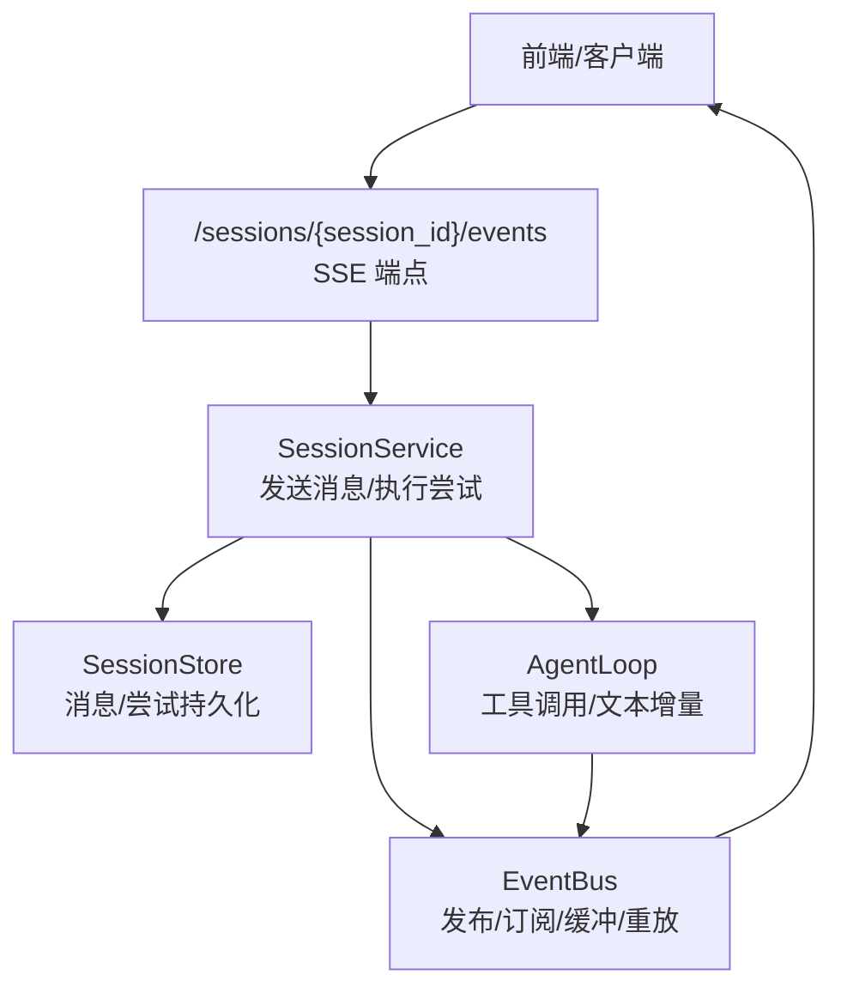
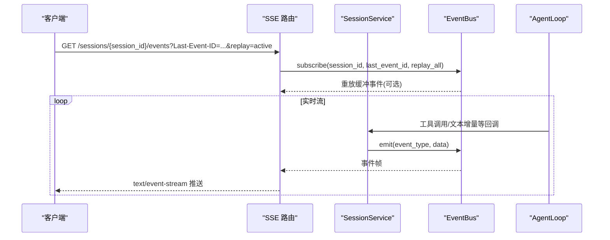
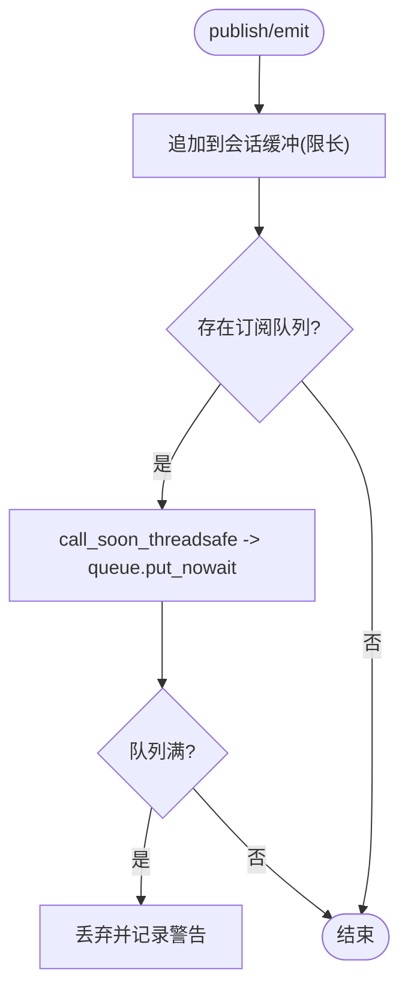
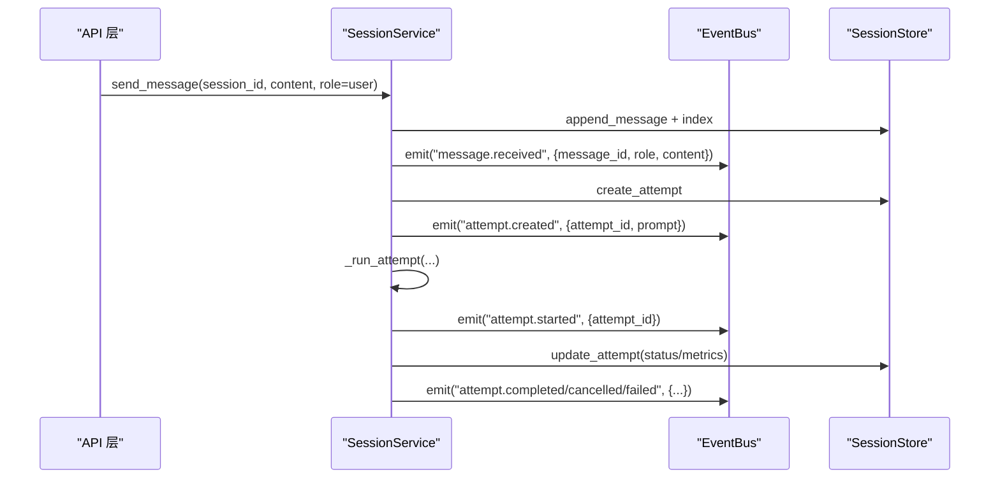
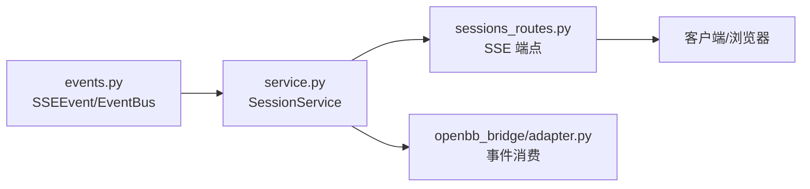

# 会话事件系统

<cite>
**本文引用的文件**
- [events.py](file://agent/src/session/events.py)
- [service.py](file://agent/src/session/service.py)
- [sessions_routes.py](file://agent/src/api/sessions_routes.py)
- [adapter.py](file://agent/src/openbb_bridge/adapter.py)
- [live_routes.py](file://agent/src/api/live_routes.py)
- [alpha_routes.py](file://agent/src/api/alpha_routes.py)
- [test_session_events.py](file://agent/tests/test_session_events.py)
- [test_eventbus_clear_subscribers.py](file://agent/tests/test_eventbus_clear_subscribers.py)
</cite>

## 目录
1. [简介](#简介)
2. [项目结构](#项目结构)
3. [核心组件](#核心组件)
4. [架构总览](#架构总览)
5. [详细组件分析](#详细组件分析)
6. [依赖关系分析](#依赖关系分析)
7. [性能考量](#性能考量)
8. [故障排查指南](#故障排查指南)
9. [结论](#结论)
10. [附录：事件类型与数据结构](#附录事件类型与数据结构)

## 简介
本技术文档聚焦于“会话事件系统”，围绕 EventBus 类的设计与实现，系统性阐述事件发布订阅模式、异步事件处理、事件路由、SSE（Server-Sent Events）集成、连接管理与断线重连等机制。同时，文档化会话事件类型定义（如 session.created、message.received、attempt.started 等）、事件数据结构（载荷、元数据、时间戳等），并提供事件监听与处理的实践示例路径，以及性能优化、事件去重、事件持久化等高级主题建议，帮助事件驱动架构开发者高效使用与扩展该系统。

## 项目结构
会话事件系统的核心位于 agent 模块的 session 与 api 层：
- 事件总线与 SSE 事件模型：agent/src/session/events.py
- 会话生命周期与事件发射：agent/src/session/service.py
- SSE 流式接口与客户端接入：agent/src/api/sessions_routes.py
- 事件消费与适配（OpenBB 等）：agent/src/openbb_bridge/adapter.py
- 其他 SSE 场景（心跳、轮询等）：agent/src/api/alpha_routes.py、agent/src/api/live_routes.py
- 行为验证测试：agent/tests/test_session_events.py、agent/tests/test_eventbus_clear_subscribers.py

图表来源
- [sessions_routes.py:752-802](file://agent/src/api/sessions_routes.py#L752-L802)
- [service.py:244-307](file://agent/src/session/service.py#L244-L307)
- [events.py:57-163](file://agent/src/session/events.py#L57-L163)

章节来源
- [events.py:1-265](file://agent/src/session/events.py#L1-L265)
- [service.py:1-605](file://agent/src/session/service.py#L1-L605)
- [sessions_routes.py:752-802](file://agent/src/api/sessions_routes.py#L752-L802)

## 核心组件
- SSEEvent：表示一次 SSE 事件帧，包含 event_id、event_type、data、session_id、timestamp，并支持 to_sse() 序列化为标准 SSE 文本帧。
- EventBus：会话级事件总线，提供 publish/emit、subscribe、replay、clear 等方法；维护每个会话的事件缓冲与订阅队列，支持线程安全发布与异步订阅，内置心跳与清理机制。
- SessionService：会话服务，负责创建会话、发送消息、创建并运行尝试（Attempt），在关键阶段通过 EventBus 发射事件（如 session.created、message.received、attempt.started、attempt.completed/cancelled/failed）。
- SSE 路由：/sessions/{session_id}/events 暴露 SSE 流，支持 Last-Event-ID 重放与 active 模式下的全量缓冲重放，确保断线重连时状态一致。

章节来源
- [events.py:20-55](file://agent/src/session/events.py#L20-L55)
- [events.py:57-163](file://agent/src/session/events.py#L57-L163)
- [service.py:204-229](file://agent/src/session/service.py#L204-L229)
- [service.py:244-307](file://agent/src/session/service.py#L244-L307)
- [sessions_routes.py:752-802](file://agent/src/api/sessions_routes.py#L752-L802)

## 架构总览
下图展示了从客户端到后端的事件流：客户端通过 HTTP GET /sessions/{session_id}/events 建立 SSE 连接；服务端通过 EventBus.subscribe 订阅该会话的事件流，并在收到事件后以 SSE 帧推送；当客户端携带 Last-Event-ID 或启用 replay=active 时，服务端会先重放缓冲中的历史事件，再进入实时流。

图表来源
- [sessions_routes.py:752-802](file://agent/src/api/sessions_routes.py#L752-L802)
- [events.py:185-235](file://agent/src/session/events.py#L185-L235)
- [service.py:385-395](file://agent/src/session/service.py#L385-L395)

## 详细组件分析

### EventBus：发布订阅、缓冲与重放
- 发布（publish/emit）：线程安全地将事件追加到会话缓冲，并通过 asyncio.Queue 投递给所有订阅者；若队列满则丢弃并记录警告日志。
- 订阅（subscribe）：为每个订阅者创建独立队列，支持 last_event_id 与 replay_all 参数进行重放；每 30 秒无事件时发送 heartbeat 事件以保持连接活跃；遇到 session_cleared 哨兵事件时优雅退出。
- 重放（replay）：根据 last_event_id 精确回放后续事件；当 replay_all=True 且未提供 last_event_id 时，返回整个缓冲用于活动运行的首次连接恢复。
- 清理（clear）：清空会话缓冲并通知所有订阅者 session_cleared，随后移除订阅列表，避免向死队列继续入队。

图表来源
- [events.py:87-126](file://agent/src/session/events.py#L87-L126)

章节来源
- [events.py:57-163](file://agent/src/session/events.py#L57-L163)
- [events.py:185-235](file://agent/src/session/events.py#L185-L235)
- [events.py:280-308](file://agent/src/session/events.py#L280-L308)
- [test_eventbus_clear_subscribers.py:49-79](file://agent/tests/test_eventbus_clear_subscribers.py#L49-L79)

### SessionService：会话生命周期与事件发射
- 创建会话：create_session 持久化会话并发射 session.created。
- 发送消息：send_message 持久化消息并索引，发射 message.received；对用户角色创建 Attempt 并发射 attempt.created；后台任务执行 _run_attempt。
- 执行尝试：_run_attempt 标记 running 并发射 attempt.started；执行完成后根据结果发射 attempt.completed/cancelled/failed，并附带摘要、错误、运行目录、耗时与运行时元数据。
- 取消：cancel_current 可取消正在构建注册表的 task 或已创建的 AgentLoop。

图表来源
- [service.py:244-307](file://agent/src/session/service.py#L244-L307)
- [service.py:248-345](file://agent/src/session/service.py#L248-L345)

章节来源
- [service.py:204-229](file://agent/src/session/service.py#L204-L229)
- [service.py:244-307](file://agent/src/session/service.py#L244-L307)
- [service.py:248-345](file://agent/src/session/service.py#L248-L345)

### SSE 路由：连接管理、断线检测与重放
- 端点：GET /sessions/{session_id}/events
- 认证：require_event_stream_auth
- 重放策略：
  - 支持 Last-Event-ID 精确重放
  - 支持 replay=active：当当前尝试仍在运行且无 last_event_id 时，重放整个缓冲
- 连接管理：StreamingResponse 设置 no-cache、keep-alive、X-Accel-Buffering=no；循环中检测 request.is_disconnected() 及时断开
- 事件转换：将 EventBus 的 SSEEvent 转换为 SSE 文本帧，并可转发特定 tool_result 派生帧

章节来源
- [sessions_routes.py:752-802](file://agent/src/api/sessions_routes.py#L752-L802)

### 事件消费与适配：OpenBB 桥接
- OpenBB 适配器通过 EventBus.subscribe 消费会话事件，过滤 heartbeat，按 attempt_id 过滤不同尝试的事件，将内部事件映射为 openbb_ai SSE 对象，并在终端事件后完成收尾流程。
- 对 text_delta 事件进行累积，最终生成完整输出片段。

章节来源
- [adapter.py:127-166](file://agent/src/openbb_bridge/adapter.py#L127-L166)

### 其他 SSE 场景：心跳与轮询
- alpha_routes 展示周期性心跳与轮询的 SSE 用法，设置合适的响应头以避免代理缓存与缓冲。
- live_routes 提供最佳努力的事件中继，将外部通道事件通过现有 bus 推送到 /sessions/{session_id}/events 流，失败不阻塞主流程。

章节来源
- [alpha_routes.py:722-761](file://agent/src/api/alpha_routes.py#L722-L761)
- [live_routes.py:341-355](file://agent/src/api/live_routes.py#L341-L355)

## 依赖关系分析
- EventBus 依赖 asyncio 队列与 threading 锁，保证跨线程安全；依赖 set_loop 注入事件循环以使用 call_soon_threadsafe。
- SessionService 依赖 SessionStore 进行消息与尝试的持久化，依赖 EventBus 进行事件广播，依赖 AgentLoop 执行实际逻辑。
- SSE 路由依赖 FastAPI StreamingResponse 与请求上下文，实现连接管理与事件转发。
- OpenBB 适配器依赖 EventBus 订阅与会话服务，实现事件到外部协议的映射。

图表来源
- [events.py:57-163](file://agent/src/session/events.py#L57-L163)
- [service.py:244-307](file://agent/src/session/service.py#L244-L307)
- [sessions_routes.py:752-802](file://agent/src/api/sessions_routes.py#L752-L802)
- [adapter.py:127-166](file://agent/src/openbb_bridge/adapter.py#L127-L166)

章节来源
- [events.py:57-163](file://agent/src/session/events.py#L57-L163)
- [service.py:244-307](file://agent/src/session/service.py#L244-L307)
- [sessions_routes.py:752-802](file://agent/src/api/sessions_routes.py#L752-L802)
- [adapter.py:127-166](file://agent/src/openbb_bridge/adapter.py#L127-L166)

## 性能考量
- 缓冲限长：EventBus 默认每会话最多缓冲 500 个事件，防止内存无限增长；超出部分仅保留最近 N 条。
- 队列容量：订阅队列最大容量 200，满时丢弃事件并记录警告；可根据业务调整。
- 心跳保活：订阅者在 30 秒无事件时发送 heartbeat，避免中间设备超时断开。
- 线程安全：publish 使用线程锁保护缓冲写入，并通过 call_soon_threadsafe 安全入队，避免跨线程直接操作 asyncio.Queue。
- 重放策略：默认首次连接不重放已完成历史，减少带宽；活动运行可通过 replay=active 重放全部缓冲。
- 连接断开检测：SSE 路由循环中检测 is_disconnected()，及时释放资源。

[本节为通用性能指导，无需具体文件引用]

## 故障排查指南
- 事件丢失：检查 EventBus 队列是否频繁 QueueFull；必要时增大队列容量或优化消费者速度。
- 连接中断：确认 SSE 响应头正确（no-cache、keep-alive、X-Accel-Buffering=no）；客户端应支持 Last-Event-ID 重放。
- 会话清理：删除会话时会触发 session_cleared，确保订阅者能正确处理并退出。
- 尝试异常：attempt.failed 事件包含 error 字段；attempt.cancelled 用于用户主动取消；attempt.completed 包含 summary 与运行时元数据。
- 心跳缺失：若长时间无事件，heartbeat 会维持连接；若仍断开，检查网络与代理配置。

章节来源
- [events.py:158-169](file://agent/src/session/events.py#L158-L169)
- [events.py:215-229](file://agent/src/session/events.py#L215-L229)
- [events.py:280-308](file://agent/src/session/events.py#L280-L308)
- [sessions_routes.py:752-802](file://agent/src/api/sessions_routes.py#L752-L802)
- [service.py:317-345](file://agent/src/session/service.py#L317-L345)

## 结论
会话事件系统通过 EventBus 实现了高内聚、低耦合的事件驱动架构：发布订阅解耦生产与消费，缓冲与重放保障可靠性，SSE 提供实时推送能力，配合心跳与连接管理提升稳定性。SessionService 在会话生命周期关键节点发射标准化事件，便于前端与第三方系统消费。整体设计兼顾性能与可扩展性，适合复杂交互与多通道集成的场景。

[本节为总结性内容，无需具体文件引用]

## 附录：事件类型与数据结构

### 事件类型与触发时机
- session.created：会话创建成功时发射，包含 session_id 与 title。
- message.received：消息持久化并索引成功后发射，包含 message_id、role、content。
- attempt.created：为用户消息创建尝试后发射，包含 attempt_id 与 prompt。
- attempt.started：尝试开始执行时发射，包含 attempt_id。
- attempt.completed：尝试成功结束时发射，包含 attempt_id、status、summary、run_dir、elapsed_ms 及运行时元数据（provider、model 等）。
- attempt.cancelled：尝试被用户取消时发射，包含 attempt_id、status。
- attempt.failed：尝试失败时发射，包含 attempt_id、error。
- tool_call/tool_result/tool_progress/tool_heartbeat：AgentLoop 工具执行过程中的进度与结果事件，包含 tool、arguments、call_id、elapsed_ms、status、preview 等。
- text_delta：文本增量事件，包含 delta，用于流式输出。
- heartbeat：订阅侧心跳，包含 ts，用于保持连接。
- session_cleared：会话清理哨兵事件，用于通知订阅者退出。

章节来源
- [service.py:204-229](file://agent/src/session/service.py#L204-L229)
- [service.py:244-307](file://agent/src/session/service.py#L244-L307)
- [service.py:248-345](file://agent/src/session/service.py#L248-L345)
- [events.py:20-55](file://agent/src/session/events.py#L20-L55)
- [events.py:215-229](file://agent/src/session/events.py#L215-L229)

### 事件数据结构
- SSEEvent：
  - event_id：唯一标识，用于 Last-Event-ID 重放
  - event_type：事件类型字符串
  - data：事件载荷（字典）
  - session_id：所属会话 ID
  - timestamp：事件时间戳（浮点数）
- 典型载荷字段：
  - message.received：{message_id, role, content}
  - attempt.*：{attempt_id, status, summary, error, run_dir, elapsed_ms, provider, model, ...}
  - tool_call/tool_result：{tool, arguments, call_id, elapsed_ms, status, preview}
  - text_delta：{delta}
  - heartbeat：{ts}

章节来源
- [events.py:20-55](file://agent/src/session/events.py#L20-L55)
- [service.py:317-345](file://agent/src/session/service.py#L317-L345)

### 事件监听与处理示例（路径指引）
- 前端订阅：参考 SSE 端点与重放参数，使用 EventSource 或 fetch + ReadableStream 订阅 /sessions/{session_id}/events，并处理 Last-Event-ID 与 replay=active。
- 后端发布：在 SessionService 的关键步骤调用 event_bus.emit 或 event_bus.publish。
- 错误处理：捕获 attempt.failed 与 attempt.cancelled，结合 error 与 status 字段进行 UI 提示与重试策略。
- 参考路径：
  - [sessions_routes.py:752-802](file://agent/src/api/sessions_routes.py#L752-L802)
  - [service.py:244-307](file://agent/src/session/service.py#L244-L307)
  - [service.py:248-345](file://agent/src/session/service.py#L248-L345)
  - [adapter.py:127-166](file://agent/src/openbb_bridge/adapter.py#L127-L166)

### 高级主题建议
- 事件去重：基于 event_id 或业务键（如 attempt_id + tool call_id）在前端或适配器层去重，避免重复渲染。
- 事件持久化：除会话缓冲外，可将关键事件落盘（如消息、尝试状态、工具轨迹），以便离线分析与审计。
- 背压与限速：在高吞吐场景下，可对 EventBus 队列增加背压策略（如拒绝新事件或降级），并对客户端实施速率限制。
- 多租户隔离：确保 session_id 作为路由键严格隔离，避免事件泄漏。
- 监控与告警：统计 EventBus 队列满次数、心跳间隔、SSE 连接时长与断开原因，建立可观测性指标。

[本节为通用建议，无需具体文件引用]