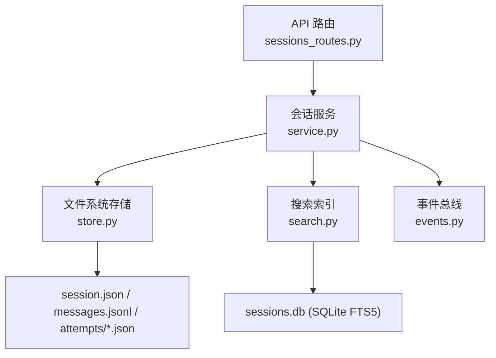
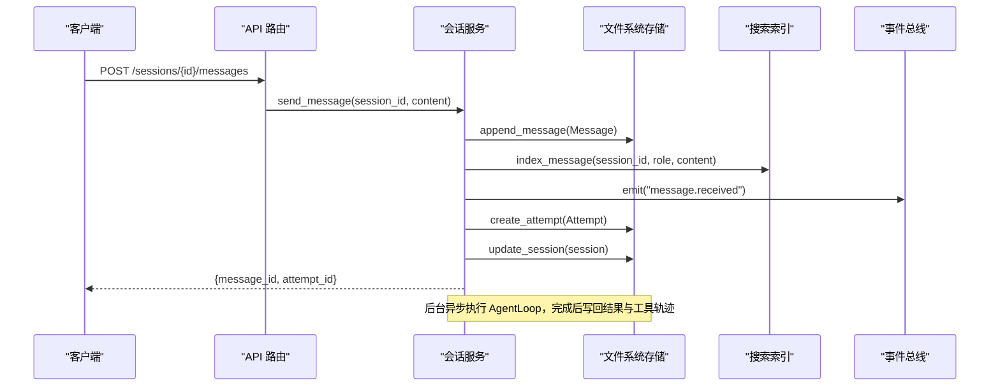
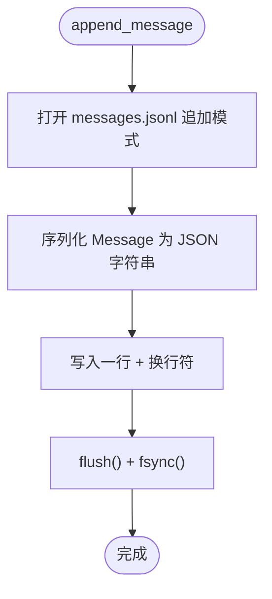
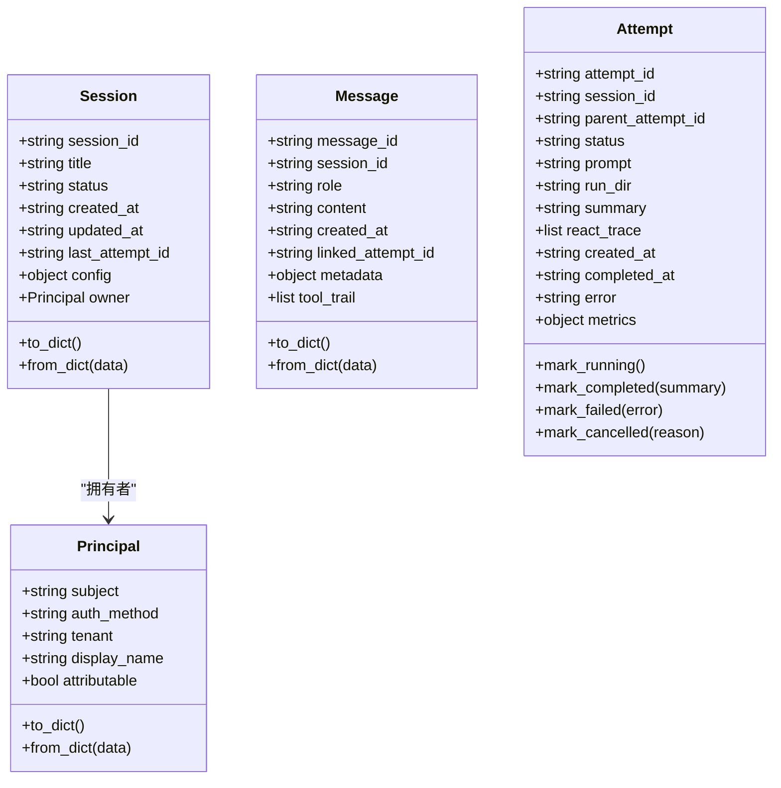
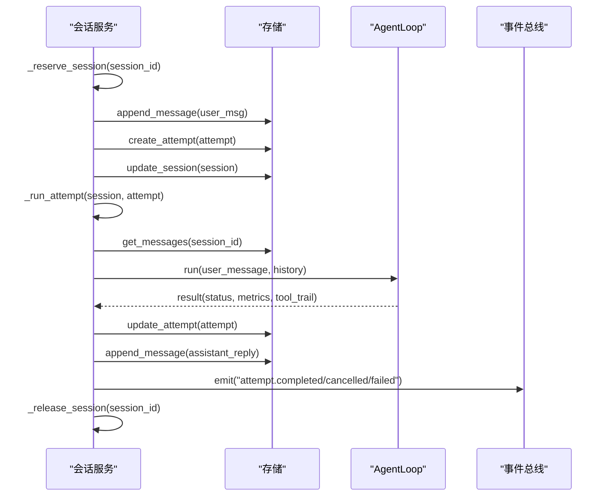
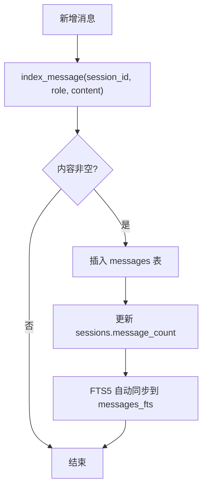
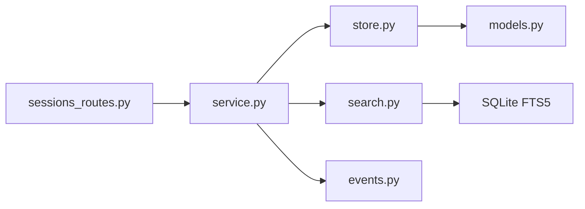

# 会话存储机制

<cite>
**本文引用的文件**
- [agent/src/session/store.py](file://agent/src/session/store.py)
- [agent/src/session/models.py](file://agent/src/session/models.py)
- [agent/src/session/service.py](file://agent/src/session/service.py)
- [agent/src/session/search.py](file://agent/src/session/search.py)
- [agent/src/api/sessions_routes.py](file://agent/src/api/sessions_routes.py)
- [agent/tests/test_session_store_list_corrupt.py](file://agent/tests/test_session_store_list_corrupt.py)
- [agent/tests/test_session_store_messages_corrupt.py](file://agent/tests/test_session_store_messages_corrupt.py)
</cite>

## 目录
1. [简介](#简介)
2. [项目结构](#项目结构)
3. [核心组件](#核心组件)
4. [架构总览](#架构总览)
5. [详细组件分析](#详细组件分析)
6. [依赖关系分析](#依赖关系分析)
7. [性能考量](#性能考量)
8. [故障排查指南](#故障排查指南)
9. [结论](#结论)
10. [附录：API 接口文档](#附录api-接口文档)

## 简介
本技术文档聚焦于会话存储机制，围绕 SessionStore 类及其相关模块展开，系统性说明会话数据的持久化存储、消息历史管理、会话元数据管理、数据存储格式与版本兼容策略、以及搜索索引与事件流等高级主题。目标读者为数据存储开发者与维护者，旨在提供可操作的设计要点、实现细节与排错建议。

## 项目结构
会话存储子系统位于 agent/src/session 目录下，核心由以下模块构成：
- store.py：基于文件系统的会话、消息、尝试（Attempt）记录持久化实现
- models.py：Session、Message、Attempt、Principal 等数据模型定义及序列化/反序列化逻辑
- service.py：会话生命周期编排，负责消息发送、执行尝试调度、事件发布、与 AgentLoop 的协作
- search.py：基于 SQLite FTS5 的跨会话全文检索索引
- events.py（被 service 引用）：SSE 事件总线，用于实时事件推送与回放
- api/sessions_routes.py：HTTP API 路由，暴露会话 CRUD、消息发送、取消、事件流等能力

图表来源
- [agent/src/api/sessions_routes.py:335-800](file://agent/src/api/sessions_routes.py#L335-L800)
- [agent/src/session/service.py:204-311](file://agent/src/session/service.py#L204-L311)
- [agent/src/session/store.py:16-259](file://agent/src/session/store.py#L16-L259)
- [agent/src/session/search.py:60-365](file://agent/src/session/search.py#L60-L365)

章节来源
- [agent/src/session/store.py:16-259](file://agent/src/session/store.py#L16-L259)
- [agent/src/session/models.py:140-342](file://agent/src/session/models.py#L140-L342)
- [agent/src/session/service.py:53-226](file://agent/src/session/service.py#L53-L226)
- [agent/src/session/search.py:60-365](file://agent/src/session/search.py#L60-L365)
- [agent/src/api/sessions_routes.py:335-800](file://agent/src/api/sessions_routes.py#L335-L800)

## 核心组件
- SessionStore：以文件系统为后端，维护每个会话的 session.json、messages.jsonl 和 attempts 子目录；提供会话、消息、尝试的读写与列表能力，并保证追加写入的原子性与错误隔离。
- 数据模型（models.py）：定义 Session、Message、Attempt、Principal 等实体，提供 to_dict/from_dict 序列化/反序列化方法，支持枚举状态与时间戳字段。
- SessionService：编排会话生命周期，处理用户消息发送、创建执行尝试、异步运行 AgentLoop、更新尝试结果、发布 SSE 事件，并维护并发控制（防止同一会话并发执行）。
- 搜索索引（search.py）：使用 SQLite FTS5 建立跨会话的消息全文索引，支持增量索引、批量重建、按相关性排序返回会话片段。
- API 路由（sessions_routes.py）：对外暴露会话创建、查询、删除、更新标题、发送消息、获取消息、取消执行、SSE 事件流等 HTTP 接口。

章节来源
- [agent/src/session/store.py:16-259](file://agent/src/session/store.py#L16-L259)
- [agent/src/session/models.py:140-342](file://agent/src/session/models.py#L140-L342)
- [agent/src/session/service.py:53-226](file://agent/src/session/service.py#L53-L226)
- [agent/src/session/search.py:60-365](file://agent/src/session/search.py#L60-L365)
- [agent/src/api/sessions_routes.py:335-800](file://agent/src/api/sessions_routes.py#L335-L800)

## 架构总览
会话存储采用“文件为主、索引为辅”的分层设计：
- 主存储：文件系统 JSON/JSONL，确保数据可移植、易备份、可人工检查
- 辅助索引：SQLite FTS5，提供高性能跨会话全文检索
- 事件流：SSE 事件总线，将执行过程与结果实时推送给前端或订阅方
- 并发控制：服务层通过线程锁与任务句柄管理，避免同一会话并发执行导致消息交错

图表来源
- [agent/src/api/sessions_routes.py:732-751](file://agent/src/api/sessions_routes.py#L732-L751)
- [agent/src/session/service.py:244-311](file://agent/src/session/service.py#L244-L311)
- [agent/src/session/store.py:155-197](file://agent/src/session/store.py#L155-L197)
- [agent/src/session/search.py:170-192](file://agent/src/session/search.py#L170-L192)

## 详细组件分析

### SessionStore：文件系统持久化
- 目录结构
  - sessions/{session_id}/session.json：会话元数据
  - sessions/{session_id}/messages.jsonl：消息追加日志（每行一个 JSON 对象）
  - sessions/{session_id}/attempts/{attempt_id}/attempt.json：每次执行尝试详情
- 会话 CRUD
  - create_session：校验不存在后创建目录与 session.json
  - get_session：读取并反序列化为 Session 对象
  - update_session：覆盖写入 session.json
  - delete_session：递归删除会话目录
  - list_sessions：遍历目录，跳过损坏条目，按 updated_at 降序返回
- 消息追加与读取
  - append_message：以 UTF-8 追加一行 JSON，flush+fsync 确保落盘
  - get_messages：逐行解析 JSON，跳过损坏行，返回最近 limit 条
- 尝试 CRUD
  - create_attempt/get_attempt/update_attempt：在 attempts 子目录中读写 attempt.json
- IO 辅助
  - _write_json/_read_json：统一 JSON 读写，异常时返回 None

图表来源
- [agent/src/session/store.py:155-166](file://agent/src/session/store.py#L155-L166)

章节来源
- [agent/src/session/store.py:16-259](file://agent/src/session/store.py#L16-L259)

### 数据模型与存储格式
- Session
  - 字段：session_id、title、status、created_at、updated_at、last_attempt_id、config、owner
  - 序列化：status 转为字符串值；owner 为 Principal.to_dict() 或 None
  - 反序列化：兼容 owner 缺失的旧记录（None 表示未知所有者）
- Message
  - 字段：message_id、session_id、role、content、created_at、linked_attempt_id、metadata、tool_trail
  - 序列化：直接 asdict；JSONL 每行一条
- Attempt
  - 字段：attempt_id、session_id、parent_attempt_id、status、prompt、run_dir、summary、react_trace、created_at、completed_at、error、metrics
  - 状态：PENDING/RUNNING/WAITING_USER/COMPLETED/FAILED/CANCELLED
  - 便捷方法：mark_running/mark_completed/mark_failed/mark_cancelled
- Principal
  - 字段：subject、auth_method、tenant、display_name、attributable
  - 安全：attributable 由 auth_method 推导，不可被外部篡改

图表来源
- [agent/src/session/models.py:140-342](file://agent/src/session/models.py#L140-L342)

章节来源
- [agent/src/session/models.py:140-342](file://agent/src/session/models.py#L140-L342)

### 会话服务与执行流程
- 并发控制
  - _reserve_session/_release_session：线程锁保护，防止同一会话并发执行
  - _active_tasks/_active_loops：跟踪异步任务与会话中的 AgentLoop，支持取消
- 消息发送与执行
  - send_message：校验会话存在→预留会话→追加消息→创建尝试→更新会话→异步执行
  - _run_attempt：标记运行→加载历史→调用 AgentLoop→根据结果更新尝试→写回助手回复与工具轨迹→发布终端事件
- 历史构建
  - _convert_messages_to_history：转换为 LLM 历史格式，保留关键标记并按字符预算裁剪

图表来源
- [agent/src/session/service.py:158-345](file://agent/src/session/service.py#L158-L345)
- [agent/src/session/store.py:155-216](file://agent/src/session/store.py#L155-L216)

章节来源
- [agent/src/session/service.py:53-345](file://agent/src/session/service.py#L53-L345)

### 搜索索引与全文检索
- 索引结构
  - sessions 表：会话 ID、标题、开始时间、消息计数
  - messages 表：会话 ID、角色、内容、工具名、时间戳
  - messages_fts：FTS5 虚拟表，自动触发同步
- 功能
  - index_session/index_message：增量索引
  - reindex_from_store：从文件系统重建索引
  - search：按关键词匹配，返回会话片段与相关性排名
- 连接与并发
  - WAL 模式、NORMAL 同步，进程级单例共享连接

图表来源
- [agent/src/session/search.py:170-192](file://agent/src/session/search.py#L170-L192)
- [agent/src/session/search.py:88-135](file://agent/src/session/search.py#L88-L135)

章节来源
- [agent/src/session/search.py:60-365](file://agent/src/session/search.py#L60-L365)

### API 路由与交互
- 会话 CRUD
  - POST /sessions：创建会话，记录认证主体作为 owner
  - GET /sessions：列出会话，支持 limit
  - GET /sessions/{id}：获取会话详情
  - PATCH /sessions/{id}：更新标题等字段
  - DELETE /sessions/{id}：删除会话与关联目标
- 消息与执行
  - POST /sessions/{id}/messages：发送用户消息，返回 message_id 与 attempt_id
  - POST /sessions/{id}/cancel：取消当前执行
  - GET /sessions/{id}/messages：分页获取消息历史
- 事件流
  - GET /sessions/{id}/events：SSE 流，支持 Last-Event-ID 与 replay 模式

章节来源
- [agent/src/api/sessions_routes.py:335-800](file://agent/src/api/sessions_routes.py#L335-L800)

## 依赖关系分析
- 模块耦合
  - service 依赖 store、search、events，并通过线程池与异步任务协调 AgentLoop
  - store 仅依赖 models，保持纯 I/O 职责
  - search 独立于 store，但可通过 reindex_from_store 从文件系统重建
  - API 路由依赖 service，封装请求参数与响应模型
- 外部依赖
  - SQLite FTS5：用于全文检索
  - FastAPI：HTTP 路由与 SSE 流
  - asyncio/concurrent.futures：异步与线程池执行

图表来源
- [agent/src/api/sessions_routes.py:335-800](file://agent/src/api/sessions_routes.py#L335-L800)
- [agent/src/session/service.py:53-226](file://agent/src/session/service.py#L53-L226)
- [agent/src/session/store.py:16-259](file://agent/src/session/store.py#L16-L259)
- [agent/src/session/search.py:60-365](file://agent/src/session/search.py#L60-L365)

章节来源
- [agent/src/session/service.py:53-226](file://agent/src/session/service.py#L53-L226)
- [agent/src/session/store.py:16-259](file://agent/src/session/store.py#L16-L259)
- [agent/src/session/search.py:60-365](file://agent/src/session/search.py#L60-L365)
- [agent/src/api/sessions_routes.py:335-800](file://agent/src/api/sessions_routes.py#L335-L800)

## 性能考量
- 追加写入优化
  - messages.jsonl 使用追加模式，配合 flush+fsync 保证落盘与顺序性
  - 读取时按行解析，支持跳过损坏行，提升鲁棒性
- 列表与分页
  - list_sessions 按 updated_at 排序并限制数量，减少内存占用
  - get_messages 支持 limit，默认返回最近 100 条
- 搜索索引
  - FTS5 提供高效全文检索，WAL 模式提升并发读性能
  - 增量索引避免全量重建，reindex_from_store 仅在必要时使用
- 并发与资源
  - 线程池限制最大工作数为 4，避免阻塞事件循环
  - 会话级并发锁防止消息交错与重复执行
- 历史裁剪
  - 构建 LLM 历史时按字符预算裁剪，保留关键上下文，降低传输与处理开销

[本节为通用性能指导，不直接分析具体代码行]

## 故障排查指南
- 损坏的 session.json
  - list_sessions 会跳过无效条目并记录警告，不会中断其他会话列举
  - 参考测试用例验证健壮性
- 损坏的 messages.jsonl 行
  - get_messages 会跳过无法解析的行，继续返回有效消息
  - 参考测试用例验证容错行为
- 会话未找到或已存在
  - send_message 对不存在会话抛出 ValueError（API 映射为 404）
  - create_session 对已存在会话抛出 ValueError
- 并发冲突
  - send_message 对正在运行的会话抛出 SessionBusyError（API 映射为 409）
  - 可通过 cancel 接口终止当前执行
- 搜索失败
  - FTS5 查询异常会被捕获并记录警告，返回空结果集

章节来源
- [agent/tests/test_session_store_list_corrupt.py:12-45](file://agent/tests/test_session_store_list_corrupt.py#L12-L45)
- [agent/tests/test_session_store_messages_corrupt.py:20-40](file://agent/tests/test_session_store_messages_corrupt.py#L20-L40)
- [agent/src/session/service.py:244-268](file://agent/src/session/service.py#L244-L268)
- [agent/src/session/store.py:122-151](file://agent/src/session/store.py#L122-L151)
- [agent/src/session/search.py:216-267](file://agent/src/session/search.py#L216-L267)

## 结论
该会话存储机制以文件系统为核心，结合 SQLite FTS5 索引与 SSE 事件流，实现了高可靠、可扩展、易维护的会话持久化方案。SessionStore 提供健壮的 I/O 抽象与错误隔离，SessionService 负责并发控制与执行编排，API 路由则提供了清晰的 CRUD 与实时通信能力。对于数据存储开发者而言，建议在扩展新功能时遵循现有分层与契约，保持 JSON/JSONL 格式的向后兼容，并在必要时通过 reindex_from_store 重建索引以保证一致性。

[本节为总结性内容，不直接分析具体代码行]

## 附录：API 接口文档
- 会话管理
  - POST /sessions
    - 请求体：{title, config}
    - 响应：{session_id, title, status, created_at, updated_at, last_attempt_id}
  - GET /sessions?limit=N
    - 响应：会话列表
  - GET /sessions/{session_id}
    - 响应：会话详情
  - PATCH /sessions/{session_id}
    - 请求体：{title}
    - 响应：{status, session_id}
  - DELETE /sessions/{session_id}
    - 响应：{status, session_id}
- 消息与执行
  - POST /sessions/{session_id}/messages
    - 请求体：{content}
    - 响应：{message_id, attempt_id}
    - 错误：404（会话不存在）、409（会话正忙）
  - POST /sessions/{session_id}/cancel
    - 响应：{status}
  - GET /sessions/{session_id}/messages?limit=N
    - 响应：消息列表
- 事件流
  - GET /sessions/{session_id}/events?Last-Event-ID=...&replay=active|all
    - 类型：text/event-stream
    - 支持重放与断线续传

章节来源
- [agent/src/api/sessions_routes.py:335-800](file://agent/src/api/sessions_routes.py#L335-L800)