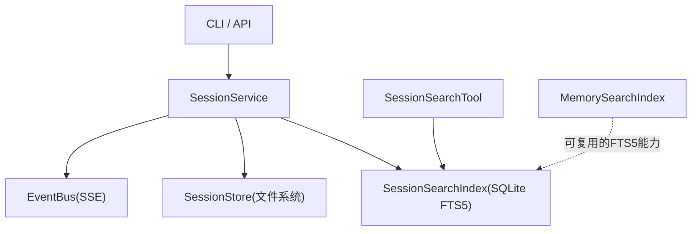
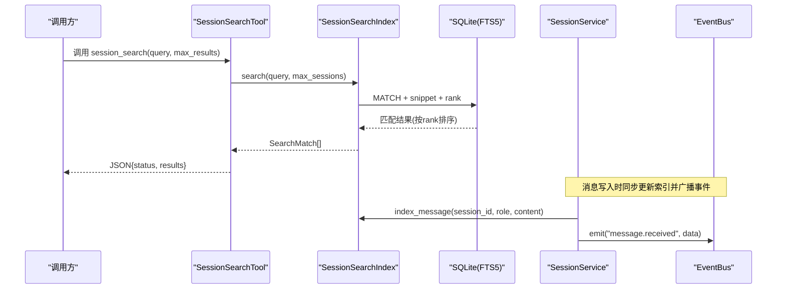
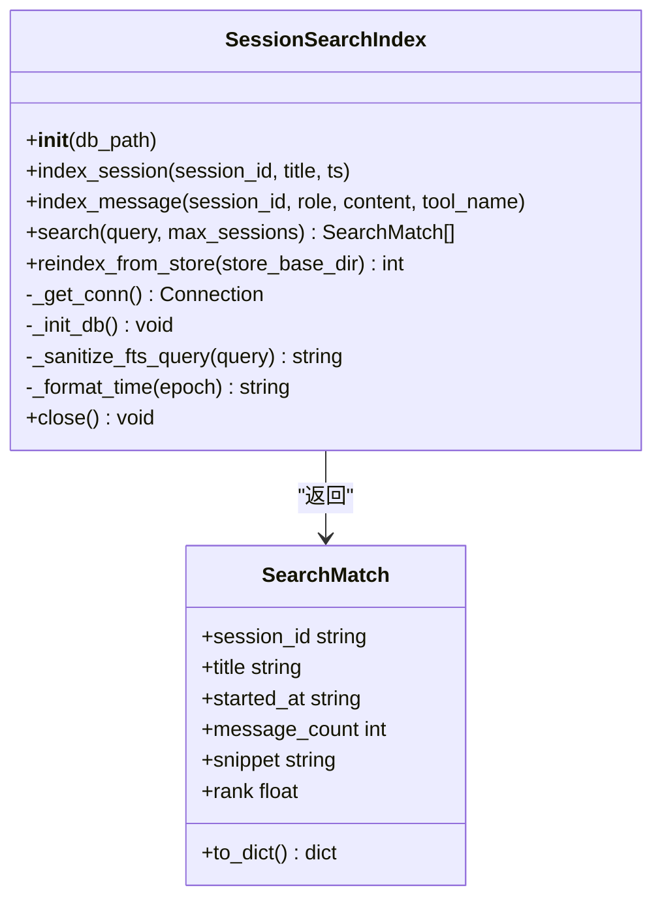
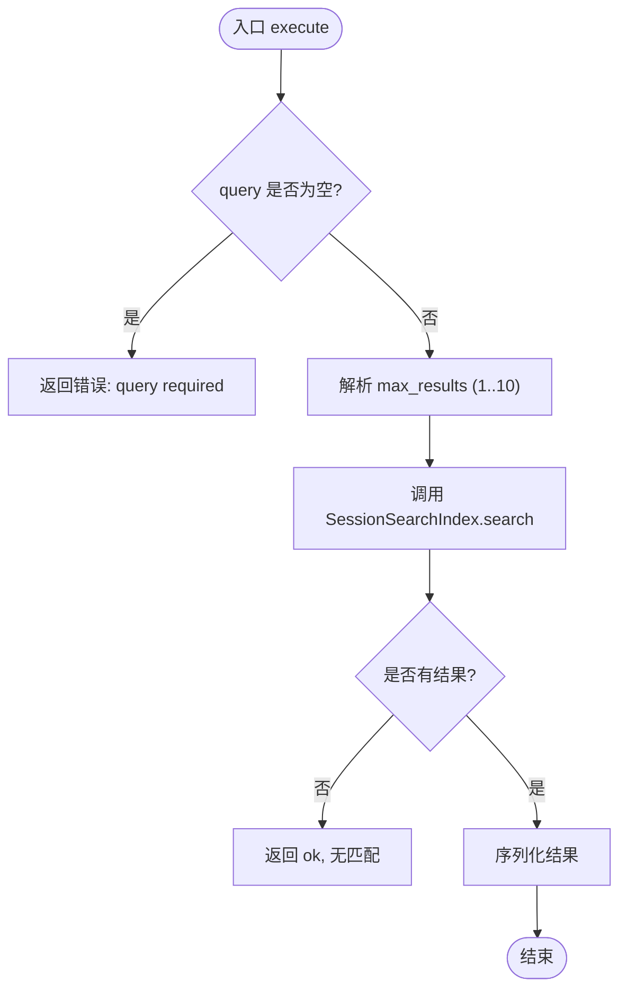
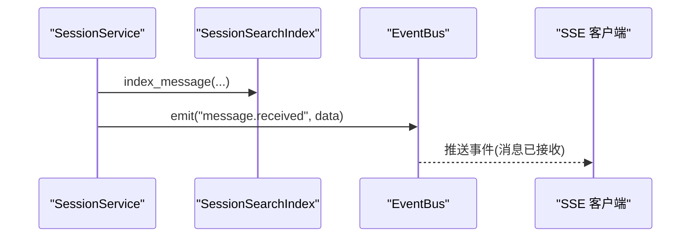
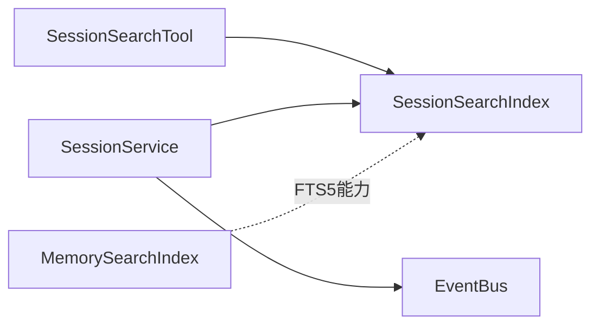

# 会话搜索功能

<cite>
**本文引用的文件**
- [agent/src/session/search.py](file://agent/src/session/search.py)
- [agent/src/tools/session_search_tool.py](file://agent/src/tools/session_search_tool.py)
- [agent/src/memory/search_index.py](file://agent/src/memory/search_index.py)
- [agent/tests/test_session_search.py](file://agent/tests/test_session_search.py)
- [agent/cli/main.py](file://agent/cli/main.py)
- [agent/src/session/service.py](file://agent/src/session/service.py)
- [agent/src/channels/bus/events.py](file://agent/src/channels/bus/events.py)
- [agent/src/api/sessions_routes.py](file://agent/src/api/sessions_routes.py)
</cite>

## 目录
1. [简介](#简介)
2. [项目结构](#项目结构)
3. [核心组件](#核心组件)
4. [架构总览](#架构总览)
5. [详细组件分析](#详细组件分析)
6. [依赖关系分析](#依赖关系分析)
7. [性能与调优](#性能与调优)
8. [故障排查指南](#故障排查指南)
9. [结论](#结论)
10. [附录：API 使用示例](#附录api-使用示例)

## 简介
本技术文档聚焦“会话搜索”能力，围绕跨会话的全文检索、消息检索、过滤查询、索引构建与更新策略、查询优化、事件总线联动、以及 API 使用与性能调优展开。系统基于 SQLite FTS5 实现倒排索引，提供低延迟、高吞吐的跨会话全文检索；通过触发器与批量重建机制保证索引与持久化数据的一致性；借助工具层暴露统一搜索接口，便于上层业务与前端消费。

## 项目结构
会话搜索相关代码主要分布在以下模块：
- 索引与查询：SessionSearchIndex（会话级 FTS5 索引）
- 工具封装：SessionSearchTool（对外暴露 session_search 工具）
- 内存记忆索引：MemorySearchIndex（通用记忆 FTS5 索引，供其他场景复用）
- CLI 集成：在会话创建/消息追加时触发索引更新
- 服务编排：SessionService 负责消息写入与事件广播，并调用索引更新
- 事件总线：EventBus 用于 SSE 事件流，驱动实时 UI 与外部订阅者

图表来源
- [agent/src/session/service.py:204-285](file://agent/src/session/service.py#L204-L285)
- [agent/src/session/search.py:60-135](file://agent/src/session/search.py#L60-L135)
- [agent/src/tools/session_search_tool.py:11-79](file://agent/src/tools/session_search_tool.py#L11-L79)
- [agent/src/memory/search_index.py:113-196](file://agent/src/memory/search_index.py#L113-L196)

章节来源
- [agent/src/session/search.py:1-135](file://agent/src/session/search.py#L1-L135)
- [agent/src/tools/session_search_tool.py:1-79](file://agent/src/tools/session_search_tool.py#L1-L79)
- [agent/src/memory/search_index.py:1-196](file://agent/src/memory/search_index.py#L1-L196)
- [agent/src/session/service.py:1-200](file://agent/src/session/service.py#L1-L200)

## 核心组件
- SessionSearchIndex：基于 SQLite FTS5 的跨会话全文索引，支持单条消息增量索引、按会话元信息 upsert、全量重建、相关性排序与片段高亮。
- SessionSearchTool：将搜索能力封装为可被 Agent 调用的工具，参数包含 query 与 max_results，返回 JSON 格式结果。
- MemorySearchIndex：通用记忆 FTS5 索引，具备 CJK 分词增强、去重、降级策略等，可作为参考实现。
- SessionService：会话生命周期编排，负责消息落盘、索引更新与事件广播。
- EventBus：进程内事件总线，提供 emit/subscribe/clear 能力，支撑 SSE 实时推送。

章节来源
- [agent/src/session/search.py:29-135](file://agent/src/session/search.py#L29-L135)
- [agent/src/tools/session_search_tool.py:11-79](file://agent/src/tools/session_search_tool.py#L11-L79)
- [agent/src/memory/search_index.py:96-196](file://agent/src/memory/search_index.py#L96-L196)
- [agent/src/session/service.py:53-200](file://agent/src/session/service.py#L53-L200)
- [agent/src/channels/bus/events.py:20-55](file://agent/src/channels/bus/events.py#L20-L55)

## 架构总览
下图展示了从用户输入到搜索结果返回的完整链路，包括索引构建、查询执行与事件广播。

图表来源
- [agent/src/tools/session_search_tool.py:37-79](file://agent/src/tools/session_search_tool.py#L37-L79)
- [agent/src/session/search.py:216-267](file://agent/src/session/search.py#L216-L267)
- [agent/src/session/service.py:244-285](file://agent/src/session/service.py#L244-L285)

## 详细组件分析

### SessionSearchIndex 设计与实现
- 数据库与表结构
  - sessions：会话元信息（id、title、started_at、message_count）
  - messages：消息明细（session_id、role、content、tool_name、timestamp），含按 session_id 的索引
  - messages_fts：FTS5 虚拟表，映射到 messages.content，自动维护
- 连接与并发
  - WAL 模式、NORMAL 同步策略，提升并发读性能
- 索引构建与更新
  - index_session：upsert 会话元信息，保留原始 started_at
  - index_message：插入消息并自增 message_count，触发器自动写入 FTS5
  - reindex_from_store：清空并重建索引，从文件系统读取 session.json 与 messages.jsonl
- 查询与相关性
  - _sanitize_fts_query：提取英文字母数字与 CJK 字符，转义并拼接 OR 表达式，避免注入
  - search：MATCH 查询 + snippet 高亮 + rank 排序，按 session 去重后返回前 N 个会话
- 线程安全与共享实例
  - get_shared_index：进程级单例，双检锁保护，确保多组件共享同一连接

图表来源
- [agent/src/session/search.py:29-135](file://agent/src/session/search.py#L29-L135)
- [agent/src/session/search.py:216-267](file://agent/src/session/search.py#L216-L267)

章节来源
- [agent/src/session/search.py:60-365](file://agent/src/session/search.py#L60-L365)

### SessionSearchTool 工具封装
- 入参校验：query 必填；max_results 默认 3，范围限制在 1..10
- 调用流程：获取共享索引 -> 执行 search -> 序列化结果或错误
- 输出格式：JSON，包含 status、query、results（每个结果包含 session_id、title、started_at、message_count、snippet）

图表来源
- [agent/src/tools/session_search_tool.py:37-79](file://agent/src/tools/session_search_tool.py#L37-L79)

章节来源
- [agent/src/tools/session_search_tool.py:1-79](file://agent/src/tools/session_search_tool.py#L1-L79)

### 内存记忆索引 MemorySearchIndex（参考实现）
- 特性
  - CJK 文本预处理：单字+二元组扩展，提升中文匹配召回
  - 查询清洗：生成 unigram/bigram 令牌，防止操作符注入
  - 降级策略：FTS5 不可用时记录日志并禁用搜索
  - 批量重建：rebuild_all 支持从内存数据源全量重建
- 适用场景：通用记忆检索、知识条目检索等

章节来源
- [agent/src/memory/search_index.py:96-481](file://agent/src/memory/search_index.py#L96-L481)

### 事件总线在搜索中的作用
- 实时索引更新
  - SessionService 在 append_message 后调用 index_message，确保消息落盘与索引更新一致
  - 同时通过 event_bus.emit 广播 message.received 事件，供 SSE 客户端实时展示
- 事件监听机制
  - 外部消费者可通过 event_bus.subscribe 订阅特定 session 的事件流
  - 删除会话时清理事件队列，避免泄漏

图表来源
- [agent/src/session/service.py:244-285](file://agent/src/session/service.py#L244-L285)
- [agent/src/channels/bus/events.py:20-55](file://agent/src/channels/bus/events.py#L20-L55)
- [agent/src/api/sessions_routes.py:747-778](file://agent/src/api/sessions_routes.py#L747-L778)

章节来源
- [agent/src/session/service.py:204-285](file://agent/src/session/service.py#L204-L285)
- [agent/src/channels/bus/events.py:20-55](file://agent/src/channels/bus/events.py#L20-L55)
- [agent/src/api/sessions_routes.py:747-778](file://agent/src/api/sessions_routes.py#L747-L778)

### 搜索算法与查询语法
- 关键词匹配
  - 提取英文字母数字（长度≥2）与 CJK 字符作为 token
  - 以 OR 连接各 token，放宽匹配条件，提高召回率
- 模糊搜索
  - 依赖 FTS5 内置匹配能力；CJK 采用单字+二元组扩展（在 MemorySearchIndex 中体现）
- 相关性排序
  - 使用 FTS5 的 rank 字段进行排序，命中次数越多、位置越靠前，得分越高
- 片段高亮
  - 使用 snippet 函数返回带标记的上下文片段，便于前端展示

章节来源
- [agent/src/session/search.py:194-267](file://agent/src/session/search.py#L194-L267)
- [agent/src/memory/search_index.py:357-445](file://agent/src/memory/search_index.py#L357-L445)

### 索引构建与更新策略
- 增量更新
  - 每次新增消息都通过触发器自动写入 FTS5，保证一致性
- 批量重建
  - reindex_from_store 清空索引并从文件系统恢复，适用于迁移、修复或首次初始化
- 时间戳保持
  - index_session 在不显式传入 ts 时保留原有 started_at，避免覆盖历史时间

章节来源
- [agent/src/session/search.py:137-192](file://agent/src/session/search.py#L137-L192)
- [agent/src/session/search.py:269-329](file://agent/src/session/search.py#L269-L329)

### CLI 与集成点
- CLI 在会话创建与消息追加时调用索引更新，确保跨会话搜索可用
- 异常处理：索引失败不影响主流程，仅记录日志

章节来源
- [agent/cli/main.py:425-461](file://agent/cli/main.py#L425-L461)

## 依赖关系分析
- SessionSearchIndex 依赖 SQLite 与 FTS5 扩展
- SessionSearchTool 依赖 SessionSearchIndex 的单例访问
- SessionService 依赖 SessionSearchIndex 与 EventBus
- MemorySearchIndex 独立于会话索引，但可复用相同 FTS5 能力

图表来源
- [agent/src/tools/session_search_tool.py:63-79](file://agent/src/tools/session_search_tool.py#L63-L79)
- [agent/src/session/service.py:244-285](file://agent/src/session/service.py#L244-L285)
- [agent/src/memory/search_index.py:113-196](file://agent/src/memory/search_index.py#L113-L196)

章节来源
- [agent/src/tools/session_search_tool.py:1-79](file://agent/src/tools/session_search_tool.py#L1-L79)
- [agent/src/session/service.py:1-200](file://agent/src/session/service.py#L1-L200)
- [agent/src/memory/search_index.py:1-196](file://agent/src/memory/search_index.py#L1-L196)

## 性能与调优
- 数据库配置
  - WAL 模式与 NORMAL 同步策略，提升并发读性能与稳定性
- 查询优化
  - 使用 FTS5 MATCH 与 snippet，减少应用层处理开销
  - 通过 LIMIT 控制返回数量，避免大结果集
  - 对查询进行清洗，避免无效 token 与注入风险
- 索引维护
  - 增量更新为主，批量重建用于修复与迁移
  - 定期监控 FTS5 健康状态，必要时重建
- 大数据量处理
  - 合理设置 max_sessions，控制结果集规模
  - 关注磁盘 I/O 与 SQLite 并发，必要时调整连接池或分库

[本节为通用指导，不直接分析具体文件]

## 故障排查指南
- FTS5 不可用
  - 现象：搜索返回空列表或报错
  - 处理：检查 SQLite 是否启用 FTS5；MemorySearchIndex 会降级并记录日志
- 索引不一致
  - 现象：搜索不到新消息
  - 处理：确认 index_message 是否被调用；必要时执行 reindex_from_store
- 查询为空或特殊字符
  - 现象：无结果或异常
  - 处理：使用 _sanitize_fts_query 清洗；测试边界用例
- 事件未推送
  - 现象：前端未收到 message.received
  - 处理：检查 EventBus.emit 与 SSE 路由是否正常

章节来源
- [agent/src/memory/search_index.py:160-173](file://agent/src/memory/search_index.py#L160-L173)
- [agent/src/session/search.py:247-249](file://agent/src/session/search.py#L247-L249)
- [agent/src/session/service.py:244-285](file://agent/src/session/service.py#L244-L285)

## 结论
会话搜索通过 SQLite FTS5 实现了高效、可扩展的跨会话全文检索。SessionSearchIndex 提供稳定的索引构建与查询能力，SessionSearchTool 将其封装为易用的工具接口，SessionService 保障消息写入与索引更新的原子性，并通过 EventBus 实现实时事件推送。结合合理的查询清洗、相关性排序与片段高亮，系统在准确性与性能之间取得良好平衡。对于大规模数据，建议配合批量重建与监控策略，确保索引健康与查询稳定。

[本节为总结，不直接分析具体文件]

## 附录：API 使用示例
- 工具名称：session_search
- 必需参数
  - query：字符串，搜索关键词或短语
- 可选参数
  - max_results：整数，默认 3，最大 10
- 返回格式
  - status：ok 或 error
  - query：原始查询
  - results：数组，每项包含 session_id、title、started_at、message_count、snippet
- 示例
  - 查询“比特币价格”，返回最多 3 个会话，包含匹配片段与相关性排序

章节来源
- [agent/src/tools/session_search_tool.py:20-79](file://agent/src/tools/session_search_tool.py#L20-L79)