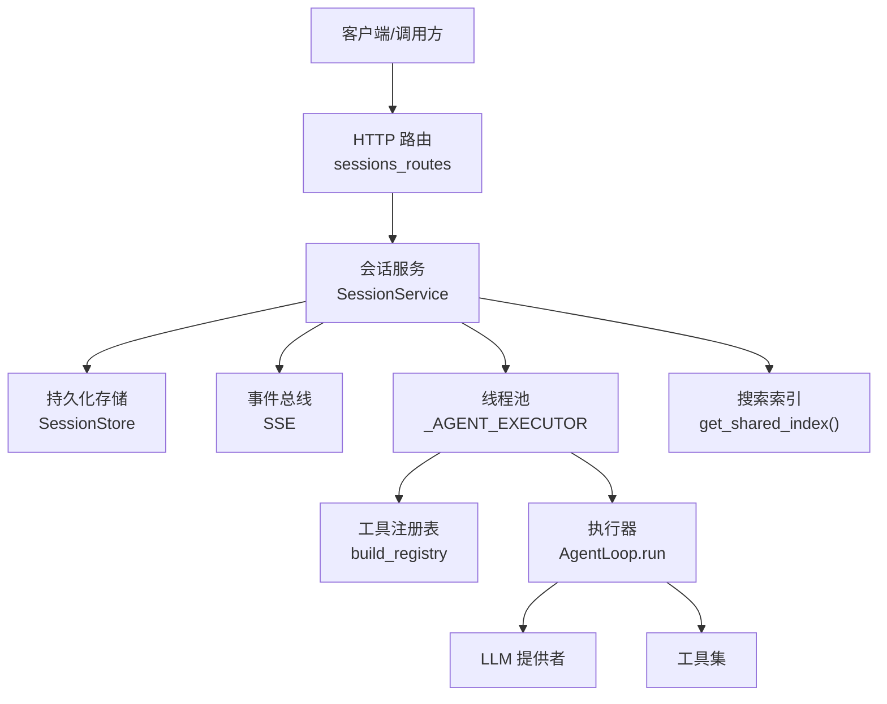
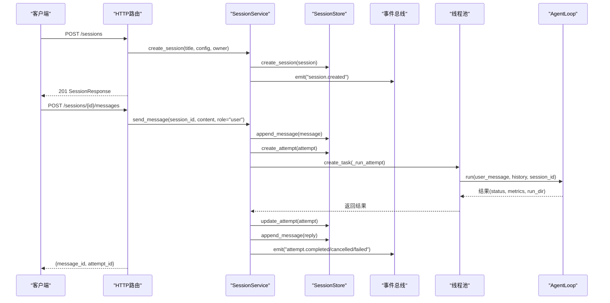
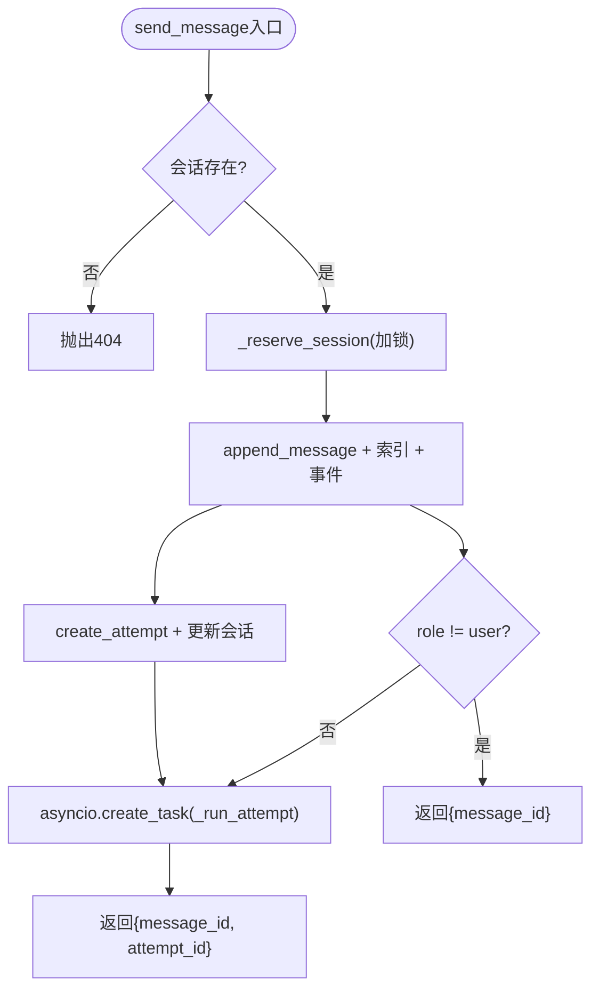
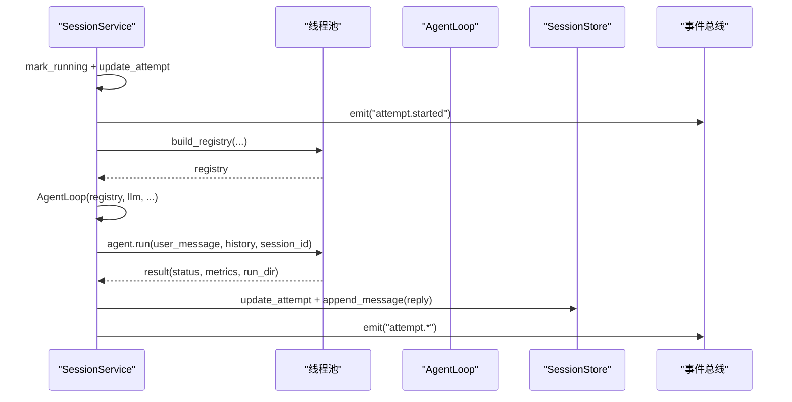
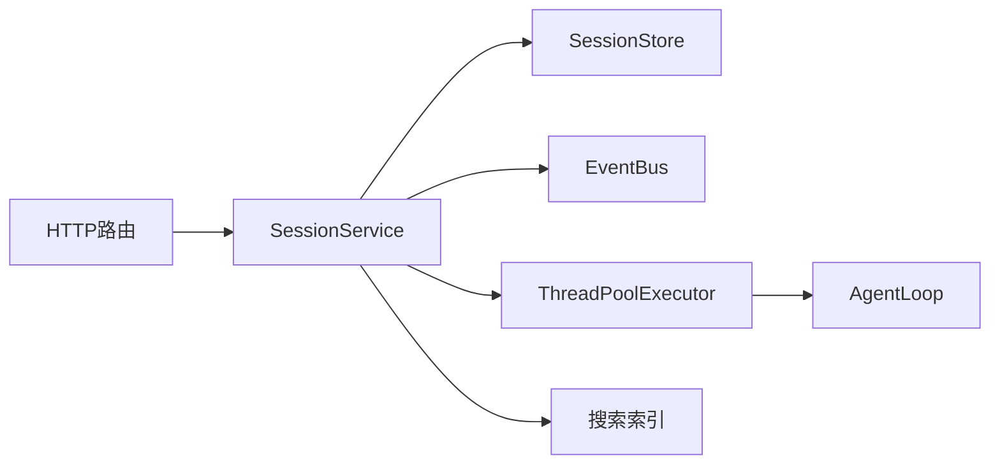

# 会话生命周期管理

<cite>
**本文引用的文件**
- [agent/src/session/service.py](file://agent/src/session/service.py)
- [agent/src/agent/loop.py](file://agent/src/agent/loop.py)
- [agent/src/api/sessions_routes.py](file://agent/src/api/sessions_routes.py)
- [agent/src/session/models.py](file://agent/src/session/models.py)
- [agent/src/session/store.py](file://agent/src/session/store.py)
</cite>

## 目录
1. [简介](#简介)
2. [项目结构](#项目结构)
3. [核心组件](#核心组件)
4. [架构总览](#架构总览)
5. [详细组件分析](#详细组件分析)
6. [依赖关系分析](#依赖关系分析)
7. [性能考量](#性能考量)
8. [故障排查指南](#故障排查指南)
9. [结论](#结论)
10. [附录：API调用示例与错误处理](#附录api调用示例与错误处理)

## 简介
本技术文档围绕会话（Session）的完整生命周期展开，覆盖创建、激活、执行、取消与销毁等阶段。重点解析 SessionService 的核心方法 create_session、send_message、cancel_current 的实现原理与使用方式，说明会话状态管理机制（并发控制、锁机制、任务调度），解释会话与 AgentLoop 的绑定关系，以及多会话环境下的数据一致性保障。同时提供 API 调用示例、错误处理策略、资源清理、内存管理与性能优化建议。

## 项目结构
会话生命周期由以下模块协同完成：
- 会话服务层：SessionService 负责会话编排、消息入队、尝试（Attempt）创建与执行调度、事件广播、并发控制与取消。
- 执行引擎层：AgentLoop 作为 ReAct 核心循环，承载工具注册、上下文构建、LLM 交互、工具执行与结果聚合。
- 持久化层：SessionStore 基于文件系统存储会话、消息日志与尝试记录。
- HTTP 路由层：sessions_routes 暴露 REST/SSE 接口，将外部请求映射到 SessionService。
- 数据模型层：models 定义 Session、Message、Attempt 等实体及状态枚举。

图表来源
- [agent/src/api/sessions_routes.py:335-728](file://agent/src/api/sessions_routes.py#L335-L728)
- [agent/src/session/service.py:118-440](file://agent/src/session/service.py#L118-L440)
- [agent/src/session/store.py:16-200](file://agent/src/session/store.py#L16-L200)
- [agent/src/agent/loop.py:1-200](file://agent/src/agent/loop.py#L1-L200)

章节来源
- [agent/src/session/service.py:1-605](file://agent/src/session/service.py#L1-L605)
- [agent/src/api/sessions_routes.py:1-800](file://agent/src/api/sessions_routes.py#L1-L800)
- [agent/src/session/store.py:1-200](file://agent/src/session/store.py#L1-L200)
- [agent/src/agent/loop.py:1-200](file://agent/src/agent/loop.py#L1-L200)

## 核心组件
- SessionService：会话生命周期编排者，负责消息写入、尝试创建、异步执行调度、事件广播、并发控制与取消。
- AgentLoop：ReAct 执行循环，负责上下文构建、工具调用、LLM 交互、结果汇总与指标收集。
- SessionStore：文件系统持久化，维护 sessions/{id}/session.json、messages.jsonl、attempts/{attempt_id}/attempt.json。
- HTTP 路由：FastAPI 路由将 /sessions、/sessions/{id}/messages、/sessions/{id}/cancel、/sessions/{id}/events 等映射到服务方法。
- 数据模型：Session、Message、Attempt 及其状态枚举（SessionStatus、AttemptStatus）。

章节来源
- [agent/src/session/service.py:53-117](file://agent/src/session/service.py#L53-L117)
- [agent/src/session/models.py:121-342](file://agent/src/session/models.py#L121-L342)
- [agent/src/session/store.py:16-200](file://agent/src/session/store.py#L16-L200)
- [agent/src/api/sessions_routes.py:335-728](file://agent/src/api/sessions_routes.py#L335-L728)

## 架构总览
会话从创建到销毁的关键路径如下：
- 创建：POST /sessions -> SessionService.create_session -> 持久化 + 索引 + 事件 session.created
- 发送消息：POST /sessions/{id}/messages -> SessionService.send_message -> 写入消息 + 创建 Attempt + 异步执行
- 执行：_run_attempt -> _run_with_agent -> 构建工具注册表 -> 实例化 AgentLoop -> run(user_message, history, session_id)
- 取消：POST /sessions/{id}/cancel -> cancel_current -> 若已存在 AgentLoop 则调用 cancel；否则取消后台 Task
- 销毁：DELETE /sessions/{id} -> delete_session -> 清空事件订阅 + 删除目录

图表来源
- [agent/src/api/sessions_routes.py:335-728](file://agent/src/api/sessions_routes.py#L335-L728)
- [agent/src/session/service.py:118-440](file://agent/src/session/service.py#L118-L440)
- [agent/src/session/store.py:63-204](file://agent/src/session/store.py#L63-L204)

## 详细组件分析

### 会话服务 SessionService
- 并发控制
  - 使用线程锁 _inflight_lock 保护 _inflight set，确保同一会话仅有一个 in-flight 运行。
  - _reserve_session 在用户消息进入时抢占式锁定，避免重复创建多个 Attempt。
  - _release_session 在 finally 中释放，保证异常或取消也能释放锁。
- 任务调度
  - 通过 asyncio.create_task 启动后台协程 _run_attempt。
  - 使用 ThreadPoolExecutor(max_workers=4) 限制并行 Agent 数量，避免阻塞事件循环。
- 取消机制
  - cancel_current 优先查找 _active_loops 中的 AgentLoop 并调用 cancel；若尚未构建完成，则取消后台 Task。
- 事件与索引
  - 所有关键节点通过 event_bus.emit 广播事件（session.created、message.received、attempt.created/started/completed/cancelled/failed）。
  - 使用共享搜索索引对会话和消息进行索引，支持后续检索。
- 历史压缩
  - _convert_messages_to_history 将消息转换为 OpenAI 格式，按字符预算裁剪，保留最近上下文，避免超出 token 限制。

图表来源
- [agent/src/session/service.py:244-307](file://agent/src/session/service.py#L244-L307)

章节来源
- [agent/src/session/service.py:179-307](file://agent/src/session/service.py#L179-L307)

### 执行流程 _run_attempt 与 _run_with_agent
- _run_attempt
  - 标记 Attempt 为 RUNNING，持久化状态，发出 attempt.started。
  - 读取会话消息历史，调用 _run_with_agent 执行。
  - 根据结果设置 Attempt 状态（completed/cancelled/failed），写出回复消息，发出终止事件。
  - 统一在 finally 中释放任务句柄与会话占用。
- _run_with_agent
  - 构建工具注册表（build_registry），注入事件回调以转发 tool_call/tool_result。
  - 实例化 AgentLoop，传入 LLM、持久化记忆、最大迭代次数等参数。
  - 将 AgentLoop 放入 _active_loops 以便取消。
  - 在 executor 中运行 agent.run，完成后加载 metrics.csv 指标。

图表来源
- [agent/src/session/service.py:248-440](file://agent/src/session/service.py#L248-L440)

章节来源
- [agent/src/session/service.py:248-440](file://agent/src/session/service.py#L248-L440)

### 会话与 AgentLoop 的绑定关系
- 绑定时机：在 _run_with_agent 中构建完工具注册表后，将 AgentLoop 实例存入 _active_loops[session_id]。
- 取消传播：cancel_current 直接调用 loop.cancel()，使 AgentLoop 内部可感知取消信号，实现协作式取消。
- 生命周期：AgentLoop 结束后从 _active_loops 移除，确保不会泄漏引用。

章节来源
- [agent/src/session/service.py:346-440](file://agent/src/session/service.py#L346-L440)
- [agent/src/session/service.py:227-246](file://agent/src/session/service.py#L227-L246)

### 数据一致性与多会话隔离
- 单会话串行：通过 _inflight 集合与线程锁保证同一会话只有一个 in-flight 运行，避免消息交错与 Attempt 竞争。
- 多会话并行：不同 session_id 互不干扰，各自独立占用锁与任务句柄。
- 持久化原子性：消息采用追加模式 JSONL，每次写入 flush+fsync，降低丢失风险；会话与尝试使用 JSON 文件读写。
- 事件一致性：所有状态变更均伴随事件广播，便于 UI 实时同步与回放。

章节来源
- [agent/src/session/service.py:179-202](file://agent/src/session/service.py#L179-L202)
- [agent/src/session/store.py:155-166](file://agent/src/session/store.py#L155-L166)

### 状态机与模型
- SessionStatus：ACTIVE、COMPLETED、ARCHIVED
- AttemptStatus：PENDING、RUNNING、WAITING_USER、COMPLETED、FAILED、CANCELLED
- Message：包含角色、内容、关联 Attempt 与元数据、工具轨迹
- Principal：认证主体，区分是否可归因于具体人类

章节来源
- [agent/src/session/models.py:121-342](file://agent/src/session/models.py#L121-L342)

## 依赖关系分析
- SessionService 依赖：
  - SessionStore：会话、消息、尝试的持久化
  - EventBus：SSE 事件广播
  - ThreadPoolExecutor：限制 Agent 并发度
  - AgentLoop：执行 ReAct 循环
  - 搜索索引：会话与消息检索
- HTTP 路由依赖：
  - FastAPI：路由与流式响应
  - 认证依赖：require_auth、require_event_stream_auth
  - 宿主模块：动态获取 SessionService 实例

图表来源
- [agent/src/api/sessions_routes.py:320-360](file://agent/src/api/sessions_routes.py#L320-L360)
- [agent/src/session/service.py:30-91](file://agent/src/session/service.py#L30-L91)

章节来源
- [agent/src/api/sessions_routes.py:320-360](file://agent/src/api/sessions_routes.py#L320-L360)
- [agent/src/session/service.py:30-91](file://agent/src/session/service.py#L30-L91)

## 性能考量
- 并发限制：ThreadPoolExecutor(max_workers=4) 防止默认执行器被耗尽，避免阻塞事件循环。
- 历史裁剪：_convert_messages_to_history 按字符预算裁剪，减少 LLM 输入大小，降低延迟与成本。
- 指标加载：仅在存在 run_dir 时加载 metrics.csv，避免不必要的 I/O。
- 事件开销：tool_call/tool_result 事件会被合并为 compact 的 tool_trail，减少冗余传输。
- 建议
  - 合理调整 max_iterations 与 token 预算，平衡质量与耗时。
  - 在高并发场景下评估线程池大小与系统资源。
  - 定期归档或清理旧会话与运行产物，控制磁盘增长。

章节来源
- [agent/src/session/service.py:32-33](file://agent/src/session/service.py#L32-L33)
- [agent/src/session/service.py:649-699](file://agent/src/session/service.py#L649-L699)
- [agent/src/session/service.py:567-581](file://agent/src/session/service.py#L567-L581)

## 故障排查指南
- 会话忙（409）
  - 现象：发送消息返回“会话已有运行中”的错误。
  - 原因：同一会话并发冲突，已被 _reserve_session 拒绝。
  - 处理：等待当前尝试结束或调用取消接口。
- 会话不存在（404）
  - 现象：操作失败提示未找到会话。
  - 原因：会话 ID 无效或已被删除。
  - 处理：检查路由参数与会话列表。
- 执行失败
  - 现象：attempt.failed 事件携带 error 信息。
  - 原因：工具执行异常、LLM 调用失败、配置错误等。
  - 处理：查看错误详情与运行产物，必要时重试或修正配置。
- 取消无效
  - 现象：取消返回 no_active_loop。
  - 原因：无活动 AgentLoop 且无活跃 Task。
  - 处理：确认会话是否已结束或从未开始。

章节来源
- [agent/src/api/sessions_routes.py:732-763](file://agent/src/api/sessions_routes.py#L732-L763)
- [agent/src/session/service.py:227-246](file://agent/src/session/service.py#L227-L246)
- [agent/src/session/service.py:325-344](file://agent/src/session/service.py#L325-L344)

## 结论
SessionService 通过严格的并发控制、清晰的异步任务调度与完善的事件机制，实现了会话生命周期的可靠管理。与 AgentLoop 的解耦设计使得执行逻辑可替换、可扩展；文件系统持久化保证了数据的可恢复性与可观测性。结合 SSE 事件流，前端可实现实时反馈与回放。整体架构在多会话环境下具备良好的一致性与扩展性。

## 附录：API调用示例与错误处理

- 创建会话
  - 端点：POST /sessions
  - 请求体：{title, config}
  - 成功：201 SessionResponse
  - 失败：501（会话运行时未启用）
- 发送消息
  - 端点：POST /sessions/{session_id}/messages
  - 请求体：{content}
  - 成功：200 {message_id, attempt_id}
  - 失败：404（会话不存在）、409（会话忙）
- 取消会话
  - 端点：POST /sessions/{session_id}/cancel
  - 成功：200 {status: "cancelled"}
  - 无活动：200 {status: "no_active_loop"}
- 获取消息
  - 端点：GET /sessions/{session_id}/messages?limit=N
  - 成功：200 [MessageResponse...]
- 事件流
  - 端点：GET /sessions/{session_id}/events?Last-Event-ID=...&replay=active|all
  - 类型：text/event-stream
  - 事件：session.created、message.received、attempt.created/started/completed/cancelled/failed、tool_call/tool_result、mcp.warning、mandate.proposal、live.action

错误处理要点
- 409 会话忙：调用方应轮询或等待取消后再发新消息。
- 404 会话不存在：校验 session_id 有效性。
- 501 会话运行时未启用：检查宿主模块是否正确初始化 SessionService。
- 事件流断开：支持 Last-Event-ID 断线续传与 replay 模式。

章节来源
- [agent/src/api/sessions_routes.py:335-800](file://agent/src/api/sessions_routes.py#L335-L800)