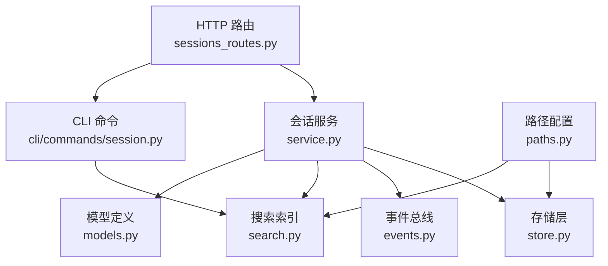
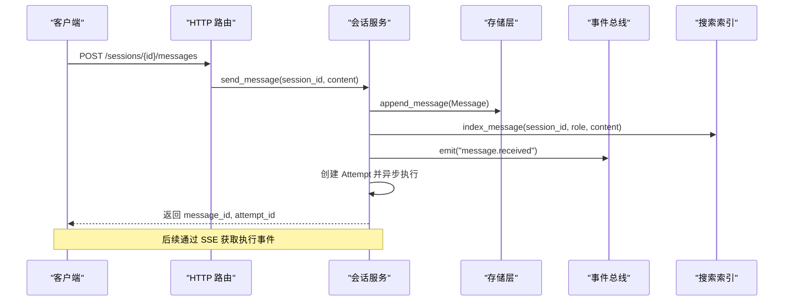
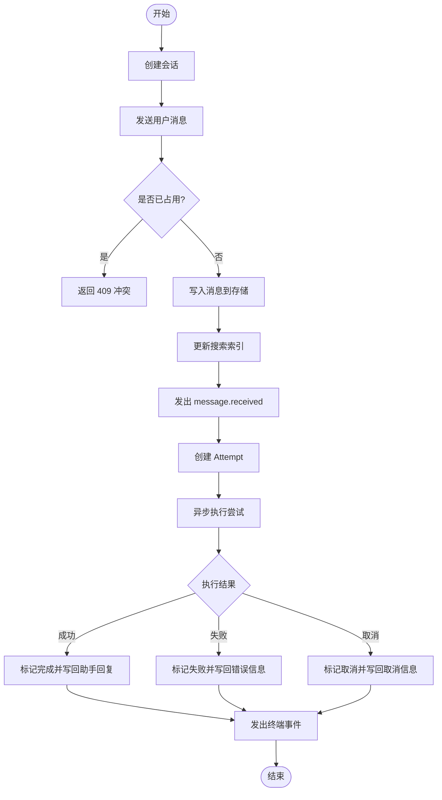
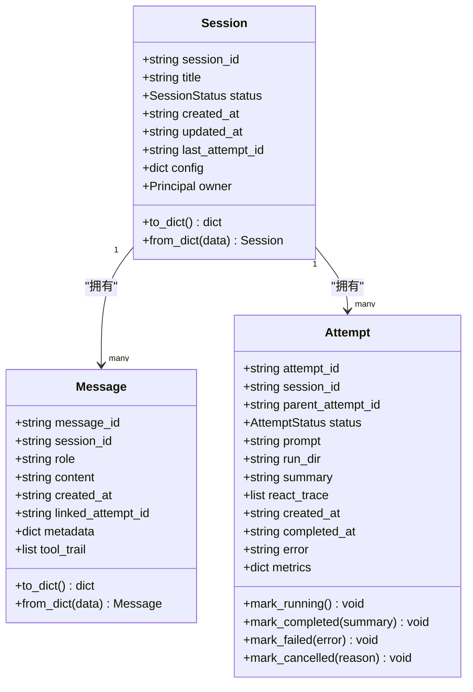
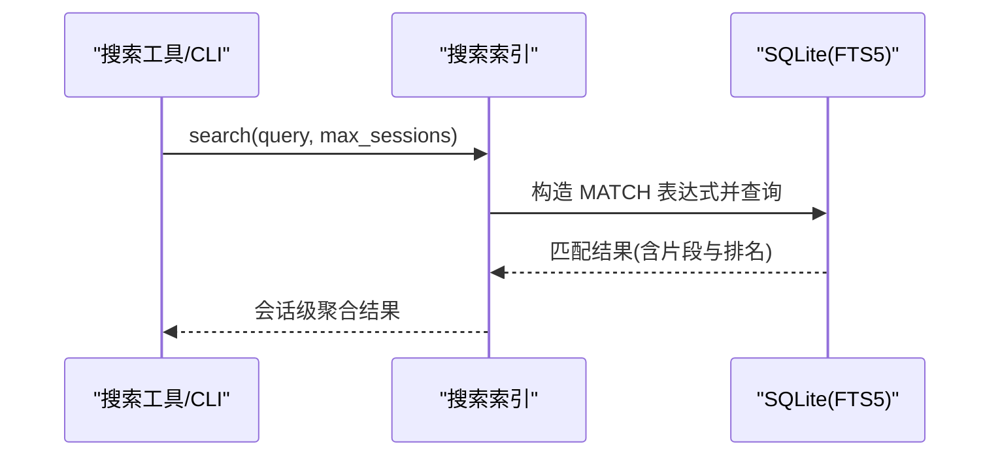
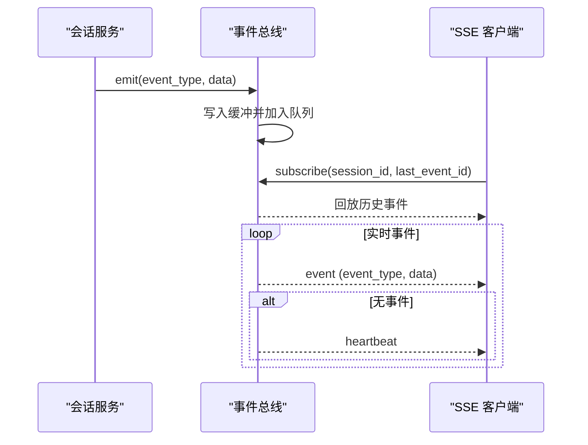
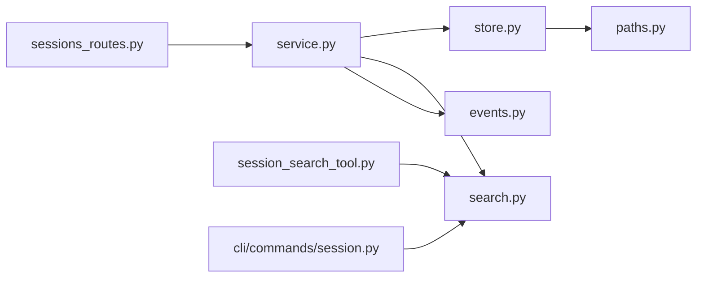

# 会话管理机制

<cite>
**本文引用的文件**
- [sessions_routes.py](file://agent/src/api/sessions_routes.py)
- [service.py](file://agent/src/session/service.py)
- [store.py](file://agent/src/session/store.py)
- [models.py](file://agent/src/session/models.py)
- [search.py](file://agent/src/session/search.py)
- [events.py](file://agent/src/session/events.py)
- [session_search_tool.py](file://agent/src/tools/session_search_tool.py)
- [paths.py](file://agent/src/config/paths.py)
- [webui_turns.py](file://agent/src/session/webui_turns.py)
</cite>

## 目录
1. [简介](#简介)
2. [项目结构](#项目结构)
3. [核心组件](#核心组件)
4. [架构总览](#架构总览)
5. [详细组件分析](#详细组件分析)
6. [依赖关系分析](#依赖关系分析)
7. [性能考量](#性能考量)
8. [故障排查指南](#故障排查指南)
9. [结论](#结论)
10. [附录：API 接口与使用示例](#附录api-接口与使用示例)

## 简介
本技术文档聚焦于会话管理系统，覆盖会话生命周期管理（创建、状态持久化、消息历史）、存储机制（本地文件系统、序列化、版本兼容）、模型设计（消息结构、元数据、索引）、搜索检索（全文搜索、过滤、分页）、以及 API 接口与高级主题（迁移、备份恢复、性能优化）。目标是帮助应用开发者快速理解并正确使用该系统的会话能力。

## 项目结构
会话相关代码主要分布在以下模块：
- API 路由层：暴露 HTTP 接口，负责鉴权、参数校验、调用服务层
- 服务层：编排会话生命周期、消息写入、尝试执行、事件发布
- 存储层：基于本地文件系统的会话、消息、尝试记录持久化
- 模型层：Session、Message、Attempt、Principal 等数据结构定义
- 搜索层：SQLite FTS5 跨会话全文索引与查询
- 事件总线：SSE 事件流，支持断线重连与回放
- CLI 工具：提供 /history、/search 等命令
- 路径配置：运行时根目录、会话目录、运行产物目录等

图表来源
- [sessions_routes.py:289-800](file://agent/src/api/sessions_routes.py#L289-L800)
- [service.py:53-225](file://agent/src/session/service.py#L53-L225)
- [store.py:16-259](file://agent/src/session/store.py#L16-L259)
- [search.py:60-365](file://agent/src/session/search.py#L60-L365)
- [events.py:57-265](file://agent/src/session/events.py#L57-L265)
- [paths.py:13-44](file://agent/src/config/paths.py#L13-L44)

章节来源
- [sessions_routes.py:289-800](file://agent/src/api/sessions_routes.py#L289-L800)
- [service.py:53-225](file://agent/src/session/service.py#L53-L225)
- [store.py:16-259](file://agent/src/session/store.py#L16-L259)
- [search.py:60-365](file://agent/src/session/search.py#L60-L365)
- [events.py:57-265](file://agent/src/session/events.py#L57-L265)
- [paths.py:13-44](file://agent/src/config/paths.py#L13-L44)

## 核心组件
- 会话服务（SessionService）：负责会话创建、消息发送、尝试执行、取消、事件广播、搜索索引更新
- 存储（SessionStore）：以 JSON/JSONL 形式持久化会话、消息、尝试；提供列表、追加、读取、删除
- 模型（Session/Message/Attempt/Principal）：统一的数据结构与序列化/反序列化
- 事件总线（EventBus）：线程安全的 SSE 事件发布/订阅，支持缓冲、回放、心跳
- 搜索索引（SessionSearchIndex）：SQLite FTS5 跨会话全文索引，支持增量索引与全量重建
- CLI 命令：/history、/search、/export 等便捷操作
- 路径配置：运行时根目录、会话目录、运行产物目录

章节来源
- [service.py:53-225](file://agent/src/session/service.py#L53-L225)
- [store.py:16-259](file://agent/src/session/store.py#L16-L259)
- [models.py:121-342](file://agent/src/session/models.py#L121-L342)
- [events.py:57-265](file://agent/src/session/events.py#L57-L265)
- [search.py:60-365](file://agent/src/session/search.py#L60-L365)
- [paths.py:13-44](file://agent/src/config/paths.py#L13-L44)

## 架构总览
系统采用分层架构：
- 路由层：FastAPI 路由，鉴权后委托给服务层
- 服务层：编排业务逻辑，维护并发控制（每会话单任务），触发事件与索引更新
- 存储层：本地文件系统 JSON/JSONL，保证基本原子性与可读性
- 搜索层：SQLite FTS5 提供跨会话全文检索
- 事件层：SSE 实时推送，支持断线重连与回放

图表来源
- [sessions_routes.py:732-751](file://agent/src/api/sessions_routes.py#L732-L751)
- [service.py:244-311](file://agent/src/session/service.py#L244-L311)
- [store.py:155-166](file://agent/src/session/store.py#L155-L166)
- [search.py:170-192](file://agent/src/session/search.py#L170-L192)
- [events.py:171-193](file://agent/src/session/events.py#L171-L193)

## 详细组件分析

### 会话生命周期管理
- 创建会话：路由接收请求，服务层创建 Session，持久化到 store，更新搜索索引，发出 session.created 事件
- 发送消息：服务层先预留会话（防止并发重复执行），写入消息，更新搜索索引，发出 message.received 事件，创建 Attempt 并异步执行
- 尝试执行：后台任务标记 running，加载历史上下文，执行 AgentLoop，根据结果更新 Attempt 状态，写出 assistant 回复，发出完成/失败/取消事件
- 取消执行：可取消正在构建的注册表任务或已运行的 AgentLoop，释放会话占用

图表来源
- [sessions_routes.py:366-393](file://agent/src/api/sessions_routes.py#L366-L393)
- [sessions_routes.py:732-763](file://agent/src/api/sessions_routes.py#L732-L763)
- [service.py:204-311](file://agent/src/session/service.py#L204-L311)
- [service.py:248-345](file://agent/src/session/service.py#L248-L345)

章节来源
- [sessions_routes.py:366-393](file://agent/src/api/sessions_routes.py#L366-L393)
- [sessions_routes.py:732-763](file://agent/src/api/sessions_routes.py#L732-L763)
- [service.py:204-311](file://agent/src/session/service.py#L204-L311)
- [service.py:248-345](file://agent/src/session/service.py#L248-L345)

### 会话存储机制
- 目录结构：每个会话一个子目录，包含 session.json、messages.jsonl、attempts/{attempt_id}/attempt.json
- 序列化：Session/Message/Attempt 均提供 to_dict/from_dict，JSON 文本存储；消息为 JSONL 追加日志
- 版本兼容：从字典反序列化时处理枚举字段（如 status），对 owner 进行安全重建；读取损坏条目时跳过并记录警告
- 持久化策略：消息写入后 flush/fsync 确保落盘；列表按 updated_at 倒序并限制数量

图表来源
- [models.py:121-342](file://agent/src/session/models.py#L121-L342)
- [store.py:16-259](file://agent/src/session/store.py#L16-L259)

章节来源
- [store.py:16-259](file://agent/src/session/store.py#L16-L259)
- [models.py:121-342](file://agent/src/session/models.py#L121-L342)

### 会话模型设计
- 会话（Session）：标识、标题、状态、时间戳、最近尝试 ID、配置、所有者（Principal）
- 消息（Message）：角色（user/assistant/system）、内容、关联尝试 ID、元数据、工具轨迹
- 尝试（Attempt）：执行上下文、状态机（pending/running/waiting_user/completed/failed/cancelled）、指标、摘要、错误
- 主体（Principal）：认证方法、归属、是否可归因（attributable），用于审计与合规

章节来源
- [models.py:121-342](file://agent/src/session/models.py#L121-L342)

### 搜索与检索
- 索引机制：SQLite FTS5 虚拟表，自动触发器同步 messages 表；会话表记录标题、开始时间、消息计数
- 增量索引：新增消息时插入 messages 表并更新 sessions.message_count
- 全文搜索：对用户查询进行清洗与分词，生成 FTS5 MATCH 表达式，按相关性排序，返回会话级聚合结果与片段
- 全量重建：清空索引并从文件系统重新扫描所有会话与消息，恢复真实开始时间
- CLI 与工具：/search 命令与 session_search 工具均可调用共享索引

图表来源
- [search.py:194-267](file://agent/src/session/search.py#L194-L267)
- [session_search_tool.py:37-79](file://agent/src/tools/session_search_tool.py#L37-L79)
- [session.py:38-67](file://agent/cli/commands/session.py#L38-L67)

章节来源
- [search.py:60-365](file://agent/src/session/search.py#L60-L365)
- [session_search_tool.py:1-79](file://agent/src/tools/session_search_tool.py#L1-L79)
- [session.py:1-99](file://agent/cli/commands/session.py#L1-L99)

### 事件与实时通信
- 事件类型：session.created、message.received、attempt.created、attempt.started、attempt.completed/failed/cancelled、goal.*、mcp.warning、heartbeat
- 缓冲与回放：每会话事件缓冲，支持 last_event_id 重放；活跃运行可 replay_all 拉取完整缓冲
- 心跳：订阅超时发送心跳事件，保持连接活性
- 清理：删除会话时清除缓冲并通知订阅者

图表来源
- [events.py:57-265](file://agent/src/session/events.py#L57-L265)
- [sessions_routes.py:752-800](file://agent/src/api/sessions_routes.py#L752-L800)

章节来源
- [events.py:57-265](file://agent/src/session/events.py#L57-L265)
- [sessions_routes.py:752-800](file://agent/src/api/sessions_routes.py#L752-L800)

### WebUI 轮次计时辅助
- 记录 WebSocket 聊天轮次的开始时间，便于计算耗时与展示
- 提供标记、清理、查询当前轮次开始时间的工具函数

章节来源
- [webui_turns.py:1-28](file://agent/src/session/webui_turns.py#L1-L28)

## 依赖关系分析
- 路由依赖服务：sessions_routes.py 通过宿主模块注入 SessionService，调用其 CRUD 与消息发送
- 服务依赖存储与索引：service.py 使用 store 持久化数据，使用 search 索引消息，使用 events 广播事件
- 存储依赖路径配置：store.py 使用 paths.py 确定运行时根目录与会话目录
- 搜索工具与 CLI 共享索引：session_search_tool.py 与 cli/commands/session.py 均通过 get_shared_index() 访问同一 SQLite 实例

图表来源
- [sessions_routes.py:289-800](file://agent/src/api/sessions_routes.py#L289-L800)
- [service.py:53-225](file://agent/src/session/service.py#L53-L225)
- [store.py:16-259](file://agent/src/session/store.py#L16-L259)
- [search.py:60-365](file://agent/src/session/search.py#L60-L365)
- [events.py:57-265](file://agent/src/session/events.py#L57-L265)
- [paths.py:13-44](file://agent/src/config/paths.py#L13-L44)

章节来源
- [sessions_routes.py:289-800](file://agent/src/api/sessions_routes.py#L289-L800)
- [service.py:53-225](file://agent/src/session/service.py#L53-L225)
- [store.py:16-259](file://agent/src/session/store.py#L16-L259)
- [search.py:60-365](file://agent/src/session/search.py#L60-L365)
- [events.py:57-265](file://agent/src/session/events.py#L57-L265)
- [paths.py:13-44](file://agent/src/config/paths.py#L13-L44)

## 性能考量
- 并发控制：每会话仅允许一个在途运行，避免消息交错；使用线程锁保护 in-flight 集合
- 执行隔离：Agent 构建与运行在独立线程池执行，避免阻塞事件循环
- 历史裁剪：将历史消息转换为 LLM 格式并按字符预算裁剪，控制上下文大小
- 搜索性能：SQLite WAL 模式提升并发读性能；FTS5 提供高效全文检索；查询清洗避免恶意输入
- I/O 可靠性：消息追加后 flush/fsync；读取损坏条目时跳过并记录警告，不影响整体可用性

[本节为通用指导，不直接分析具体文件]

## 故障排查指南
- 会话不存在：路由层检查服务是否存在并返回 404；确认 session_id 有效
- 会话忙：并发发送消息会抛出 SessionBusyError，返回 409；建议等待或取消当前运行
- 事件丢失：SSE 支持 last_event_id 重放；若首次连接且未指定 last_event_id，默认不回放历史，需通过 REST 获取消息
- 搜索失败：FTS5 不可用或查询异常时返回空结果；可通过 CLI /search 验证索引状态
- 存储损坏：读取损坏的 session.json 或消息行时会跳过并记录警告；必要时重建索引

章节来源
- [sessions_routes.py:352-360](file://agent/src/api/sessions_routes.py#L352-L360)
- [sessions_routes.py:732-763](file://agent/src/api/sessions_routes.py#L732-L763)
- [events.py:195-227](file://agent/src/session/events.py#L195-L227)
- [search.py:216-267](file://agent/src/session/search.py#L216-L267)
- [store.py:122-151](file://agent/src/session/store.py#L122-L151)
- [store.py:168-197](file://agent/src/session/store.py#L168-L197)

## 结论
该会话管理系统通过清晰的分层设计与可靠的本地存储，提供了完整的会话生命周期管理能力。结合 SQLite FTS5 全文搜索与 SSE 实时事件，既满足高性能检索需求，又支持实时交互体验。对于生产环境，建议关注并发控制、I/O 可靠性与索引重建策略，并结合备份恢复流程保障数据安全。

[本节为总结，不直接分析具体文件]

## 附录：API 接口与使用示例
以下为会话管理相关的主要 HTTP 接口说明（基于路由定义）：

- 创建会话
  - 方法：POST
  - 路径：/sessions
  - 请求体：{title, config?}
  - 响应：{session_id, title, status, created_at, updated_at, last_attempt_id}
  - 说明：创建新会话并持久化，更新搜索索引，发出 session.created 事件

- 列出会话
  - 方法：GET
  - 路径：/sessions
  - 查询参数：limit（默认 50，范围 1-200）
  - 响应：会话列表

- 获取会话
  - 方法：GET
  - 路径：/sessions/{session_id}
  - 响应：会话详情

- 发送消息
  - 方法：POST
  - 路径：/sessions/{session_id}/messages
  - 请求体：{content}
  - 响应：{message_id, attempt_id}
  - 说明：写入消息、更新索引、创建尝试并异步执行；若会话忙返回 409

- 取消运行
  - 方法：POST
  - 路径：/sessions/{session_id}/cancel
  - 响应：{status}

- 获取消息历史
  - 方法：GET
  - 路径：/sessions/{session_id}/messages
  - 查询参数：limit（默认 100，范围 1-1000）
  - 响应：消息列表

- 事件流（SSE）
  - 方法：GET
  - 路径：/sessions/{session_id}/events
  - 查询参数：Last-Event-ID、replay
  - 说明：订阅会话事件，支持断线重连与回放

- 目标（Goal）相关接口
  - 创建/更新/获取目标、添加证据、更新状态等，详见路由中的 Goal 子组

使用示例（概念性步骤）：
- 创建会话并发送消息：调用 POST /sessions 创建会话，再调用 POST /sessions/{id}/messages 发送用户消息
- 监听事件：连接 GET /sessions/{id}/events，使用 Last-Event-ID 实现断线重连
- 搜索历史：调用 CLI /search 或使用 session_search 工具进行全文检索

章节来源
- [sessions_routes.py:28-59](file://agent/src/api/sessions_routes.py#L28-L59)
- [sessions_routes.py:366-431](file://agent/src/api/sessions_routes.py#L366-L431)
- [sessions_routes.py:437-630](file://agent/src/api/sessions_routes.py#L437-L630)
- [sessions_routes.py:605-750](file://agent/src/api/sessions_routes.py#L605-L750)
- [sessions_routes.py:752-800](file://agent/src/api/sessions_routes.py#L752-L800)