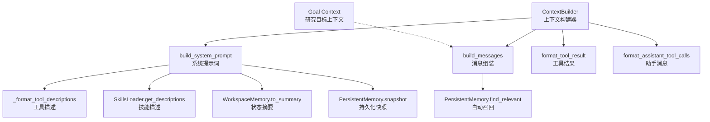
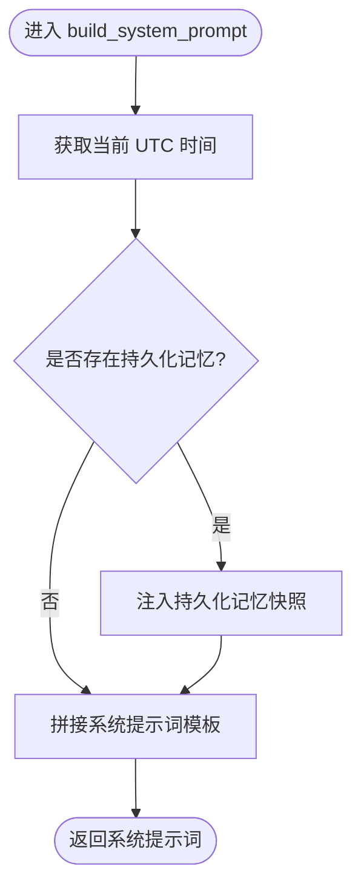
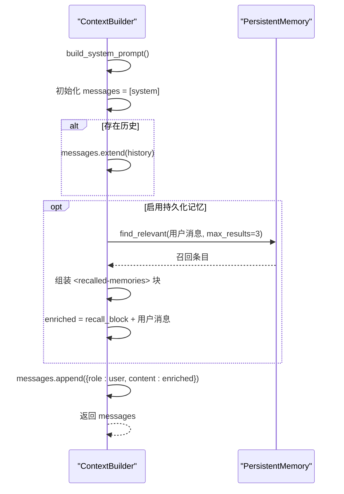
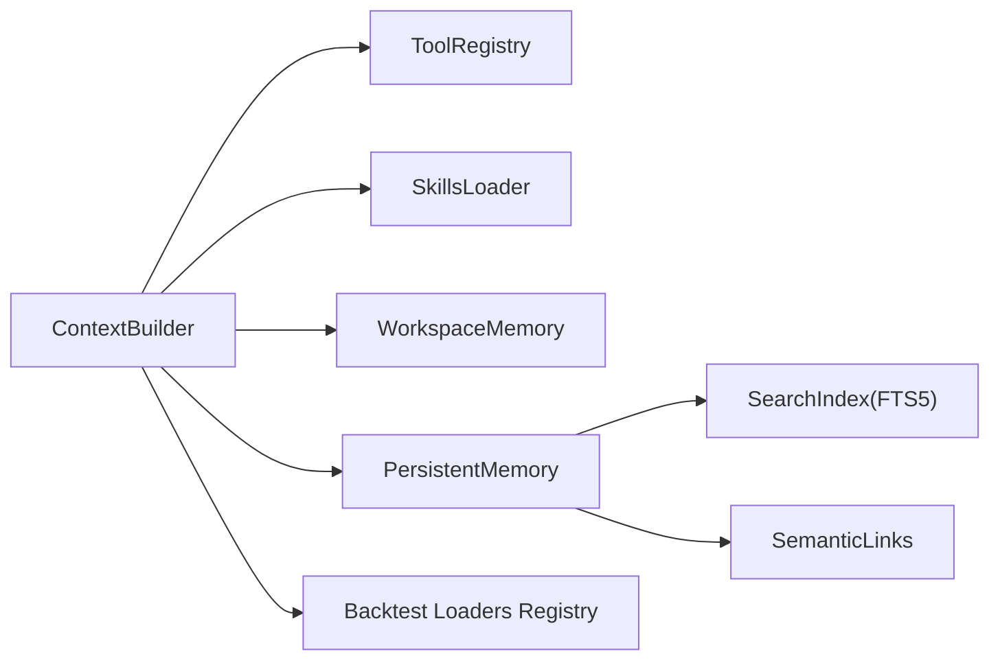

# 上下文构建机制

<cite>
**本文引用的文件**
- [agent/src/agent/context.py](file://agent/src/agent/context.py)
- [agent/src/agent/memory.py](file://agent/src/agent/memory.py)
- [agent/src/memory/persistent.py](file://agent/src/memory/persistent.py)
- [agent/src/agent/grounding.py](file://agent/src/agent/grounding.py)
- [agent/src/agent/loop.py](file://agent/src/agent/loop.py)
- [agent/src/tools/remember_tool.py](file://agent/src/tools/remember_tool.py)
- [agent/src/goal/context.py](file://agent/src/goal/context.py)
</cite>

## 目录
1. [简介](#简介)
2. [项目结构](#项目结构)
3. [核心组件](#核心组件)
4. [架构总览](#架构总览)
5. [详细组件分析](#详细组件分析)
6. [依赖关系分析](#依赖关系分析)
7. [性能考量](#性能考量)
8. [故障排查指南](#故障排查指南)
9. [结论](#结论)
10. [附录](#附录)

## 简介
本技术文档聚焦于“上下文构建机制”，围绕 ContextBuilder 类及其相关模块，系统阐述系统提示词生成、工具描述格式化、技能信息注入、持久化记忆自动召回、消息组装流程、工具结果与助手消息构造等关键能力。同时给出性能优化策略（缓存、内存管理、响应时间）与错误处理/异常恢复方案，帮助 AI 代理开发者与系统集成工程师高效集成与调优。

## 项目结构
上下文构建由以下核心文件协同完成：
- 上下文构建器：负责系统提示词、消息列表组装、工具/技能摘要注入、工具结果与助手消息格式化
- 工作区记忆：会话内共享状态（运行目录、调用计数），用于状态摘要注入
- 持久化记忆：跨会话的本地文件存储、检索、索引与快照，支持自动召回
- 目标上下文：研究目标的上下文格式化与继续策略提示
- 落地校验与恢复：对输出进行证据约束与失败恢复，保障数据可信度



图表来源
- [agent/src/agent/context.py:221-333](file://agent/src/agent/context.py#L221-L333)
- [agent/src/agent/memory.py:13-53](file://agent/src/agent/memory.py#L13-L53)
- [agent/src/memory/persistent.py:200-224](file://agent/src/memory/persistent.py#L200-L224)
- [agent/src/goal/context.py:23-63](file://agent/src/goal/context.py#L23-L63)

章节来源
- [agent/src/agent/context.py:221-333](file://agent/src/agent/context.py#L221-L333)
- [agent/src/agent/memory.py:13-53](file://agent/src/agent/memory.py#L13-L53)
- [agent/src/memory/persistent.py:200-224](file://agent/src/memory/persistent.py#L200-L224)
- [agent/src/goal/context.py:23-63](file://agent/src/goal/context.py#L23-L63)

## 核心组件
- ContextBuilder：统一封装系统提示词构建、消息组装、工具/助手消息格式化；通过工具注册表、技能加载器与工作区记忆聚合上下文；可选接入持久化记忆以支持跨会话记忆召回。
- WorkspaceMemory：轻量运行时状态，提供 run_dir 与计数器，生成状态摘要注入到系统提示词中，辅助模型理解当前任务上下文。
- PersistentMemory：基于文件的跨会话记忆，提供快照、关键词搜索、FTS5 索引、语义链接扩展、去重与重要性衰减等能力。
- Goal Context：将研究目标快照格式化为结构化上下文块，驱动多轮目标推进与证据收集。
- Grounding：在循环中对最终答案进行数值与身份约束校验，并提供恢复策略与回退路径。

章节来源
- [agent/src/agent/context.py:221-420](file://agent/src/agent/context.py#L221-L420)
- [agent/src/agent/memory.py:13-53](file://agent/src/agent/memory.py#L13-L53)
- [agent/src/memory/persistent.py:200-654](file://agent/src/memory/persistent.py#L200-L654)
- [agent/src/goal/context.py:23-179](file://agent/src/goal/context.py#L23-L179)
- [agent/src/agent/grounding.py:1-200](file://agent/src/agent/grounding.py#L1-L200)

## 架构总览
上下文构建的整体流程如下：
- 系统提示词：动态注入工具数量、技能数量、数据源数量、工具描述、技能描述、工作区状态摘要、持久化记忆快照、当前时间戳。
- 消息组装：首条 system 消息后追加历史消息（如有），再根据用户消息触发持久化记忆的自动召回，将相关记忆片段包裹为 XML 块注入用户消息。
- 工具结果与助手消息：工具执行结果以 tool 角色消息返回；助手调用工具的请求以 assistant 角色消息携带 tool_calls，并支持 reasoning_content 与 extra_content 透传。

```mermaid
sequenceDiagram
participant U as "用户"
participant CB as "ContextBuilder"
participant PM as "PersistentMemory"
participant LLM as "大模型"
participant Loop as "AgentLoop"
U->>CB : build_messages(用户消息, 历史)
CB->>CB : build_system_prompt()
CB-->>U : system 消息
alt 存在历史
CB-->>U : 追加历史消息
end
opt 启用持久化记忆
CB->>PM : find_relevant(用户消息, max_results=3)
PM-->>CB : 召回条目列表
CB-->>U : 将召回内容包裹为 <recalled-memories> 注入用户消息
end
U->>LLM : 发送完整消息序列
LLM-->>Loop : assistant tool_calls
Loop-->>CB : format_tool_result / format_assistant_tool_calls
CB-->>Loop : 标准化消息对象
```

图表来源
- [agent/src/agent/context.py:246-333](file://agent/src/agent/context.py#L246-L333)
- [agent/src/memory/persistent.py:362-455](file://agent/src/memory/persistent.py#L362-L455)
- [agent/src/agent/grounding.py:1-200](file://agent/src/agent/grounding.py#L1-L200)

## 详细组件分析

### ContextBuilder：系统提示词生成
- 动态参数替换：
  - 工具数量：从工具注册表统计已注册工具数
  - 技能数量：从技能加载器获取技能集合长度
  - 数据源数量：从回测加载器注册表的可用数据源集合计算（排除“auto”），若导入失败则回退到静态计数，确保启动不中断
  - 工具描述：按工具名+短描述（截断至固定长度）生成一行一条的清单，避免重复冗长 schema，具体参数由 API tools 数组提供
  - 技能描述：使用 SkillsLoader 的 get_descriptions 获取精简描述
  - 工作区状态摘要：调用 WorkspaceMemory.to_summary 注入 run_dir 与计数器
  - 持久化记忆快照：若存在 PersistentMemory 且 snapshot 非空，则在系统提示词中追加“跨会话持久化记忆”区块
  - 当前时间戳：UTC 格式的星期、月份、日期、时间与时区，便于模型感知时效性
- 设计要点：
  - 输出原则部分为模板常量文本，不做任何替换，保证跨会话一致性与可缓存性
  - 系统提示词稳定，便于缓存；每轮仅对用户消息做增强注入



图表来源
- [agent/src/agent/context.py:246-279](file://agent/src/agent/context.py#L246-L279)
- [agent/src/memory/persistent.py:200-224](file://agent/src/memory/persistent.py#L200-L224)

章节来源
- [agent/src/agent/context.py:246-279](file://agent/src/agent/context.py#L246-L279)
- [agent/src/agent/context.py:338-352](file://agent/src/agent/context.py#L338-L352)
- [agent/src/agent/context.py:402-417](file://agent/src/agent/context.py#L402-L417)
- [agent/src/agent/memory.py:37-53](file://agent/src/agent/memory.py#L37-L53)
- [agent/src/memory/persistent.py:200-224](file://agent/src/memory/persistent.py#L200-L224)

### ContextBuilder：消息组装与自动召回
- 消息列表构建：
  - 首条 system 消息来自 build_system_prompt
  - 若存在历史消息，直接追加
  - 用户消息增强：若启用持久化记忆，调用 find_relevant 召回最多 3 条相关记忆，并以 <recalled-memories> XML 块包裹后前置到用户消息前
  - 异常保护：自动召回过程捕获异常并记录调试日志，不影响主流程
- 设计要点：
  - 保持 system 提示词稳定可缓存，将个性化记忆注入到 user 消息，减少系统提示词抖动
  - 召回结果限制长度（body 截取前 500 字符），控制 token 开销



图表来源
- [agent/src/agent/context.py:354-390](file://agent/src/agent/context.py#L354-L390)
- [agent/src/memory/persistent.py:362-455](file://agent/src/memory/persistent.py#L362-L455)

章节来源
- [agent/src/agent/context.py:354-390](file://agent/src/agent/context.py#L354-L390)
- [agent/src/memory/persistent.py:362-455](file://agent/src/memory/persistent.py#L362-L455)

### 工具结果格式化与助手消息构造
- 工具结果格式化：
  - 将工具执行结果包装为标准 tool 角色消息，包含 tool_call_id、name、content
- 助手消息构造：
  - 将 tool_calls 列表转换为 OpenAI 兼容格式，保留 function name 与 arguments（JSON 字符串）
  - 支持 extra_content 透传到 additional_kwargs.tool_calls，便于下游消费
  - 支持 reasoning_content 字段，适配不同提供商的思考流输出


图表来源
- [agent/src/agent/context.py:362-420](file://agent/src/agent/context.py#L362-L420)

章节来源
- [agent/src/agent/context.py:362-420](file://agent/src/agent/context.py#L362-L420)

### 工作区记忆与状态摘要
- 作用：维护单次 AgentLoop 运行内的共享状态，包括运行目录与工具调用计数
- 摘要生成：to_summary 输出 run_dir 与 counters，供系统提示词注入，帮助模型理解当前上下文与进度

章节来源
- [agent/src/agent/memory.py:13-53](file://agent/src/agent/memory.py#L13-L53)

### 持久化记忆：快照、召回与索引
- 快照：PersistentMemory 在初始化时加载 MEMORY.md 的前若干行作为冻结快照，用于系统提示词注入
- 召回：find_relevant 优先使用 FTS5 索引搜索，若无结果或索引未就绪则回退到关键词扫描；支持语义链接扩展；结果按重要性加权排序
- 索引：search_index 提供 FTS5 索引的创建、重建与查询；支持自动重建与去重窗口
- 写入：add 方法支持层级目录、去重、截断、安全清理、更新索引与语义链接发现

章节来源
- [agent/src/memory/persistent.py:200-224](file://agent/src/memory/persistent.py#L200-L224)
- [agent/src/memory/persistent.py:362-455](file://agent/src/memory/persistent.py#L362-L455)
- [agent/src/memory/persistent.py:479-595](file://agent/src/memory/persistent.py#L479-L595)
- [agent/src/memory/search_index.py:175-215](file://agent/src/memory/search_index.py#L175-L215)

### 研究目标上下文
- 格式化：将当前研究目标快照（目标、证据、标准、声明）转为结构化 XML 块，注入到下一轮模型输入
- 继续策略：当目标未完成时，生成 continuation prompt，指导模型依据快照推进下一步，优先填补无证据的标准项

章节来源
- [agent/src/goal/context.py:23-63](file://agent/src/goal/context.py#L23-L63)
- [agent/src/goal/context.py:94-158](file://agent/src/goal/context.py#L94-L158)

## 依赖关系分析
- ContextBuilder 依赖：
  - ToolRegistry：提供工具定义与描述
  - SkillsLoader：提供技能描述
  - WorkspaceMemory：提供会话内状态摘要
  - PersistentMemory（可选）：提供跨会话记忆快照与召回
- 外部依赖：
  - backtest.loaders.registry.VALID_SOURCES：用于统计数据源数量
  - memory.search_index：FTS5 索引（可选）
  - memory.semantic_links：语义链接扩展（可选）



图表来源
- [agent/src/agent/context.py:221-333](file://agent/src/agent/context.py#L221-L333)
- [agent/src/memory/persistent.py:362-455](file://agent/src/memory/persistent.py#L362-L455)

章节来源
- [agent/src/agent/context.py:221-333](file://agent/src/agent/context.py#L221-L333)
- [agent/src/memory/persistent.py:362-455](file://agent/src/memory/persistent.py#L362-L455)

## 性能考量
- 缓存机制
  - 系统提示词稳定：输出原则与模板文本不变，适合缓存；每次仅替换动态参数
  - 持久化记忆快照：一次性加载并冻结，避免每轮重复 IO
  - 工具描述精简：单行短描述，避免重复 schema 带来的 token 膨胀
- 内存管理
  - 工作区记忆仅在单次运行内有效，避免长期驻留
  - 持久化记忆去重窗口：滑动窗口清理过期哈希，防止内存泄漏
  - 召回结果截断：body 限制前 500 字符，控制消息体大小
- 响应时间优化
  - FTS5 索引优先：加速召回，首次为空时自动重建
  - 降级路径：FTS5 失败回退到关键词扫描，保证可用性
  - 异常保护：自动召回失败仅记录调试日志，不阻塞主流程

[本节为通用性能建议，不直接分析具体文件]

## 故障排查指南
- 自动召回失败
  - 现象：find_relevant 抛出异常
  - 处理：记录调试日志，跳过召回，继续组装消息
  - 参考实现位置
    - [agent/src/agent/context.py:374-387](file://agent/src/agent/context.py#L374-L387)
- 数据源计数异常
  - 现象：无法导入 backtest loaders registry
  - 处理：回退到静态计数，确保启动不中断
  - 参考实现位置
    - [agent/src/agent/context.py:338-352](file://agent/src/agent/context.py#L338-L352)
- 输出校验与恢复
  - 现象：最终答案被 grounding 校验拒绝
  - 处理：生成 recovery/correction prompt，必要时安全回退
  - 参考实现位置
    - [agent/src/agent/loop.py:1102-1152](file://agent/src/agent/loop.py#L1102-L1152)
    - [agent/src/agent/grounding.py:1-200](file://agent/src/agent/grounding.py#L1-L200)
- 持久化记忆写入冲突
  - 现象：并发写入导致锁超时
  - 处理：记录警告，尽力写入；后续重建索引
  - 参考实现位置
    - [agent/src/memory/persistent.py:548-554](file://agent/src/memory/persistent.py#L548-L554)
    - [agent/src/memory/persistent.py:626-653](file://agent/src/memory/persistent.py#L626-L653)

章节来源
- [agent/src/agent/context.py:374-387](file://agent/src/agent/context.py#L374-L387)
- [agent/src/agent/context.py:338-352](file://agent/src/agent/context.py#L338-L352)
- [agent/src/agent/loop.py:1102-1152](file://agent/src/agent/loop.py#L1102-L1152)
- [agent/src/agent/grounding.py:1-200](file://agent/src/agent/grounding.py#L1-L200)
- [agent/src/memory/persistent.py:548-554](file://agent/src/memory/persistent.py#L548-L554)
- [agent/src/memory/persistent.py:626-653](file://agent/src/memory/persistent.py#L626-L653)

## 结论
ContextBuilder 通过稳定的系统提示词与灵活的用户消息增强，实现了高质量、可缓存、可扩展的上下文构建。结合工作区记忆、持久化记忆与研究目标上下文，系统在跨会话记忆召回、工具/技能信息注入、消息标准化等方面具备良好工程实践。配合 grounding 的校验与恢复机制，保障了输出的可信度与鲁棒性。在生产环境中，建议充分利用缓存与索引优化，关注内存占用与异常降级路径，以获得更优的性能与稳定性。

[本节为总结性内容，不直接分析具体文件]

## 附录
- 工具记忆操作：RememberTool 提供 save/recall/forget/reinforce 等操作，支撑持久化记忆的读写与反馈强化
  - 参考实现位置
    - [agent/src/tools/remember_tool.py:56-99](file://agent/src/tools/remember_tool.py#L56-L99)

章节来源
- [agent/src/tools/remember_tool.py:56-99](file://agent/src/tools/remember_tool.py#L56-L99)