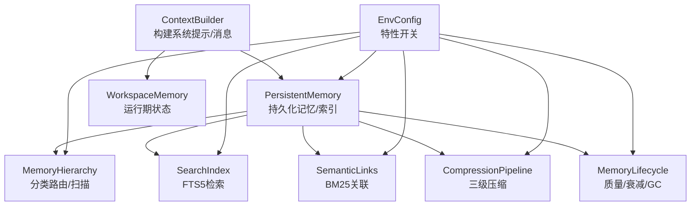
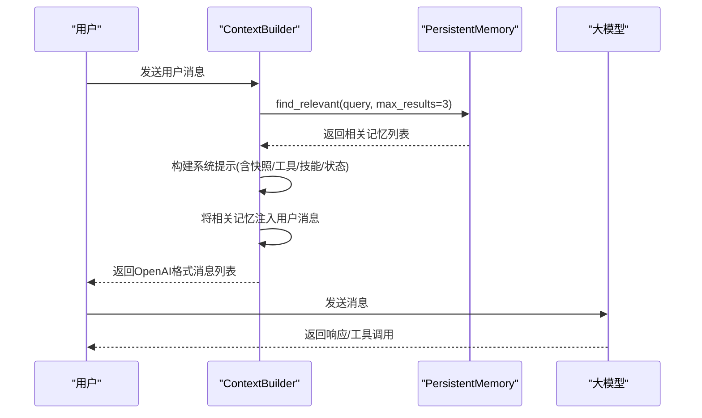
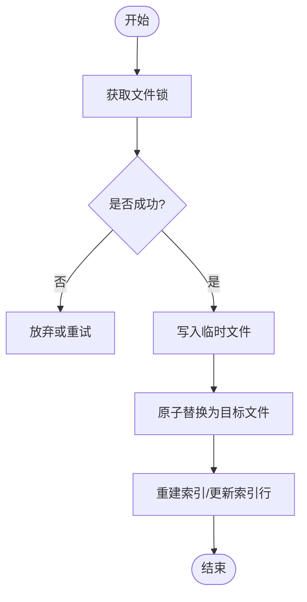
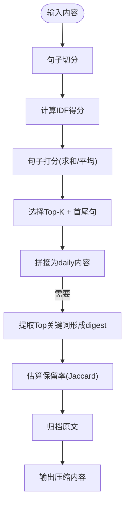
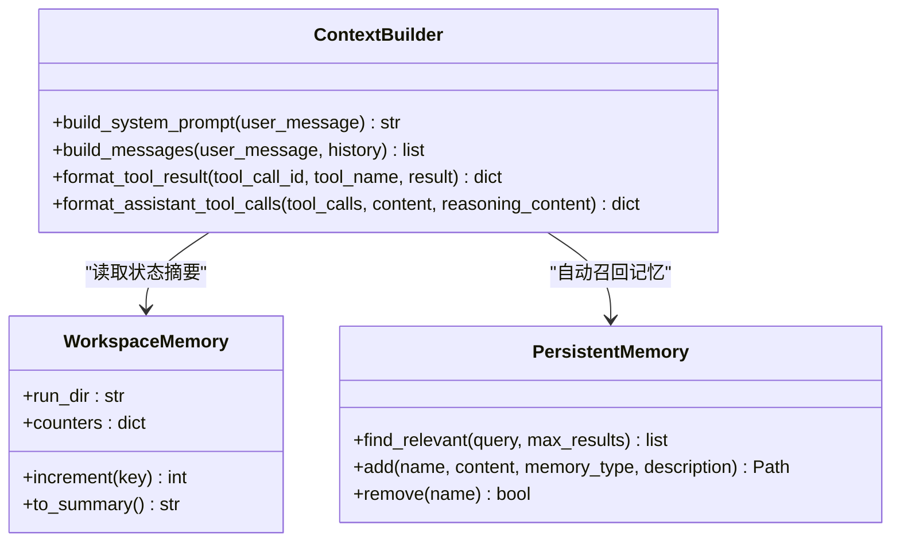
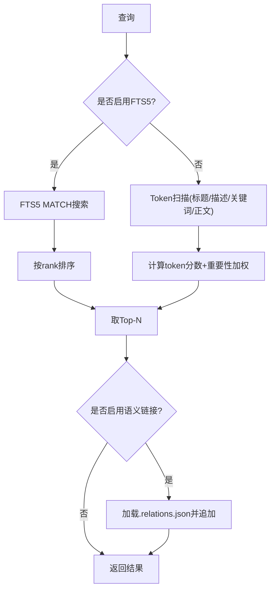
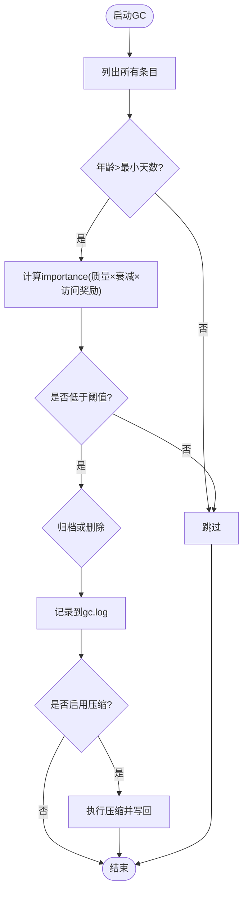
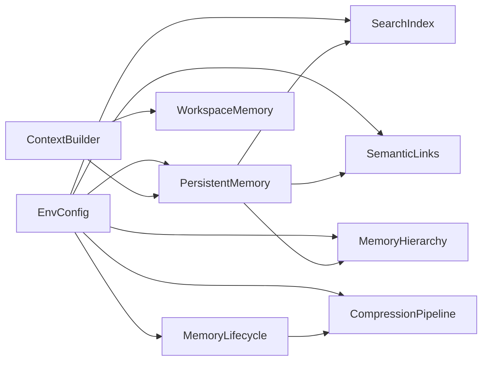

# 上下文管理机制

<cite>
**本文引用的文件**
- [agent/src/agent/context.py](file://agent/src/agent/context.py)
- [agent/src/memory/persistent.py](file://agent/src/memory/persistent.py)
- [agent/src/memory/compression.py](file://agent/src/memory/compression.py)
- [agent/src/memory/hierarchy.py](file://agent/src/memory/hierarchy.py)
- [agent/src/memory/lifecycle.py](file://agent/src/memory/lifecycle.py)
- [agent/src/memory/search_index.py](file://agent/src/memory/search_index.py)
- [agent/src/memory/semantic_links.py](file://agent/src/memory/semantic_links.py)
- [agent/src/agent/memory.py](file://agent/src/agent/memory.py)
- [agent/src/config/env_schema.py](file://agent/src/config/env_schema.py)
</cite>

## 目录
1. [简介](#简介)
2. [项目结构](#项目结构)
3. [核心组件](#核心组件)
4. [架构总览](#架构总览)
5. [详细组件分析](#详细组件分析)
6. [依赖关系分析](#依赖关系分析)
7. [性能考量](#性能考量)
8. [故障排查指南](#故障排查指南)
9. [结论](#结论)
10. [附录](#附录)

## 简介
本技术文档围绕“上下文管理机制”展开，聚焦于：
- 上下文构建与维护的核心算法（消息压缩、信息提取、相关性评分）
- 上下文一致性保证（版本控制、冲突解决、回滚策略）
- 智能压缩算法（文本摘要生成、关键信息保留、语义完整性维护）
- 上下文感知机制（任务状态跟踪、工具调用历史、用户意图理解）
- 上下文优化策略（内存使用优化、检索效率提升、压缩率调优）
- 安全性考虑（敏感信息过滤、访问权限控制、审计日志记录）

目标读者为AI代理开发者与系统优化工程师。

## 项目结构
上下文管理由多个模块协同完成：
- 上下文构建：ContextBuilder负责组装系统提示、工具描述、技能摘要、工作区状态与持久化记忆快照，并注入相关记忆到用户消息中。
- 持久化记忆：PersistentMemory提供跨会话的本地文件存储、索引、去重、搜索与重要性计算。
- 压缩管线：CompressionPipeline实现三级压缩（raw→daily→digest），基于TF-IDF句子打分与关键词抽取。
- 层次路由：MemoryHierarchy按类别组织文件，支持O(类别规模)范围扫描与迁移。
- 生命周期：MemoryLifecycle负责质量强化、衰减、垃圾回收与压缩触发。
- 检索加速：SearchIndex基于SQLite FTS5提供全文检索；SemanticLinks通过BM25建立语义关联。
- 配置开关：EnvConfig集中管理VT_MEMORY_*等特性开关，支持off/on/full预设。

图表来源
- [agent/src/agent/context.py:221-333](file://agent/src/agent/context.py#L221-L333)
- [agent/src/memory/persistent.py:200-455](file://agent/src/memory/persistent.py#L200-L455)
- [agent/src/memory/compression.py:163-337](file://agent/src/memory/compression.py#L163-L337)
- [agent/src/memory/hierarchy.py:34-176](file://agent/src/memory/hierarchy.py#L34-L176)
- [agent/src/memory/lifecycle.py:71-379](file://agent/src/memory/lifecycle.py#L71-L379)
- [agent/src/memory/search_index.py:113-481](file://agent/src/memory/search_index.py#L113-L481)
- [agent/src/memory/semantic_links.py:158-372](file://agent/src/memory/semantic_links.py#L158-L372)
- [agent/src/config/env_schema.py:601-677](file://agent/src/config/env_schema.py#L601-L677)

章节来源
- [agent/src/agent/context.py:221-333](file://agent/src/agent/context.py#L221-L333)
- [agent/src/memory/persistent.py:200-455](file://agent/src/memory/persistent.py#L200-L455)
- [agent/src/config/env_schema.py:601-677](file://agent/src/config/env_schema.py#L601-L677)

## 核心组件
- ContextBuilder：将系统提示、工具/技能描述、工作区状态与持久化记忆快照组合成LLM可理解的上下文；自动召回相关记忆并注入用户消息。
- PersistentMemory：以Markdown+Frontmatter形式持久化记忆，提供去重、重要性计算、搜索、索引重建与删除。
- CompressionPipeline：三级压缩（raw/daily/digest），先归档原文再替换内容，估算保留率。
- MemoryHierarchy：按类别组织文件，支持恢复无后缀条目、迁移扁平条目、按关键词重叠排序扫描。
- MemoryLifecycle：质量强化（事件驱动）、Ebbinghaus衰减、GC（归档/删除）、压缩触发与原子写入。
- SearchIndex：SQLite FTS5全文检索，CJK分词与bigram扩展，自动重建与降级。
- SemanticLinks：BM25相似度发现与持久化侧车文件，支持wikilink解析。
- WorkspaceMemory：单轮运行期的轻量共享状态（run_dir、计数器）。

章节来源
- [agent/src/agent/context.py:221-333](file://agent/src/agent/context.py#L221-L333)
- [agent/src/memory/persistent.py:200-654](file://agent/src/memory/persistent.py#L200-L654)
- [agent/src/memory/compression.py:163-337](file://agent/src/memory/compression.py#L163-L337)
- [agent/src/memory/hierarchy.py:34-436](file://agent/src/memory/hierarchy.py#L34-L436)
- [agent/src/memory/lifecycle.py:71-421](file://agent/src/memory/lifecycle.py#L71-L421)
- [agent/src/memory/search_index.py:113-481](file://agent/src/memory/search_index.py#L113-L481)
- [agent/src/memory/semantic_links.py:158-372](file://agent/src/memory/semantic_links.py#L158-L372)
- [agent/src/agent/memory.py:13-54](file://agent/src/agent/memory.py#L13-L54)

## 架构总览
上下文构建流程：
- 系统提示：固定输出原则、工具/技能描述、当前时间、工作区状态摘要、可选的跨会话记忆快照。
- 用户消息增强：根据查询自动召回相关记忆，包裹在<recalled-memories>标签中注入。
- 工具结果格式化：统一格式为tool消息，保留推理字段（如reasoning_content）。

图表来源
- [agent/src/agent/context.py:246-333](file://agent/src/agent/context.py#L246-L333)
- [agent/src/memory/persistent.py:362-455](file://agent/src/memory/persistent.py#L362-L455)

章节来源
- [agent/src/agent/context.py:246-333](file://agent/src/agent/context.py#L246-L333)
- [agent/src/memory/persistent.py:362-455](file://agent/src/memory/persistent.py#L362-L455)

## 详细组件分析

### 上下文构建与一致性保证
- 系统提示模板包含输出原则、工具/技能描述、状态、任务路由规则与当前时间，确保行为一致性与可缓存性。
- 持久化记忆快照在会话开始时冻结，避免运行时变更影响提示缓存。
- 自动召回：对查询进行分词与权重打分，结合重要性（质量分数、访问次数、衰减）返回Top-N记忆，注入用户消息。
- 版本与一致性：
  - 文件级锁：memory_lock确保并发写安全。
  - 原子写入：临时文件+os.replace避免部分写入损坏。
  - 索引重建：删除/添加后重建MEMORY.md索引，保证可见性。
  - 去重：滑动窗口哈希避免重复写入。

图表来源
- [agent/src/memory/persistent.py:41-73](file://agent/src/memory/persistent.py#L41-L73)
- [agent/src/memory/persistent.py:548-554](file://agent/src/memory/persistent.py#L548-L554)
- [agent/src/memory/persistent.py:626-654](file://agent/src/memory/persistent.py#L626-L654)

章节来源
- [agent/src/agent/context.py:246-333](file://agent/src/agent/context.py#L246-L333)
- [agent/src/memory/persistent.py:41-73](file://agent/src/memory/persistent.py#L41-L73)
- [agent/src/memory/persistent.py:362-455](file://agent/src/memory/persistent.py#L362-L455)
- [agent/src/memory/persistent.py:548-654](file://agent/src/memory/persistent.py#L548-L654)

### 智能压缩算法（文本摘要、关键信息保留、语义完整性）
- 三级压缩：
  - raw→daily：按句子拆分，计算IDF，选取Top-K重要句+首尾句，保留上下文框架。
  - daily→digest：统计词频与IDF，提取Top关键词形成要点列表。
- 归档保护：压缩前备份原文至archive目录，失败时中止以避免数据丢失。
- 保留率估计：Jaccard token重叠评估压缩前后信息保留度。
- 触发条件：基于最后访问时间阈值（7天/30天）决定压缩级别。

图表来源
- [agent/src/memory/compression.py:60-157](file://agent/src/memory/compression.py#L60-L157)
- [agent/src/memory/compression.py:197-259](file://agent/src/memory/compression.py#L197-L259)
- [agent/src/memory/compression.py:261-337](file://agent/src/memory/compression.py#L261-L337)
- [agent/src/memory/compression.py:339-356](file://agent/src/memory/compression.py#L339-L356)

章节来源
- [agent/src/memory/compression.py:163-337](file://agent/src/memory/compression.py#L163-L337)
- [agent/src/memory/compression.py:339-356](file://agent/src/memory/compression.py#L339-L356)

### 上下文感知机制（任务状态、工具调用历史、用户意图）
- 任务状态跟踪：WorkspaceMemory维护run_dir与工具调用计数，to_summary生成状态摘要注入系统提示。
- 工具调用历史：ContextBuilder.format_assistant_tool_calls保留工具调用结构与推理字段，便于后续处理。
- 用户意图理解：通过find_relevant对相关记忆加权召回，结合query与元数据/正文token匹配，必要时扩展语义链接。

图表来源
- [agent/src/agent/memory.py:13-54](file://agent/src/agent/memory.py#L13-L54)
- [agent/src/agent/context.py:221-420](file://agent/src/agent/context.py#L221-L420)
- [agent/src/memory/persistent.py:362-455](file://agent/src/memory/persistent.py#L362-L455)

章节来源
- [agent/src/agent/memory.py:13-54](file://agent/src/agent/memory.py#L13-L54)
- [agent/src/agent/context.py:221-420](file://agent/src/agent/context.py#L221-L420)
- [agent/src/memory/persistent.py:362-455](file://agent/src/memory/persistent.py#L362-L455)

### 检索效率与相关性评分
- FTS5检索：启用时优先使用SQLite FTS5，支持CJK bigram扩展与snippet高亮；不可用时回退到token-scan。
- 相关性评分：
  - 标题/描述/关键词/正文token匹配，元数据权重更高。
  - 若启用衰减，最终分数乘以重要性系数（质量×衰减×访问奖励）。
  - 语义链接扩展：对Top结果加载.relations.json，追加相关条目。
- 层次路由：按类别扫描，减少全量扫描开销；按关键词重叠排序类别顺序。

图表来源
- [agent/src/memory/search_index.py:252-302](file://agent/src/memory/search_index.py#L252-L302)
- [agent/src/memory/persistent.py:362-455](file://agent/src/memory/persistent.py#L362-L455)
- [agent/src/memory/semantic_links.py:179-230](file://agent/src/memory/semantic_links.py#L179-L230)
- [agent/src/memory/hierarchy.py:313-379](file://agent/src/memory/hierarchy.py#L313-L379)

章节来源
- [agent/src/memory/search_index.py:252-302](file://agent/src/memory/search_index.py#L252-L302)
- [agent/src/memory/persistent.py:362-455](file://agent/src/memory/persistent.py#L362-L455)
- [agent/src/memory/semantic_links.py:179-230](file://agent/src/memory/semantic_links.py#L179-L230)
- [agent/src/memory/hierarchy.py:313-379](file://agent/src/memory/hierarchy.py#L313-L379)

### 垃圾回收与压缩触发
- 质量强化：事件驱动更新quality_score（任务成功/失败、用户确认/拒绝、被动衰减），限制每会话最大增量。
- 衰减公式：基于半衰期与访问奖励计算importance。
- GC策略：低于归档阈值则归档，低于删除阈值且允许删除则删除；所有操作记录到gc.log。
- 压缩触发：GC周期内对老化条目执行压缩，更新frontmatter中的compression_level与updated_at。

图表来源
- [agent/src/memory/lifecycle.py:112-158](file://agent/src/memory/lifecycle.py#L112-L158)
- [agent/src/memory/lifecycle.py:183-273](file://agent/src/memory/lifecycle.py#L183-L273)
- [agent/src/memory/lifecycle.py:352-407](file://agent/src/memory/lifecycle.py#L352-L407)
- [agent/src/memory/persistent.py:80-91](file://agent/src/memory/persistent.py#L80-L91)

章节来源
- [agent/src/memory/lifecycle.py:112-158](file://agent/src/memory/lifecycle.py#L112-L158)
- [agent/src/memory/lifecycle.py:183-273](file://agent/src/memory/lifecycle.py#L183-L273)
- [agent/src/memory/lifecycle.py:352-407](file://agent/src/memory/lifecycle.py#L352-L407)
- [agent/src/memory/persistent.py:80-91](file://agent/src/memory/persistent.py#L80-L91)

### 层次化存储与迁移
- 路由规则：按memory_type路由到category子目录；未知类型回退到根目录。
- 恢复无后缀条目：扫描category目录，识别以frontmatter开头的无后缀文件并重命名为.md。
- 迁移扁平条目：将根目录下的条目移动到对应category目录，避免重复与覆盖。
- 索引重建：生成.hierarchy.yaml，记录类别统计与关键词，用于搜索优先级排序。

章节来源
- [agent/src/memory/hierarchy.py:70-143](file://agent/src/memory/hierarchy.py#L70-L143)
- [agent/src/memory/hierarchy.py:145-176](file://agent/src/memory/hierarchy.py#L145-L176)
- [agent/src/memory/hierarchy.py:200-261](file://agent/src/memory/hierarchy.py#L200-L261)
- [agent/src/memory/hierarchy.py:381-436](file://agent/src/memory/hierarchy.py#L381-L436)

## 依赖关系分析
- ContextBuilder依赖ToolRegistry、SkillsLoader、WorkspaceMemory与PersistentMemory。
- PersistentMemory依赖frontmatter解析、可选的SearchIndex与SemanticLinker，以及Hierarchy路由。
- Lifecycle依赖PersistentMemory与CompressionPipeline，受EnvConfig开关控制。
- SearchIndex与SemanticLinks为Tier 2能力，默认关闭，可通过环境变量开启。
- EnvConfig提供统一的特性开关，支持off/on/full预设。

图表来源
- [agent/src/config/env_schema.py:601-677](file://agent/src/config/env_schema.py#L601-L677)
- [agent/src/agent/context.py:221-333](file://agent/src/agent/context.py#L221-L333)
- [agent/src/memory/persistent.py:200-455](file://agent/src/memory/persistent.py#L200-L455)
- [agent/src/memory/lifecycle.py:71-379](file://agent/src/memory/lifecycle.py#L71-L379)

章节来源
- [agent/src/config/env_schema.py:601-677](file://agent/src/config/env_schema.py#L601-L677)
- [agent/src/agent/context.py:221-333](file://agent/src/agent/context.py#L221-L333)
- [agent/src/memory/persistent.py:200-455](file://agent/src/memory/persistent.py#L200-L455)
- [agent/src/memory/lifecycle.py:71-379](file://agent/src/memory/lifecycle.py#L71-L379)

## 性能考量
- 检索性能：
  - 启用FTS5可将搜索从O(n)降至近似O(log n)，并提供snippet高亮。
  - 层次路由减少扫描范围；关键词重叠排序提高命中率。
- 压缩性能：
  - TF-IDF句子打分与关键词提取复杂度与句子/词项数量线性相关。
  - 归档与原子写入避免阻塞与损坏。
- 内存与I/O：
  - 去重窗口限制内存占用；索引行上限防止索引膨胀。
  - 批量重建索引与WAL模式提升并发写入性能。
- 压缩率调优：
  - 调整DAILY_TOP_K_SENTENCES与DIGEST_TOP_KEYWORDS平衡保留率与体积。
  - 通过estimate_retention监控压缩效果。

[本节为通用指导，不直接分析具体文件]

## 故障排查指南
- 压缩失败：检查archive目录权限与磁盘空间；查看日志中的“Archive failed”与“Compression failed”。
- 检索为空：确认FTS5可用性与索引重建；若无FTS5则回退token-scan。
- 并发冲突：确认memory_lock超时设置与平台兼容性（Windows下跳过flock）。
- 语义链接异常：检查.relations.json格式与版本；确保BM25参数合理。
- 层级迁移问题：确认无后缀条目已恢复；迁移目标不存在冲突。

章节来源
- [agent/src/memory/compression.py:261-337](file://agent/src/memory/compression.py#L261-L337)
- [agent/src/memory/search_index.py:147-173](file://agent/src/memory/search_index.py#L147-L173)
- [agent/src/memory/persistent.py:41-73](file://agent/src/memory/persistent.py#L41-L73)
- [agent/src/memory/semantic_links.py:232-319](file://agent/src/memory/semantic_links.py#L232-L319)
- [agent/src/memory/hierarchy.py:92-143](file://agent/src/memory/hierarchy.py#L92-L143)

## 结论
该上下文管理机制通过分层设计实现了：
- 稳定的上下文构建与注入（系统提示、工具/技能描述、状态摘要、相关记忆）
- 高效的检索与关联（FTS5、BM25、层次路由）
- 智能压缩与生命周期管理（TF-IDF、衰减、GC、原子写入）
- 灵活的特性开关与预设（off/on/full）
对于AI代理开发者和系统优化工程师而言，可根据业务需求启用相应功能，并通过日志与指标持续优化性能与准确性。

[本节为总结，不直接分析具体文件]

## 附录
- 环境变量与开关：
  - VT_MEMORY：off/on/full预设
  - VT_MEMORY_QUALITY：质量评分与强化
  - VT_MEMORY_GC：垃圾回收
  - VT_MEMORY_DECAY：重要性衰减
  - VT_MEMORY_HIERARCHY：层次化目录
  - VT_MEMORY_LINKS：语义链接
  - VT_MEMORY_COMPRESSION：自动压缩
  - VT_MEMORY_FTS_INDEX：FTS5索引

章节来源
- [agent/src/config/env_schema.py:601-677](file://agent/src/config/env_schema.py#L601-L677)