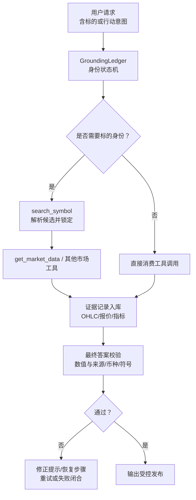
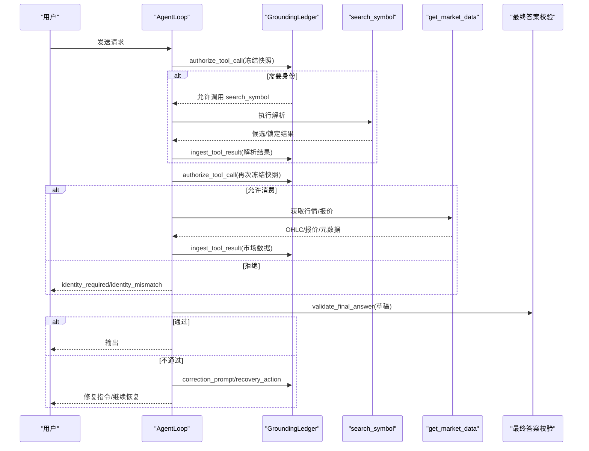
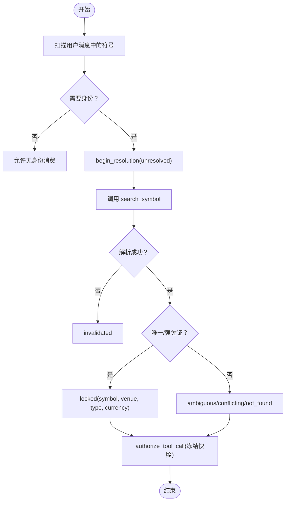
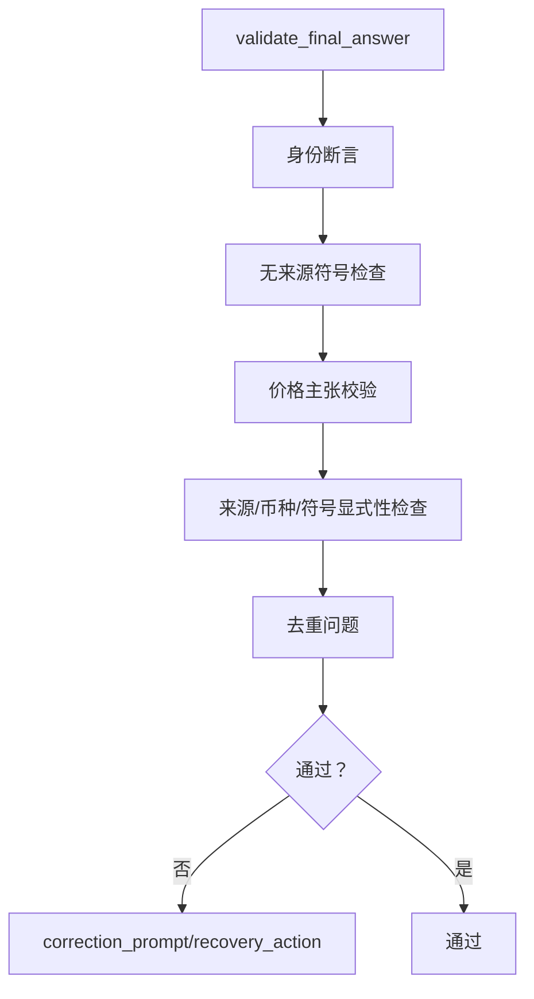
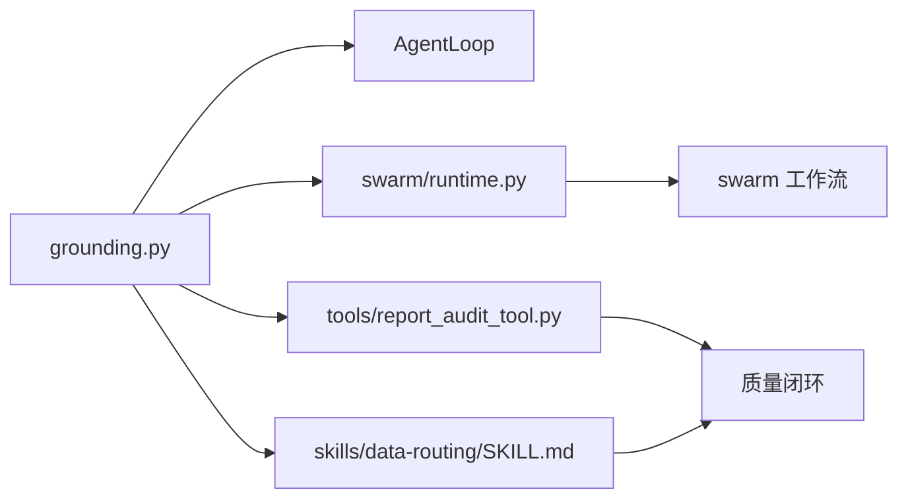

# 事实锚定机制

<cite>
**本文引用的文件**
- [grounding.py](file://agent/src/agent/grounding.py)
- [test_agent_grounding.py](file://agent/tests/test_agent_grounding.py)
- [test_swarm_grounding.py](file://agent/tests/test_swarm_grounding.py)
- [runtime.py](file://agent/src/swarm/runtime.py)
- [SKILL.md（数据路由）](file://agent/src/skills/data-routing/SKILL.md)
- [report_audit_tool.py](file://agent/src/tools/report_audit_tool.py)
- [lifecycle.py](file://agent/src/memory/lifecycle.py)
- [mcp_server.py](file://agent/mcp_server.py)
- [goal/models.py](file://agent/src/goal/models.py)
- [README.md](file://README.md)
</cite>

## 目录
1. [简介](#简介)
2. [项目结构](#项目结构)
3. [核心组件](#核心组件)
4. [架构总览](#架构总览)
5. [详细组件分析](#详细组件分析)
6. [依赖关系分析](#依赖关系分析)
7. [性能考量](#性能考量)
8. [故障排查指南](#故障排查指南)
9. [结论](#结论)
10. [附录](#附录)

## 简介
本文件面向AI代理开发者与数据质量工程师，系统化阐述Vibe-Trading中的“事实锚定”（Grounding）机制。该机制以运行期可验证的“身份锁定 + 数值证据账本 + 最终答案校验”为核心，确保：
- 市场敏感工具调用必须基于已锁定的标的身份；
- 最终答案中的价格数字不得与完整、未截断的工具结果矛盾；
- 任何数值必须绑定到本次会话中实际处理过的标的与来源。

此外，文档覆盖输入解析、事实提取、外部验证、冲突检测、多源数据融合、置信度评估、质量控制、以及性能监控与调试等关键主题，并提供可视化流程图与时序图，帮助读者快速定位问题与优化点。

## 项目结构
围绕事实锚定，代码主要分布在以下位置：
- 核心状态机与证据账本：agent/src/agent/grounding.py
- 单测与回归用例：agent/tests/test_agent_grounding.py、agent/tests/test_swarm_grounding.py
- 群智工作流中的事实块注入：agent/src/swarm/runtime.py
- 数据交叉验证规范：agent/src/skills/data-routing/SKILL.md
- 报告审计与数值一致性检查：agent/src/tools/report_audit_tool.py
- 记忆质量评分与强化：agent/src/memory/lifecycle.py
- 目标级证据模型与持久化：agent/src/goal/models.py、agent/mcp_server.py
- 治理与审计追踪概览：README.md

图表来源
- [grounding.py:811-1160](file://agent/src/agent/grounding.py#L811-L1160)
- [grounding.py:1684-1884](file://agent/src/agent/grounding.py#L1684-L1884)
- [grounding.py:1980-2314](file://agent/src/agent/grounding.py#L1980-L2314)

章节来源
- [grounding.py:811-1160](file://agent/src/agent/grounding.py#L811-L1160)
- [test_agent_grounding.py:172-800](file://agent/tests/test_agent_grounding.py#L172-L800)

## 核心组件
- GroundingLedger：运行期身份状态机与证据账本，负责授权工具调用、解析标识、记录证据、校验最终答案、生成修复提示与失败闭合回复。
- 身份记录 IdentityRecord：一次查询的版本化解析结果，包含状态、符号、交易所、类型、货币、来源、候选集等。
- 证据记录 EvidenceRecord：对观测值、不可用值或派生值的结构化记录，带调用ID、工具名、符号、时间戳、字段、值、状态、货币、交易所、换算标记。
- 工具授权 ToolAuthorization：在批次边界冻结的身份快照上做出的允许/拒绝决策，附带错误码与提示。
- 最终答案校验 ValidationResult：返回是否通过及结构化问题列表。

章节来源
- [grounding.py:738-809](file://agent/src/agent/grounding.py#L738-L809)
- [grounding.py:811-919](file://agent/src/agent/grounding.py#L811-L919)

## 架构总览
事实锚定贯穿“请求→身份解析→工具调用→证据收集→最终答案校验→修复/放行”的全链路。群智运行时会在任务开始前预取并注入“Ground Truth”事实块，约束下游工作者引用真实数据。

图表来源
- [grounding.py:922-1017](file://agent/src/agent/grounding.py#L922-L1017)
- [grounding.py:1099-1160](file://agent/src/agent/grounding.py#L1099-L1160)
- [grounding.py:1162-1261](file://agent/src/agent/grounding.py#L1162-L1261)
- [test_agent_grounding.py:200-268](file://agent/tests/test_agent_grounding.py#L200-L268)

## 详细组件分析

### 身份解析与锁定流程
- 输入扫描：从用户消息中提取显式符号，进入“需要身份”模式。
- 解析阶段：调用 search_symbol，将查询映射为稳定键，进入 unresolved 状态。
- 选择策略：去重后按唯一性、强佐证（also_from/cik）、名称匹配等规则选择候选；若冲突则置 conflicting。
- 锁定与继承：锁定后覆盖同查询的短名单，更新 aggregate identity_status。
- 消费授权：后续工具调用必须在批次前冻结的 authorized_symbols 范围内，禁止静默改写交易所或后缀。

图表来源
- [grounding.py:1331-1505](file://agent/src/agent/grounding.py#L1331-L1505)
- [grounding.py:1529-1567](file://agent/src/agent/grounding.py#L1529-L1567)
- [grounding.py:922-1017](file://agent/src/agent/grounding.py#L922-L1017)

章节来源
- [grounding.py:1331-1505](file://agent/src/agent/grounding.py#L1331-L1505)
- [test_agent_grounding.py:355-509](file://agent/tests/test_agent_grounding.py#L355-L509)

### 证据采集与多源融合
- 市场数据：解析 get_market_data 的 OHLCV 行，写入 EvidenceRecord，标注 source、currency、venue、currency_conversion。
- 通用数值：对其他市场敏感工具的结果进行有界扁平化遍历，仅记录有限数量的数值叶子，避免噪声污染。
- CSV旁路：读取运行目录中由 bash+yfinance 写出的 OHLC CSV，映射文件名到符号，补充观测证据。
- 多源一致性与权重：系统不直接做加权融合，而是通过“来源别名+币种推断+字段归一化”实现可比性；冲突时通过校验层拒绝不一致的最终答案。

```mermaid
flowchart TD
IngestStart["接收工具结果"] --> Type{"工具类型？"}
Type -- market_data --> Market["解析OHLCV行<br/>写入证据(observed)"]
Type -- other --> Generic["有界遍历JSON树<br/>抽取数值叶子"]
Type -- csv --> CSV["扫描run_dir/*.csv<br/>映射符号并写入证据"]
Market --> Merge["合并证据表<br/>source/currency/venue"]
Generic --> Merge
CSV --> Merge
Merge --> Out["供最终答案校验使用"]
```

图表来源
- [grounding.py:1684-1759](file://agent/src/agent/grounding.py#L1684-L1759)
- [grounding.py:1761-1806](file://agent/src/agent/grounding.py#L1761-L1806)
- [grounding.py:1808-1884](file://agent/src/agent/grounding.py#L1808-L1884)

章节来源
- [grounding.py:1684-1884](file://agent/src/agent/grounding.py#L1684-L1884)

### 最终答案校验与冲突检测
- 身份断言：若需要身份但未锁定/冲突/失效，则拒绝最终答案。
- 无来源符号：若答案将数值绑定到本次会话未处理的符号，视为违规。
- 价格主张校验：
  - 表格：识别Markdown OHLC表头与日期列，逐格比对。
  - 文本：清洗非价格数字（日期、百分比、单位、指标、比例、汇率、历史极值、目标位等），提取候选价格并与证据对比。
  - 推导公式：仅允许明确声明且算术正确的派生值，输入必须来自观测证据。
- 溯源要求：最终答案需显式写出“标准符号+来源+币种”，否则报错。

图表来源
- [grounding.py:1134-1160](file://agent/src/agent/grounding.py#L1134-L1160)
- [grounding.py:1886-2132](file://agent/src/agent/grounding.py#L1886-L2132)
- [grounding.py:2144-2314](file://agent/src/agent/grounding.py#L2144-L2314)

章节来源
- [grounding.py:1886-2314](file://agent/src/agent/grounding.py#L1886-L2314)
- [test_agent_grounding.py:661-800](file://agent/tests/test_agent_grounding.py#L661-L800)

### 恢复与修复策略
- 自动恢复：当缺失身份或价格证据时，优先驱动 read-only 工具（search_symbol/get_market_data）完成恢复，限制轮次与尝试次数。
- 修正提示：给出具体错误项、复用锁定符号、展示派生公式、禁止绑定未处理符号。
- 失败闭合：当恢复耗尽或确证冲突，输出安全兜底文案，避免编造交易结论。

章节来源
- [grounding.py:1162-1302](file://agent/src/agent/grounding.py#L1162-L1302)
- [test_agent_grounding.py:200-268](file://agent/tests/test_agent_grounding.py#L200-L268)

### 群智工作流中的事实块注入
- 预取与限流：运行时从用户变量提取符号，限制最大数量，异步预取行情并注入“Ground Truth”块。
- 提示约束：无论是否提供事实块，均强制插入“数据引用纪律”，防止合成/聚合角色凭空捏造数字。
- 层级传递：确保每层工作者收到 run-level 的事实块，并在执行规则之前可见。

章节来源
- [runtime.py:813-847](file://agent/src/swarm/runtime.py#L813-L847)
- [test_swarm_grounding.py:207-332](file://agent/tests/test_swarm_grounding.py#L207-L332)

### 数据交叉验证与质量控制
- 多源交叉：重要数字需在≥2个独立来源交叉验证，优先原始披露；偏差超阈值需标注口径差异。
- 报告审计：对报告中“上报值 vs 抓取值”进行容差比较，缺失或非有限数视为不可验证。
- 记忆质量：对事件进行质量分数强化，限制会话内增量上限，持久化至 frontmatter。

章节来源
- [SKILL.md（数据路由）:139-156](file://agent/src/skills/data-routing/SKILL.md#L139-L156)
- [report_audit_tool.py:300-328](file://agent/src/tools/report_audit_tool.py#L300-L328)
- [lifecycle.py:119-155](file://agent/src/memory/lifecycle.py#L119-L155)

### 置信度评估与不确定性量化
- 证据强度：来源于“观测/不可用/派生”三类状态，结合字段归一化与来源可信度（如交易所/币种推断）。
- 来源可靠性：通过 _SOURCE_ALIASES 与 _CURRENCY_ALIASES 统一来源与币种表达，减少误判。
- 不确定性：当身份 ambiguous/conflicting/unresolved 或证据不足时，触发恢复或失败闭合；最终答案必须显式标注来源与币种以降低不确定性。

章节来源
- [grounding.py:435-472](file://agent/src/agent/grounding.py#L435-L472)
- [grounding.py:688-735](file://agent/src/agent/grounding.py#L688-L735)
- [grounding.py:1886-2132](file://agent/src/agent/grounding.py#L1886-L2132)

### 人工审核接口与证据模型
- 目标级证据：EvidenceInput/EvidenceRecord 支持关联 claim/criterion、工具调用ID、运行ID、来源URI、假设、工件哈希、数据时效、置信度、备注等。
- MCP集成：服务端暴露 add_goal_evidence 参数，便于外部系统追加可追溯证据。

章节来源
- [goal/models.py:95-123](file://agent/src/goal/models.py#L95-L123)
- [mcp_server.py:629-649](file://agent/mcp_server.py#L629-L649)

## 依赖关系分析
- 模块耦合：
  - grounding.py 与 AgentLoop 通过批次冻结快照交互，避免同一批内的竞态。
  - swarm/runtime.py 与 grounding 解耦，仅通过函数接口提取符号与预取数据。
  - tools/report_audit_tool.py 与 skills/data-routing/SKILL.md 共同构成“数值一致性”的质量闭环。
- 外部依赖：
  - 市场数据加载器通过 backtest/loaders/registry 分发，但 grounding 仅消费标准化后的 OHLCV 与 provenance。
  - 审计与治理由 README 描述的 manifest/audit ledger 保障可追溯性。

图表来源
- [grounding.py:922-1017](file://agent/src/agent/grounding.py#L922-L1017)
- [runtime.py:813-847](file://agent/src/swarm/runtime.py#L813-L847)
- [report_audit_tool.py:300-328](file://agent/src/tools/report_audit_tool.py#L300-L328)
- [SKILL.md（数据路由）:139-156](file://agent/src/skills/data-routing/SKILL.md#L139-L156)

章节来源
- [grounding.py:922-1017](file://agent/src/agent/grounding.py#L922-L1017)
- [runtime.py:813-847](file://agent/src/swarm/runtime.py#L813-L847)

## 性能考量
- 证据容量控制：通用数值证据上限 _MAX_GENERIC_EVIDENCE，CSV 读取与解析受限于剩余配额，避免无限膨胀。
- 符号跟踪上限：_MAX_TRACKED_SYMBOLS 限制会话内跟踪的符号数量，防止内存压力。
- 恢复预算：MAX_GROUNDING_RECOVERY_ROUNDS、MAX_SYMBOL_RESOLUTION_ATTEMPTS、MAX_PRICE_EVIDENCE_ATTEMPTS 限制自动恢复轮次，避免死循环。
- 批量冻结：工具授权基于批次前快照，减少并发竞争与重复计算。
- 异步预取：群智运行时在 start_run 前预取事实数据，降低首步延迟。

章节来源
- [grounding.py:71-74](file://agent/src/agent/grounding.py#L71-L74)
- [grounding.py:1629-1668](file://agent/src/agent/grounding.py#L1629-L1668)
- [grounding.py:1206-1240](file://agent/src/agent/grounding.py#L1206-L1240)
- [runtime.py:813-847](file://agent/src/swarm/runtime.py#L813-L847)

## 故障排查指南
- 常见错误码与含义：
  - identity_required：需要身份但未锁定或仍在解析中。
  - identity_conflict：身份冲突（多候选/不同交易所）。
  - identity_mismatch：消费者符号与锁定身份不匹配（禁止静默改写）。
  - numeric_claim_unavailable：价格主张无可观测证据。
  - numeric_claim_conflict：价格主张与观测范围不一致。
  - canonical_symbol_not_surfaced：未显式写出标准符号。
  - data_source_not_surfaced：未显式写出数据来源。
  - currency_not_surfaced：未显式写出币种。
- 定位方法：
  - 查看 artifacts/grounding_evidence.json 中的 identity/evidence/tool_failures/validations。
  - 核对工具调用参数与结果是否命中 _SYMBOL_ARGUMENT_KEYS 与 _PRICE_FIELDS。
  - 确认 CSV 文件名后缀映射是否正确，且符号属于本次会话已授权集合。
- 修复建议：
  - 先调用 search_symbol 锁定精确符号与交易所，再调用 get_market_data。
  - 对派生数值，显式标注“推导/公式/来源输入”。
  - 在最终答案中显式写出“标准符号+来源+币种”。

章节来源
- [grounding.py:922-1017](file://agent/src/agent/grounding.py#L922-L1017)
- [grounding.py:1134-1302](file://agent/src/agent/grounding.py#L1134-L1302)
- [test_agent_grounding.py:189-509](file://agent/tests/test_agent_grounding.py#L189-L509)

## 结论
事实锚定机制通过“身份锁定 + 证据账本 + 最终答案校验”的三段式设计，将语言模型的推理过程与可验证的外部证据严格对齐。其优势在于：
- 可判定性强：身份与数值主张均可被机械验证；
- 可恢复性好：受限的自动恢复路径引导模型补齐证据；
- 可追溯性高：证据与校验结果持久化，支持审计与复盘。

对于AI代理开发者，建议在工具契约中显式携带 symbol/code/ticker 等键，并确保结果包含 provenance；对于数据质量工程师，应关注多源交叉验证、异常值与缺失值处理、以及人工审核接口的接入。

## 附录
- 治理与审计追踪：每次运行生成 manifest 与审计链，保证方法论可复现与篡改可检测。
- 参考实践：数据交叉验证规范与报告审计工具可作为企业级数据质量基线。

章节来源
- [README.md:867-883](file://README.md#L867-L883)
- [SKILL.md（数据路由）:139-156](file://agent/src/skills/data-routing/SKILL.md#L139-L156)
- [report_audit_tool.py:300-328](file://agent/src/tools/report_audit_tool.py#L300-L328)