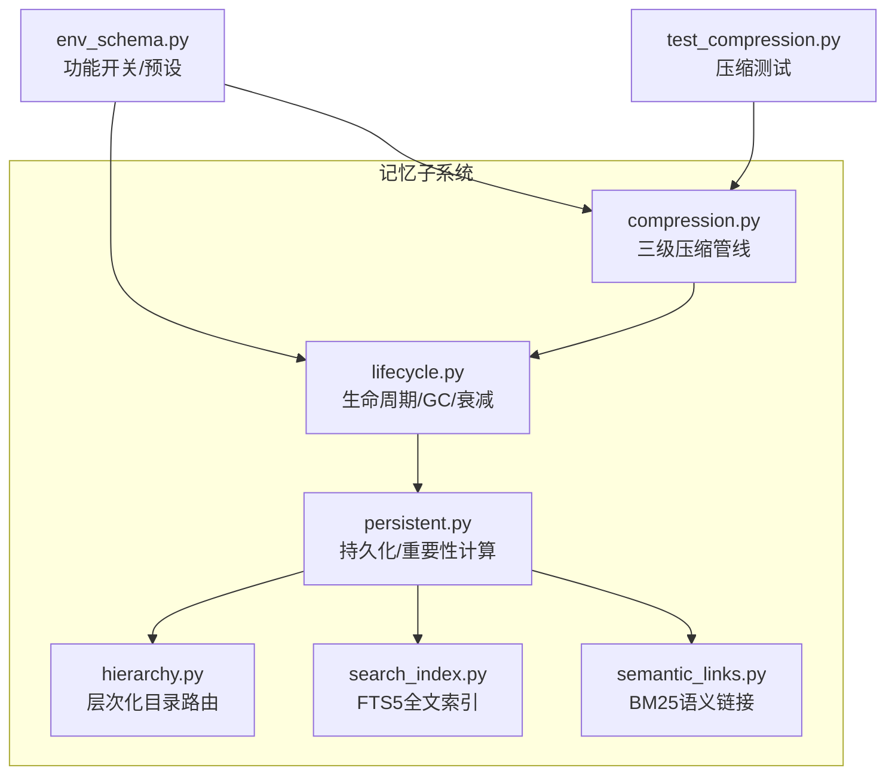
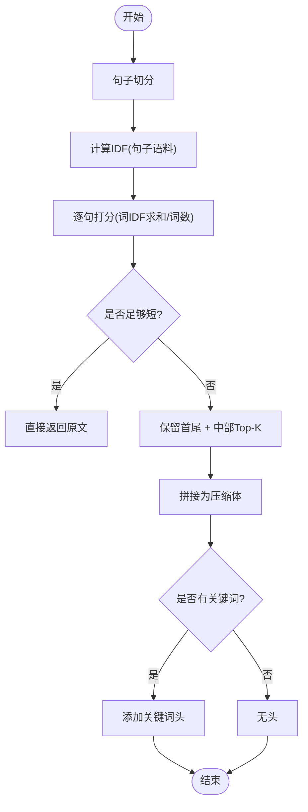
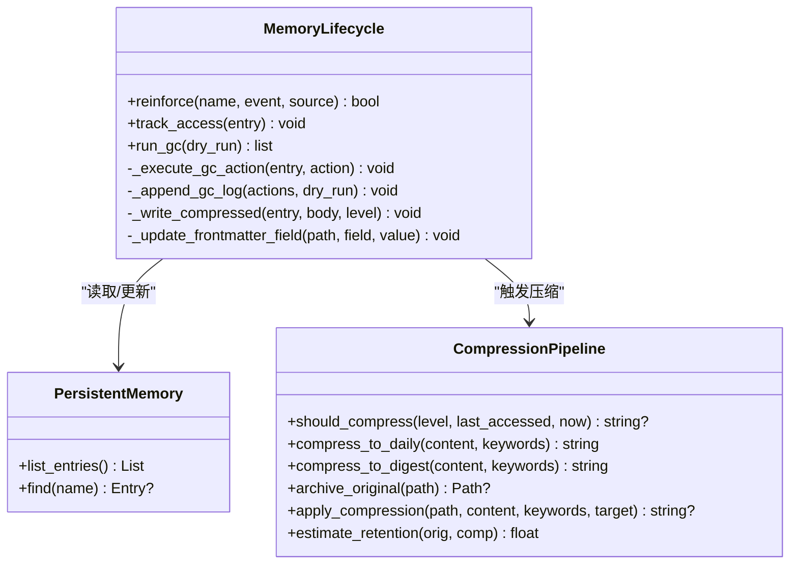
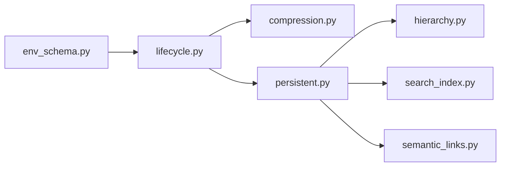

# 记忆压缩算法

<cite>
**本文引用的文件**
- [compression.py](file://agent/src/memory/compression.py)
- [lifecycle.py](file://agent/src/memory/lifecycle.py)
- [persistent.py](file://agent/src/memory/persistent.py)
- [hierarchy.py](file://agent/src/memory/hierarchy.py)
- [search_index.py](file://agent/src/memory/search_index.py)
- [semantic_links.py](file://agent/src/memory/semantic_links.py)
- [env_schema.py](file://agent/src/config/env_schema.py)
- [test_compression.py](file://agent/tests/memory/test_compression.py)
</cite>

## 目录
1. [简介](#简介)
2. [项目结构](#项目结构)
3. [核心组件](#核心组件)
4. [架构总览](#架构总览)
5. [详细组件分析](#详细组件分析)
6. [依赖关系分析](#依赖关系分析)
7. [性能考量](#性能考量)
8. [故障排查指南](#故障排查指南)
9. [结论](#结论)
10. [附录](#附录)

## 简介
本技术文档围绕“记忆压缩”子系统，系统阐述三级压缩管线（原始→每日摘要→要点摘要）的实现原理、策略选择机制、质量评估指标、自适应参数调优与性能优化策略。该子系统通过基于TF-IDF的关键句抽取、关键词聚合与语义完整性维护，在保持高信息保留率的同时显著降低存储与检索成本；并与生命周期管理、层次化目录路由、全文索引和语义链接协同工作，形成完整的持久化记忆体系。

## 项目结构
记忆压缩相关代码主要位于 agent/src/memory 目录下，配合配置与环境开关在 agent/src/config 中启用或禁用相应能力。测试用例位于 agent/tests/memory。



图表来源
- [compression.py:163-356](file://agent/src/memory/compression.py#L163-L356)
- [lifecycle.py:183-379](file://agent/src/memory/lifecycle.py#L183-L379)
- [persistent.py:80-92](file://agent/src/memory/persistent.py#L80-L92)
- [hierarchy.py:34-90](file://agent/src/memory/hierarchy.py#L34-L90)
- [search_index.py:113-173](file://agent/src/memory/search_index.py#L113-L173)
- [semantic_links.py:158-230](file://agent/src/memory/semantic_links.py#L158-L230)
- [env_schema.py:559-644](file://agent/src/config/env_schema.py#L559-L644)
- [test_compression.py:58-235](file://agent/tests/memory/test_compression.py#L58-L235)

章节来源
- [compression.py:1-356](file://agent/src/memory/compression.py#L1-L356)
- [lifecycle.py:1-421](file://agent/src/memory/lifecycle.py#L1-L421)
- [persistent.py:1-654](file://agent/src/memory/persistent.py#L1-L654)
- [hierarchy.py:1-436](file://agent/src/memory/hierarchy.py#L1-L436)
- [search_index.py:1-481](file://agent/src/memory/search_index.py#L1-L481)
- [semantic_links.py:1-372](file://agent/src/memory/semantic_links.py#L1-L372)
- [env_schema.py:554-716](file://agent/src/config/env_schema.py#L554-L716)
- [test_compression.py:1-235](file://agent/tests/memory/test_compression.py#L1-L235)

## 核心组件
- 压缩管线 CompressionPipeline：实现 raw→daily→digest 的三级压缩，包含关键句抽取、关键词上下文注入、归档原内容、信息保留率估算等。
- 生命周期 MemoryLifecycle：负责质量评分、访问追踪、重要性衰减、垃圾回收，并在GC周期中触发压缩。
- 持久化 PersistentMemory：提供条目读写、去重、重要性计算、索引重建、与FTS5/语义链接集成。
- 层次化目录 MemoryHierarchy：按类别组织条目，支持O(类别规模)范围搜索与迁移恢复。
- 全文索引 MemorySearchIndex：SQLite FTS5倒排索引，提升检索效率并回退到词扫描。
- 语义链接 SemanticLinker：基于BM25发现条目间关联，持久化侧边关系文件。
- 配置 env_schema：通过环境变量与预设控制各功能开关（含压缩）。

章节来源
- [compression.py:163-356](file://agent/src/memory/compression.py#L163-L356)
- [lifecycle.py:71-379](file://agent/src/memory/lifecycle.py#L71-L379)
- [persistent.py:80-92](file://agent/src/memory/persistent.py#L80-L92)
- [hierarchy.py:34-90](file://agent/src/memory/hierarchy.py#L34-L90)
- [search_index.py:113-173](file://agent/src/memory/search_index.py#L113-L173)
- [semantic_links.py:158-230](file://agent/src/memory/semantic_links.py#L158-L230)
- [env_schema.py:559-644](file://agent/src/config/env_schema.py#L559-L644)

## 架构总览
记忆压缩与生命周期、持久化、索引、链接共同构成闭环：GC周期扫描条目，依据访问时间和当前压缩级别决定是否压缩；压缩前备份原文，压缩后更新frontmatter并落盘；同时可联动FTS5与语义链接以增强检索与关联发现。

```mermaid
sequenceDiagram
participant GC as "生命周期(GC)"
participant PM as "持久化(PersistentMemory)"
participant CP as "压缩管线(CompressionPipeline)"
participant FS as "文件系统"
participant IDX as "FTS5索引"
participant LINK as "语义链接"
GC->>PM : 列出条目
loop 遍历条目
GC->>CP : should_compress(level, last_accessed)
alt 需要压缩
CP->>FS : archive_original()
CP->>CP : compress_to_daily/digest()
CP-->>GC : 返回压缩体
GC->>PM : _write_compressed(更新frontmatter+正文)
GC->>IDX : 可选重建/增量更新
GC->>LINK : 可选重新发现链接
else 不需要压缩
GC-->>GC : 跳过
end
end
```

图表来源
- [lifecycle.py:183-379](file://agent/src/memory/lifecycle.py#L183-L379)
- [compression.py:163-356](file://agent/src/memory/compression.py#L163-L356)
- [persistent.py:200-315](file://agent/src/memory/persistent.py#L200-L315)
- [search_index.py:207-355](file://agent/src/memory/search_index.py#L207-L355)
- [semantic_links.py:179-230](file://agent/src/memory/semantic_links.py#L179-L230)

## 详细组件分析

### 压缩管线 CompressionPipeline
- 触发条件：基于上次访问时间距离阈值判断是否进入下一压缩级别（raw→daily≥7天，daily→digest≥30天）。
- 文本摘要生成：
  - 句子切分：兼容中英文标点边界。
  - TF-IDF打分：对句子集合计算IDF，按句内词权重求和归一化为句得分。
  - 关键句抽取：保留首尾句以保证上下文框架，再从中部选取Top-K高分句拼接。
- 关键信息提取：
  - 每日级：保留Top-K句+首尾句，必要时附加关键词头作为上下文提示。
  - 要点级：统计词频×IDF得到重要术语，输出为“Key concepts: - term”列表。
- 语义完整性维护：
  - 强制保留首尾句，避免丢失起始/收尾信息。
  - 关键词头/上下文头用于补充领域背景。
- 压缩失败处理：
  - 归档失败则中止压缩，防止数据丢失。
  - 异常捕获并记录日志，返回None表示失败。
- 质量评估：
  - estimate_retention使用Jaccard重叠度估算信息保留率（0~1）。



图表来源
- [compression.py:60-157](file://agent/src/memory/compression.py#L60-L157)
- [compression.py:197-259](file://agent/src/memory/compression.py#L197-L259)

章节来源
- [compression.py:60-157](file://agent/src/memory/compression.py#L60-L157)
- [compression.py:163-356](file://agent/src/memory/compression.py#L163-L356)
- [test_compression.py:58-235](file://agent/tests/memory/test_compression.py#L58-L235)

### 生命周期 MemoryLifecycle
- 质量与衰减：
  - 事件强化：根据任务成功/失败、用户确认/拒绝等事件调整质量分数，限制单会话最大增量。
  - 访问追踪：每次读取更新访问计数与最后访问时间。
  - 重要性衰减：基于Ebbinghaus遗忘曲线与访问奖励计算重要性。
- 垃圾回收：
  - 低重要性条目归档或删除（默认仅归档），并记录决策日志。
  - 非dry_run时触发压缩：调用压缩管线，写入压缩体并更新frontmatter中的压缩级别与更新时间。
- 原子写保障：
  - 通过临时文件+rename确保frontmatter与正文更新的原子性。



图表来源
- [lifecycle.py:71-379](file://agent/src/memory/lifecycle.py#L71-L379)
- [persistent.py:200-315](file://agent/src/memory/persistent.py#L200-L315)
- [compression.py:163-356](file://agent/src/memory/compression.py#L163-L356)

章节来源
- [lifecycle.py:71-379](file://agent/src/memory/lifecycle.py#L71-L379)
- [persistent.py:80-92](file://agent/src/memory/persistent.py#L80-L92)

### 持久化 PersistentMemory
- 重要性计算：结合质量分数、访问次数与最近访问时间，应用指数衰减与访问奖励。
- 条目扫描与解析：支持层次化目录与扁平目录兼容，解析frontmatter字段（包括压缩级别）。
- 去重与索引：滑动窗口去重；可选FTS5索引与语义链接集成。
- 索引重建：当删除或迁移后重建MEMORY.md索引。

章节来源
- [persistent.py:80-92](file://agent/src/memory/persistent.py#L80-L92)
- [persistent.py:200-315](file://agent/src/memory/persistent.py#L200-L315)
- [persistent.py:362-455](file://agent/src/memory/persistent.py#L362-L455)

### 层次化目录 MemoryHierarchy
- 路由规则：按memory_type将条目放入对应子目录，未知类型回退至根目录。
- 扫描与恢复：扫描所有类别与根目录，自动修复缺失后缀的孤儿条目。
- 索引重建：生成.hierarchy.yaml，包含每类条目数量与关键词摘要。
- 搜索范围裁剪：可按类别过滤或基于关键词重叠排序优先扫描。

章节来源
- [hierarchy.py:34-90](file://agent/src/memory/hierarchy.py#L34-L90)
- [hierarchy.py:145-177](file://agent/src/memory/hierarchy.py#L145-L177)
- [hierarchy.py:200-261](file://agent/src/memory/hierarchy.py#L200-L261)
- [hierarchy.py:313-379](file://agent/src/memory/hierarchy.py#L313-L379)

### 全文索引 MemorySearchIndex
- FTS5虚拟表：标题、描述、关键词、正文联合索引，支持snippet与rank。
- 中文处理：CJK字符展开为字/词双元组以提升匹配召回。
- 查询安全：对用户输入进行清洗与转义，防止注入。
- 降级策略：若FTS5不可用，回退到token扫描路径。

章节来源
- [search_index.py:113-173](file://agent/src/memory/search_index.py#L113-L173)
- [search_index.py:207-355](file://agent/src/memory/search_index.py#L207-L355)
- [search_index.py:357-446](file://agent/src/memory/search_index.py#L357-L446)

### 语义链接 SemanticLinker
- BM25相似度：基于词频与IDF计算条目间相关性，设置最小阈值与出边上限。
- 关系持久化：以.sidecar JSON形式保存，采用原子写入。
- Wikilink解析：从正文中提取[[id]]形式的显式引用。

章节来源
- [semantic_links.py:73-150](file://agent/src/memory/semantic_links.py#L73-L150)
- [semantic_links.py:158-230](file://agent/src/memory/semantic_links.py#L158-L230)
- [semantic_links.py:232-319](file://agent/src/memory/semantic_links.py#L232-L319)
- [semantic_links.py:321-372](file://agent/src/memory/semantic_links.py#L321-L372)

### 配置与开关 env_schema
- 预设模式：off/on/full 控制质量、GC、衰减、层次化、链接、压缩、FTS5等能力。
- 环境变量：VT_MEMORY_COMPRESSION 控制压缩管线启用；其他VT_MEMORY_*控制各特性。
- 覆盖策略：显式环境变量优先于预设值。

章节来源
- [env_schema.py:559-644](file://agent/src/config/env_schema.py#L559-L644)

## 依赖关系分析
- 压缩管线依赖持久化的条目元数据（keywords、compression_level、last_accessed）与文件系统（archive/目录）。
- 生命周期驱动压缩，并在成功后更新frontmatter；同时可触发FTS5重建与语义链接重算。
- 持久化层统一入口，协调层次化目录、FTS5索引与语义链接。
- 配置层集中管理功能开关，影响GC与压缩的触发与行为。



图表来源
- [env_schema.py:559-644](file://agent/src/config/env_schema.py#L559-L644)
- [lifecycle.py:183-379](file://agent/src/memory/lifecycle.py#L183-L379)
- [compression.py:163-356](file://agent/src/memory/compression.py#L163-L356)
- [persistent.py:200-315](file://agent/src/memory/persistent.py#L200-L315)
- [hierarchy.py:34-90](file://agent/src/memory/hierarchy.py#L34-L90)
- [search_index.py:113-173](file://agent/src/memory/search_index.py#L113-L173)
- [semantic_links.py:158-230](file://agent/src/memory/semantic_links.py#L158-L230)

章节来源
- [env_schema.py:559-644](file://agent/src/config/env_schema.py#L559-L644)
- [lifecycle.py:183-379](file://agent/src/memory/lifecycle.py#L183-L379)
- [compression.py:163-356](file://agent/src/memory/compression.py#L163-L356)
- [persistent.py:200-315](file://agent/src/memory/persistent.py#L200-L315)

## 性能考量
- 时间复杂度
  - 句子切分与TF-IDF：O(S·T)，S为句子数，T为平均句长；整体线性于输入规模。
  - 关键点抽取：排序Top-K，O(S log S)。
  - 要点摘要：词频统计与排序，O(U log U)，U为唯一词数。
- 空间复杂度
  - IDF与词频字典占用与语料规模线性相关；可通过限制top_k与关键词数量控制。
- 并行与并发
  - 压缩与GC均受文件锁保护（跨平台flock），避免并发写冲突。
  - FTS5索引使用WAL模式与线程锁，提高并发读/写吞吐。
- 缓存策略
  - 持久化层维护内存快照与近期哈希去重窗口，减少重复写入与扫描开销。
- 增量更新
  - 新增/删除条目时仅更新索引与关系，避免全量重建。
- 降级与容错
  - FTS5不可用时回退到token扫描；压缩失败时不修改源文件，保证一致性。

[本节为通用性能讨论，无需特定文件来源]

## 故障排查指南
- 压缩未触发
  - 检查 VT_MEMORY_COMPRESSION 是否开启；确认 GC 已启用且非dry_run。
  - 核对条目 last_accessed 与阈值（7/30天）是否满足触发条件。
- 归档失败
  - 检查 archive/ 目录权限与磁盘空间；查看日志中“Archive failed”原因。
- 压缩体为空或过短
  - 检查输入文本是否被截断或控制符清理导致空内容；确认句子切分正则生效。
- 信息保留率低
  - 使用 estimate_retention 评估；适当增大 Top-K 或调整关键词上下文。
- 索引不一致
  - 运行重建索引流程；检查FTS5可用性与自动重建逻辑。
- 语义链接缺失
  - 确认 VT_MEMORY_LINKS 开启；检查relations.json是否存在与版本兼容。

章节来源
- [lifecycle.py:183-379](file://agent/src/memory/lifecycle.py#L183-L379)
- [compression.py:261-337](file://agent/src/memory/compression.py#L261-L337)
- [search_index.py:147-173](file://agent/src/memory/search_index.py#L147-L173)
- [semantic_links.py:232-319](file://agent/src/memory/semantic_links.py#L232-L319)

## 结论
该记忆压缩方案以轻量、可控、可回退为核心设计目标：通过TF-IDF关键句抽取与关键词上下文注入，在保证语义完整性的前提下实现高效压缩；结合生命周期管理与GC，自动推进压缩级别；辅以层次化目录、FTS5索引与语义链接，构建高性能、可扩展的记忆系统。建议在生产环境中按需开启功能开关，并结合业务场景调优Top-K、阈值与关键词策略，以获得最佳的信息保留与检索效果。

[本节为总结性内容，无需特定文件来源]

## 附录

### 压缩策略选择机制
- 基于长度的压缩：当内容较短时直接透传，避免过度压缩。
- 基于重要性的筛选：按句内词IDF加权得分选择Top-K句。
- 基于相似度的合并：要点级摘要通过词频×IDF聚合核心概念，形成紧凑列表。

章节来源
- [compression.py:124-157](file://agent/src/memory/compression.py#L124-L157)
- [compression.py:197-259](file://agent/src/memory/compression.py#L197-L259)

### 压缩质量评估指标
- 信息保留率：Jaccard重叠度衡量压缩前后词汇集合的一致性。
- 语义一致性：通过保留首尾句与关键词上下文维持上下文连贯性。
- 检索准确率：结合FTS5与语义链接，在压缩后仍保持良好检索效果（需结合索引重建与链接重算）。

章节来源
- [compression.py:339-356](file://agent/src/memory/compression.py#L339-L356)
- [search_index.py:252-302](file://agent/src/memory/search_index.py#L252-L302)
- [semantic_links.py:179-230](file://agent/src/memory/semantic_links.py#L179-L230)

### 自适应压缩参数调优
- 动态阈值调整：根据业务数据分布调整DAILY/DIGEST阈值天数。
- 上下文感知压缩：通过keywords注入领域背景，提升摘要可读性。
- 用户偏好学习：利用质量评分与事件强化，间接影响GC与压缩优先级。

章节来源
- [compression.py:29-36](file://agent/src/memory/compression.py#L29-L36)
- [lifecycle.py:79-98](file://agent/src/memory/lifecycle.py#L79-L98)
- [env_schema.py:559-644](file://agent/src/config/env_schema.py#L559-L644)

### 压缩性能优化策略
- 并行处理：在GC循环中批量处理条目，注意文件锁与I/O瓶颈。
- 增量更新：仅在压缩成功后更新frontmatter与索引，避免全量重写。
- 缓存策略：利用持久化层的快照与去重窗口减少重复计算。

章节来源
- [lifecycle.py:183-379](file://agent/src/memory/lifecycle.py#L183-L379)
- [persistent.py:200-315](file://agent/src/memory/persistent.py#L200-L315)

### 压缩失败的处理与回退机制
- 归档失败即中止压缩，确保数据不丢失。
- 异常捕获与日志记录，便于定位问题。
- 非破坏性操作：压缩失败不影响原始文件。

章节来源
- [compression.py:261-337](file://agent/src/memory/compression.py#L261-L337)