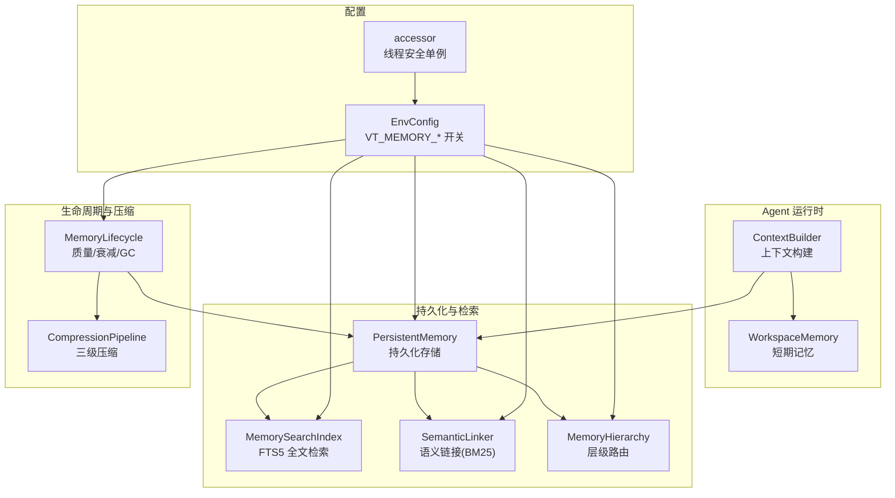
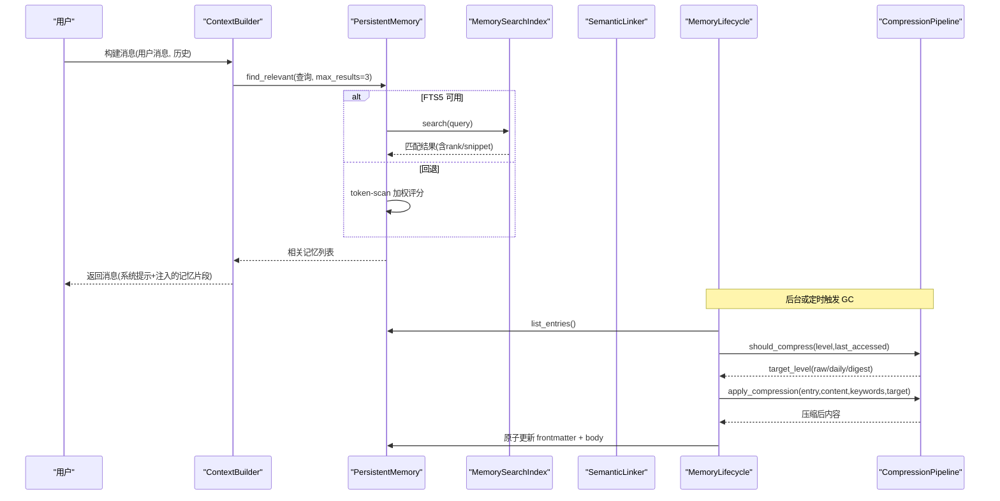
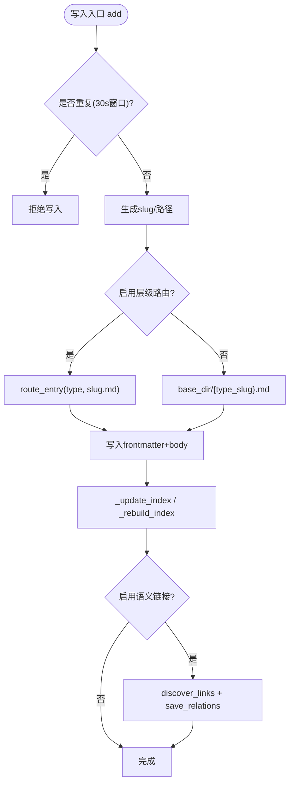
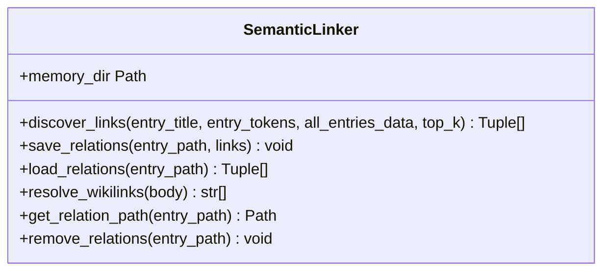
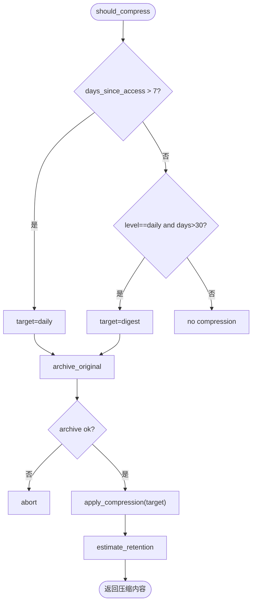
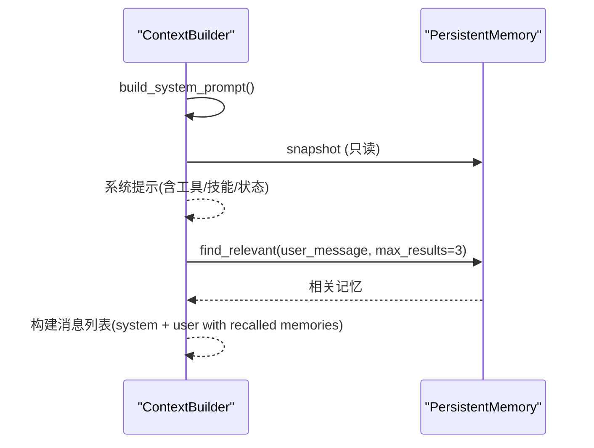
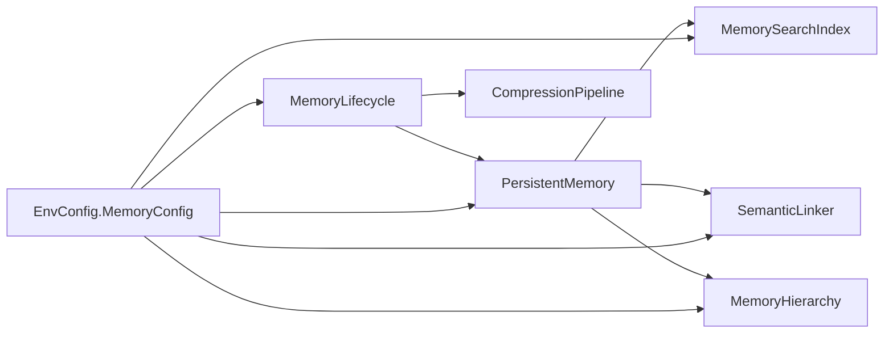

# 内存与上下文系统

<cite>
**本文引用的文件**
- [agent/src/memory/persistent.py](file://agent/src/memory/persistent.py)
- [agent/src/memory/hierarchy.py](file://agent/src/memory/hierarchy.py)
- [agent/src/memory/compression.py](file://agent/src/memory/compression.py)
- [agent/src/memory/lifecycle.py](file://agent/src/memory/lifecycle.py)
- [agent/src/memory/semantic_links.py](file://agent/src/memory/semantic_links.py)
- [agent/src/memory/search_index.py](file://agent/src/memory/search_index.py)
- [agent/src/agent/memory.py](file://agent/src/agent/memory.py)
- [agent/src/agent/context.py](file://agent/src/agent/context.py)
- [agent/src/config/accessor.py](file://agent/src/config/accessor.py)
- [agent/src/config/env_schema.py](file://agent/src/config/env_schema.py)
</cite>

## 目录
1. [简介](#简介)
2. [项目结构](#项目结构)
3. [核心组件](#核心组件)
4. [架构总览](#架构总览)
5. [详细组件分析](#详细组件分析)
6. [依赖关系分析](#依赖关系分析)
7. [性能考量](#性能考量)
8. [故障排查指南](#故障排查指南)
9. [结论](#结论)
10. [附录](#附录)

## 简介
本技术文档面向系统架构师，全面阐述工作区内存管理与上下文构建机制。内容覆盖：
- 短期记忆（会话内工作区状态）与长期记忆（跨会话持久化存储）的分层设计
- 语义链接、检索索引与相关性评分
- 分层存储架构：内存缓存、磁盘持久化、可选的分布式扩展点
- 智能压缩算法：文本摘要、关键信息保留、上下文保持
- 内存使用优化策略：垃圾回收、内存限制、性能调优
- 一致性保证：并发访问控制、数据完整性校验、错误恢复

## 项目结构
内存与上下文系统位于 agent/src/memory 与 agent/src/agent 两个子模块中，配合配置子系统提供可开关的功能特性。

图表来源
- [agent/src/agent/context.py:221-333](file://agent/src/agent/context.py#L221-L333)
- [agent/src/memory/persistent.py:200-654](file://agent/src/memory/persistent.py#L200-L654)
- [agent/src/memory/search_index.py:113-481](file://agent/src/memory/search_index.py#L113-L481)
- [agent/src/memory/semantic_links.py:158-372](file://agent/src/memory/semantic_links.py#L158-L372)
- [agent/src/memory/hierarchy.py:34-436](file://agent/src/memory/hierarchy.py#L34-L436)
- [agent/src/memory/lifecycle.py:71-421](file://agent/src/memory/lifecycle.py#L71-L421)
- [agent/src/memory/compression.py:163-356](file://agent/src/memory/compression.py#L163-L356)
- [agent/src/config/env_schema.py:601-642](file://agent/src/config/env_schema.py#L601-L642)
- [agent/src/config/accessor.py:52-76](file://agent/src/config/accessor.py#L52-L76)

章节来源
- [agent/src/agent/context.py:221-333](file://agent/src/agent/context.py#L221-L333)
- [agent/src/memory/persistent.py:200-654](file://agent/src/memory/persistent.py#L200-L654)
- [agent/src/config/env_schema.py:601-642](file://agent/src/config/env_schema.py#L601-L642)
- [agent/src/config/accessor.py:52-76](file://agent/src/config/accessor.py#L52-L76)

## 核心组件
- 短期记忆：WorkspaceMemory，保存单次运行内的共享状态（如 run_dir、工具调用计数），用于上下文压缩后仍能让模型感知当前任务进度。
- 长期记忆：PersistentMemory，基于文件的跨会话存储，支持 frontmatter 元数据、重要性衰减、去重写入、搜索召回、语义链接与 FTS5 索引。
- 层级路由：MemoryHierarchy，按 memory_type 将条目路由到分类子目录，提升扫描与检索效率。
- 语义链接：SemanticLinker，基于 BM25 自动发现并维护条目间的关联，并以 sidecar JSON 持久化。
- 全文检索：MemorySearchIndex，SQLite FTS5 倒排索引，提供 O(log n) 检索与片段高亮；不可用时回退到 token-scan。
- 生命周期管理：MemoryLifecycle，实现质量评分、访问追踪、重要性衰减、垃圾回收（归档/删除）、以及触发压缩。
- 压缩管线：CompressionPipeline，三级压缩（raw → daily → digest），使用 TF-IDF 句子打分与关键词提取，保留首尾句以维持上下文。
- 上下文构建：ContextBuilder，组装系统提示、注入技能与工具描述、冻结持久化快照，并在用户消息中自动注入相关记忆。

章节来源
- [agent/src/agent/memory.py:13-54](file://agent/src/agent/memory.py#L13-L54)
- [agent/src/memory/persistent.py:126-654](file://agent/src/memory/persistent.py#L126-L654)
- [agent/src/memory/hierarchy.py:34-436](file://agent/src/memory/hierarchy.py#L34-L436)
- [agent/src/memory/semantic_links.py:158-372](file://agent/src/memory/semantic_links.py#L158-L372)
- [agent/src/memory/search_index.py:113-481](file://agent/src/memory/search_index.py#L113-L481)
- [agent/src/memory/lifecycle.py:71-421](file://agent/src/memory/lifecycle.py#L71-L421)
- [agent/src/memory/compression.py:163-356](file://agent/src/memory/compression.py#L163-L356)
- [agent/src/agent/context.py:221-333](file://agent/src/agent/context.py#L221-L333)

## 架构总览
系统采用“短期+长期”双层记忆与“本地文件+可选索引/链接”的混合架构：
- 短期记忆在进程内，轻量且无外部依赖，适合一次 AgentLoop 内的状态共享。
- 长期记忆落盘为 Markdown + frontmatter，支持层级目录、语义链接、FTS5 索引与压缩归档。
- 通过环境变量 VT_MEMORY_* 精细控制功能开关，默认关闭高级特性以保证稳定性。
- 所有写操作均受文件级锁保护，确保并发安全与数据一致性。

图表来源
- [agent/src/agent/context.py:354-390](file://agent/src/agent/context.py#L354-L390)
- [agent/src/memory/persistent.py:362-455](file://agent/src/memory/persistent.py#L362-L455)
- [agent/src/memory/search_index.py:252-302](file://agent/src/memory/search_index.py#L252-L302)
- [agent/src/memory/lifecycle.py:183-273](file://agent/src/memory/lifecycle.py#L183-L273)
- [agent/src/memory/compression.py:171-337](file://agent/src/memory/compression.py#L171-L337)

## 详细组件分析

### 短期记忆：WorkspaceMemory
- 职责：在一次 Agent 运行期间维护共享状态（run_dir、工具计数器），生成简洁的状态摘要，便于上下文压缩后仍能传递任务上下文。
- 复杂度：O(1) 增量更新；to_summary 线性于计数器数量。
- 并发：进程内对象，无需额外同步。

章节来源
- [agent/src/agent/memory.py:13-54](file://agent/src/agent/memory.py#L13-L54)

### 长期记忆：PersistentMemory
- 存储格式：Markdown 文件 + YAML-like frontmatter（name/description/type/id/timestamps/keywords/quality_score/access_count/last_accessed/importance/related_memories/category/compression_level）。
- 写入路径：
  - 若启用层级路由，则根据 memory_type 路由到 category 子目录；否则写入根目录。
  - 文件名 slug 规范化，避免非法字符。
- 去重：30 秒滑动窗口基于 name|description|content 的哈希，防止重试或并行导致的重复写入。
- 检索：
  - 优先使用 FTS5 全文检索（可配置），失败时回退到 token-scan 加权评分（标题/描述/关键词权重更高）。
  - 可选扩展语义链接结果，补充相关条目。
- 并发：文件级独占锁（非 Windows 平台使用 fcntl），超时告警。
- 索引：MEMORY.md 作为快速索引，限制行数避免过大。

图表来源
- [agent/src/memory/persistent.py:479-595](file://agent/src/memory/persistent.py#L479-L595)
- [agent/src/memory/hierarchy.py:70-90](file://agent/src/memory/hierarchy.py#L70-L90)

章节来源
- [agent/src/memory/persistent.py:200-654](file://agent/src/memory/persistent.py#L200-L654)

### 层级路由：MemoryHierarchy
- 目标：将 memory_type 映射到 user/feedback/project/reference 等子目录，使扫描从 O(n) 降为 O(category_size)。
- 能力：
  - route_entry：按类型路由到子目录，未知类型回退根目录。
  - scan_all/scan_category：扫描 .md 文件，跳过系统文件与 archive。
  - rebuild_index：生成 .hierarchy.yaml 统计（count/keywords），用于后续优先级排序。
  - prune_search_scope：基于关键词重叠度对类别进行优先级排序，再拼接基础目录条目。
  - recover_extensionless_entries：修复历史遗留无后缀条目。
  - migrate_flat_entry：将扁平条目迁移至分类目录。

章节来源
- [agent/src/memory/hierarchy.py:34-436](file://agent/src/memory/hierarchy.py#L34-L436)

### 语义链接：SemanticLinker
- 算法：BM25 相似度，参数 k1=1.5, b=0.75；最小阈值过滤；最多输出边数限制。
- 存储：sidecar JSON 文件（{stem}.relations.json），包含 links 列表与更新时间戳。
- 解析：支持正文中的 [[6-char-hex-id]] 显式引用。
- 集成：写入新条目时自动发现链接；删除条目时清理 relations。

图表来源
- [agent/src/memory/semantic_links.py:158-372](file://agent/src/memory/semantic_links.py#L158-L372)

章节来源
- [agent/src/memory/semantic_links.py:158-372](file://agent/src/memory/semantic_links.py#L158-L372)

### 全文检索：MemorySearchIndex
- 存储：SQLite 数据库（WAL 模式），主表 memories + FTS5 虚拟表 memories_fts。
- 能力：
  - index_entry/remove_entry/rebuild_all：增删改查与批量重建。
  - search：MATCH 查询，返回 snippet 与 rank。
  - CJK 处理：插入空格与二元组以提升匹配；查询时生成 unigram+bigram 令牌。
- 降级：FTS5 不可用时返回空结果，由上层回退到 token-scan。

章节来源
- [agent/src/memory/search_index.py:113-481](file://agent/src/memory/search_index.py#L113-L481)

### 生命周期管理：MemoryLifecycle
- 质量与衰减：
  - reinforce：基于事件（task_success/user_confirm 等）调整 quality_score，带会话上限。
  - track_access：记录访问次数与最后访问时间。
  - compute_importance：结合质量、访问次数与 Ebbinghaus 衰减计算重要性。
- 垃圾回收：
  - 依据 importance 阈值决定归档或删除（默认仅归档，删除需显式开启）。
  - 记录 gc.log 审计日志。
- 压缩触发：GC 周期中检查是否需要压缩，并调用 CompressionPipeline。

章节来源
- [agent/src/memory/lifecycle.py:71-421](file://agent/src/memory/lifecycle.py#L71-L421)

### 压缩管线：CompressionPipeline
- 级别：
  - raw：原始内容。
  - daily：保留前/后句 + Top-K 关键句（TF-IDF 打分），约 50% 体积。
  - digest：提取 Top-N 关键词与概念要点，约 10-20% 体积。
- 触发条件：基于 last_accessed 与阈值（7 天/30 天）。
- 安全：压缩前先原子备份到 archive/，失败则中止以避免数据丢失。
- 评估：Jaccard 词集重叠估算信息保留率。

图表来源
- [agent/src/memory/compression.py:171-356](file://agent/src/memory/compression.py#L171-L356)

章节来源
- [agent/src/memory/compression.py:163-356](file://agent/src/memory/compression.py#L163-L356)

### 上下文构建：ContextBuilder
- 系统提示：固定原则、工具/技能描述、当前时间、工作区状态摘要。
- 持久化快照：session 开始时冻结 PersistentMemory.snapshot，保证提示稳定可缓存。
- 自动召回：对用户消息执行 find_relevant，将相关记忆片段以 <recalled-memories> 包裹注入用户消息，增强上下文。

图表来源
- [agent/src/agent/context.py:246-333](file://agent/src/agent/context.py#L246-L333)

章节来源
- [agent/src/agent/context.py:221-333](file://agent/src/agent/context.py#L221-L333)

## 依赖关系分析
- 配置驱动：所有高级特性通过 EnvConfig 的 MemoryConfig 字段控制，统一通过 accessor 获取线程安全的单例。
- 耦合关系：
  - ContextBuilder 依赖 PersistentMemory 进行快照与召回。
  - PersistentMemory 可选择性依赖 SearchIndex、SemanticLinker、Hierarchy。
  - Lifecycle 组合 PersistentMemory 与 CompressionPipeline。
- 外部依赖：SQLite（FTS5），可选；Windows 下文件锁行为不同。

图表来源
- [agent/src/config/env_schema.py:601-642](file://agent/src/config/env_schema.py#L601-L642)
- [agent/src/config/accessor.py:52-76](file://agent/src/config/accessor.py#L52-L76)
- [agent/src/memory/persistent.py:200-654](file://agent/src/memory/persistent.py#L200-L654)
- [agent/src/memory/lifecycle.py:71-421](file://agent/src/memory/lifecycle.py#L71-L421)

章节来源
- [agent/src/config/env_schema.py:601-642](file://agent/src/config/env_schema.py#L601-L642)
- [agent/src/config/accessor.py:52-76](file://agent/src/config/accessor.py#L52-L76)

## 性能考量
- 检索性能：
  - 启用 FTS5 时，检索复杂度近似 O(log n)，并提供片段高亮；不可用时回退到 token-scan。
  - 层级路由减少扫描范围，提高召回速度。
- 写入性能：
  - 文件级锁避免竞争；Windows 下直接放行（平台差异）。
  - 原子写入（临时文件 + rename）防止崩溃导致的数据损坏。
- 压缩成本：
  - TF-IDF 计算与句子分割在 daily/digest 阶段引入 CPU 开销；建议仅在 GC 周期或低峰期触发。
- 内存占用：
  - 去重窗口限制为 30 秒，定期清理过期哈希。
  - 索引行限制（MAX_INDEX_LINES）避免 MEMORY.md 膨胀。
- 可扩展性：
  - 可通过替换 SearchIndex 后端（如向量库）实现分布式检索；当前设计已预留接口。

[本节为通用指导，不直接分析具体文件]

## 故障排查指南
- 写入冲突/超时：
  - 现象：add/remove 过程中出现 lock timeout 警告。
  - 排查：确认是否存在多个进程同时写入同一 memory_dir；检查文件系统权限。
  - 参考：文件锁实现与超时处理。
- FTS5 不可用：
  - 现象：search 返回空，日志提示 FTS5 unavailable。
  - 处理：系统将回退到 token-scan；如需高性能检索，检查 SQLite 编译选项是否包含 FTS5。
- 语义链接异常：
  - 现象：relations.json 读取失败或版本不兼容。
  - 处理：检查文件格式与 version 字段；必要时重建链接。
- 压缩失败：
  - 现象：archive 失败导致压缩中止。
  - 处理：检查 archive 目录权限与磁盘空间；查看日志定位 IO 错误。
- 数据不一致：
  - 现象：MEMORY.md 与实际文件不一致。
  - 处理：调用 _rebuild_index 重建索引；检查是否有外部修改。

章节来源
- [agent/src/memory/persistent.py:41-73](file://agent/src/memory/persistent.py#L41-L73)
- [agent/src/memory/search_index.py:160-173](file://agent/src/memory/search_index.py#L160-L173)
- [agent/src/memory/semantic_links.py:282-319](file://agent/src/memory/semantic_links.py#L282-L319)
- [agent/src/memory/compression.py:261-293](file://agent/src/memory/compression.py#L261-L293)
- [agent/src/memory/persistent.py:647-654](file://agent/src/memory/persistent.py#L647-L654)

## 结论
该内存与上下文系统通过短期/长期记忆分离、层级路由、语义链接与全文检索，实现了高效、可扩展且可配置的跨会话知识管理。压缩与 GC 机制在保证信息保留的同时有效控制存储增长。通过环境变量精细控制各特性，既满足生产稳定性，又提供按需升级的能力。对于架构师而言，建议在大规模部署中：
- 启用层级路由与 FTS5 索引以获得最佳检索性能
- 合理设置 GC 阈值与压缩策略，平衡信息密度与存储成本
- 监控锁竞争与压缩耗时，必要时异步化或分片
- 考虑将 SearchIndex 后端替换为分布式向量检索以支撑更大规模

[本节为总结，不直接分析具体文件]

## 附录

### 环境配置速查（MemoryConfig）
- VT_MEMORY：预设开关（off/on/full）
- VT_MEMORY_QUALITY：启用质量评分与强化
- VT_MEMORY_GC：启用垃圾回收
- VT_MEMORY_DECAY：启用重要性衰减
- VT_MEMORY_HIERARCHY：启用层级目录路由
- VT_MEMORY_LINKS：启用 BM25 语义链接
- VT_MEMORY_COMPRESSION：启用自动压缩
- VT_MEMORY_FTS_INDEX：启用 FTS5 全文检索

章节来源
- [agent/src/config/env_schema.py:601-642](file://agent/src/config/env_schema.py#L601-L642)
- [agent/src/config/accessor.py:52-76](file://agent/src/config/accessor.py#L52-L76)