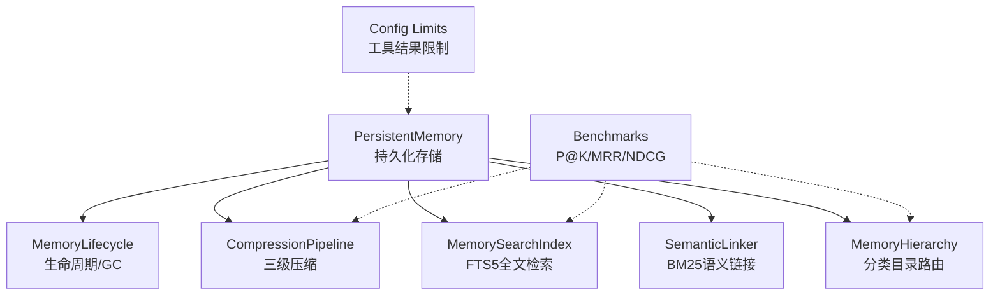
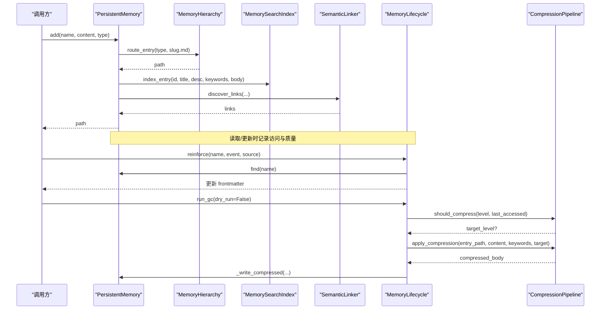
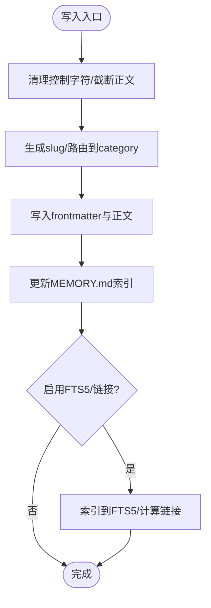
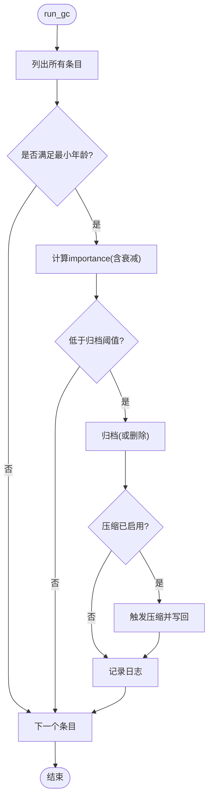
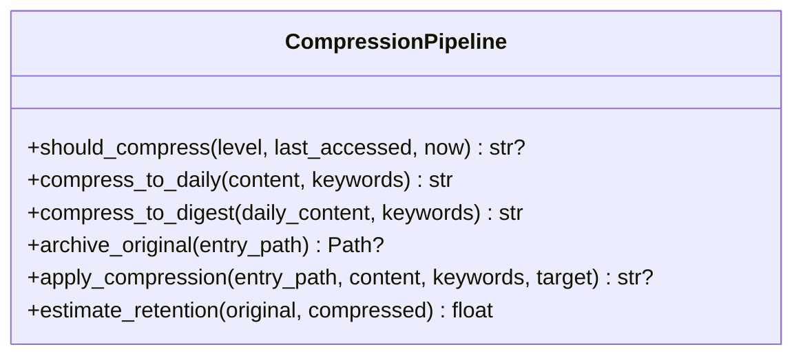
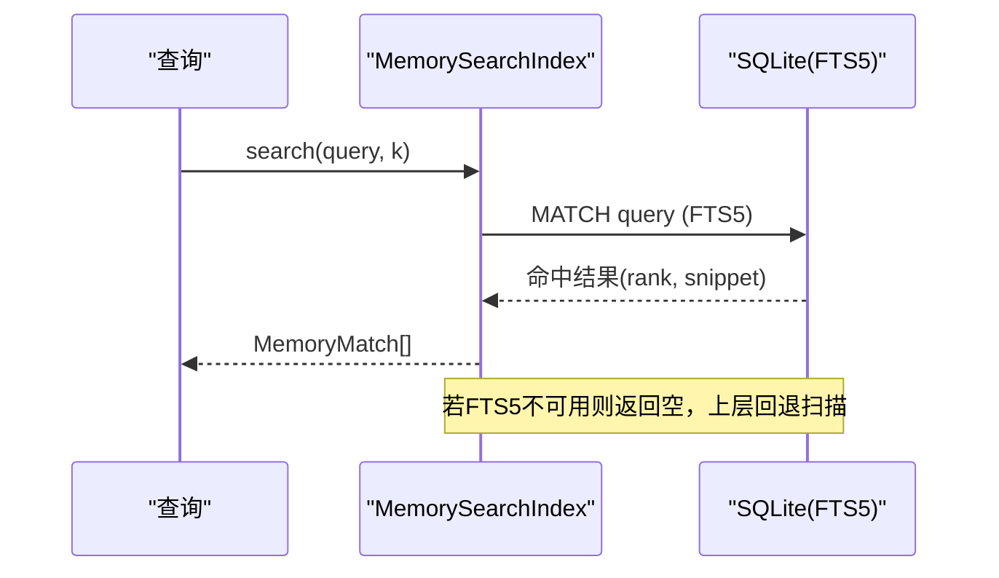
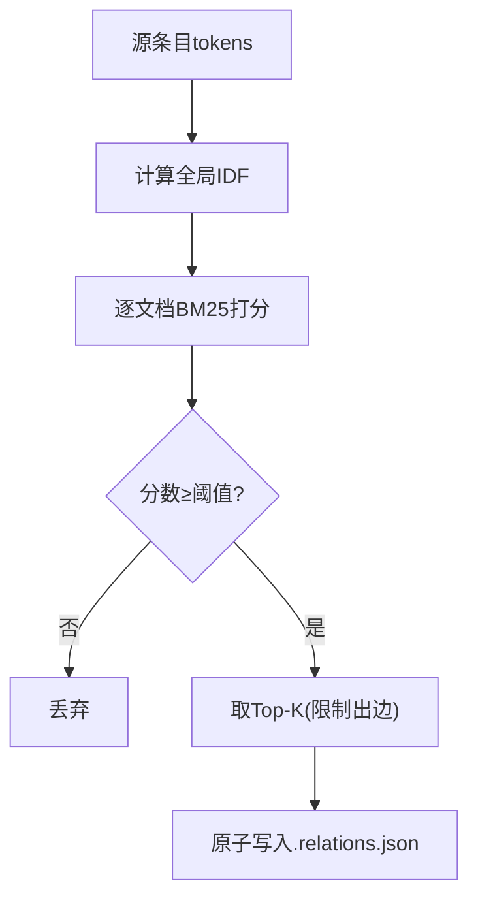
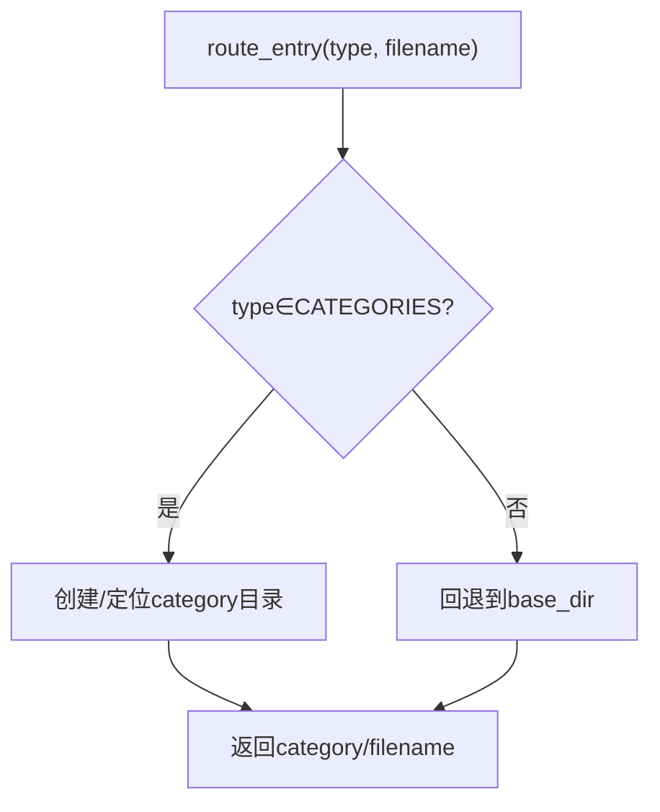
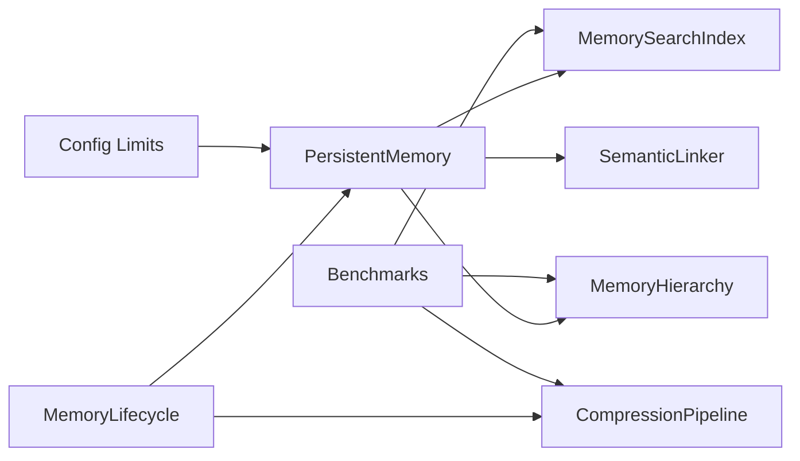
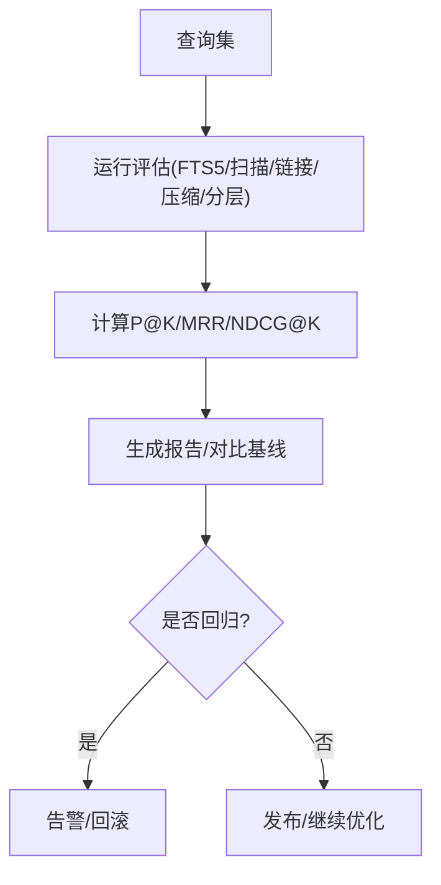

# 内存优化策略

<cite>
**本文引用的文件**
- [agent/src/memory/persistent.py](file://agent/src/memory/persistent.py)
- [agent/src/memory/lifecycle.py](file://agent/src/memory/lifecycle.py)
- [agent/src/memory/compression.py](file://agent/src/memory/compression.py)
- [agent/src/memory/hierarchy.py](file://agent/src/memory/hierarchy.py)
- [agent/src/memory/search_index.py](file://agent/src/memory/search_index.py)
- [agent/src/memory/semantic_links.py](file://agent/src/memory/semantic_links.py)
- [agent/src/config/limits.py](file://agent/src/config/limits.py)
- [agent/tests/memory/benchmarks/metrics.py](file://agent/tests/memory/benchmarks/metrics.py)
- [agent/tests/memory/benchmarks/tier2_runner.py](file://agent/tests/memory/benchmarks/tier2_runner.py)
- [agent/scripts/bench_performance.py](file://agent/scripts/bench_performance.py)
</cite>

## 目录
1. [简介](#简介)
2. [项目结构](#项目结构)
3. [核心组件](#核心组件)
4. [架构总览](#架构总览)
5. [详细组件分析](#详细组件分析)
6. [依赖关系分析](#依赖关系分析)
7. [性能与基准测试](#性能与基准测试)
8. [故障排查指南](#故障排查指南)
9. [结论](#结论)
10. [附录](#附录)

## 简介
本技术文档面向性能工程师与系统调优专家，系统化阐述本仓库中“持久化记忆子系统”的内存优化策略。内容覆盖：
- 内存使用监控与分析：访问统计、重要性衰减、垃圾回收（GC）决策、压缩触发条件与效果评估。
- 智能压缩算法：三级压缩管线（原始→每日摘要→要点摘要），压缩率调优、质量评估（信息保留度）、性能权衡。
- 垃圾回收策略：自动回收触发条件、回收动作（归档/删除）、回收效果日志与评估。
- 内存池与对象复用：通过索引快照、共享搜索索引单例、原子写入与文件锁实现低开销读写与并发安全。
- 内存限制与配额管理：条目大小截断、工具结果长度限制、FTS 正文上限等。
- 性能基准测试：检索质量指标（P@K、MRR、NDCG@K）、延迟对比、回归检测与优化验证。

## 项目结构
持久化记忆子系统位于 agent/src/memory 下，围绕“存储—生命周期—压缩—检索—链接—分层路由”形成完整闭环；配置与限制在 agent/src/config；基准测试与指标在 tests/memory/benchmarks 与 scripts。

图表来源
- [agent/src/memory/persistent.py:200-654](file://agent/src/memory/persistent.py#L200-L654)
- [agent/src/memory/lifecycle.py:71-421](file://agent/src/memory/lifecycle.py#L71-L421)
- [agent/src/memory/compression.py:163-356](file://agent/src/memory/compression.py#L163-L356)
- [agent/src/memory/search_index.py:113-481](file://agent/src/memory/search_index.py#L113-L481)
- [agent/src/memory/semantic_links.py:158-372](file://agent/src/memory/semantic_links.py#L158-L372)
- [agent/src/memory/hierarchy.py:34-436](file://agent/src/memory/hierarchy.py#L34-L436)
- [agent/src/config/limits.py:1-49](file://agent/src/config/limits.py#L1-L49)
- [agent/tests/memory/benchmarks/tier2_runner.py:117-540](file://agent/tests/memory/benchmarks/tier2_runner.py#L117-L540)

章节来源
- [agent/src/memory/persistent.py:200-654](file://agent/src/memory/persistent.py#L200-L654)
- [agent/src/memory/lifecycle.py:71-421](file://agent/src/memory/lifecycle.py#L71-L421)
- [agent/src/memory/compression.py:163-356](file://agent/src/memory/compression.py#L163-L356)
- [agent/src/memory/search_index.py:113-481](file://agent/src/memory/search_index.py#L113-L481)
- [agent/src/memory/semantic_links.py:158-372](file://agent/src/memory/semantic_links.py#L158-L372)
- [agent/src/memory/hierarchy.py:34-436](file://agent/src/memory/hierarchy.py#L34-L436)
- [agent/src/config/limits.py:1-49](file://agent/src/config/limits.py#L1-L49)
- [agent/tests/memory/benchmarks/tier2_runner.py:117-540](file://agent/tests/memory/benchmarks/tier2_runner.py#L117-L540)

## 核心组件
- 持久化存储（PersistentMemory）
  - 以 Markdown + Frontmatter 形式持久化记忆条目，维护 MEMORY.md 索引与最近哈希去重窗口，支持层级路由开关。
  - 提供添加、查找、相关检索、删除、重建索引等能力；对正文进行控制字符清理与长度截断。
- 生命周期管理（MemoryLifecycle）
  - 基于事件的质量分数强化（用户确认/拒绝、任务成功/失败、被动衰减）。
  - 访问计数与最后访问时间追踪。
  - 垃圾回收：按重要性阈值决定归档或删除（默认仅归档），并联动压缩周期。
- 压缩管线（CompressionPipeline）
  - 三级压缩：raw → daily（TF-IDF关键句抽取）→ digest（关键词要点列表）。
  - 压缩前自动归档原文，压缩后估算信息保留度（Jaccard token 重叠）。
- 全文检索（MemorySearchIndex）
  - SQLite FTS5 倒排索引，支持中文分词扩展（一元+二元），WAL 模式与线程安全。
  - 自动重建与降级回退到 O(n) 扫描。
- 语义链接（SemanticLinker）
  - BM25 相似度发现关联条目，侧边 .relations.json 持久化，支持 wikilink 解析。
- 分层路由（MemoryHierarchy）
  - 按 memory_type 将条目路由至 category 子目录，构建索引以缩小检索范围。
- 限制与配额（Config Limits）
  - 工具结果长度限制与截断提示，避免模型上下文溢出。

章节来源
- [agent/src/memory/persistent.py:200-654](file://agent/src/memory/persistent.py#L200-L654)
- [agent/src/memory/lifecycle.py:71-421](file://agent/src/memory/lifecycle.py#L71-L421)
- [agent/src/memory/compression.py:163-356](file://agent/src/memory/compression.py#L163-L356)
- [agent/src/memory/search_index.py:113-481](file://agent/src/memory/search_index.py#L113-L481)
- [agent/src/memory/semantic_links.py:158-372](file://agent/src/memory/semantic_links.py#L158-L372)
- [agent/src/memory/hierarchy.py:34-436](file://agent/src/memory/hierarchy.py#L34-L436)
- [agent/src/config/limits.py:1-49](file://agent/src/config/limits.py#L1-L49)

## 架构总览
下图展示从写入到检索、压缩、GC 的端到端流程，以及各模块间的依赖关系。

图表来源
- [agent/src/memory/persistent.py:479-595](file://agent/src/memory/persistent.py#L479-L595)
- [agent/src/memory/hierarchy.py:70-90](file://agent/src/memory/hierarchy.py#L70-L90)
- [agent/src/memory/search_index.py:207-250](file://agent/src/memory/search_index.py#L207-L250)
- [agent/src/memory/semantic_links.py:179-230](file://agent/src/memory/semantic_links.py#L179-L230)
- [agent/src/memory/lifecycle.py:112-158](file://agent/src/memory/lifecycle.py#L112-L158)
- [agent/src/memory/lifecycle.py:183-273](file://agent/src/memory/lifecycle.py#L183-L273)
- [agent/src/memory/compression.py:171-337](file://agent/src/memory/compression.py#L171-L337)

## 详细组件分析

### 持久化存储（PersistentMemory）
- 数据模型：MemoryEntry 包含标题、描述、类型、正文、时间戳、关键字、质量分数、访问次数、重要性、压缩级别等。
- 写入路径：生成 slug、清理与截断正文、写入 frontmatter，更新索引；可选地建立 FTS5 索引与语义链接。
- 检索路径：优先 FTS5 检索，失败或空结果时回退到 token 扫描；结合重要性权重排序；可展开语义链接。
- 并发与一致性：文件级独占锁（跨平台兼容），原子写入（临时文件+rename）。
- 内存占用控制：正文截断（MAX_ENTRY_CHARS）、去重滑动窗口（近期哈希）、索引行限制（MAX_INDEX_LINES）。

图表来源
- [agent/src/memory/persistent.py:479-595](file://agent/src/memory/persistent.py#L479-L595)
- [agent/src/memory/persistent.py:226-311](file://agent/src/memory/persistent.py#L226-L311)
- [agent/src/memory/persistent.py:362-455](file://agent/src/memory/persistent.py#L362-L455)

章节来源
- [agent/src/memory/persistent.py:126-147](file://agent/src/memory/persistent.py#L126-L147)
- [agent/src/memory/persistent.py:200-654](file://agent/src/memory/persistent.py#L200-L654)

### 生命周期与垃圾回收（MemoryLifecycle）
- 质量强化：根据事件（任务成功/失败、用户确认/拒绝、被动衰减）调整 quality_score，带会话内增量上限保护。
- 访问追踪：每次读取/召回更新 access_count 与 last_accessed。
- GC 策略：
  - 计算重要性：结合 quality_score、access_count、距上次访问时间衰减。
  - 阈值判定：低于归档阈值则归档；低于删除阈值且允许删除则删除（默认仅归档）。
  - 联动压缩：非 dry_run 时，对老化条目触发压缩，并写回压缩级别与更新时间。
  - 日志记录：所有决策写入 gc.log，便于审计与回归分析。

图表来源
- [agent/src/memory/lifecycle.py:183-273](file://agent/src/memory/lifecycle.py#L183-L273)
- [agent/src/memory/lifecycle.py:275-318](file://agent/src/memory/lifecycle.py#L275-L318)
- [agent/src/memory/lifecycle.py:323-421](file://agent/src/memory/lifecycle.py#L323-L421)

章节来源
- [agent/src/memory/lifecycle.py:71-421](file://agent/src/memory/lifecycle.py#L71-L421)

### 智能压缩（CompressionPipeline）
- 三级压缩：
  - raw → daily：句子切分、TF-IDF 评分、保留首尾句与 top-k 关键句，附带关键词头。
  - daily → digest：词频×IDF 加权提取 top-N 关键词，输出要点列表。
- 触发条件：依据 last_accessed 与阈值（天）判断是否需要压缩。
- 质量评估：Jaccard token 重叠估计信息保留度。
- 安全机制：压缩前先原子归档原文，失败则中止以避免数据丢失。

图表来源
- [agent/src/memory/compression.py:163-356](file://agent/src/memory/compression.py#L163-L356)

章节来源
- [agent/src/memory/compression.py:163-356](file://agent/src/memory/compression.py#L163-L356)

### 全文检索（MemorySearchIndex）
- 数据结构：SQLite memories 表 + memories_fts 虚拟表（FTS5），WAL 模式提升并发性能。
- 中文处理：连续 CJK 字符展开为一元+二元 token，查询时同样处理，提升匹配召回。
- 操作：index_entry/remove_entry/search/rebuild_all；线程安全（操作锁）。
- 降级：若 FTS5 不可用，返回空结果，由上层回退到 token 扫描。

图表来源
- [agent/src/memory/search_index.py:147-196](file://agent/src/memory/search_index.py#L147-L196)
- [agent/src/memory/search_index.py:252-302](file://agent/src/memory/search_index.py#L252-L302)
- [agent/src/memory/search_index.py:357-445](file://agent/src/memory/search_index.py#L357-L445)

章节来源
- [agent/src/memory/search_index.py:113-481](file://agent/src/memory/search_index.py#L113-L481)

### 语义链接（SemanticLinker）
- 方法：BM25 相似度计算，基于全局 IDF 与平均文档长度，过滤低分链接并限制出边数量。
- 存储：侧边 .relations.json 原子写入，版本化字段，支持加载与移除。
- 集成：写入新条目时可自动发现链接；检索时可扩展结果集以提升召回。

图表来源
- [agent/src/memory/semantic_links.py:73-150](file://agent/src/memory/semantic_links.py#L73-L150)
- [agent/src/memory/semantic_links.py:179-230](file://agent/src/memory/semantic_links.py#L179-L230)
- [agent/src/memory/semantic_links.py:232-319](file://agent/src/memory/semantic_links.py#L232-L319)

章节来源
- [agent/src/memory/semantic_links.py:158-372](file://agent/src/memory/semantic_links.py#L158-L372)

### 分层路由（MemoryHierarchy）
- 目标：将条目按 memory_type 路由到 category 子目录，降低扫描复杂度为 O(category_size)。
- 功能：路由、扫描（全量/分类）、恢复无后缀条目、重建索引（类别统计与关键词）、按关键词重叠优先级排序扫描顺序。
- 迁移：支持将扁平存储条目迁移到对应分类目录。

图表来源
- [agent/src/memory/hierarchy.py:70-90](file://agent/src/memory/hierarchy.py#L70-L90)
- [agent/src/memory/hierarchy.py:145-176](file://agent/src/memory/hierarchy.py#L145-L176)
- [agent/src/memory/hierarchy.py:313-379](file://agent/src/memory/hierarchy.py#L313-L379)

章节来源
- [agent/src/memory/hierarchy.py:34-436](file://agent/src/memory/hierarchy.py#L34-L436)

### 内存限制与配额管理
- 正文截断：写入时截断过长正文，避免单次条目过大导致内存压力。
- 工具结果限制：统一工具结果长度上限与截断提示，防止上下文溢出。
- FTS 正文上限：FTS5 索引时对正文做长度限制，控制索引体积。
- 去重窗口：短期重复写入拦截，减少冗余条目带来的内存与磁盘占用。

章节来源
- [agent/src/memory/persistent.py:158-169](file://agent/src/memory/persistent.py#L158-L169)
- [agent/src/memory/persistent.py:472-492](file://agent/src/memory/persistent.py#L472-L492)
- [agent/src/memory/search_index.py:25-26](file://agent/src/memory/search_index.py#L25-L26)
- [agent/src/config/limits.py:12-49](file://agent/src/config/limits.py#L12-L49)

## 依赖关系分析
- PersistentMemory 作为核心枢纽，依赖：
  - MemoryHierarchy（可选，按配置启用）进行目录路由。
  - MemorySearchIndex（可选）提供 FTS5 检索。
  - SemanticLinker（可选）提供语义链接。
  - MemoryLifecycle 负责质量强化、GC 与压缩联动。
  - Config Limits 提供统一的长度限制策略。
- 测试与基准：
  - metrics.py 提供 P@K、MRR、NDCG@K 等检索质量指标。
  - tier2_runner.py 对 FTS5、语义链接、压缩、分层路由进行综合评测。
  - bench_performance.py 提供通用性能基准脚本（因子算子与权益计算）。

图表来源
- [agent/src/memory/persistent.py:200-654](file://agent/src/memory/persistent.py#L200-L654)
- [agent/src/memory/lifecycle.py:71-421](file://agent/src/memory/lifecycle.py#L71-L421)
- [agent/tests/memory/benchmarks/tier2_runner.py:117-540](file://agent/tests/memory/benchmarks/tier2_runner.py#L117-L540)

章节来源
- [agent/src/memory/persistent.py:200-654](file://agent/src/memory/persistent.py#L200-L654)
- [agent/src/memory/lifecycle.py:71-421](file://agent/src/memory/lifecycle.py#L71-L421)
- [agent/tests/memory/benchmarks/tier2_runner.py:117-540](file://agent/tests/memory/benchmarks/tier2_runner.py#L117-L540)

## 性能与基准测试
- 检索质量指标
  - P@K：Top-K 命中率。
  - MRR：首个相关结果的倒数排名。
  - NDCG@K：位置感知的归一化折损累计增益。
- 基准场景
  - FTS5 vs O(n) 扫描：对比质量与延迟，计算加速比。
  - 语义链接扩展：比较直接 Top-5 与 Top-3 + 链接扩展的 P@5。
  - 压缩信息保留：评估 daily/digest 压缩后的 Jaccard 保留度与检索质量变化。
  - 分层路由：评估分类裁剪后的检索空间缩减比例与质量保持。
- 执行方式
  - 使用 tier2_runner.py 提供的评估函数，配合 metrics.py 指标计算。
  - 使用 bench_performance.py 进行通用性能基准（因子算子、权益计算）。

图表来源
- [agent/tests/memory/benchmarks/metrics.py:14-82](file://agent/tests/memory/benchmarks/metrics.py#L14-L82)
- [agent/tests/memory/benchmarks/tier2_runner.py:117-540](file://agent/tests/memory/benchmarks/tier2_runner.py#L117-L540)
- [agent/scripts/bench_performance.py:19-134](file://agent/scripts/bench_performance.py#L19-L134)

章节来源
- [agent/tests/memory/benchmarks/metrics.py:14-82](file://agent/tests/memory/benchmarks/metrics.py#L14-L82)
- [agent/tests/memory/benchmarks/tier2_runner.py:117-540](file://agent/tests/memory/benchmarks/tier2_runner.py#L117-L540)
- [agent/scripts/bench_performance.py:19-134](file://agent/scripts/bench_performance.py#L19-L134)

## 故障排查指南
- 压缩失败
  - 现象：归档失败或压缩异常，可能中断写入。
  - 排查：检查 archive 目录权限与磁盘空间；查看日志中的归档失败与压缩异常信息。
  - 参考：[compression.py:261-337](file://agent/src/memory/compression.py#L261-L337)
- GC 未生效
  - 现象：压缩未触发或 GC 未执行。
  - 排查：确认 VT_MEMORY_GC 与 VT_MEMORY_COMPRESSION 配置；检查 dry_run 模式；查看 gc.log。
  - 参考：[lifecycle.py:183-273](file://agent/src/memory/lifecycle.py#L183-L273)
- FTS5 不可用
  - 现象：检索结果为空或回退到扫描。
  - 排查：检查 SQLite 是否支持 FTS5；查看初始化日志；必要时重建索引。
  - 参考：[search_index.py:147-196](file://agent/src/memory/search_index.py#L147-L196)
- 并发写入冲突
  - 现象：写入超时或锁竞争。
  - 排查：检查 memory_lock 超时设置；减少并发写入频率；确保原子写入路径正常。
  - 参考：[persistent.py:41-73](file://agent/src/memory/persistent.py#L41-L73)

章节来源
- [agent/src/memory/compression.py:261-337](file://agent/src/memory/compression.py#L261-L337)
- [agent/src/memory/lifecycle.py:183-273](file://agent/src/memory/lifecycle.py#L183-L273)
- [agent/src/memory/search_index.py:147-196](file://agent/src/memory/search_index.py#L147-L196)
- [agent/src/memory/persistent.py:41-73](file://agent/src/memory/persistent.py#L41-L73)

## 结论
本持久化记忆子系统通过“质量强化—重要性衰减—GC—压缩—检索—链接—分层路由”的组合策略，实现了高吞吐、低内存占用的记忆管理与检索能力。其特点包括：
- 可插拔的 FTS5 索引与 BM25 语义链接，兼顾速度与召回。
- 三级压缩在保证信息保留的前提下显著降低存储与传输成本。
- 严格的并发控制与原子写入保障数据一致性与安全性。
- 完善的基准测试体系支撑持续优化与回归检测。

建议在生产环境中：
- 开启 FTS5 与语义链接以获得更好的检索体验。
- 合理配置 GC 阈值与压缩触发条件，平衡质量与资源。
- 定期运行基准测试，监控性能回归并及时调优。

## 附录
- 环境变量与开关
  - VT_MEMORY_QUALITY：启用质量评分与访问追踪。
  - VT_MEMORY_GC：启用垃圾回收。
  - VT_MEMORY_DECAY：启用重要性衰减。
  - VT_MEMORY_FTS_INDEX：启用 FTS5 全文检索。
  - VT_MEMORY_LINKS：启用语义链接。
  - VT_MEMORY_HIERARCHY：启用分层目录路由。
  - VT_MEMORY_COMPRESSION：启用压缩。
- 关键阈值与常量
  - 压缩阈值：daily 7 天、digest 30 天。
  - GC 阈值：归档 0.15、删除 0.05、最小年龄 7 天。
  - 正文限制：MAX_ENTRY_CHARS、FTS 正文上限。
  - 工具结果限制：TOOL_RESULT_LIMIT。

章节来源
- [agent/src/memory/compression.py:23-39](file://agent/src/memory/compression.py#L23-L39)
- [agent/src/memory/lifecycle.py:92-98](file://agent/src/memory/lifecycle.py#L92-L98)
- [agent/src/memory/persistent.py:21-32](file://agent/src/memory/persistent.py#L21-L32)
- [agent/src/memory/search_index.py:25-26](file://agent/src/memory/search_index.py#L25-L26)
- [agent/src/config/limits.py:12-49](file://agent/src/config/limits.py#L12-L49)