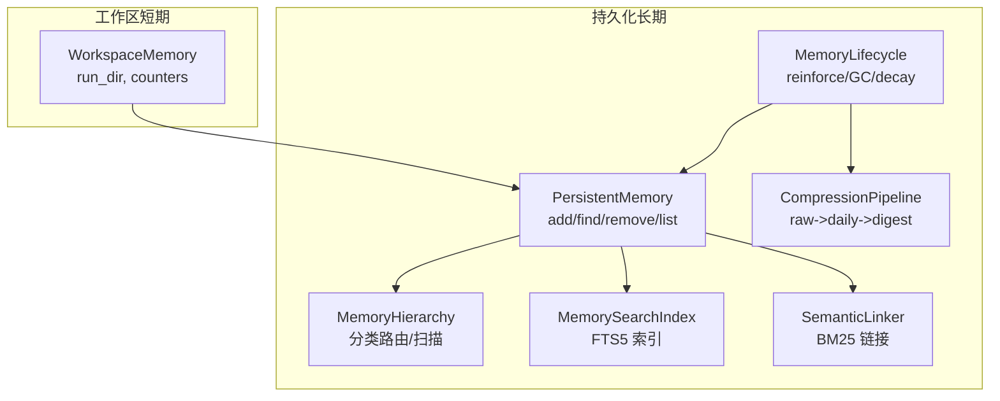
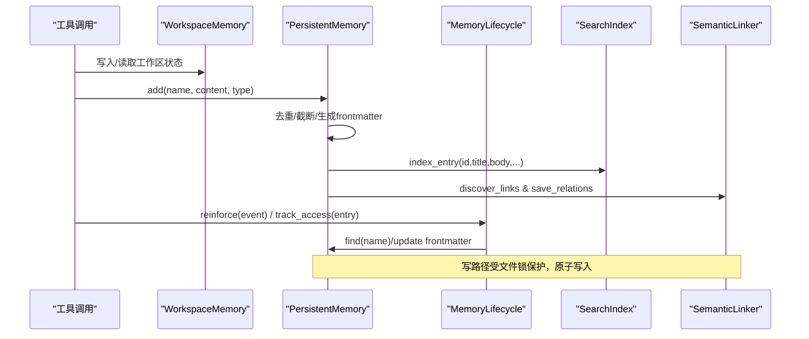
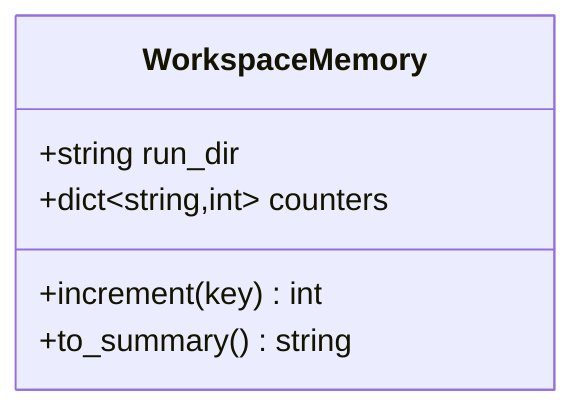
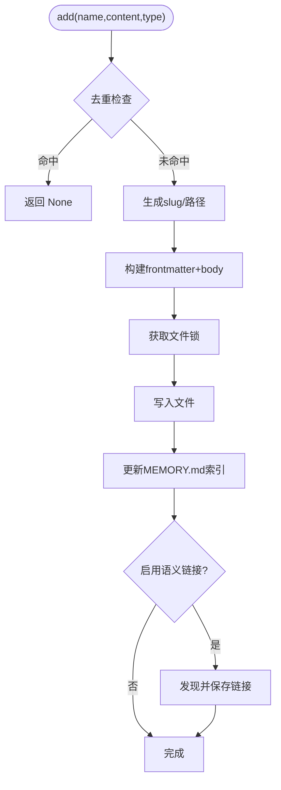
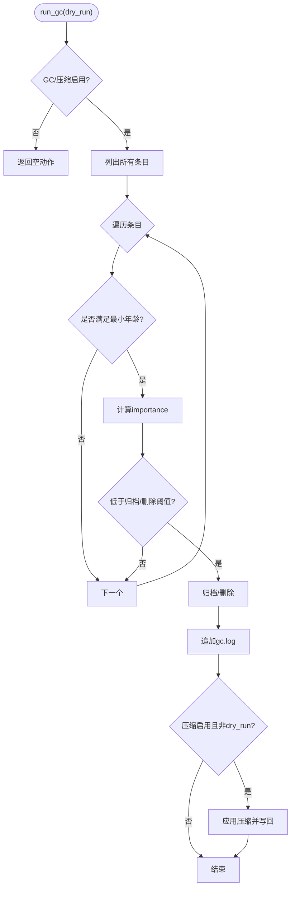
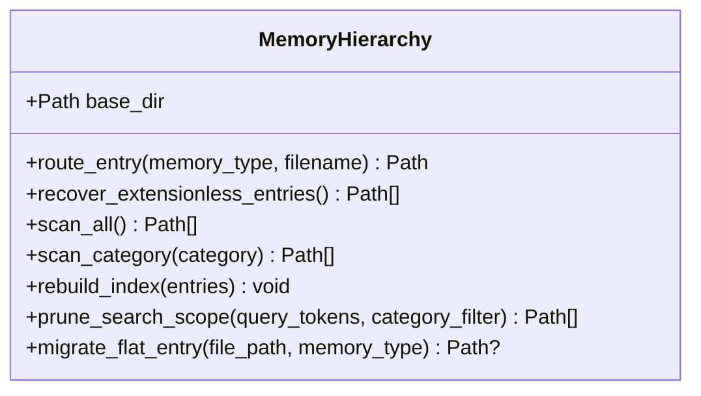
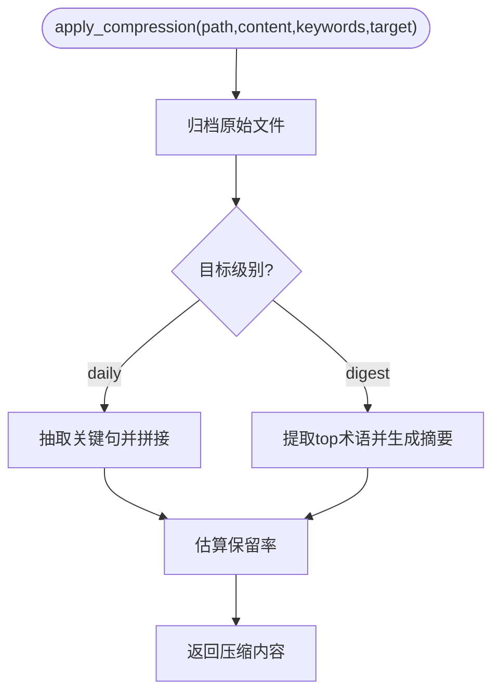
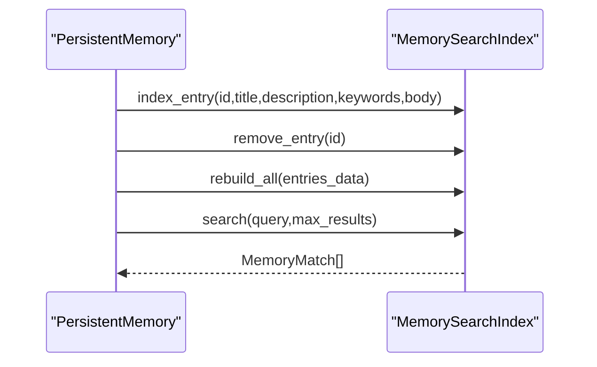
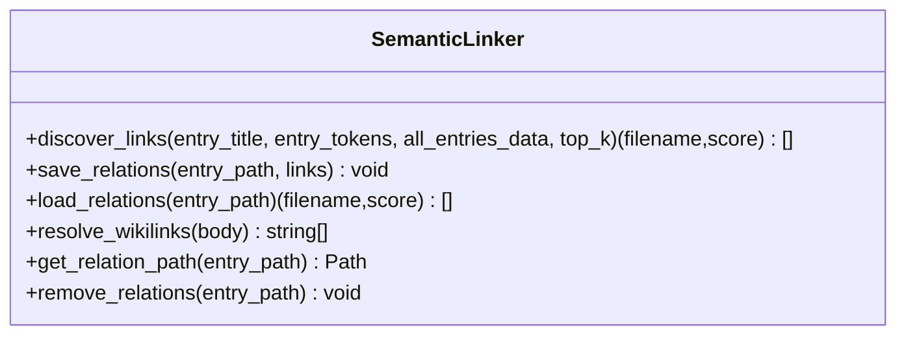
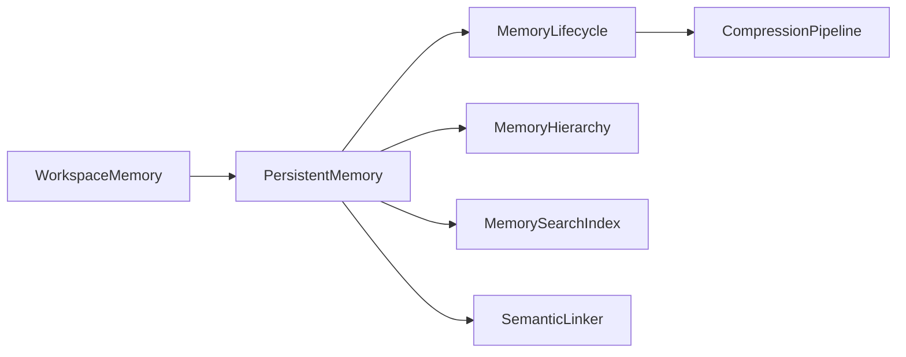

# 内存架构设计

<cite>
**本文引用的文件**
- [agent/src/agent/memory.py](file://agent/src/agent/memory.py)
- [agent/src/memory/persistent.py](file://agent/src/memory/persistent.py)
- [agent/src/memory/lifecycle.py](file://agent/src/memory/lifecycle.py)
- [agent/src/memory/hierarchy.py](file://agent/src/memory/hierarchy.py)
- [agent/src/memory/compression.py](file://agent/src/memory/compression.py)
- [agent/src/memory/search_index.py](file://agent/src/memory/search_index.py)
- [agent/src/memory/semantic_links.py](file://agent/src/memory/semantic_links.py)
- [agent/tests/test_memory_lifecycle.py](file://agent/tests/test_memory_lifecycle.py)
</cite>

## 目录
1. [简介](#简介)
2. [项目结构](#项目结构)
3. [核心组件](#核心组件)
4. [架构总览](#架构总览)
5. [详细组件分析](#详细组件分析)
6. [依赖关系分析](#依赖关系分析)
7. [性能与容量规划](#性能与容量规划)
8. [故障排查指南](#故障排查指南)
9. [结论](#结论)
10. [附录：配置开关与阈值](#附录：配置开关与阈值)

## 简介
本技术文档面向系统架构师与高级开发者，系统性阐述工作空间内存管理系统的设计与实现。重点覆盖：
- 工作区内存（WorkspaceMemory）数据类的作用与生命周期
- 短期记忆与长期记忆的分离策略、运行时状态管理与跨会话持久化
- 分层存储架构：内存缓存层、磁盘持久化层、索引与语义关联层
- 内存生命周期管理：分配、使用监控、重要性衰减、垃圾回收与压缩
- 并发安全、异常恢复与资源清理保证
- 性能优化策略：限制、缓存、检索加速、压缩与归档

## 项目结构
内存子系统位于 agent/src/memory 与 agent/src/agent 中，围绕“工作区短期状态 + 持久化长期记忆”的双层模型组织：
- 工作区短期状态：agent/src/agent/memory.py 中的 WorkspaceMemory，用于单次 AgentLoop 运行期间的共享状态
- 持久化长期记忆：agent/src/memory/persistent.py 的 PersistentMemory，基于 Markdown frontmatter 的文件存储
- 生命周期与质量：agent/src/memory/lifecycle.py 的质量评分、访问追踪、重要性衰减与垃圾回收
- 分层路由与扫描：agent/src/memory/hierarchy.py 的分类目录路由与 O(类别规模) 范围搜索
- 压缩与归档：agent/src/memory/compression.py 的三级压缩（raw/daily/digest）与归档
- 全文检索：agent/src/memory/search_index.py 的 SQLite FTS5 索引
- 语义链接：agent/src/memory/semantic_links.py 的 BM25 相似度与 .relations.json 边车文件

图表来源
- [agent/src/agent/memory.py:13-54](file://agent/src/agent/memory.py#L13-L54)
- [agent/src/memory/persistent.py:200-654](file://agent/src/memory/persistent.py#L200-L654)
- [agent/src/memory/lifecycle.py:71-421](file://agent/src/memory/lifecycle.py#L71-L421)
- [agent/src/memory/hierarchy.py:34-436](file://agent/src/memory/hierarchy.py#L34-L436)
- [agent/src/memory/compression.py:163-356](file://agent/src/memory/compression.py#L163-L356)
- [agent/src/memory/search_index.py:113-481](file://agent/src/memory/search_index.py#L113-L481)
- [agent/src/memory/semantic_links.py:158-372](file://agent/src/memory/semantic_links.py#L158-L372)

章节来源
- [agent/src/agent/memory.py:1-54](file://agent/src/agent/memory.py#L1-L54)
- [agent/src/memory/persistent.py:1-654](file://agent/src/memory/persistent.py#L1-L654)
- [agent/src/memory/lifecycle.py:1-421](file://agent/src/memory/lifecycle.py#L1-L421)
- [agent/src/memory/hierarchy.py:1-436](file://agent/src/memory/hierarchy.py#L1-L436)
- [agent/src/memory/compression.py:1-356](file://agent/src/memory/compression.py#L1-L356)
- [agent/src/memory/search_index.py:1-481](file://agent/src/memory/search_index.py#L1-L481)
- [agent/src/memory/semantic_links.py:1-372](file://agent/src/memory/semantic_links.py#L1-L372)

## 核心组件
- WorkspaceMemory：单进程、单次运行的轻量级工作区状态，维护 run_dir 与工具调用计数器，提供 to_summary 输出以辅助 LLM 上下文保持
- PersistentMemory：基于文件的跨会话持久化记忆，支持 frontmatter 元数据、去重、关键词检索、FTS5 索引、语义链接
- MemoryLifecycle：质量强化、访问计数、重要性衰减、垃圾回收（归档/删除）、压缩触发
- MemoryHierarchy：按 memory_type 分类的路由与扫描，提升检索范围定位效率
- CompressionPipeline：三级压缩（raw/daily/digest），保留原始内容到 archive，估算信息保留率
- MemorySearchIndex：SQLite FTS5 全文检索，CJK 分词与 bigram 扩展，WAL 模式与线程安全
- SemanticLinker：BM25 相似度发现链接，.relations.json 边车文件，wikilink 解析

章节来源
- [agent/src/agent/memory.py:13-54](file://agent/src/agent/memory.py#L13-L54)
- [agent/src/memory/persistent.py:126-654](file://agent/src/memory/persistent.py#L126-L654)
- [agent/src/memory/lifecycle.py:71-421](file://agent/src/memory/lifecycle.py#L71-L421)
- [agent/src/memory/hierarchy.py:34-436](file://agent/src/memory/hierarchy.py#L34-L436)
- [agent/src/memory/compression.py:163-356](file://agent/src/memory/compression.py#L163-L356)
- [agent/src/memory/search_index.py:113-481](file://agent/src/memory/search_index.py#L113-L481)
- [agent/src/memory/semantic_links.py:158-372](file://agent/src/memory/semantic_links.py#L158-L372)

## 架构总览
系统采用“短期工作区 + 长期持久化”的分层设计：
- 短期层（WorkspaceMemory）：进程内驻留，随 AgentLoop 生命周期创建与销毁，承载高频、低时延的状态读写
- 持久层（PersistentMemory）：Markdown frontmatter 文件存储，具备元数据、时间戳、质量分数、访问计数等
- 索引与语义层（SearchIndex/SemanticLinker）：FTS5 全文检索与 BM25 语义链接，增强召回与关联推理
- 生命周期管理层（Lifecycle/Hierarchy/Compression）：质量强化、重要性衰减、GC 归档/删除、分级压缩与归档

图表来源
- [agent/src/agent/memory.py:13-54](file://agent/src/agent/memory.py#L13-L54)
- [agent/src/memory/persistent.py:479-595](file://agent/src/memory/persistent.py#L479-L595)
- [agent/src/memory/lifecycle.py:112-178](file://agent/src/memory/lifecycle.py#L112-L178)
- [agent/src/memory/search_index.py:207-250](file://agent/src/memory/search_index.py#L207-L250)
- [agent/src/memory/semantic_links.py:179-230](file://agent/src/memory/semantic_links.py#L179-L230)

## 详细组件分析

### 工作区内存（WorkspaceMemory）
- 职责：在单次 AgentLoop.run() 期间维护共享状态（如当前运行目录、工具调用计数），提供 to_summary 以便 LLM 上下文压缩后仍能感知上下文
- 数据结构：run_dir（可选字符串）、counters（键值计数器）
- 生命周期：随工作区创建而初始化，随运行结束而释放；不跨会话持久化
- 并发：进程内单实例，无外部锁；若需跨进程共享应通过 IPC/文件系统

图表来源
- [agent/src/agent/memory.py:13-54](file://agent/src/agent/memory.py#L13-L54)

章节来源
- [agent/src/agent/memory.py:1-54](file://agent/src/agent/memory.py#L1-L54)

### 持久化记忆（PersistentMemory）
- 职责：跨会话持久化记忆，支持添加、查找、删除、列表、相关度检索；维护 MEMORY.md 索引快照；支持 FTS5 与语义链接
- 关键特性：
  - frontmatter 元数据：name、description、type、id、created_at、updated_at、keywords、quality_score、access_count、last_accessed、importance、related_memories、category、compression_level
  - 去重：30秒滑动窗口哈希去重，防止重试或并行导致的重复写入
  - 检索：优先 FTS5，回退到 token 扫描并加权重要性
  - 并发：文件级锁（非 Windows 平台使用 fcntl），原子写入（临时文件+rename）
  - 索引重建：删除/更新后重建 MEMORY.md 索引

图表来源
- [agent/src/memory/persistent.py:479-595](file://agent/src/memory/persistent.py#L479-L595)
- [agent/src/memory/persistent.py:472-492](file://agent/src/memory/persistent.py#L472-L492)
- [agent/src/memory/persistent.py:626-654](file://agent/src/memory/persistent.py#L626-L654)

章节来源
- [agent/src/memory/persistent.py:126-654](file://agent/src/memory/persistent.py#L126-L654)

### 生命周期管理（MemoryLifecycle）
- 职责：质量强化（reinforce）、访问追踪（track_access）、重要性衰减、垃圾回收（archive/delete）、压缩触发
- 质量强化：根据事件类型（任务成功/失败、用户确认/拒绝、被动衰减）调整 quality_score，限制会话增量上限
- 衰减与重要性：基于 Ebbinghaus 遗忘曲线计算 importance，结合访问次数奖励
- GC：按年龄、重要性阈值进行归档或删除，记录 gc.log；可 dry-run 审计
- 压缩：当 GC 执行且开启压缩时，对老化条目进行压缩并更新 frontmatter 的 compression_level

图表来源
- [agent/src/memory/lifecycle.py:183-273](file://agent/src/memory/lifecycle.py#L183-L273)
- [agent/src/memory/lifecycle.py:275-318](file://agent/src/memory/lifecycle.py#L275-L318)
- [agent/src/memory/lifecycle.py:323-421](file://agent/src/memory/lifecycle.py#L323-L421)

章节来源
- [agent/src/memory/lifecycle.py:1-421](file://agent/src/memory/lifecycle.py#L1-L421)

### 分层存储与路由（MemoryHierarchy）
- 职责：将记忆文件按 memory_type 路由到 category 子目录（user/feedback/project/reference），支持 O(类别规模) 的定向扫描
- 功能：
  - route_entry：根据类型决定存储路径，未知类型回退到根目录
  - scan_all/scan_category：扫描 base_dir 与分类目录，跳过特定名称
  - rebuild_index：生成 .hierarchy.yaml 摘要（每类数量与关键词）
  - prune_search_scope：基于关键词重叠或类别过滤缩小搜索范围
  - recover_extensionless_entries/migrate_flat_entry：修复历史命名问题与迁移扁平条目

图表来源
- [agent/src/memory/hierarchy.py:34-436](file://agent/src/memory/hierarchy.py#L34-L436)

章节来源
- [agent/src/memory/hierarchy.py:1-436](file://agent/src/memory/hierarchy.py#L1-L436)

### 压缩与归档（CompressionPipeline）
- 职责：三级压缩 pipeline（raw -> daily -> digest），归档原始内容，估算信息保留率
- 策略：
  - daily：TF-IDF 句子打分，保留 top-k 句 + 首尾句，附加关键词头
  - digest：提取核心概念与关键词，形成要点式摘要
  - archive：压缩前原子复制至 archive 目录，确保可恢复
  - retention：Jaccard 词集重叠估计压缩前后信息保留度

图表来源
- [agent/src/memory/compression.py:163-356](file://agent/src/memory/compression.py#L163-L356)

章节来源
- [agent/src/memory/compression.py:1-356](file://agent/src/memory/compression.py#L1-L356)

### 全文检索（MemorySearchIndex）
- 职责：SQLite FTS5 全文检索，支持 CJK 字符处理（unigram/bigram 扩展），WAL 模式与线程安全
- 能力：
  - index_entry/remove_entry/rebuild_all：增删改查索引
  - search：MATCH 查询，snippet 高亮，rank 排序
  - 降级：FTS5 不可用时返回空结果，上层回退到 token 扫描
  - 自动重建：首次空检索且有磁盘条目时自动重建索引

图表来源
- [agent/src/memory/search_index.py:207-355](file://agent/src/memory/search_index.py#L207-L355)
- [agent/src/memory/search_index.py:252-302](file://agent/src/memory/search_index.py#L252-L302)

章节来源
- [agent/src/memory/search_index.py:1-481](file://agent/src/memory/search_index.py#L1-L481)

### 语义链接（SemanticLinker）
- 职责：基于 BM25 的相似度发现与持久化，支持 wikilink 解析
- 能力：
  - discover_links：计算 IDF 与 BM25 得分，筛选阈值与上限
  - save_relations/load_relations：.relations.json 边车文件，原子写入
  - resolve_wikilinks：从 body 中提取 [[hex-id]] 引用
  - remove_relations：删除边车文件

图表来源
- [agent/src/memory/semantic_links.py:158-372](file://agent/src/memory/semantic_links.py#L158-L372)

章节来源
- [agent/src/memory/semantic_links.py:1-372](file://agent/src/memory/semantic_links.py#L1-L372)

## 依赖关系分析
- 工作区短期状态（WorkspaceMemory）独立于持久化层，仅被工具调用方使用
- 持久化层（PersistentMemory）依赖：
  - 生命周期（MemoryLifecycle）：质量强化、GC、压缩
  - 层级路由（MemoryHierarchy）：分类目录路由与扫描
  - 全文检索（MemorySearchIndex）：FTS5 索引
  - 语义链接（SemanticLinker）：BM25 链接
- 生命周期依赖持久化层进行 frontmatter 字段更新与文件操作
- 压缩与归档在 GC 流程中被调用，确保数据可恢复性

图表来源
- [agent/src/agent/memory.py:13-54](file://agent/src/agent/memory.py#L13-L54)
- [agent/src/memory/persistent.py:200-654](file://agent/src/memory/persistent.py#L200-L654)
- [agent/src/memory/lifecycle.py:71-421](file://agent/src/memory/lifecycle.py#L71-L421)
- [agent/src/memory/hierarchy.py:34-436](file://agent/src/memory/hierarchy.py#L34-L436)
- [agent/src/memory/compression.py:163-356](file://agent/src/memory/compression.py#L163-L356)
- [agent/src/memory/search_index.py:113-481](file://agent/src/memory/search_index.py#L113-L481)
- [agent/src/memory/semantic_links.py:158-372](file://agent/src/memory/semantic_links.py#L158-L372)

章节来源
- [agent/src/memory/persistent.py:200-654](file://agent/src/memory/persistent.py#L200-L654)
- [agent/src/memory/lifecycle.py:71-421](file://agent/src/memory/lifecycle.py#L71-L421)

## 性能与容量规划
- 检索性能：
  - FTS5 全文检索提供 O(log n) 匹配，显著优于全量 token 扫描
  - 层级路由将扫描范围缩小到类别子目录，降低 I/O 开销
  - 搜索结果按重要性加权，提高命中率
- 写入性能：
  - 文件级锁避免并发竞争，Windows 下直接允许（无锁）
  - 原子写入（临时文件+rename）防止崩溃导致的数据损坏
  - 去重窗口减少重复写入
- 容量控制：
  - 最大索引行数限制（MEMORY.md 前 N 行）
  - 条目体长度截断（MAX_ENTRY_CHARS）
  - GC 阈值与最小年龄保护，避免误删新条目
  - 压缩降低长期存储体积，archive 保留原始内容
- 并发与一致性：
  - 非 Windows 平台使用 fcntl 文件锁，超时保护
  - SQLite WAL 模式与事务提交，保证索引一致性
  - 语义链接边车文件原子写入

[本节为通用性能讨论，无需具体文件引用]

## 故障排查指南
- 常见问题与定位：
  - 检索结果为空：检查 FTS5 是否可用；若不可用，系统将回退到 token 扫描；必要时触发自动重建索引
  - 重复写入：确认去重窗口是否生效；检查 content_hash 输入参数
  - 压缩失败：查看日志中压缩错误；确认 archive 目录可写；检查压缩目标级别
  - GC 未执行：确认 VT_MEMORY_GC 与压缩开关配置；检查条目年龄与重要性阈值
  - 链接缺失：确认语义链接开关；检查 .relations.json 是否存在与版本兼容
- 日志与审计：
  - gc.log 记录 GC 决策与动作（dry_run/execute）
  - 各模块均有 debug/warning 日志，便于定位异常路径
- 恢复机制：
  - 压缩前自动归档原始文件，支持回滚
  - 扁平条目修复与迁移，保障历史数据可见性
  - 索引重建保证 MEMORY.md 与实体文件一致

章节来源
- [agent/src/memory/lifecycle.py:183-318](file://agent/src/memory/lifecycle.py#L183-L318)
- [agent/src/memory/compression.py:261-337](file://agent/src/memory/compression.py#L261-L337)
- [agent/src/memory/search_index.py:147-196](file://agent/src/memory/search_index.py#L147-L196)
- [agent/src/memory/hierarchy.py:92-143](file://agent/src/memory/hierarchy.py#L92-L143)

## 结论
该内存架构通过“短期工作区 + 长期持久化”的分层设计，实现了高效、可扩展、可恢复的记忆系统。借助 FTS5 全文检索、BM25 语义链接、分类路由与三级压缩，系统在大规模记忆场景下仍保持良好性能与可用性。生命周期管理提供了质量强化、重要性衰减与垃圾回收，确保存储健康与检索相关性。并发安全与原子写入保障了数据一致性，适合在高并发交易与研究场景中稳定运行。

[本节为总结性内容，无需具体文件引用]

## 附录：配置开关与阈值
- 质量评分与衰减：
  - VT_MEMORY_QUALITY：启用质量评分与访问追踪
  - VT_MEMORY_DECAY：启用重要性衰减公式
- 垃圾回收与压缩：
  - VT_MEMORY_GC：启用垃圾回收（归档/删除）
  - VT_MEMORY_COMPRESSION：启用压缩（需配合 GC）
- 检索与链接：
  - VT_MEMORY_FTS_INDEX：启用 FTS5 全文检索
  - VT_MEMORY_LINKS：启用语义链接（BM25）
  - VT_MEMORY_HIERARCHY：启用分类目录路由
- 关键阈值（示例）：
  - 去重窗口：30 秒
  - 最大索引行数：200
  - 最大条目体长度：8000 字符
  - GC 最小年龄：7 天
  - 归档/删除阈值：重要性 < 0.15 / 0.05
  - 压缩触发：raw->daily 7 天未访问；daily->digest 30 天未访问

章节来源
- [agent/src/memory/persistent.py:21-32](file://agent/src/memory/persistent.py#L21-L32)
- [agent/src/memory/lifecycle.py:92-98](file://agent/src/memory/lifecycle.py#L92-L98)
- [agent/src/memory/compression.py:29-36](file://agent/src/memory/compression.py#L29-L36)
- [agent/tests/test_memory_lifecycle.py:183-201](file://agent/tests/test_memory_lifecycle.py#L183-L201)