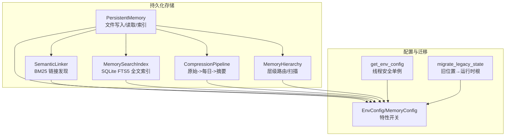
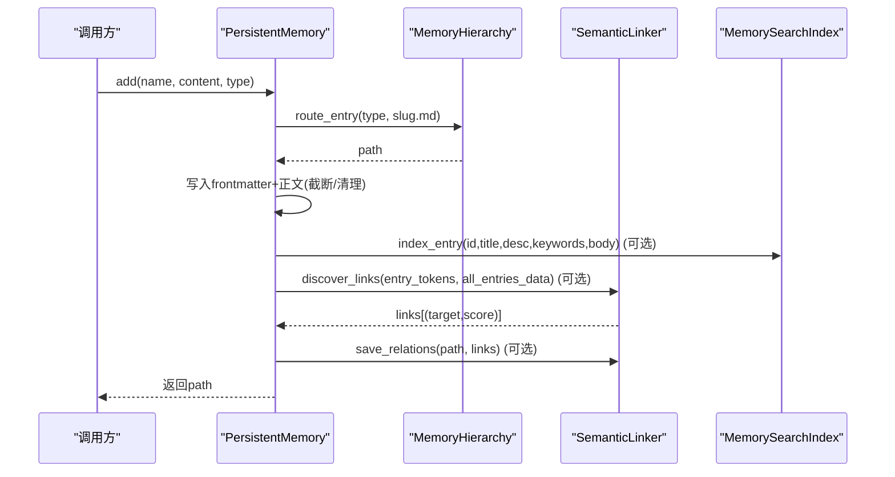
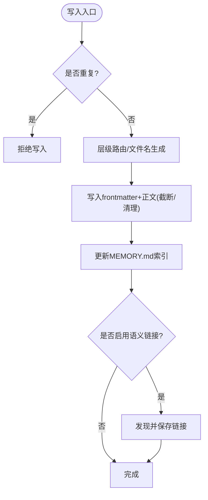
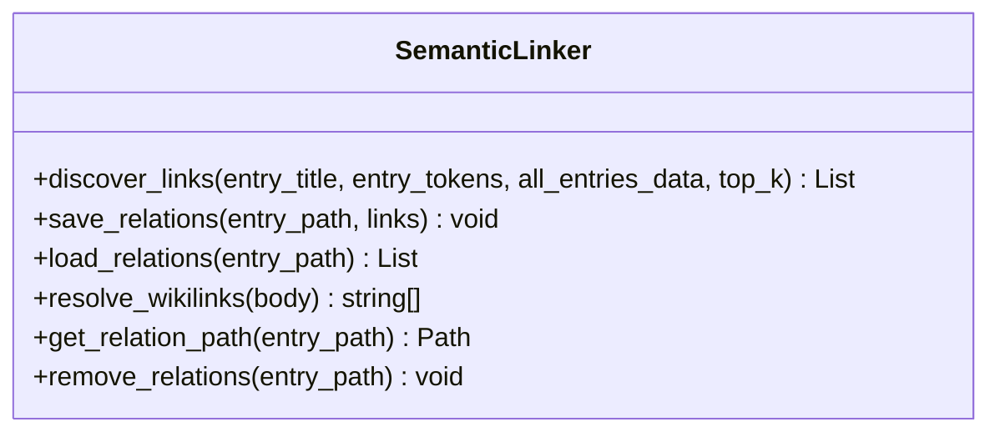
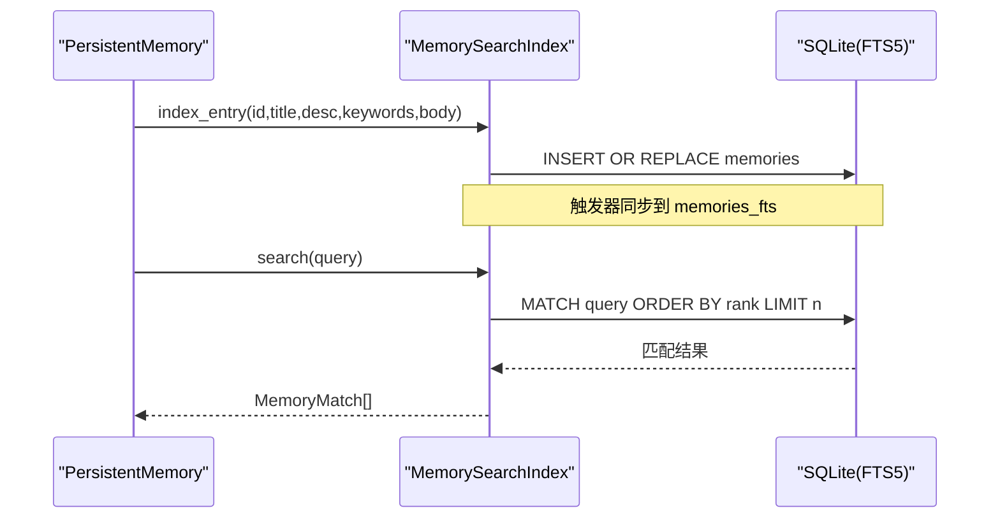
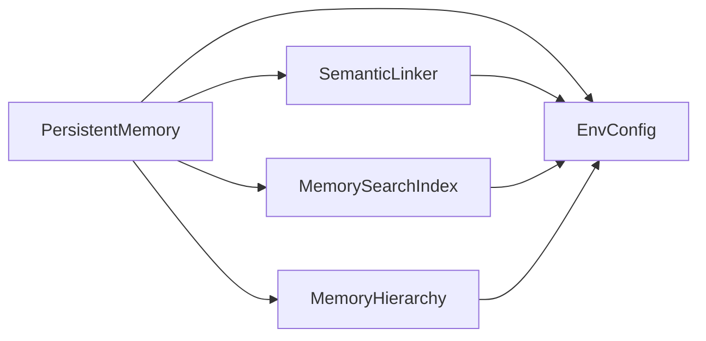

# 持久化存储

<cite>
**本文引用的文件**
- [agent/src/memory/persistent.py](file://agent/src/memory/persistent.py)
- [agent/src/memory/semantic_links.py](file://agent/src/memory/semantic_links.py)
- [agent/src/memory/search_index.py](file://agent/src/memory/search_index.py)
- [agent/src/memory/hierarchy.py](file://agent/src/memory/hierarchy.py)
- [agent/src/memory/compression.py](file://agent/src/memory/compression.py)
- [agent/src/config/env_schema.py](file://agent/src/config/env_schema.py)
- [agent/src/config/accessor.py](file://agent/src/config/accessor.py)
- [agent/src/config/migrate.py](file://agent/src/config/migrate.py)
</cite>

## 目录
1. [简介](#简介)
2. [项目结构](#项目结构)
3. [核心组件](#核心组件)
4. [架构总览](#架构总览)
5. [详细组件分析](#详细组件分析)
6. [依赖关系分析](#依赖关系分析)
7. [性能考虑](#性能考虑)
8. [故障排查指南](#故障排查指南)
9. [结论](#结论)
10. [附录](#附录)

## 简介
本技术文档面向数据库管理员与存储系统开发者，系统化阐述 Vibe-Trading 的“持久化存储”子系统。内容覆盖：
- 数据存储格式、索引策略与查询优化
- 语义链接机制（实体关系建模、链接发现算法、关系推理）
- 搜索索引系统（全文检索、向量搜索能力规划、混合检索思路）
- 数据迁移与版本管理（向后兼容、升级、回滚）
- 存储性能优化（读写加速、缓存、批量操作）
- 数据安全保护（访问控制、备份恢复等）

该子系统以本地文件系统为基座，结合 SQLite FTS5 全文索引、BM25 语义链接、层级目录路由与三级压缩管线，提供跨会话的持久化记忆与高效检索能力。

## 项目结构
持久化存储相关代码集中在 agent/src/memory 与 agent/src/config 两个模块中：
- memory：实现持久化写入、层级路由、语义链接、全文索引、压缩归档等
- config：集中式环境配置与开关（含内存子系统特性开关）、运行时路径与迁移工具

图表来源
- [agent/src/memory/persistent.py:200-654](file://agent/src/memory/persistent.py#L200-L654)
- [agent/src/memory/hierarchy.py:34-176](file://agent/src/memory/hierarchy.py#L34-L176)
- [agent/src/memory/semantic_links.py:158-372](file://agent/src/memory/semantic_links.py#L158-L372)
- [agent/src/memory/search_index.py:113-481](file://agent/src/memory/search_index.py#L113-L481)
- [agent/src/memory/compression.py:163-356](file://agent/src/memory/compression.py#L163-L356)
- [agent/src/config/env_schema.py:601-703](file://agent/src/config/env_schema.py#L601-L703)
- [agent/src/config/accessor.py:52-76](file://agent/src/config/accessor.py#L52-L76)
- [agent/src/config/migrate.py:114-153](file://agent/src/config/migrate.py#L114-L153)

章节来源
- [agent/src/memory/persistent.py:200-654](file://agent/src/memory/persistent.py#L200-L654)
- [agent/src/memory/hierarchy.py:34-176](file://agent/src/memory/hierarchy.py#L34-L176)
- [agent/src/memory/semantic_links.py:158-372](file://agent/src/memory/semantic_links.py#L158-L372)
- [agent/src/memory/search_index.py:113-481](file://agent/src/memory/search_index.py#L113-L481)
- [agent/src/memory/compression.py:163-356](file://agent/src/memory/compression.py#L163-L356)
- [agent/src/config/env_schema.py:601-703](file://agent/src/config/env_schema.py#L601-L703)
- [agent/src/config/accessor.py:52-76](file://agent/src/config/accessor.py#L52-L76)
- [agent/src/config/migrate.py:114-153](file://agent/src/config/migrate.py#L114-L153)

## 核心组件
- PersistentMemory：基于文件的跨会话记忆存储，负责条目写入、去重、重要性衰减、索引更新、可选 FTS5 索引与语义链接集成
- MemoryHierarchy：按类型分目录的路由与扫描，支持扁平兼容与扩展名修复
- SemanticLinker：基于 BM25 的语义链接发现与持久化（.relations.json），支持显式 wikilink 解析
- MemorySearchIndex：SQLite FTS5 全文索引，支持增量索引、重建、CJK 优化与查询清洗
- CompressionPipeline：三级压缩（原始→每日→摘要），自动归档原文件并估算信息保留率
- EnvConfig/MemoryConfig：统一的环境变量模型与特性开关（质量评分、衰减、层级、链接、压缩、FTS5）
- get_env_config：线程安全的配置单例访问器
- migrate_legacy_state：将历史状态从代码相对路径迁移到运行时根目录，原子化、可恢复

章节来源
- [agent/src/memory/persistent.py:200-654](file://agent/src/memory/persistent.py#L200-L654)
- [agent/src/memory/hierarchy.py:34-176](file://agent/src/memory/hierarchy.py#L34-L176)
- [agent/src/memory/semantic_links.py:158-372](file://agent/src/memory/semantic_links.py#L158-L372)
- [agent/src/memory/search_index.py:113-481](file://agent/src/memory/search_index.py#L113-L481)
- [agent/src/memory/compression.py:163-356](file://agent/src/memory/compression.py#L163-L356)
- [agent/src/config/env_schema.py:601-703](file://agent/src/config/env_schema.py#L601-L703)
- [agent/src/config/accessor.py:52-76](file://agent/src/config/accessor.py#L52-L76)
- [agent/src/config/migrate.py:114-153](file://agent/src/config/migrate.py#L114-L153)

## 架构总览
持久化存储采用“文件为主、索引为辅、链接增强、压缩归档”的分层设计：
- 写入路径：PersistentMemory 生成 Markdown 条目（含 frontmatter），可选写入层级目录；同步更新 MEMORY.md 索引；可选触发 FTS5 索引与语义链接发现
- 读取路径：优先使用 FTS5 全文检索，失败或禁用时回退到 token 扫描；结果可按语义链接扩展；重要性衰减影响排序
- 链接与压缩：语义链接以 .relations.json 侧车文件保存；压缩在后台或按需执行，先归档原文件再替换
- 配置驱动：通过 EnvConfig/MemoryConfig 的开关控制各功能启用与否，便于灰度与降级

图表来源
- [agent/src/memory/persistent.py:479-595](file://agent/src/memory/persistent.py#L479-L595)
- [agent/src/memory/hierarchy.py:70-90](file://agent/src/memory/hierarchy.py#L70-L90)
- [agent/src/memory/semantic_links.py:179-230](file://agent/src/memory/semantic_links.py#L179-L230)
- [agent/src/memory/search_index.py:207-241](file://agent/src/memory/search_index.py#L207-L241)

## 详细组件分析

### 持久化存储（PersistentMemory）
- 数据格式：Markdown + YAML-like frontmatter（name/description/type/id/timestamps/keywords/quality_score/access_count/last_accessed/importance/related_memories/category/compression_level）
- 并发与一致性：跨进程文件锁（fcntl 或 Windows 直通），写前检查重复（滑动窗口哈希）
- 索引维护：MEMORY.md 行级索引，限制行数；支持重建
- 检索策略：
  - 首选 FTS5（若启用），否则 token 扫描（元数据加权）
  - 可选按语义链接扩展结果
  - 重要性衰减参与排序（可配置）
- 删除流程：删除文件、重建索引、移除 FTS5 记录、清理语义链接

图表来源
- [agent/src/memory/persistent.py:457-595](file://agent/src/memory/persistent.py#L457-L595)
- [agent/src/memory/persistent.py:626-654](file://agent/src/memory/persistent.py#L626-L654)

章节来源
- [agent/src/memory/persistent.py:200-654](file://agent/src/memory/persistent.py#L200-L654)

### 层级路由（MemoryHierarchy）
- 分类目录：user/feedback/project/reference，未知类型回退至根目录
- 兼容处理：扫描包含根目录与分类目录；自动修复缺失 .md 后缀的孤儿条目
- 索引重建：生成 .hierarchy.yaml 统计（类别计数、关键词）
- 搜索范围裁剪：根据关键词重叠对类别优先级排序，提升扫描效率

章节来源
- [agent/src/memory/hierarchy.py:34-176](file://agent/src/memory/hierarchy.py#L34-L176)
- [agent/src/memory/hierarchy.py:200-379](file://agent/src/memory/hierarchy.py#L200-L379)

### 语义链接（SemanticLinker）
- 链接发现：BM25 相似度（IDF 预计算、平均文档长度归一化），阈值过滤与出边上限
- 持久化：.relations.json 侧车文件（原子写入、版本字段）
- 显式引用：解析 [[6位十六进制id]] 形式的 wikilink
- 删除清理：删除对应侧车文件

图表来源
- [agent/src/memory/semantic_links.py:158-372](file://agent/src/memory/semantic_links.py#L158-L372)

章节来源
- [agent/src/memory/semantic_links.py:158-372](file://agent/src/memory/semantic_links.py#L158-L372)

### 搜索索引（MemorySearchIndex）
- 存储：SQLite 主表 memories + FTS5 虚拟表 memories_fts（title/description/keywords/body）
- 索引策略：
  - 增量：index_entry/remove_entry
  - 全量：rebuild_all
  - CJK 优化：插入空格、生成一元/二元组合，查询清洗避免注入
- 查询：MATCH 表达式 + snippet 高亮 + rank 排序
- 降级：FTS5 不可用时返回空结果，上层回退 token 扫描

图表来源
- [agent/src/memory/search_index.py:147-196](file://agent/src/memory/search_index.py#L147-L196)
- [agent/src/memory/search_index.py:207-241](file://agent/src/memory/search_index.py#L207-L241)
- [agent/src/memory/search_index.py:252-302](file://agent/src/memory/search_index.py#L252-L302)

章节来源
- [agent/src/memory/search_index.py:113-481](file://agent/src/memory/search_index.py#L113-L481)

### 压缩归档（CompressionPipeline）
- 级别：raw → daily（关键句抽取）→ digest（关键词摘要）
- 触发：基于 last_accessed 的时间阈值
- 安全：压缩前先归档原文件（atomic copy），失败则中止
- 评估：Jaccard 词集重叠估计信息保留率

章节来源
- [agent/src/memory/compression.py:163-356](file://agent/src/memory/compression.py#L163-L356)

### 配置与开关（EnvConfig/MemoryConfig）
- 预设：VT_MEMORY=off|on|full 一键切换基础能力
- 细粒度开关：VT_MEMORY_QUALITY/DECAY/HIERARCHY/LINKS/COMPRESSION/FTS_INDEX
- 线程安全：get_env_config 单例，支持运行时重置

章节来源
- [agent/src/config/env_schema.py:601-703](file://agent/src/config/env_schema.py#L601-L703)
- [agent/src/config/accessor.py:52-76](file://agent/src/config/accessor.py#L52-L76)

### 数据迁移（migrate_legacy_state）
- 目标：将历史状态从代码相对路径迁移到运行时根目录
- 策略：子项级合并、跳过冲突、隐藏临时目录 .migrating-*、中断恢复
- 幂等：已迁移或不存在则无副作用

章节来源
- [agent/src/config/migrate.py:114-153](file://agent/src/config/migrate.py#L114-L153)

## 依赖关系分析
- PersistentMemory 依赖：
  - MemoryHierarchy（可选，层级路由）
  - SemanticLinker（可选，链接发现与持久化）
  - MemorySearchIndex（可选，FTS5 索引）
  - EnvConfig（特性开关）
- MemorySearchIndex 依赖：
  - SQLite（WAL 模式、FTS5 虚拟表、触发器）
- SemanticLinker 依赖：
  - JSON 侧车文件（版本化）
- CompressionPipeline 依赖：
  - archive 目录（原子复制）

图表来源
- [agent/src/memory/persistent.py:200-654](file://agent/src/memory/persistent.py#L200-L654)
- [agent/src/memory/hierarchy.py:34-176](file://agent/src/memory/hierarchy.py#L34-L176)
- [agent/src/memory/semantic_links.py:158-372](file://agent/src/memory/semantic_links.py#L158-L372)
- [agent/src/memory/search_index.py:113-481](file://agent/src/memory/search_index.py#L113-L481)
- [agent/src/config/env_schema.py:601-703](file://agent/src/config/env_schema.py#L601-L703)

章节来源
- [agent/src/memory/persistent.py:200-654](file://agent/src/memory/persistent.py#L200-L654)
- [agent/src/memory/hierarchy.py:34-176](file://agent/src/memory/hierarchy.py#L34-L176)
- [agent/src/memory/semantic_links.py:158-372](file://agent/src/memory/semantic_links.py#L158-L372)
- [agent/src/memory/search_index.py:113-481](file://agent/src/memory/search_index.py#L113-L481)
- [agent/src/config/env_schema.py:601-703](file://agent/src/config/env_schema.py#L601-L703)

## 性能考虑
- 写入优化
  - 文件锁短超时与最佳努力写入，避免阻塞
  - 正文截断与字符清理，减少 IO 与索引体积
  - 层级路由缩小后续扫描范围
- 读取优化
  - 优先 FTS5 全文检索（O(log n) 近似），失败回退 token 扫描
  - 搜索结果按重要性衰减加权排序
  - 语义链接扩展仅在必要时进行
- 索引维护
  - WAL 模式与 NORMAL 同步策略降低写放大
  - 增量索引与全量重建并存，支持首次空搜自动重建
- 压缩归档
  - 三级压缩显著降低长期存储占用
  - 原子归档保障崩溃恢复
- 建议
  - 在高并发场景开启层级路由与 FTS5
  - 合理设置 VT_MEMORY 预设与细粒度开关
  - 定期重建 FTS5 索引以保持一致性

[本节为通用指导，不直接分析具体文件]

## 故障排查指南
- 写入失败/锁超时
  - 现象：日志提示 lock timeout
  - 排查：确认磁盘空间、权限、其他进程占用；Windows 平台锁行为不同
  - 参考：[agent/src/memory/persistent.py:41-73](file://agent/src/memory/persistent.py#L41-L73)
- FTS5 不可用
  - 现象：search 返回空，降级 token 扫描
  - 排查：检查 SQLite 编译是否包含 FTS5；查看初始化日志
  - 参考：[agent/src/memory/search_index.py:160-173](file://agent/src/memory/search_index.py#L160-L173)
- 链接文件损坏/版本不匹配
  - 现象：加载 relations 失败或忽略
  - 排查：检查 .relations.json 结构与 version 字段
  - 参考：[agent/src/memory/semantic_links.py:282-319](file://agent/src/memory/semantic_links.py#L282-L319)
- 压缩归档失败
  - 现象：压缩中止，原文件未修改
  - 排查：archive 目录权限、磁盘空间；临时文件残留清理
  - 参考：[agent/src/memory/compression.py:261-337](file://agent/src/memory/compression.py#L261-L337)
- 迁移中断/残留
  - 现象：出现 .migrating-* 目录
  - 排查：下次启动会自动恢复或清理；必要时手动干预
  - 参考：[agent/src/config/migrate.py:57-102](file://agent/src/config/migrate.py#L57-L102)

章节来源
- [agent/src/memory/persistent.py:41-73](file://agent/src/memory/persistent.py#L41-L73)
- [agent/src/memory/search_index.py:160-173](file://agent/src/memory/search_index.py#L160-L173)
- [agent/src/memory/semantic_links.py:282-319](file://agent/src/memory/semantic_links.py#L282-L319)
- [agent/src/memory/compression.py:261-337](file://agent/src/memory/compression.py#L261-L337)
- [agent/src/config/migrate.py:57-102](file://agent/src/config/migrate.py#L57-L102)

## 结论
该持久化存储子系统以轻量、可演进的方式实现了跨会话记忆存储与检索：
- 以 Markdown 为人类可读的数据格式，配合 frontmatter 结构化元数据
- 通过 FTS5 全文索引与 token 扫描双通道保证检索可用性与鲁棒性
- 借助 BM25 语义链接增强召回，并以侧车文件持久化
- 通过层级路由与三级压缩提升可扩展性与长期存储效率
- 通过集中式配置与迁移工具确保可运维性与向后兼容

对于生产部署，建议：
- 启用层级路由与 FTS5，并根据负载调整开关
- 定期归档与压缩，监控 archive 目录增长
- 建立备份策略（目录快照 + SQLite WAL 文件）
- 在变更配置后调用 reset_env_config 刷新缓存

[本节为总结性内容，不直接分析具体文件]

## 附录

### 数据存储格式（frontmatter 关键字段）
- name/description/type/id：标识与描述
- created_at/updated_at/last_accessed：时间戳
- keywords/quality_score/access_count/importance：检索与排序权重
- related_memories：显式关联 ID 列表
- category/compression_level：分类与压缩级别

章节来源
- [agent/src/memory/persistent.py:126-147](file://agent/src/memory/persistent.py#L126-L147)
- [agent/src/memory/persistent.py:545-562](file://agent/src/memory/persistent.py#L545-L562)

### 搜索能力现状与扩展
- 当前能力：全文检索（FTS5）、token 扫描、语义链接扩展
- 向量搜索：当前未实现；可在 MemorySearchIndex 之上引入向量表与相似度检索，形成混合检索（BM25 + 向量）
- 混合检索思路：将 FTS5 得分与向量相似度融合排序，或作为候选召回阶段

[本节为概念性说明，不直接分析具体文件]

### 安全与合规要点
- 访问控制：通过 API_AUTH_KEY/VIBE_TRADING_API_KEY 等环境变量控制外部访问（见配置模块）
- 备份恢复：archive 目录保留原文件；SQLite WAL 模式支持崩溃恢复
- 输入清洗：正文去除控制字符、截断过长内容，防止注入与溢出

章节来源
- [agent/src/config/env_schema.py:326-375](file://agent/src/config/env_schema.py#L326-L375)
- [agent/src/memory/persistent.py:154-169](file://agent/src/memory/persistent.py#L154-L169)
- [agent/src/memory/search_index.py:137-145](file://agent/src/memory/search_index.py#L137-L145)