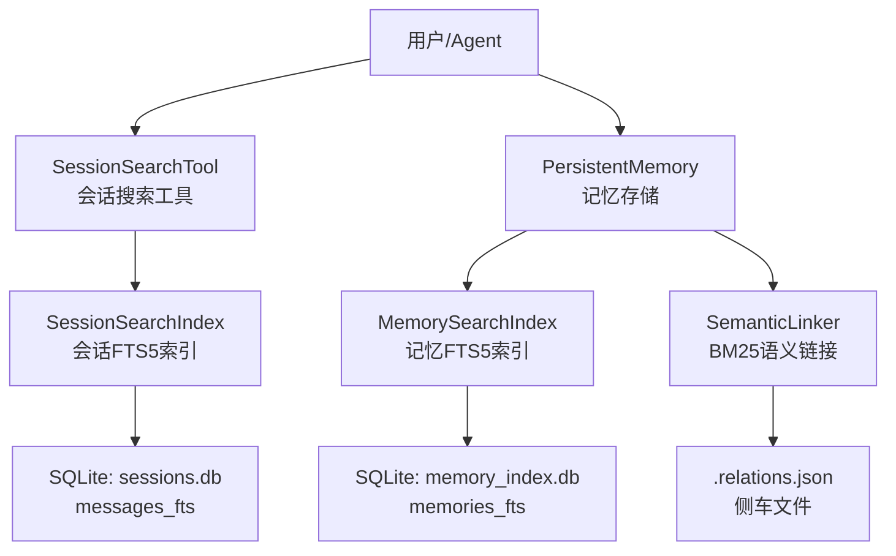
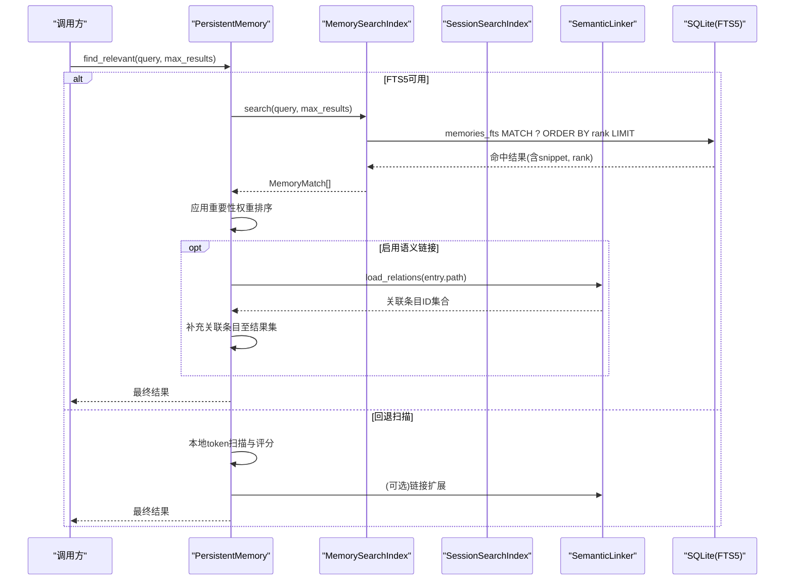
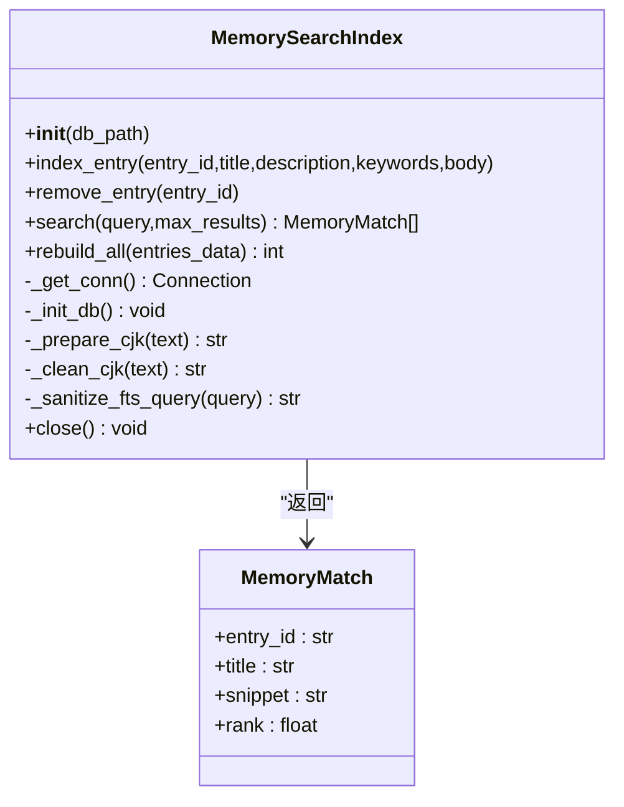
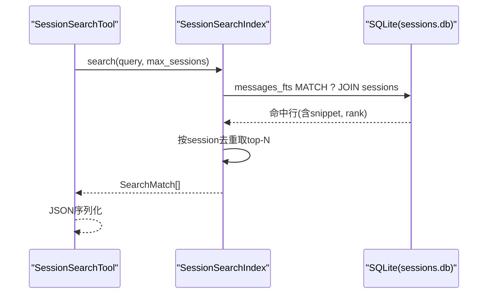
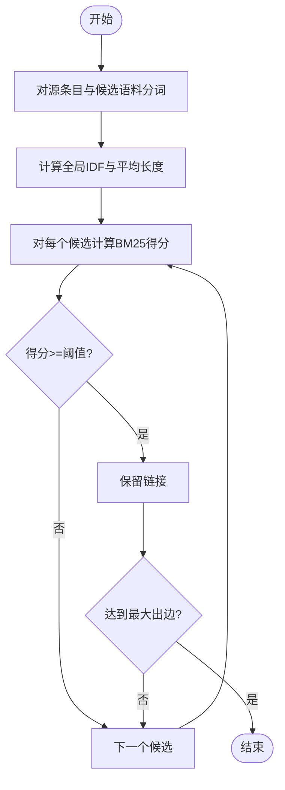
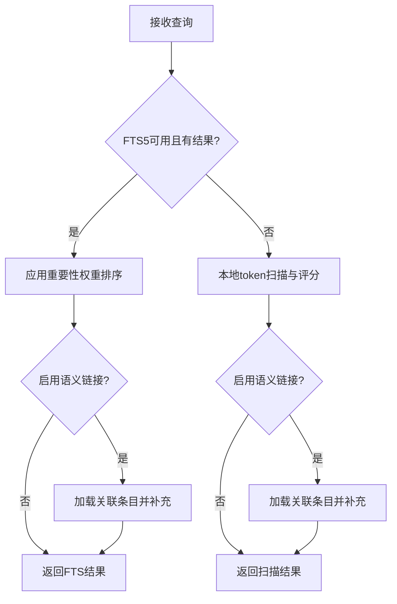
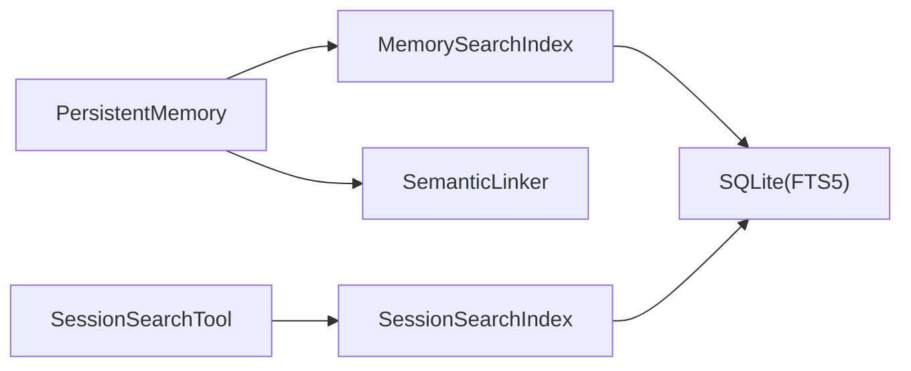

# 搜索索引系统

<cite>
**本文引用的文件**
- [search_index.py](file://agent/src/memory/search_index.py)
- [search.py](file://agent/src/session/search.py)
- [semantic_links.py](file://agent/src/memory/semantic_links.py)
- [persistent.py](file://agent/src/memory/persistent.py)
- [session_search_tool.py](file://agent/src/tools/session_search_tool.py)
- [test_search_index.py](file://agent/tests/memory/test_search_index.py)
- [test_session_search.py](file://agent/tests/test_session_search.py)
- [tier2_runner.py](file://agent/tests/memory/benchmarks/tier2_runner.py)
</cite>

## 目录
1. [简介](#简介)
2. [项目结构](#项目结构)
3. [核心组件](#核心组件)
4. [架构总览](#架构总览)
5. [详细组件分析](#详细组件分析)
6. [依赖关系分析](#依赖关系分析)
7. [性能与优化](#性能与优化)
8. [多语言支持](#多语言支持)
9. [搜索结果排序算法](#搜索结果排序算法)
10. [搜索API接口文档](#搜索api接口文档)
11. [搜索质量评估](#搜索质量评估)
12. [故障排查指南](#故障排查指南)
13. [结论](#结论)

## 简介
本技术文档面向搜索引擎开发者，系统性阐述 Vibe-Trading 中的搜索索引系统。该系统以 SQLite FTS5 为核心，提供跨会话与记忆内容的全文检索能力；通过 BM25 语义链接增强召回；并提供可回退的本地扫描评分路径。文档覆盖倒排索引构建、查询解析、多语言分词、相关性排序、性能优化策略、API 接口与质量评估方法，帮助读者理解并扩展该搜索子系统。

## 项目结构
搜索相关代码主要分布在 memory 与 session 两个子系统中：
- 记忆搜索索引：基于 SQLite FTS5 的记忆条目倒排索引，支持增量更新与批量重建。
- 会话搜索索引：基于 SQLite FTS5 的跨会话消息倒排索引，支持按会话聚合结果。
- 语义链接：基于 BM25 的条目间关联发现与持久化，用于召回增强。
- 工具层：暴露统一的搜索工具接口（如会话搜索）。

图表来源
- [session_search_tool.py:11-79](file://agent/src/tools/session_search_tool.py#L11-L79)
- [search.py:60-267](file://agent/src/session/search.py#L60-L267)
- [search_index.py:113-355](file://agent/src/memory/search_index.py#L113-L355)
- [semantic_links.py:158-372](file://agent/src/memory/semantic_links.py#L158-L372)

章节来源
- [search_index.py:1-481](file://agent/src/memory/search_index.py#L1-L481)
- [search.py:1-365](file://agent/src/session/search.py#L1-L365)
- [semantic_links.py:1-372](file://agent/src/memory/semantic_links.py#L1-L372)
- [session_search_tool.py:1-79](file://agent/src/tools/session_search_tool.py#L1-L79)

## 核心组件
- MemorySearchIndex：记忆条目的 FTS5 倒排索引，支持单条索引、删除、批量重建、安全查询构造与 CJK 处理。
- SessionSearchIndex：会话消息的 FTS5 倒排索引，支持会话元数据维护、消息索引、跨会话聚合搜索与全量重建。
- SemanticLinker：基于 BM25 的语义链接发现、持久化与解析，支持 wiki 链接引用。
- PersistentMemory：记忆存取与检索入口，集成 FTS5 优先、扫描回退、重要性加权与语义链接召回增强。
- SessionSearchTool：对外暴露的会话搜索工具，封装参数校验与结果序列化。

章节来源
- [search_index.py:113-481](file://agent/src/memory/search_index.py#L113-L481)
- [search.py:60-365](file://agent/src/session/search.py#L60-L365)
- [semantic_links.py:63-372](file://agent/src/memory/semantic_links.py#L63-L372)
- [persistent.py:293-466](file://agent/src/memory/persistent.py#L293-L466)
- [session_search_tool.py:11-79](file://agent/src/tools/session_search_tool.py#L11-L79)

## 架构总览
系统采用“FTS5 为主 + 本地扫描回退”的双通道检索架构，辅以 BM25 语义链接进行召回增强。关键流程如下：
- 写入路径：新增/更新记忆或会话消息时，触发数据库触发器自动同步到 FTS5 虚拟表；亦支持批量重建。
- 读取路径：优先使用 FTS5 MATCH 检索并按 rank 排序；若不可用或无结果，则回退到本地 token 扫描与评分；当启用语义链接时，对 top-K 结果进行链接扩展。
- 多语言：对 CJK 文本进行单字+双字组合展开，提升匹配粒度；非拉丁字符通过正则范围识别。

图表来源
- [persistent.py:385-466](file://agent/src/memory/persistent.py#L385-L466)
- [search_index.py:252-302](file://agent/src/memory/search_index.py#L252-L302)
- [search.py:216-267](file://agent/src/session/search.py#L216-L267)
- [semantic_links.py:179-230](file://agent/src/memory/semantic_links.py#L179-L230)

## 详细组件分析

### 记忆搜索索引（MemorySearchIndex）
- 功能要点
  - 使用 SQLite FTS5 虚拟表实现 O(log n) 级别检索。
  - 支持单条 upsert、删除、批量重建。
  - 查询安全：对用户输入进行清洗，提取字母数字与 CJK 字符，生成 OR 连接的 quoted tokens，防止注入。
  - CJK 处理：在索引前将连续 CJK 展开为单字与双字序列，提升匹配精度；展示时去除多余空格与重复片段。
  - 并发与健壮性：WAL 模式、操作锁、异常降级（FTS5 不可用时禁用）。
- 数据结构
  - 实体表 memories：id、title、description、keywords、body。
  - FTS5 虚拟表 memories_fts：映射到 memories 内容，支持 snippet 与 rank。
  - 结果对象 MemoryMatch：entry_id、title、snippet、rank。
- 复杂度
  - 插入/更新/删除：O(1) 均摊（SQLite 事务内批处理）。
  - 查询：取决于 FTS5 引擎，典型 O(log n) 级别。
- 错误处理
  - FTS5 不可用或查询失败时记录日志并返回空结果，保证服务可用性。

图表来源
- [search_index.py:96-111](file://agent/src/memory/search_index.py#L96-L111)
- [search_index.py:113-481](file://agent/src/memory/search_index.py#L113-L481)

章节来源
- [search_index.py:1-481](file://agent/src/memory/search_index.py#L1-L481)
- [test_search_index.py:18-36](file://agent/tests/memory/test_search_index.py#L18-L36)

### 会话搜索索引（SessionSearchIndex）
- 功能要点
  - 维护 sessions 与 messages 两张表，并通过 FTS5 虚拟表 messages_fts 对消息内容进行全文检索。
  - 支持会话元数据（标题、开始时间、消息计数）维护。
  - 查询按会话聚合去重，返回最多 N 个会话的摘要与片段。
  - 支持从文件系统的全量重建（遍历 session.json 与 messages.jsonl）。
- 数据结构
  - sessions：id、title、started_at、message_count。
  - messages：id、session_id、role、content、tool_name、timestamp。
  - messages_fts：FTS5 虚拟表，映射 messages.content。
  - 结果对象 SearchMatch：session_id、title、started_at、message_count、snippet、rank。
- 复杂度
  - 插入/更新：O(1)。
  - 查询：FTS5 MATCH + 聚合去重，整体近似 O(k log k)，k 为候选命中数。

图表来源
- [session_search_tool.py:37-79](file://agent/src/tools/session_search_tool.py#L37-L79)
- [search.py:216-267](file://agent/src/session/search.py#L216-L267)

章节来源
- [search.py:1-365](file://agent/src/session/search.py#L1-L365)
- [test_session_search.py:101-126](file://agent/tests/test_session_search.py#L101-L126)

### 语义链接（SemanticLinker）
- 功能要点
  - 基于 BM25 计算条目间的相似度，发现并持久化关联关系。
  - 支持 wiki 链接 [[hex-id]] 解析，显式引用其他记忆。
  - 侧车文件 .relations.json 原子写入，确保一致性。
- 算法细节
  - IDF 计算：log((N - n + 0.5)/(n + 0.5) + 1)。
  - BM25 评分：对每个唯一查询词累加 idf * (tf*(k1+1))/(tf + k1*(1-b+b*dl/avgdl))。
  - 阈值与上限：最小分数阈值过滤弱链接，限制最大出边数量。
- 复杂度
  - 单次 discover_links：O(M) 遍历候选文档，M 为候选条目数。
  - IDF 预计算：O(N) 扫描语料。

图表来源
- [semantic_links.py:73-150](file://agent/src/memory/semantic_links.py#L73-L150)
- [semantic_links.py:179-230](file://agent/src/memory/semantic_links.py#L179-L230)

章节来源
- [semantic_links.py:1-372](file://agent/src/memory/semantic_links.py#L1-L372)

### 记忆检索入口（PersistentMemory）
- 功能要点
  - 优先使用 MemorySearchIndex 的 FTS5 检索；若无结果或不可用，回退到本地 token 扫描与评分。
  - 支持重要性加权（importance）与时间衰减开关。
  - 可选语义链接扩展：对 top-K 结果加载其关联条目，补充至结果集。
- 评分与排序
  - 元数据（标题/描述）与关键词命中权重更高。
  - 启用重要性加权时，对 FTS5 的 rank 取反后乘以权重因子，再排序。
  - 回退模式下按 token 重叠分数与修改时间排序。

图表来源
- [persistent.py:385-466](file://agent/src/memory/persistent.py#L385-L466)

章节来源
- [persistent.py:293-466](file://agent/src/memory/persistent.py#L293-L466)

## 依赖关系分析
- 模块耦合
  - PersistentMemory 依赖 MemorySearchIndex 与 SemanticLinker，形成“主索引 + 语义增强”的组合。
  - SessionSearchTool 仅依赖 SessionSearchIndex，保持轻量。
- 外部依赖
  - SQLite 与 FTS5 扩展：提供倒排索引与片段高亮。
  - 标准库：json、re、threading、time、datetime、pathlib。
- 潜在循环依赖
  - 当前设计无循环依赖；各模块职责清晰，通过函数级导入避免启动期开销。

图表来源
- [persistent.py:385-466](file://agent/src/memory/persistent.py#L385-L466)
- [search_index.py:113-481](file://agent/src/memory/search_index.py#L113-L481)
- [search.py:60-365](file://agent/src/session/search.py#L60-L365)
- [session_search_tool.py:11-79](file://agent/src/tools/session_search_tool.py#L11-L79)

章节来源
- [persistent.py:293-466](file://agent/src/memory/persistent.py#L293-L466)
- [search_index.py:113-481](file://agent/src/memory/search_index.py#L113-L481)
- [search.py:60-365](file://agent/src/session/search.py#L60-L365)
- [session_search_tool.py:11-79](file://agent/src/tools/session_search_tool.py#L11-L79)

## 性能与优化
- 索引重建策略
  - 批量重建：MemorySearchIndex.rebuild_all 清空并重新插入所有条目，同时触发 FTS5 rebuild，适合大规模同步场景。
  - 会话重建：SessionSearchIndex.reindex_from_store 从文件系统恢复会话与消息索引，保证一致性。
- 查询缓存
  - 当前未实现查询级缓存；可通过上层缓存（如进程内 LRU）对高频查询进行加速。
- 批量索引更新
  - 使用事务与 WAL 模式减少写放大；触发器自动同步 FTS5，降低应用层维护成本。
- 性能基准
  - 测试套件包含 FTS5 与 O(n) 扫描的对比评测，指标包括 P@5、MRR、NDCG@5 与平均延迟，以及速度比。
  - 建议在生产环境定期运行 tier2 基准，监控回归。

章节来源
- [search_index.py:304-355](file://agent/src/memory/search_index.py#L304-L355)
- [search.py:269-329](file://agent/src/session/search.py#L269-L329)
- [tier2_runner.py:117-206](file://agent/tests/memory/benchmarks/tier2_runner.py#L117-L206)

## 多语言支持
- 中文分词
  - 对连续 CJK 字符进行单字与双字展开，使 FTS5 既能匹配单字也能匹配常见二字短语。
  - 查询阶段同样对 CJK 进行单字与双字生成，并以 OR 连接提高召回。
- 非拉丁字符处理
  - 通过 Unicode 范围识别 CJK、泰文、阿拉伯、希伯来、西里尔等非拉丁脚本，统一纳入分词。
- 国际化搜索
  - 查询清洗规则兼容多语言混合输入；FTS5 片段高亮在多语言环境下正常工作。

章节来源
- [search_index.py:33-94](file://agent/src/memory/search_index.py#L33-L94)
- [search_index.py:357-445](file://agent/src/memory/search_index.py#L357-L445)
- [semantic_links.py:44-53](file://agent/src/memory/semantic_links.py#L44-L53)

## 搜索结果排序算法
- FTS5 相关性
  - 使用 FTS5 内置 rank 排序，值越小越相关；结合 snippet 高亮便于定位。
- 重要性加权
  - 对 FTS5 结果取反 rank 后乘以重要性权重因子，使重要条目更靠前。
- 时间衰减
  - 当启用时间衰减时，结合条目修改时间与重要性进行综合排序。
- 本地扫描评分（回退路径）
  - 元数据与关键词命中赋予更高权重；按 token 重叠分数与修改时间排序。
- 语义链接扩展
  - 对 top-K 结果加载其关联条目，补充至结果集，提升召回率。

章节来源
- [persistent.py:385-466](file://agent/src/memory/persistent.py#L385-L466)
- [search_index.py:252-302](file://agent/src/memory/search_index.py#L252-L302)
- [semantic_links.py:179-230](file://agent/src/memory/semantic_links.py#L179-L230)

## 搜索API接口文档
- 会话搜索工具（SessionSearchTool）
  - 名称：session_search
  - 描述：按关键词搜索历史会话，返回匹配会话及上下文片段。
  - 参数
    - query（必填）：字符串，搜索关键词或短语。
    - max_results（可选）：整数，默认 3，最大 10。
  - 返回格式
    - status：ok 或 error。
    - query：原始查询。
    - results：数组，每项包含 session_id、title、started_at、message_count、snippet。
  - 错误处理
    - 缺少 query 返回错误信息。
    - max_results 类型非法返回错误信息。
    - 内部异常捕获并返回错误信息。

章节来源
- [session_search_tool.py:11-79](file://agent/src/tools/session_search_tool.py#L11-L79)

## 搜索质量评估
- 指标定义
  - P@5：Top-5 精确率。
  - MRR：倒数排名均值。
  - NDCG@5：归一化折损累计增益（Top-5）。
- 评估流程
  - 构建临时 FTS5 数据库，批量索引记忆条目。
  - 对每个查询执行 FTS5 检索与本地扫描检索，分别计算指标与耗时。
  - 计算平均延迟与速度比，比较两种路径的性能与质量。
- 语义链接评估
  - 对比“直接 Top-5”与“Top-3 + 链接扩展至5”的 P@5，衡量链接增强效果。

章节来源
- [tier2_runner.py:117-206](file://agent/tests/memory/benchmarks/tier2_runner.py#L117-L206)
- [tier2_runner.py:214-225](file://agent/tests/memory/benchmarks/tier2_runner.py#L214-L225)

## 故障排查指南
- FTS5 不可用
  - 现象：搜索返回空结果。
  - 原因：SQLite 编译时未启用 FTS5 或版本不兼容。
  - 处理：检查 SQLite 配置；系统会记录警告并回退到本地扫描。
- 查询无结果
  - 可能原因：查询被清洗为空、FTS5 查询构造失败、无匹配条目。
  - 处理：检查 _sanitize_fts_query 输出；尝试简化查询或使用本地扫描路径。
- 中文匹配不佳
  - 可能原因：未启用 CJK 展开或查询未包含足够单字/双字。
  - 处理：确保使用支持 CJK 的查询；必要时调整分词策略。
- 性能退化
  - 可能原因：索引过大、频繁重建、磁盘 IO 瓶颈。
  - 处理：使用批量重建、开启 WAL、减少不必要重建；运行基准测试定位问题。

章节来源
- [search_index.py:160-173](file://agent/src/memory/search_index.py#L160-L173)
- [search_index.py:252-302](file://agent/src/memory/search_index.py#L252-L302)
- [search.py:216-267](file://agent/src/session/search.py#L216-L267)

## 结论
本搜索索引系统以 SQLite FTS5 为核心，提供了高效、可扩展的全文检索能力，并通过 BM25 语义链接增强召回。系统在多语言支持、排序策略、性能优化与质量评估方面具备完善的设计与实践。对于搜索引擎开发者而言，该实现可作为轻量级、可嵌入的检索方案参考，亦可在此基础上扩展向量检索、更复杂的排序模型与分布式索引。