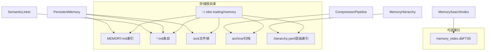
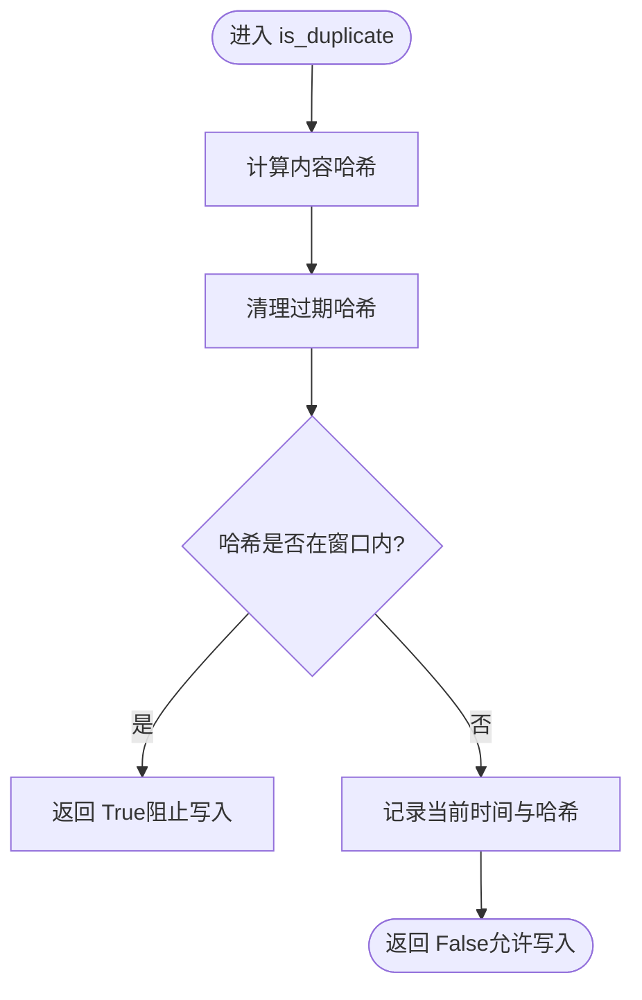
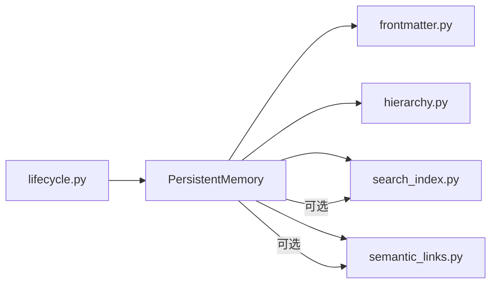

# 文件存储引擎

<cite>
**本文引用的文件**
- [persistent.py](file://agent/src/memory/persistent.py)
- [search_index.py](file://agent/src/memory/search_index.py)
- [hierarchy.py](file://agent/src/memory/hierarchy.py)
- [compression.py](file://agent/src/memory/compression.py)
- [semantic_links.py](file://agent/src/memory/semantic_links.py)
- [lifecycle.py](file://agent/src/memory/lifecycle.py)
- [frontmatter.py](file://agent/src/agent/frontmatter.py)
</cite>

## 目录
1. [简介](#简介)
2. [项目结构](#项目结构)
3. [核心组件](#核心组件)
4. [架构总览](#架构总览)
5. [详细组件分析](#详细组件分析)
6. [依赖关系分析](#依赖关系分析)
7. [性能考虑](#性能考虑)
8. [故障排查指南](#故障排查指南)
9. [结论](#结论)
10. [附录](#附录)

## 简介
本技术文档面向存储系统开发者，系统性阐述基于文件的持久化记忆存储引擎。内容覆盖：
- 基于 Markdown 的文件格式与前后元数据（frontmatter）设计
- MEMORY.md 索引机制与扫描策略
- MemoryEntry 数据模型、字段约束与默认值
- 跨平台文件锁机制、并发控制与超时处理
- 内容去重算法（哈希计算、滑动窗口、重复写入防护）
- 重要性衰减算法（艾宾浩斯遗忘曲线、访问频率加权、时间衰减）
- 全文检索（SQLite FTS5）与降级回退
- 语义链接（BM25）与自动关联发现
- 压缩流水线（原始/每日/摘要三级）与归档
- 生命周期管理（质量评分、垃圾回收、容量治理）
- 错误处理与恢复（文件损坏检测、原子写入、备份恢复）
- 存储性能优化（批量操作、缓存策略、内存管理）

## 项目结构
该存储子系统位于 agent/src/memory 下，围绕“文件即数据库”的理念，以 Markdown 为持久化载体，辅以轻量级索引与可选的 SQLite 全文索引。



图表来源
- [persistent.py:20-28](file://agent/src/memory/persistent.py#L20-L28)
- [search_index.py:23-26](file://agent/src/memory/search_index.py#L23-L26)
- [hierarchy.py:19-24](file://agent/src/memory/hierarchy.py#L19-L24)
- [compression.py:23-36](file://agent/src/memory/compression.py#L23-L36)
- [semantic_links.py:24-39](file://agent/src/memory/semantic_links.py#L24-L39)

章节来源
- [persistent.py:20-28](file://agent/src/memory/persistent.py#L20-L28)
- [search_index.py:23-26](file://agent/src/memory/search_index.py#L23-L26)
- [hierarchy.py:19-24](file://agent/src/memory/hierarchy.py#L19-L24)
- [compression.py:23-36](file://agent/src/memory/compression.py#L23-L36)
- [semantic_links.py:24-39](file://agent/src/memory/semantic_links.py#L24-L39)

## 核心组件
- PersistentMemory：文件级持久化主入口，负责读写 .md 条目、维护 MEMORY.md 索引、去重、搜索、更新 frontmatter、触发可选的 FTS 与语义链接。
- MemorySearchIndex：基于 SQLite FTS5 的全文检索索引，提供 O(log n) 查询并支持优雅降级。
- MemoryHierarchy：按 memory_type 分目录的层级路由与扫描，提升范围化检索效率。
- CompressionPipeline：三级压缩（raw/daily/digest），结合 TF-IDF 关键句提取与关键词摘要，配合归档保证可恢复性。
- SemanticLinker：基于 BM25 的语义链接发现与持久化，支持 wikilink 解析。
- MemoryLifecycle：质量评分、访问追踪、重要性衰减、垃圾回收与压缩调度。
- Frontmatter 解析器：轻量 YAML-like 前元数据解析，用于读取/写入条目的元信息。

章节来源
- [persistent.py:126-147](file://agent/src/memory/persistent.py#L126-L147)
- [search_index.py:113-136](file://agent/src/memory/search_index.py#L113-L136)
- [hierarchy.py:34-90](file://agent/src/memory/hierarchy.py#L34-L90)
- [compression.py:163-196](file://agent/src/memory/compression.py#L163-L196)
- [semantic_links.py:158-177](file://agent/src/memory/semantic_links.py#L158-L177)
- [lifecycle.py:71-98](file://agent/src/memory/lifecycle.py#L71-L98)
- [frontmatter.py:16-49](file://agent/src/agent/frontmatter.py#L16-L49)

## 架构总览
整体采用“文件为主、索引为辅”的分层架构：
- 数据层：Markdown 文件 + frontmatter 元数据；MEMORY.md 作为轻量索引；可选层级目录；archive 归档。
- 索引层：MEMORY.md 行级索引；可选 SQLite FTS5 全文索引；.hierarchy.yaml 分类统计。
- 服务层：PersistentMemory 提供增删改查、去重、重要性计算、搜索；Lifecycle 负责质量与 GC；CompressionPipeline 负责压缩；SemanticLinker 负责链接。
- 并发与一致性：跨平台文件锁（Windows 直接放行，Unix 使用 fcntl 非阻塞锁定+超时重试）；原子写入（临时文件+rename）。

```mermaid
sequenceDiagram
participant App as "调用方"
participant PM as "PersistentMemory"
participant Lock as "memory_lock"
participant FS as "文件系统"
participant FTS as "MemorySearchIndex"
participant Link as "SemanticLinker"
App->>PM : add(name, content, type, description)
PM->>PM : is_duplicate(...)
PM->>Lock : 获取独占锁(带超时)
alt 获得锁
PM->>FS : 写入 .md (含 frontmatter)
PM->>PM : _update_index(MEMORY.md)
opt 启用FTS
PM->>FTS : index_entry(...)
end
opt 启用链接
PM->>Link : discover_links/save_relations
end
else 未获得锁
PM-->>App : 记录警告并继续尽力写入
end
PM-->>App : 返回路径或None
```

图表来源
- [persistent.py:41-73](file://agent/src/memory/persistent.py#L41-L73)
- [persistent.py:479-595](file://agent/src/memory/persistent.py#L479-L595)
- [search_index.py:207-240](file://agent/src/memory/search_index.py#L207-L240)
- [semantic_links.py:179-230](file://agent/src/memory/semantic_links.py#L179-L230)

## 详细组件分析

### MemoryEntry 数据模型
- 用途：描述单个记忆条目在磁盘上的完整视图，包括路径、标题、描述、类型、正文、时间戳、关键字、质量分、访问计数、最后访问时间、重要性、相关条目、分类、压缩级别等。
- 字段与约束要点：
  - path/title/description/type/body/modified_at：必填基础字段
  - id：6位十六进制标识，缺失时根据 name/mtime 生成
  - created_at/updated_at/last_accessed：时间戳，支持 ISO 字符串或数值
  - keywords：最多取前5项，每项截断至30字符
  - quality_score/access_count/importance：数值范围限制（quality 0-1，access>=0，importance 0-1）
  - related_memories：仅接受长度为6且均为十六进制的字符串
  - category/compression_level：枚举/受限字符串（raw/daily/digest）
- 复杂度：构造为 O(1)，扫描构建为 O(n) 条目数。

章节来源
- [persistent.py:126-147](file://agent/src/memory/persistent.py#L126-L147)
- [persistent.py:226-311](file://agent/src/memory/persistent.py#L226-L311)

### Markdown 文件格式与前后元数据
- 格式：以 --- 分隔的前后元数据块（frontmatter），键值对形式，支持字符串、列表、布尔值；其后为正文。
- 解析：正则匹配首尾 ---，逐行解析 key:value，自动识别数组与布尔值。
- 写入：add() 中统一生成 frontmatter，包含 name、description、type、id、created_at、updated_at、keywords、quality_score、access_count、last_accessed、importance、related_memories、category、compression_level 等。
- 安全：正文会去除控制字符并截断到最大长度，避免异常与过大文件。

章节来源
- [frontmatter.py:16-49](file://agent/src/agent/frontmatter.py#L16-L49)
- [persistent.py:154-183](file://agent/src/memory/persistent.py#L154-L183)
- [persistent.py:540-562](file://agent/src/memory/persistent.py#L540-L562)

### MEMORY.md 索引机制
- 作用：维护最近 N 条记录的快速索引，便于注入系统提示或快速浏览。
- 结构：每行一个条目，形如 “- [标题](文件名) — 描述”。
- 行为：新增时追加或更新对应行；重建时全量扫描所有 .md 条目重新生成；限制最大行数以避免膨胀。
- 快照：启动时加载为只读快照，减少 IO 开销。

章节来源
- [persistent.py:20-28](file://agent/src/memory/persistent.py#L20-L28)
- [persistent.py:211-224](file://agent/src/memory/persistent.py#L211-L224)
- [persistent.py:626-653](file://agent/src/memory/persistent.py#L626-L653)

### 文件锁机制（跨平台、并发控制、超时）
- Windows：直接放行（简化实现），由上层逻辑保障。
- Unix/Linux：使用 fcntl.flock 非阻塞独占锁，循环等待直至超时；释放锁在 finally 中确保。
- 超时：固定超时秒数，超过则记录警告并返回失败状态，调用方可选择重试或降级。
- 适用场景：删除、写入、GC、质量更新等写操作均受保护。

章节来源
- [persistent.py:41-73](file://agent/src/memory/persistent.py#L41-L73)
- [lifecycle.py:145-158](file://agent/src/memory/lifecycle.py#L145-L158)
- [lifecycle.py:164-178](file://agent/src/memory/lifecycle.py#L164-L178)

### 内容去重算法（哈希、滑动窗口、重复写入防护）
- 哈希：对 name、description、content 进行规范化拼接后计算 SHA256，取前12位作为短哈希。
- 滑动窗口：内存中维护最近 N 秒内的哈希集合，超期清理，防止长时间累积占用内存。
- 防护：开启质量功能时，若检测到相同哈希在窗口内已存在，则阻止重复写入并返回 None。
- 适用场景：重试、并行 Agent 调用导致的重复写入。



图表来源
- [persistent.py:35-38](file://agent/src/memory/persistent.py#L35-L38)
- [persistent.py:472-492](file://agent/src/memory/persistent.py#L472-L492)

章节来源
- [persistent.py:35-38](file://agent/src/memory/persistent.py#L35-L38)
- [persistent.py:472-492](file://agent/src/memory/persistent.py#L472-L492)

### 重要性衰减算法（艾宾浩斯、访问频率加权、时间衰减）
- 公式思路：重要性 = 质量分 × (保留率 + 访问奖励)
  - 保留率：指数衰减 exp(-λ × 距上次访问天数)，半衰期固定
  - 访问奖励：与访问次数线性增长但上限封顶
- 开关：可通过配置决定是否启用衰减；若关闭则重要性等于质量分。
- 应用：搜索结果排序权重、GC 阈值判定、压缩触发条件等。

章节来源
- [persistent.py:75-91](file://agent/src/memory/persistent.py#L75-L91)
- [lifecycle.py:209-217](file://agent/src/memory/lifecycle.py#L209-L217)

### 全文检索（SQLite FTS5）与降级
- 能力：创建 memories 表与 memories_fts 虚拟表，通过触发器保持同步；支持 MATCH 查询、snippet 高亮、rank 排序。
- 中文支持：CJK 字符展开为单字与双字组合，提升匹配召回；查询时同样展开并加引号防注入。
- 降级：若 FTS5 不可用或查询失败，自动回退到 token 扫描路径，保证可用性。
- 自动重建：首次空结果且存在条目时，自动全量重建索引。

章节来源
- [search_index.py:147-196](file://agent/src/memory/search_index.py#L147-L196)
- [search_index.py:207-250](file://agent/src/memory/search_index.py#L207-L250)
- [search_index.py:252-302](file://agent/src/memory/search_index.py#L252-L302)
- [search_index.py:357-445](file://agent/src/memory/search_index.py#L357-L445)
- [persistent.py:362-410](file://agent/src/memory/persistent.py#L362-L410)

### 语义链接（BM25）与自动关联
- 原理：对候选语料计算 IDF，使用 BM25 计算新条目与已有条目的相似度，筛选阈值以上者作为链接。
- 存储：以 .relations.json 侧车文件保存链接及分数，支持版本与时间戳。
- 解析：支持 [[六位十六进制id]] 形式的显式引用。
- 集成：写入新条目时可自动发现并保存链接；搜索后可扩展相关条目。

章节来源
- [semantic_links.py:73-150](file://agent/src/memory/semantic_links.py#L73-L150)
- [semantic_links.py:179-230](file://agent/src/memory/semantic_links.py#L179-L230)
- [semantic_links.py:232-319](file://agent/src/memory/semantic_links.py#L232-L319)
- [semantic_links.py:321-344](file://agent/src/memory/semantic_links.py#L321-L344)
- [persistent.py:556-580](file://agent/src/memory/persistent.py#L556-L580)

### 压缩流水线（原始/每日/摘要）与归档
- 触发：依据 last_accessed 与当前时间的间隔判断是否达到 daily/digest 阈值。
- 策略：
  - daily：TF-IDF 句子打分，保留首尾句与 top-k 关键句，附加关键词头
  - digest：提取 top-N 关键词形成要点列表
- 归档：压缩前先原子复制原文件至 archive/，失败则中止以防数据丢失。
- 写入：压缩后更新 frontmatter 中的 compression_level 与 updated_at，原子替换文件。

章节来源
- [compression.py:23-36](file://agent/src/memory/compression.py#L23-L36)
- [compression.py:83-157](file://agent/src/memory/compression.py#L83-L157)
- [compression.py:171-259](file://agent/src/memory/compression.py#L171-L259)
- [compression.py:261-337](file://agent/src/memory/compression.py#L261-L337)
- [lifecycle.py:243-271](file://agent/src/memory/lifecycle.py#L243-L271)
- [lifecycle.py:352-407](file://agent/src/memory/lifecycle.py#L352-L407)

### 生命周期管理（质量、衰减、GC）
- 质量评分：基于事件（成功/失败/确认/拒绝/被动衰减）调整 quality_score，限制单次会话增量上限。
- 访问追踪：每次读取命中后增加 access_count 与 last_accessed。
- 垃圾回收：按 importance 与年龄阈值决定归档或删除（默认仅归档），并记录 gc.log；可联动压缩。
- 原子更新：所有 frontmatter 修改采用临时文件+rename 策略，避免部分写入导致损坏。

章节来源
- [lifecycle.py:71-98](file://agent/src/memory/lifecycle.py#L71-L98)
- [lifecycle.py:112-158](file://agent/src/memory/lifecycle.py#L112-L158)
- [lifecycle.py:164-178](file://agent/src/memory/lifecycle.py#L164-L178)
- [lifecycle.py:183-273](file://agent/src/memory/lifecycle.py#L183-L273)
- [lifecycle.py:329-346](file://agent/src/memory/lifecycle.py#L329-L346)
- [lifecycle.py:429-469](file://agent/src/memory/lifecycle.py#L429-L469)

### 层级目录与扫描优化
- 路由：按 memory_type 将条目路由到子目录，未知类型回退到根目录。
- 扫描：支持全量扫描与按类别扫描，跳过特定名称与归档目录；自动修复无后缀的孤儿条目。
- 索引：生成 .hierarchy.yaml 统计各类别数量与关键词，辅助搜索范围裁剪。

章节来源
- [hierarchy.py:34-90](file://agent/src/memory/hierarchy.py#L34-L90)
- [hierarchy.py:92-176](file://agent/src/memory/hierarchy.py#L92-L176)
- [hierarchy.py:200-261](file://agent/src/memory/hierarchy.py#L200-L261)
- [hierarchy.py:313-379](file://agent/src/memory/hierarchy.py#L313-L379)
- [hierarchy.py:381-436](file://agent/src/memory/hierarchy.py#L381-L436)

## 依赖关系分析
- PersistentMemory 依赖：
  - frontmatter 解析器：读取/写入元数据
  - MemoryHierarchy：可选层级路由与扫描
  - MemorySearchIndex：可选 FTS5 索引
  - SemanticLinker：可选语义链接
  - lifecycle：质量与 GC（反向通过 find/reinforce/track_access 交互）
- 并发与一致性：
  - 文件锁：跨平台差异处理，超时保护
  - 原子写入：临时文件 + rename 避免损坏
- 外部依赖：
  - SQLite（FTS5）：可选，不可用时降级
  - fcntl（Unix）：文件锁



图表来源
- [persistent.py:17-18](file://agent/src/memory/persistent.py#L17-L18)
- [persistent.py:226-237](file://agent/src/memory/persistent.py#L226-L237)
- [persistent.py:556-594](file://agent/src/memory/persistent.py#L556-L594)
- [lifecycle.py:21-26](file://agent/src/memory/lifecycle.py#L21-L26)

章节来源
- [persistent.py:17-18](file://agent/src/memory/persistent.py#L17-L18)
- [persistent.py:226-237](file://agent/src/memory/persistent.py#L226-L237)
- [persistent.py:556-594](file://agent/src/memory/persistent.py#L556-L594)
- [lifecycle.py:21-26](file://agent/src/memory/lifecycle.py#L21-L26)

## 性能考虑
- 索引与缓存
  - MEMORY.md 快照：启动时一次性加载，降低频繁 IO
  - FTS5 索引：O(log n) 检索，避免全量扫描；自动重建机制
  - 层级目录：按类别缩小扫描范围，提升检索效率
- 批量与原子操作
  - 批量重建：rebuild_all 清空并插入全部条目，减少多次 IO
  - 原子写入：临时文件 + rename，避免崩溃导致的部分写入
- 内存管理
  - 去重窗口：定期清理过期哈希，控制内存占用
  - 截断策略：正文与索引行限制，防止大文件与索引膨胀
- 并发与锁
  - 非阻塞锁+超时：避免死锁与长等待
  - 线程安全：FTS5 操作使用内部锁保护连接与事务

[本节为通用指导，不直接分析具体文件]

## 故障排查指南
- 文件锁超时
  - 现象：add/remove/reinforce 等操作记录“锁超时”警告
  - 排查：检查是否有其他进程持有锁；适当增大超时或错峰写入
  - 参考：[persistent.py:41-73](file://agent/src/memory/persistent.py#L41-L73)
- FTS5 不可用
  - 现象：日志提示 FTS5 unavailable，搜索回退到 token 扫描
  - 排查：确认 SQLite 编译选项包含 FTS5；必要时启用环境变量开关
  - 参考：[search_index.py:160-173](file://agent/src/memory/search_index.py#L160-L173)
- 压缩失败
  - 现象：归档失败或压缩过程异常
  - 排查：检查 archive 目录权限；查看临时文件残留；确认源文件可读
  - 参考：[compression.py:261-337](file://agent/src/memory/compression.py#L261-L337)
- 链接文件损坏
  - 现象：relations.json 无法解析或版本不支持
  - 排查：校验 JSON 格式与版本；必要时重建链接
  - 参考：[semantic_links.py:282-319](file://agent/src/memory/semantic_links.py#L282-L319)
- 孤儿条目
  - 现象：无 .md 后缀的条目不可见
  - 排查：扫描时会尝试恢复；手动重命名为 .md 后缀
  - 参考：[hierarchy.py:92-143](file://agent/src/memory/hierarchy.py#L92-L143)

章节来源
- [persistent.py:41-73](file://agent/src/memory/persistent.py#L41-L73)
- [search_index.py:160-173](file://agent/src/memory/search_index.py#L160-L173)
- [compression.py:261-337](file://agent/src/memory/compression.py#L261-L337)
- [semantic_links.py:282-319](file://agent/src/memory/semantic_links.py#L282-L319)
- [hierarchy.py:92-143](file://agent/src/memory/hierarchy.py#L92-L143)

## 结论
该文件存储引擎以 Markdown 为核心载体，结合 MEMORY.md 索引、可选 FTS5 全文检索、层级目录、语义链接与压缩归档，实现了高可用、可扩展、易维护的持久化记忆系统。其设计强调：
- 零外部依赖（除可选 SQLite）与跨平台兼容
- 强一致性与原子性（文件锁、原子写入）
- 渐进式增强（FTS5、语义链接、压缩均可按需启用）
- 鲁棒性（降级回退、损坏检测、归档恢复）
对于存储系统开发者，建议优先启用去重与锁机制，逐步引入 FTS5 与语义链接，并根据业务规模启用层级目录与压缩流水线，以获得最佳性能与可靠性平衡。

[本节为总结性内容，不直接分析具体文件]

## 附录
- 环境变量与开关（示例）
  - VT_MEMORY_FTS_INDEX：启用 FTS5 全文索引
  - VT_MEMORY_HIERARCHY：启用层级目录
  - VT_MEMORY_COMPRESSION：启用压缩流水线
  - VT_MEMORY_LINKS：启用语义链接
  - VT_MEMORY_QUALITY：启用质量评分与访问追踪
  - VT_MEMORY_GC：启用垃圾回收
  - VT_MEMORY_DECAY：启用重要性衰减
- 典型工作流
  - 写入：去重 → 加锁 → 写 .md → 更新 MEMORY.md → 可选 FTS 索引 → 可选语义链接
  - 读取：FTS 优先 → 回退 token 扫描 → 重要性加权 → 可选链接扩展
  - 维护：GC 周期扫描 → 归档/删除 → 压缩 → 重建索引

[本节为补充说明，不直接分析具体文件]