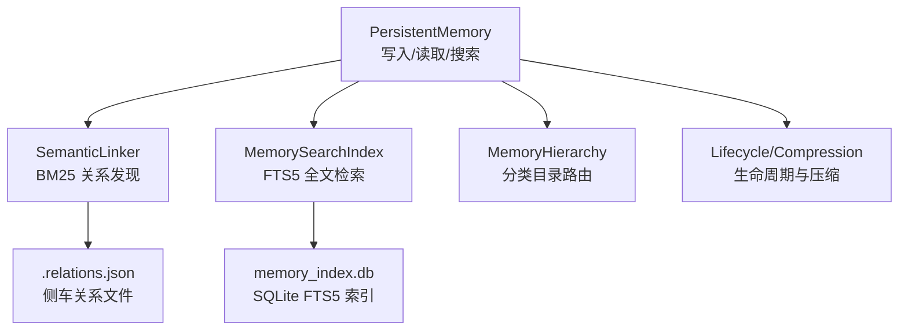
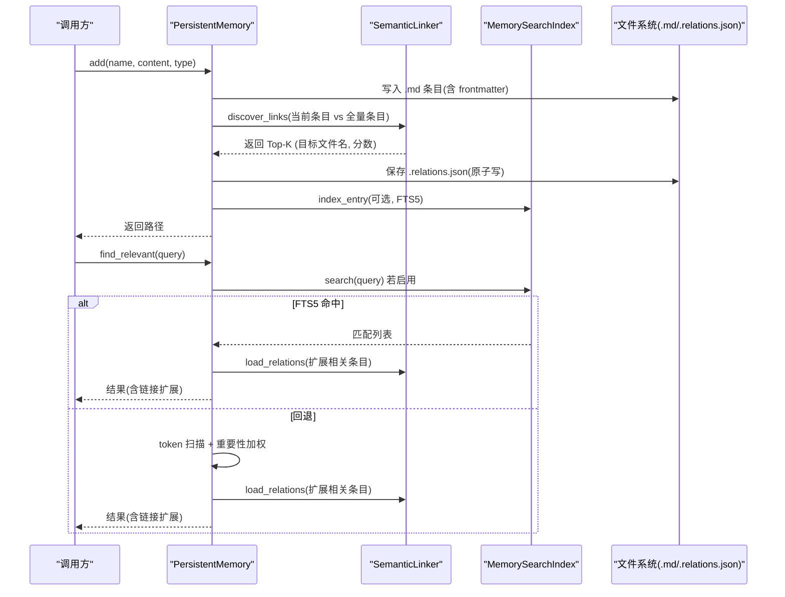
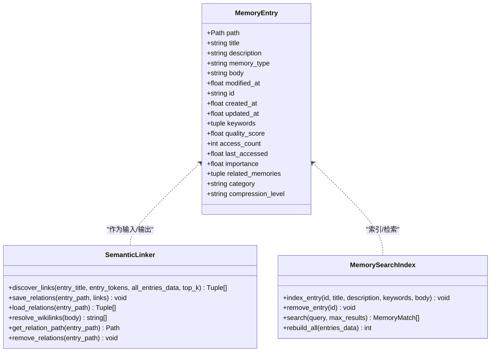
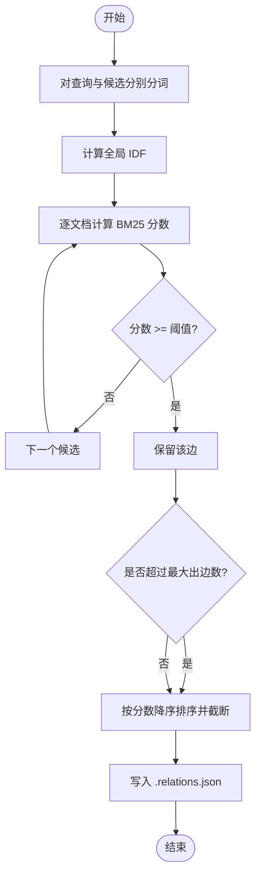
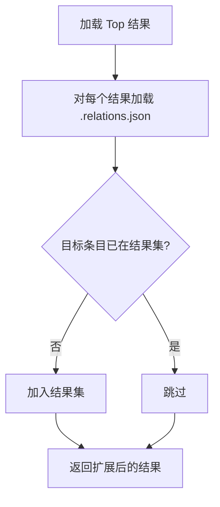
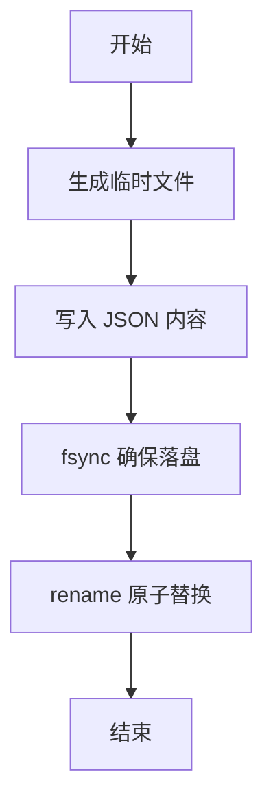
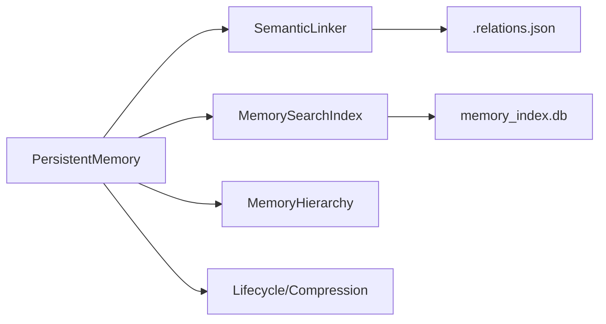

# 语义链接系统

<cite>
**本文引用的文件**
- [semantic_links.py](file://agent/src/memory/semantic_links.py)
- [persistent.py](file://agent/src/memory/persistent.py)
- [search_index.py](file://agent/src/memory/search_index.py)
- [hierarchy.py](file://agent/src/memory/hierarchy.py)
- [lifecycle.py](file://agent/src/memory/lifecycle.py)
- [compression.py](file://agent/src/memory/compression.py)
- [test_semantic_links.py](file://agent/tests/memory/test_semantic_links.py)
</cite>

## 目录
1. [简介](#简介)
2. [项目结构](#项目结构)
3. [核心组件](#核心组件)
4. [架构总览](#架构总览)
5. [详细组件分析](#详细组件分析)
6. [依赖关系分析](#依赖关系分析)
7. [性能考量](#性能考量)
8. [故障排查指南](#故障排查指南)
9. [结论](#结论)
10. [附录](#附录)

## 简介
本技术文档面向知识图谱与记忆系统开发者，系统化阐述“语义链接系统”的设计与实现。该系统基于持久化记忆（Markdown 条目）构建实体节点，通过 BM25 相似度计算发现并维护边权重，形成可查询、可扩展的语义图。文档覆盖：
- 实体关系建模：节点表示、边权重计算、关系发现算法
- 链接发现机制：BM25 相似度、关键词匹配、上下文分析
- 关系推理能力：传递闭包、间接关联、关系强度评估
- 存储格式：JSON 侧车文件、版本兼容、数据迁移策略
- 维护机制：增量更新、冲突解决、一致性保证
- 查询 API：关系遍历、路径查找、子图提取
- 质量评估：准确性验证、完整性检查、性能监控

## 项目结构
语义链接系统位于 agent/src/memory 模块中，围绕持久化记忆与全文检索构建，提供可选的语义链接能力。关键文件职责如下：
- persistent.py：持久化记忆读写、索引重建、搜索入口、与链接系统的集成点
- semantic_links.py：BM25 相似度计算、关系发现、侧车 JSON 存储与解析、显式 Wikilink 解析
- search_index.py：SQLite FTS5 全文检索索引，支持 CJK 分词与去重、自动重建
- hierarchy.py：按类别路由与扫描，提升搜索范围裁剪效率
- lifecycle.py + compression.py：生命周期管理与压缩策略，影响可用内容与检索效果

图表来源
- [persistent.py:200-595](file://agent/src/memory/persistent.py#L200-L595)
- [semantic_links.py:158-372](file://agent/src/memory/semantic_links.py#L158-L372)
- [search_index.py:113-481](file://agent/src/memory/search_index.py#L113-L481)
- [hierarchy.py:34-176](file://agent/src/memory/hierarchy.py#L34-L176)
- [lifecycle.py:248-279](file://agent/src/memory/lifecycle.py#L248-L279)

章节来源
- [persistent.py:200-595](file://agent/src/memory/persistent.py#L200-L595)
- [semantic_links.py:158-372](file://agent/src/memory/semantic_links.py#L158-L372)
- [search_index.py:113-481](file://agent/src/memory/search_index.py#L113-L481)
- [hierarchy.py:34-176](file://agent/src/memory/hierarchy.py#L34-L176)
- [lifecycle.py:248-279](file://agent/src/memory/lifecycle.py#L248-L279)

## 核心组件
- PersistentMemory：负责记忆条目的增删改查、索引重建、搜索，并在写入时触发语义链接发现；在删除时清理关系文件。
- SemanticLinker：基于 BM25 对当前条目与全量条目进行相似度打分，输出 Top-K 关系，并以 .relations.json 形式持久化；同时支持从正文解析显式 [[hex-id]] 链接。
- MemorySearchIndex：使用 SQLite FTS5 建立全文索引，支持 CJK 单字+双字元扩展、查询安全过滤、自动重建与结果片段高亮。
- MemoryHierarchy：将记忆按类型路由到分类目录，支持按类别裁剪搜索范围，提高 O(n) 扫描的性能。
- Lifecycle/Compression：根据访问时间与压缩级别对旧内容进行压缩，影响后续检索与链接发现的内容粒度。

章节来源
- [persistent.py:200-595](file://agent/src/memory/persistent.py#L200-L595)
- [semantic_links.py:158-372](file://agent/src/memory/semantic_links.py#L158-L372)
- [search_index.py:113-481](file://agent/src/memory/search_index.py#L113-L481)
- [hierarchy.py:34-176](file://agent/src/memory/hierarchy.py#L34-L176)
- [lifecycle.py:248-279](file://agent/src/memory/lifecycle.py#L248-L279)

## 架构总览
系统以 Markdown 记忆为节点，以 .relations.json 为边权重存储，辅以 FTS5 全文索引加速检索。写入流程在持久层触发 BM25 关系发现，并将结果落盘；删除流程同步清理关系文件。搜索流程优先走 FTS5，失败或为空时回退到 token 扫描，并可扩展相关条目。

图表来源
- [persistent.py:479-595](file://agent/src/memory/persistent.py#L479-L595)
- [semantic_links.py:179-319](file://agent/src/memory/semantic_links.py#L179-L319)
- [search_index.py:207-303](file://agent/src/memory/search_index.py#L207-L303)

## 详细组件分析

### 实体关系建模
- 节点表示：每个 .md 文件是一个节点，frontmatter 包含 id、name、description、type、keywords、quality_score、access_count、last_accessed、importance、related_memories、category、compression_level 等字段。id 用于唯一标识，便于显式链接与跨引用。
- 边权重计算：采用 BM25 对“标题+描述+正文”的 token 序列进行相似度打分，结合 IDF 与长度归一化，得到非负相关性分数。
- 关系发现算法：对当前条目与其余所有条目计算 BM25，过滤低于阈值的边，限制最大出边数，排序后持久化。

图表来源
- [persistent.py:126-147](file://agent/src/memory/persistent.py#L126-L147)
- [semantic_links.py:158-372](file://agent/src/memory/semantic_links.py#L158-L372)
- [search_index.py:96-111](file://agent/src/memory/search_index.py#L96-L111)

章节来源
- [persistent.py:126-147](file://agent/src/memory/persistent.py#L126-L147)
- [semantic_links.py:158-372](file://agent/src/memory/semantic_links.py#L158-L372)
- [search_index.py:96-111](file://agent/src/memory/search_index.py#L96-L111)

### 链接发现机制
- BM25 相似度：
  - 参数：k1=1.5，b=0.75；IDF 公式采用 log((N - n + 0.5)/(n + 0.5) + 1)；平均文档长度参与长度归一化。
  - 过程：对候选文档计算 TF，去重后的查询项贡献 IDF*TF/(TF + k1*(1-b+b*dl/avgdl))，累加得总分。
- 关键词匹配：
  - 搜索阶段使用 FTS5 MATCH 或 token 重叠评分（元数据与关键词权重更高）。
  - CJK 文本通过单字+双字元扩展提升召回。
- 上下文分析：
  - 链接发现使用“标题+描述+正文”的联合 token 序列，避免仅凭标题误判。
  - 显式 Wikilink [[hex-id]] 解析提供强信号，辅助关系补全。

图表来源
- [semantic_links.py:73-150](file://agent/src/memory/semantic_links.py#L73-L150)
- [semantic_links.py:179-230](file://agent/src/memory/semantic_links.py#L179-L230)
- [semantic_links.py:232-319](file://agent/src/memory/semantic_links.py#L232-L319)

章节来源
- [semantic_links.py:73-150](file://agent/src/memory/semantic_links.py#L73-L150)
- [semantic_links.py:179-230](file://agent/src/memory/semantic_links.py#L179-L230)
- [semantic_links.py:232-319](file://agent/src/memory/semantic_links.py#L232-L319)

### 关系推理能力
- 传递闭包计算：
  - 代码未直接实现传递闭包。可通过加载各节点的 .relations.json 构建邻接表，然后执行 BFS/DFS 计算可达集合。
- 间接关联发现：
  - 在搜索结果中，已集成“链接扩展”：对 Top 结果加载其关系文件，追加未包含的相关条目，增强上下文。
- 关系强度评估：
  - 边权重即 BM25 分数，可用于排序与阈值控制；也可结合访问次数、重要性衰减进行再评分。

图表来源
- [persistent.py:435-455](file://agent/src/memory/persistent.py#L435-L455)
- [semantic_links.py:282-319](file://agent/src/memory/semantic_links.py#L282-L319)

章节来源
- [persistent.py:435-455](file://agent/src/memory/persistent.py#L435-L455)
- [semantic_links.py:282-319](file://agent/src/memory/semantic_links.py#L282-L319)

### 链接存储格式
- 侧车文件：{entry.stem}.relations.json，与 .md 同目录。
- JSON 结构：
  - version：当前为 1，用于兼容性判断
  - links：数组，每项包含 target（目标文件名）与 score（浮点分数，四舍五入到小数点后4位）
  - updated_at：ISO-8601 时间戳（UTC），无毫秒
- 写入策略：原子写（临时文件 + fsync + rename），防止崩溃导致部分写入。
- 读取策略：异常容错（OSError/JSONDecodeError），版本不匹配则丢弃。

图表来源
- [semantic_links.py:232-281](file://agent/src/memory/semantic_links.py#L232-L281)

章节来源
- [semantic_links.py:232-281](file://agent/src/memory/semantic_links.py#L232-L281)

### 链接维护机制
- 增量更新：
  - 新增条目时，重新扫描全量条目，计算当前条目与其他条目的 BM25 分数，更新 .relations.json。
  - 删除条目时，移除对应 .relations.json，保持图一致。
- 冲突解决：
  - 原子写避免并发写入竞争；文件锁用于持久层写入保护。
- 一致性保证：
  - 删除操作会清理 FTS5 索引与关系文件；写入失败记录日志并回滚临时文件。

章节来源
- [persistent.py:548-595](file://agent/src/memory/persistent.py#L548-L595)
- [persistent.py:597-624](file://agent/src/memory/persistent.py#L597-L624)
- [semantic_links.py:232-281](file://agent/src/memory/semantic_links.py#L232-L281)

### 链接查询 API
- 关系遍历：
  - 通过 load_relations 获取某条目的直接邻居（目标文件名与分数）。
- 路径查找：
  - 代码未内置路径查找；可在应用层基于邻接表执行 BFS/DFS 寻找多跳路径。
- 子图提取：
  - 选择种子节点集合，递归加载其关系，合并去重，得到局部子图。

章节来源
- [semantic_links.py:282-319](file://agent/src/memory/semantic_links.py#L282-L319)

### 链接质量评估
- 准确性验证：
  - 单元测试覆盖 BM25 打分、IDF 计算、关系发现流程，确保算法正确性。
- 完整性检查：
  - 写入/读取均带异常处理；版本校验保障向后兼容。
- 性能监控：
  - FTS5 提供 O(log n) 检索；BM25 计算复杂度与条目规模线性相关，可通过 top_k 与阈值控制开销。
  - 层级目录减少扫描范围，提升整体性能。

章节来源
- [test_semantic_links.py:1-29](file://agent/tests/memory/test_semantic_links.py#L1-L29)
- [search_index.py:252-303](file://agent/src/memory/search_index.py#L252-L303)
- [hierarchy.py:145-176](file://agent/src/memory/hierarchy.py#L145-L176)

## 依赖关系分析
- PersistentMemory 依赖：
  - SemanticLinker：在 add/remove/find_relevant 中按需启用（受环境变量 VT_MEMORY_LINKS 控制）
  - MemorySearchIndex：在 add/remove/find_relevant 中按需启用（受环境变量 VT_MEMORY_FTS_INDEX 控制）
  - MemoryHierarchy：在添加与扫描时按类别路由与裁剪
  - Lifecycle/Compression：在生命周期任务中压缩旧内容，影响检索与链接发现的质量
- 外部依赖：
  - SQLite FTS5：全文检索后端，不可用时降级为 token 扫描
  - 文件系统：Markdown 与 JSON 侧车文件

图表来源
- [persistent.py:200-595](file://agent/src/memory/persistent.py#L200-L595)
- [search_index.py:113-481](file://agent/src/memory/search_index.py#L113-L481)
- [semantic_links.py:158-372](file://agent/src/memory/semantic_links.py#L158-L372)
- [hierarchy.py:34-176](file://agent/src/memory/hierarchy.py#L34-L176)
- [lifecycle.py:248-279](file://agent/src/memory/lifecycle.py#L248-L279)

章节来源
- [persistent.py:200-595](file://agent/src/memory/persistent.py#L200-L595)
- [search_index.py:113-481](file://agent/src/memory/search_index.py#L113-L481)
- [semantic_links.py:158-372](file://agent/src/memory/semantic_links.py#L158-L372)
- [hierarchy.py:34-176](file://agent/src/memory/hierarchy.py#L34-L176)
- [lifecycle.py:248-279](file://agent/src/memory/lifecycle.py#L248-L279)

## 性能考量
- 时间复杂度：
  - BM25 关系发现：O(N·T)，N 为条目数，T 为 token 统计与打分成本；可通过 top_k 与阈值降低实际计算量。
  - FTS5 检索：近似 O(log N) 查询，配合 snippet 高亮。
- 空间复杂度：
  - 内存占用主要来自 token 列表与 IDF 映射；可通过批量重建与缓存优化。
- I/O 优化：
  - 原子写与 fsync 保证一致性但增加 I/O；在高吞吐场景可考虑批处理。
- 搜索范围裁剪：
  - 使用层级目录与关键字重叠评分，优先扫描相关类别，减少全量扫描。

[本节为通用指导，不直接分析具体文件]

## 故障排查指南
- 关系文件写入失败：
  - 现象：日志记录 “Failed to write relations file”
  - 排查：检查磁盘权限、临时文件创建、fsync 与 rename 是否成功
- 关系文件读取失败：
  - 现象：日志记录 “Failed to read relations file” 或 “Unsupported relations format”
  - 排查：确认 JSON 结构、version 字段、links 数组格式
- FTS5 不可用：
  - 现象：日志记录 “FTS5 unavailable, search disabled”
  - 排查：确认 SQLite 编译选项是否启用 FTS5；系统将回退到 token 扫描
- 重复写入拦截：
  - 现象：短时间内相同内容的写入被阻止
  - 排查：检查去重窗口与哈希计算逻辑

章节来源
- [semantic_links.py:232-281](file://agent/src/memory/semantic_links.py#L232-L281)
- [semantic_links.py:282-319](file://agent/src/memory/semantic_links.py#L282-L319)
- [search_index.py:147-173](file://agent/src/memory/search_index.py#L147-L173)
- [persistent.py:472-492](file://agent/src/memory/persistent.py#L472-L492)

## 结论
语义链接系统以 Markdown 记忆为节点、BM25 相似度为边权重，构建了轻量而可扩展的知识图谱。通过 FTS5 全文检索与层级目录裁剪，系统在大规模条目下仍保持良好性能。关系发现、存储与维护机制具备健壮性与可演进性，适合知识图谱开发者在此基础上实现更复杂的推理与查询功能。

[本节为总结，不直接分析具体文件]

## 附录
- 环境变量开关：
  - VT_MEMORY_LINKS：启用/禁用语义链接
  - VT_MEMORY_FTS_INDEX：启用/禁用 FTS5 全文检索
  - VT_MEMORY_HIERARCHY：启用/禁用层级目录
  - VT_MEMORY_COMPRESSION / VT_MEMORY_GC：启用/禁用压缩与垃圾回收
- 最佳实践：
  - 合理设置 top_k 与最小分数阈值，平衡召回与性能
  - 定期重建 FTS5 索引，确保检索一致性
  - 使用层级目录组织记忆，提升搜索效率
  - 在写入密集场景关注 I/O 压力，必要时批处理关系更新

[本节为补充信息，不直接分析具体文件]