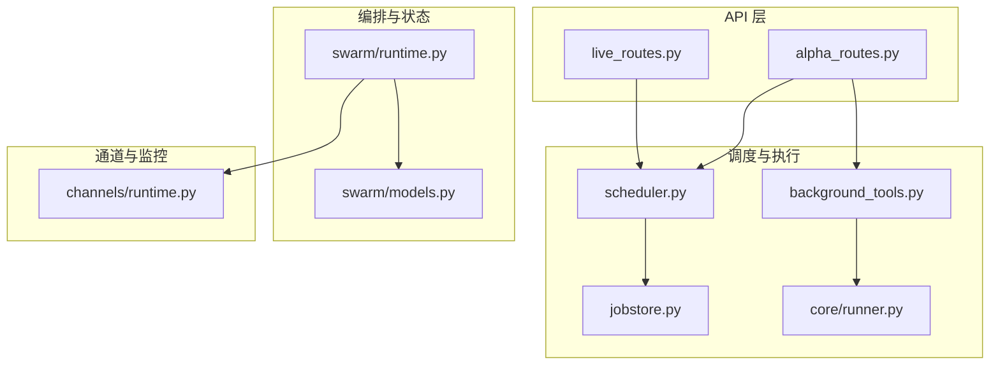
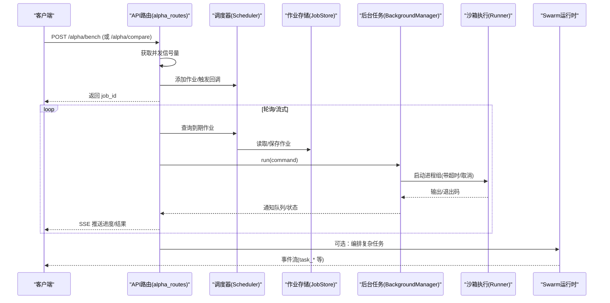
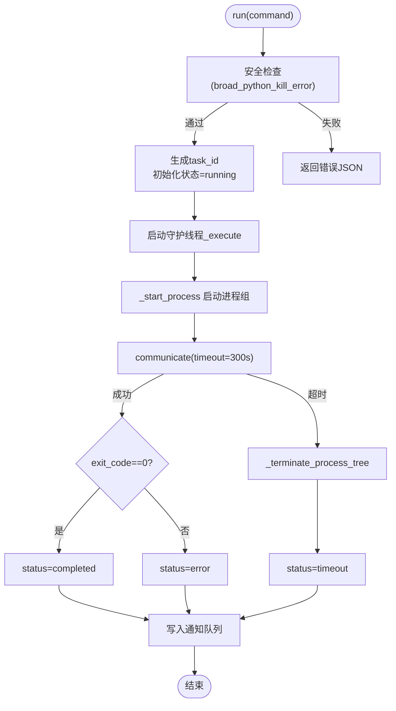
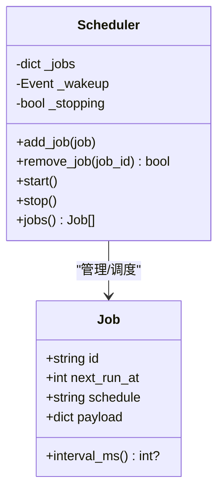
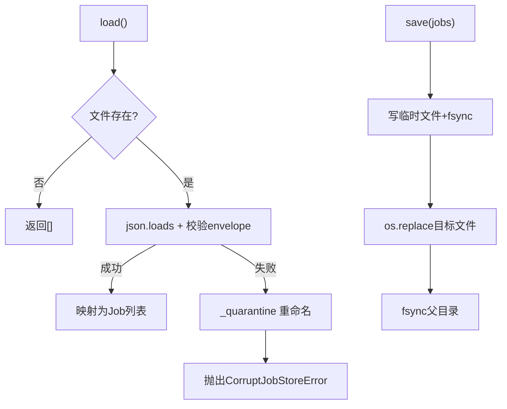
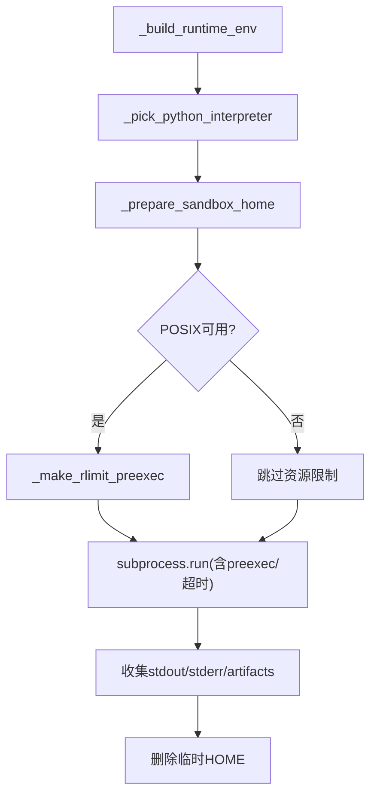
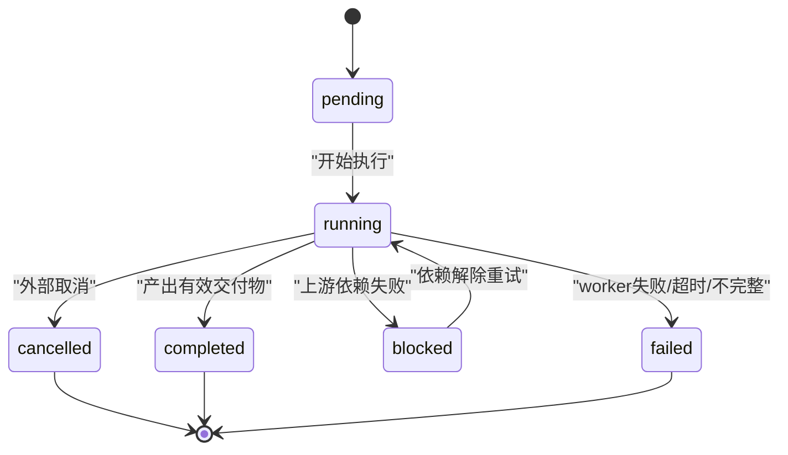
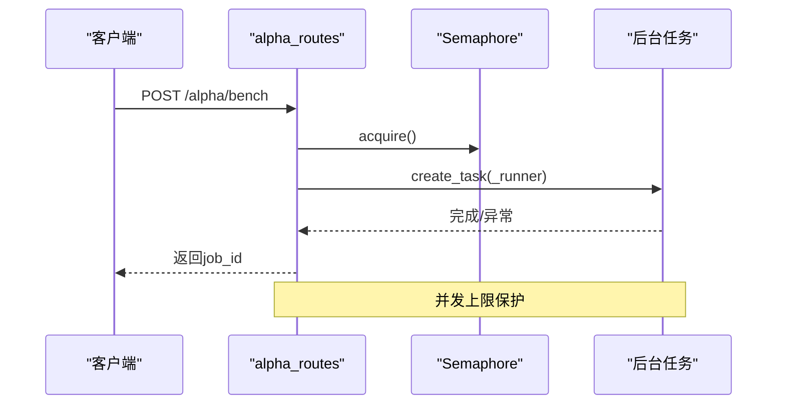
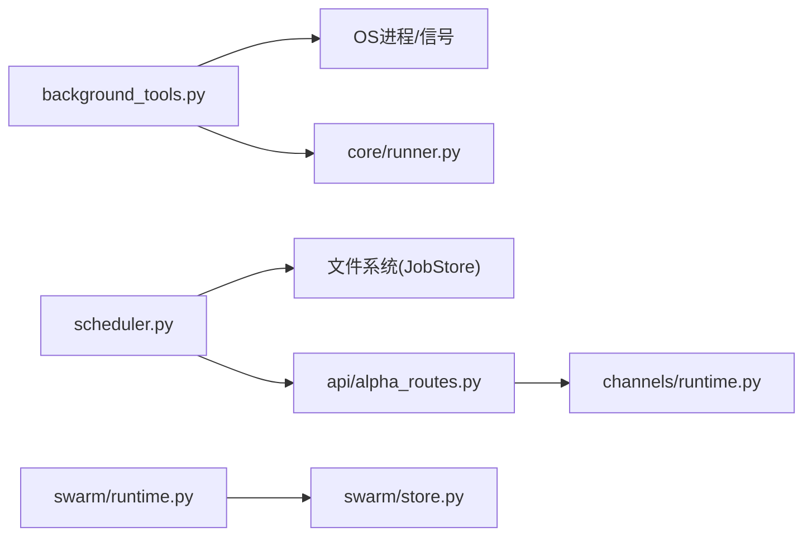

# 任务队列管理

<cite>
**本文引用的文件**
- [background_tools.py](file://agent/src/tools/background_tools.py)
- [scheduler.py](file://agent/src/live/runtime/scheduler.py)
- [jobstore.py](file://agent/src/live/runtime/jobstore.py)
- [runner.py](file://agent/src/core/runner.py)
- [alpha_routes.py](file://agent/src/api/alpha_routes.py)
- [runtime.py](file://agent/src/swarm/runtime.py)
- [models.py](file://agent/src/swarm/models.py)
- [live_routes.py](file://agent/src/api/live_routes.py)
- [channels_runtime.py](file://agent/src/channels/runtime.py)
</cite>

## 目录
1. [简介](#简介)
2. [项目结构](#项目结构)
3. [核心组件](#核心组件)
4. [架构总览](#架构总览)
5. [详细组件分析](#详细组件分析)
6. [依赖关系分析](#依赖关系分析)
7. [性能考量](#性能考量)
8. [故障排查指南](#故障排查指南)
9. [结论](#结论)
10. [附录](#附录)

## 简介
本技术文档围绕“任务队列管理系统”展开，聚焦后台任务队列的设计与实现，涵盖：
- 任务数据结构、状态管理与线程安全机制
- 任务的创建流程（任务ID生成、初始状态设置、进程组启动）
- 任务生命周期状态转换（running、completed、error、timeout、cancelled）的触发条件与处理逻辑
- 任务隔离机制（进程组隔离、资源限制、安全检查）
- 任务监控接口（状态查询、进度跟踪、性能指标收集）
- 超时处理与自动清理机制，确保系统资源合理分配

该系统由多个子系统协作完成：后台命令执行器、定时调度器、持久化存储、沙箱执行器、Swarm DAG 编排运行时以及 API 路由层。

## 项目结构
仓库中与任务队列相关的核心模块分布如下：
- 后台任务执行与通知：agent/src/tools/background_tools.py
- 墙钟调度器与作业模型：agent/src/live/runtime/scheduler.py
- 作业持久化存储：agent/src/live/runtime/jobstore.py
- 子进程沙箱执行与环境隔离：agent/src/core/runner.py
- 异步并发控制与SSE流式接口：agent/src/api/alpha_routes.py
- Swarm DAG 编排与任务状态机：agent/src/swarm/runtime.py, agent/src/swarm/models.py
- 运行期控制与事件通道：agent/src/api/live_routes.py, agent/src/channels/runtime.py

**图表来源**
- [alpha_routes.py:539-566](file://agent/src/api/alpha_routes.py#L539-L566)
- [scheduler.py:178-329](file://agent/src/live/runtime/scheduler.py#L178-L329)
- [jobstore.py:76-289](file://agent/src/live/runtime/jobstore.py#L76-L289)
- [background_tools.py:102-377](file://agent/src/tools/background_tools.py#L102-L377)
- [runner.py:379-627](file://agent/src/core/runner.py#L379-L627)
- [runtime.py:53-195](file://agent/src/swarm/runtime.py#L53-L195)
- [models.py](file://agent/src/swarm/models.py)
- [channels_runtime.py:104-131](file://agent/src/channels/runtime.py#L104-L131)

**章节来源**
- [alpha_routes.py:539-566](file://agent/src/api/alpha_routes.py#L539-L566)
- [scheduler.py:178-329](file://agent/src/live/runtime/scheduler.py#L178-L329)
- [jobstore.py:76-289](file://agent/src/live/runtime/jobstore.py#L76-L289)
- [background_tools.py:102-377](file://agent/src/tools/background_tools.py#L102-L377)
- [runner.py:379-627](file://agent/src/core/runner.py#L379-L627)
- [runtime.py:53-195](file://agent/src/swarm/runtime.py#L53-L195)
- [channels_runtime.py:104-131](file://agent/src/channels/runtime.py#L104-L131)

## 核心组件
- 后台任务管理器 BackgroundManager：负责后台命令的进程组启动、超时终止、取消、状态查询与通知队列。
- 调度器 Scheduler：基于 asyncio 的墙钟调度，维护作业集合、计算下次触发时间、批量触发到期作业并推进下一次计划。
- 作业存储 JobStore：提供原子写入、崩溃恢复、损坏隔离的持久化能力，保证作业集在异常情况下的一致性。
- 沙箱执行器 Runner：以受限环境执行子进程，包含环境变量白名单、临时 HOME、资源限制（RLIMIT_AS/NOFILE）、UID 降级等安全加固。
- Swarm 运行时：DAG 编排、任务分层并行、事件驱动的状态更新与最终报告收敛。
- API 路由：提供任务创建、并发控制（信号量）、SSE 流式输出、运行器启停等接口。

**章节来源**
- [background_tools.py:102-377](file://agent/src/tools/background_tools.py#L102-L377)
- [scheduler.py:178-329](file://agent/src/live/runtime/scheduler.py#L178-L329)
- [jobstore.py:76-289](file://agent/src/live/runtime/jobstore.py#L76-L289)
- [runner.py:379-627](file://agent/src/core/runner.py#L379-L627)
- [runtime.py:53-195](file://agent/src/swarm/runtime.py#L53-L195)
- [alpha_routes.py:539-566](file://agent/src/api/alpha_routes.py#L539-L566)

## 架构总览
下图展示了从 API 到调度、执行、持久化与监控的整体数据流与控制流。

**图表来源**
- [alpha_routes.py:539-566](file://agent/src/api/alpha_routes.py#L539-L566)
- [scheduler.py:178-329](file://agent/src/live/runtime/scheduler.py#L178-L329)
- [jobstore.py:76-289](file://agent/src/live/runtime/jobstore.py#L76-L289)
- [background_tools.py:102-377](file://agent/src/tools/background_tools.py#L102-L377)
- [runner.py:379-627](file://agent/src/core/runner.py#L379-L627)
- [runtime.py:53-195](file://agent/src/swarm/runtime.py#L53-L195)

## 详细组件分析

### 后台任务管理器 BackgroundManager
- 任务数据结构
  - 任务字典包含：status、result、command、exit_code、process、cancel_requested、started_at、duration_seconds 等字段。
  - 通知队列 _notifications 用于消费端拉取最新完成事件。
- 线程安全
  - 使用 threading.Lock 保护 tasks 与 _notifications 的读写。
- 任务创建流程
  - 生成短 task_id（uuid 前缀）。
  - 初始化状态为 running，记录 started_at。
  - 启动守护线程执行 _execute。
- 进程组隔离与安全
  - 跨平台进程组：POSIX 使用 start_new_session + os.killpg；Windows 使用 CREATE_NEW_PROCESS_GROUP + taskkill /T /F。
  - 安全校验：broad_python_kill_error 拦截危险命令。
- 超时与终止
  - 默认超时 300s；超时后先 SIGTERM，等待宽限期，再 SIGKILL 确保无孤儿进程。
- 取消流程
  - cancel 将状态置为 cancelling，标记 cancel_requested，并立即对进程组发送终止信号。
- 状态查询
  - check 支持按 task_id 查询或列出所有任务摘要；返回 elapsed/remaining timeout 等指标。
- 通知消费
  - drain_notifications 原子拉取并清空通知队列。

**图表来源**
- [background_tools.py:110-205](file://agent/src/tools/background_tools.py#L110-L205)

**章节来源**
- [background_tools.py:24-99](file://agent/src/tools/background_tools.py#L24-L99)
- [background_tools.py:102-377](file://agent/src/tools/background_tools.py#L102-L377)

### 调度器 Scheduler 与作业模型 Job
- 作业模型 Job
  - 字段：id、next_run_at（毫秒级时间戳）、schedule（如 interval:<ms> 或 once）、payload（透传）。
  - interval_ms() 解析 schedule，未知/非法时回退到默认间隔。
- 调度循环
  - compute_sleep_ms 计算休眠时长，上限 max_recheck_ms 防止长时间不唤醒。
  - due_jobs 筛选到期作业并按 next_run_at 排序。
  - advance_after_fire 推进 recurring 作业的 next_run_at，一次性作业移除。
- 并发与健壮性
  - on_fire 异常被捕获并记录，不影响其他作业。
  - add_job/remove_job 通过 Event 唤醒循环，避免阻塞于长睡眠。
- 持久化集成
  - 与 JobStore 解耦：调度器只维护内存作业集，JobStore 负责原子落盘与损坏隔离。

**图表来源**
- [scheduler.py:51-97](file://agent/src/live/runtime/scheduler.py#L51-L97)
- [scheduler.py:178-329](file://agent/src/live/runtime/scheduler.py#L178-L329)

**章节来源**
- [scheduler.py:100-176](file://agent/src/live/runtime/scheduler.py#L100-L176)
- [scheduler.py:178-329](file://agent/src/live/runtime/scheduler.py#L178-L329)

### 作业存储 JobStore
- 原子写入
  - 写临时文件 → fsync → os.replace → 父目录 fsync，确保崩溃一致性。
- 损坏隔离
  - 解析失败时重命名为 .corrupt-<ts>，并抛出 CorruptJobStoreError，阻止空启动。
- 版本信封
  - schema_version + jobs 列表，便于未来兼容升级。
- 序列化/反序列化
  - Job 对象与 dict 互转，严格类型校验。

**图表来源**
- [jobstore.py:98-152](file://agent/src/live/runtime/jobstore.py#L98-L152)
- [jobstore.py:153-204](file://agent/src/live/runtime/jobstore.py#L153-L204)
- [jobstore.py:205-289](file://agent/src/live/runtime/jobstore.py#L205-L289)

**章节来源**
- [jobstore.py:76-289](file://agent/src/live/runtime/jobstore.py#L76-L289)

### 沙箱执行器 Runner
- 环境隔离
  - 仅允许白名单环境变量进入子进程，避免泄露敏感信息。
  - 临时 HOME 目录，仅软链接必要路径，降低越权风险。
- 资源限制
  - POSIX 下通过 preexec_fn 设置 RLIMIT_AS（虚拟地址空间）与 RLIMIT_NOFILE（文件描述符数）。
  - 可通过环境变量调整 AS 上限。
- UID 降级
  - 在具备能力的容器中尝试切换到 vibe-sandbox 用户执行，不可用时降级并告警。
- 超时与产物
  - 子进程执行受 timeout 约束；stdout/stderr 落盘；artifacts 按规范收集。

**图表来源**
- [runner.py:522-569](file://agent/src/core/runner.py#L522-L569)
- [runner.py:571-592](file://agent/src/core/runner.py#L571-L592)
- [runner.py:510-627](file://agent/src/core/runner.py#L510-L627)

**章节来源**
- [runner.py:33-111](file://agent/src/core/runner.py#L33-L111)
- [runner.py:113-173](file://agent/src/core/runner.py#L113-L173)
- [runner.py:259-361](file://agent/src/core/runner.py#L259-L361)
- [runner.py:379-627](file://agent/src/core/runner.py#L379-L627)

### Swarm 运行时与任务状态机
- 运行生命周期
  - start_run 构建 run、验证 DAG、持久化、启动后台线程执行。
  - 支持 cancel_run 通过 Event 中断执行。
- 任务状态
  - TaskStatus 包括 in_progress、completed、failed、blocked、cancelled、pending 等。
  - 事件驱动：task_completed、task_failed、task_blocked、task_retry 等事件持久化并转发。
- 最终报告收敛
  - 只有真正完成的 deliverable 才会成为 final_report；timeout/incomplete 不会误判为成功。

**图表来源**
- [runtime.py:90-175](file://agent/src/swarm/runtime.py#L90-L175)
- [runtime.py:587-612](file://agent/src/swarm/runtime.py#L587-L612)
- [models.py](file://agent/src/swarm/models.py)

**章节来源**
- [runtime.py:53-195](file://agent/src/swarm/runtime.py#L53-L195)
- [runtime.py:587-612](file://agent/src/swarm/runtime.py#L587-L612)

### API 路由与并发控制
- 基准测试/对比任务
  - 使用 asyncio.Semaphore 限制并发（MAX_CONCURRENT_BENCHES、MAX_CONCURRENT_COMPARES），避免 DoS。
  - 后台线程执行耗时任务，异常时统一标记 error 并记录。
- 运行器控制
  - live/runner/start 与 live/runner/stop 控制持久化运行器的启停，并通过事件通道广播动作。
- 通道状态
  - channels/runtime.status 提供运行态、队列长度、会话数、通道状态等监控指标。

**图表来源**
- [alpha_routes.py:61-95](file://agent/src/api/alpha_routes.py#L61-L95)
- [alpha_routes.py:539-566](file://agent/src/api/alpha_routes.py#L539-L566)
- [live_routes.py:1158-1196](file://agent/src/api/live_routes.py#L1158-L1196)
- [channels_runtime.py:104-131](file://agent/src/channels/runtime.py#L104-L131)

**章节来源**
- [alpha_routes.py:61-95](file://agent/src/api/alpha_routes.py#L61-L95)
- [alpha_routes.py:539-566](file://agent/src/api/alpha_routes.py#L539-L566)
- [live_routes.py:1158-1196](file://agent/src/api/live_routes.py#L1158-L1196)
- [channels_runtime.py:104-131](file://agent/src/channels/runtime.py#L104-L131)

## 依赖关系分析
- 松耦合设计
  - Scheduler 与 JobStore 职责分离：前者专注调度决策，后者专注持久化。
  - BackgroundManager 与 Runner 解耦：前者负责进程组生命周期，后者负责沙箱环境与资源限制。
  - Swarm Runtime 通过事件总线与存储层交互，对外暴露稳定接口。
- 潜在循环依赖
  - 各模块通过明确接口调用，未见直接循环 import；事件与回调作为解耦点。
- 外部依赖
  - 操作系统信号与进程管理（POSIX killpg、Windows taskkill）。
  - asyncio 事件循环与并发原语（Semaphore、Event、Task）。
  - 文件系统原子操作（fsync、os.replace）。

**图表来源**
- [background_tools.py:24-99](file://agent/src/tools/background_tools.py#L24-L99)
- [scheduler.py:178-329](file://agent/src/live/runtime/scheduler.py#L178-L329)
- [jobstore.py:76-289](file://agent/src/live/runtime/jobstore.py#L76-L289)
- [alpha_routes.py:539-566](file://agent/src/api/alpha_routes.py#L539-L566)
- [runtime.py:53-195](file://agent/src/swarm/runtime.py#L53-L195)
- [channels_runtime.py:104-131](file://agent/src/channels/runtime.py#L104-L131)

**章节来源**
- [background_tools.py:24-99](file://agent/src/tools/background_tools.py#L24-L99)
- [scheduler.py:178-329](file://agent/src/live/runtime/scheduler.py#L178-L329)
- [jobstore.py:76-289](file://agent/src/live/runtime/jobstore.py#L76-L289)
- [alpha_routes.py:539-566](file://agent/src/api/alpha_routes.py#L539-L566)
- [runtime.py:53-195](file://agent/src/swarm/runtime.py#L53-L195)
- [channels_runtime.py:104-131](file://agent/src/channels/runtime.py#L104-L131)

## 性能考量
- 并发控制
  - 使用 asyncio.Semaphore 限制基准测试与对比任务的并发度，避免资源耗尽。
- 调度效率
  - 计算最早触发时间与最大重检间隔，减少无效唤醒；due_jobs 排序保证确定性。
- I/O 与持久化
  - JobStore 采用原子写入与目录 fsync，降低崩溃导致的数据丢失风险。
- 进程与资源
  - 子进程资源限制（RLIMIT_AS/NOFILE）与 UID 降级，防止恶意或失控任务影响宿主。
- 输出裁剪
  - 后台任务输出限制最大字符数，避免内存膨胀。

[本节为通用指导，无需特定文件引用]

## 故障排查指南
- 任务卡死或无响应
  - 检查 BackgroundManager.check 返回的 elapsed/remaining timeout；必要时调用 cancel_background。
  - 确认进程组是否存活（POSIX killpg/Windows taskkill 行为）。
- 调度器未触发
  - 检查作业 schedule 格式与 next_run_at；确认 compute_sleep_ms 返回值与事件唤醒。
- 持久化损坏
  - JobStore.load 抛出 CorruptJobStoreError 时会重命名损坏文件；需人工介入修复。
- 资源耗尽
  - 调整 VIBE_TRADING_SANDBOX_RLIMIT_AS_MB；检查 NOFILE 限制。
- 并发超限
  - 调低 MAX_CONCURRENT_BENCHES/MAX_CONCURRENT_COMPARES；观察 SSE 流式输出中的错误日志。

**章节来源**
- [background_tools.py:258-311](file://agent/src/tools/background_tools.py#L258-L311)
- [scheduler.py:132-176](file://agent/src/live/runtime/scheduler.py#L132-L176)
- [jobstore.py:98-152](file://agent/src/live/runtime/jobstore.py#L98-L152)
- [runner.py:73-111](file://agent/src/core/runner.py#L73-L111)
- [alpha_routes.py:61-95](file://agent/src/api/alpha_routes.py#L61-L95)

## 结论
该任务队列管理系统通过清晰的职责划分与严格的隔离机制，实现了高可靠的任务调度与执行：
- BackgroundManager 提供健壮的进程组生命周期管理与安全的命令执行。
- Scheduler 与 JobStore 组合保证了调度的高效性与数据的强一致性。
- Runner 的沙箱化执行与环境白名单大幅降低了安全风险。
- Swarm 运行时以事件驱动的方式管理复杂 DAG 任务，确保状态可观测与可恢复。
- API 层通过并发控制与流式接口提供友好的监控与交互体验。

建议在生产环境中结合监控指标（队列长度、任务耗时、错误率）与告警策略，持续优化并发阈值与超时配置，确保系统在高负载下的稳定性与可维护性。

## 附录
- 关键术语
  - 进程组隔离：通过操作系统特性将主进程与其子进程组织为一个组，便于统一终止。
  - 原子写入：通过临时文件与替换操作保证文件系统在崩溃场景下的完整性。
  - 事件驱动：通过事件（如 task_completed、task_failed）推动状态流转与前端展示。

[本节为概念说明，无需特定文件引用]