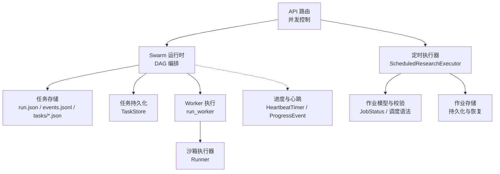
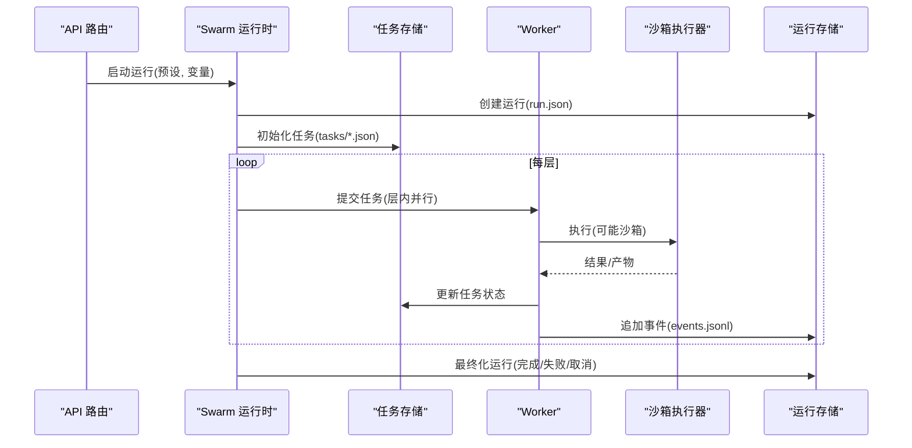
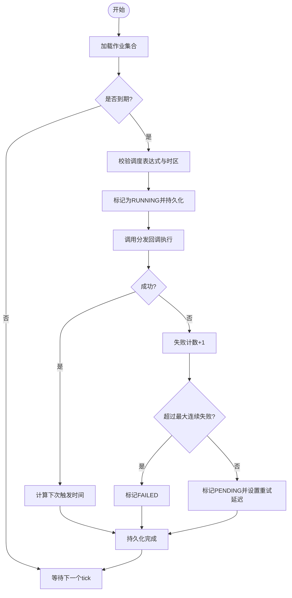
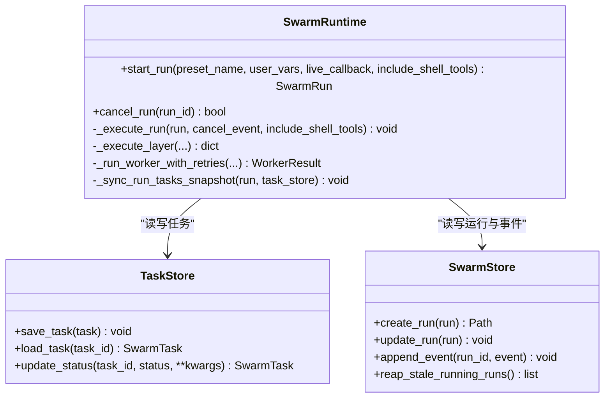
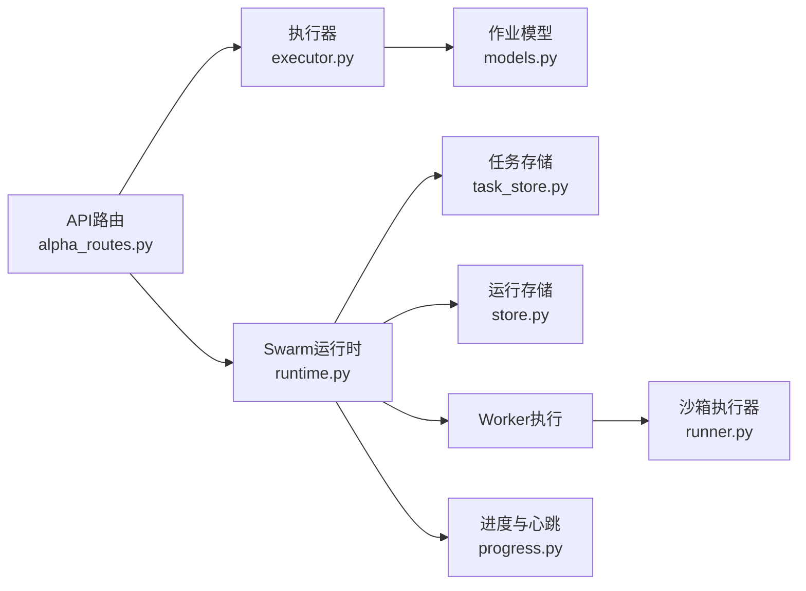

# 后台任务管理

<cite>
**本文引用的文件**
- [executor.py](file://agent/src/scheduled_research/executor.py)
- [models.py](file://agent/src/scheduled_research/models.py)
- [runtime.py](file://agent/src/swarm/runtime.py)
- [store.py](file://agent/src/swarm/store.py)
- [task_store.py](file://agent/src/swarm/task_store.py)
- [runner.py](file://agent/src/core/runner.py)
- [progress.py](file://agent/src/agent/progress.py)
- [alpha_routes.py](file://agent/src/api/alpha_routes.py)
- [background_tools.py](file://agent/src/tools/background_tools.py)
</cite>

## 目录
1. [简介](#简介)
2. [项目结构](#项目结构)
3. [核心组件](#核心组件)
4. [架构总览](#架构总览)
5. [详细组件分析](#详细组件分析)
6. [依赖关系分析](#依赖关系分析)
7. [性能与资源限制](#性能与资源限制)
8. [故障恢复与可靠性](#故障恢复与可靠性)
9. [监控、调试与可观测性](#监控调试与可观测性)
10. [取消、重试与失败处理](#取消重试与失败处理)
11. [结论](#结论)

## 简介
本技术文档围绕后台任务管理系统展开，覆盖任务创建与管理机制（任务队列、优先级调度、资源分配）、任务生命周期（状态跟踪、进度更新、完成通知）、持久化与故障恢复、隔离与安全、监控与调试工具，以及取消、重试与失败处理策略。系统包含两类主要后台任务：
- 定时研究执行器：基于时间轮询的定时任务调度与执行（支持间隔与简化 cron）。
- 多智能体工作流运行器：基于 DAG 的多任务编排执行，具备层间串行、层内并行、依赖门控、超时与重试等能力。

## 项目结构
后台任务相关代码集中在 agent 子模块中，关键路径如下：
- 定时任务调度与执行：scheduled_research/executor.py、scheduled_research/models.py
- 多智能体运行与持久化：swarm/runtime.py、swarm/store.py、swarm/task_store.py
- 沙箱执行与资源限制：core/runner.py
- 进度与心跳：agent/progress.py
- API 并发控制与 SSE 心跳：api/alpha_routes.py
- 通用后台进程管理：tools/background_tools.py

图表来源
- [runtime.py:1-769](file://agent/src/swarm/runtime.py#L1-L769)
- [store.py:1-566](file://agent/src/swarm/store.py#L1-L566)
- [task_store.py:1-249](file://agent/src/swarm/task_store.py#L1-L249)
- [executor.py:1-452](file://agent/src/scheduled_research/executor.py#L1-L452)
- [models.py:1-328](file://agent/src/scheduled_research/models.py#L1-L328)
- [runner.py:1-627](file://agent/src/core/runner.py#L1-L627)
- [progress.py:1-185](file://agent/src/agent/progress.py#L1-L185)
- [alpha_routes.py:61-95](file://agent/src/api/alpha_routes.py#L61-L95)

章节来源
- [runtime.py:1-769](file://agent/src/swarm/runtime.py#L1-L769)
- [executor.py:1-452](file://agent/src/scheduled_research/executor.py#L1-L452)
- [store.py:1-566](file://agent/src/swarm/store.py#L1-L566)
- [task_store.py:1-249](file://agent/src/swarm/task_store.py#L1-L249)
- [runner.py:1-627](file://agent/src/core/runner.py#L1-L627)
- [progress.py:1-185](file://agent/src/agent/progress.py#L1-L185)
- [alpha_routes.py:61-95](file://agent/src/api/alpha_routes.py#L61-L95)

## 核心组件
- 定时研究执行器：周期性轮询待执行作业，按调度规则计算下次触发时间，支持间隔与简化 cron；具备失败重试、连续失败上限、过期 RUNNING 恢复等能力。
- Swarm 运行时：构建 DAG、分层执行、依赖门控、层内并行、超时保护、事件持久化与回放、失败任务标记与阻断下游。
- 任务与运行持久化：原子写入 run.json、append-only 事件日志、独立任务文件；提供 stale-run 回收、终端状态恢复、任务阻塞解除。
- 沙箱执行器：为生成的策略代码提供受限环境（临时 HOME、环境变量白名单、可选 UID 降级、RLIMIT 限制），并收集日志与产物。
- 进度与心跳：结构化进度事件与心跳定时器，保证 UI 不冻结且长任务有持续反馈。
- API 并发控制：通过信号量限制高负载任务并发度，避免服务被压垮。
- 通用后台进程管理：启动/停止/查询后台进程，支持进程组信号与超时上下文。

章节来源
- [executor.py:160-452](file://agent/src/scheduled_research/executor.py#L160-L452)
- [runtime.py:53-769](file://agent/src/swarm/runtime.py#L53-L769)
- [store.py:115-566](file://agent/src/swarm/store.py#L115-L566)
- [task_store.py:16-249](file://agent/src/swarm/task_store.py#L16-L249)
- [runner.py:379-627](file://agent/src/core/runner.py#L379-L627)
- [progress.py:30-185](file://agent/src/agent/progress.py#L30-L185)
- [alpha_routes.py:61-95](file://agent/src/api/alpha_routes.py#L61-L95)
- [background_tools.py:1-305](file://agent/src/tools/background_tools.py#L1-L305)

## 架构总览
系统由“调度层”和“执行层”组成：
- 调度层：定时执行器负责从持久化存储读取作业，判断是否到期，调用分发回调执行；Swarm 运行时根据预设构建 DAG，分层调度任务。
- 执行层：Swarm 使用线程池并行执行同层任务，每个任务在 Worker 中运行，必要时进入沙箱执行外部脚本；所有状态与事件落盘。
- 监控层：SSE/事件日志提供实时状态与进度；API 层通过信号量控制并发，防止过载。

图表来源
- [runtime.py:90-159](file://agent/src/swarm/runtime.py#L90-L159)
- [runtime.py:222-403](file://agent/src/swarm/runtime.py#L222-L403)
- [store.py:159-263](file://agent/src/swarm/store.py#L159-L263)
- [task_store.py:47-110](file://agent/src/swarm/task_store.py#L47-L110)
- [runner.py:510-627](file://agent/src/core/runner.py#L510-L627)

## 详细组件分析

### 定时研究执行器（ScheduledResearchExecutor）
- 调度规则：支持毫秒级间隔或 5 字段简化 cron；解析时校验字段范围与格式，支持 IANA 时区；DST 空档跳过、重叠取首次。
- 轮询与唤醒：后台 asyncio.Task 周期 tick，支持 Event 提前唤醒；stop() 设置停止标志并等待任务结束。
- 生命周期：PENDING → RUNNING → COMPLETED/FAILED/CANCELLED；失败计数与指数退避重试；连续失败达到阈值转为 FAILED。
- 恢复：启动时扫描并重置残留 RUNNING 作业为 PENDING，避免僵尸任务。
- 错误记录：错误消息经脱敏与长度限制后持久化，便于审计与排查。

图表来源
- [executor.py:64-158](file://agent/src/scheduled_research/executor.py#L64-L158)
- [executor.py:230-323](file://agent/src/scheduled_research/executor.py#L230-L323)
- [executor.py:340-452](file://agent/src/scheduled_research/executor.py#L340-L452)
- [models.py:182-328](file://agent/src/scheduled_research/models.py#L182-L328)

章节来源
- [executor.py:160-452](file://agent/src/scheduled_research/executor.py#L160-L452)
- [models.py:1-328](file://agent/src/scheduled_research/models.py#L1-L328)

### Swarm 运行时（SwarmRuntime）
- 运行创建：从预设构建运行，验证 DAG，记录提供者/模型元数据，持久化 run.json。
- 分层执行：拓扑排序得到层；层内使用线程池并行执行，层间串行推进；支持层级预算与硬超时。
- 依赖门控：上游未完成则下游任务标记 blocked，阻止无输入的执行，保障安全。
- 事件与快照：每层边界将任务状态同步到 run.json，减少频繁 I/O；事件 append-only 支持增量读取。
- 终止与清理：根据任务状态推导运行终态；取消时标记剩余任务为 cancelled；清理取消事件与回调。

图表来源
- [runtime.py:53-159](file://agent/src/swarm/runtime.py#L53-L159)
- [runtime.py:222-403](file://agent/src/swarm/runtime.py#L222-L403)
- [runtime.py:476-645](file://agent/src/swarm/runtime.py#L476-L645)
- [task_store.py:16-110](file://agent/src/swarm/task_store.py#L16-L110)
- [store.py:115-263](file://agent/src/swarm/store.py#L115-L263)

章节来源
- [runtime.py:90-769](file://agent/src/swarm/runtime.py#L90-L769)
- [task_store.py:16-249](file://agent/src/swarm/task_store.py#L16-L249)
- [store.py:115-566](file://agent/src/swarm/store.py#L115-L566)

### 任务与运行持久化（SwarmStore / TaskStore）
- 原子写入：run.json 采用写临时文件再替换的方式，避免并发读导致损坏；Windows 下对共享冲突进行重试。
- 事件日志：events.jsonl 追加写入，支持 after_index 增量读取，用于 SSE 流式推送。
- 恢复与回收：reconcile_run 合并任务状态、推导运行终态、检测并回收停滞运行；reap_stale_running_runs 批量扫描。
- 任务解阻塞：任务完成后自动移除下游任务的 blocked_by，若为空则置 pending。

章节来源
- [store.py:115-566](file://agent/src/swarm/store.py#L115-L566)
- [task_store.py:113-249](file://agent/src/swarm/task_store.py#L113-L249)

### 沙箱执行器（Runner）
- 环境隔离：仅允许白名单环境变量进入子进程；HOME 替换为临时目录，仅暴露必要缓存与配置；可选 UID 降级。
- 资源限制：POSIX 下通过 RLIMIT_AS 限制虚拟内存，RLIMIT_NOFILE 限制文件描述符；超时保护。
- 产物收集：标准输出/错误写入日志文件；按规范收集 equity/metrics/trades 等产物。

章节来源
- [runner.py:33-278](file://agent/src/core/runner.py#L33-L278)
- [runner.py:487-627](file://agent/src/core/runner.py#L487-L627)

### 进度与心跳（Progress / HeartbeatTimer）
- 结构化进度：工具可在执行过程中发布 stage/current/total/message，供前端展示。
- 心跳保活：后台线程周期性发送 tool 心跳，确保 UI 不冻结；长任务即使状态不变也能收到更新。
- 线程安全：通过 thread-local 发射器，保证多线程环境下正确路由到对应 AgentLoop。

章节来源
- [progress.py:1-185](file://agent/src/agent/progress.py#L1-L185)

### API 并发控制与 SSE 心跳
- 信号量限流：bench/compare 等高负载任务通过进程级信号量限制并发，避免 DoS。
- SSE 心跳：定期发送心跳帧，保持连接活跃；结合任务进度与耗时信息，提升用户体验。

章节来源
- [alpha_routes.py:61-95](file://agent/src/api/alpha_routes.py#L61-L95)

### 通用后台进程管理（BackgroundManager）
- 进程组管理：跨平台启动 shell 命令，支持进程组信号终止；超时与优雅退出。
- 状态查询：返回任务状态、已用时长、剩余超时；支持取消指定任务并保留兄弟进程。

章节来源
- [background_tools.py:1-305](file://agent/src/tools/background_tools.py#L1-L305)

## 依赖关系分析
- 定时执行器依赖作业模型与存储，调度逻辑与时间计算相互独立，便于测试与替换时钟源。
- Swarm 运行时依赖任务存储与运行存储，层间依赖通过拓扑排序与 blocked_by 字段实现。
- 沙箱执行器与 Swarm Worker 解耦：Worker 负责业务编排，Runner 负责安全执行与产物收集。
- 进度与心跳作为横切关注点，被多处调用以增强可观测性。

图表来源
- [executor.py:160-452](file://agent/src/scheduled_research/executor.py#L160-L452)
- [models.py:182-328](file://agent/src/scheduled_research/models.py#L182-L328)
- [runtime.py:90-769](file://agent/src/swarm/runtime.py#L90-L769)
- [task_store.py:16-249](file://agent/src/swarm/task_store.py#L16-L249)
- [store.py:115-566](file://agent/src/swarm/store.py#L115-L566)
- [runner.py:379-627](file://agent/src/core/runner.py#L379-L627)
- [progress.py:1-185](file://agent/src/agent/progress.py#L1-L185)
- [alpha_routes.py:61-95](file://agent/src/api/alpha_routes.py#L61-L95)

章节来源
- [runtime.py:90-769](file://agent/src/swarm/runtime.py#L90-L769)
- [executor.py:160-452](file://agent/src/scheduled_research/executor.py#L160-L452)
- [store.py:115-566](file://agent/src/swarm/store.py#L115-L566)
- [task_store.py:16-249](file://agent/src/swarm/task_store.py#L16-L249)
- [runner.py:379-627](file://agent/src/core/runner.py#L379-L627)
- [progress.py:1-185](file://agent/src/agent/progress.py#L1-L185)
- [alpha_routes.py:61-95](file://agent/src/api/alpha_routes.py#L61-L95)

## 性能与资源限制
- 并发控制：API 层使用信号量限制 bench/compare 并发度，避免服务器过载。
- 层预算与超时：Swarm 层执行设置硬超时，防止卡死；Worker 失败时清理工件并重试。
- 资源限制：沙箱执行器限制虚拟内存与文件描述符，降低恶意或异常代码影响。
- 事件批写：run.json 仅在层边界同步，减少频繁 I/O。

章节来源
- [alpha_routes.py:61-95](file://agent/src/api/alpha_routes.py#L61-L95)
- [runtime.py:518-645](file://agent/src/swarm/runtime.py#L518-L645)
- [runner.py:85-110](file://agent/src/core/runner.py#L85-L110)
- [store.py:410-422](file://agent/src/swarm/store.py#L410-L422)

## 故障恢复与可靠性
- 定时作业恢复：启动时扫描并重置残留 RUNNING 作业为 PENDING，避免僵尸任务。
- 运行回收：reconcile_run 检测停滞运行，标记非终态任务为 failed，并推导运行终态；reap_stale_running_runs 批量回收。
- 原子性与重试：run.json 原子写入，Windows 共享冲突重试；事件追加写入保证一致性。
- 依赖安全：上游失败下游被阻塞，防止无输入的错误决策。

章节来源
- [executor.py:367-389](file://agent/src/scheduled_research/executor.py#L367-L389)
- [store.py:316-424](file://agent/src/swarm/store.py#L316-L424)
- [store.py:531-566](file://agent/src/swarm/store.py#L531-L566)
- [runtime.py:920-958](file://agent/src/swarm/runtime.py#L920-L958)

## 监控、调试与可观测性
- 事件日志：events.jsonl 记录任务与运行事件，支持增量读取与回放。
- 进度事件：结构化进度与心跳，前端实时更新任务阶段与耗时。
- 状态查询：API 提供运行列表、任务状态、事件流；MCP/CLI 可通过 store 读取。
- 日志收集：Runner 捕获 stdout/stderr 到日志文件；错误信息脱敏后持久化。

章节来源
- [store.py:247-285](file://agent/src/swarm/store.py#L247-L285)
- [progress.py:30-185](file://agent/src/agent/progress.py#L30-L185)
- [runner.py:682-709](file://agent/src/core/runner.py#L682-L709)
- [alpha_routes.py:61-95](file://agent/src/api/alpha_routes.py#L61-L95)

## 取消、重试与失败处理
- 定时作业重试：失败计数递增，指数退避重试；达到最大连续失败转为 FAILED。
- Swarm 任务重试：Worker 失败时清理工件并重试；累计 token 统计；层超时取消未完成任务。
- 运行取消：设置取消事件，标记剩余任务为 cancelled；清理回调与事件。
- 后台进程取消：支持进程组信号终止，保留兄弟进程；返回剩余超时与状态。

章节来源
- [executor.py:371-423](file://agent/src/scheduled_research/executor.py#L371-L423)
- [runtime.py:647-748](file://agent/src/swarm/runtime.py#L647-L748)
- [runtime.py:1170-1188](file://agent/src/swarm/runtime.py#L1170-L1188)
- [background_tools.py:24-45](file://agent/src/tools/background_tools.py#L24-L45)
- [background_tools.py:271-305](file://agent/src/tools/background_tools.py#L271-L305)

## 结论
该后台任务管理系统通过“定时调度 + DAG 编排”的双引擎模式，实现了高可靠的任务执行与恢复能力。系统在持久化、隔离、监控、取消与重试等方面提供了完善的支持，适合复杂研究与交易场景的自动化执行。建议在生产环境中：
- 合理配置信号量与层超时，避免资源耗尽。
- 启用心跳与事件日志，确保可观测性。
- 定期巡检残留 RUNNING 作业与停滞运行，及时回收。
- 严格限制沙箱环境与环境变量，确保安全。