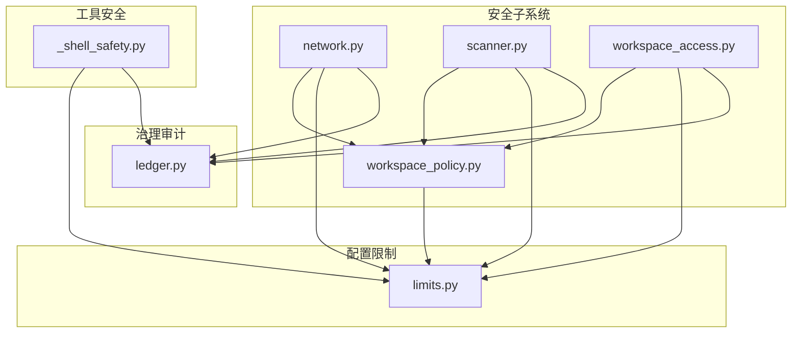
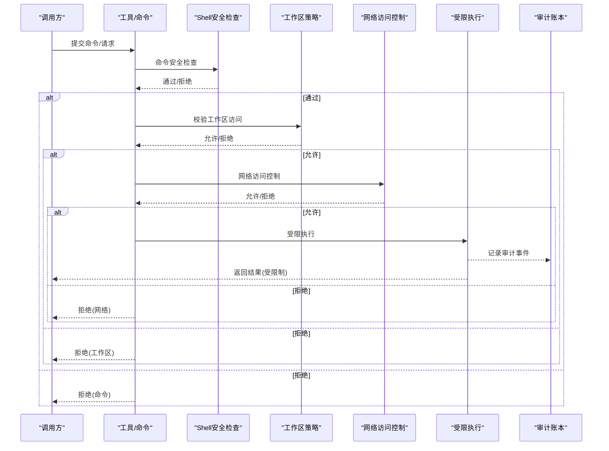
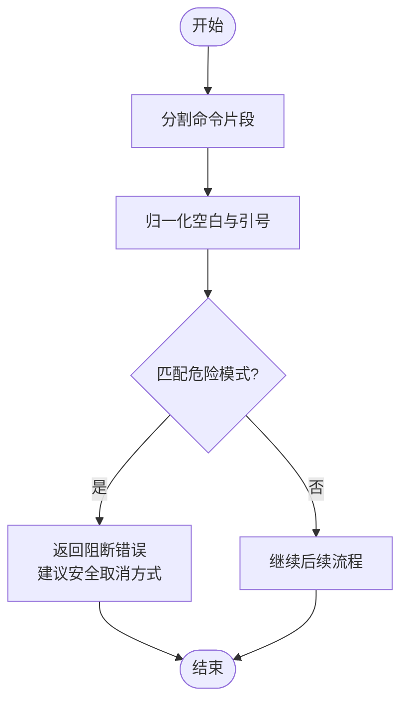
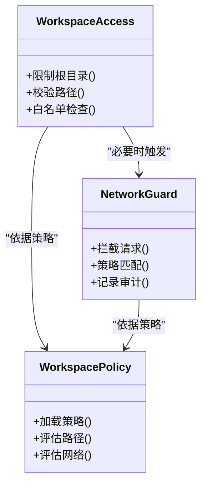
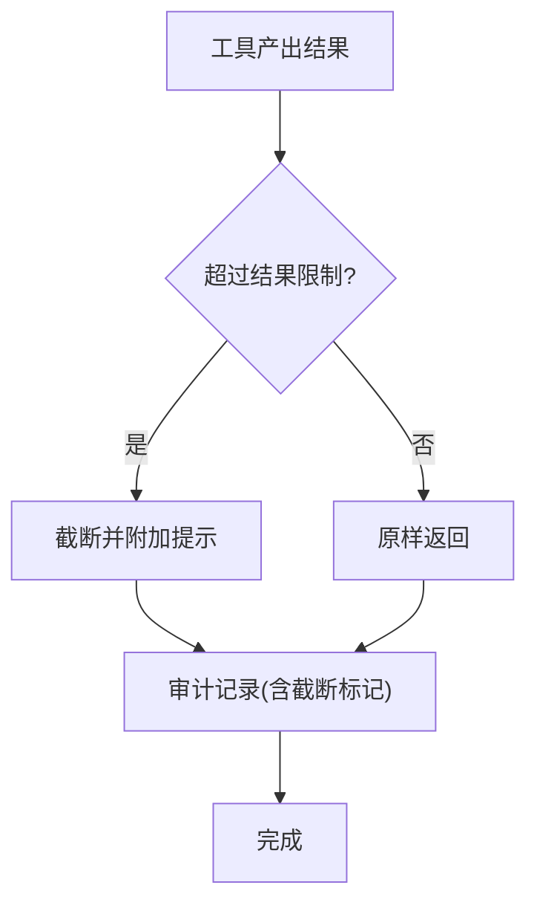
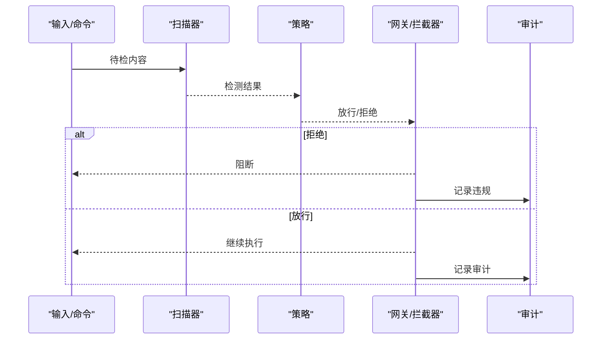
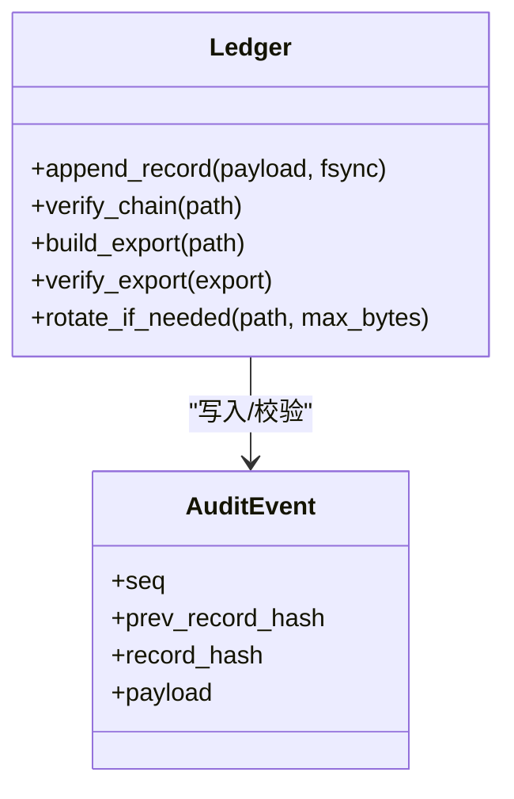
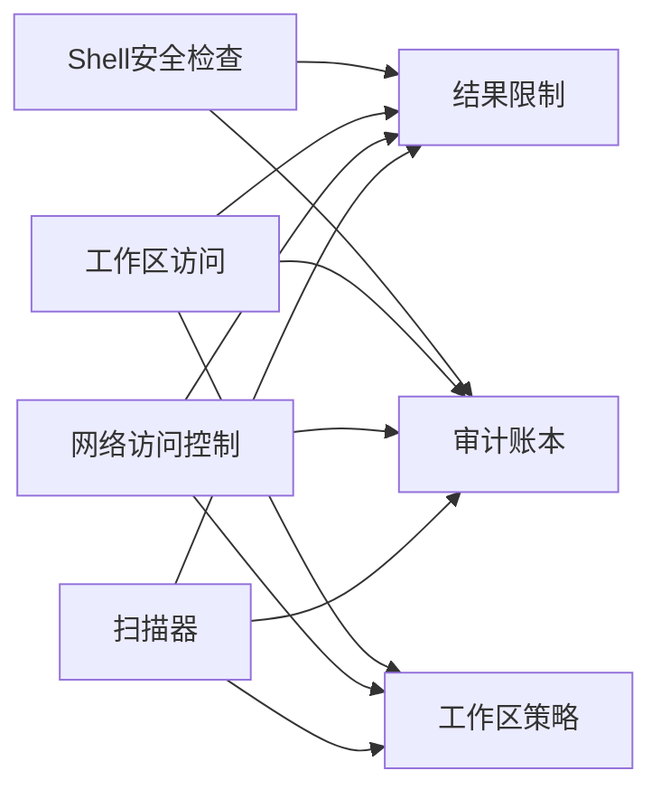

# 安全沙箱机制

<cite>
**本文引用的文件**
- [agent/src/security/__init__.py](file://agent/src/security/__init__.py)
- [agent/src/security/network.py](file://agent/src/security/network.py)
- [agent/src/security/scanner.py](file://agent/src/security/scanner.py)
- [agent/src/security/workspace_access.py](file://agent/src/security/workspace_access.py)
- [agent/src/security/workspace_policy.py](file://agent/src/security/workspace_policy.py)
- [agent/src/tools/_shell_safety.py](file://agent/src/tools/_shell_safety.py)
- [agent/src/config/limits.py](file://agent/src/config/limits.py)
- [agent/src/governance/ledger.py](file://agent/src/governance/ledger.py)
</cite>

## 目录
1. [简介](#简介)
2. [项目结构](#项目结构)
3. [核心组件](#核心组件)
4. [架构总览](#架构总览)
5. [详细组件分析](#详细组件分析)
6. [依赖关系分析](#依赖关系分析)
7. [性能考量](#性能考量)
8. [故障排查指南](#故障排查指南)
9. [结论](#结论)
10. [附录](#附录)

## 简介
本技术文档围绕“后台任务安全沙箱机制”展开，聚焦以下目标：
- 命令安全检查：危险命令识别、黑名单过滤与语法验证。
- 进程隔离策略：用户权限限制、文件系统访问控制、网络请求拦截。
- 资源限制措施：CPU时间限制、内存使用上限、磁盘空间保护。
- 恶意代码防护：代码执行监控、异常行为检测、自动终止机制。
- 安全审计：操作日志记录、访问追踪、违规报告。
- 安全配置管理：策略文件加载、动态更新与版本控制。

本仓库在工具层提供了宿主Shell命令的安全检查能力，在配置层提供结果长度限制，在治理层提供可验证的不可变审计账本；同时在安全模块中提供网络、工作区访问与策略等基础能力。下文将基于这些实现进行系统化说明。

## 项目结构
与安全沙箱相关的核心目录与文件如下：
- agent/src/security：安全子系统（网络、扫描、工作区访问与策略）。
- agent/src/tools/_shell_safety.py：宿主Shell命令安全检查（危险命令识别与阻断）。
- agent/src/config/limits.py：工具输出结果大小限制（防溢出与滥用）。
- agent/src/governance/ledger.py：哈希链式、fsync持久化的追加型JSONL审计账本（合规级不可篡改记录）。

图表来源
- [agent/src/security/network.py](file://agent/src/security/network.py)
- [agent/src/security/scanner.py](file://agent/src/security/scanner.py)
- [agent/src/security/workspace_access.py](file://agent/src/security/workspace_access.py)
- [agent/src/security/workspace_policy.py](file://agent/src/security/workspace_policy.py)
- [agent/src/tools/_shell_safety.py](file://agent/src/tools/_shell_safety.py)
- [agent/src/config/limits.py](file://agent/src/config/limits.py)
- [agent/src/governance/ledger.py](file://agent/src/governance/ledger.py)

章节来源
- [agent/src/security/__init__.py:1-3](file://agent/src/security/__init__.py#L1-L3)
- [agent/src/tools/_shell_safety.py:1-60](file://agent/src/tools/_shell_safety.py#L1-L60)
- [agent/src/config/limits.py:1-49](file://agent/src/config/limits.py#L1-L49)
- [agent/src/governance/ledger.py:1-739](file://agent/src/governance/ledger.py#L1-L739)

## 核心组件
- 命令安全检查（Shell安全）：对宿主Shell命令进行危险模式匹配，阻止可能终止当前Python进程或破坏运行环境的命令。
- 结果大小限制：对工具返回结果进行截断，避免模型上下文被过大响应撑爆。
- 工作区访问与策略：对工作区路径与策略进行统一管控，确保仅允许受控的文件系统访问。
- 网络访问控制：在网络层实施策略化访问控制，拦截不受信任的网络请求。
- 扫描器：对输入或产物进行安全扫描（例如可疑内容或恶意特征），结合策略决定是否放行。
- 审计账本：以哈希链+fsync的方式记录关键事件，支持导出与离线校验，保证审计数据的完整性与可追溯性。

章节来源
- [agent/src/tools/_shell_safety.py:1-60](file://agent/src/tools/_shell_safety.py#L1-L60)
- [agent/src/config/limits.py:1-49](file://agent/src/config/limits.py#L1-L49)
- [agent/src/security/workspace_access.py](file://agent/src/security/workspace_access.py)
- [agent/src/security/workspace_policy.py](file://agent/src/security/workspace_policy.py)
- [agent/src/security/network.py](file://agent/src/security/network.py)
- [agent/src/security/scanner.py](file://agent/src/security/scanner.py)
- [agent/src/governance/ledger.py:1-739](file://agent/src/governance/ledger.py#L1-L739)

## 架构总览
安全沙箱由“命令入口→安全检查→策略决策→受限执行→审计记录”构成闭环。命令进入后先经Shell安全检查，再依据工作区策略与网络策略进行访问控制，执行过程受资源限制约束，所有关键动作写入审计账本并支持导出校验。

图表来源
- [agent/src/tools/_shell_safety.py:1-60](file://agent/src/tools/_shell_safety.py#L1-L60)
- [agent/src/security/workspace_policy.py](file://agent/src/security/workspace_policy.py)
- [agent/src/security/network.py](file://agent/src/security/network.py)
- [agent/src/governance/ledger.py:1-739](file://agent/src/governance/ledger.py#L1-L739)

## 详细组件分析

### 命令安全检查机制
- 危险命令识别：通过正则匹配跨平台（Windows/Unix/PowerShell）的Python进程终止命令，防止误杀或恶意终止宿主进程。
- 黑名单过滤：内置针对特定危险模式的阻断规则，命中即返回明确的错误提示，指导用户使用安全的取消方式。
- 语法验证：按分号/换行/管道等分段归一化后再匹配，增强对复杂拼接命令的检测能力。

图表来源
- [agent/src/tools/_shell_safety.py:1-60](file://agent/src/tools/_shell_safety.py#L1-L60)

章节来源
- [agent/src/tools/_shell_safety.py:1-60](file://agent/src/tools/_shell_safety.py#L1-L60)

### 进程隔离策略
- 用户权限限制：通过工作区策略与工作区访问控制，限制命令与工具对系统资源的越权访问。
- 文件系统访问控制：工作区访问模块在工作区边界内开展读写，配合策略白名单/黑名单决定具体路径是否可访问。
- 网络请求拦截：网络模块在发起外部请求前进行策略校验，拦截不受信任的目标或协议。

图表来源
- [agent/src/security/workspace_policy.py](file://agent/src/security/workspace_policy.py)
- [agent/src/security/workspace_access.py](file://agent/src/security/workspace_access.py)
- [agent/src/security/network.py](file://agent/src/security/network.py)

章节来源
- [agent/src/security/workspace_access.py](file://agent/src/security/workspace_access.py)
- [agent/src/security/workspace_policy.py](file://agent/src/security/workspace_policy.py)
- [agent/src/security/network.py](file://agent/src/security/network.py)

### 资源限制措施
- CPU时间限制：通过上层调度/运行时限制工具执行时长（此处不直接实现，但可与审计与终止机制联动）。
- 内存使用上限：结合结果大小限制与扫描器阈值，防止大对象或恶意数据占用过多内存。
- 磁盘空间保护：审计账本采用滚动归档与fsync持久化，避免单文件无限增长影响磁盘可用性。

图表来源
- [agent/src/config/limits.py:1-49](file://agent/src/config/limits.py#L1-L49)
- [agent/src/governance/ledger.py:1-739](file://agent/src/governance/ledger.py#L1-L739)

章节来源
- [agent/src/config/limits.py:1-49](file://agent/src/config/limits.py#L1-L49)
- [agent/src/governance/ledger.py:1-739](file://agent/src/governance/ledger.py#L1-L739)

### 恶意代码防护
- 代码执行监控：Shell安全检查在命令入口处拦截高风险操作，减少恶意执行面。
- 异常行为检测：扫描器可对输入/输出进行特征检测，结合策略决定是否放行。
- 自动终止机制：当检测到危险命令或违反策略时，立即阻断并记录审计事件，必要时触发上层终止逻辑。

图表来源
- [agent/src/security/scanner.py](file://agent/src/security/scanner.py)
- [agent/src/security/workspace_policy.py](file://agent/src/security/workspace_policy.py)
- [agent/src/governance/ledger.py:1-739](file://agent/src/governance/ledger.py#L1-L739)

章节来源
- [agent/src/security/scanner.py](file://agent/src/security/scanner.py)
- [agent/src/security/workspace_policy.py](file://agent/src/security/workspace_policy.py)
- [agent/src/governance/ledger.py:1-739](file://agent/src/governance/ledger.py#L1-L739)

### 安全审计功能
- 操作日志记录：审计账本以追加型JSONL格式记录每条事件，包含序列号与前序哈希，形成哈希链。
- 访问追踪：工作区访问与网络访问在策略决策后记录审计事件，便于事后溯源。
- 违规报告：当发生阻断或异常时，写入审计并可通过导出与离线校验生成报告。

图表来源
- [agent/src/governance/ledger.py:1-739](file://agent/src/governance/ledger.py#L1-L739)

章节来源
- [agent/src/governance/ledger.py:1-739](file://agent/src/governance/ledger.py#L1-L739)

### 安全配置管理
- 策略文件加载：工作区策略模块负责加载策略配置，为访问控制与网络拦截提供依据。
- 动态更新：策略可在运行时重新加载（由策略模块实现），使沙箱行为随策略变更即时生效。
- 版本控制：策略与审计导出均具备版本标识与校验机制，确保配置与记录的完整性与可追溯性。

章节来源
- [agent/src/security/workspace_policy.py](file://agent/src/security/workspace_policy.py)
- [agent/src/governance/ledger.py:1-739](file://agent/src/governance/ledger.py#L1-L739)

## 依赖关系分析
- 命令安全检查依赖正则匹配与跨平台命令解析，独立于其他模块，便于复用。
- 工作区访问与策略存在耦合：访问控制严格遵循策略定义。
- 网络访问控制同样依赖策略，并在必要时与审计联动。
- 审计账本作为底层基础设施，被各安全组件用于记录关键事件，且具备自校验能力。

图表来源
- [agent/src/tools/_shell_safety.py:1-60](file://agent/src/tools/_shell_safety.py#L1-L60)
- [agent/src/config/limits.py:1-49](file://agent/src/config/limits.py#L1-L49)
- [agent/src/security/workspace_access.py](file://agent/src/security/workspace_access.py)
- [agent/src/security/workspace_policy.py](file://agent/src/security/workspace_policy.py)
- [agent/src/security/network.py](file://agent/src/security/network.py)
- [agent/src/security/scanner.py](file://agent/src/security/scanner.py)
- [agent/src/governance/ledger.py:1-739](file://agent/src/governance/ledger.py#L1-L739)

章节来源
- [agent/src/tools/_shell_safety.py:1-60](file://agent/src/tools/_shell_safety.py#L1-L60)
- [agent/src/config/limits.py:1-49](file://agent/src/config/limits.py#L1-L49)
- [agent/src/security/workspace_access.py](file://agent/src/security/workspace_access.py)
- [agent/src/security/workspace_policy.py](file://agent/src/security/workspace_policy.py)
- [agent/src/security/network.py](file://agent/src/security/network.py)
- [agent/src/security/scanner.py](file://agent/src/security/scanner.py)
- [agent/src/governance/ledger.py:1-739](file://agent/src/governance/ledger.py#L1-L739)

## 性能考量
- 命令安全检查：正则匹配与字符串归一化开销较低，适合高频调用。
- 结果限制：截断操作为O(n)，n为结果长度，通常可控。
- 审计账本：每次追加需读取并校验现有链，复杂度O(n)；适用于低频高价值事件。滚动归档控制活跃文件大小，平衡性能与安全性。
- 策略评估：策略匹配应尽可能缓存与索引优化，降低重复计算。

[本节为通用性能讨论，无需特定文件引用]

## 故障排查指南
- 命令被阻断：检查是否命中危险命令模式（如跨平台Python进程终止），调整命令或使用安全取消接口。
- 工作区访问失败：确认路径是否在策略白名单内，检查工作区根目录与相对路径解析。
- 网络请求被拦截：核对目标域名/协议是否在策略允许列表，检查代理与证书配置。
- 审计链断裂：使用导出与离线校验定位首个断点，检查是否存在人为篡改或存储损坏。

章节来源
- [agent/src/tools/_shell_safety.py:1-60](file://agent/src/tools/_shell_safety.py#L1-L60)
- [agent/src/security/workspace_access.py](file://agent/src/security/workspace_access.py)
- [agent/src/security/network.py](file://agent/src/security/network.py)
- [agent/src/governance/ledger.py:1-739](file://agent/src/governance/ledger.py#L1-L739)

## 结论
本项目的安全沙箱机制通过“命令入口检查—策略驱动访问控制—资源限制—审计可验”的多层防护，有效降低了后台任务在执行过程中的安全风险。命令安全检查快速阻断高危操作，工作区与网络策略精细化控制资源访问，审计账本提供不可篡改的合规记录。建议在部署中结合运行时调度实现CPU/内存/磁盘的硬限制，并完善策略的动态更新与版本回滚机制，以提升整体安全性与可运维性。

[本节为总结性内容，无需特定文件引用]

## 附录
- 术语
  - 哈希链：每条记录包含前序记录的哈希，形成不可篡改的链条。
  - fsync：强制将缓冲区数据落盘，提升崩溃恢复能力。
  - 滚动归档：当文件达到阈值时封存旧段，保持活跃文件体积可控。
- 最佳实践
  - 最小权限原则：仅授予必要的文件系统与网络访问。
  - 默认拒绝：未明确允许的请求一律拒绝。
  - 审计优先：关键操作必须记录并可追溯。
  - 定期校验：对审计链与策略版本进行周期性校验与备份。

[本节为概念性补充，无需特定文件引用]