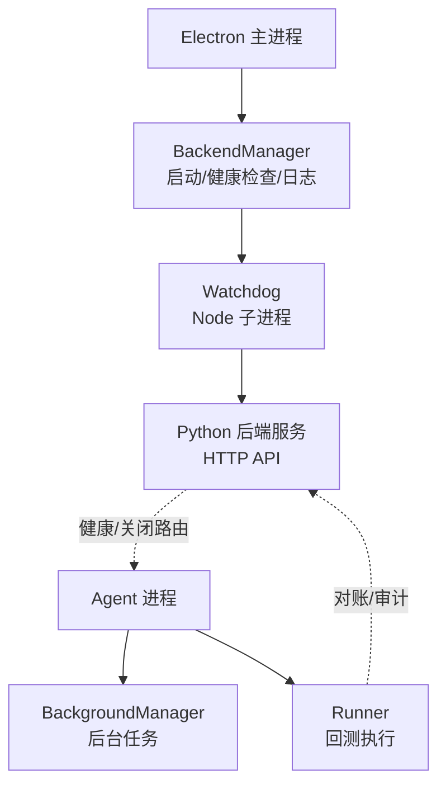
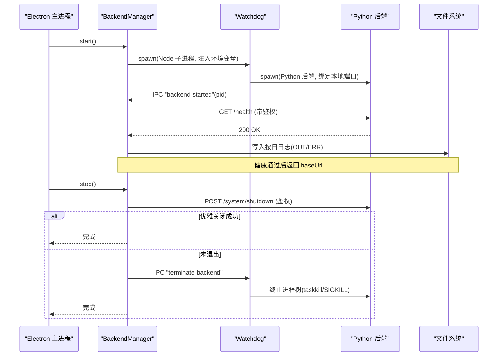
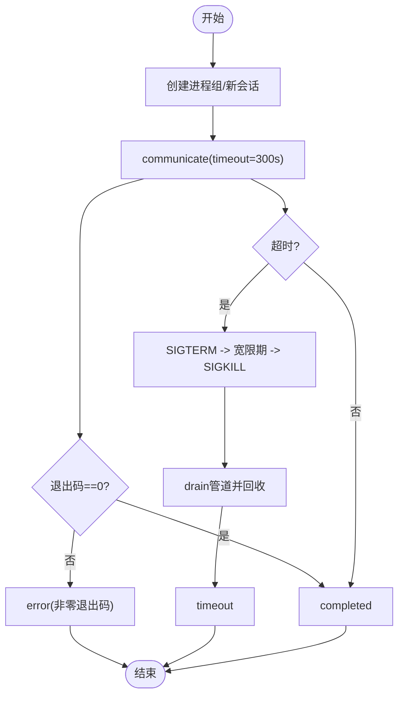
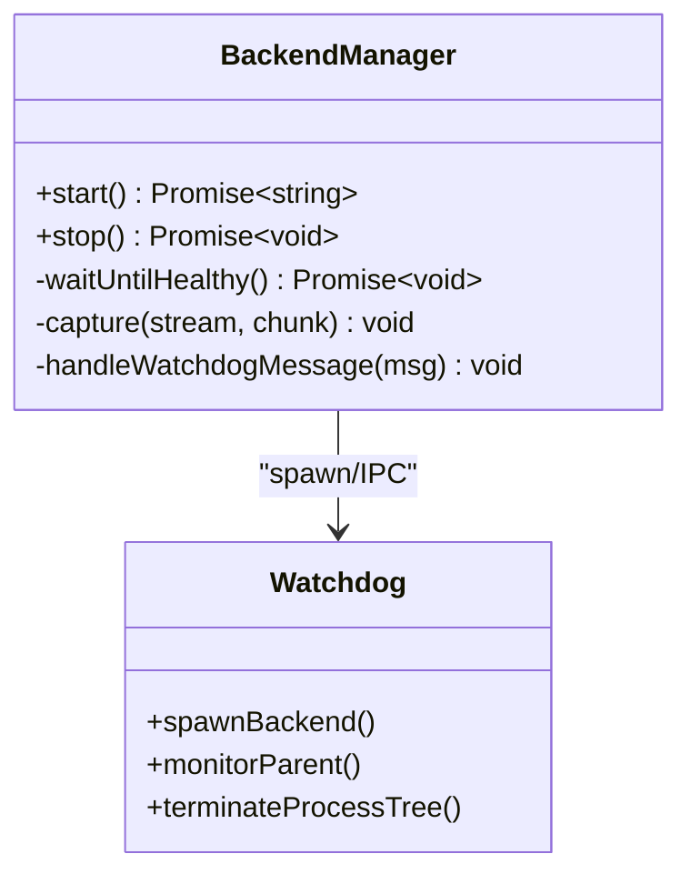
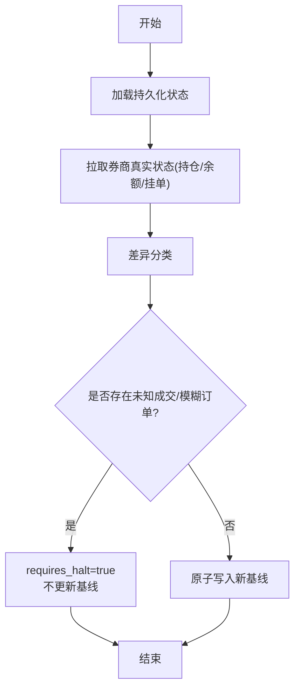
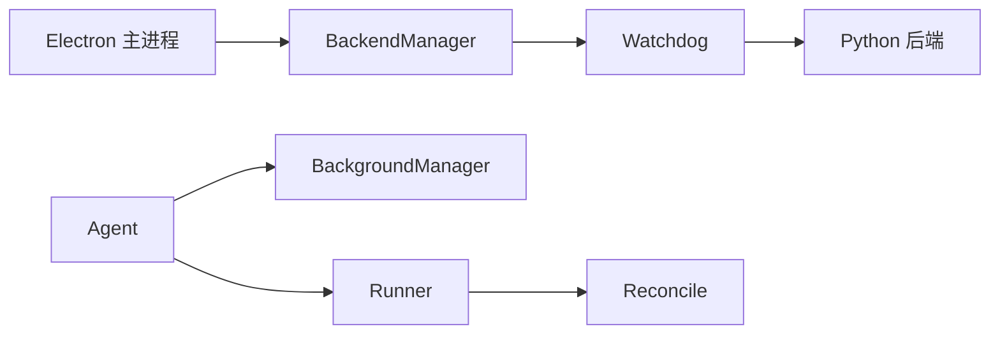

# 进程生命周期管理

<cite>
**本文引用的文件**
- [backend-manager.ts](file://desktop/electron/src/backend-manager.ts)
- [backend-watchdog.ts](file://desktop/electron/src/backend-watchdog.ts)
- [background_tools.py](file://agent/src/tools/background_tools.py)
- [runner.py](file://agent/src/core/runner.py)
- [reconcile.py](file://agent/src/live/runtime/reconcile.py)
- [system_routes.py](file://agent/src/api/system_routes.py)
- [smoke-parent-death.mjs](file://desktop/electron/scripts/smoke-parent-death.mjs)
</cite>

## 目录
1. [简介](#简介)
2. [项目结构](#项目结构)
3. [核心组件](#核心组件)
4. [架构总览](#架构总览)
5. [详细组件分析](#详细组件分析)
6. [依赖关系分析](#依赖关系分析)
7. [性能考量](#性能考量)
8. [故障排查指南](#故障排查指南)
9. [结论](#结论)
10. [附录](#附录)

## 简介
本技术文档聚焦于本仓库中的“进程生命周期管理”，覆盖以下关键主题：
- 后台进程的启动与管理机制（跨平台进程创建、进程组设置、资源继承）
- 进程终止策略（优雅关闭、强制终止、僵尸进程清理）
- 进程间通信（标准输出/错误流捕获、数据缓冲与字符编码处理）
- 进程安全机制（命令白名单检查、权限控制、沙箱隔离）
- 进程监控工具（运行时间统计、资源限制与日志采集）
- 故障恢复机制（异常处理、日志记录、状态同步与对账）

该体系由桌面端 Electron 外壳、守护进程（watchdog）、Python 后端服务，以及 Agent 侧的后台任务执行器与回测 Runner 共同构成。

## 项目结构
从进程生命周期角度，主要涉及以下模块：
- 桌面端 Electron：负责发现并启动 Python 后端、维护守护进程、健康检查、日志落盘与退出流程。
- 守护进程（Watchdog）：独立 Node 子进程，负责拉起后端、监控父进程存活、统一终止进程树。
- Agent 后台任务：在 Python 进程中以进程组方式执行用户命令，提供超时、取消、输出裁剪与通知队列。
- 回测 Runner：为生成的策略代码提供受限环境（环境变量白名单、临时 HOME、可选 UID 降级、POSIX rlimit）。
- 运行时对账：崩溃后基于持久化状态与券商真实状态进行差异分类，避免重复下单。

**图表来源**
- [backend-manager.ts:63-145](file://desktop/electron/src/backend-manager.ts#L63-L145)
- [backend-watchdog.ts:31-68](file://desktop/electron/src/backend-watchdog.ts#L31-L68)
- [background_tools.py:24-95](file://agent/src/tools/background_tools.py#L24-L95)
- [runner.py:438-627](file://agent/src/core/runner.py#L438-L627)

**章节来源**
- [backend-manager.ts:63-145](file://desktop/electron/src/backend-manager.ts#L63-L145)
- [backend-watchdog.ts:31-68](file://desktop/electron/src/backend-watchdog.ts#L31-L68)
- [background_tools.py:24-95](file://agent/src/tools/background_tools.py#L24-L95)
- [runner.py:438-627](file://agent/src/core/runner.py#L438-L627)

## 核心组件
- BackendManager（Electron）：解析可执行路径、分配本地端口、启动 Watchdog、轮询健康接口、写入按日切分的日志、优雅关闭与强制回收。
- Watchdog（Node）：校验父进程存活、注入干净的环境变量、启动 Python 后端、转发 stdout/stderr、IPC 消息、统一终止进程树。
- BackgroundManager（Python）：以进程组方式执行 shell 命令，支持超时、取消、输出裁剪、通知队列与时长统计。
- Runner（Python）：构建最小化运行环境、可选 UID 降级、POSIX rlimit 限制、临时 HOME 隔离、收集产物与日志。
- Reconcile（Python）：启动或每 tick 前将券商真实状态与持久化状态对比，分类差异并决定是否继续交易。

**章节来源**
- [backend-manager.ts:16-61](file://desktop/electron/src/backend-manager.ts#L16-L61)
- [backend-watchdog.ts:7-36](file://desktop/electron/src/backend-watchdog.ts#L7-L36)
- [background_tools.py:102-139](file://agent/src/tools/background_tools.py#L102-L139)
- [runner.py:463-569](file://agent/src/core/runner.py#L463-L569)
- [reconcile.py:275-366](file://agent/src/live/runtime/reconcile.py#L275-L366)

## 架构总览
下图展示了从 Electron 到 Python 后端的完整生命周期，包括健康检查、日志采集、优雅关闭与强制回收。

**图表来源**
- [backend-manager.ts:63-145](file://desktop/electron/src/backend-manager.ts#L63-L145)
- [backend-manager.ts:148-187](file://desktop/electron/src/backend-manager.ts#L148-L187)
- [backend-watchdog.ts:50-68](file://desktop/electron/src/backend-watchdog.ts#L50-L68)
- [backend-watchdog.ts:88-117](file://desktop/electron/src/backend-watchdog.ts#L88-L117)
- [system_routes.py:229-266](file://agent/src/api/system_routes.py#L229-L266)

## 详细组件分析

### 后台任务执行器（BackgroundManager）
- 进程创建与进程组
  - 使用 shell 模式启动命令，Windows 启用新进程组，POSIX 使用新会话，确保可按组终止。
  - 通过进程组信号与 taskkill /T/F 实现跨平台进程树终止。
- 超时与优雅终止
  - 默认超时 300 秒；超时先发送 SIGTERM，等待短暂宽限期，再 SIGKILL，最后 drain 管道并回收根进程，避免僵尸进程。
- 输出与缓冲
  - 合并 stdout/stderr，UTF-8 解码，errors=replace，最大输出长度限制，防止内存膨胀。
- 取消与通知
  - 支持 cancel_background 精确取消指定任务；内部维护通知队列，供上层消费。
- 运行时间统计
  - 记录 started_at，计算 elapsed_seconds，并在 check 中返回剩余超时时间。

**图表来源**
- [background_tools.py:24-39](file://agent/src/tools/background_tools.py#L24-L39)
- [background_tools.py:73-95](file://agent/src/tools/background_tools.py#L73-L95)
- [background_tools.py:158-175](file://agent/src/tools/background_tools.py#L158-L175)

**章节来源**
- [background_tools.py:24-95](file://agent/src/tools/background_tools.py#L24-L95)
- [background_tools.py:102-139](file://agent/src/tools/background_tools.py#L102-L139)
- [background_tools.py:141-204](file://agent/src/tools/background_tools.py#L141-L204)
- [background_tools.py:206-311](file://agent/src/tools/background_tools.py#L206-L311)

### 桌面端后端管理器（BackendManager）
- 可执行发现与环境准备
  - 优先使用配置覆盖，其次打包路径、源码工程、PATH 查找；注入 API_AUTH_KEY、PYTHONUNBUFFERED、PYTHONUTF8 等。
- 守护进程（Watchdog）
  - 以 Node 子进程启动，stdio 仅保留 pipe，IPC 用于消息传递；stdout/stderr 追加到按日日志。
- 健康检查
  - 轮询 /health（带鉴权），失败则抛出包含最近日志尾部的错误信息。
- 优雅关闭
  - 先调用 /system/shutdown，等待退出；若未退出，通过 IPC 请求 Watchdog 终止后端；最终必要时强制 kill 进程树。
- 意外退出
  - Watchdog 退出时上报 code/signal，并提示“后端意外退出”。

**图表来源**
- [backend-manager.ts:63-145](file://desktop/electron/src/backend-manager.ts#L63-L145)
- [backend-manager.ts:148-187](file://desktop/electron/src/backend-manager.ts#L148-L187)
- [backend-manager.ts:237-286](file://desktop/electron/src/backend-manager.ts#L237-L286)
- [backend-watchdog.ts:31-68](file://desktop/electron/src/backend-watchdog.ts#L31-L68)
- [backend-watchdog.ts:88-117](file://desktop/electron/src/backend-watchdog.ts#L88-L117)

**章节来源**
- [backend-manager.ts:63-145](file://desktop/electron/src/backend-manager.ts#L63-L145)
- [backend-manager.ts:148-187](file://desktop/electron/src/backend-manager.ts#L148-L187)
- [backend-manager.ts:237-286](file://desktop/electron/src/backend-manager.ts#L237-L286)

### 守护进程（Watchdog）
- 父进程存活检测
  - 周期性探测父 PID，若不可用则触发终止流程。
- 环境变量净化
  - 移除可能泄露给后端的 Electron/测试相关变量，降低攻击面。
- 进程树终止
  - Windows 使用 taskkill /T /F；POSIX 使用 SIGKILL 终止进程树。
- 健康与退出
  - 后端启动成功后向父进程发送 pid；后端退出时上报 code/signal；收到 terminate-backend 指令后统一终止。

**章节来源**
- [backend-watchdog.ts:7-36](file://desktop/electron/src/backend-watchdog.ts#L7-L36)
- [backend-watchdog.ts:43-68](file://desktop/electron/src/backend-watchdog.ts#L43-L68)
- [backend-watchdog.ts:88-117](file://desktop/electron/src/backend-watchdog.ts#L88-L117)
- [backend-watchdog.ts:119-157](file://desktop/electron/src/backend-watchdog.ts#L119-L157)

### 回测 Runner（沙箱与资源限制）
- 环境变量白名单
  - 仅允许 OS/Python/代理/证书/市场数据读取类键，避免泄露 LLM、券商、实时交易等敏感信息。
- 临时 HOME 隔离
  - 创建临时 HOME，仅以符号链接暴露必要目录（缓存、data-bridge、qveris.json），阻断对 ~/.vibe-trading 其他内容的访问。
- 权限降级（POSIX）
  - 若存在 vibe-sandbox 账户且具备能力，则以该用户/组运行子进程；否则降级运行并记录警告。
- 资源限制（POSIX）
  - 通过 preexec_fn 设置 RLIMIT_AS（虚拟地址空间）与 RLIMIT_NOFILE（文件描述符），防止 DoS 与资源耗尽。
- 超时与输出
  - 子进程执行带超时；stdout/stderr 分别落盘，便于回溯。

**章节来源**
- [runner.py:34-53](file://agent/src/core/runner.py#L34-L53)
- [runner.py:55-110](file://agent/src/core/runner.py#L55-L110)
- [runner.py:113-173](file://agent/src/core/runner.py#L113-L173)
- [runner.py:259-361](file://agent/src/core/runner.py#L259-L361)
- [runner.py:522-569](file://agent/src/core/runner.py#L522-L569)
- [runner.py:487-627](file://agent/src/core/runner.py#L487-L627)

### 运行时对账与恢复（Reconcile）
- 目标
  - 启动或每个 tick 前，比较券商真实状态与持久化的“最后已知状态”，分类差异，禁止自动重试写操作。
- 差异分类
  - matched：一致
  - unknown_fill：出现未知成交（资金变动无审计）
  - orphan_order：记录的挂单在券商不存在（已撤/拒/清仓）
  - mid_order_ambiguous：提交但未确认的单，无法判断是否成交
- 决策
  - 若存在 unknown_fill 或 mid_order_ambiguous，requires_halt=true，停止交易并上报人工处理。
- 原子持久化
  - 仅在 clean reconcile 时原子替换 runtime_state.json，避免损坏基线。

**图表来源**
- [reconcile.py:275-366](file://agent/src/live/runtime/reconcile.py#L275-L366)
- [reconcile.py:369-529](file://agent/src/live/runtime/reconcile.py#L369-L529)
- [reconcile.py:537-609](file://agent/src/live/runtime/reconcile.py#L537-L609)

**章节来源**
- [reconcile.py:1-43](file://agent/src/live/runtime/reconcile.py#L1-L43)
- [reconcile.py:275-366](file://agent/src/live/runtime/reconcile.py#L275-L366)
- [reconcile.py:369-529](file://agent/src/live/runtime/reconcile.py#L369-L529)
- [reconcile.py:537-609](file://agent/src/live/runtime/reconcile.py#L537-L609)

### 进程间通信与日志
- Electron → Watchdog：IPC 消息（如 terminate-backend），用于可靠终止。
- Watchdog → Electron：IPC 消息（backend-started/error/exited/watchdog-terminating），用于状态同步。
- 标准输出/错误流：
  - Electron 捕获 Watchdog 的 OUT/ERR 行，写入按日日志文件，并保留最近 N 行用于错误上下文。
  - Watchdog 将后端 stdout/stderr 透传到自身 stdout/stderr。
- 编码：
  - Electron 使用 UTF-8 解码；Python 子进程显式设置 PYTHONUTF8/PYTHONIOENCODING，errors 策略保证健壮性。

**章节来源**
- [backend-manager.ts:114-145](file://desktop/electron/src/backend-manager.ts#L114-L145)
- [backend-manager.ts:237-286](file://desktop/electron/src/backend-manager.ts#L237-L286)
- [backend-manager.ts:288-304](file://desktop/electron/src/backend-manager.ts#L288-L304)
- [backend-watchdog.ts:31-41](file://desktop/electron/src/backend-watchdog.ts#L31-L41)
- [backend-watchdog.ts:50-68](file://desktop/electron/src/backend-watchdog.ts#L50-L68)
- [runner.py:522-569](file://agent/src/core/runner.py#L522-L569)

### 进程安全机制
- 命令白名单/安全检查
  - BackgroundManager 在执行前调用 broad_python_kill_error 检查危险命令（如直接杀进程），拒绝执行并返回错误。
- 权限控制
  - Runner 在 POSIX 下尝试以 vibe-sandbox 用户/组运行子进程；失败则降级并记录警告。
- 沙箱隔离
  - 临时 HOME 仅暴露最小必要路径；环境变量白名单过滤敏感键；POSIX rlimit 限制虚拟内存与文件描述符。
- 进程树终止
  - 跨平台统一终止策略，避免残留子进程形成僵尸或孤儿。

**章节来源**
- [background_tools.py:110-139](file://agent/src/tools/background_tools.py#L110-L139)
- [runner.py:55-110](file://agent/src/core/runner.py#L55-L110)
- [runner.py:113-173](file://agent/src/core/runner.py#L113-L173)
- [runner.py:487-627](file://agent/src/core/runner.py#L487-L627)

### 进程监控与统计
- 运行时间统计
  - BackgroundManager 记录 started_at，计算 duration_seconds；check 返回 elapsed_seconds、timeout_seconds、timeout_remaining_seconds。
- 资源限制
  - Runner 在 POSIX 下通过 rlimit 限制虚拟地址空间与文件描述符，防止滥用。
- 健康探针
  - 后端暴露 /live 与 /ready 接口，供编排系统与健康检查使用。

**章节来源**
- [background_tools.py:258-305](file://agent/src/tools/background_tools.py#L258-L305)
- [runner.py:85-110](file://agent/src/core/runner.py#L85-L110)
- [system_routes.py:229-266](file://agent/src/api/system_routes.py#L229-L266)

## 依赖关系分析
- Electron 主进程依赖 BackendManager 来管理后端生命周期。
- BackendManager 依赖 Watchdog 作为隔离层，屏蔽后端细节并提供统一终止入口。
- Watchdog 依赖操作系统工具（taskkill）或信号机制终止进程树。
- Agent 的 BackgroundManager 与 Runner 相互独立：前者面向任意 shell 命令，后者面向生成的策略脚本。
- Reconcile 依赖券商只读接口与持久化状态文件，不直接修改券商状态。

**图表来源**
- [backend-manager.ts:63-145](file://desktop/electron/src/backend-manager.ts#L63-L145)
- [backend-watchdog.ts:31-68](file://desktop/electron/src/backend-watchdog.ts#L31-L68)
- [background_tools.py:102-139](file://agent/src/tools/background_tools.py#L102-L139)
- [runner.py:438-627](file://agent/src/core/runner.py#L438-L627)
- [reconcile.py:275-366](file://agent/src/live/runtime/reconcile.py#L275-L366)

**章节来源**
- [backend-manager.ts:63-145](file://desktop/electron/src/backend-manager.ts#L63-L145)
- [backend-watchdog.ts:31-68](file://desktop/electron/src/backend-watchdog.ts#L31-L68)
- [background_tools.py:102-139](file://agent/src/tools/background_tools.py#L102-L139)
- [runner.py:438-627](file://agent/src/core/runner.py#L438-L627)
- [reconcile.py:275-366](file://agent/src/live/runtime/reconcile.py#L275-L366)

## 性能考量
- 输出缓冲与裁剪：后台任务合并输出并限制最大长度，避免大输出阻塞或内存增长。
- 超时与宽限期：合理设置超时与 SIGTERM→SIGKILL 的宽限期，平衡优雅退出与及时回收。
- 资源限制：POSIX 下通过 rlimit 限制虚拟内存和文件描述符，防止恶意或异常进程耗尽资源。
- 日志 I/O：按日切分日志，保留最近 N 行用于错误上下文，减少磁盘压力与检索成本。
- 健康检查间隔：短周期轮询健康接口，快速反馈后端就绪状态，缩短启动延迟。

[本节为通用指导，无需特定文件引用]

## 故障排查指南
- 后端启动失败
  - 检查 Electron 日志中的 Watchdog 错误与最近输出尾部；确认 /health 可达性与鉴权头。
  - 参考：[backend-manager.ts:261-286](file://desktop/electron/src/backend-manager.ts#L261-L286)
- 后端意外退出
  - 关注 Watchdog 退出的 code/signal；必要时查看后端进程树是否被正确终止。
  - 参考：[backend-manager.ts:131-140](file://desktop/electron/src/backend-manager.ts#L131-L140)
- 后台任务超时或卡死
  - 使用 check_background 查看剩余超时；必要时 cancel_background 精确取消；观察是否产生孤儿进程。
  - 参考：[background_tools.py:158-175](file://agent/src/tools/background_tools.py#L158-L175)
- 权限或沙箱问题
  - 若 UID 降级失败，Runner 会降级运行并记录警告；确认环境变量白名单与临时 HOME 是否正确。
  - 参考：[runner.py:571-592](file://agent/src/core/runner.py#L571-L592)
- 崩溃恢复与对账
  - 若存在 unknown_fill 或 mid_order_ambiguous，系统会要求停机并上报；检查 runtime_state.json 与券商状态。
  - 参考：[reconcile.py:275-366](file://agent/src/live/runtime/reconcile.py#L275-L366)
- 父进程死亡场景验证
  - 使用 smoke 脚本验证 Electron 主进程退出后，后端进程与监听端口均被关闭。
  - 参考：[smoke-parent-death.mjs:33-68](file://desktop/electron/scripts/smoke-parent-death.mjs#L33-L68)

**章节来源**
- [backend-manager.ts:131-140](file://desktop/electron/src/backend-manager.ts#L131-L140)
- [backend-manager.ts:261-286](file://desktop/electron/src/backend-manager.ts#L261-L286)
- [background_tools.py:158-175](file://agent/src/tools/background_tools.py#L158-L175)
- [runner.py:571-592](file://agent/src/core/runner.py#L571-L592)
- [reconcile.py:275-366](file://agent/src/live/runtime/reconcile.py#L275-L366)
- [smoke-parent-death.mjs:33-68](file://desktop/electron/scripts/smoke-parent-death.mjs#L33-L68)

## 结论
本仓库实现了端到端的进程生命周期管理：
- 通过 Electron 外壳与 Watchdog 解耦后端启动、健康检查与终止流程，保障跨平台一致行为。
- 后台任务以进程组为单位管理，提供超时、取消、输出裁剪与通知机制，避免僵尸进程。
- 回测 Runner 提供严格的安全边界（环境变量白名单、临时 HOME、UID 降级、rlimit），有效隔离生成代码的执行环境。
- 运行时对账确保崩溃后的状态一致性，遵循“不重试写操作”的原则，避免重复下单风险。
- 完善的日志与监控手段，结合健康探针与 smoke 测试，提升可观测性与可靠性。

[本节为总结性内容，无需特定文件引用]

## 附录
- 关键术语
  - 进程组：同一组信号的接收者集合，便于批量终止。
  - 对账：比较外部真实状态与本地持久化状态的差异并分类。
  - 原子写入：先写临时文件再替换目标文件，避免部分写入导致的损坏。
- 最佳实践
  - 始终使用进程组或进程树终止，避免残留子进程。
  - 对长耗时任务设置超时与宽限期，兼顾优雅退出与资源回收。
  - 对外部输入（命令、参数）进行白名单或安全检查，降低攻击面。
  - 对关键状态采用原子写入与幂等设计，增强鲁棒性。

[本节为补充说明，无需特定文件引用]