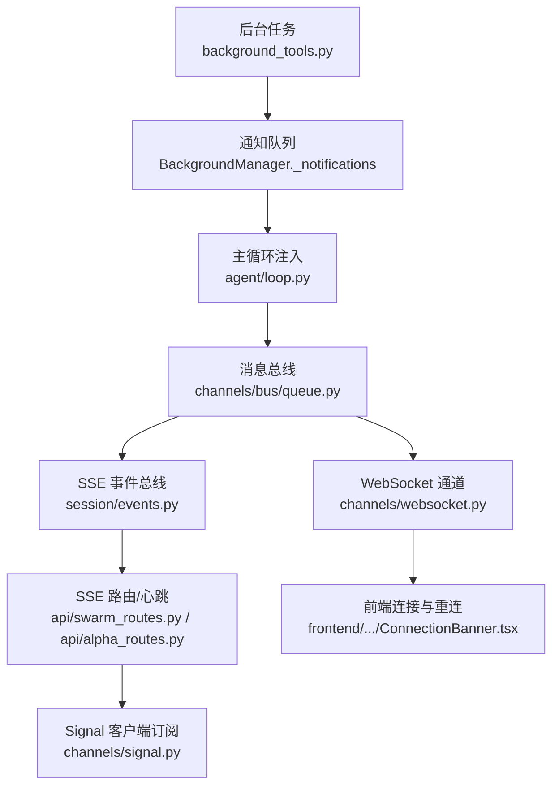
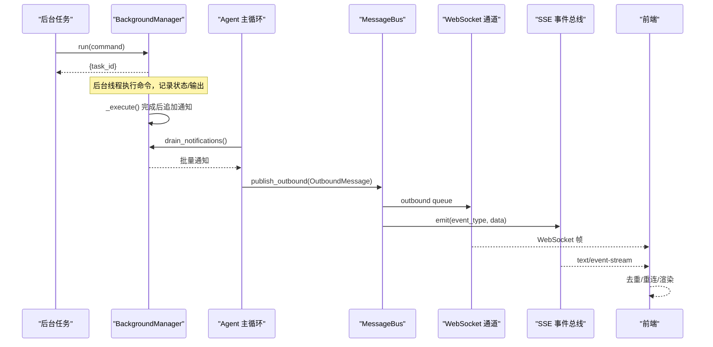
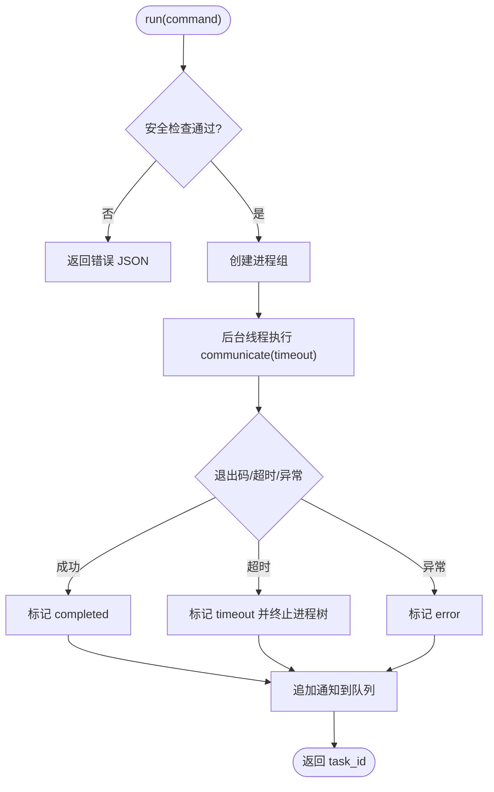
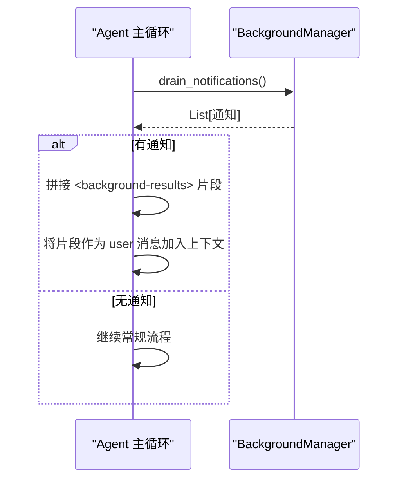
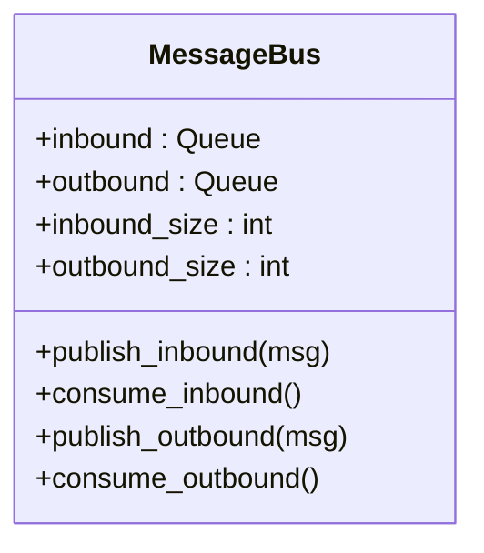
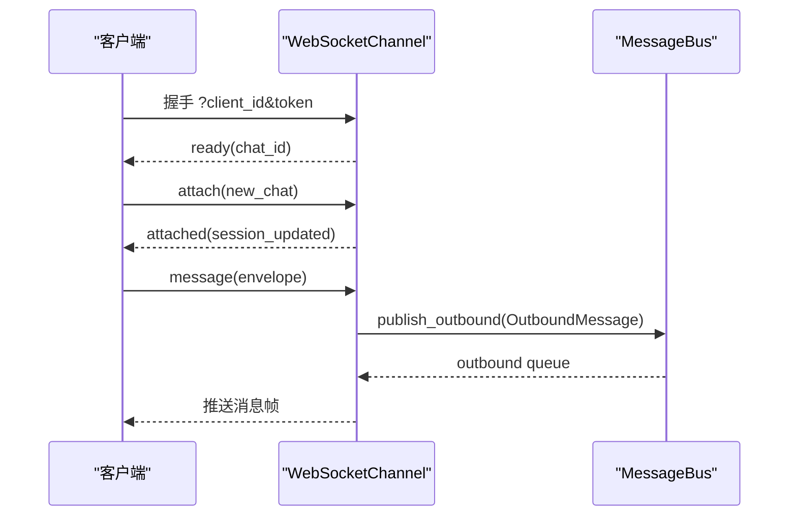
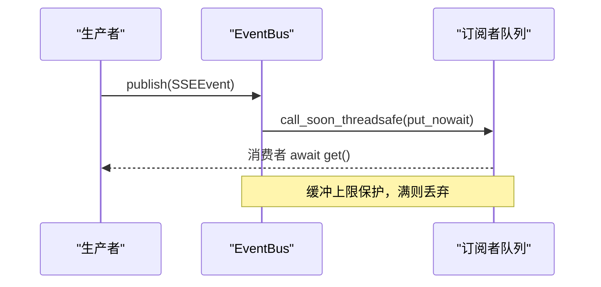
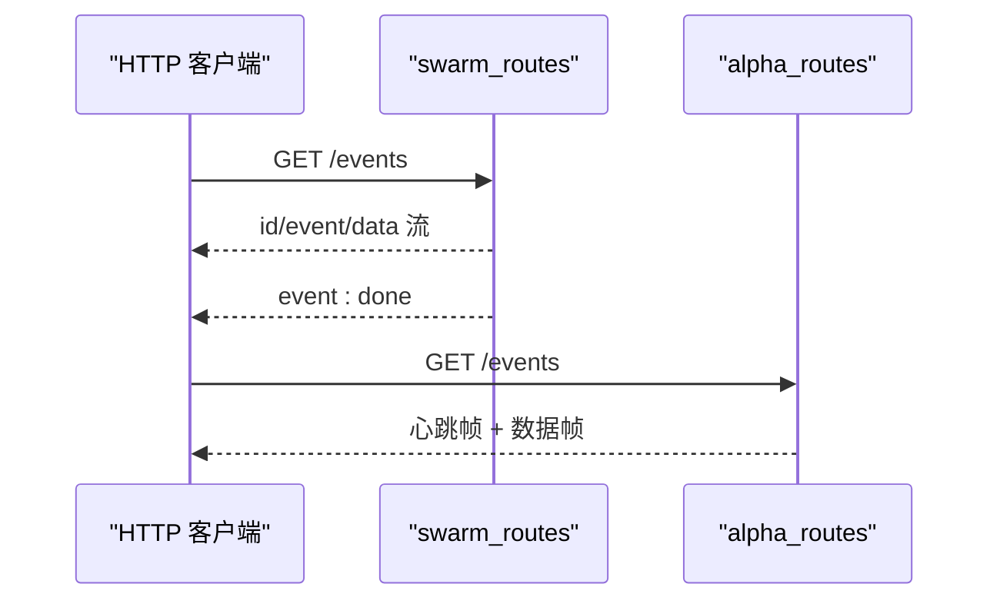
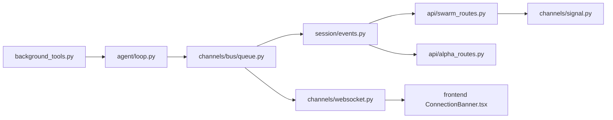

# 通知系统

<cite>
**本文引用的文件**
- [agent/src/tools/background_tools.py](file://agent/src/tools/background_tools.py)
- [agent/src/agent/loop.py](file://agent/src/agent/loop.py)
- [agent/src/channels/bus/queue.py](file://agent/src/channels/bus/queue.py)
- [agent/src/channels/websocket.py](file://agent/src/channels/websocket.py)
- [agent/src/session/events.py](file://agent/src/session/events.py)
- [agent/src/api/swarm_routes.py](file://agent/src/api/swarm_routes.py)
- [agent/src/api/alpha_routes.py](file://agent/src/api/alpha_routes.py)
- [agent/src/channels/signal.py](file://agent/src/channels/signal.py)
- [frontend/src/components/layout/ConnectionBanner.tsx](file://frontend/src/components/layout/ConnectionBanner.tsx)
- [frontend/src/hooks/__tests__/useSSE.test.ts](file://frontend/src/hooks/__tests__/useSSE.test.ts)
- [agent/src/memory/persistent.py](file://agent/src/memory/persistent.py)
- [agent/tests/memory/test_memory_dedup.py](file://agent/tests/memory/test_memory_dedup.py)
</cite>

## 目录
1. [简介](#简介)
2. [项目结构](#项目结构)
3. [核心组件](#核心组件)
4. [架构总览](#架构总览)
5. [详细组件分析](#详细组件分析)
6. [依赖关系分析](#依赖关系分析)
7. [性能考量](#性能考量)
8. [故障排查指南](#故障排查指南)
9. [结论](#结论)
10. [附录](#附录)

## 简介
本技术文档围绕“后台任务通知系统”展开，聚焦以下目标：
- 设计原理：消息格式、优先级与批量处理机制。
- 生成时机：任务开始、进度更新、完成状态、错误事件等触发点。
- 消费机制：轮询获取、实时推送（WebSocket/SSE）、断线重连。
- 安全与可靠：消息持久化、去重机制、丢失检测。
- 过滤与订阅：按任务ID筛选、状态过滤、自定义回调。
- 性能优化：批量处理、缓存策略、内存管理。

该系统的核心由“后台任务执行器 + 通知队列 + 通道总线 + 实时推送（WebSocket/SSE） + 前端连接与重连”构成，覆盖从任务启动到结果回推的全链路。

## 项目结构
与通知系统直接相关的模块分布在 agent 后端与前端：
- 后台任务与通知队列：agent/src/tools/background_tools.py
- 通知注入主循环：agent/src/agent/loop.py
- 异步消息总线：agent/src/channels/bus/queue.py
- WebSocket 通道与鉴权、订阅分发：agent/src/channels/websocket.py
- SSE 事件总线与缓冲/重放：agent/src/session/events.py
- SSE 流式路由与心跳：agent/src/api/swarm_routes.py, agent/src/api/alpha_routes.py
- Signal 客户端 SSE 订阅：agent/src/channels/signal.py
- 前端连接状态与重连提示：frontend/src/components/layout/ConnectionBanner.tsx
- 前端 SSE 去重测试用例：frontend/src/hooks/__tests__/useSSE.test.ts
- 记忆/去重能力参考：agent/src/memory/persistent.py, agent/tests/memory/test_memory_dedup.py

**图表来源**
- [agent/src/tools/background_tools.py:102-311](file://agent/src/tools/background_tools.py#L102-L311)
- [agent/src/agent/loop.py:1227-1232](file://agent/src/agent/loop.py#L1227-L1232)
- [agent/src/channels/bus/queue.py:8-44](file://agent/src/channels/bus/queue.py#L8-L44)
- [agent/src/channels/websocket.py:264-589](file://agent/src/channels/websocket.py#L264-L589)
- [agent/src/session/events.py:57-265](file://agent/src/session/events.py#L57-L265)
- [agent/src/api/swarm_routes.py:194-211](file://agent/src/api/swarm_routes.py#L194-L211)
- [agent/src/api/alpha_routes.py:722-736](file://agent/src/api/alpha_routes.py#L722-L736)
- [agent/src/channels/signal.py:596-616](file://agent/src/channels/signal.py#L596-L616)
- [frontend/src/components/layout/ConnectionBanner.tsx:1-43](file://frontend/src/components/layout/ConnectionBanner.tsx#L1-L43)

**章节来源**
- [agent/src/tools/background_tools.py:102-311](file://agent/src/tools/background_tools.py#L102-L311)
- [agent/src/agent/loop.py:1227-1232](file://agent/src/agent/loop.py#L1227-L1232)
- [agent/src/channels/bus/queue.py:8-44](file://agent/src/channels/bus/queue.py#L8-L44)
- [agent/src/channels/websocket.py:264-589](file://agent/src/channels/websocket.py#L264-L589)
- [agent/src/session/events.py:57-265](file://agent/src/session/events.py#L57-L265)
- [agent/src/api/swarm_routes.py:194-211](file://agent/src/api/swarm_routes.py#L194-L211)
- [agent/src/api/alpha_routes.py:722-736](file://agent/src/api/alpha_routes.py#L722-L736)
- [agent/src/channels/signal.py:596-616](file://agent/src/channels/signal.py#L596-L616)
- [frontend/src/components/layout/ConnectionBanner.tsx:1-43](file://frontend/src/components/layout/ConnectionBanner.tsx#L1-L43)

## 核心组件
- 后台任务管理器 BackgroundManager
  - 职责：启动子进程组、超时控制、取消、状态查询、通知入队。
  - 关键特性：线程安全锁、输出截断、跨平台终止策略。
- 通知队列与注入
  - 通知以列表形式在 BackgroundManager 内部维护，通过 drain 批量取出并注入到主循环上下文。
- 消息总线 MessageBus
  - 职责：解耦通道与 Agent 核心，提供 inbound/outbound 异步队列。
- WebSocket 通道
  - 职责：鉴权、会话/聊天 ID 绑定、订阅管理、媒体上传校验、出站消息 fan-out。
- SSE 事件总线 EventBus
  - 职责：事件缓冲、订阅者队列、重放恢复、心跳保活。
- SSE 路由与心跳
  - 职责：事件流输出、心跳帧、结束事件。
- Signal 客户端
  - 职责：SSE 订阅、行缓冲解析、错误处理。
- 前端连接与重连
  - 职责：显示重连状态、达到阈值后提示刷新。

**章节来源**
- [agent/src/tools/background_tools.py:102-311](file://agent/src/tools/background_tools.py#L102-L311)
- [agent/src/channels/bus/queue.py:8-44](file://agent/src/channels/bus/queue.py#L8-L44)
- [agent/src/channels/websocket.py:264-589](file://agent/src/channels/websocket.py#L264-L589)
- [agent/src/session/events.py:57-265](file://agent/src/session/events.py#L57-L265)
- [agent/src/api/swarm_routes.py:194-211](file://agent/src/api/swarm_routes.py#L194-L211)
- [agent/src/api/alpha_routes.py:722-736](file://agent/src/api/alpha_routes.py#L722-L736)
- [agent/src/channels/signal.py:596-616](file://agent/src/channels/signal.py#L596-L616)
- [frontend/src/components/layout/ConnectionBanner.tsx:1-43](file://frontend/src/components/layout/ConnectionBanner.tsx#L1-L43)

## 架构总览
下图展示了从后台任务到前端展示的关键数据流与控制流。

**图表来源**
- [agent/src/tools/background_tools.py:141-204](file://agent/src/tools/background_tools.py#L141-L204)
- [agent/src/agent/loop.py:1227-1232](file://agent/src/agent/loop.py#L1227-L1232)
- [agent/src/channels/bus/queue.py:19-33](file://agent/src/channels/bus/queue.py#L19-L33)
- [agent/src/channels/websocket.py:530-589](file://agent/src/channels/websocket.py#L530-L589)
- [agent/src/session/events.py:87-149](file://agent/src/session/events.py#L87-L149)
- [agent/src/api/swarm_routes.py:194-211](file://agent/src/api/swarm_routes.py#L194-L211)

## 详细组件分析

### 后台任务与通知队列（BackgroundManager）
- 消息格式
  - 通知条目包含：task_id、status、command（前缀截取）、result（前缀截取）、exit_code。
  - 状态包括：running、completed、error、timeout、cancelled、cancelling。
- 优先级排序
  - 当前实现为 FIFO 列表；如需优先级，可在入队时插入有序位置或改用优先队列。
- 批量处理
  - 通过 drain_notifications 一次性取走全部待发送通知，避免逐条开销。
- 生成时机
  - 任务完成/超时/取消后统一写入通知；运行中不产生中间进度。
- 可靠性
  - 进程组终止策略（POSIX SIGTERM/SIGKILL，Windows taskkill），输出截断防 OOM。
- 安全性
  - 命令安全检查（拒绝危险 Python kill 指令）。

**图表来源**
- [agent/src/tools/background_tools.py:110-204](file://agent/src/tools/background_tools.py#L110-L204)
- [agent/src/tools/background_tools.py:24-99](file://agent/src/tools/background_tools.py#L24-L99)

**章节来源**
- [agent/src/tools/background_tools.py:102-311](file://agent/src/tools/background_tools.py#L102-L311)

### 通知注入主循环（Agent Loop）
- 每轮迭代主动拉取后台通知，拼接成结构化文本注入用户消息上下文，使模型能基于后台结果继续推理。
- 优点：简单可靠；缺点：非实时，取决于主循环调度频率。

**图表来源**
- [agent/src/agent/loop.py:1227-1232](file://agent/src/agent/loop.py#L1227-L1232)

**章节来源**
- [agent/src/agent/loop.py:1227-1232](file://agent/src/agent/loop.py#L1227-L1232)

### 消息总线（MessageBus）
- 提供 inbound/outbound 两个 asyncio.Queue，用于解耦通道与 Agent 核心。
- 支持查询队列长度，便于监控背压。

**图表来源**
- [agent/src/channels/bus/queue.py:8-44](file://agent/src/channels/bus/queue.py#L8-L44)

**章节来源**
- [agent/src/channels/bus/queue.py:8-44](file://agent/src/channels/bus/queue.py#L8-L44)

### WebSocket 通道（认证、订阅、分发）
- 认证：支持静态 token 或短时效 token 签发路径；可强制握手必须携带 token。
- 订阅：chat_id -> connections 映射；连接断开自动清理。
- 出站分发：通过 bus.outbound 推送消息至所有订阅的客户端。
- 媒体：图片/视频大小与 MIME 白名单校验，失败即丢弃并返回错误事件。

**图表来源**
- [agent/src/channels/websocket.py:435-453](file://agent/src/channels/websocket.py#L435-L453)
- [agent/src/channels/websocket.py:530-589](file://agent/src/channels/websocket.py#L530-L589)
- [agent/src/channels/websocket.py:671-810](file://agent/src/channels/websocket.py#L671-L810)

**章节来源**
- [agent/src/channels/websocket.py:53-143](file://agent/src/channels/websocket.py#L53-L143)
- [agent/src/channels/websocket.py:264-589](file://agent/src/channels/websocket.py#L264-L589)
- [agent/src/channels/websocket.py:671-810](file://agent/src/channels/websocket.py#L671-L810)

### SSE 事件总线（缓冲、重放、心跳）
- 事件缓冲：按 session 维护环形缓冲，超限丢弃最旧事件。
- 订阅：返回 AsyncIterator，支持 last_event_id 重放；空闲时发送心跳。
- 清理：session_cleared 哨兵事件通知订阅者退出。

**图表来源**
- [agent/src/session/events.py:87-149](file://agent/src/session/events.py#L87-L149)
- [agent/src/session/events.py:185-235](file://agent/src/session/events.py#L185-L235)

**章节来源**
- [agent/src/session/events.py:57-265](file://agent/src/session/events.py#L57-L265)

### SSE 路由与心跳（Swarm/Alpha）
- Swarm 事件流：读取存储事件并流式输出，结束时发送 done。
- Alpha 流：周期性心跳与轮询间隔，设置合适的响应头以避免代理缓冲。

**图表来源**
- [agent/src/api/swarm_routes.py:194-211](file://agent/src/api/swarm_routes.py#L194-L211)
- [agent/src/api/alpha_routes.py:722-736](file://agent/src/api/alpha_routes.py#L722-L736)

**章节来源**
- [agent/src/api/swarm_routes.py:194-211](file://agent/src/api/swarm_routes.py#L194-L211)
- [agent/src/api/alpha_routes.py:722-736](file://agent/src/api/alpha_routes.py#L722-L736)

### Signal 客户端 SSE 订阅
- 使用 httpx stream 订阅 /api/v1/events，逐行解析并累积多行数据。
- 对连接失败进行错误上报。

**章节来源**
- [agent/src/channels/signal.py:596-616](file://agent/src/channels/signal.py#L596-L616)

### 前端连接与重连
- ConnectionBanner：当连接处于 reconnecting 状态时显示重连提示；超过阈值后提示断开并提供刷新按钮。
- useSSE 测试：验证去重与容量溢出行为。

**章节来源**
- [frontend/src/components/layout/ConnectionBanner.tsx:1-43](file://frontend/src/components/layout/ConnectionBanner.tsx#L1-L43)
- [frontend/src/hooks/__tests__/useSSE.test.ts:221-253](file://frontend/src/hooks/__tests__/useSSE.test.ts#L221-L253)

## 依赖关系分析
- 松耦合：BackgroundManager 仅通过 drain 暴露通知；主循环负责消费；消息总线解耦通道与核心；WebSocket/SSE 各自独立实现推送。
- 外部依赖：websockets SDK、httpx、asyncio 队列。
- 潜在环：无直接循环导入；各模块通过接口/队列交互。

**图表来源**
- [agent/src/tools/background_tools.py:102-311](file://agent/src/tools/background_tools.py#L102-L311)
- [agent/src/agent/loop.py:1227-1232](file://agent/src/agent/loop.py#L1227-L1232)
- [agent/src/channels/bus/queue.py:8-44](file://agent/src/channels/bus/queue.py#L8-L44)
- [agent/src/channels/websocket.py:264-589](file://agent/src/channels/websocket.py#L264-L589)
- [agent/src/session/events.py:57-265](file://agent/src/session/events.py#L57-L265)
- [agent/src/api/swarm_routes.py:194-211](file://agent/src/api/swarm_routes.py#L194-L211)
- [agent/src/api/alpha_routes.py:722-736](file://agent/src/api/alpha_routes.py#L722-L736)
- [agent/src/channels/signal.py:596-616](file://agent/src/channels/signal.py#L596-L616)
- [frontend/src/components/layout/ConnectionBanner.tsx:1-43](file://frontend/src/components/layout/ConnectionBanner.tsx#L1-L43)

**章节来源**
- [agent/src/tools/background_tools.py:102-311](file://agent/src/tools/background_tools.py#L102-L311)
- [agent/src/channels/bus/queue.py:8-44](file://agent/src/channels/bus/queue.py#L8-L44)
- [agent/src/channels/websocket.py:264-589](file://agent/src/channels/websocket.py#L264-L589)
- [agent/src/session/events.py:57-265](file://agent/src/session/events.py#L57-L265)
- [agent/src/api/swarm_routes.py:194-211](file://agent/src/api/swarm_routes.py#L194-L211)
- [agent/src/api/alpha_routes.py:722-736](file://agent/src/api/alpha_routes.py#L722-L736)
- [agent/src/channels/signal.py:596-616](file://agent/src/channels/signal.py#L596-L616)
- [frontend/src/components/layout/ConnectionBanner.tsx:1-43](file://frontend/src/components/layout/ConnectionBanner.tsx#L1-L43)

## 性能考量
- 批量处理
  - BackgroundManager.drain_notifications 批量取出通知，减少主循环调用成本。
  - EventBus 缓冲限制 max_buffer_size，防止内存膨胀。
- 缓存策略
  - EventBus 按 session 维护最近事件缓冲，支持 last_event_id 重放，降低重复传输。
  - WebSocket 侧对媒体文件进行本地保存与大小限制，避免大消息阻塞。
- 内存管理
  - 输出截断（最大字符数）防止超大输出占用内存。
  - 队列满时丢弃事件并记录日志，避免阻塞生产者。
- 心跳与保活
  - SSE 定期发送心跳帧，保持长连接活跃，便于快速检测断线。

[本节为通用性能指导，无需特定文件引用]

## 故障排查指南
- 任务未收到通知
  - 检查 BackgroundManager 是否被正确实例化与调用 drain。
  - 确认主循环是否在每轮迭代中拉取通知。
- 通知延迟
  - 评估主循环频率与消息总线背压；必要时增加并发或调整队列大小。
- 连接频繁断开
  - 检查前端 ConnectionBanner 的重连逻辑与阈值；确认服务端心跳正常。
- 事件丢失
  - 使用 last_event_id 重放；确认 EventBus 缓冲未溢出；检查网络层丢包。
- 媒体上传失败
  - 核对 MIME 白名单与大小限制；查看错误事件 detail/reason。

**章节来源**
- [agent/src/tools/background_tools.py:110-204](file://agent/src/tools/background_tools.py#L110-L204)
- [agent/src/agent/loop.py:1227-1232](file://agent/src/agent/loop.py#L1227-L1232)
- [agent/src/channels/websocket.py:593-764](file://agent/src/channels/websocket.py#L593-L764)
- [agent/src/session/events.py:87-149](file://agent/src/session/events.py#L87-L149)
- [frontend/src/components/layout/ConnectionBanner.tsx:1-43](file://frontend/src/components/layout/ConnectionBanner.tsx#L1-L43)

## 结论
该系统通过“后台任务 + 通知队列 + 消息总线 + WebSocket/SSE”的组合，实现了可靠的后台任务通知闭环。其优势在于：
- 明确的分层与解耦，便于扩展新通道与新事件类型。
- 具备基本的可靠性保障：缓冲、重放、心跳、超时与终止策略。
- 前端具备重连与去重能力，提升用户体验。

建议后续增强：
- 引入优先级队列与更细粒度的进度事件。
- 完善消息持久化与审计（如将通知落盘）。
- 扩展过滤与订阅模型（按任务 ID、状态、标签）。

[本节为总结性内容，无需特定文件引用]

## 附录

### 通知消息格式（摘要）
- 字段
  - task_id：字符串，唯一标识。
  - status：枚举值，如 running/completed/error/timeout/cancelled。
  - command：命令前缀（用于展示）。
  - result：结果摘要（截断）。
  - exit_code：整数或空。
- 示例路径
  - [agent/src/tools/background_tools.py:200-204](file://agent/src/tools/background_tools.py#L200-L204)

**章节来源**
- [agent/src/tools/background_tools.py:200-204](file://agent/src/tools/background_tools.py#L200-L204)

### 去重机制（参考）
- 后端记忆去重：PersistentMemory 提供 is_duplicate 判断，窗口期内相同内容视为重复。
- 前端 SSE 去重：基于事件 ID 去重，容量溢出时驱逐最旧事件。

**章节来源**
- [agent/tests/memory/test_memory_dedup.py:71-128](file://agent/tests/memory/test_memory_dedup.py#L71-L128)
- [frontend/src/hooks/__tests__/useSSE.test.ts:221-253](file://frontend/src/hooks/__tests__/useSSE.test.ts#L221-L253)