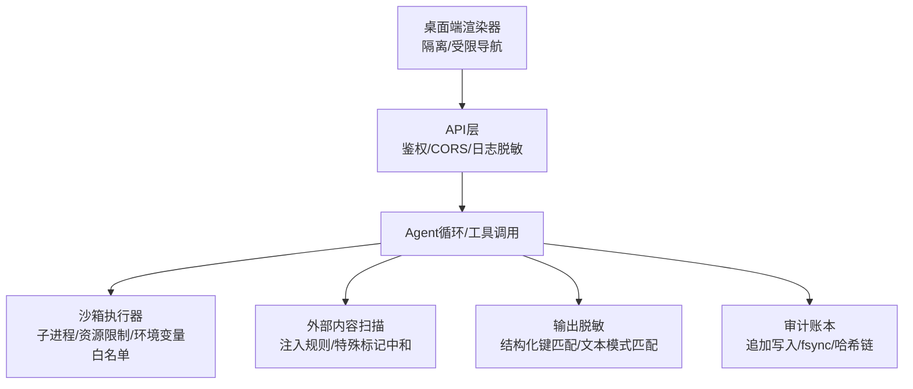
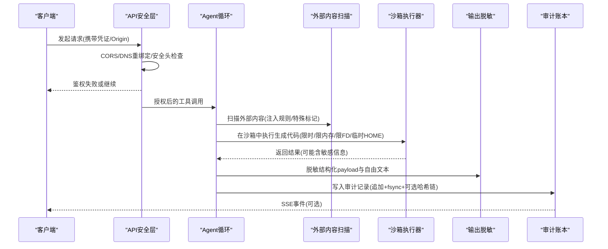
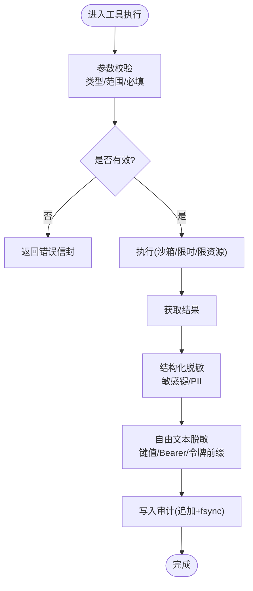
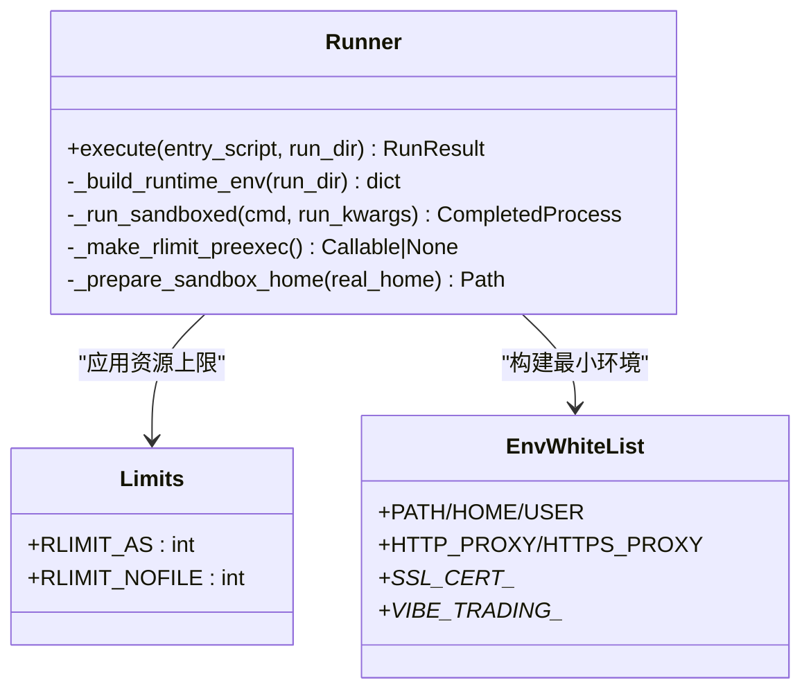
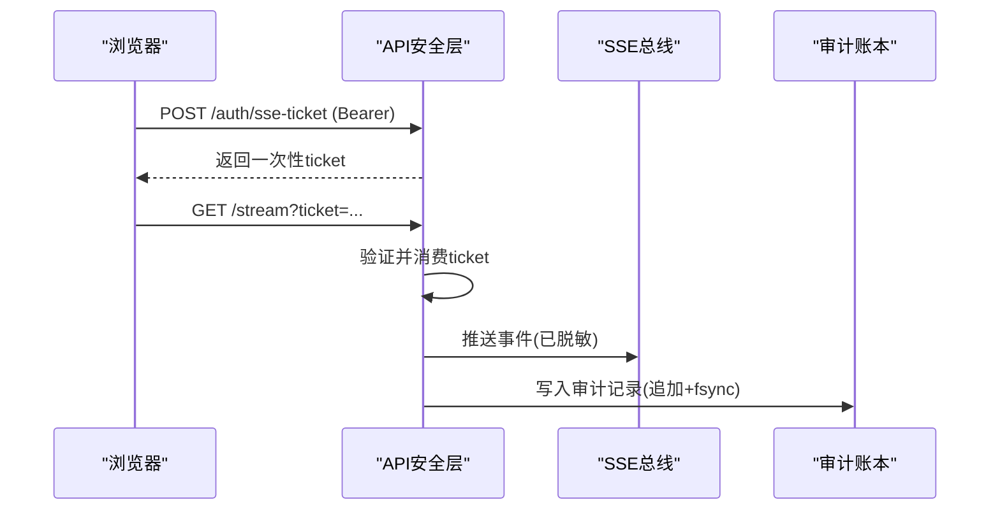
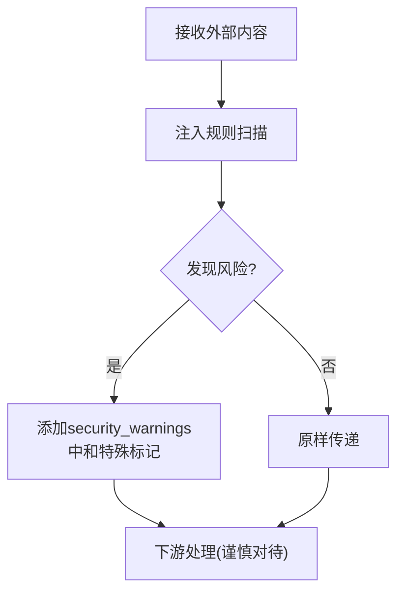
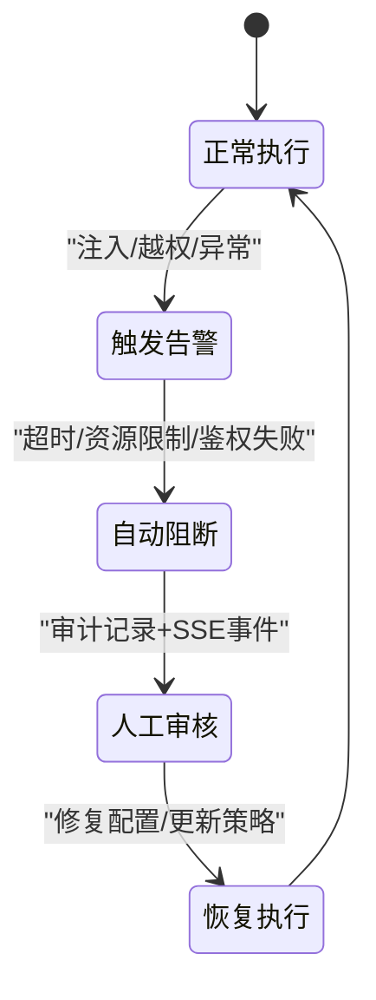
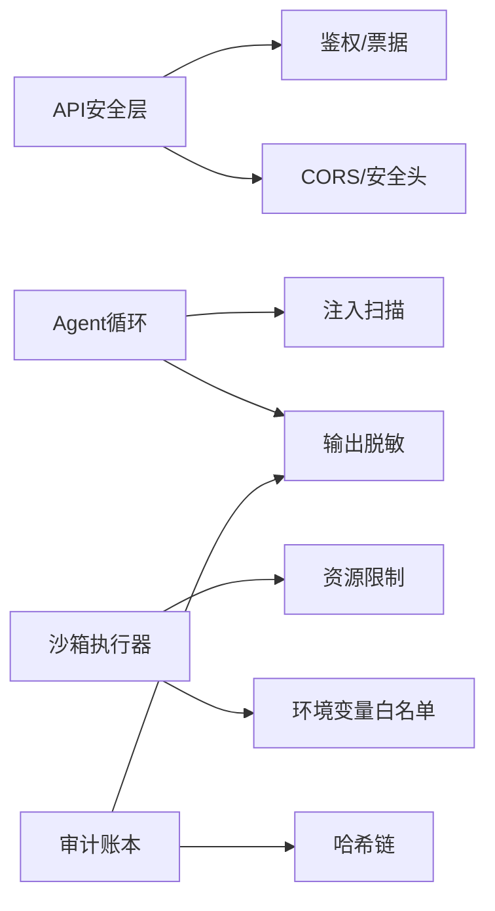

# 安全保护机制

<cite>
**本文引用的文件**
- [agent/src/core/runner.py](file://agent/src/core/runner.py)
- [agent/src/security/scanner.py](file://agent/src/security/scanner.py)
- [agent/src/tools/redaction.py](file://agent/src/tools/redaction.py)
- [agent/src/live/audit.py](file://agent/src/live/audit.py)
- [agent/src/api/security.py](file://agent/src/api/security.py)
- [desktop/electron/THREAT_MODEL.md](file://desktop/electron/THREAT_MODEL.md)
- [agent/src/trading/connectors/longbridge/sdk.py](file://agent/src/trading/connectors/longbridge/sdk.py)
- [agent/backtest/options_payoff.py](file://agent/backtest/options_payoff.py)
- [agent/tests/test_swarm_m2_registry_assembly.py](file://agent/tests/test_swarm_m2_registry_assembly.py)
</cite>

## 目录
1. [简介](#简介)
2. [项目结构](#项目结构)
3. [核心组件](#核心组件)
4. [架构总览](#架构总览)
5. [详细组件分析](#详细组件分析)
6. [依赖关系分析](#依赖关系分析)
7. [性能考量](#性能考量)
8. [故障排查指南](#故障排查指南)
9. [结论](#结论)
10. [附录](#附录)

## 简介
本技术文档聚焦于“工具执行安全保护机制”，覆盖输入验证与输出过滤、沙箱执行环境、权限控制与访问审计、恶意代码检测与防护、安全配置最佳实践，以及安全事件响应流程。目标是帮助开发者与运维人员理解并正确配置系统的安全能力，确保在生成式策略与外部数据交互场景下的安全性与可审计性。

## 项目结构
围绕安全的核心模块分布在以下位置：
- 沙箱执行与资源限制：agent/src/core/runner.py
- 外部内容注入扫描与特殊标记中和：agent/src/security/scanner.py
- 敏感信息脱敏（结构化与文本）：agent/src/tools/redaction.py
- 实时交易审计账本与防篡改链：agent/src/live/audit.py
- API鉴权、CORS、DNS重绑定防护、SSE票据、日志脱敏：agent/src/api/security.py
- 桌面端威胁模型与渲染器隔离：desktop/electron/THREAT_MODEL.md
- 连接器输入校验示例：agent/src/trading/connectors/longbridge/sdk.py
- 回测参数校验示例：agent/backtest/options_payoff.py
- 工具白名单与服务器级启用列表：agent/tests/test_swarm_m2_registry_assembly.py

**图表来源**
- [agent/src/api/security.py:166-253](file://agent/src/api/security.py#L166-L253)
- [agent/src/core/runner.py:33-110](file://agent/src/core/runner.py#L33-L110)
- [agent/src/security/scanner.py:26-77](file://agent/src/security/scanner.py#L26-L77)
- [agent/src/tools/redaction.py:291-333](file://agent/src/tools/redaction.py#L291-L333)
- [agent/src/live/audit.py:248-351](file://agent/src/live/audit.py#L248-L351)
- [desktop/electron/THREAT_MODEL.md:60-88](file://desktop/electron/THREAT_MODEL.md#L60-L88)

**章节来源**
- [agent/src/core/runner.py:33-110](file://agent/src/core/runner.py#L33-L110)
- [agent/src/security/scanner.py:26-77](file://agent/src/security/scanner.py#L26-L77)
- [agent/src/tools/redaction.py:291-333](file://agent/src/tools/redaction.py#L291-L333)
- [agent/src/live/audit.py:248-351](file://agent/src/live/audit.py#L248-L351)
- [agent/src/api/security.py:166-253](file://agent/src/api/security.py#L166-L253)
- [desktop/electron/THREAT_MODEL.md:60-88](file://desktop/electron/THREAT_MODEL.md#L60-L88)

## 核心组件
- 沙箱执行器：通过临时HOME、UID降权、RLIMIT限制、环境变量白名单、超时等组合，限制生成代码对宿主环境的访问与资源消耗。
- 外部内容扫描：基于正则的提示词注入规则集，识别指令覆盖、系统提示泄露、角色冒充、密钥外泄、工具滥用等风险，并对聊天模板控制标记进行中和。
- 输出脱敏：对结构化payload按敏感键名与PII字段进行递归替换；对自由文本使用键值对、Bearer令牌、已知令牌前缀的模式匹配进行脱敏。
- 审计账本：将每次关键操作以不可变追加方式写入独立文件，支持fsync持久化与哈希链防篡改，同时向运行期trace与SSE总线广播。
- API安全：强制CORS白名单、拒绝跨站请求、设置安全响应头、DNS重绑定防护、SSE一次性票据、访问日志中查询参数脱敏。
- 桌面端隔离：禁用nodeIntegration、启用contextIsolation与Chromium沙箱、限制导航与权限、仅允许本地后端通信。

**章节来源**
- [agent/src/core/runner.py:33-110](file://agent/src/core/runner.py#L33-L110)
- [agent/src/security/scanner.py:26-77](file://agent/src/security/scanner.py#L26-L77)
- [agent/src/tools/redaction.py:291-333](file://agent/src/tools/redaction.py#L291-L333)
- [agent/src/live/audit.py:248-351](file://agent/src/live/audit.py#L248-L351)
- [agent/src/api/security.py:166-253](file://agent/src/api/security.py#L166-L253)
- [desktop/electron/THREAT_MODEL.md:60-88](file://desktop/electron/THREAT_MODEL.md#L60-L88)

## 架构总览
下图展示了从API入口到工具执行、再到审计落盘的完整安全链路：

**图表来源**
- [agent/src/api/security.py:166-253](file://agent/src/api/security.py#L166-L253)
- [agent/src/security/scanner.py:145-220](file://agent/src/security/scanner.py#L145-L220)
- [agent/src/core/runner.py:487-597](file://agent/src/core/runner.py#L487-L597)
- [agent/src/tools/redaction.py:514-548](file://agent/src/tools/redaction.py#L514-L548)
- [agent/src/live/audit.py:248-351](file://agent/src/live/audit.py#L248-L351)

## 详细组件分析

### 输入验证与输出过滤
- 参数类型检查与范围约束：连接器与回测模块在计算边界进行严格校验，例如订单方向、数量、限价价格必须为合法数值且为正数；期权腿的strike、qty、premium需满足有限性与非负约束。
- 长度与格式限制：扫描器对匹配片段进行压缩摘要，避免过长匹配影响日志可读性；脱敏模块对键名进行折叠匹配，兼容驼峰、短横线与空格变体，减少误报与漏报。
- 结构化与自由文本双重脱敏：结构化payload按敏感键名与PII字段递归替换；自由文本通过键值对、Bearer令牌、已知令牌前缀模式匹配进行替换，保证JSON可解析与幂等性。

**图表来源**
- [agent/src/trading/connectors/longbridge/sdk.py:525-557](file://agent/src/trading/connectors/longbridge/sdk.py#L525-L557)
- [agent/backtest/options_payoff.py:77-124](file://agent/backtest/options_payoff.py#L77-L124)
- [agent/src/tools/redaction.py:291-333](file://agent/src/tools/redaction.py#L291-L333)
- [agent/src/live/audit.py:248-351](file://agent/src/live/audit.py#L248-L351)

**章节来源**
- [agent/src/trading/connectors/longbridge/sdk.py:525-557](file://agent/src/trading/connectors/longbridge/sdk.py#L525-L557)
- [agent/backtest/options_payoff.py:77-124](file://agent/backtest/options_payoff.py#L77-L124)
- [agent/src/tools/redaction.py:291-333](file://agent/src/tools/redaction.py#L291-L333)

### 沙箱执行环境设计
- 文件系统访问控制：为子进程创建临时HOME，并通过符号链接仅暴露必要的只读路径（如缓存、数据桥、qveris配置），其他用户主目录保持不可见。
- 网络请求限制：通过环境变量白名单控制代理与证书相关变量，保留必要的数据源网络访问；不继承LLM、交易、广告等敏感凭据。
- 系统调用拦截与资源限制：POSIX下通过preexec_fn设置RLIMIT_AS与RLIMIT_NOFILE上限，限制虚拟地址空间与文件描述符数量；结合超时终止长时间运行的任务。
- 权限降权：在支持的环境中尝试将子进程UID/GID降至专用沙箱用户，降低潜在破坏面。

**图表来源**
- [agent/src/core/runner.py:73-110](file://agent/src/core/runner.py#L73-L110)
- [agent/src/core/runner.py:259-341](file://agent/src/core/runner.py#L259-L341)
- [agent/src/core/runner.py:522-569](file://agent/src/core/runner.py#L522-L569)
- [agent/src/core/runner.py:487-597](file://agent/src/core/runner.py#L487-L597)

**章节来源**
- [agent/src/core/runner.py:33-110](file://agent/src/core/runner.py#L33-L110)
- [agent/src/core/runner.py:259-341](file://agent/src/core/runner.py#L259-L341)
- [agent/src/core/runner.py:522-569](file://agent/src/core/runner.py#L522-L569)
- [agent/src/core/runner.py:487-597](file://agent/src/core/runner.py#L487-L597)

### 权限控制与访问审计
- API鉴权：支持共享密钥与回环信任两种模式；禁止跨站浏览器请求；为SSE流提供一次性票据，避免长生命周期密钥出现在URL中。
- 安全响应头：默认启用CSP、X-Content-Type-Options、X-Frame-Options、Permissions-Policy、Referrer-Policy，限制脚本、样式、连接来源与帧嵌入。
- 访问日志脱敏：对查询参数中的api_key/ticket等值进行脱敏，防止敏感信息落入访问日志。
- 审计账本：所有关键操作（下单、拒绝、承诺、违规、停机）均写入独立追加文件，支持fsync持久化与哈希链防篡改；同时向运行期trace与SSE总线广播。

**图表来源**
- [agent/src/api/security.py:300-340](file://agent/src/api/security.py#L300-L340)
- [agent/src/api/security.py:463-504](file://agent/src/api/security.py#L463-L504)
- [agent/src/api/security.py:591-622](file://agent/src/api/security.py#L591-L622)
- [agent/src/live/audit.py:248-351](file://agent/src/live/audit.py#L248-L351)

**章节来源**
- [agent/src/api/security.py:166-253](file://agent/src/api/security.py#L166-L253)
- [agent/src/api/security.py:300-340](file://agent/src/api/security.py#L300-L340)
- [agent/src/api/security.py:463-504](file://agent/src/api/security.py#L463-L504)
- [agent/src/api/security.py:591-622](file://agent/src/api/security.py#L591-L622)
- [agent/src/live/audit.py:248-351](file://agent/src/live/audit.py#L248-L351)

### 恶意代码检测与防护措施
- 静态分析：对生成的策略代码进行AST清洗与限制（由回测执行器上游保障），配合沙箱执行形成纵深防御。
- 运行时监控：子进程超时、内存与FD限制、临时HOME隔离，阻止异常行为扩散。
- 异常行为检测：外部内容扫描器识别指令覆盖、系统提示泄露、角色冒充、密钥外泄、工具滥用等模式，并在结果中添加安全警告元数据；聊天模板控制标记被中和，防止伪造角色边界。

**图表来源**
- [agent/src/security/scanner.py:26-77](file://agent/src/security/scanner.py#L26-L77)
- [agent/src/security/scanner.py:117-143](file://agent/src/security/scanner.py#L117-L143)
- [agent/src/security/scanner.py:145-220](file://agent/src/security/scanner.py#L145-L220)

**章节来源**
- [agent/src/security/scanner.py:26-77](file://agent/src/security/scanner.py#L26-L77)
- [agent/src/security/scanner.py:117-143](file://agent/src/security/scanner.py#L117-L143)
- [agent/src/security/scanner.py:145-220](file://agent/src/security/scanner.py#L145-L220)

### 安全配置指南
- 安全策略配置：
  - 启用API密钥认证，避免在非本地环境下无鉴权访问。
  - 配置严格的CORS白名单，禁止通配符；必要时通过额外环境变量追加可信来源。
  - 启用安全响应头（CSP、X-Content-Type-Options、X-Frame-Options、Permissions-Policy、Referrer-Policy）。
- 白名单管理：
  - 工具白名单：仅在服务器启动时显式启用的工具才可用；即使预设包含远程工具，若未在服务配置中启用，也不会暴露给工作器。
  - 环境变量白名单：仅继承运行所需的最小集合，避免泄露LLM、交易、广告等凭据。
- 黑名单过滤：
  - 外部内容扫描器内置高风险模式（指令覆盖、系统提示泄露、密钥外泄、工具滥用），命中后添加警告并中和控制标记。
  - 脱敏模块对敏感键名与PII字段进行精确匹配，避免过度脱敏影响诊断。

**章节来源**
- [agent/src/api/security.py:69-103](file://agent/src/api/security.py#L69-L103)
- [agent/src/api/security.py:180-253](file://agent/src/api/security.py#L180-L253)
- [agent/tests/test_swarm_m2_registry_assembly.py:67-131](file://agent/tests/test_swarm_m2_registry_assembly.py#L67-L131)
- [agent/src/core/runner.py:259-341](file://agent/src/core/runner.py#L259-L341)
- [agent/src/security/scanner.py:26-77](file://agent/src/security/scanner.py#L26-L77)
- [agent/src/tools/redaction.py:246-288](file://agent/src/tools/redaction.py#L246-L288)

### 安全事件响应机制
- 异常告警：扫描器在检测到注入风险时添加警告元数据；API层对跨站请求与无效凭据返回明确错误；审计账本记录失败与拒绝事件。
- 自动阻断：沙箱执行器通过超时与资源限制中止异常任务；API层拒绝不受信任的Host头与跨站请求；工具白名单限制可调用能力。
- 人工审核：审计账本提供不可变记录与哈希链，便于事后核查；SSE事件用于前端实时展示，辅助人工介入。

[此图为概念流程图，无需源码映射]

## 依赖关系分析
- 组件耦合：
  - API安全层依赖会话模型与环境配置，负责鉴权、CORS与安全头。
  - Agent循环依赖扫描器与脱敏模块，对外部内容与输出进行安全处理。
  - 沙箱执行器依赖操作系统能力（POSIX资源限制）与临时HOME构造。
  - 审计账本依赖脱敏模块与治理账本（哈希链），实现持久化与防篡改。
- 外部依赖：
  - FastAPI/Starlette中间件用于CORS与安全头。
  - Uvicorn日志系统用于访问日志脱敏。
  - Electron渲染器隔离与本地后端通信。

**图表来源**
- [agent/src/api/security.py:166-253](file://agent/src/api/security.py#L166-L253)
- [agent/src/security/scanner.py:145-220](file://agent/src/security/scanner.py#L145-L220)
- [agent/src/tools/redaction.py:291-333](file://agent/src/tools/redaction.py#L291-L333)
- [agent/src/core/runner.py:438-597](file://agent/src/core/runner.py#L438-L597)
- [agent/src/live/audit.py:248-351](file://agent/src/live/audit.py#L248-L351)

**章节来源**
- [agent/src/api/security.py:166-253](file://agent/src/api/security.py#L166-L253)
- [agent/src/security/scanner.py:145-220](file://agent/src/security/scanner.py#L145-L220)
- [agent/src/tools/redaction.py:291-333](file://agent/src/tools/redaction.py#L291-L333)
- [agent/src/core/runner.py:438-597](file://agent/src/core/runner.py#L438-L597)
- [agent/src/live/audit.py:248-351](file://agent/src/live/audit.py#L248-L351)

## 性能考量
- 沙箱执行：超时与资源限制可防止长时间占用CPU/内存；临时HOME与符号链接减少不必要IO；POSIX资源限制仅在支持的平台生效。
- 扫描与脱敏：正则匹配采用有界量词与紧凑匹配，避免灾难性回溯；脱敏模块对内部根路径进行边界感知替换，减少误伤。
- 审计写入：追加写入与fsync确保持久性，但会带来一定IO开销；哈希链追加失败不影响主账本，保证业务连续性。

[本节提供通用指导，无需特定文件分析]

## 故障排查指南
- 沙箱执行失败：检查是否存在vibe-sandbox用户与CAP_SETUID/CAP_SETGID能力；查看日志中关于UID降权失败的警告；确认临时HOME创建成功。
- 注入风险告警：查看security_warnings字段，定位命中规则与匹配片段；调整外部内容来源或提示词以避免触发。
- 脱敏异常：确认敏感键名与PII字段是否正确；检查自由文本中是否包含未识别的令牌前缀；验证JSON结果可解析。
- 审计缺失：检查审计文件路径权限与fsync是否成功；确认哈希链追加是否失败并记录错误；核对SSE事件是否推送。
- API鉴权失败：确认API密钥配置与来源（Header/Query）；检查CORS与Host头是否受信任；验证SSE票据是否过期或被重复使用。

**章节来源**
- [agent/src/core/runner.py:487-597](file://agent/src/core/runner.py#L487-L597)
- [agent/src/security/scanner.py:145-220](file://agent/src/security/scanner.py#L145-L220)
- [agent/src/tools/redaction.py:514-548](file://agent/src/tools/redaction.py#L514-L548)
- [agent/src/live/audit.py:248-351](file://agent/src/live/audit.py#L248-L351)
- [agent/src/api/security.py:463-504](file://agent/src/api/security.py#L463-L504)
- [agent/src/api/security.py:591-622](file://agent/src/api/security.py#L591-L622)

## 结论
本系统通过多层安全机制保障工具执行的安全性：输入验证与输出过滤确保数据完整性与机密性；沙箱执行环境限制资源与访问面；权限控制与访问审计提供可追溯性与合规性；恶意代码检测与防护降低注入与滥用风险；安全配置与事件响应机制提升整体韧性。建议在生产环境中启用API密钥认证、严格CORS与安全头、工具白名单与审计链，并结合监控与告警实现闭环安全管理。

[本节总结性内容，无需特定文件分析]

## 附录
- 桌面端渲染器隔离要点：禁用nodeIntegration、启用contextIsolation与Chromium沙箱、限制导航与权限、仅允许本地后端通信。
- 工具白名单与服务器启用列表：服务器启动时显式启用的工具才可被工作器使用；预设中的远程工具若未在服务配置中启用，将被静默丢弃并记录警告。

**章节来源**
- [desktop/electron/THREAT_MODEL.md:60-88](file://desktop/electron/THREAT_MODEL.md#L60-L88)
- [agent/tests/test_swarm_m2_registry_assembly.py:67-131](file://agent/tests/test_swarm_m2_registry_assembly.py#L67-L131)