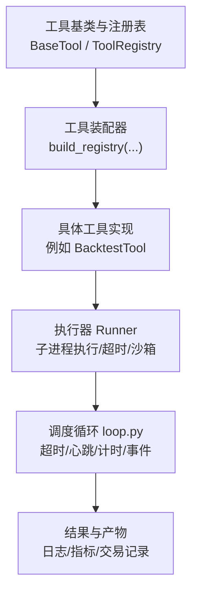
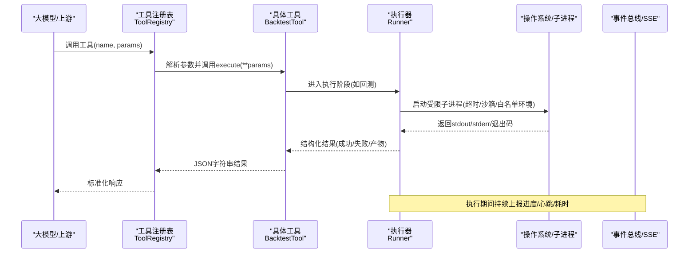
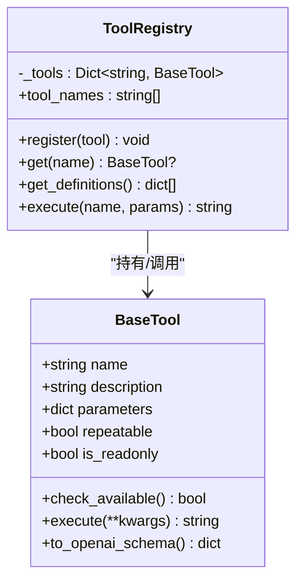
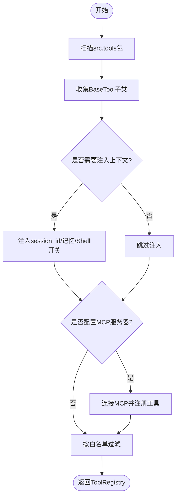
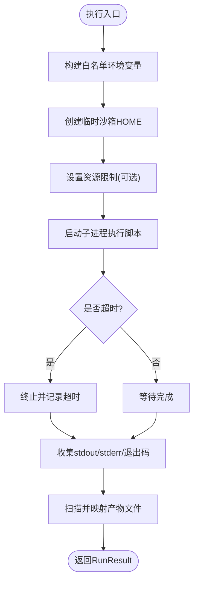
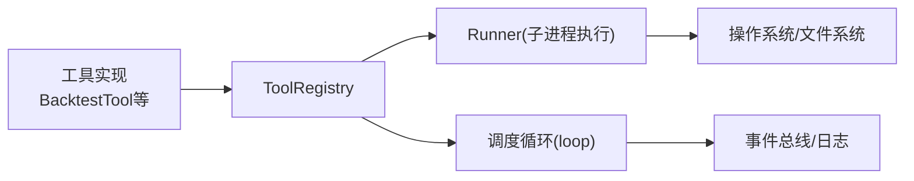

# 工具执行调度

<cite>
**本文引用的文件**
- [agent/src/agent/tools.py](file://agent/src/agent/tools.py)
- [agent/src/tools/__init__.py](file://agent/src/tools/__init__.py)
- [agent/src/core/runner.py](file://agent/src/core/runner.py)
- [agent/src/agent/loop.py](file://agent/src/agent/loop.py)
- [agent/src/tools/backtest_tool.py](file://agent/src/tools/backtest_tool.py)
- [agent/tests/test_tools_type_value_safety.py](file://agent/tests/test_tools_type_value_safety.py)
- [agent/tests/test_mcp_server_smoke.py](file://agent/tests/test_mcp_server_smoke.py)
</cite>

## 目录
1. [简介](#简介)
2. [项目结构](#项目结构)
3. [核心组件](#核心组件)
4. [架构总览](#架构总览)
5. [详细组件分析](#详细组件分析)
6. [依赖关系分析](#依赖关系分析)
7. [性能与并发](#性能与并发)
8. [故障排查指南](#故障排查指南)
9. [结论](#结论)
10. [附录](#附录)

## 简介
本文件面向“工具执行调度”的完整技术说明，覆盖参数校验、类型检查、异常处理、同步/异步执行模式、超时控制与重试机制、安全机制（输入验证、输出过滤、沙箱保护）、性能监控与调试、并发控制、资源管理与内存优化等主题。文档以代码级事实为依据，配合流程图与时序图帮助读者快速理解从“工具注册—参数校验—执行—结果收集—审计追踪”的全链路。

## 项目结构
围绕工具执行调度的关键路径由以下模块构成：
- 工具基类与注册表：定义工具契约、自动发现与统一执行入口
- 工具装配器：按策略组装本地工具与远程MCP工具，支持白名单过滤
- 执行器：在隔离子进程中运行可执行脚本，负责超时、沙箱、环境变量裁剪与产物收集
- 调度循环：封装单次工具调用生命周期，包含进度事件、心跳、超时与耗时统计
- 具体工具示例：如回测工具，演示如何接入执行流程



**图示来源**
- [agent/src/agent/tools.py:13-95](file://agent/src/agent/tools.py#L13-L95)
- [agent/src/tools/__init__.py:33-245](file://agent/src/tools/__init__.py#L33-L245)
- [agent/src/core/runner.py:379-627](file://agent/src/core/runner.py#L379-L627)
- [agent/src/agent/loop.py:2745-2782](file://agent/src/agent/loop.py#L2745-L2782)

**章节来源**
- [agent/src/agent/tools.py:13-95](file://agent/src/agent/tools.py#L13-L95)
- [agent/src/tools/__init__.py:33-245](file://agent/src/tools/__init__.py#L33-L245)
- [agent/src/core/runner.py:379-627](file://agent/src/core/runner.py#L379-L627)
- [agent/src/agent/loop.py:2745-2782](file://agent/src/agent/loop.py#L2745-L2782)

## 核心组件
- BaseTool：定义工具的最小接口（名称、描述、参数Schema、是否可重复、是否只读），并提供OpenAI函数调用格式转换能力。
- ToolRegistry：集中管理工具实例，提供按名获取、批量导出Schema、统一执行入口；对未找到或执行异常进行兜底包装，保证返回稳定的JSON字符串。
- 工具装配器 build_registry：通过包扫描自动发现所有BaseTool子类，按策略注入会话ID、持久化记忆、Shell工具开关、MCP服务器工具等，并支持白名单过滤。
- Runner：在独立子进程中执行脚本，负责：
  - 环境变量白名单裁剪（仅暴露必要运行时变量）
  - 临时HOME沙箱（限制对真实用户目录的访问）
  - 可选UID降权与资源限制（地址空间/文件句柄）
  - 超时控制、标准输出/错误捕获、产物扫描与汇总
- 调度循环（loop）：封装一次工具调用的生命周期，包括：
  - 读取工具级超时配置
  - 进度事件与心跳上报
  - 执行计时与耗时统计
  - 将结果与元数据透传到上层SSE总线/CLI面板

**章节来源**
- [agent/src/agent/tools.py:13-95](file://agent/src/agent/tools.py#L13-L95)
- [agent/src/tools/__init__.py:33-245](file://agent/src/tools/__init__.py#L33-L245)
- [agent/src/core/runner.py:379-627](file://agent/src/core/runner.py#L379-L627)
- [agent/src/agent/loop.py:2745-2782](file://agent/src/agent/loop.py#L2745-L2782)

## 架构总览
下图展示从“工具注册—参数校验—执行—结果收集—审计追踪”的端到端流程。



**图示来源**
- [agent/src/agent/tools.py:72-84](file://agent/src/agent/tools.py#L72-L84)
- [agent/src/tools/backtest_tool.py:166-183](file://agent/src/tools/backtest_tool.py#L166-L183)
- [agent/src/core/runner.py:510-627](file://agent/src/core/runner.py#L510-L627)
- [agent/src/agent/loop.py:2745-2782](file://agent/src/agent/loop.py#L2745-L2782)

## 详细组件分析

### 工具基类与注册表（BaseTool / ToolRegistry）
- 设计要点
  - 每个工具声明name/description/parameters(repeatable/is_readonly)，便于UI与LLM理解能力边界
  - to_openai_schema用于生成函数调用描述，便于外部系统对接
  - Registry.execute统一捕获异常，确保返回稳定JSON，避免上层崩溃
- 典型行为
  - 找不到工具：返回错误状态与消息
  - 执行异常：记录异常堆栈并返回错误状态



**图示来源**
- [agent/src/agent/tools.py:13-95](file://agent/src/agent/tools.py#L13-L95)

**章节来源**
- [agent/src/agent/tools.py:13-95](file://agent/src/agent/tools.py#L13-L95)

### 工具装配器（自动发现与MCP集成）
- 自动发现：遍历src.tools包导入模块，收集BaseTool子类并缓存
- 策略注入：根据配置注入session_id、persistent_memory、shell工具开关、MCP服务器工具
- 白名单过滤：为Swarm工作进程构建最小可用工具集，缺失工具会告警而非失败
- MCP集成：连接远端MCP服务器，动态注册工具；对“实盘券商”通道做额外鉴权与包装



**图示来源**
- [agent/src/tools/__init__.py:33-245](file://agent/src/tools/__init__.py#L33-L245)

**章节来源**
- [agent/src/tools/__init__.py:33-245](file://agent/src/tools/__init__.py#L33-L245)

### 执行器（Runner：子进程、沙箱、超时、产物）
- 环境变量白名单：仅允许必要的运行时变量（PATH、代理、证书、数据源密钥等），防止凭据泄露
- 沙箱HOME：使用临时目录作为HOME，并通过符号链接仅暴露受信任的子目录（如缓存、数据桥、qveris配置）
- 权限与资源限制：在POSIX环境下尝试降权到专用用户，并设置虚拟内存上限与文件句柄上限
- 超时控制：子进程执行带超时，超时会终止并返回失败
- 产物收集：按规范扫描artifacts目录，提取equity/metrics/trades等文件供后续报告使用



**图示来源**
- [agent/src/core/runner.py:352-361](file://agent/src/core/runner.py#L352-L361)
- [agent/src/core/runner.py:113-172](file://agent/src/core/runner.py#L113-L172)
- [agent/src/core/runner.py:85-110](file://agent/src/core/runner.py#L85-L110)
- [agent/src/core/runner.py:510-627](file://agent/src/core/runner.py#L510-L627)

**章节来源**
- [agent/src/core/runner.py:352-361](file://agent/src/core/runner.py#L352-L361)
- [agent/src/core/runner.py:113-172](file://agent/src/core/runner.py#L113-L172)
- [agent/src/core/runner.py:85-110](file://agent/src/core/runner.py#L85-L110)
- [agent/src/core/runner.py:510-627](file://agent/src/core/runner.py#L510-L627)

### 调度循环（loop：超时、心跳、计时、事件）
- 超时：读取工具级超时配置，若大于0则启用超时控制
- 心跳：周期性上报工具心跳，保障长任务可观测性
- 计时：记录工具执行起止时间，计算毫秒级耗时
- 事件：将进度与心跳事件推送到统一事件总线，供CLI与前端展示

```mermaid
sequenceDiagram
participant Loop as "调度循环"
participant Tool as "工具执行"
participant Bus as "事件总线"
Loop->>Loop : 读取工具超时
Loop->>Tool : 启动执行(带超时)
loop 执行中
Tool-->>Bus : tool_progress(进度)
Tool-->>Bus : tool_heartbeat(心跳)
end
Tool-->>Loop : 返回结果(成功/失败)
Loop->>Loop : 计算elapsed_ms
Loop-->>Bus : 最终结果与耗时
```

**图示来源**
- [agent/src/agent/loop.py:2745-2782](file://agent/src/agent/loop.py#L2745-L2782)

**章节来源**
- [agent/src/agent/loop.py:2745-2782](file://agent/src/agent/loop.py#L2745-L2782)

### 具体工具示例：回测工具（BacktestTool）
- 职责：接收run_dir参数，调用底层回测执行逻辑
- 特性：repeatable=true，is_readonly=false，表明可重复执行且会产生副作用（写入产物）
- 与Runner协作：实际计算与IO在Runner管理的子进程中完成，具备超时与沙箱保护

**章节来源**
- [agent/src/tools/backtest_tool.py:166-183](file://agent/src/tools/backtest_tool.py#L166-L183)

## 依赖关系分析
- 低耦合高内聚：BaseTool与ToolRegistry解耦具体工具实现；Runner与工具无关，专注执行环境与安全
- 自动发现降低维护成本：新增工具只需继承BaseTool并放入对应包
- 外部依赖隔离：通过环境变量白名单与沙箱HOME，避免敏感信息泄露
- 可插拔扩展：MCP服务器工具可按需接入，不影响本地工具稳定性



**图示来源**
- [agent/src/agent/tools.py:13-95](file://agent/src/agent/tools.py#L13-L95)
- [agent/src/tools/__init__.py:33-245](file://agent/src/tools/__init__.py#L33-L245)
- [agent/src/core/runner.py:379-627](file://agent/src/core/runner.py#L379-L627)
- [agent/src/agent/loop.py:2745-2782](file://agent/src/agent/loop.py#L2745-L2782)

**章节来源**
- [agent/src/agent/tools.py:13-95](file://agent/src/agent/tools.py#L13-L95)
- [agent/src/tools/__init__.py:33-245](file://agent/src/tools/__init__.py#L33-L245)
- [agent/src/core/runner.py:379-627](file://agent/src/core/runner.py#L379-L627)
- [agent/src/agent/loop.py:2745-2782](file://agent/src/agent/loop.py#L2745-L2782)

## 性能与并发
- 子进程隔离：每个工具执行在独立子进程中进行，天然隔离资源与崩溃影响
- 超时控制：Runner层对子进程设置超时，避免长时间阻塞；调度循环层也支持工具级超时
- 资源限制：POSIX下可通过RLIMIT_AS与RLIMIT_NOFILE限制虚拟内存与文件句柄数，防止DoS
- 产物扫描：按固定schema扫描artifacts目录，减少I/O开销
- 并发建议：
  - 对于CPU密集任务，可在调度层并行发起多个工具调用（注意系统资源上限）
  - 对于I/O密集任务，结合网络超时与重试策略，避免单点阻塞
  - 合理设置VIBE_TRADING_SANDBOX_RLIMIT_AS_MB以平衡内存占用与失败率

[本节为通用指导，不直接分析具体文件]

## 故障排查指南
- 工具未找到或执行异常
  - 现象：返回status=error，包含错误信息
  - 排查：确认工具已注册、名称正确；查看异常日志
  - 参考：ToolRegistry.execute对异常的统一捕获与日志记录
- 超时问题
  - 现象：子进程被终止，返回失败
  - 排查：检查工具级超时配置与Runner超时；必要时调整RLIMIT_AS或优化任务
  - 参考：Runner超时与调度循环超时
- 沙箱HOME导致配置文件不可见
  - 现象：某些第三方库因缺少HOME下的配置文件而报错
  - 排查：确认临时HOME是否正确建立符号链接；必要时放宽XDG_CACHE_HOME等缓存路径
  - 参考：Runner的沙箱HOME构建逻辑
- 环境变量泄露风险
  - 现象：子进程继承了不必要的环境变量
  - 排查：检查白名单列表；按需添加或移除
  - 参考：Runner的环境变量裁剪逻辑

**章节来源**
- [agent/src/agent/tools.py:72-84](file://agent/src/agent/tools.py#L72-L84)
- [agent/src/core/runner.py:352-361](file://agent/src/core/runner.py#L352-L361)
- [agent/src/core/runner.py:113-172](file://agent/src/core/runner.py#L113-L172)
- [agent/src/core/runner.py:510-627](file://agent/src/core/runner.py#L510-L627)
- [agent/src/agent/loop.py:2745-2782](file://agent/src/agent/loop.py#L2745-L2782)

## 结论
该工具执行调度体系通过“统一契约+自动发现+严格隔离”的设计，实现了安全、可观测、可扩展的工具执行框架。Runner提供的沙箱与资源限制、调度循环的心跳与计时、以及注册表的健壮异常处理，共同保障了生产环境的稳定性与可维护性。建议在复杂场景下结合并发控制、超时与重试策略，以获得更好的吞吐与鲁棒性。

[本节为总结性内容，不直接分析具体文件]

## 附录

### 参数验证与类型检查
- 工具参数基于JSON Schema描述，便于上游校验与UI生成
- 类型与值的安全边界：测试用例覆盖了“缺失可选参数允许默认值”、“显式传入非法值应拒绝”的原则，确保资金相关入口fail-closed
- 建议：在工具execute入口处进行二次校验，确保参数符合业务约束

**章节来源**
- [agent/tests/test_tools_type_value_safety.py:1-22](file://agent/tests/test_tools_type_value_safety.py#L1-L22)

### 超时控制与重试机制
- 超时控制
  - 工具级：调度循环读取工具超时配置，大于0时启用
  - 进程级：Runner对子进程设置超时，避免长期挂起
- 重试机制
  - 仓库中存在针对重试的测试用例，体现对不稳定调用的恢复策略
  - 建议：在网络调用或外部服务交互处实现指数退避重试，并结合熔断与降级

**章节来源**
- [agent/src/agent/loop.py:2745-2782](file://agent/src/agent/loop.py#L2745-L2782)
- [agent/src/core/runner.py:510-627](file://agent/src/core/runner.py#L510-L627)
- [agent/tests/test_mcp_server_smoke.py:39-46](file://agent/tests/test_mcp_server_smoke.py#L39-L46)

### 安全机制
- 输入验证：基于Schema的参数校验与工具级二次校验
- 输出过滤：统一返回JSON字符串，异常被捕获并包装为标准错误结构
- 沙箱保护：临时HOME、环境变量白名单、可选UID降权与资源限制
- 最小权限：仅暴露必要运行时变量，避免凭据泄露

**章节来源**
- [agent/src/core/runner.py:352-361](file://agent/src/core/runner.py#L352-L361)
- [agent/src/core/runner.py:113-172](file://agent/src/core/runner.py#L113-L172)
- [agent/src/core/runner.py:85-110](file://agent/src/core/runner.py#L85-L110)
- [agent/src/agent/tools.py:72-84](file://agent/src/agent/tools.py#L72-L84)

### 性能监控与调试
- 执行时间统计：调度循环记录毫秒级耗时
- 错误日志记录：工具执行异常与子进程stderr均被记录
- 性能分析：结合产物文件（metrics.csv等）与日志进行分析
- 建议：在关键路径增加埋点，输出结构化指标以便聚合分析

**章节来源**
- [agent/src/agent/loop.py:2745-2782](file://agent/src/agent/loop.py#L2745-L2782)
- [agent/src/core/runner.py:682-709](file://agent/src/core/runner.py#L682-L709)

### 并发执行控制、资源管理与内存优化
- 并发控制：建议在调度层对工具调用进行限流与并发度控制，避免资源争用
- 资源管理：利用Runner的资源限制与沙箱HOME，限制单个任务的内存与文件句柄
- 内存优化：合理设置RLIMIT_AS，避免过大虚拟内存导致误杀；复用缓存目录以减少重复下载

**章节来源**
- [agent/src/core/runner.py:85-110](file://agent/src/core/runner.py#L85-L110)
- [agent/src/core/runner.py:113-172](file://agent/src/core/runner.py#L113-L172)