# 并发控制机制

<cite>
**本文引用的文件**
- [agent/src/agent/loop.py](file://agent/src/agent/loop.py)
- [agent/src/session/service.py](file://agent/src/session/service.py)
- [agent/src/tools/background_tools.py](file://agent/src/tools/background_tools.py)
- [agent/src/swarm/runtime.py](file://agent/src/swarm/runtime.py)
- [agent/src/scheduled_research/executor.py](file://agent/src/scheduled_research/executor.py)
- [agent/src/channels/runtime.py](file://agent/src/channels/runtime.py)
- [agent/src/providers/openai_codex.py](file://agent/src/providers/openai_codex.py)
- [agent/src/api/system_routes.py](file://agent/src/api/system_routes.py)
</cite>

## 目录
1. [简介](#简介)
2. [项目结构](#项目结构)
3. [核心组件](#核心组件)
4. [架构总览](#架构总览)
5. [详细组件分析](#详细组件分析)
6. [依赖关系分析](#依赖关系分析)
7. [性能考量](#性能考量)
8. [故障恢复与重试](#故障恢复与重试)
9. [监控与指标](#监控与指标)
10. [配置与调优](#配置与调优)
11. [结论](#结论)

## 简介
本技术文档聚焦于“工具并发控制机制”，围绕后台任务执行系统的设计与实现，系统性阐述线程池管理、任务队列、资源隔离、并发安全（锁、内存隔离、状态同步）、调度策略（FIFO、优先级/拓扑层并行）、超时与取消、以及可观测性与故障恢复。内容基于代码仓库中的会话服务、Swarm DAG 运行时、定时研究执行器、后台进程工具、通道运行时与系统路由限流等模块进行归纳与可视化。

## 项目结构
从并发视角看，系统由多个相互协作的子系统构成：
- 会话服务：负责用户请求到 AgentLoop 的调度与生命周期管理，使用固定大小线程池限制并发 Agent 实例。
- Swarm DAG 运行时：按拓扑层组织任务，层内并行、层间串行，提供任务级重试、超时与取消。
- 定时研究执行器：周期性轮询并派发持久化任务，支持退避重试与失败收敛。
- 后台进程工具：以进程组方式运行外部命令，具备超时、优雅终止与取消能力。
- 通道运行时：异步消息消费与处理，维护入/出站队列与任务集合。
- 系统路由限流：对计算密集型接口实施滑动窗口限流，保护后端资源。

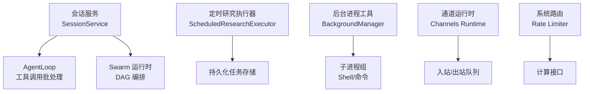

**图示来源**
- [agent/src/session/service.py:32-33](file://agent/src/session/service.py#L32-L33)
- [agent/src/swarm/runtime.py:251-286](file://agent/src/swarm/runtime.py#L251-L286)
- [agent/src/scheduled_research/executor.py:160-223](file://agent/src/scheduled_research/executor.py#L160-L223)
- [agent/src/tools/background_tools.py:102-139](file://agent/src/tools/background_tools.py#L102-L139)
- [agent/src/channels/runtime.py:114-119](file://agent/src/channels/runtime.py#L114-L119)
- [agent/src/api/system_routes.py:316-337](file://agent/src/api/system_routes.py#L316-L337)

**章节来源**
- [agent/src/session/service.py:32-33](file://agent/src/session/service.py#L32-L33)
- [agent/src/swarm/runtime.py:251-286](file://agent/src/swarm/runtime.py#L251-L286)
- [agent/src/scheduled_research/executor.py:160-223](file://agent/src/scheduled_research/executor.py#L160-L223)
- [agent/src/tools/background_tools.py:102-139](file://agent/src/tools/background_tools.py#L102-L139)
- [agent/src/channels/runtime.py:114-119](file://agent/src/channels/runtime.py#L114-L119)
- [agent/src/api/system_routes.py:316-337](file://agent/src/api/system_routes.py#L316-L337)

## 核心组件
- 会话服务（SessionService）
  - 使用固定大小线程池（默认 4 个 worker）承载 Agent 构建与执行，避免耗尽默认执行器。
  - 通过 in-flight 集合与锁保证单会话单运行，防止并发写入导致消息交错。
  - 将 AgentLoop 事件转发至 SSE 总线，统一对外暴露状态。
- Swarm 运行时（SwarmRuntime）
  - 按拓扑层调度任务：层内并行、层间串行；每层设置整体截止时间，防止卡死。
  - 支持任务级重试、上游依赖阻塞、心跳与事件上报。
- 定时研究执行器（ScheduledResearchExecutor）
  - 周期轮询持久化任务，按 cron/间隔触发；失败采用指数退避重试，达到阈值后标记失败。
  - 启动时恢复“悬挂”的运行中任务，避免进程重启导致的僵尸态。
- 后台进程工具（BackgroundManager）
  - 以进程组方式运行命令，支持跨平台优雅终止；强制超时与取消流程，输出截断防 OOM。
- 通道运行时（Channels Runtime）
  - 异步消费入站消息，为每个消息创建独立任务，维护任务集合以便清理。
- 系统路由限流（System Routes）
  - 滑动窗口限流器按客户端 IP 独立配额，超限返回 429。

**章节来源**
- [agent/src/session/service.py:32-33](file://agent/src/session/service.py#L32-L33)
- [agent/src/session/service.py:179-202](file://agent/src/session/service.py#L179-L202)
- [agent/src/swarm/runtime.py:222-386](file://agent/src/swarm/runtime.py#L222-L386)
- [agent/src/scheduled_research/executor.py:160-223](file://agent/src/scheduled_research/executor.py#L160-L223)
- [agent/src/tools/background_tools.py:102-139](file://agent/src/tools/background_tools.py#L102-L139)
- [agent/src/channels/runtime.py:114-119](file://agent/src/channels/runtime.py#L114-L119)
- [agent/src/api/system_routes.py:316-337](file://agent/src/api/system_routes.py#L316-L337)

## 架构总览
下图展示关键并发组件之间的交互与控制流：

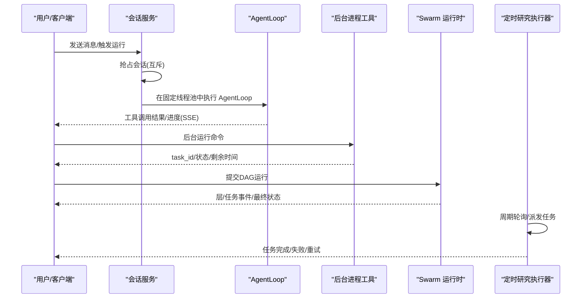

**图示来源**
- [agent/src/session/service.py:244-307](file://agent/src/session/service.py#L244-L307)
- [agent/src/agent/loop.py:2637-2692](file://agent/src/agent/loop.py#L2637-L2692)
- [agent/src/tools/background_tools.py:110-139](file://agent/src/tools/background_tools.py#L110-L139)
- [agent/src/swarm/runtime.py:90-159](file://agent/src/swarm/runtime.py#L90-L159)
- [agent/src/scheduled_research/executor.py:282-316](file://agent/src/scheduled_research/executor.py#L282-L316)

## 详细组件分析

### 会话服务与 Agent 并发控制
- 线程池与并发上限
  - 使用专用线程池限制同时运行的 Agent 数量，避免默认执行器被耗尽。
- 会话级互斥
  - 通过 in-flight 集合与锁确保同一会话仅允许一个运行，重复请求直接拒绝（HTTP 409）。
- 取消与释放
  - 支持在注册表构建阶段或 AgentLoop 运行期间取消；finally 块确保释放占用。
- 事件与指标
  - 将 tool_call/tool_result 等事件转发至事件总线；记录耗时、模型信息等元数据。

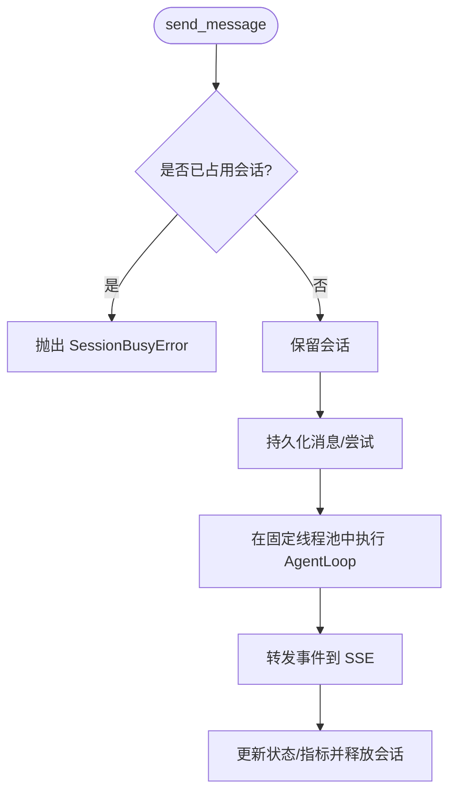

**图示来源**
- [agent/src/session/service.py:179-202](file://agent/src/session/service.py#L179-L202)
- [agent/src/session/service.py:244-307](file://agent/src/session/service.py#L244-L307)
- [agent/src/session/service.py:248-344](file://agent/src/session/service.py#L248-L344)

**章节来源**
- [agent/src/session/service.py:32-33](file://agent/src/session/service.py#L32-L33)
- [agent/src/session/service.py:179-202](file://agent/src/session/service.py#L179-L202)
- [agent/src/session/service.py:244-307](file://agent/src/session/service.py#L244-L307)
- [agent/src/session/service.py:248-344](file://agent/src/session/service.py#L248-L344)

### AgentLoop 工具调用批处理与超时
- 只读工具并行执行
  - 将只读工具分组并行执行，使用线程池限制并发度，异常被捕获并转为错误结果。
- 工具执行超时与取消
  - 工具执行在独立工作线程中进行，配合超时与心跳计时器；超时后丢弃迟到结果并抑制发射器。
- 结果顺序与追踪
  - 结果按原顺序汇总，便于上层一致化处理与追踪。

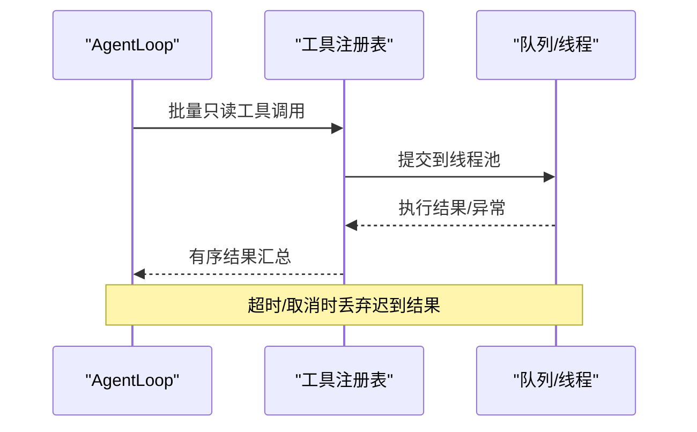

**图示来源**
- [agent/src/agent/loop.py:2637-2692](file://agent/src/agent/loop.py#L2637-L2692)
- [agent/src/agent/loop.py:2848-2882](file://agent/src/agent/loop.py#L2848-L2882)

**章节来源**
- [agent/src/agent/loop.py:2637-2692](file://agent/src/agent/loop.py#L2637-L2692)
- [agent/src/agent/loop.py:2848-2882](file://agent/src/agent/loop.py#L2848-L2882)

### Swarm DAG 运行时：拓扑层并行与重试
- 拓扑层调度
  - 先计算拓扑层，层内任务并行，层间串行；每层设置截止时间，防止长尾任务拖垮整体。
- 依赖与阻塞
  - 若上游未完成，下游任务被标记为 blocked，避免空上下文执行。
- 重试与清理
  - 任务失败自动重试，每次重试前清理工件目录，避免污染新尝试；累计 token 计数用于成本审计。
- 取消与收尾
  - 支持层间取消，未完成任务标记为 cancelled；最终根据全部结果确定运行状态。

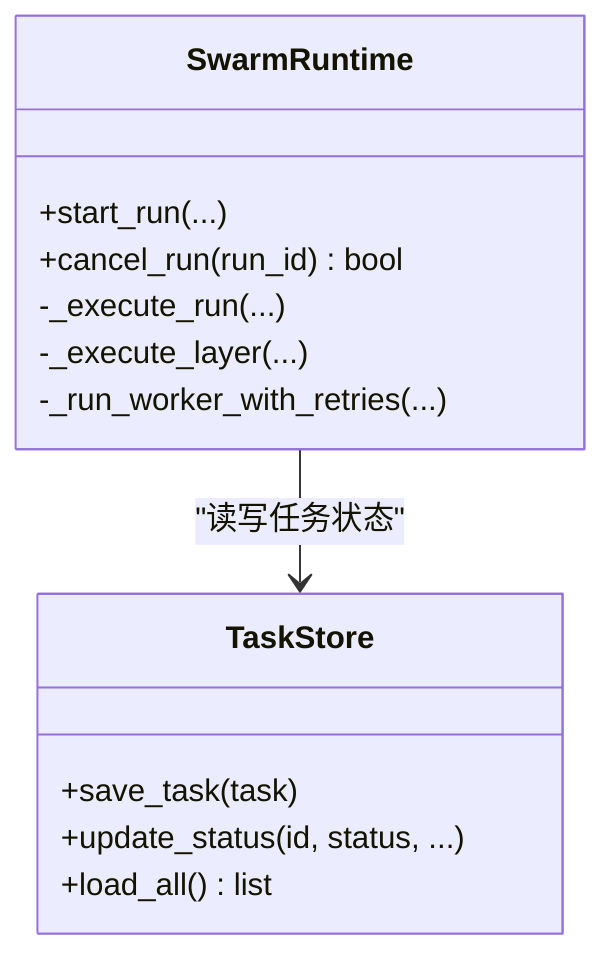

**图示来源**
- [agent/src/swarm/runtime.py:251-286](file://agent/src/swarm/runtime.py#L251-L286)
- [agent/src/swarm/runtime.py:222-386](file://agent/src/swarm/runtime.py#L222-L386)
- [agent/src/swarm/runtime.py:476-645](file://agent/src/swarm/runtime.py#L476-L645)
- [agent/src/swarm/runtime.py:647-748](file://agent/src/swarm/runtime.py#L647-L748)

**章节来源**
- [agent/src/swarm/runtime.py:222-386](file://agent/src/swarm/runtime.py#L222-L386)
- [agent/src/swarm/runtime.py:476-645](file://agent/src/swarm/runtime.py#L476-L645)
- [agent/src/swarm/runtime.py:647-748](file://agent/src/swarm/runtime.py#L647-L748)

### 定时研究执行器：周期调度与退避重试
- 周期轮询
  - 后台协程按 tick_interval_ms 周期唤醒，查询待执行任务并派发。
- 失败重试
  - 失败次数超过阈值则标记失败；否则按指数退避调整下次执行时间。
- 恢复悬挂任务
  - 启动时扫描并重置“悬挂”的运行中任务，避免进程重启后的僵尸态。
- 时间与时区
  - 支持 cron/间隔两种调度格式，正确处理夏令时跳变。

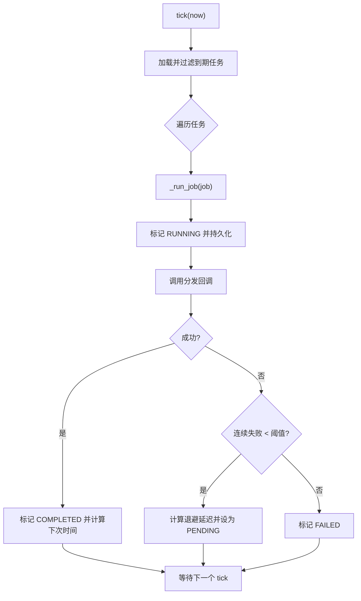

**图示来源**
- [agent/src/scheduled_research/executor.py:160-223](file://agent/src/scheduled_research/executor.py#L160-L223)
- [agent/src/scheduled_research/executor.py:266-323](file://agent/src/scheduled_research/executor.py#L266-L323)
- [agent/src/scheduled_research/executor.py:340-423](file://agent/src/scheduled_research/executor.py#L340-L423)

**章节来源**
- [agent/src/scheduled_research/executor.py:160-223](file://agent/src/scheduled_research/executor.py#L160-L223)
- [agent/src/scheduled_research/executor.py:266-323](file://agent/src/scheduled_research/executor.py#L266-L323)
- [agent/src/scheduled_research/executor.py:340-423](file://agent/src/scheduled_research/executor.py#L340-L423)

### 后台进程工具：进程组管理与超时
- 进程组启动
  - 在 Unix 上创建新会话，Windows 上使用新进程组，便于整组终止。
- 优雅终止
  - 先 SIGTERM，超时后 SIGKILL；收集 stdout/stderr 并截断以防 OOM。
- 取消与查询
  - 支持按 task_id 取消；查询返回状态、剩余超时、已用时长等。

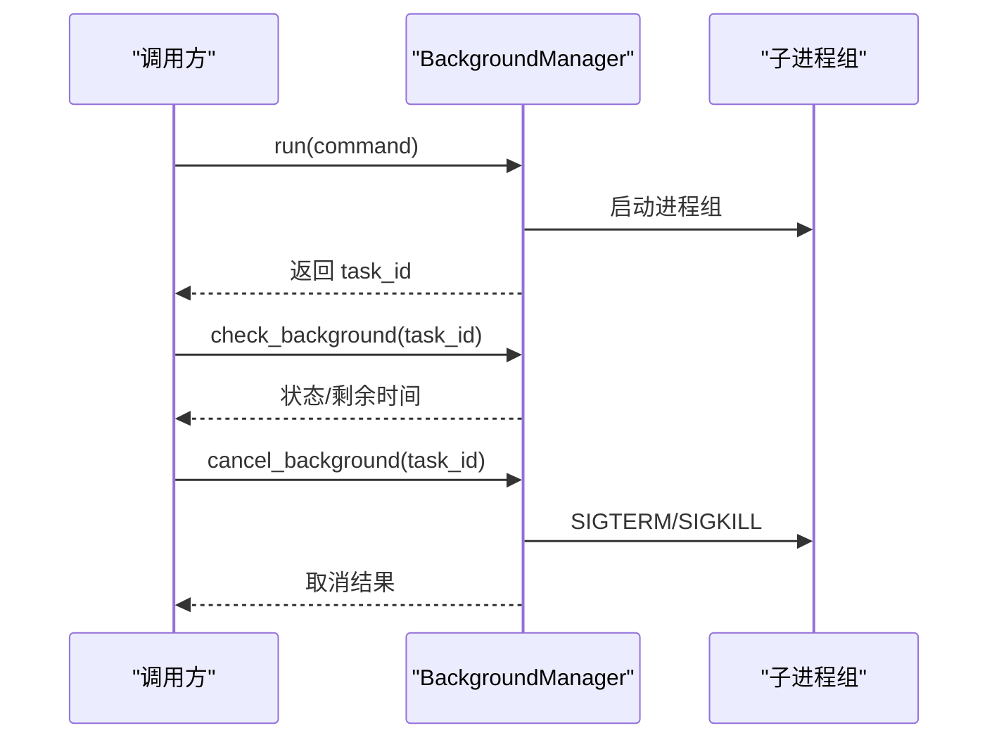

**图示来源**
- [agent/src/tools/background_tools.py:24-95](file://agent/src/tools/background_tools.py#L24-L95)
- [agent/src/tools/background_tools.py:110-139](file://agent/src/tools/background_tools.py#L110-L139)
- [agent/src/tools/background_tools.py:206-256](file://agent/src/tools/background_tools.py#L206-L256)
- [agent/src/tools/background_tools.py:258-305](file://agent/src/tools/background_tools.py#L258-L305)

**章节来源**
- [agent/src/tools/background_tools.py:24-95](file://agent/src/tools/background_tools.py#L24-L95)
- [agent/src/tools/background_tools.py:110-139](file://agent/src/tools/background_tools.py#L110-L139)
- [agent/src/tools/background_tools.py:206-256](file://agent/src/tools/background_tools.py#L206-L256)
- [agent/src/tools/background_tools.py:258-305](file://agent/src/tools/background_tools.py#L258-L305)

### 通道运行时：异步消息处理与队列
- 入站消费循环
  - 持续消费入站消息，为每条消息创建独立任务，加入任务集合以便清理。
- 状态与监控
  - 提供 status() 方法，返回运行状态、入/出站队列长度、会话数与通道状态。

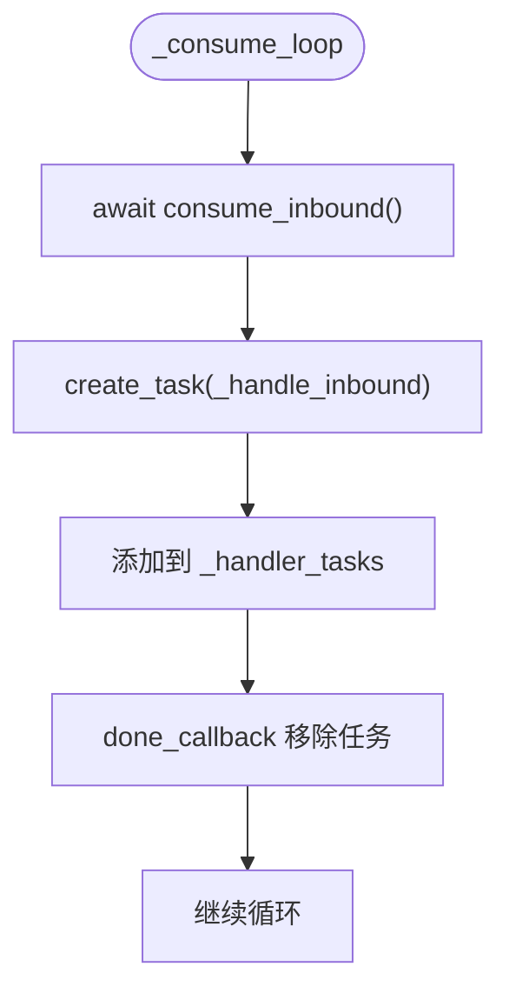

**图示来源**
- [agent/src/channels/runtime.py:114-119](file://agent/src/channels/runtime.py#L114-L119)
- [agent/src/channels/runtime.py:104-112](file://agent/src/channels/runtime.py#L104-L112)

**章节来源**
- [agent/src/channels/runtime.py:104-112](file://agent/src/channels/runtime.py#L104-L112)
- [agent/src/channels/runtime.py:114-119](file://agent/src/channels/runtime.py#L114-L119)

### 系统路由限流：滑动窗口与客户端隔离
- 滑动窗口限流
  - 按客户端 IP 维度维护预算，超出窗口最大请求数返回 429。
- 保护计算接口
  - 对相关性矩阵等重计算接口施加限流，避免资源争用。

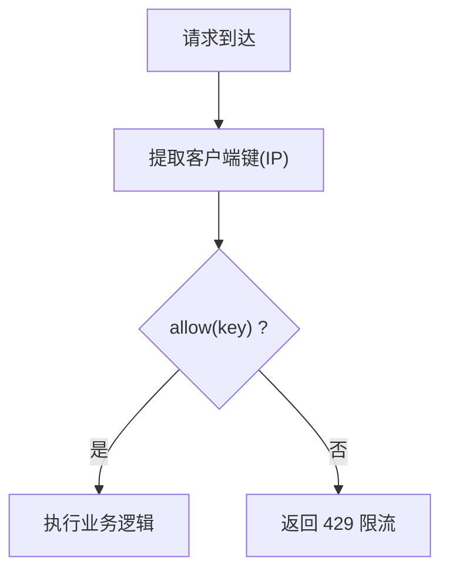

**图示来源**
- [agent/src/api/system_routes.py:316-337](file://agent/src/api/system_routes.py#L316-L337)

**章节来源**
- [agent/src/api/system_routes.py:316-337](file://agent/src/api/system_routes.py#L316-L337)

## 依赖关系分析
- 组件耦合
  - 会话服务依赖 AgentLoop 与事件总线；Swarm 运行时依赖任务存储与 Worker；定时执行器依赖持久化存储。
- 外部依赖
  - 线程池、队列、信号、子进程、异步事件等标准库与第三方库被广泛使用。
- 潜在环依赖
  - 各模块通过明确接口通信，未见明显循环导入；Swarm 运行时在启动时刷新 MCP 缓存以避免陈旧规格。

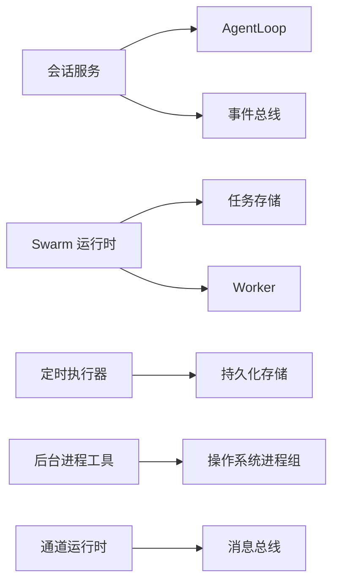

**图示来源**
- [agent/src/session/service.py:244-307](file://agent/src/session/service.py#L244-L307)
- [agent/src/swarm/runtime.py:222-386](file://agent/src/swarm/runtime.py#L222-L386)
- [agent/src/scheduled_research/executor.py:266-323](file://agent/src/scheduled_research/executor.py#L266-L323)
- [agent/src/tools/background_tools.py:24-95](file://agent/src/tools/background_tools.py#L24-L95)
- [agent/src/channels/runtime.py:114-119](file://agent/src/channels/runtime.py#L114-L119)

**章节来源**
- [agent/src/session/service.py:244-307](file://agent/src/session/service.py#L244-L307)
- [agent/src/swarm/runtime.py:222-386](file://agent/src/swarm/runtime.py#L222-L386)
- [agent/src/scheduled_research/executor.py:266-323](file://agent/src/scheduled_research/executor.py#L266-L323)
- [agent/src/tools/background_tools.py:24-95](file://agent/src/tools/background_tools.py#L24-L95)
- [agent/src/channels/runtime.py:114-119](file://agent/src/channels/runtime.py#L114-L119)

## 性能考量
- 线程池容量
  - 会话服务使用固定大小线程池（默认 4），避免线程爆炸；可根据 CPU 核数与 I/O 特性调优。
- 层级截止时间
  - Swarm 每层设置截止时间，防止个别任务拖慢整体吞吐；建议结合任务超时与重试策略评估。
- 输出截断
  - 后台进程输出截断至固定字符数，降低内存压力与序列化开销。
- 历史消息裁剪
  - 会话服务对历史消息按字符预算裁剪，减少上下文体积，提升 LLM 调用效率。
- 限流保护
  - 系统路由对重计算接口限流，保障高并发下的稳定性。

[本节为通用指导，不直接分析具体文件]

## 故障恢复与重试
- 会话取消与释放
  - 支持在注册表构建期或 AgentLoop 运行期取消；finally 确保释放占用，避免会话永久锁定。
- Swarm 任务重试
  - 任务失败自动重试，每次重试前清理工件目录，避免污染；累计 token 计数用于成本审计。
- 定时任务恢复
  - 启动时恢复“悬挂”的运行中任务，避免进程重启后的僵尸态；失败达到阈值后标记失败。
- 后台进程终止
  - 优雅终止流程：SIGTERM -> 超时 -> SIGKILL；取消请求立即标记并终止进程组。
- OAuth 令牌刷新锁
  - 使用文件锁序列化跨线程/进程的令牌刷新，避免竞态。

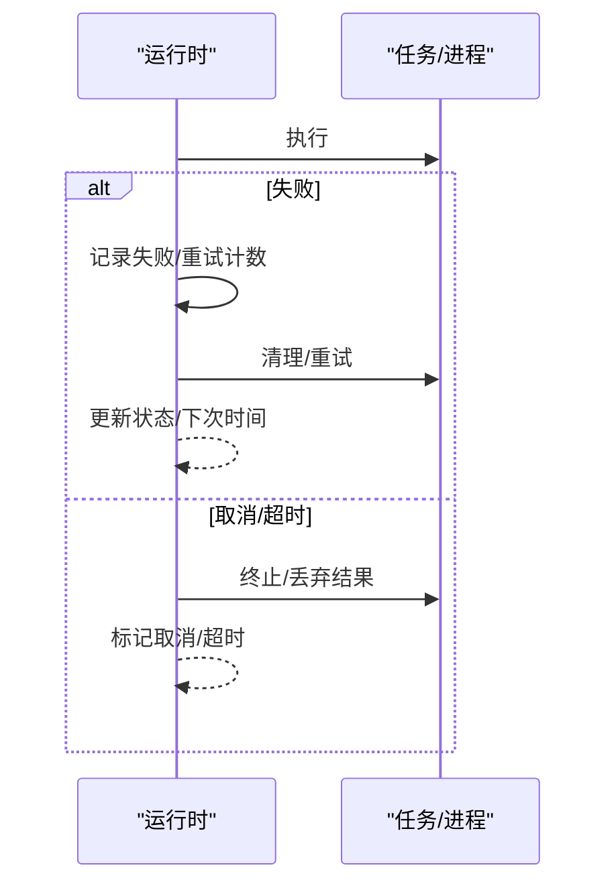

**图示来源**
- [agent/src/session/service.py:248-344](file://agent/src/session/service.py#L248-L344)
- [agent/src/swarm/runtime.py:647-748](file://agent/src/swarm/runtime.py#L647-L748)
- [agent/src/scheduled_research/executor.py:340-423](file://agent/src/scheduled_research/executor.py#L340-L423)
- [agent/src/tools/background_tools.py:73-95](file://agent/src/tools/background_tools.py#L73-L95)
- [agent/src/providers/openai_codex.py:138-175](file://agent/src/providers/openai_codex.py#L138-L175)

**章节来源**
- [agent/src/session/service.py:248-344](file://agent/src/session/service.py#L248-L344)
- [agent/src/swarm/runtime.py:647-748](file://agent/src/swarm/runtime.py#L647-L748)
- [agent/src/scheduled_research/executor.py:340-423](file://agent/src/scheduled_research/executor.py#L340-L423)
- [agent/src/tools/background_tools.py:73-95](file://agent/src/tools/background_tools.py#L73-L95)
- [agent/src/providers/openai_codex.py:138-175](file://agent/src/providers/openai_codex.py#L138-L175)

## 监控与指标
- 会话与尝试事件
  - 通过事件总线广播 attempt.started/completed/cancelled/failed 等事件，包含 elapsed_ms、模型信息等元数据。
- Swarm 事件
  - 层开始/结束、任务开始/完成/失败/阻塞/重试、运行开始/完成/错误等事件，附带 token 计数与迭代次数。
- 后台任务状态
  - 查询返回状态、命令摘要、退出码、已用时长、剩余超时等，便于前端展示与告警。
- 通道运行时状态
  - 返回运行标志、入/出站队列长度、会话数与通道状态，便于容量规划。
- 系统路由限流
  - 超限返回 429，可用于监控 API 健康与拥塞情况。

**章节来源**
- [agent/src/session/service.py:248-344](file://agent/src/session/service.py#L248-L344)
- [agent/src/swarm/runtime.py:380-423](file://agent/src/swarm/runtime.py#L380-L423)
- [agent/src/swarm/runtime.py:277-386](file://agent/src/swarm/runtime.py#L277-L386)
- [agent/src/tools/background_tools.py:258-305](file://agent/src/tools/background_tools.py#L258-L305)
- [agent/src/channels/runtime.py:104-112](file://agent/src/channels/runtime.py#L104-L112)
- [agent/src/api/system_routes.py:316-337](file://agent/src/api/system_routes.py#L316-L337)

## 配置与调优
- 最大并发数
  - 会话服务线程池大小（默认 4）：根据 CPU 与 I/O 特性调整，避免上下文切换开销过大。
  - Swarm 层内最大工作线程数：根据任务类型（CPU/IO）与资源限制调整。
- 超时设置
  - 后台进程命令超时（默认 300s）：根据任务预期耗时调整；必要时拆分任务。
  - Swarm 层截止时间：结合任务超时与重试次数设定，防止长尾拖垮。
- 队列大小
  - 通道运行时入/出站队列：监控队列长度，必要时扩容或引入背压。
- 重试与退避
  - 定时任务失败重试：调整基础延迟与最大延迟，平衡响应性与资源消耗。
- 限流参数
  - 系统路由滑动窗口：根据接口计算复杂度与后端容量调整 max_requests 与 window_seconds。

[本节为通用指导，不直接分析具体文件]

## 结论
该并发控制机制通过多层设计保障系统的稳定性与可扩展性：会话级互斥与固定线程池避免资源争用；Swarm 拓扑层并行与截止时间控制任务执行节奏；定时执行器提供可靠的任务调度与恢复；后台进程工具确保外部命令的可控执行；通道运行时与系统路由限流保障高并发下的服务质量。建议在部署时结合负载特征调优线程池、超时与重试参数，并通过事件与指标持续观测系统健康状态。