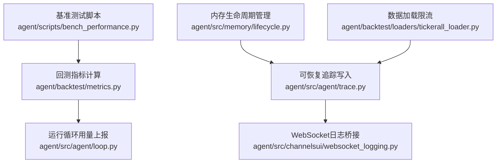
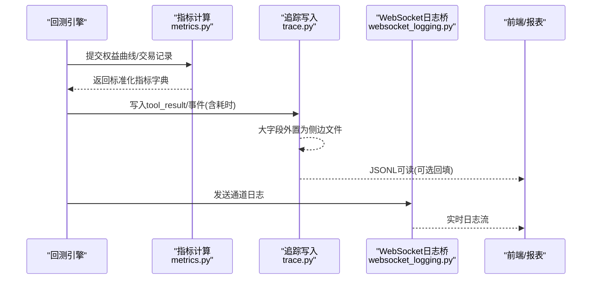
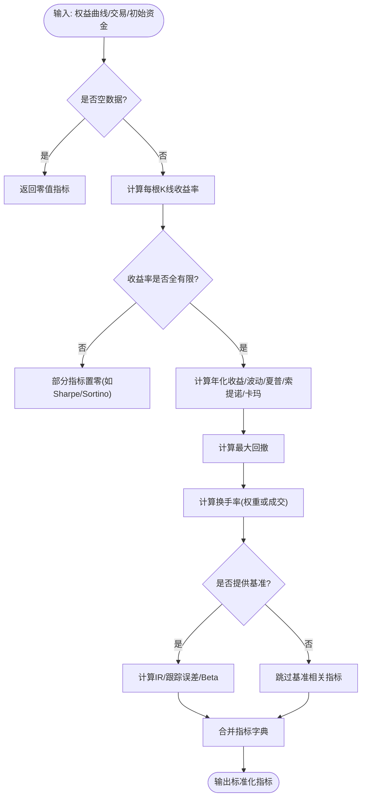
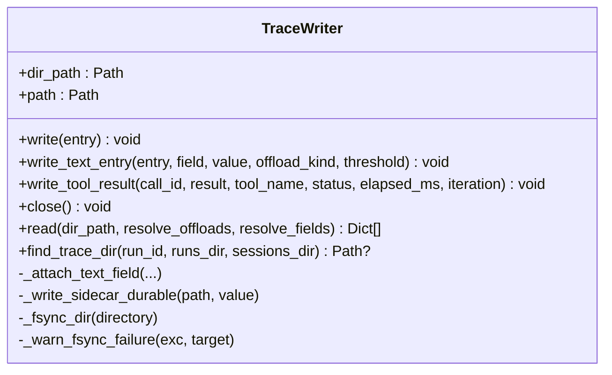
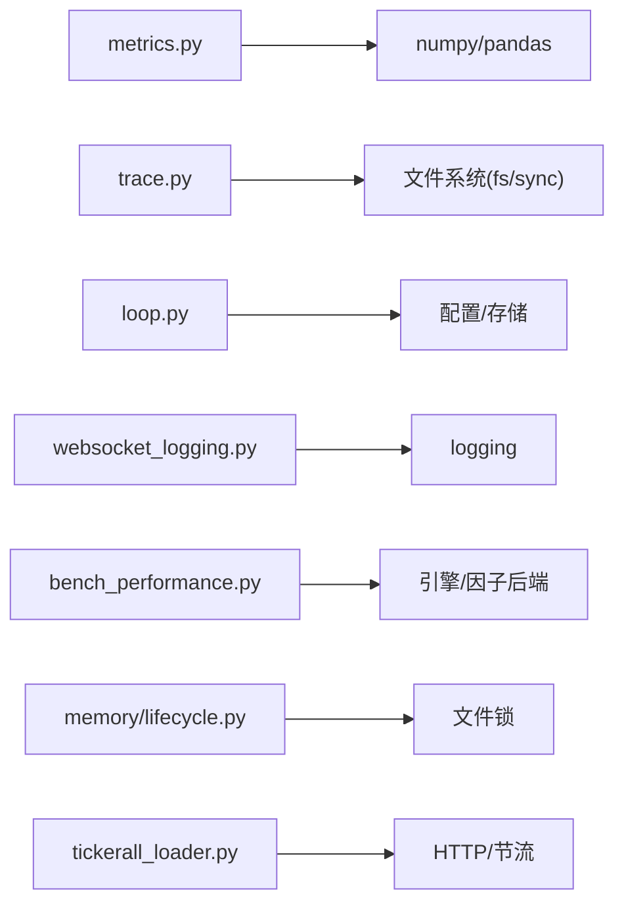

# 性能监控与调试

<cite>
**本文引用的文件**
- [agent/backtest/metrics.py](file://agent/backtest/metrics.py)
- [agent/src/agent/trace.py](file://agent/src/agent/trace.py)
- [agent/src/channelsui/websocket_logging.py](file://agent/src/channelsui/websocket_logging.py)
- [agent/scripts/bench_performance.py](file://agent/scripts/bench_performance.py)
- [agent/src/agent/loop.py](file://agent/src/agent/loop.py)
- [agent/src/memory/lifecycle.py](file://agent/src/memory/lifecycle.py)
- [agent/backtest/loaders/tickerall_loader.py](file://agent/backtest/loaders/tickerall_loader.py)
</cite>

## 目录
1. [简介](#简介)
2. [项目结构](#项目结构)
3. [核心组件](#核心组件)
4. [架构总览](#架构总览)
5. [详细组件分析](#详细组件分析)
6. [依赖关系分析](#依赖关系分析)
7. [性能考量](#性能考量)
8. [故障排查指南](#故障排查指南)
9. [结论](#结论)
10. [附录](#附录)

## 简介
本技术文档聚焦于“工具执行性能监控与调试”，围绕以下目标展开：
- 性能指标采集：执行时间统计、内存使用监控、CPU占用分析等关键指标的采集方法与落地位置。
- 日志记录机制：结构化日志、错误追踪、性能分析日志的写入、查询与回放方式。
- 调试工具与功能：断点调试、变量检查、调用栈跟踪等开发辅助手段的使用建议。
- 瓶颈识别与优化：慢查询分析、内存泄漏检测、并发争用分析的诊断技术与调优建议。
- 监控仪表板与报告：实时性能视图、历史趋势分析、性能对比报告的构建思路。
- 性能调优指南：参数优化、资源配置、架构调整的最佳实践。

## 项目结构
本项目在“回测指标计算”“可恢复追踪写入”“WebSocket日志桥接”“基准测试脚本”“运行循环中的用量上报”“内存生命周期管理”“数据加载限流”等模块中，提供了完整的性能观测与调试能力基础。

图表来源
- [agent/backtest/metrics.py:1-641](file://agent/backtest/metrics.py#L1-L641)
- [agent/src/agent/trace.py:1-408](file://agent/src/agent/trace.py#L1-L408)
- [agent/src/channelsui/websocket_logging.py:1-8](file://agent/src/channelsui/websocket_logging.py#L1-L8)
- [agent/scripts/bench_performance.py:1-134](file://agent/scripts/bench_performance.py#L1-L134)
- [agent/src/agent/loop.py:1490-1520](file://agent/src/agent/loop.py#L1490-L1520)
- [agent/src/memory/lifecycle.py:154-186](file://agent/src/memory/lifecycle.py#L154-L186)
- [agent/backtest/loaders/tickerall_loader.py:39-73](file://agent/backtest/loaders/tickerall_loader.py#L39-L73)

章节来源
- [agent/backtest/metrics.py:1-641](file://agent/backtest/metrics.py#L1-L641)
- [agent/src/agent/trace.py:1-408](file://agent/src/agent/trace.py#L1-L408)
- [agent/src/channelsui/websocket_logging.py:1-8](file://agent/src/channelsui/websocket_logging.py#L1-L8)
- [agent/scripts/bench_performance.py:1-134](file://agent/scripts/bench_performance.py#L1-L134)
- [agent/src/agent/loop.py:1490-1520](file://agent/src/agent/loop.py#L1490-L1520)
- [agent/src/memory/lifecycle.py:154-186](file://agent/src/memory/lifecycle.py#L154-L186)
- [agent/backtest/loaders/tickerall_loader.py:39-73](file://agent/backtest/loaders/tickerall_loader.py#L39-L73)

## 核心组件
- 回测指标计算（年化、收益、波动、最大回撤、夏普、索提诺、卡玛、换手率、基准对比）：提供统一口径的性能指标输出，便于横向对比与趋势分析。
- 可恢复追踪写入（JSONL + 侧边文件）：每条记录fsync落盘，大字段外置为侧边文件，支持安全读取与按需回填，保障崩溃后仍可回溯。
- WebSocket日志桥接：为通道适配器提供统一的日志命名空间，便于前端或外部系统订阅与展示。
- 基准测试脚本：对因子算子与权益计算路径进行微基准对比，量化向量化与循环路径的性能差异。
- 运行循环用量上报：在Agent循环中记录LLM用量增量并持久化到目标存储，用于成本与性能归因。
- 内存生命周期管理：访问计数、最后访问时间更新、垃圾回收流程，支撑内存使用监控与泄漏定位。
- 数据加载限流：通过进程级最小间隔门控与会话复用，降低网络抖动对性能的影响。

章节来源
- [agent/backtest/metrics.py:1-641](file://agent/backtest/metrics.py#L1-L641)
- [agent/src/agent/trace.py:1-408](file://agent/src/agent/trace.py#L1-L408)
- [agent/src/channelsui/websocket_logging.py:1-8](file://agent/src/channelsui/websocket_logging.py#L1-L8)
- [agent/scripts/bench_performance.py:1-134](file://agent/scripts/bench_performance.py#L1-L134)
- [agent/src/agent/loop.py:1490-1520](file://agent/src/agent/loop.py#L1490-L1520)
- [agent/src/memory/lifecycle.py:154-186](file://agent/src/memory/lifecycle.py#L154-L186)
- [agent/backtest/loaders/tickerall_loader.py:39-73](file://agent/backtest/loaders/tickerall_loader.py#L39-L73)

## 架构总览
下图展示了从数据采集（指标、追踪、日志）到消费（查询、可视化、告警）的整体链路。

图表来源
- [agent/backtest/metrics.py:461-626](file://agent/backtest/metrics.py#L461-L626)
- [agent/src/agent/trace.py:92-179](file://agent/src/agent/trace.py#L92-L179)
- [agent/src/channelsui/websocket_logging.py:1-8](file://agent/src/channelsui/websocket_logging.py#L1-L8)

## 详细组件分析

### 组件A：回测指标计算（年化、风险、换手率、基准对比）
- 设计要点
  - 年化因子按市场/周期映射，避免跨市场误年化。
  - 收益率序列对零/负价格做安全处理，避免inf/nan污染聚合。
  - 换手率支持“权重变化”和“成交证据”两种口径，保证与执行层一致。
  - 基准对比包含信息比率、跟踪误差、Beta，便于相对收益评估。
- 复杂度与性能
  - 主要操作为向量化的pandas/numpy计算，时间复杂度近似O(n)。
  - 小样本保护（ddof=1）避免单观测导致NaN扩散。
- 错误处理
  - 对非有限值、溢出、除零等边界条件进行防御性处理，确保指标稳定。
- 优化机会
  - 对超大数据集可考虑分块计算或延迟求值；减少中间对象创建。
  - 将频繁计算的年化因子缓存。

图表来源
- [agent/backtest/metrics.py:245-302](file://agent/backtest/metrics.py#L245-L302)
- [agent/backtest/metrics.py:461-626](file://agent/backtest/metrics.py#L461-L626)

章节来源
- [agent/backtest/metrics.py:1-641](file://agent/backtest/metrics.py#L1-L641)

### 组件B：可恢复追踪写入（JSONL + 侧边文件）
- 设计要点
  - 每条记录追加写入后立即flush/fsync，确保崩溃不丢记录。
  - 大字段（如工具结果、文本）外置为侧边文件，主记录仅保留预览与路径。
  - 侧边文件采用原子写入（临时文件→fsync→rename→目录fsync），避免半写。
  - 提供安全读取接口，可按需回填字段，避免一次性加载大对象。
- 性能与可靠性
  - fsync失败会降级为仅flush，并只警告一次，保证可用性。
  - 侧边文件路径校验防止越界读取。
- 适用场景
  - 工具调用耗时、状态、结果、错误堆栈、上下文快照等全量追踪。

图表来源
- [agent/src/agent/trace.py:64-179](file://agent/src/agent/trace.py#L64-L179)
- [agent/src/agent/trace.py:185-300](file://agent/src/agent/trace.py#L185-L300)
- [agent/src/agent/trace.py:302-408](file://agent/src/agent/trace.py#L302-L408)

章节来源
- [agent/src/agent/trace.py:1-408](file://agent/src/agent/trace.py#L1-L408)

### 组件C：WebSocket日志桥接
- 作用：为通道适配器提供统一的日志命名空间，便于前端或外部系统订阅。
- 特点：轻量桥接，集中日志源名，利于过滤与路由。

章节来源
- [agent/src/channelsui/websocket_logging.py:1-8](file://agent/src/channelsui/websocket_logging.py#L1-L8)

### 组件D：基准测试脚本（算子与权益计算）
- 作用：对比旧/新实现或不同路径（向量化 vs 循环）的性能差异。
- 用法：生成随机数据，重复执行多次，统计平均耗时与加速比。
- 扩展：可加入内存/CPU采样钩子，形成回归门禁。

章节来源
- [agent/scripts/bench_performance.py:1-134](file://agent/scripts/bench_performance.py#L1-L134)

### 组件E：运行循环中的用量上报
- 作用：在每次迭代中汇总LLM用量增量，并持久化到目标存储，用于成本与性能归因。
- 关键点：增量计算、去重、与目标会话/目标的关联。

章节来源
- [agent/src/agent/loop.py:1490-1520](file://agent/src/agent/loop.py#L1490-L1520)

### 组件F：内存生命周期管理
- 作用：记录条目访问次数与最后访问时间，支持垃圾回收策略与内存健康度评估。
- 价值：结合追踪与指标，定位热点与潜在泄漏。

章节来源
- [agent/src/memory/lifecycle.py:154-186](file://agent/src/memory/lifecycle.py#L154-L186)

### 组件G：数据加载限流与会话复用
- 作用：通过进程级最小间隔门控与会话复用，降低网络抖动与速率限制影响。
- 价值：提升稳定性与吞吐，减少超时与重试开销。

章节来源
- [agent/backtest/loaders/tickerall_loader.py:39-73](file://agent/backtest/loaders/tickerall_loader.py#L39-L73)

## 依赖关系分析
- 指标计算依赖pandas/numpy，强调向量化与数值稳定性。
- 追踪写入依赖文件系统API，强调原子性与fsync语义。
- WebSocket日志桥接依赖标准logging，便于统一接入。
- 基准脚本依赖具体引擎与因子后端，用于回归验证。
- 运行循环依赖配置与存储，用于用量持久化。
- 内存生命周期依赖文件系统与锁，保证并发安全。
- 数据加载器依赖HTTP客户端与共享节流器。

图表来源
- [agent/backtest/metrics.py:1-641](file://agent/backtest/metrics.py#L1-L641)
- [agent/src/agent/trace.py:1-408](file://agent/src/agent/trace.py#L1-L408)
- [agent/src/agent/loop.py:1490-1520](file://agent/src/agent/loop.py#L1490-L1520)
- [agent/src/channelsui/websocket_logging.py:1-8](file://agent/src/channelsui/websocket_logging.py#L1-L8)
- [agent/scripts/bench_performance.py:1-134](file://agent/scripts/bench_performance.py#L1-L134)
- [agent/src/memory/lifecycle.py:154-186](file://agent/src/memory/lifecycle.py#L154-L186)
- [agent/backtest/loaders/tickerall_loader.py:39-73](file://agent/backtest/loaders/tickerall_loader.py#L39-L73)

## 性能考量
- 指标计算
  - 优先向量化计算，避免逐行循环；对小样本进行保护，避免NaN传播。
  - 年化因子按市场/周期精确映射，避免跨市场偏差。
- 追踪写入
  - 大字段外置，避免主记录膨胀；fsync失败降级为flush，保持可用。
  - 侧边文件原子写入，避免半写与损坏。
- 日志与上报
  - 统一日志命名空间，便于过滤与聚合；用量增量上报避免重复计费。
- 数据加载
  - 进程级最小间隔与会话复用，降低网络抖动与限流影响。
- 基准测试
  - 固定随机种子，重复执行取均值；对比不同路径的加速比。

[本节为通用指导，无需特定文件引用]

## 故障排查指南
- 慢查询分析
  - 使用追踪记录的elapsed_ms字段定位慢工具调用；结合工具名称与call_id检索对应侧边结果。
  - 对高频慢调用进行热点分析，必要时引入缓存或批处理。
- 内存泄漏检测
  - 结合内存生命周期中的access_count与last_accessed，识别长期未释放或异常增长的条目。
  - 定期运行GC并观察内存占用趋势，配合追踪回放定位泄漏点。
- 并发争用分析
  - 关注数据加载器的节流与会话复用，避免过度并发导致的限流与超时。
  - 对文件写入路径（追踪、侧边文件）检查fsync失败日志，确认磁盘I/O瓶颈。
- 指标异常排查
  - 当收益率出现inf/nan时，检查bar_returns的安全处理逻辑与数据质量。
  - 对年化收益溢出情况，确认增长过快导致的数值溢出保护。

章节来源
- [agent/src/agent/trace.py:92-179](file://agent/src/agent/trace.py#L92-L179)
- [agent/src/memory/lifecycle.py:154-186](file://agent/src/memory/lifecycle.py#L154-L186)
- [agent/backtest/loaders/tickerall_loader.py:39-73](file://agent/backtest/loaders/tickerall_loader.py#L39-L73)
- [agent/backtest/metrics.py:245-302](file://agent/backtest/metrics.py#L245-L302)

## 结论
本项目在性能监控与调试方面具备扎实的基础设施：标准化的回测指标、可恢复的追踪写入、统一的日志桥接、可复现的基准测试、用量上报与内存生命周期管理。通过这些组件的组合，可以构建从采集、存储、查询到可视化的完整性能观测闭环，并支撑慢查询定位、内存泄漏检测与并发争用分析等诊断任务。

[本节为总结性内容，无需特定文件引用]

## 附录

### 指标字典字段说明（来自指标计算）
- final_value：期末净值
- total_return：累计收益
- annual_return：年化收益
- max_drawdown：最大回撤
- sharpe：夏普比率
- calmar：卡玛比率
- sortino：索提诺比率
- win_rate：胜率
- profit_loss_ratio：盈亏比
- profit_factor：利润因子
- max_consecutive_loss：最大连续亏损次数
- avg_holding_days：平均持仓周期（以K线计）
- trade_count：交易笔数
- benchmark_return：基准收益
- excess_return：超额收益
- information_ratio：信息比率
- tracking_error：跟踪误差
- benchmark_beta：基准Beta
- avg_turnover：平均换手率
- total_turnover：累计换手率

章节来源
- [agent/backtest/metrics.py:674-695](file://agent/backtest/metrics.py#L674-L695)

### 追踪记录关键字段（来自追踪写入）
- type：记录类型（如tool_result）
- iter：当前迭代编号
- tool：工具名称
- call_id：调用ID
- status：状态（ok/error）
- elapsed_ms：执行耗时（毫秒）
- preview/result_preview：大字段预览
- result_path/tool-result路径：侧边文件路径
- result_size：大字段大小

章节来源
- [agent/src/agent/trace.py:142-179](file://agent/src/agent/trace.py#L142-L179)

### WebSocket日志命名空间
- 命名空间：src.channelsui.websocket
- 用途：统一通道适配器的日志来源，便于前端或外部系统订阅与过滤。

章节来源
- [agent/src/channelsui/websocket_logging.py:1-8](file://agent/src/channelsui/websocket_logging.py#L1-L8)

### 基准测试要点
- 固定随机种子，保证可重复性。
- 预热执行，排除首次加载开销。
- 多轮执行取均值，计算加速比。
- 可扩展至内存/CPU采样，形成回归门禁。

章节来源
- [agent/scripts/bench_performance.py:19-116](file://agent/scripts/bench_performance.py#L19-L116)

### 运行循环用量上报
- 记录每次迭代的LLM用量增量，并与会话/目标关联。
- 用于成本归因与性能对比。

章节来源
- [agent/src/agent/loop.py:1490-1520](file://agent/src/agent/loop.py#L1490-L1520)

### 内存生命周期管理
- 访问计数与最后访问时间更新，支持GC与热点分析。
- 结合追踪与指标，定位潜在泄漏与低效路径。

章节来源
- [agent/src/memory/lifecycle.py:154-186](file://agent/src/memory/lifecycle.py#L154-L186)

### 数据加载限流
- 进程级最小间隔与会话复用，降低网络抖动与限流影响。
- 提升稳定性与吞吐，减少超时与重试开销。

章节来源
- [agent/backtest/loaders/tickerall_loader.py:39-73](file://agent/backtest/loaders/tickerall_loader.py#L39-L73)