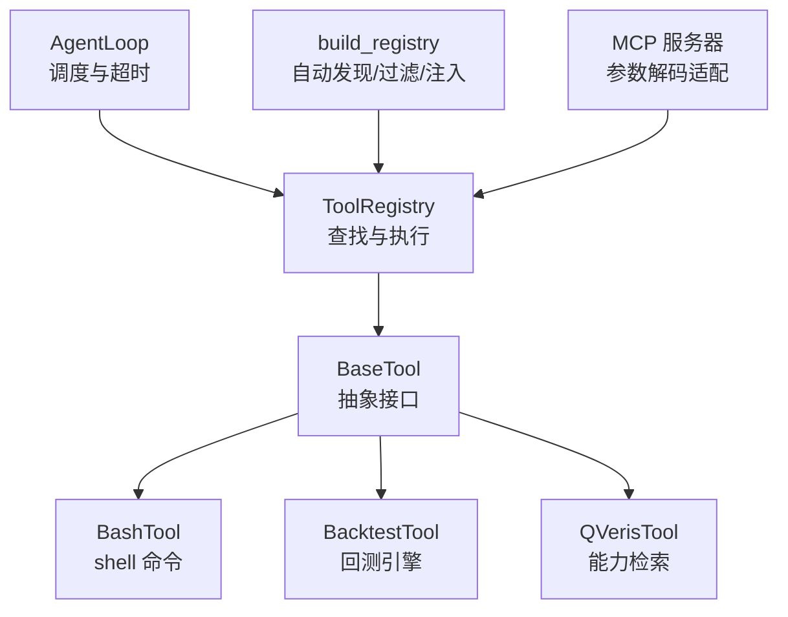
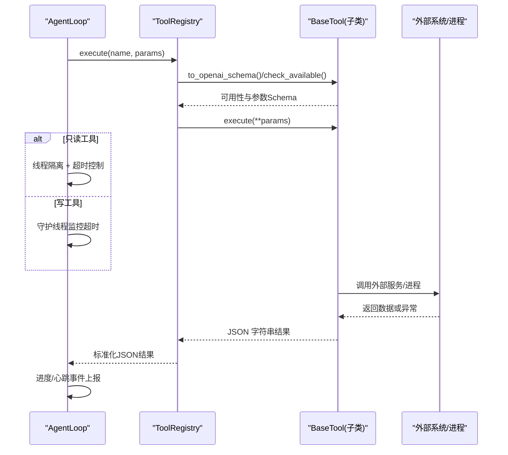
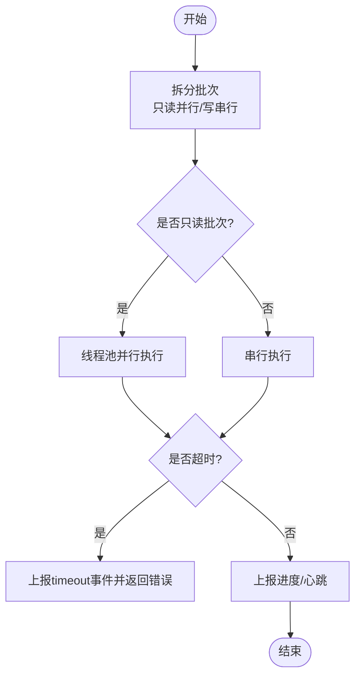
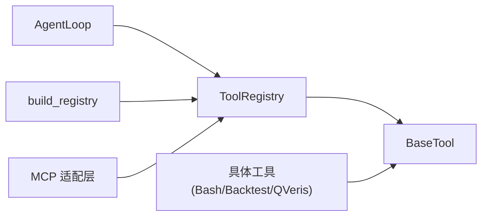
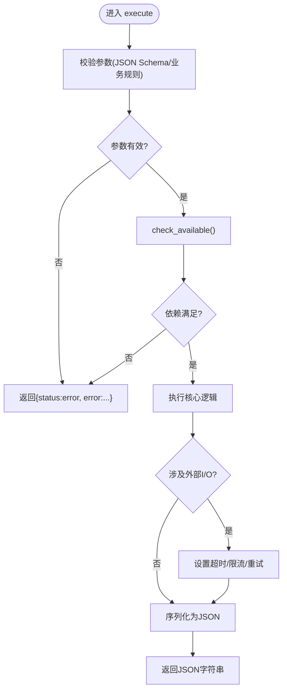

# 执行流程管理

<cite>
**本文引用的文件**
- [agent/src/agent/tools.py](file://agent/src/agent/tools.py)
- [agent/src/tools/__init__.py](file://agent/src/tools/__init__.py)
- [agent/src/agent/loop.py](file://agent/src/agent/loop.py)
- [agent/src/tools/bash_tool.py](file://agent/src/tools/bash_tool.py)
- [agent/src/tools/backtest_tool.py](file://agent/src/tools/backtest_tool.py)
- [agent/src/tools/qveris_tool.py](file://agent/src/tools/qveris_tool.py)
- [agent/mcp_server.py](file://agent/mcp_server.py)
</cite>

## 目录
1. [简介](#简介)
2. [项目结构](#项目结构)
3. [核心组件](#核心组件)
4. [架构总览](#架构总览)
5. [详细组件分析](#详细组件分析)
6. [依赖关系分析](#依赖关系分析)
7. [性能考虑](#性能考虑)
8. [故障排查指南](#故障排查指南)
9. [结论](#结论)
10. [附录](#附录)

## 简介
本文件面向“工具执行流程管理”的技术文档，聚焦于工具调用的完整生命周期：参数解析与校验、依赖检查、执行调度（同步/异步）、结果序列化、错误处理与重试策略。重点解释 BaseTool 抽象类的设计模式与 ToolRegistry 注册表的工作原理，并给出自定义工具 execute 方法的实现要点与最佳实践。

## 项目结构
围绕工具执行的核心代码主要分布在以下位置：
- 基础框架：BaseTool 与 ToolRegistry 定义在 agent/src/agent/tools.py
- 自动发现与装配：src/tools/__init__.py 提供 build_registry 等构建器，负责扫描、过滤、注入上下文并合并 MCP 远程工具
- 执行编排：agent/src/agent/loop.py 中的 AgentLoop 负责批处理、并行/串行调度、超时控制与事件上报
- 具体工具示例：bash_tool.py、backtest_tool.py、qveris_tool.py 展示不同场景的 execute 实现
- MCP 集成：agent/mcp_server.py 对 JSON Schema 容器类型进行参数解码适配

**图表来源**
- [agent/src/agent/loop.py:2572-2650](file://agent/src/agent/loop.py#L2572-L2650)
- [agent/src/agent/tools.py:13-94](file://agent/src/agent/tools.py#L13-L94)
- [agent/src/tools/__init__.py:66-245](file://agent/src/tools/__init__.py#L66-L245)
- [agent/src/tools/bash_tool.py:16-84](file://agent/src/tools/bash_tool.py#L16-L84)
- [agent/src/tools/backtest_tool.py:166-183](file://agent/src/tools/backtest_tool.py#L166-L183)
- [agent/src/tools/qveris_tool.py:399-436](file://agent/src/tools/qveris_tool.py#L399-L436)
- [agent/mcp_server.py:440-471](file://agent/mcp_server.py#L440-L471)

**章节来源**
- [agent/src/agent/tools.py:13-94](file://agent/src/agent/tools.py#L13-L94)
- [agent/src/tools/__init__.py:66-245](file://agent/src/tools/__init__.py#L66-L245)
- [agent/src/agent/loop.py:2572-2650](file://agent/src/agent/loop.py#L2572-L2650)

## 核心组件
- BaseTool：定义工具契约（name/description/parameters/repeatable/is_readonly），提供 check_available 钩子用于依赖检查，to_openai_schema 将参数转为函数调用描述；execute 为必须实现的执行入口，返回 JSON 字符串。
- ToolRegistry：维护 name→tool 映射，提供 get/get_definitions/execute 等方法；execute 保证始终返回合法 JSON，并在异常时捕获并格式化错误信息。
- build_registry：自动发现 src/tools 下所有 BaseTool 子类，按策略过滤（如 shell 工具开关）、调用 check_available、注入 session_id/persistent_memory 等上下文，并可选追加 MCP 远程工具。
- AgentLoop._batch_execute/_invoke_tool：将工具调用拆分为只读批量并行与写操作串行，统一超时控制、心跳/进度事件上报，以及最终结果封装。

**章节来源**
- [agent/src/agent/tools.py:13-94](file://agent/src/agent/tools.py#L13-L94)
- [agent/src/tools/__init__.py:33-63](file://agent/src/tools/__init__.py#L33-L63)
- [agent/src/tools/__init__.py:66-245](file://agent/src/tools/__init__.py#L66-L245)
- [agent/src/agent/loop.py:2572-2650](file://agent/src/agent/loop.py#L2572-L2650)
- [agent/src/agent/loop.py:1709-1881](file://agent/src/agent/loop.py#L1709-L1881)

## 架构总览
下图展示了从 AgentLoop 发起工具调用到具体工具执行的完整链路，包括参数校验、依赖检查、执行调度、结果序列化与错误处理。

**图表来源**
- [agent/src/agent/loop.py:1709-1881](file://agent/src/agent/loop.py#L1709-L1881)
- [agent/src/agent/tools.py:54-94](file://agent/src/agent/tools.py#L54-L94)
- [agent/src/tools/__init__.py:136-153](file://agent/src/tools/__init__.py#L136-L153)

## 详细组件分析

### BaseTool 抽象类与契约
- 设计要点
  - 通过 name/description/parameters 暴露给 LLM/MCP 的工具元信息
  - is_readonly 标记是否可安全并行执行
  - repeatable 允许重复调用
  - check_available 用于依赖检查（如 API Key、包可用性）
  - to_openai_schema 生成函数调用描述，便于 LLM 选择工具
  - execute 必须返回 JSON 字符串，确保上层统一解析

- 复杂度
  - 方法均为 O(1)，无复杂数据结构

- 错误处理
  - 由 ToolRegistry.execute 统一捕获异常并包装为标准错误 JSON

**章节来源**
- [agent/src/agent/tools.py:13-51](file://agent/src/agent/tools.py#L13-L51)
- [agent/src/agent/tools.py:54-94](file://agent/src/agent/tools.py#L54-L94)

### ToolRegistry 注册表工作原理
- 功能
  - register/get/get_definitions/execute/tool_names
  - execute 保证返回值始终为合法 JSON，未找到工具或执行异常均返回结构化错误

- 扩展点
  - 可通过 build_registry 自动发现并注入上下文（session_id、persistent_memory）
  - 支持合并 MCP 远程工具，且每个服务器失败不影响其他服务器

**章节来源**
- [agent/src/agent/tools.py:54-94](file://agent/src/agent/tools.py#L54-L94)
- [agent/src/tools/__init__.py:136-245](file://agent/src/tools/__init__.py#L136-L245)

### 自动发现与装配（build_registry）
- 自动发现
  - 遍历 src/tools 包模块，收集 BaseTool 子类并缓存
- 过滤与注入
  - 根据 include_shell_tools 决定是否包含 shell 工具
  - 调用 check_available 排除不可用工具
  - 向特定工具注入 session_id、event_callback、persistent_memory
- MCP 集成
  - 当配置存在 mcp_servers 时，构建远程工具包装并注册
  - 对 live broker 做额外鉴权与隐藏策略

**章节来源**
- [agent/src/tools/__init__.py:33-63](file://agent/src/tools/__init__.py#L33-L63)
- [agent/src/tools/__init__.py:66-245](file://agent/src/tools/__init__.py#L66-L245)

### 执行调度与批处理（AgentLoop）
- 批处理策略
  - 将连续只读工具归并为一批并行执行，写工具串行执行
- 超时与心跳
  - 只读工具使用工作线程+队列，超时会丢弃后续结果并上报 timeout 事件
  - 写工具不直接中断，但会发出 timeout_warning 直至完成
- 事件上报
  - tool_progress/tool_heartbeat 统一通过 _emit 推送

**图表来源**
- [agent/src/agent/loop.py:2572-2650](file://agent/src/agent/loop.py#L2572-L2650)
- [agent/src/agent/loop.py:1709-1881](file://agent/src/agent/loop.py#L1709-L1881)

**章节来源**
- [agent/src/agent/loop.py:2572-2650](file://agent/src/agent/loop.py#L2572-L2650)
- [agent/src/agent/loop.py:1709-1881](file://agent/src/agent/loop.py#L1709-L1881)

### 参数解析与类型检查
- JSON Schema 驱动
  - 工具通过 parameters 声明参数类型、必填项、枚举等，供 LLM/MCP 客户端校验
- MCP 参数解码
  - 对于声明为 array/object 的参数，MCP 层会将 JSON 字符串解码为 Python 列表/字典，避免客户端传参格式不一致导致的解析失败

**章节来源**
- [agent/src/agent/tools.py:56-65](file://agent/src/agent/tools.py#L56-L65)
- [agent/mcp_server.py:440-471](file://agent/mcp_server.py#L440-L471)
- [agent/mcp_server.py:2524-2560](file://agent/mcp_server.py#L2524-L2560)

### 依赖检查（check_available）
- 用途
  - 在注册阶段判断工具是否可用（例如缺失 API Key、第三方库未安装）
- 行为
  - 返回 False 的工具会被静默跳过，不会进入注册表

**章节来源**
- [agent/src/agent/tools.py:43-50](file://agent/src/agent/tools.py#L43-L50)
- [agent/src/tools/__init__.py:136-153](file://agent/src/tools/__init__.py#L136-L153)

### 执行模式：同步 vs 异步
- 同步执行
  - 写工具默认在主线程执行，不会被强制中断，仅记录超时警告
- 异步执行
  - 只读工具在工作线程中执行，支持超时终止与结果丢弃，避免阻塞主流程
- 选择策略
  - 基于 is_readonly 标志决定执行路径；只读优先并行，写操作串行保障一致性

**章节来源**
- [agent/src/agent/loop.py:1709-1881](file://agent/src/agent/loop.py#L1709-L1881)

### 结果序列化与错误处理
- 统一返回
  - 所有工具返回 JSON 字符串，便于上层统一解析
- 错误封装
  - ToolRegistry.execute 捕获异常并返回标准错误结构
  - 工具内部也建议显式返回 {status:"error", error:...} 以传递业务错误
- 超时处理
  - 只读工具超时会返回带 error_code 的错误结构；写工具持续等待完成并上报警告

**章节来源**
- [agent/src/agent/tools.py:72-84](file://agent/src/agent/tools.py#L72-L84)
- [agent/src/agent/loop.py:1709-1881](file://agent/src/agent/loop.py#L1709-L1881)

### 自定义工具实现指南（execute 方法）
- 基本步骤
  - 继承 BaseTool，声明 name/description/parameters/is_readonly/repeatable
  - 实现 execute(**kwargs) -> str，返回 JSON 字符串
  - 如需依赖检查，重写 check_available()
- 推荐实践
  - 严格校验输入参数，缺失或类型不符立即返回错误结构
  - 对外部 I/O 设置合理超时，捕获异常并转换为错误结构
  - 输出尽量精简，必要时截断大文本
- 参考实现
  - BashTool：命令行执行、安全检测、超时与输出限制
  - BacktestTool：配置文件校验、调用回测引擎、产物收集
  - QVerisTool：参数校验、配置检查、分页与限流

**章节来源**
- [agent/src/tools/bash_tool.py:16-84](file://agent/src/tools/bash_tool.py#L16-L84)
- [agent/src/tools/backtest_tool.py:166-183](file://agent/src/tools/backtest_tool.py#L166-L183)
- [agent/src/tools/qveris_tool.py:399-436](file://agent/src/tools/qveris_tool.py#L399-L436)

## 依赖关系分析
- 组件耦合
  - AgentLoop 依赖 ToolRegistry 进行工具查找与执行
  - ToolRegistry 依赖 BaseTool 抽象契约
  - build_registry 依赖自动发现机制与 MCP 适配器
- 外部依赖
  - 各工具可能依赖外部服务（数据库、API、进程），通过 check_available 与内部 try/except 进行防护

**图表来源**
- [agent/src/agent/loop.py:2572-2650](file://agent/src/agent/loop.py#L2572-L2650)
- [agent/src/agent/tools.py:13-94](file://agent/src/agent/tools.py#L13-L94)
- [agent/src/tools/__init__.py:66-245](file://agent/src/tools/__init__.py#L66-L245)
- [agent/src/tools/bash_tool.py:16-84](file://agent/src/tools/bash_tool.py#L16-L84)
- [agent/src/tools/backtest_tool.py:166-183](file://agent/src/tools/backtest_tool.py#L166-L183)
- [agent/src/tools/qveris_tool.py:399-436](file://agent/src/tools/qveris_tool.py#L399-L436)

**章节来源**
- [agent/src/agent/tools.py:13-94](file://agent/src/agent/tools.py#L13-L94)
- [agent/src/tools/__init__.py:66-245](file://agent/src/tools/__init__.py#L66-L245)

## 性能考虑
- 并行化
  - 只读工具批量并行，显著降低端到端延迟
- 超时控制
  - 只读工具线程级超时，防止长尾任务阻塞
- 资源限制
  - 工具内部应限制输出大小、设置进程/网络超时
- 事件流
  - 心跳与进度事件有助于前端/CLI 实时反馈，减少用户感知延迟

[本节为通用指导，无需特定文件引用]

## 故障排查指南
- 常见问题
  - 工具未注册：检查 name 是否为空、check_available 是否返回 True、是否被 shell 工具策略禁用
  - 参数错误：确认 JSON Schema 与传入参数一致，MCP 层已对容器类型进行解码
  - 执行超时：只读工具会返回超时错误；写工具会持续运行并上报警告
  - 外部依赖缺失：实现 check_available 提前拦截，或在 execute 中捕获并返回错误结构
- 定位建议
  - 查看 ToolRegistry.execute 日志与返回的错误结构
  - 关注 AgentLoop 的 tool_progress/tool_heartbeat 事件，定位卡点
  - 对工具内部 I/O 增加日志与超时保护

**章节来源**
- [agent/src/agent/tools.py:72-84](file://agent/src/agent/tools.py#L72-L84)
- [agent/src/agent/loop.py:1709-1881](file://agent/src/agent/loop.py#L1709-L1881)

## 结论
该工具执行框架通过 BaseTool 契约与 ToolRegistry 注册表实现了可扩展、可观测、可管控的工具生态。AgentLoop 提供了批处理、并行/串行调度与超时控制，结合 JSON Schema 与 MCP 参数解码，保证了跨系统的参数一致性与健壮性。遵循本文档的实践，可快速实现高质量、易维护的自定义工具。

[本节为总结，无需特定文件引用]

## 附录
- 关键流程图（算法视角）

**图表来源**
- [agent/src/agent/tools.py:43-65](file://agent/src/agent/tools.py#L43-L65)
- [agent/src/tools/bash_tool.py:36-84](file://agent/src/tools/bash_tool.py#L36-L84)
- [agent/src/tools/backtest_tool.py:15-74](file://agent/src/tools/backtest_tool.py#L15-L74)
- [agent/src/tools/qveris_tool.py:415-436](file://agent/src/tools/qveris_tool.py#L415-L436)