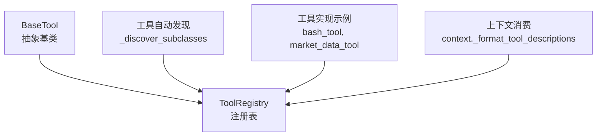
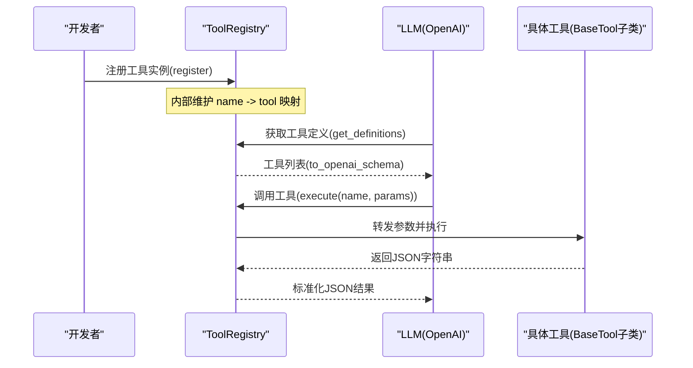
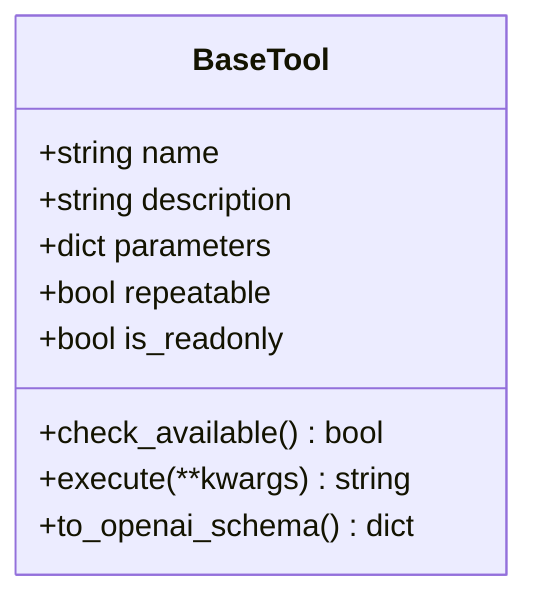
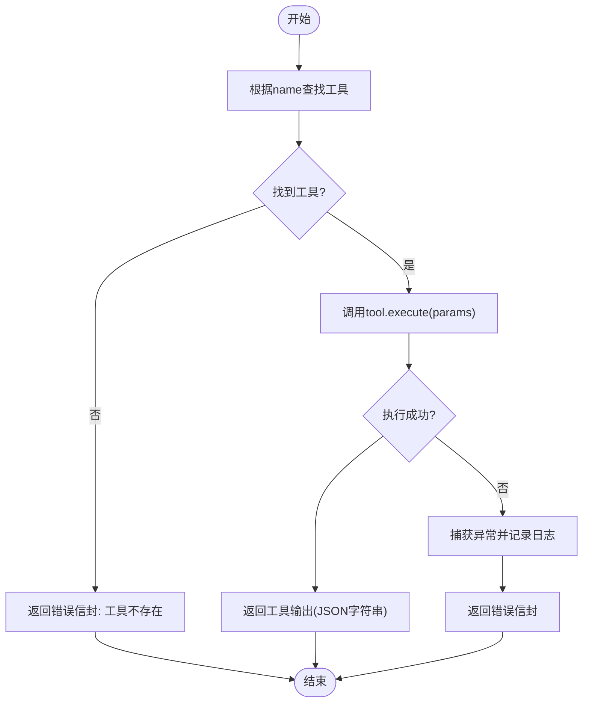
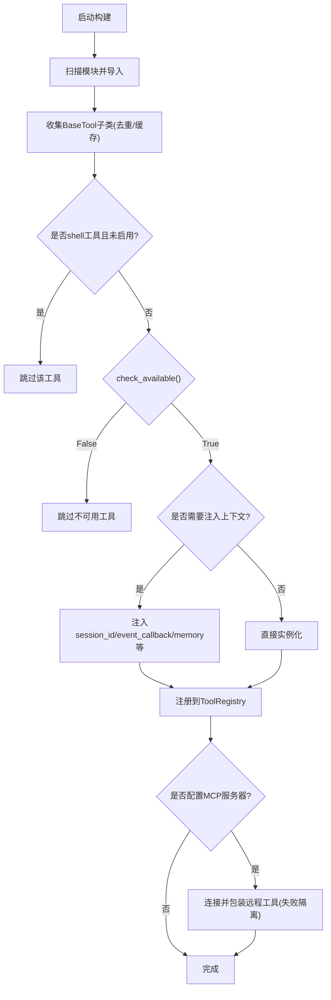
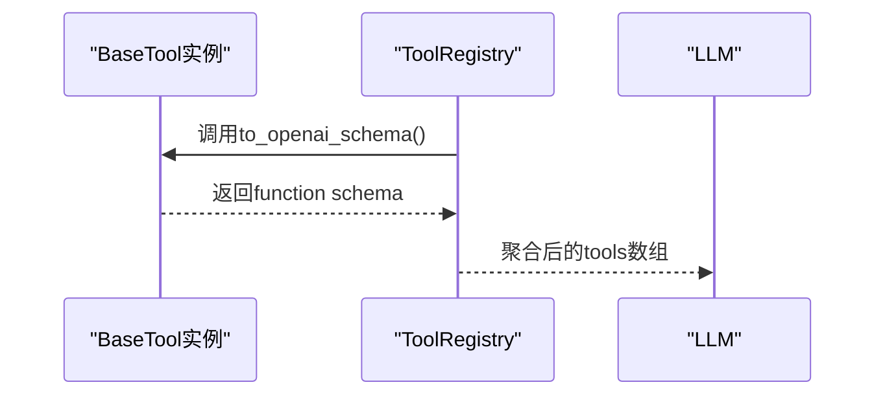
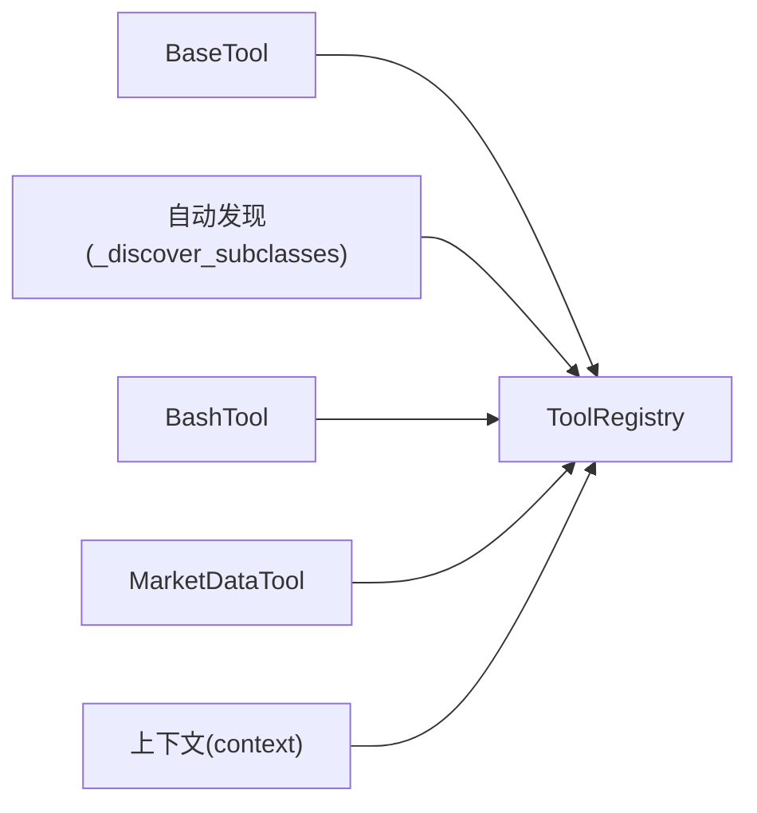

# 工具注册机制

<cite>
**本文引用的文件**
- [agent/src/agent/tools.py](file://agent/src/agent/tools.py)
- [agent/src/tools/__init__.py](file://agent/src/tools/__init__.py)
- [agent/src/tools/bash_tool.py](file://agent/src/tools/bash_tool.py)
- [agent/src/tools/market_data_tool.py](file://agent/src/tools/market_data_tool.py)
- [agent/src/agent/context.py](file://agent/src/agent/context.py)
</cite>

## 目录
1. [简介](#简介)
2. [项目结构](#项目结构)
3. [核心组件](#核心组件)
4. [架构总览](#架构总览)
5. [详细组件分析](#详细组件分析)
6. [依赖关系分析](#依赖关系分析)
7. [性能考虑](#性能考虑)
8. [故障排查指南](#故障排查指南)
9. [结论](#结论)
10. [附录：自定义工具开发指南](#附录自定义工具开发指南)

## 简介
本技术文档聚焦于“工具注册机制”，系统性阐述 BaseTool 抽象基类与 ToolRegistry 动态注册、查找与执行流程，解释工具生命周期管理（可用性检查、依赖校验）、OpenAI 函数调用格式转换机制（to_openai_schema），并提供自定义工具开发的最佳实践与扩展性设计建议。

## 项目结构
工具基础设施位于 agent/src/agent/tools.py，工具自动发现与构建逻辑位于 agent/src/tools/__init__.py，具体工具实现散落在 agent/src/tools 下的各模块中。上下文层在 agent/src/agent/context.py 中消费工具定义以生成提示词。

**图表来源**
- [agent/src/agent/tools.py:13-94](file://agent/src/agent/tools.py#L13-L94)
- [agent/src/tools/__init__.py:33-63](file://agent/src/tools/__init__.py#L33-L63)
- [agent/src/tools/bash_tool.py:16-34](file://agent/src/tools/bash_tool.py#L16-L34)
- [agent/src/tools/market_data_tool.py:11-95](file://agent/src/tools/market_data_tool.py#L11-L95)
- [agent/src/agent/context.py:392-412](file://agent/src/agent/context.py#L392-L412)

**章节来源**
- [agent/src/agent/tools.py:13-94](file://agent/src/agent/tools.py#L13-L94)
- [agent/src/tools/__init__.py:33-63](file://agent/src/tools/__init__.py#L33-L63)

## 核心组件
- BaseTool：所有工具的抽象基类，定义 name、description、parameters、repeatable、is_readonly 等核心属性，以及 check_available、execute、to_openai_schema 等方法。
- ToolRegistry：维护工具实例的字典映射，提供 register、get、get_definitions、execute、tool_names 等能力，并保证 execute 返回合法的 JSON 字符串。
- 自动发现与构建：通过 _discover_subclasses 扫描 src/tools 包下模块，收集 BaseTool 子类，再结合策略（如 shell 工具开关、会话注入、MCP 远程工具）构建完整 ToolRegistry。

**章节来源**
- [agent/src/agent/tools.py:13-94](file://agent/src/agent/tools.py#L13-L94)
- [agent/src/tools/__init__.py:33-63](file://agent/src/tools/__init__.py#L33-L63)
- [agent/src/tools/__init__.py:66-245](file://agent/src/tools/__init__.py#L66-L245)

## 架构总览
下图展示了从“工具定义”到“LLM 调用”的端到端流程：工具类声明参数与描述，注册表收集并转换为 OpenAI 函数调用 schema，运行时将 schema 绑定给 LLM；当 LLM 发起工具调用时，注册表根据名称查找并执行工具，统一封装为 JSON 结果返回。

**图表来源**
- [agent/src/agent/tools.py:56-65](file://agent/src/agent/tools.py#L56-L65)
- [agent/src/agent/tools.py:68-84](file://agent/src/agent/tools.py#L68-L84)
- [agent/src/tools/__init__.py:66-245](file://agent/src/tools/__init__.py#L66-L245)

## 详细组件分析

### BaseTool 抽象基类
- 核心属性
  - name：工具唯一标识，用于注册与查找。
  - description：对 LLM 可见的工具说明，影响模型选择与参数推断。
  - parameters：JSON Schema 形式的参数定义，决定 LLM 如何构造调用参数。
  - repeatable：是否允许重复调用。
  - is_readonly：是否为只读工具，影响安全策略（例如 shell 工具默认关闭）。
- 关键方法
  - check_available：类级可用性检查，未满足依赖时可被排除出注册表。
  - execute：必须实现，接收任意关键字参数，返回 JSON 字符串。
  - to_openai_schema：将自身转换为 OpenAI function calling 格式，供 LLM 使用。

**图表来源**
- [agent/src/agent/tools.py:13-51](file://agent/src/agent/tools.py#L13-L51)

**章节来源**
- [agent/src/agent/tools.py:13-51](file://agent/src/agent/tools.py#L13-L51)

### ToolRegistry 动态注册、查找与执行
- 注册：register(tool) 将 tool.name 作为键存入内部字典。
- 查找：get(name) 按名检索工具实例。
- 定义导出：get_definitions() 遍历已注册工具，调用 to_openai_schema 生成 LLM 可用的函数定义列表。
- 执行：execute(name, params) 负责定位工具并调用其 execute，捕获异常并返回统一的错误 JSON 信封。
- 辅助：tool_names 列出所有工具名；__len__ 与 __contains__ 支持容器语义。

**图表来源**
- [agent/src/agent/tools.py:60-84](file://agent/src/agent/tools.py#L60-L84)

**章节来源**
- [agent/src/agent/tools.py:54-94](file://agent/src/agent/tools.py#L54-L94)

### 工具自动发现与构建
- 自动发现：_discover_subclasses 遍历 src/tools 包内模块，跳过以“_”开头的模块，导入后收集 BaseTool 子类，缓存结果避免重复扫描。
- 构建策略：build_registry 在发现基础上进行过滤与注入：
  - 屏蔽 shell 工具（除非显式开启）。
  - 调用 check_available 排除不可用工具。
  - 针对特定工具注入会话 ID、事件回调或共享内存等上下文。
  - 可选地追加 MCP 远程工具（隔离失败，不影响本地工具）。
- 过滤构建：build_filtered_registry 与 build_swarm_registry 基于白名单裁剪可用工具集合。

**图表来源**
- [agent/src/tools/__init__.py:33-63](file://agent/src/tools/__init__.py#L33-L63)
- [agent/src/tools/__init__.py:66-245](file://agent/src/tools/__init__.py#L66-L245)

**章节来源**
- [agent/src/tools/__init__.py:33-63](file://agent/src/tools/__init__.py#L33-L63)
- [agent/src/tools/__init__.py:66-245](file://agent/src/tools/__init__.py#L66-L245)

### OpenAI 函数调用格式转换
- BaseTool.to_openai_schema 将 name、description、parameters 组合为标准 function calling 结构，若 parameters 为空则回退为一个空对象 schema，确保 LLM 侧始终收到合法定义。
- ToolRegistry.get_definitions 批量导出所有工具的定义，供上层绑定到 LLM。

**图表来源**
- [agent/src/agent/tools.py:56-65](file://agent/src/agent/tools.py#L56-L65)
- [agent/src/agent/tools.py:84-86](file://agent/src/agent/tools.py#L84-L86)

**章节来源**
- [agent/src/agent/tools.py:56-65](file://agent/src/agent/tools.py#L56-L65)
- [agent/src/agent/tools.py:84-86](file://agent/src/agent/tools.py#L84-L86)

### 工具生命周期管理与可用性验证
- 生命周期阶段
  - 发现：模块导入与子类收集。
  - 校验：check_available 检查依赖（API Key、可选包等）。
  - 注入：根据工具类型注入会话、事件回调、持久化存储等上下文。
  - 注册：加入 ToolRegistry。
  - 执行：运行时按名查找并执行，统一错误封装。
  - 销毁：由 Python GC 管理实例生命周期。
- 可用性验证：子类可重写 check_available 返回 False 以静默排除，避免加载缺失依赖导致崩溃。

**章节来源**
- [agent/src/tools/__init__.py:136-153](file://agent/src/tools/__init__.py#L136-L153)
- [agent/src/agent/tools.py:43-50](file://agent/src/agent/tools.py#L43-L50)

## 依赖关系分析
- BaseTool 无外部依赖，仅依赖标准库与 typing。
- ToolRegistry 依赖 json、logging、typing。
- 自动发现依赖 importlib、pkgutil、pathlib。
- 具体工具可能依赖业务模块（如 market_data_tool 依赖 market_data 层）。

**图表来源**
- [agent/src/agent/tools.py:13-94](file://agent/src/agent/tools.py#L13-L94)
- [agent/src/tools/__init__.py:33-63](file://agent/src/tools/__init__.py#L33-L63)
- [agent/src/tools/bash_tool.py:16-34](file://agent/src/tools/bash_tool.py#L16-L34)
- [agent/src/tools/market_data_tool.py:11-95](file://agent/src/tools/market_data_tool.py#L11-L95)
- [agent/src/agent/context.py:392-412](file://agent/src/agent/context.py#L392-L412)

**章节来源**
- [agent/src/agent/tools.py:13-94](file://agent/src/agent/tools.py#L13-L94)
- [agent/src/tools/__init__.py:33-63](file://agent/src/tools/__init__.py#L33-L63)

## 性能考虑
- 自动发现缓存：_SUBCLASSES_CACHE 避免重复扫描与导入，降低启动开销。
- 批量导出：get_definitions 一次性生成全部工具定义，减少多次转换成本。
- 执行路径短：ToolRegistry.execute 直接路由到工具，异常捕获轻量，避免额外开销。
- 可扩展性：新增工具无需修改注册逻辑，只需继承 BaseTool 并在 src/tools 下创建模块即可被自动发现。

[本节为通用性能讨论，不直接分析具体代码行]

## 故障排查指南
- 工具未注册
  - 检查模块是否以“_”开头（会被跳过）。
  - 确认类名继承了 BaseTool 且 name 非空。
  - 查看 check_available 是否返回 False。
- 工具不可用
  - 检查依赖是否满足（API Key、可选包）。
  - 查看构建日志中的“unavailable, skipping”提示。
- 执行报错
  - ToolRegistry.execute 会捕获异常并返回包含 status 与 error 的 JSON 信封，便于上层识别。
  - 检查工具 execute 实现是否正确返回 JSON 字符串。
- Shell 工具被禁用
  - 默认屏蔽 bash、background_run、cancel_background，需显式 include_shell_tools=True。

**章节来源**
- [agent/src/tools/__init__.py:136-153](file://agent/src/tools/__init__.py#L136-L153)
- [agent/src/agent/tools.py:72-84](file://agent/src/agent/tools.py#L72-L84)

## 结论
该工具注册机制通过 BaseTool 抽象与 ToolRegistry 集中管理，实现了工具的可插拔、可发现与可执行。配合自动发现与可用性检查，系统能够在不同环境下灵活启用/禁用工具，并通过 to_openai_schema 无缝对接 OpenAI 函数调用。整体设计简洁、健壮，具备良好的扩展性与可维护性。

[本节为总结性内容，不直接分析具体代码行]

## 附录：自定义工具开发指南
- 继承 BaseTool
  - 定义 name、description、parameters（JSON Schema），设置 repeatable 与 is_readonly。
  - 实现 execute(**kwargs) 返回 JSON 字符串。
  - 如需依赖检查，重写 check_available 返回布尔值。
- 参数定义规范
  - 使用 JSON Schema 明确字段类型、枚举、默认值与必填项，提升 LLM 参数生成的准确性。
  - 参考市场数据工具的参数定义方式，合理拆分复杂参数。
- 错误处理模式
  - 在 execute 中捕获异常并返回包含 status 与 error 的 JSON 信封，保持与框架一致的错误契约。
  - 对于资源不可用、权限不足等情况，优先在 check_available 中提前拒绝。
- 最佳实践
  - 保持工具职责单一，避免在单个工具中耦合过多逻辑。
  - 对敏感操作（如 shell）设置 is_readonly=False 并谨慎启用。
  - 利用 session_injected_classes 注入会话上下文，避免将敏感信息暴露给 LLM。
  - 遵循命名约定，确保 name 唯一且具可读性。

**章节来源**
- [agent/src/tools/bash_tool.py:16-84](file://agent/src/tools/bash_tool.py#L16-L84)
- [agent/src/tools/market_data_tool.py:11-107](file://agent/src/tools/market_data_tool.py#L11-L107)
- [agent/src/agent/tools.py:13-51](file://agent/src/agent/tools.py#L13-L51)
- [agent/src/tools/__init__.py:136-153](file://agent/src/tools/__init__.py#L136-L153)