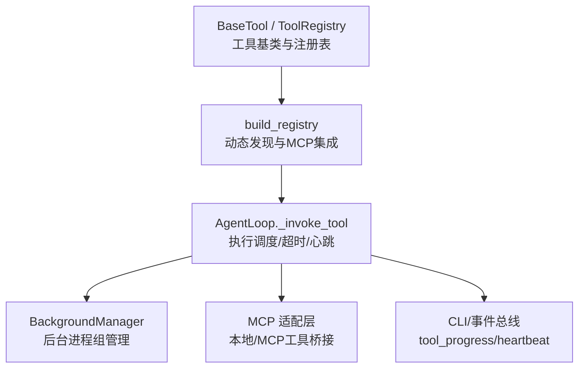
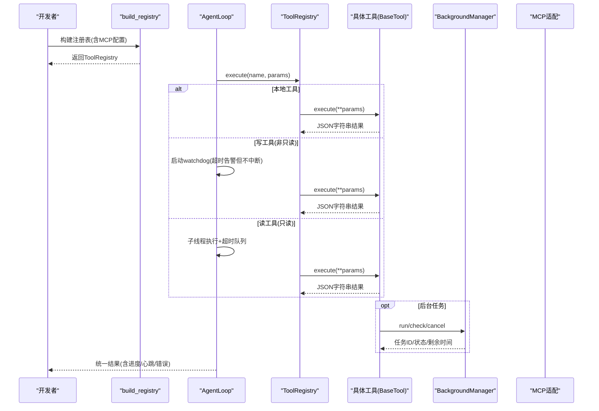
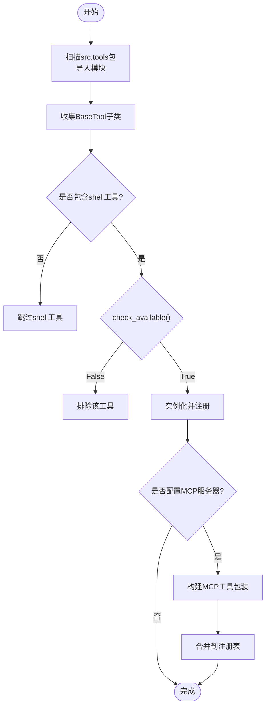
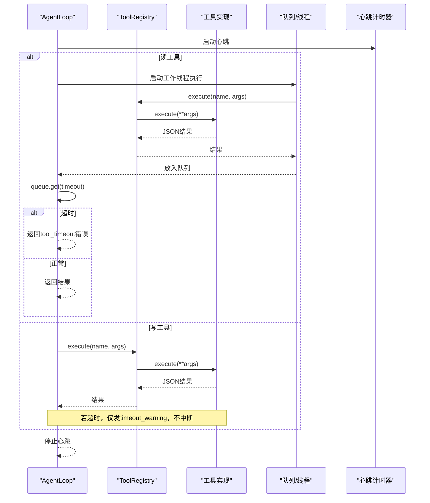
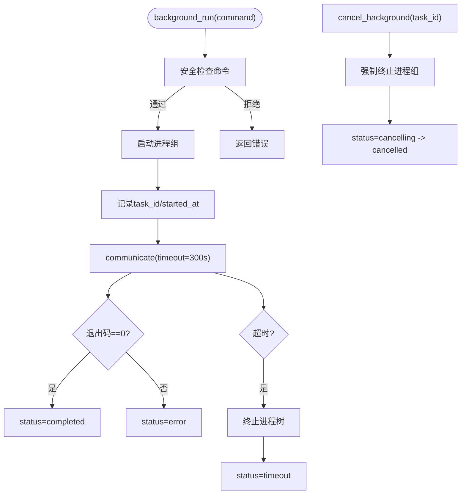
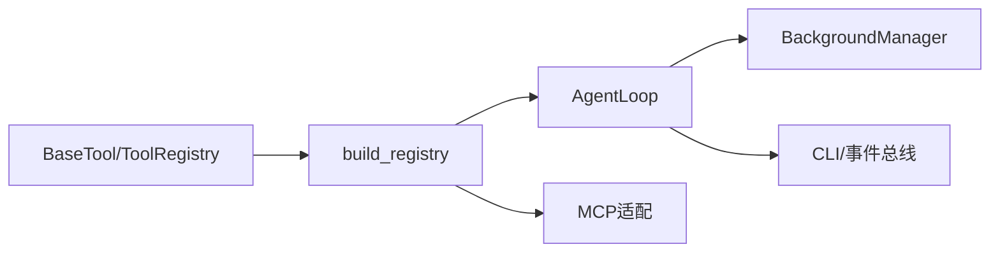

# 工具调用系统

<cite>
**本文引用的文件**
- [agent/src/agent/tools.py](file://agent/src/agent/tools.py)
- [agent/src/tools/__init__.py](file://agent/src/tools/__init__.py)
- [agent/src/agent/loop.py](file://agent/src/agent/loop.py)
- [agent/src/tools/background_tools.py](file://agent/src/tools/background_tools.py)
- [agent/mcp_server.py](file://agent/mcp_server.py)
- [agent/cli/_legacy.py](file://agent/cli/_legacy.py)
- [agent/tests/test_tool_timeout.py](file://agent/tests/test_tool_timeout.py)
- [agent/tests/test_background_tools.py](file://agent/tests/test_background_tools.py)
- [agent/tests/test_mcp_alpha_zoo_contract.py](file://agent/tests/test_mcp_alpha_zoo_contract.py)
- [agent/tests/test_sdm_governance_wiring.py](file://agent/tests/test_sdm_governance_wiring.py)
- [agent/tests/test_swarm_worker_content_filter.py](file://agent/tests/test_swarm_worker_content_filter.py)
</cite>

## 目录
1. [简介](#简介)
2. [项目结构](#项目结构)
3. [核心组件](#核心组件)
4. [架构总览](#架构总览)
5. [详细组件分析](#详细组件分析)
6. [依赖关系分析](#依赖关系分析)
7. [性能考量](#性能考量)
8. [故障排查指南](#故障排查指南)
9. [结论](#结论)
10. [附录](#附录)

## 简介
本技术文档面向工具开发者，系统性说明工具调用系统的注册机制、执行调度、结果处理与后台任务管理，并提供自定义工具开发指南、性能监控与调试技巧以及常见问题解决方案。该系统支持：
- 动态发现与注册：通过子类扫描自动发现工具，并可选择性集成远程 MCP 工具。
- 参数验证与类型检查：基于 JSON Schema 的工具描述，结合测试契约保证签名一致性。
- 同步/异步执行与超时控制：读工具在隔离线程中受超时保护；写工具不中断但会告警。
- 重试与回退：调度器具备指数退避重试策略；数据加载器具备回退链。
- 结果处理与安全过滤：统一错误包装、进度事件、内容过滤与熔断。
- 后台任务管理：进程组生命周期管理、取消、超时、通知队列与资源清理。

## 项目结构
围绕工具调用的关键模块分布如下：
- 工具基类与注册表：定义工具接口与注册表实现。
- 动态发现与构建：扫描包内模块，收集 BaseTool 子类并实例化注册。
- 执行调度：AgentLoop 负责工具调用、心跳、进度、超时与结果汇总。
- 后台任务：BackgroundManager 提供长时命令的进程组管理、取消与状态查询。
- MCP 集成：将本地工具暴露为 MCP 函数，或将远程 MCP 工具包装后注入注册表。
- CLI 与事件：CLI 消费 tool_progress/tool_heartbeat 等事件用于展示与诊断。

图表来源
- [agent/src/agent/tools.py:13-94](file://agent/src/agent/tools.py#L13-L94)
- [agent/src/tools/__init__.py:33-245](file://agent/src/tools/__init__.py#L33-L245)
- [agent/src/agent/loop.py:2736-2897](file://agent/src/agent/loop.py#L2736-L2897)
- [agent/src/tools/background_tools.py:102-319](file://agent/src/tools/background_tools.py#L102-L319)
- [agent/mcp_server.py:2277-2315](file://agent/mcp_server.py#L2277-L2315)

章节来源
- [agent/src/agent/tools.py:13-94](file://agent/src/agent/tools.py#L13-L94)
- [agent/src/tools/__init__.py:33-245](file://agent/src/tools/__init__.py#L33-L245)
- [agent/src/agent/loop.py:2736-2897](file://agent/src/agent/loop.py#L2736-L2897)
- [agent/src/tools/background_tools.py:102-319](file://agent/src/tools/background_tools.py#L102-L319)
- [agent/mcp_server.py:2277-2315](file://agent/mcp_server.py#L2277-L2315)

## 核心组件
- BaseTool：定义工具的最小契约（name、description、parameters、repeatable、is_readonly、check_available、execute、to_openai_schema）。
- ToolRegistry：维护工具映射，提供 get、get_definitions、execute 等方法，统一异常包装为 JSON 字符串。
- build_registry：动态发现 src.tools 下所有 BaseTool 子类，按策略排除 shell 工具、不可用工具，并可选注入 MCP 工具。
- AgentLoop._invoke_tool：封装工具执行的生命周期（心跳、进度、超时、读写差异处理）。
- BackgroundManager：后台进程组管理器，提供 run/check/cancel/drain_notifications。
- MCP 适配：将本地工具或远程 MCP 工具以统一方式接入注册表。

章节来源
- [agent/src/agent/tools.py:13-94](file://agent/src/agent/tools.py#L13-L94)
- [agent/src/tools/__init__.py:33-245](file://agent/src/tools/__init__.py#L33-L245)
- [agent/src/agent/loop.py:2736-2897](file://agent/src/agent/loop.py#L2736-L2897)
- [agent/src/tools/background_tools.py:102-319](file://agent/src/tools/background_tools.py#L102-L319)
- [agent/mcp_server.py:2277-2315](file://agent/mcp_server.py#L2277-L2315)

## 架构总览
下图展示了从工具注册到执行、再到结果处理的完整链路，包括 MCP 集成与后台任务。

图表来源
- [agent/src/tools/__init__.py:66-245](file://agent/src/tools/__init__.py#L66-L245)
- [agent/src/agent/loop.py:2736-2897](file://agent/src/agent/loop.py#L2736-L2897)
- [agent/src/tools/background_tools.py:102-319](file://agent/src/tools/background_tools.py#L102-L319)
- [agent/mcp_server.py:2277-2315](file://agent/mcp_server.py#L2277-L2315)

## 详细组件分析

### 工具注册机制：动态发现、参数验证、类型检查
- 动态发现：build_registry 通过 pkgutil 遍历 src.tools 包，导入每个模块，再递归收集 BaseTool 子类，缓存结果避免重复扫描。
- 可用性检查：每个工具可重写 check_available 返回 False 以静默排除（如缺少依赖）。
- 安全策略：shell 工具默认禁用，可通过 include_shell_tools 显式开启。
- 参数验证与类型检查：
  - 工具通过 parameters 声明 JSON Schema，to_openai_schema 将其转换为 OpenAI function calling 格式。
  - 测试用例校验 wrapper 签名与工具 schema 的一致性，确保必填字段与参数名一致。
  - 治理相关工具的字段必须出现在 schema 中，便于外部校验。

图表来源
- [agent/src/tools/__init__.py:33-245](file://agent/src/tools/__init__.py#L33-L245)
- [agent/src/agent/tools.py:13-51](file://agent/src/agent/tools.py#L13-L51)
- [agent/tests/test_mcp_alpha_zoo_contract.py:35-45](file://agent/tests/test_mcp_alpha_zoo_contract.py#L35-L45)
- [agent/tests/test_sdm_governance_wiring.py:174-178](file://agent/tests/test_sdm_governance_wiring.py#L174-L178)

章节来源
- [agent/src/tools/__init__.py:33-245](file://agent/src/tools/__init__.py#L33-L245)
- [agent/src/agent/tools.py:13-51](file://agent/src/agent/tools.py#L13-L51)
- [agent/tests/test_mcp_alpha_zoo_contract.py:35-45](file://agent/tests/test_mcp_alpha_zoo_contract.py#L35-L45)
- [agent/tests/test_sdm_governance_wiring.py:174-178](file://agent/tests/test_sdm_governance_wiring.py#L174-L178)

### 工具执行调度：同步/异步、超时控制、重试机制
- 执行路径：
  - 读工具（is_readonly=True）：在独立线程执行，使用队列等待结果，超过阈值则终止并返回结构化错误。
  - 写工具（is_readonly=False）：不中断执行，仅当超时后发出 timeout_warning 并继续等待完成，避免副作用被截断。
- 心跳与进度：
  - 每次调用内置 HeartbeatTimer 定期发送 tool_heartbeat。
  - 工具内部可通过 emit_progress 上报阶段信息，统一经 _emit 转发到事件总线。
- 超时控制：
  - 读工具：queue.get(timeout=...) 捕获超时，返回 error_code="tool_timeout"。
  - 写工具：watchdog 线程在超时后发出警告，但不中止任务。
- 重试机制：
  - 调度器（executor）支持指数退避重试，可配置最大连续失败次数与延迟上限。
  - 数据加载器存在 fallback chain，主源失败时尝试备用源。

图表来源
- [agent/src/agent/loop.py:2736-2897](file://agent/src/agent/loop.py#L2736-L2897)
- [agent/tests/test_tool_timeout.py:42-99](file://agent/tests/test_tool_timeout.py#L42-L99)
- [agent/src/scheduled_research/executor.py:179-207](file://agent/src/scheduled_research/executor.py#L179-L207)

章节来源
- [agent/src/agent/loop.py:2736-2897](file://agent/src/agent/loop.py#L2736-L2897)
- [agent/tests/test_tool_timeout.py:42-99](file://agent/tests/test_tool_timeout.py#L42-L99)
- [agent/src/scheduled_research/executor.py:179-207](file://agent/src/scheduled_research/executor.py#L179-L207)

### 工具结果处理：响应格式化、错误处理、安全过滤
- 统一响应格式：ToolRegistry.execute 捕获异常并返回 JSON 字符串，包含 status、error、tool 等字段。
- 进度与心跳：AgentLoop 将 tool_progress 与 tool_heartbeat 事件标准化后输出，便于 CLI/前端展示。
- 内容过滤与熔断：
  - 当 LLM 响应频繁触发内容过滤时，WorkerResult 累积 content_filter_warnings。
  - 连续多次触发会触发熔断，提前结束任务，防止无效循环。
- 安全限制：
  - shell 工具默认禁用，需显式启用。
  - 后台任务对命令进行安全检查，限制危险操作。

章节来源
- [agent/src/agent/tools.py:72-84](file://agent/src/agent/tools.py#L72-L84)
- [agent/cli/_legacy.py:620-675](file://agent/cli/_legacy.py#L620-L675)
- [agent/tests/test_swarm_worker_content_filter.py:194-228](file://agent/tests/test_swarm_worker_content_filter.py#L194-L228)
- [agent/src/tools/background_tools.py:110-139](file://agent/src/tools/background_tools.py#L110-L139)

### 后台任务管理：任务队列、进度跟踪、资源清理
- 任务生命周期：
  - run：创建任务，启动子进程组，立即返回 task_id。
  - check：查询任务状态、耗时、剩余超时时间；无 task_id 时列出全部。
  - cancel：按 task_id 安全取消进程组，避免误杀其他进程。
- 超时与清理：
  - 默认超时 300 秒，超时后终止进程树并回收管道。
  - 输出长度限制，避免过大响应阻塞。
- 通知队列：
  - 任务完成后推入通知队列，供上层轮询或消费。

图表来源
- [agent/src/tools/background_tools.py:24-99](file://agent/src/tools/background_tools.py#L24-L99)
- [agent/src/tools/background_tools.py:102-319](file://agent/src/tools/background_tools.py#L102-L319)
- [agent/tests/test_background_tools.py:331-347](file://agent/tests/test_background_tools.py#L331-L347)

章节来源
- [agent/src/tools/background_tools.py:24-99](file://agent/src/tools/background_tools.py#L24-L99)
- [agent/src/tools/background_tools.py:102-319](file://agent/src/tools/background_tools.py#L102-L319)
- [agent/tests/test_background_tools.py:331-347](file://agent/tests/test_background_tools.py#L331-L347)

### 自定义工具开发指南：接口规范、最佳实践、测试方法
- 接口规范：
  - 继承 BaseTool，实现 name、description、parameters、execute。
  - 如需条件可用，重写 check_available 返回布尔值。
  - 设置 is_readonly 区分读写工具，影响执行策略。
- 最佳实践：
  - 参数使用 JSON Schema 明确类型与约束，便于上游校验。
  - 输出始终为 JSON 字符串，错误统一包装为 {status:"error", ...}。
  - 长耗时逻辑建议走 background_run，并通过 check/cancel 管理。
  - 敏感能力（如 shell）默认禁用，按需启用。
- 测试方法：
  - 使用 build_registry 构建注册表，断言工具名存在。
  - 校验 to_openai_schema 的 properties 与 required 与实现一致。
  - 针对错误输入，断言返回的错误片段符合预期。
  - 针对超时场景，验证 tool_timeout 与事件流。

章节来源
- [agent/src/agent/tools.py:13-51](file://agent/src/agent/tools.py#L13-L51)
- [agent/src/tools/__init__.py:66-245](file://agent/src/tools/__init__.py#L66-L245)
- [agent/tests/test_institutional_holdings_tool.py:1634-1650](file://agent/tests/test_institutional_holdings_tool.py#L1634-L1650)
- [agent/tests/test_tool_timeout.py:42-99](file://agent/tests/test_tool_timeout.py#L42-L99)

## 依赖关系分析
- 低耦合高内聚：
  - BaseTool 与 ToolRegistry 解耦，工具实现只需关注业务逻辑。
  - AgentLoop 通过 registry 抽象执行，屏蔽底层工具差异。
- 直接依赖：
  - build_registry 依赖 BaseTool、pkgutil/importlib 进行动态发现。
  - AgentLoop 依赖 ToolRegistry、HeartbeatTimer、队列与线程。
  - BackgroundManager 依赖 subprocess、信号与平台差异化终止逻辑。
- 间接依赖：
  - MCP 适配层依赖 fastmcp 与远程服务协议。
  - CLI 消费事件，用于 UI 展示与诊断。

图表来源
- [agent/src/agent/tools.py:13-94](file://agent/src/agent/tools.py#L13-L94)
- [agent/src/tools/__init__.py:33-245](file://agent/src/tools/__init__.py#L33-L245)
- [agent/src/agent/loop.py:2736-2897](file://agent/src/agent/loop.py#L2736-L2897)
- [agent/src/tools/background_tools.py:102-319](file://agent/src/tools/background_tools.py#L102-L319)
- [agent/mcp_server.py:2277-2315](file://agent/mcp_server.py#L2277-L2315)

章节来源
- [agent/src/agent/tools.py:13-94](file://agent/src/agent/tools.py#L13-L94)
- [agent/src/tools/__init__.py:33-245](file://agent/src/tools/__init__.py#L33-L245)
- [agent/src/agent/loop.py:2736-2897](file://agent/src/agent/loop.py#L2736-L2897)
- [agent/src/tools/background_tools.py:102-319](file://agent/src/tools/background_tools.py#L102-L319)
- [agent/mcp_server.py:2277-2315](file://agent/mcp_server.py#L2277-L2315)

## 性能考量
- 超时与并发：
  - 读工具在子线程执行，配合超时避免阻塞主流程。
  - 写工具不中断，避免副作用丢失，但需合理设置超时阈值与告警。
- 心跳与进度：
  - 心跳频率可调，避免过多事件造成带宽压力。
  - 进度事件应精简，仅上报必要阶段信息。
- 后台任务：
  - 进程组终止策略兼顾优雅与强制，减少僵尸进程。
  - 输出裁剪限制内存占用。
- 重试与回退：
  - 指数退避降低瞬时拥塞。
  - 多源回退提升鲁棒性。

[本节为通用指导，无需特定文件引用]

## 故障排查指南
- 工具未找到：
  - 检查工具名是否正确，确认已纳入注册表。
  - 参考 ToolRegistry.execute 的错误返回格式。
- 工具超时：
  - 读工具：检查是否长时间无响应，必要时调整超时阈值。
  - 写工具：观察 timeout_warning，确认副作用是否完成。
- 后台任务卡死：
  - 使用 check_background 查看剩余时间与状态。
  - 使用 cancel_background 安全终止进程组。
- 内容过滤频繁：
  - 关注 content_filter_warnings，评估模型提示词与输入质量。
  - 连续触发将熔断，需优化输入或策略。

章节来源
- [agent/src/agent/tools.py:72-84](file://agent/src/agent/tools.py#L72-L84)
- [agent/tests/test_tool_timeout.py:42-99](file://agent/tests/test_tool_timeout.py#L42-L99)
- [agent/src/tools/background_tools.py:258-319](file://agent/src/tools/background_tools.py#L258-L319)
- [agent/tests/test_swarm_worker_content_filter.py:194-228](file://agent/tests/test_swarm_worker_content_filter.py#L194-L228)

## 结论
该工具调用系统通过清晰的基类契约、动态发现机制、严格的执行调度与后台任务管理，提供了可扩展、安全且高性能的工具生态。开发者只需遵循接口规范与最佳实践，即可快速集成新工具，并利用统一的注册表、执行框架与事件系统进行编排与观测。

[本节为总结，无需特定文件引用]

## 附录
- 常用入口与扩展点：
  - 构建注册表：build_registry（支持 MCP 集成与策略开关）。
  - 执行工具：AgentLoop._invoke_tool（心跳/进度/超时/读写差异）。
  - 后台任务：BackgroundManager.run/check/cancel。
  - MCP 暴露：mcp_server 中的工具包装与注册。
- 参考测试：
  - 超时行为：test_tool_timeout。
  - 后台任务：test_background_tools。
  - 契约一致性：test_mcp_alpha_zoo_contract。
  - 治理字段：test_sdm_governance_wiring。
  - 内容过滤：test_swarm_worker_content_filter。

章节来源
- [agent/src/tools/__init__.py:66-245](file://agent/src/tools/__init__.py#L66-L245)
- [agent/src/agent/loop.py:2736-2897](file://agent/src/agent/loop.py#L2736-L2897)
- [agent/src/tools/background_tools.py:102-319](file://agent/src/tools/background_tools.py#L102-L319)
- [agent/mcp_server.py:2277-2315](file://agent/mcp_server.py#L2277-L2315)
- [agent/tests/test_tool_timeout.py:42-99](file://agent/tests/test_tool_timeout.py#L42-L99)
- [agent/tests/test_background_tools.py:331-347](file://agent/tests/test_background_tools.py#L331-L347)
- [agent/tests/test_mcp_alpha_zoo_contract.py:35-45](file://agent/tests/test_mcp_alpha_zoo_contract.py#L35-L45)
- [agent/tests/test_sdm_governance_wiring.py:174-178](file://agent/tests/test_sdm_governance_wiring.py#L174-L178)
- [agent/tests/test_swarm_worker_content_filter.py:194-228](file://agent/tests/test_swarm_worker_content_filter.py#L194-L228)